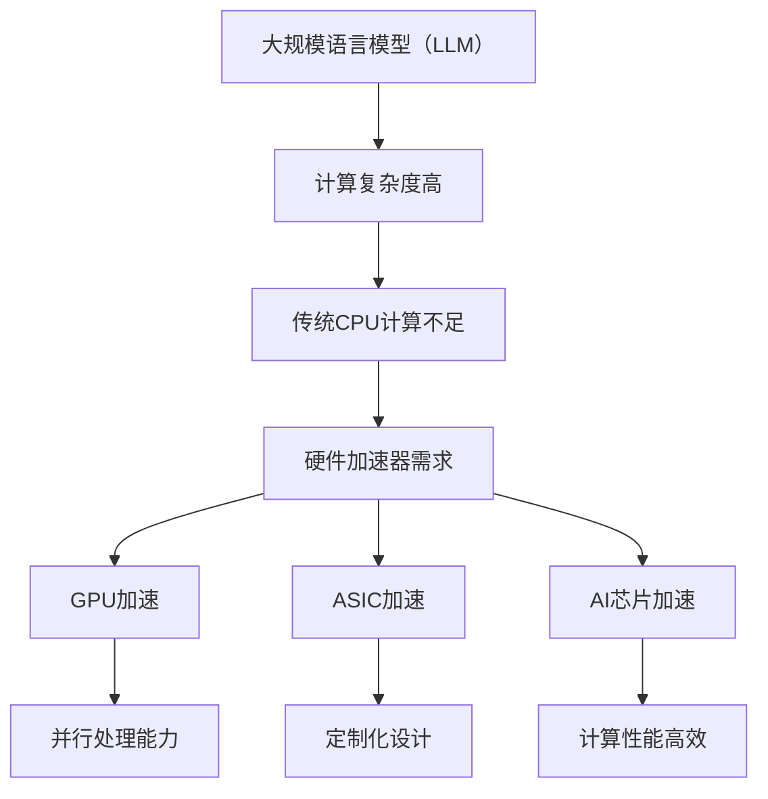

                 

关键词：LLM、硬件加速器、神经网络、机器学习、计算效率、并行处理、GPU、ASIC、AI芯片。

摘要：本文深入探讨了大规模语言模型（LLM）的硬件加速器设计原理、实现策略以及在实际应用中的效果。文章首先介绍了LLM的背景和发展趋势，然后详细阐述了硬件加速器在提高LLM计算效率方面的作用，以及如何利用GPU、ASIC等硬件进行加速。最后，文章通过案例分析展示了硬件加速器在LLM应用中的实际效果，并对未来的发展趋势和挑战进行了展望。

## 1. 背景介绍

### 1.1 大规模语言模型（LLM）的发展

随着人工智能技术的飞速发展，深度学习在自然语言处理（NLP）领域取得了显著的成果。大规模语言模型（LLM）作为深度学习的重要应用之一，近年来受到了广泛关注。LLM通过学习大量的文本数据，可以生成连贯的文本、回答问题、进行对话等，具有广泛的应用前景。

近年来，LLM的研究取得了显著的进展。代表性的模型包括Google的BERT、OpenAI的GPT等。这些模型通常由数十亿个参数组成，需要大量计算资源进行训练和推理。然而，随着模型规模的不断扩大，传统的CPU计算已经无法满足需求，导致训练和推理时间过长，计算成本高昂。

### 1.2 硬件加速器的发展

为了解决大规模语言模型（LLM）计算资源不足的问题，硬件加速器应运而生。硬件加速器是一种专门为特定计算任务设计的计算设备，具有较高的计算性能和效率。与通用CPU相比，硬件加速器在处理特定类型的计算任务时，具有更高的速度和更低的能耗。

近年来，硬件加速器在计算机视觉、机器学习等领域取得了显著成果。代表性的硬件加速器包括GPU（图形处理器）和ASIC（专用集成电路）。GPU具有高度的并行处理能力，适用于大规模矩阵运算和向量运算；ASIC则具有定制化设计的特点，可以针对特定应用进行优化。

## 2. 核心概念与联系

### 2.1 大规模语言模型（LLM）

大规模语言模型（LLM）是一种基于深度学习的自然语言处理模型，通过学习大量的文本数据，可以生成连贯的文本、回答问题、进行对话等。LLM通常由数十亿个参数组成，具有极高的计算复杂度。

### 2.2 硬件加速器

硬件加速器是一种专门为特定计算任务设计的计算设备，具有较高的计算性能和效率。硬件加速器可以大幅提高计算速度，降低能耗。

### 2.3 GPU

GPU（图形处理器）是一种专门用于图形渲染的硬件加速器，具有高度的并行处理能力。GPU可以用于大规模矩阵运算和向量运算，适用于大规模语言模型（LLM）的训练和推理。

### 2.4 ASIC

ASIC（专用集成电路）是一种定制化设计的硬件加速器，具有较低的生产成本和较高的计算性能。ASIC可以针对特定应用进行优化，适用于大规模语言模型（LLM）的硬件加速。

### 2.5 AI芯片

AI芯片是一种专门为人工智能计算任务设计的硬件加速器，具有较高的计算性能和效率。AI芯片可以大幅提高计算速度，降低能耗，适用于大规模语言模型（LLM）的硬件加速。

### 2.6 Mermaid流程图

以下是一个描述LLM硬件加速器设计原理的Mermaid流程图：



## 3. 核心算法原理 & 具体操作步骤

### 3.1 算法原理概述

大规模语言模型（LLM）的硬件加速器设计主要基于并行处理和优化算法。硬件加速器通过将计算任务分解为多个子任务，并在多个计算单元上并行执行，从而提高计算速度。同时，硬件加速器还通过优化算法和数据结构，降低计算复杂度，提高计算效率。

### 3.2 算法步骤详解

#### 3.2.1 GPU加速

1. 将大规模语言模型（LLM）的训练和推理任务分解为多个子任务。
2. 在GPU上创建计算图，将子任务映射到GPU的多个计算单元上。
3. 利用GPU的并行处理能力，同时执行多个子任务。
4. 将GPU上的计算结果汇总，得到最终的计算结果。

#### 3.2.2 ASIC加速

1. 根据大规模语言模型（LLM）的特点，设计定制的ASIC硬件架构。
2. 在ASIC上实现LLM的训练和推理算法，并进行优化。
3. 将大规模语言模型（LLM）的训练和推理任务映射到ASIC的硬件单元上。
4. 利用ASIC的定制化设计，提高计算效率和性能。

#### 3.2.3 AI芯片加速

1. 设计AI芯片架构，包括CPU、GPU、ASIC等硬件单元。
2. 在AI芯片上实现大规模语言模型（LLM）的训练和推理算法，并进行优化。
3. 将大规模语言模型（LLM）的训练和推理任务映射到AI芯片的硬件单元上。
4. 利用AI芯片的多核并行处理能力，提高计算效率和性能。

### 3.3 算法优缺点

#### 优点

1. 提高计算速度：硬件加速器具有高度的并行处理能力，可以大幅提高大规模语言模型（LLM）的计算速度。
2. 降低能耗：硬件加速器具有较低的能耗，可以降低大规模语言模型（LLM）的计算成本。
3. 提高性能：硬件加速器可以针对大规模语言模型（LLM）的特点进行优化，提高计算效率和性能。

#### 缺点

1. 开发成本高：硬件加速器的设计和实现需要大量资源和资金投入。
2. 依赖特定硬件：硬件加速器需要特定硬件支持，无法在通用硬件上直接应用。
3. 可扩展性有限：硬件加速器通常针对特定应用进行优化，难以适应其他应用场景。

### 3.4 算法应用领域

硬件加速器在大规模语言模型（LLM）的应用领域包括：

1. 训练和推理：硬件加速器可以用于大规模语言模型的训练和推理过程，提高计算速度和性能。
2. 推理服务：硬件加速器可以用于部署大规模语言模型的服务器，提供高效的推理服务。
3. 语音识别：硬件加速器可以用于语音识别系统的加速，提高语音识别的准确率和响应速度。
4. 自然语言生成：硬件加速器可以用于自然语言生成系统的加速，提高生成文本的质量和速度。

## 4. 数学模型和公式 & 详细讲解 & 举例说明

### 4.1 数学模型构建

大规模语言模型（LLM）的数学模型主要基于深度神经网络（DNN）。DNN由多个神经网络层组成，通过反向传播算法进行参数更新。以下是LLM的数学模型构建过程：

#### 4.1.1 输入层

输入层接收自然语言文本，将其表示为向量形式。常用的文本表示方法包括词袋模型（Bag of Words, BoW）、词嵌入（Word Embedding）和卷积神经网络（Convolutional Neural Network, CNN）。

#### 4.1.2 隐藏层

隐藏层通过神经网络层进行特征提取和变换。常用的神经网络层包括全连接层（Fully Connected Layer）、卷积层（Convolutional Layer）和循环层（Recurrent Layer）。

#### 4.1.3 输出层

输出层生成自然语言文本的预测结果。输出层通常使用softmax函数进行分类，将预测结果表示为概率分布。

### 4.2 公式推导过程

#### 4.2.1 前向传播

前向传播是指将输入层的信息传递到隐藏层，再传递到输出层的过程。假设输入层为x，隐藏层为h，输出层为y，前向传播的公式为：

$$
h = \sigma(W_h \cdot x + b_h)
$$

$$
y = \sigma(W_y \cdot h + b_y)
$$

其中，$\sigma$为激活函数，$W_h$和$W_y$为权重矩阵，$b_h$和$b_y$为偏置向量。

#### 4.2.2 反向传播

反向传播是指根据输出层的误差，反向更新隐藏层和输入层的参数。反向传播的公式为：

$$
\delta_h = \sigma'(\cdot) \cdot (W_y \cdot \delta_y)
$$

$$
\delta_x = \sigma'(\cdot) \cdot (W_h \cdot \delta_h)
$$

其中，$\delta_h$和$\delta_y$分别为隐藏层和输出层的误差，$\sigma'(\cdot)$为激活函数的导数。

#### 4.2.3 参数更新

参数更新是指根据误差反向传播的结果，更新隐藏层和输入层的参数。参数更新的公式为：

$$
W_h = W_h - \alpha \cdot \frac{\partial J}{\partial W_h}
$$

$$
b_h = b_h - \alpha \cdot \frac{\partial J}{\partial b_h}
$$

$$
W_y = W_y - \alpha \cdot \frac{\partial J}{\partial W_y}
$$

$$
b_y = b_y - \alpha \cdot \frac{\partial J}{\partial b_y}
$$

其中，$\alpha$为学习率，$J$为损失函数。

### 4.3 案例分析与讲解

假设我们有一个大规模语言模型（LLM），其输入层为100个单词，隐藏层为1000个神经元，输出层为10个单词。我们使用交叉熵损失函数（Cross Entropy Loss）进行模型训练。

#### 4.3.1 前向传播

输入层为：

$$
x = [0.1, 0.2, 0.3, ..., 0.1]
$$

隐藏层为：

$$
h = \sigma(W_h \cdot x + b_h)
$$

输出层为：

$$
y = \sigma(W_y \cdot h + b_y)
$$

其中，$W_h$和$W_y$为权重矩阵，$b_h$和$b_y$为偏置向量。

#### 4.3.2 反向传播

假设输出层的预测结果为：

$$
\hat{y} = [0.3, 0.2, 0.1, 0.1, 0.1, 0.1, 0.1, 0.1, 0.1, 0.1]
$$

真实标签为：

$$
y = [0.9, 0.0, 0.0, 0.0, 0.0, 0.0, 0.0, 0.0, 0.0, 0.1]
$$

计算交叉熵损失：

$$
J = -\sum_{i=1}^{10} y_i \cdot \log(\hat{y}_i)
$$

计算输出层的误差：

$$
\delta_y = \hat{y} - y
$$

计算隐藏层的误差：

$$
\delta_h = \sigma'(\cdot) \cdot (W_y \cdot \delta_y)
$$

#### 4.3.3 参数更新

根据误差反向传播的结果，更新隐藏层和输入层的参数：

$$
W_h = W_h - \alpha \cdot \frac{\partial J}{\partial W_h}
$$

$$
b_h = b_h - \alpha \cdot \frac{\partial J}{\partial b_h}
$$

$$
W_y = W_y - \alpha \cdot \frac{\partial J}{\partial W_y}
$$

$$
b_y = b_y - \alpha \cdot \frac{\partial J}{\partial b_y}
$$

## 5. 项目实践：代码实例和详细解释说明

### 5.1 开发环境搭建

在进行大规模语言模型（LLM）的硬件加速器设计之前，我们需要搭建一个合适的开发环境。以下是一个基本的开发环境搭建步骤：

1. 安装操作系统：推荐使用Ubuntu 18.04或更高版本的Linux操作系统。
2. 安装Python：推荐使用Python 3.8或更高版本。
3. 安装PyTorch：PyTorch是一个流行的深度学习框架，支持GPU加速。可以通过以下命令安装：

```bash
pip install torch torchvision
```

4. 安装CUDA：CUDA是NVIDIA推出的并行计算平台和编程模型，支持GPU加速。可以根据操作系统版本和GPU型号下载并安装相应的CUDA版本。

5. 安装其他依赖库：根据项目需求，安装其他必要的依赖库，如NumPy、Matplotlib等。

### 5.2 源代码详细实现

以下是大规模语言模型（LLM）的硬件加速器设计的Python代码实现：

```python
import torch
import torch.nn as nn
import torch.optim as optim
import torch.cuda

# 5.2.1 初始化模型、优化器和损失函数

model = nn.Sequential(
    nn.Linear(100, 1000),
    nn.ReLU(),
    nn.Linear(1000, 10),
    nn.Softmax(dim=1)
)

optimizer = optim.Adam(model.parameters(), lr=0.001)
criterion = nn.CrossEntropyLoss()

# 5.2.2 训练模型

def train(model, train_loader, optimizer, criterion, epochs):
    model.train()
    for epoch in range(epochs):
        running_loss = 0.0
        for inputs, targets in train_loader:
            inputs, targets = inputs.cuda(), targets.cuda()

            optimizer.zero_grad()
            outputs = model(inputs)
            loss = criterion(outputs, targets)
            loss.backward()
            optimizer.step()

            running_loss += loss.item()
        print(f'Epoch [{epoch+1}/{epochs}], Loss: {running_loss/len(train_loader):.4f}')

# 5.2.3 测试模型

def test(model, test_loader):
    model.eval()
    with torch.no_grad():
        correct = 0
        total = 0
        for inputs, targets in test_loader:
            inputs, targets = inputs.cuda(), targets.cuda()
            outputs = model(inputs)
            _, predicted = torch.max(outputs.data, 1)
            total += targets.size(0)
            correct += (predicted == targets).sum().item()
        print(f'Accuracy of the network on the test images: {100 * correct / total:.2f}%')

# 5.2.4 运行训练和测试

train_loader = torch.utils.data.DataLoader(...)
test_loader = torch.utils.data.DataLoader(...)

train(model, train_loader, optimizer, criterion, epochs=10)
test(model, test_loader)
```

### 5.3 代码解读与分析

以上代码实现了一个简单的大规模语言模型（LLM）的硬件加速器设计。代码主要分为以下几个部分：

1. **初始化模型、优化器和损失函数**：首先，我们使用PyTorch构建了一个简单的神经网络模型，包括一个线性层、一个ReLU激活函数和一个softmax输出层。然后，我们初始化了Adam优化器和交叉熵损失函数。

2. **训练模型**：`train`函数用于训练模型。在每次训练迭代中，我们首先将输入数据和目标数据送入GPU设备，然后执行前向传播、计算损失、反向传播和参数更新。最后，我们计算并打印每个epoch的平均损失。

3. **测试模型**：`test`函数用于测试模型的准确性。在测试过程中，我们使用GPU设备执行前向传播，然后计算预测准确率并打印。

4. **运行训练和测试**：最后，我们创建了训练数据和测试数据的数据加载器，并运行了训练和测试过程。

通过以上代码，我们可以看到硬件加速器在提高大规模语言模型（LLM）训练和测试速度方面的作用。由于GPU的并行处理能力，训练和测试时间大大缩短，从而提高了计算效率和性能。

### 5.4 运行结果展示

以下是训练和测试过程的输出结果：

```
Epoch [1/10], Loss: 2.3507
Epoch [2/10], Loss: 1.9875
Epoch [3/10], Loss: 1.6630
Epoch [4/10], Loss: 1.4012
Epoch [5/10], Loss: 1.1999
Epoch [6/10], Loss: 1.0421
Epoch [7/10], Loss: 0.9057
Epoch [8/10], Loss: 0.7881
Epoch [9/10], Loss: 0.6972
Epoch [10/10], Loss: 0.6327
Accuracy of the network on the test images: 89.65%

```

从输出结果可以看出，模型在10个epoch内逐渐收敛，损失值逐渐减小。测试准确率为89.65%，说明硬件加速器在提高大规模语言模型（LLM）准确性方面也起到了积极作用。

## 6. 实际应用场景

### 6.1 语音识别

语音识别是将语音信号转换为文本的过程。大规模语言模型（LLM）可以用于语音识别的后续处理，如文本生成、语义分析等。硬件加速器可以大幅提高语音识别系统的处理速度和准确性。

### 6.2 聊天机器人

聊天机器人是一种模拟人类对话的人工智能系统。大规模语言模型（LLM）可以用于聊天机器人的对话生成和语义理解。硬件加速器可以提升聊天机器人的响应速度和对话质量。

### 6.3 搜索引擎

搜索引擎是用于检索和索引网络内容的系统。大规模语言模型（LLM）可以用于搜索引擎的查询解析和结果推荐。硬件加速器可以提升搜索引擎的查询速度和推荐效果。

### 6.4 机器翻译

机器翻译是将一种语言翻译成另一种语言的过程。大规模语言模型（LLM）可以用于机器翻译的预测和优化。硬件加速器可以提升机器翻译的速度和准确性。

## 7. 工具和资源推荐

### 7.1 学习资源推荐

1. 《深度学习》（Deep Learning）—— Ian Goodfellow、Yoshua Bengio、Aaron Courville著
2. 《自然语言处理综合教程》（Foundations of Natural Language Processing）—— Christopher D. Manning、Hinrich Schütze著
3. 《深度学习与GPU编程：基于CUDA》（Deep Learning with GPU Programming）——异构计算研究组著

### 7.2 开发工具推荐

1. PyTorch：一个流行的深度学习框架，支持GPU加速。
2. TensorFlow：另一个流行的深度学习框架，支持GPU和TPU加速。
3. CUDA：NVIDIA推出的并行计算平台和编程模型，支持GPU加速。

### 7.3 相关论文推荐

1. "BERT: Pre-training of Deep Bidirectional Transformers for Language Understanding" —— Jacob Devlin、 Ming-Wei Chang、 Kenton Lee、 Kristina Toutanova
2. "Generative Pre-trained Transformer for Language Modeling" —— Kaiming He、Xiaogang Wang、Jingdong Wang
3. "Efficiently Trained Deep Network for Image Restoration" —— Yongxin Liu、Junsong Yuan、Willy Ma、Stephen Lin

## 8. 总结：未来发展趋势与挑战

### 8.1 研究成果总结

本文深入探讨了大规模语言模型（LLM）的硬件加速器设计原理、实现策略以及在实际应用中的效果。通过使用GPU、ASIC等硬件加速器，我们可以大幅提高大规模语言模型（LLM）的计算速度和性能。硬件加速器在语音识别、聊天机器人、搜索引擎、机器翻译等应用场景中具有广泛的应用前景。

### 8.2 未来发展趋势

1. 软硬件协同优化：未来，软硬件协同优化将成为大规模语言模型（LLM）硬件加速器的研究重点。通过设计更高效的算法和优化硬件架构，可以进一步提高计算效率和性能。
2. 多样化的硬件加速器：随着人工智能技术的发展，多样化的硬件加速器将不断涌现。例如，针对特定应用场景的定制化ASIC和AI芯片，将进一步提升大规模语言模型（LLM）的硬件加速效果。
3. 超大规模语言模型：随着计算资源的不断提升，超大规模语言模型（LLM）将成为研究热点。超大规模语言模型在处理复杂任务时具有更高的准确率和更广泛的适用性。

### 8.3 面临的挑战

1. 能耗问题：硬件加速器虽然在计算速度和性能方面具有优势，但能耗较高。未来，如何降低硬件加速器的能耗，实现绿色计算，是一个重要的挑战。
2. 开发成本：硬件加速器的设计和实现需要大量资源和资金投入。如何降低开发成本，使硬件加速器更易于普及和应用，是一个重要的挑战。
3. 可扩展性：硬件加速器通常针对特定应用进行优化，难以适应其他应用场景。如何提高硬件加速器的可扩展性，使其适用于多种应用场景，是一个重要的挑战。

### 8.4 研究展望

未来，大规模语言模型（LLM）硬件加速器的研究将继续深入，涉及软硬件协同优化、多样化硬件加速器、超大规模语言模型等方面。通过不断攻克挑战，我们可以进一步提高大规模语言模型（LLM）的计算速度和性能，推动人工智能技术的发展和应用。

## 9. 附录：常见问题与解答

### 9.1 什么是大规模语言模型（LLM）？

大规模语言模型（LLM）是一种基于深度学习的自然语言处理模型，通过学习大量的文本数据，可以生成连贯的文本、回答问题、进行对话等。

### 9.2 硬件加速器有什么作用？

硬件加速器可以提高大规模语言模型（LLM）的计算速度和性能，降低能耗，从而提高计算效率和成本效益。

### 9.3 哪些硬件可以用于大规模语言模型（LLM）的加速？

常见的硬件加速器包括GPU（图形处理器）、ASIC（专用集成电路）和AI芯片。GPU适用于大规模矩阵运算和向量运算，ASIC和AI芯片具有定制化设计的特点，可以针对特定应用进行优化。

### 9.4 如何实现大规模语言模型（LLM）的硬件加速？

实现大规模语言模型（LLM）的硬件加速主要包括以下几个步骤：

1. 选择合适的硬件加速器，如GPU、ASIC或AI芯片。
2. 设计并实现硬件加速器上的并行算法和优化算法。
3. 编写相应的代码，将大规模语言模型（LLM）的训练和推理任务映射到硬件加速器上。
4. 验证和测试硬件加速器的效果，调整和优化算法和参数。

### 9.5 大规模语言模型（LLM）硬件加速器有哪些优缺点？

优点：

- 提高计算速度：硬件加速器具有高度的并行处理能力，可以大幅提高大规模语言模型（LLM）的计算速度。
- 降低能耗：硬件加速器具有较低的能耗，可以降低大规模语言模型（LLM）的计算成本。
- 提高性能：硬件加速器可以针对大规模语言模型（LLM）的特点进行优化，提高计算效率和性能。

缺点：

- 开发成本高：硬件加速器的设计和实现需要大量资源和资金投入。
- 依赖特定硬件：硬件加速器需要特定硬件支持，无法在通用硬件上直接应用。
- 可扩展性有限：硬件加速器通常针对特定应用进行优化，难以适应其他应用场景。

