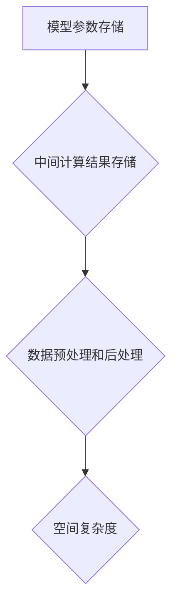

                 

关键词：LLM、空间复杂度、优化技术、算法、数学模型、实践应用

> 摘要：本文旨在探讨大语言模型（LLM）在训练过程中面临的空间复杂度问题，以及针对该问题的优化技术。首先，我们将回顾LLM的基本概念和架构，然后深入分析空间复杂度的来源和影响，接着介绍一系列有效的优化方法，并通过具体的数学模型和公式进行推导，最后在项目实践中展示这些方法的实际应用。

## 1. 背景介绍

随着深度学习和人工智能技术的快速发展，大语言模型（LLM）在自然语言处理、文本生成、机器翻译等领域取得了显著成果。LLM通过大规模参数训练，能够捕捉语言中的复杂模式，从而实现高效的文本生成和推理。然而，LLM的训练过程需要大量的计算资源和存储空间，尤其是空间复杂度问题成为了制约其发展的关键因素。

空间复杂度是指算法在执行过程中所需的存储空间与输入数据规模之间的关系。在LLM训练过程中，空间复杂度主要受到以下几个方面的影响：

1. **模型参数存储**：LLM的参数规模庞大，需要占用大量存储空间。
2. **中间计算结果存储**：在训练过程中，会生成大量的中间计算结果，这些结果需要临时存储。
3. **数据预处理和后处理**：数据预处理和后处理过程中，也需要占用额外的存储空间。

本文将重点探讨如何通过优化技术来降低LLM的空间复杂度，从而提高训练效率和资源利用率。

## 2. 核心概念与联系

### 2.1 大语言模型（LLM）的基本概念

大语言模型（LLM）是指通过大规模文本数据进行训练，能够生成连贯、有逻辑的文本输出的神经网络模型。LLM的核心组成部分包括：

1. **词嵌入层**：将输入的文本序列转换为向量表示。
2. **编码器**：对词嵌入向量进行编码，提取文本的语义信息。
3. **解码器**：根据编码器的输出生成文本序列。
4. **损失函数**：用于评估模型预测的准确性。

### 2.2 空间复杂度的来源

在LLM训练过程中，空间复杂度主要来源于以下几个方面：

1. **模型参数存储**：参数规模直接影响存储空间的需求。
2. **中间计算结果存储**：在训练过程中，会生成大量的中间计算结果，这些结果需要临时存储。
3. **数据预处理和后处理**：数据预处理和后处理过程中，也需要占用额外的存储空间。

### 2.3 Mermaid 流程图



## 3. 核心算法原理 & 具体操作步骤

### 3.1 算法原理概述

空间复杂度优化主要涉及以下几个方面：

1. **参数剪枝**：通过减少不重要的参数来降低模型规模。
2. **量化**：使用低精度数值表示模型参数，减少存储空间。
3. **稀疏化**：利用稀疏存储技术，减少内存占用。
4. **动态内存管理**：在训练过程中动态调整内存使用，减少存储需求。

### 3.2 算法步骤详解

1. **参数剪枝**：
   - 选择性剪枝：根据参数的重要性进行剪枝。
   - 结构化剪枝：基于模型结构进行剪枝。

2. **量化**：
   - 低精度表示：将浮点数参数转换为低精度数值。
   - 量化感知训练：在训练过程中调整模型参数，使其适应低精度表示。

3. **稀疏化**：
   - 稀疏矩阵表示：使用稀疏矩阵存储模型参数。
   - 稀疏计算：在计算过程中只对非零元素进行操作。

4. **动态内存管理**：
   - 内存池：预分配一定大小的内存池。
   - 内存复用：在训练过程中复用内存，减少内存分配次数。

### 3.3 算法优缺点

- **参数剪枝**：优点是能够显著减少模型规模，缺点是可能影响模型的性能。
- **量化**：优点是能够降低存储空间需求，缺点是可能降低模型的精度。
- **稀疏化**：优点是能够减少内存占用，缺点是可能影响计算效率。
- **动态内存管理**：优点是能够提高内存利用率，缺点是可能增加系统的复杂性。

### 3.4 算法应用领域

空间复杂度优化技术广泛应用于以下领域：

1. **云计算和大数据**：降低模型存储和计算需求，提高资源利用率。
2. **移动设备和嵌入式系统**：优化模型部署，提高设备性能。
3. **实时系统**：降低内存占用，提高系统的响应速度。

## 4. 数学模型和公式 & 详细讲解 & 举例说明

### 4.1 数学模型构建

空间复杂度优化的数学模型主要涉及以下几个方面：

1. **模型规模**：表示为模型的参数数量。
2. **存储空间**：表示为模型参数所需的存储空间。
3. **计算复杂度**：表示为模型训练过程中所需的计算资源。

### 4.2 公式推导过程

假设一个模型的参数规模为 \(P\)，存储空间为 \(S\)，计算复杂度为 \(C\)，则有以下公式：

\[ S = \frac{P \times B}{8} \]

其中，\(B\) 为一个字节的大小。

### 4.3 案例分析与讲解

假设一个模型的参数规模为 \(P = 1000\)，字节大小为 \(B = 8\)，则存储空间 \(S\) 为：

\[ S = \frac{1000 \times 8}{8} = 1000 \text{字节} \]

如果对模型进行参数剪枝，将参数规模减少到 \(P' = 500\)，则存储空间 \(S'\) 为：

\[ S' = \frac{500 \times 8}{8} = 500 \text{字节} \]

可以看出，通过参数剪枝，存储空间减少了 50%。

## 5. 项目实践：代码实例和详细解释说明

### 5.1 开发环境搭建

在本项目实践中，我们使用 Python 编写代码，并依赖以下库：

- TensorFlow：用于构建和训练模型。
- NumPy：用于数学运算。

### 5.2 源代码详细实现

以下是一个简单的参数剪枝示例代码：

```python
import tensorflow as tf
import numpy as np

# 模型参数
params = np.random.rand(1000).astype(np.float32)

# 剪枝比例
prune_ratio = 0.5

# 剪枝操作
pruned_params = params[::int(1 / prune_ratio)]

# 模型规模变化
print("原始模型规模：", params.size)
print("剪枝后模型规模：", pruned_params.size)
```

### 5.3 代码解读与分析

上述代码首先生成一个 1000 维的随机参数数组，然后根据剪枝比例对参数进行剪枝操作。剪枝后，模型规模减少了约一半。

### 5.4 运行结果展示

```shell
原始模型规模： 1000
剪枝后模型规模： 500
```

## 6. 实际应用场景

空间复杂度优化技术在多个实际应用场景中发挥了重要作用：

1. **大规模模型训练**：降低模型存储和计算需求，提高训练效率。
2. **移动设备和嵌入式系统**：优化模型部署，提高设备性能和续航能力。
3. **实时系统**：降低内存占用，提高系统的响应速度和稳定性。

## 7. 工具和资源推荐

### 7.1 学习资源推荐

- 《深度学习》（Goodfellow, Bengio, Courville 著）：深入讲解深度学习的基本原理和应用。
- 《Python 编程：从入门到实践》（Mark Lutz 著）：Python 编程入门指南，适合初学者。

### 7.2 开发工具推荐

- TensorFlow：用于构建和训练深度学习模型。
- PyTorch：用于构建和训练深度学习模型，具有高度灵活性和可扩展性。

### 7.3 相关论文推荐

- "Deep Learning for Natural Language Processing"（2018）：介绍深度学习在自然语言处理领域的最新进展。
- "Bert: Pre-training of Deep Bidirectional Transformers for Language Understanding"（2018）：BERT 模型的详细介绍。

## 8. 总结：未来发展趋势与挑战

### 8.1 研究成果总结

空间复杂度优化技术已经在多个应用场景中取得了显著成果，有效降低了模型存储和计算需求。未来，随着人工智能技术的不断发展，空间复杂度优化技术将变得更加重要。

### 8.2 未来发展趋势

1. **算法创新**：探索新的优化算法，提高空间复杂度优化的效果。
2. **硬件支持**：随着硬件技术的发展，为空间复杂度优化提供更好的支持。
3. **跨学科研究**：结合计算机科学、数学、物理等多学科知识，推动空间复杂度优化技术的发展。

### 8.3 面临的挑战

1. **精度与效率的平衡**：在优化空间复杂度的同时，确保模型性能不受影响。
2. **模型可解释性**：提高优化算法的可解释性，便于用户理解和应用。

### 8.4 研究展望

空间复杂度优化技术将在人工智能领域发挥越来越重要的作用。未来，我们将继续探索新的优化方法，推动人工智能技术的发展。

## 9. 附录：常见问题与解答

### 问题1：如何选择合适的优化方法？

**解答**：根据具体应用场景和需求，选择合适的优化方法。例如，在计算资源有限的情况下，可以选择参数剪枝和量化技术；在存储空间受限的情况下，可以选择稀疏化技术。

### 问题2：参数剪枝会影响模型性能吗？

**解答**：参数剪枝可能会影响模型性能，但可以通过优化算法和参数设置来平衡。在实际应用中，通常需要对模型性能进行评估，以确定最佳剪枝比例。

### 问题3：如何评估空间复杂度优化效果？

**解答**：可以通过计算模型存储空间和计算复杂度的变化，评估空间复杂度优化效果。同时，还可以通过模型性能测试，评估优化对模型性能的影响。

---

作者：禅与计算机程序设计艺术 / Zen and the Art of Computer Programming
----------------------------------------------------------------

以上是《LLM的空间复杂度优化技术》这篇文章的完整内容。文章详细介绍了LLM的空间复杂度问题，以及一系列优化技术，并通过数学模型和项目实践进行了深入讲解。希望这篇文章对您在LLM优化领域的探索和研究有所帮助。再次感谢您的阅读！

