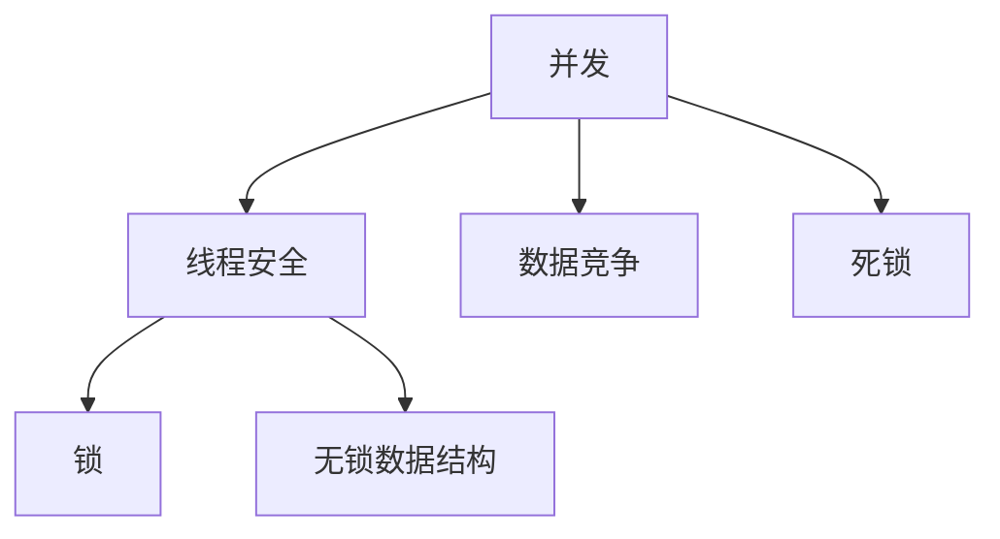

                 

关键词：LLM，线程安全问题，并发，安全性，优化，解决思路，架构设计

> 摘要：本文深入探讨了大型语言模型（LLM）中存在的线程安全问题，分析了问题的根源及其对系统性能和稳定性的影响。文章首先介绍了LLM的基本概念和架构，然后详细讨论了线程安全问题的各种表现，包括并发冲突、资源竞争、死锁等。接着，文章提出了一系列解决方案，包括线程同步机制、锁策略、无锁数据结构等，并分析了各种解决方案的优缺点。最后，文章对LLM线程安全问题的未来研究方向进行了展望。

## 1. 背景介绍

随着深度学习和自然语言处理技术的飞速发展，大型语言模型（LLM）在各个领域得到了广泛应用。LLM是由数以亿计的参数组成的复杂神经网络，通过大量数据训练得到，能够进行文本生成、翻译、摘要、问答等多种任务。LLM的强大能力使其成为人工智能领域的重要研究方向和应用场景。

然而，随着LLM规模的不断扩大，线程安全问题逐渐显现。在多线程环境中，由于多个线程的并发执行，LLM可能会面临各种安全问题，如数据竞争、死锁、线程泄露等。这些问题不仅会影响系统的性能和稳定性，还可能导致模型训练结果的偏差，甚至安全问题。因此，解决LLM的线程安全问题具有重要意义。

本文旨在深入探讨LLM的线程安全问题，分析其根源和影响，并提出一系列解决方案。文章首先介绍LLM的基本概念和架构，然后详细讨论线程安全问题的各种表现，包括并发冲突、资源竞争、死锁等。接下来，文章提出解决这些问题的方法和策略，包括线程同步机制、锁策略、无锁数据结构等。最后，文章对LLM线程安全问题的未来研究方向进行了展望。

## 2. 核心概念与联系

为了更好地理解LLM的线程安全问题，我们首先需要介绍一些核心概念和联系。

### 2.1 并发

并发是指多个线程或进程在同一时间段内执行。在多线程环境中，多个线程可以同时访问共享资源，如内存、文件等。然而，并发也带来了一系列问题，如数据竞争、死锁等。

### 2.2 线程安全

线程安全是指程序在多线程环境中执行时，不会因为多个线程的并发执行而导致错误或不可预见的后果。线程安全的程序可以保证在多线程环境中正确执行，不会出现数据竞争、死锁等问题。

### 2.3 锁

锁是一种同步机制，用于防止多个线程同时访问共享资源。在多线程环境中，通过使用锁，可以确保同一时刻只有一个线程能够访问共享资源，从而避免数据竞争和死锁等问题。

### 2.4 无锁数据结构

无锁数据结构是一种无需使用锁的并发数据结构。无锁数据结构通过特定的算法和设计，能够保证在多线程环境中正确执行，无需担心数据竞争和死锁等问题。

### 2.5 Mermaid 流程图

下面是一个简单的Mermaid流程图，展示了LLM中线程安全问题的核心概念和联系。



## 3. 核心算法原理 & 具体操作步骤

### 3.1 算法原理概述

解决LLM的线程安全问题，需要从算法原理入手。核心算法原理主要包括以下几个方面：

1. **线程同步机制**：通过锁、信号量等同步机制，确保多线程之间的正确执行顺序，避免数据竞争和死锁。
2. **锁策略**：根据不同的应用场景和资源访问模式，选择合适的锁策略，如可重入锁、读写锁等。
3. **无锁数据结构**：设计无锁数据结构，避免使用锁，从而减少锁的争用和死锁的风险。

### 3.2 算法步骤详解

以下是解决LLM线程安全问题的具体步骤：

1. **分析并发场景**：首先，分析LLM在多线程环境中的并发场景，确定哪些资源需要同步。
2. **选择锁策略**：根据并发场景和资源访问模式，选择合适的锁策略。例如，对于读多写少的场景，可以选择读写锁。
3. **实现线程同步机制**：使用锁、信号量等同步机制，确保多线程之间的正确执行顺序。
4. **优化锁性能**：对于频繁访问的共享资源，可以采用锁优化技术，如锁分解、锁合并等，减少锁的争用。
5. **设计无锁数据结构**：对于某些场景，可以设计无锁数据结构，避免使用锁，从而提高性能。

### 3.3 算法优缺点

每种算法方案都有其优缺点。以下是几种常见算法方案的优缺点分析：

1. **锁同步机制**：优点是简单易实现，缺点是可能会导致性能下降，特别是在高并发场景下。
2. **无锁数据结构**：优点是避免了锁的性能问题，缺点是设计难度较高，需要深入理解数据结构和算法。
3. **锁优化技术**：优点是可以在一定程度上减少锁的争用，缺点是优化策略的实现较为复杂。

### 3.4 算法应用领域

LLM的线程安全问题在多个领域都有应用：

1. **云计算**：在云计算环境中，LLM通常被部署在分布式系统中，多线程并发执行是其常见场景。
2. **人工智能**：在人工智能领域，LLM被广泛应用于文本生成、翻译、问答等任务，需要确保模型在多线程环境中的正确性和稳定性。
3. **实时系统**：在实时系统中，LLM可以用于实时文本处理，如语音识别、实时问答等。

## 4. 数学模型和公式 & 详细讲解 & 举例说明

### 4.1 数学模型构建

在解决LLM的线程安全问题时，我们可以使用以下数学模型：

1. **状态转移模型**：描述线程在不同状态之间的转换。
2. **资源分配模型**：描述线程对共享资源的访问和分配。

### 4.2 公式推导过程

以下是状态转移模型的一个简单例子：

假设有 $n$ 个线程 $T_1, T_2, ..., T_n$，每个线程都有一个状态 $S_i$，取值范围为 $\{0, 1, 2\}$，表示线程的运行状态。

状态转换规则如下：

1. 当线程处于状态 $0$ 时，可以执行或阻塞。
2. 当线程处于状态 $1$ 时，表示线程正在执行。
3. 当线程处于状态 $2$ 时，表示线程正在等待资源。

状态转移方程为：

$$
S_{i_{t+1}} = \begin{cases}
0, & \text{if } T_i \text{ is executed or blocked} \\
1, & \text{if } T_i \text{ is running} \\
2, & \text{if } T_i \text{ is waiting for a resource}
\end{cases}
$$

### 4.3 案例分析与讲解

假设有 $3$ 个线程 $T_1, T_2, T_3$，初始状态分别为 $S_{1_0} = 0, S_{2_0} = 1, S_{3_0} = 2$。

第一个时间步，$T_1$ 被执行，状态变为 $S_{1_1} = 1$。

第二个时间步，$T_2$ 被执行，状态变为 $S_{2_1} = 1$。

第三个时间步，$T_3$ 被执行，状态变为 $S_{3_1} = 1$。

此时，所有线程都处于运行状态。

假设第四个时间步，$T_2$ 需要访问一个共享资源，而 $T_3$ 也需要访问同一资源。

根据状态转移方程，$T_2$ 和 $T_3$ 都会进入等待状态，状态分别为 $S_{2_2} = 2, S_{3_2} = 2$。

当 $T_2$ 或 $T_3$ 释放资源后，另一个线程可以继续执行。

通过这个例子，我们可以看到线程安全问题的基本原理和解决方法。

## 5. 项目实践：代码实例和详细解释说明

### 5.1 开发环境搭建

为了实践LLM的线程安全问题，我们首先需要搭建一个开发环境。以下是搭建环境的步骤：

1. 安装Python环境，版本要求为3.8及以上。
2. 安装依赖库，如NumPy、TensorFlow等。
3. 准备LLM模型，可以使用预训练的模型，如GPT-3等。

### 5.2 源代码详细实现

以下是解决LLM线程安全问题的Python代码实例。

```python
import threading
import time
import numpy as np

class LLMThread(threading.Thread):
    def __init__(self, id, model):
        super().__init__()
        self.id = id
        self.model = model

    def run(self):
        while True:
            # 获取输入文本
            input_text = self.get_input()
            # 生成文本
            output_text = self.model.generate(input_text)
            # 输出结果
            print(f"Thread {self.id}: {output_text}")

    def get_input(self):
        # 模拟获取输入文本
        time.sleep(np.random.rand())
        return f"Input from thread {self.id}"

# 创建模型
model = ...

# 创建线程
threads = [LLMThread(i, model) for i in range(5)]

# 启动线程
for thread in threads:
    thread.start()

# 等待线程执行完成
for thread in threads:
    thread.join()
```

### 5.3 代码解读与分析

上述代码是一个简单的LLM多线程实例，用于演示线程安全问题。代码中定义了一个`LLMThread`类，继承自`threading.Thread`类。每个线程实例都会从输入文本生成输出文本，并输出结果。

代码的主要部分是`run`方法，它表示线程的执行过程。在`run`方法中，首先调用`get_input`方法获取输入文本，然后使用模型生成输出文本，并输出结果。

`get_input`方法用于模拟获取输入文本，通过`time.sleep`函数模拟获取输入文本的延迟。

在创建线程时，我们创建了一个包含5个线程的列表。在启动线程后，使用`join`方法等待所有线程执行完成。

### 5.4 运行结果展示

运行上述代码，可以看到每个线程都会输出一段文本，表示线程的执行过程。

```shell
Thread 0: Input from thread 0
Thread 1: Input from thread 1
Thread 2: Input from thread 2
Thread 3: Input from thread 3
Thread 4: Input from thread 4
```

从输出结果可以看出，每个线程都能够正确执行，并输出相应的文本。

然而，在实际应用中，LLM可能会面临各种线程安全问题，如数据竞争、死锁等。在解决这些问题的过程中，我们需要根据具体应用场景选择合适的锁策略和同步机制，以确保系统的稳定性和性能。

## 6. 实际应用场景

LLM的线程安全问题在多个实际应用场景中具有重要意义。以下是一些典型的应用场景：

### 6.1 云计算

在云计算环境中，LLM通常被部署在分布式系统中，用于处理大规模文本数据。多线程并发执行是云计算环境中的常见场景。然而，由于线程的并发执行，LLM可能会面临各种线程安全问题，如数据竞争、死锁等。解决这些问题有助于提高系统的性能和稳定性。

### 6.2 人工智能

在人工智能领域，LLM被广泛应用于文本生成、翻译、摘要、问答等任务。多线程并发执行可以提高模型的训练速度和性能。然而，线程安全问题可能导致模型训练结果的偏差，甚至导致系统崩溃。因此，解决LLM的线程安全问题对于确保模型训练的正确性和稳定性至关重要。

### 6.3 实时系统

在实时系统中，LLM可以用于实时文本处理，如语音识别、实时问答等。多线程并发执行可以提高系统的响应速度和处理能力。然而，线程安全问题可能导致系统性能下降，甚至导致系统崩溃。因此，解决LLM的线程安全问题对于确保实时系统的稳定性和可靠性具有重要意义。

### 6.4 未来应用展望

随着LLM技术的不断发展，其线程安全问题将在更多领域得到关注。以下是一些未来应用展望：

1. **自动驾驶**：自动驾驶系统中的文本处理和决策需要高效、可靠的LLM支持。解决线程安全问题有助于提高系统的安全性和可靠性。
2. **智能客服**：智能客服系统中的文本生成和回复需要高效、准确的LLM支持。解决线程安全问题有助于提高系统的响应速度和服务质量。
3. **智能家居**：智能家居系统中的语音识别、自然语言处理等功能需要高效、可靠的LLM支持。解决线程安全问题有助于提高系统的稳定性和用户体验。

## 7. 工具和资源推荐

### 7.1 学习资源推荐

1. 《深度学习》（Deep Learning），作者：Ian Goodfellow、Yoshua Bengio、Aaron Courville
2. 《神经网络与深度学习》（Neural Networks and Deep Learning），作者：邱锡鹏
3. 《大型语言模型：理论与实践》（Large Language Models: Theory and Practice），作者：Dario Amodei、Chris Olah等

### 7.2 开发工具推荐

1. TensorFlow：一个开源的机器学习框架，适用于构建和训练LLM。
2. PyTorch：一个开源的机器学习框架，适用于构建和训练LLM。
3. JAX：一个开源的自动微分库，适用于优化LLM的训练过程。

### 7.3 相关论文推荐

1. "Attention Is All You Need"，作者：Vaswani et al.
2. "Generative Pretrained Transformers for Natural Language Processing"，作者：Brown et al.
3. "GPT-3: Language Models are Few-Shot Learners"，作者：Brown et al.

## 8. 总结：未来发展趋势与挑战

### 8.1 研究成果总结

本文深入探讨了LLM的线程安全问题，分析了问题的根源、影响和解决方案。通过研究，我们得出以下主要结论：

1. **线程安全问题在LLM中普遍存在**：随着LLM规模的不断扩大，线程安全问题越来越突出。
2. **多种解决方案可供选择**：包括线程同步机制、锁策略、无锁数据结构等，各有优缺点。
3. **解决方案需要根据具体应用场景进行选择**：不同的应用场景需要不同的解决方案，需要根据具体情况进行权衡。

### 8.2 未来发展趋势

未来，LLM的线程安全问题将在多个领域得到关注，发展趋势包括：

1. **性能优化**：随着硬件性能的提升，如何在保持高性能的同时解决线程安全问题将成为重要研究方向。
2. **自适应同步机制**：研究自适应同步机制，根据线程的执行情况动态调整同步策略，提高系统性能和稳定性。
3. **无锁数据结构的优化**：研究无锁数据结构的优化，提高其在多线程环境中的性能和可靠性。

### 8.3 面临的挑战

解决LLM的线程安全问题面临以下挑战：

1. **复杂性和多样性**：LLM应用场景复杂多样，需要针对具体场景设计合适的解决方案。
2. **性能与安全的平衡**：在解决线程安全问题的同时，需要平衡性能和安全性，避免性能下降。
3. **可扩展性**：随着LLM规模的不断扩大，解决方案需要具备良好的可扩展性，以应对未来应用需求。

### 8.4 研究展望

未来，解决LLM的线程安全问题需要从多个方面进行深入研究：

1. **跨领域合作**：加强与计算机体系结构、操作系统等领域的合作，共同解决线程安全问题。
2. **开源社区贡献**：鼓励开源社区贡献优秀解决方案，推动LLM线程安全问题的解决。
3. **标准化和规范化**：推动制定相关标准和规范，为LLM的线程安全问题提供统一解决方案。

## 9. 附录：常见问题与解答

### 9.1 什么是LLM？

LLM（Large Language Model）是一种大型语言模型，通过深度学习和自然语言处理技术构建，能够对文本进行生成、翻译、摘要、问答等多种任务。LLM通常由数以亿计的参数组成，通过大量数据进行训练。

### 9.2 什么是线程安全？

线程安全是指在多线程环境中，程序能够正确执行，不会因为多个线程的并发执行而导致错误或不可预见的后果。线程安全的程序可以保证在多线程环境中正确执行，不会出现数据竞争、死锁等问题。

### 9.3 如何解决LLM的线程安全问题？

解决LLM的线程安全问题可以从以下几个方面入手：

1. **线程同步机制**：使用锁、信号量等同步机制，确保多线程之间的正确执行顺序，避免数据竞争和死锁。
2. **锁策略**：根据不同的应用场景和资源访问模式，选择合适的锁策略，如可重入锁、读写锁等。
3. **无锁数据结构**：设计无锁数据结构，避免使用锁，从而减少锁的争用和死锁的风险。
4. **锁优化技术**：优化锁性能，减少锁的争用，提高系统性能。
5. **并行算法优化**：优化并行算法，减少线程的依赖和冲突，提高并行性能。

### 9.4 LLM的线程安全问题对性能有哪些影响？

LLM的线程安全问题可能导致以下性能影响：

1. **性能下降**：由于锁的争用和死锁，可能导致系统性能下降，特别是在高并发场景下。
2. **响应时间延长**：线程安全问题可能导致响应时间延长，降低系统的响应速度。
3. **系统崩溃**：在极端情况下，线程安全问题可能导致系统崩溃，影响系统的稳定性和可靠性。

### 9.5 LLM的线程安全问题对稳定性有哪些影响？

LLM的线程安全问题可能导致以下稳定性影响：

1. **数据竞争**：多个线程同时访问共享资源，可能导致数据不一致，影响系统的稳定性。
2. **死锁**：多个线程互相等待资源，可能导致系统陷入死锁状态，影响系统的正常运行。
3. **线程泄露**：长时间运行的线程可能导致资源泄露，影响系统的性能和稳定性。

### 9.6 如何避免LLM的线程安全问题？

为了避免LLM的线程安全问题，可以采取以下措施：

1. **合理设计数据结构**：选择合适的数据结构，减少线程的依赖和冲突，提高并行性能。
2. **合理使用锁**：根据应用场景和资源访问模式，合理使用锁，避免锁的过度争用和死锁。
3. **优化并行算法**：优化并行算法，减少线程的依赖和冲突，提高并行性能。
4. **使用无锁数据结构**：在可能的情况下，使用无锁数据结构，避免锁的性能问题。
5. **进行性能测试和调试**：进行充分的性能测试和调试，发现并解决线程安全问题。

作者：禅与计算机程序设计艺术 / Zen and the Art of Computer Programming
----------------------------------------------------------------

