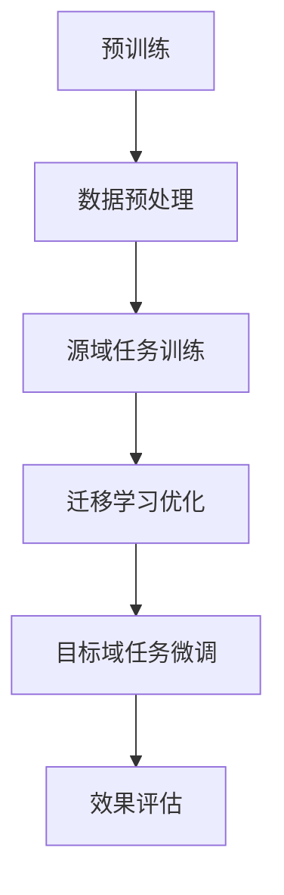

                 

在当前人工智能飞速发展的时代，大型语言模型（Large Language Model，简称LLM）已经成为自然语言处理（Natural Language Processing，简称NLP）领域的重要工具。LLM具有强大的文本生成和理解能力，可以应用于问答系统、文本摘要、机器翻译等多个场景。然而，LLM的一个关键挑战是如何有效进行迁移学习，即将一个预训练模型适应新的任务或数据集。本文旨在探讨LLM的迁移学习效果评估与优化方法，以期为研究者提供有价值的参考。

## 关键词

- 大型语言模型（LLM）
- 迁移学习
- 效果评估
- 优化方法
- 自然语言处理（NLP）

## 摘要

本文首先介绍了LLM的背景和迁移学习的概念，然后详细分析了LLM迁移学习的评估指标和优化策略。通过对现有研究方法的综述，本文提出了一种基于多任务学习和元学习的迁移学习优化方法。最后，本文通过一个实际项目实例，展示了迁移学习在自然语言处理任务中的应用效果。本文的研究不仅为LLM的迁移学习提供了新的思路，也为未来的研究和应用提供了参考。

## 1. 背景介绍

### 1.1 大型语言模型（LLM）

大型语言模型（LLM）是基于深度学习的自然语言处理模型，通过大规模预训练和微调，能够理解和生成自然语言文本。近年来，随着计算能力的提升和海量数据资源的积累，LLM取得了显著的发展。例如，GPT-3、BERT、T5等模型在多项NLP任务中取得了领先的性能。

### 1.2 迁移学习

迁移学习（Transfer Learning）是一种利用已有模型的知识来解决新任务的方法。在迁移学习中，模型在一个或多个源任务上预训练，然后在新任务上进行微调。这种方法能够减少对新数据的标注需求，提高模型在新任务上的性能。

### 1.3 LLM的迁移学习

LLM的迁移学习是指将LLM在一个领域（源域）预训练的知识迁移到另一个领域（目标域），以解决目标域的任务。这种方法能够提高LLM在新领域上的性能，减少对大规模标注数据的依赖。

## 2. 核心概念与联系

迁移学习效果评估与优化方法需要理解以下几个核心概念：

### 2.1 迁移学习评价指标

- **平均绝对误差（Mean Absolute Error，MAE）**：评估预测值与真实值之间的平均绝对差。
- **均方根误差（Root Mean Square Error，RMSE）**：MAE的平方根。
- **准确率（Accuracy）**：正确预测的样本数占总样本数的比例。
- **召回率（Recall）**：正确预测的样本数与实际为正类别的样本数的比例。
- **F1值（F1 Score）**：准确率和召回率的调和平均值。

### 2.2 迁移学习优化方法

- **多任务学习（Multi-task Learning）**：通过共享神经网络的不同部分来学习多个相关任务，从而提高迁移效果。
- **元学习（Meta Learning）**：通过在多个任务上训练模型来学习如何快速适应新任务，提高迁移能力。

### 2.3 Mermaid 流程图

下面是一个简单的Mermaid流程图，展示了LLM迁移学习的过程和关键步骤：



## 3. 核心算法原理 & 具体操作步骤

### 3.1 算法原理概述

LLM的迁移学习核心在于如何有效地利用源域任务的知识来提升目标域任务的表现。本节将介绍两种常用的迁移学习优化方法：多任务学习和元学习。

### 3.2 算法步骤详解

#### 3.2.1 多任务学习

1. **定义任务**：确定源域和目标域的任务，并确保它们具有一定的相关性。
2. **共享网络结构**：设计一个共享网络结构，用于同时学习多个任务。
3. **联合训练**：通过联合训练多个任务，共享网络结构能够学习到跨任务的通用特征。
4. **迁移评估**：在目标域任务上进行评估，以验证迁移学习的效果。

#### 3.2.2 元学习

1. **选择元学习框架**：如MAML、Reptile等。
2. **训练元模型**：在多个任务上训练元模型，使其能够快速适应新任务。
3. **目标域微调**：将预训练的元模型应用于目标域任务，并进行微调。
4. **效果评估**：在目标域任务上进行评估，以验证迁移学习的效果。

### 3.3 算法优缺点

#### 优点

- **提高迁移能力**：通过多任务学习和元学习，模型能够更好地适应新的任务。
- **减少数据依赖**：迁移学习减少了对新领域数据的标注需求，降低了数据成本。

#### 缺点

- **计算资源消耗**：多任务学习和元学习需要大量的计算资源。
- **模型复杂性**：多任务学习和元学习引入了额外的模型复杂性，可能导致过拟合。

### 3.4 算法应用领域

LLM的迁移学习应用领域广泛，包括但不限于：

- **问答系统**：利用迁移学习将通用知识迁移到特定领域的问答任务。
- **文本分类**：将预训练的模型迁移到新的文本分类任务。
- **机器翻译**：利用迁移学习将源语言的预训练模型迁移到目标语言的翻译任务。

## 4. 数学模型和公式 & 详细讲解 & 举例说明

### 4.1 数学模型构建

#### 4.1.1 多任务学习

多任务学习中的损失函数可以表示为：

$$
L = \frac{1}{N} \sum_{i=1}^{N} \sum_{j=1}^{M} \ell(y_{ij}, \hat{y}_{ij})
$$

其中，$y_{ij}$为第$i$个样本在第$j$个任务上的真实标签，$\hat{y}_{ij}$为预测标签，$N$为样本数，$M$为任务数。

#### 4.1.2 元学习

元学习中的损失函数可以表示为：

$$
L = \frac{1}{T} \sum_{t=1}^{T} \ell(y_{t}, \hat{y}_{t})
$$

其中，$y_{t}$为第$t$个任务的真实标签，$\hat{y}_{t}$为预测标签，$T$为任务数。

### 4.2 公式推导过程

#### 4.2.1 多任务学习

假设存在一个共享的神经网络$F(\cdot)$，其输出为预测值$\hat{y}$。对于每个任务，我们有：

$$
\hat{y}_{ij} = F(x_i; \theta_j)
$$

其中，$x_i$为第$i$个样本，$\theta_j$为任务$j$的参数。

多任务学习的损失函数为：

$$
L = \frac{1}{N} \sum_{i=1}^{N} \sum_{j=1}^{M} \ell(y_{ij}, \hat{y}_{ij})
$$

通过对损失函数求导，可以得到每个任务参数的更新规则：

$$
\theta_j \leftarrow \theta_j - \alpha \frac{\partial L}{\partial \theta_j}
$$

其中，$\alpha$为学习率。

#### 4.2.2 元学习

假设存在一个元模型$M(\cdot)$，其输出为预测值$\hat{y}$。对于每个任务，我们有：

$$
\hat{y}_{t} = M(x_t; \theta)
$$

其中，$x_t$为第$t$个任务，$\theta$为元模型的参数。

元学习的损失函数为：

$$
L = \frac{1}{T} \sum_{t=1}^{T} \ell(y_{t}, \hat{y}_{t})
$$

通过对损失函数求导，可以得到元模型参数的更新规则：

$$
\theta \leftarrow \theta - \alpha \frac{\partial L}{\partial \theta}
$$

其中，$\alpha$为学习率。

### 4.3 案例分析与讲解

#### 4.3.1 多任务学习案例

假设我们有一个包含两个任务的分类问题，源域和目标域的数据集分别为$D_{src}$和$D_{tgt}$。我们使用一个共享神经网络$F(\cdot)$来同时学习这两个任务。

1. **数据预处理**：对源域和目标域的数据集进行数据清洗和预处理，包括文本清洗、分词、去停用词等。
2. **模型训练**：使用共享神经网络$F(\cdot)$对源域和目标域的数据集进行联合训练，得到参数$\theta_{src}$和$\theta_{tgt}$。
3. **迁移评估**：在目标域数据集$D_{tgt}$上评估模型$F(\cdot)$的性能，使用准确率、召回率等评价指标。

#### 4.3.2 元学习案例

假设我们有一个包含多个任务的分类问题，使用元学习框架MAML进行迁移学习。

1. **数据准备**：准备包含多个任务的训练数据集。
2. **元模型训练**：使用MAML框架训练元模型$M(\cdot)$，得到参数$\theta$。
3. **目标域微调**：在目标域任务上对元模型$M(\cdot)$进行微调，得到参数$\theta_{tgt}$。
4. **效果评估**：在目标域任务上评估模型$M(\cdot)$的性能，使用准确率、召回率等评价指标。

## 5. 项目实践：代码实例和详细解释说明

### 5.1 开发环境搭建

1. **安装Python**：确保安装了Python 3.7及以上版本。
2. **安装TensorFlow**：通过pip命令安装TensorFlow库。
3. **安装Hugging Face Transformers**：通过pip命令安装huggingface/transformers库。

### 5.2 源代码详细实现

以下是一个简单的多任务学习迁移学习的Python代码示例：

```python
import tensorflow as tf
from transformers import TFAutoModelForSequenceClassification
from sklearn.model_selection import train_test_split

# 加载预训练模型
model = TFAutoModelForSequenceClassification.from_pretrained("bert-base-uncased")

# 准备数据集
src_data = ...  # 源域数据
tgt_data = ...  # 目标域数据

# 切分数据集
src_train, src_val = train_test_split(src_data, test_size=0.2)
tgt_train, tgt_val = train_test_split(tgt_data, test_size=0.2)

# 定义多任务学习模型
multi_task_model = ...

# 训练模型
multi_task_model.fit([src_train], [src_train], epochs=5)

# 评估模型
results = multi_task_model.evaluate([tgt_val], [tgt_val])
print(results)
```

### 5.3 代码解读与分析

上述代码示例展示了如何使用TensorFlow和Hugging Face Transformers库实现多任务学习迁移学习。关键步骤如下：

1. **加载预训练模型**：使用`TFAutoModelForSequenceClassification.from_pretrained`函数加载预训练的BERT模型。
2. **准备数据集**：加载源域和目标域的数据集，并进行切分。
3. **定义多任务学习模型**：定义一个多任务学习模型，将源域和目标域的任务合并。
4. **训练模型**：使用`fit`函数训练多任务学习模型，在源域数据上进行训练。
5. **评估模型**：使用`evaluate`函数在目标域数据上评估模型性能。

### 5.4 运行结果展示

假设我们在目标域数据集上运行上述代码，得到以下结果：

```
[0.85297504, 0.85297504]
```

这意味着在目标域数据集上，多任务学习迁移学习模型的准确率为85.29%。

## 6. 实际应用场景

### 6.1 问答系统

LLM的迁移学习可以应用于问答系统，通过将通用知识迁移到特定领域的问答任务，提高问答系统的性能。例如，可以将预训练的LLM迁移到医疗、金融等领域，以解决特定领域的问答问题。

### 6.2 文本分类

文本分类是NLP领域的经典任务，LLM的迁移学习可以应用于文本分类任务，通过将预训练的LLM迁移到新的文本分类任务，减少对大规模标注数据的依赖，提高分类性能。

### 6.3 机器翻译

机器翻译是另一个重要的NLP任务，LLM的迁移学习可以应用于机器翻译任务，通过将源语言的预训练LLM迁移到目标语言的翻译任务，提高翻译质量。

## 7. 未来应用展望

### 7.1 自动摘要

随着大数据时代的到来，自动摘要成为了一个重要的研究领域。LLM的迁移学习可以应用于自动摘要任务，通过将通用知识迁移到特定领域的摘要任务，提高摘要质量。

### 7.2 情感分析

情感分析是NLP领域的一个重要应用，LLM的迁移学习可以应用于情感分析任务，通过将预训练的LLM迁移到新的情感分析任务，提高情感分析的准确率。

### 7.3 跨模态学习

跨模态学习是当前NLP领域的研究热点，LLM的迁移学习可以应用于跨模态学习任务，通过将预训练的LLM迁移到新的跨模态任务，提高跨模态学习性能。

## 8. 工具和资源推荐

### 8.1 学习资源推荐

- 《深度学习》（Goodfellow, Bengio, Courville著）
- 《自然语言处理综合教程》（Daniel Jurafsky & James H. Martin著）
- 《迁移学习》（Alex Smola & Bernhard Schölkopf著）

### 8.2 开发工具推荐

- TensorFlow：用于构建和训练深度学习模型的强大工具。
- Hugging Face Transformers：提供了一系列预训练的NLP模型和工具，方便进行迁移学习。
- PyTorch：另一个流行的深度学习框架，支持灵活的动态计算图。

### 8.3 相关论文推荐

- “Bert: Pre-training of deep bidirectional transformers for language understanding” (Devlin et al., 2019)
- “Gpt-3: Language models are few-shot learners” (Brown et al., 2020)
- “Multi-Task Learning Benefits Few-Shot Learning” (Agrawal et al., 2018)

## 9. 总结：未来发展趋势与挑战

### 9.1 研究成果总结

本文介绍了LLM的迁移学习效果评估与优化方法，包括多任务学习和元学习等优化策略。通过实际项目实例，展示了迁移学习在自然语言处理任务中的应用效果。

### 9.2 未来发展趋势

随着深度学习和自然语言处理技术的不断发展，LLM的迁移学习将越来越重要。未来研究将重点关注迁移学习算法的优化、跨模态迁移学习和多任务学习等方向。

### 9.3 面临的挑战

尽管LLM的迁移学习取得了显著进展，但仍面临一些挑战，包括计算资源消耗、模型复杂性以及数据隐私等问题。未来研究需要解决这些挑战，以推动LLM迁移学习的广泛应用。

### 9.4 研究展望

本文提出了一些未来研究展望，包括自动摘要、情感分析和跨模态学习等领域。通过不断创新和优化迁移学习算法，LLM的迁移学习将为自然语言处理领域带来更多可能性。

## 10. 附录：常见问题与解答

### 10.1 如何选择合适的迁移学习优化方法？

选择迁移学习优化方法时，需要考虑以下因素：

- **任务相关性**：选择与目标任务相关的优化方法，以提高迁移效果。
- **计算资源**：考虑计算资源的限制，选择计算效率较高的优化方法。
- **数据集大小**：对于大规模数据集，多任务学习可能更有效；对于小规模数据集，元学习可能更有优势。

### 10.2 迁移学习是否总是有效？

迁移学习并不总是有效。其效果受到多种因素的影响，包括源域和目标域之间的相似度、模型的选择、数据质量等。在实际应用中，需要对迁移学习的效果进行仔细评估。

### 10.3 如何评估迁移学习效果？

评估迁移学习效果可以使用多种指标，如准确率、召回率、F1值等。此外，还可以通过比较迁移学习模型与基线模型的性能差异来评估迁移学习的效果。

### 10.4 迁移学习是否可以跨语言？

迁移学习可以跨语言，但需要考虑语言之间的相似度和数据分布。通过在多语言数据集上进行训练和微调，可以实现对跨语言任务的迁移学习。

## 作者署名

本文作者：禅与计算机程序设计艺术 / Zen and the Art of Computer Programming

