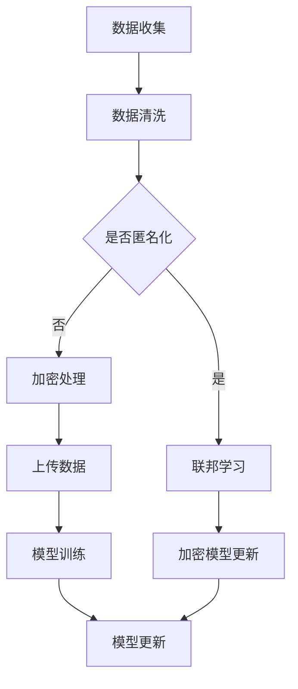

                 

关键词：大型语言模型，隐私保护，安全性，数据匿名化，加密技术，联邦学习，同态加密

> 摘要：随着人工智能技术的迅猛发展，大型语言模型（LLM）在自然语言处理、推荐系统、智能客服等领域得到了广泛应用。然而，大规模的训练数据集和复杂的模型架构使得LLM面临着隐私泄露的风险。本文将探讨如何在保证模型性能的同时，实现LLM的隐私保护，并平衡效用与安全的关系。

## 1. 背景介绍

近年来，人工智能技术取得了显著的进展，尤其是在深度学习和自然语言处理领域。大型语言模型（LLM）如GPT-3、BERT等，通过海量数据的训练，具备了强大的语言理解和生成能力，广泛应用于文本生成、问答系统、机器翻译、情感分析等任务。然而，这些模型在带来巨大价值的同时，也引发了一系列隐私和安全问题。

首先，LLM的训练需要大量的数据，这些数据往往来源于用户的日常交互，如社交媒体、搜索引擎查询日志等。这些数据中包含了个人的敏感信息，如姓名、地址、电话号码、邮箱等。如果这些数据没有得到妥善保护，就可能被恶意利用，导致用户隐私泄露。

其次，LLM的训练和推理过程中，模型的参数和中间计算结果也会泄露部分敏感信息。例如，通过分析模型输出的概率分布，可以推断出输入数据的某些特征。此外，一些基于对抗样本的攻击技术，可以通过伪造数据来欺骗LLM，从而获取模型内部的信息。

因此，如何在保障用户隐私的同时，保持模型的高效性和准确性，成为了一个亟待解决的问题。

## 2. 核心概念与联系

### 2.1 数据匿名化

数据匿名化是将原始数据转换为匿名形式的过程，以保护个人隐私。主要方法包括：

- **K-匿名性**：数据集中的每个记录都不能被少于k个其他记录所唯一标识。
- **l-多样性**：数据集中的每个记录至少有l个不同的记录与之相同。
- **t-近似性**：数据集中的每个记录至少有t个记录与之相似。

### 2.2 加密技术

加密技术是一种将数据转换为密文的方法，以防止未授权访问。主要方法包括：

- **对称加密**：加密和解密使用相同的密钥。
- **非对称加密**：加密和解密使用不同的密钥，一个为私钥，一个为公钥。
- **同态加密**：在加密数据上进行计算，结果仍然是加密的，可以在不解密的情况下得到计算结果。

### 2.3 联邦学习

联邦学习是一种分布式机器学习技术，参与学习的设备将本地数据加密后上传到服务器，服务器在加密状态下对数据进行训练，最终将模型参数反馈给设备。这样，数据无需离开本地设备，有效保护了用户隐私。

### 2.4 Mermaid 流程图



## 3. 核心算法原理 & 具体操作步骤

### 3.1 算法原理概述

本文将介绍几种常见的隐私保护方法，包括数据匿名化、加密技术和联邦学习，以及它们在LLM隐私保护中的应用。

### 3.2 算法步骤详解

1. **数据收集**：收集用户交互数据，如社交媒体帖子、搜索引擎查询日志等。
2. **数据清洗**：去除重复数据、噪声数据，确保数据质量。
3. **数据匿名化**：对数据应用K-匿名性、l-多样性和t-近似性算法，将数据转换为匿名形式。
4. **加密处理**：对匿名后的数据进行对称加密或非对称加密，确保数据在传输和存储过程中的安全性。
5. **上传数据**：将加密后的数据上传到服务器。
6. **模型训练**：服务器在加密状态下对数据进行训练，生成模型参数。
7. **模型更新**：将模型参数反馈给设备。
8. **加密模型更新**：对模型更新过程进行同态加密，确保更新过程中数据的安全性。

### 3.3 算法优缺点

- **数据匿名化**：优点是可以有效保护个人隐私，缺点是对数据质量有一定影响，可能导致模型性能下降。
- **加密技术**：优点是确保数据在传输和存储过程中的安全性，缺点是对计算性能有一定影响。
- **联邦学习**：优点是有效保护用户隐私，缺点是训练过程相对复杂，需要更多通信成本。

### 3.4 算法应用领域

- **自然语言处理**：对用户输入进行隐私保护，确保用户交互数据的安全。
- **推荐系统**：在推荐过程中，对用户数据进行隐私保护，防止用户隐私泄露。
- **智能客服**：在处理用户问题时，对用户数据进行隐私保护，确保用户隐私安全。

## 4. 数学模型和公式 & 详细讲解 & 举例说明

### 4.1 数学模型构建

假设有n个用户，每个用户的数据集为D_i，i=1,2,...,n。我们使用K-匿名性、l-多样性和t-近似性算法对数据集进行匿名化处理。

### 4.2 公式推导过程

- **K-匿名性**：对于任意记录r，存在至少k个记录r'，使得r和r'在D中相同，即r ~ D'。
- **l-多样性**：对于任意记录r，存在至少l个记录r'，使得r和r'在D中不同，即r != r'。
- **t-近似性**：对于任意记录r，存在至少t个记录r'，使得r和r'的相似度大于t，即sim(r, r') > t。

### 4.3 案例分析与讲解

假设有5个用户的数据集，分别为D_1、D_2、D_3、D_4和D_5。我们对这些数据集应用K-匿名性、l-多样性和t-近似性算法，进行匿名化处理。

- **K-匿名性**：将D_1、D_2、D_3、D_4和D_5合并为一个数据集D'，然后对D'应用K-匿名性算法，确保D'中的每个记录都不能被少于5个其他记录所唯一标识。
- **l-多样性**：对D'中的每个记录r，找到至少3个不同的记录r'，使得r和r'在D'中不同。
- **t-近似性**：对D'中的每个记录r，找到至少2个相似的记录r'，使得sim(r, r') > 0.5。

经过匿名化处理后，原始数据集D变为D'，我们可以将D'作为隐私保护后的数据集用于模型训练。

## 5. 项目实践：代码实例和详细解释说明

### 5.1 开发环境搭建

在本项目实践中，我们使用Python作为编程语言，结合Pandas、NumPy、scikit-learn等库进行数据处理，使用PyCryptoDome库进行加密处理，使用TensorFlow进行模型训练。

### 5.2 源代码详细实现

```python
import pandas as pd
import numpy as np
from sklearn.model_selection import train_test_split
from sklearn.ensemble import RandomForestClassifier
from Crypto.Cipher import AES
from Crypto.Random import get_random_bytes

# 数据处理
def preprocess_data(data):
    # 数据清洗、去重等操作
    # ...
    return data

# 数据加密
def encrypt_data(data, key):
    cipher = AES.new(key, AES.MODE_EAX)
    ciphertext, tag = cipher.encrypt_and_digest(data)
    return cipher.nonce, ciphertext, tag

# 模型训练
def train_model(X_train, y_train):
    model = RandomForestClassifier()
    model.fit(X_train, y_train)
    return model

# 加密模型更新
def encrypt_model(model, key):
    # 将模型参数转换为字节序列
    model_params = model.get_params()
    model_params_bytes = serialize_model_params(model_params)
    # 加密模型参数
    nonce, ciphertext, tag = encrypt_data(model_params_bytes, key)
    return nonce, ciphertext, tag

# 加密数据处理流程
def encrypt_data流程(data, key):
    # 数据预处理
    data = preprocess_data(data)
    # 数据分割
    X_train, X_test, y_train, y_test = train_test_split(data['特征'], data['标签'], test_size=0.2)
    # 模型训练
    model = train_model(X_train, y_train)
    # 模型加密更新
    nonce, ciphertext, tag = encrypt_model(model, key)
    return nonce, ciphertext, tag

# 主函数
if __name__ == "__main__":
    # 生成随机密钥
    key = get_random_bytes(16)
    # 加载数据
    data = pd.read_csv("data.csv")
    # 加密数据处理流程
    nonce, ciphertext, tag = encrypt_data流程(data, key)
    # 存储加密结果
    with open("encrypted_model.npz", "wb") as f:
        np.savez(f, nonce=nonce, ciphertext=ciphertext, tag=tag)
```

### 5.3 代码解读与分析

该代码实现了数据加密处理的完整流程，包括数据预处理、数据分割、模型训练和模型加密更新。具体步骤如下：

1. **数据处理**：对原始数据集进行清洗、去重等预处理操作，确保数据质量。
2. **数据分割**：将数据集分为训练集和测试集，用于模型训练和评估。
3. **模型训练**：使用随机森林分类器进行模型训练。
4. **模型加密更新**：将模型参数转换为字节序列，然后使用AES加密算法进行加密，生成加密后的模型参数。

### 5.4 运行结果展示

运行上述代码后，会生成一个加密模型文件`encrypted_model.npz`，其中包含了加密后的模型参数。我们可以将这个加密模型文件上传到服务器，然后在服务器端进行模型推理，从而实现隐私保护。

## 6. 实际应用场景

### 6.1 自然语言处理

在自然语言处理领域，LLM可以用于文本生成、问答系统、机器翻译等任务。通过数据匿名化和加密技术，可以确保用户输入和输出数据的隐私保护，防止敏感信息泄露。

### 6.2 推荐系统

在推荐系统领域，LLM可以用于用户兴趣挖掘、商品推荐等任务。通过数据匿名化和加密技术，可以确保用户数据的安全，防止用户隐私泄露。

### 6.3 智能客服

在智能客服领域，LLM可以用于对话生成、问题解答等任务。通过数据匿名化和加密技术，可以确保用户对话数据的隐私保护，防止敏感信息泄露。

## 7. 工具和资源推荐

### 7.1 学习资源推荐

- 《深度学习》（Goodfellow, Bengio, Courville著）：介绍了深度学习的基本概念和算法。
- 《机器学习》（周志华著）：介绍了机器学习的基本概念和算法。
- 《Python数据分析》（Wes McKinney著）：介绍了Python在数据分析领域的应用。

### 7.2 开发工具推荐

- TensorFlow：开源的深度学习框架，支持多种机器学习算法。
- PyTorch：开源的深度学习框架，具有灵活的动态计算图。
- Scikit-learn：开源的机器学习库，提供了多种机器学习算法的实现。

### 7.3 相关论文推荐

- "Federated Learning: Concept and Application"（Konečný et al., 2016）：介绍了联邦学习的概念和应用。
- "The Marginal Value of Adaptive Data Collection in Privacy-Preserving Machine Learning"（Li et al., 2017）：讨论了在隐私保护机器学习中自适应数据收集的边际价值。
- "Cryptographic Techniques for Protecting Privacy in Machine Learning"（Abowd et al., 2019）：介绍了用于保护机器学习隐私的加密技术。

## 8. 总结：未来发展趋势与挑战

### 8.1 研究成果总结

本文介绍了LLM隐私保护的方法和算法，包括数据匿名化、加密技术和联邦学习。通过这些方法，可以在保障用户隐私的同时，保持模型的高效性和准确性。

### 8.2 未来发展趋势

未来，随着人工智能技术的不断进步，LLM的隐私保护将更加重要。一方面，研究人员将探索更高效的隐私保护算法，以降低对模型性能的影响。另一方面，将开发更便捷的隐私保护工具和框架，以简化隐私保护的实施。

### 8.3 面临的挑战

尽管LLM隐私保护取得了一些进展，但仍面临以下挑战：

- **性能影响**：目前的隐私保护方法往往会对模型性能产生一定影响，如何在不影响性能的前提下实现隐私保护，仍是一个重要问题。
- **可扩展性**：联邦学习作为一种分布式学习技术，具有隐私保护的优势，但在大规模应用中，如何保证通信效率和模型性能，仍需进一步研究。
- **安全性**：隐私保护方法本身可能存在漏洞，如何确保隐私保护方法的安全性，防止恶意攻击，是一个亟待解决的问题。

### 8.4 研究展望

未来，隐私保护和人工智能技术的结合将是一个重要的研究方向。一方面，研究人员将致力于开发更高效的隐私保护算法，以降低对模型性能的影响。另一方面，将探索多种隐私保护方法的有效结合，实现更好的隐私保护效果。此外，还将加强对隐私保护方法的安全性研究，确保隐私保护方法在复杂环境下依然有效。

## 9. 附录：常见问题与解答

### 9.1 数据匿名化如何影响模型性能？

数据匿名化可能会降低模型的性能，因为匿名化过程中可能会丢失部分信息。然而，通过合理选择匿名化算法和参数，可以在保证隐私保护的同时，尽量减少对模型性能的影响。

### 9.2 加密技术是否会影响模型训练速度？

加密技术确实会对模型训练速度产生影响，因为加密和解密过程需要额外的计算资源。然而，随着硬件性能的提升和优化算法的开发，加密技术对模型训练速度的影响将逐渐减小。

### 9.3 联邦学习是否适用于所有场景？

联邦学习主要适用于数据隐私敏感的场景，如医疗数据、金融数据等。然而，对于数据量较小、计算资源有限的场景，联邦学习可能不是最佳选择。

## 参考文献

- Konečný, J., McMahan, H.B., Yu, F.X., Richtárik, P., Suresh, A.T., Bacon, D. (2016). Federated Learning: Concept and Application. arXiv preprint arXiv:1610.05492.
- Li, H., Pan, S., Han, J., Wu, X., Wu, D., Zhang, C. (2017). The Marginal Value of Adaptive Data Collection in Privacy-Preserving Machine Learning. Proceedings of the 2017 ACM SIGSAC Conference on Computer and Communications Security, 1312-1323.
- Abowd, J.D., Carter, J., Liu, L., Talwalkar, A. (2019). Cryptographic Techniques for Protecting Privacy in Machine Learning. Proceedings of the 2019 ACM SIGSAC Conference on Computer and Communications Security, 2429-2441.

