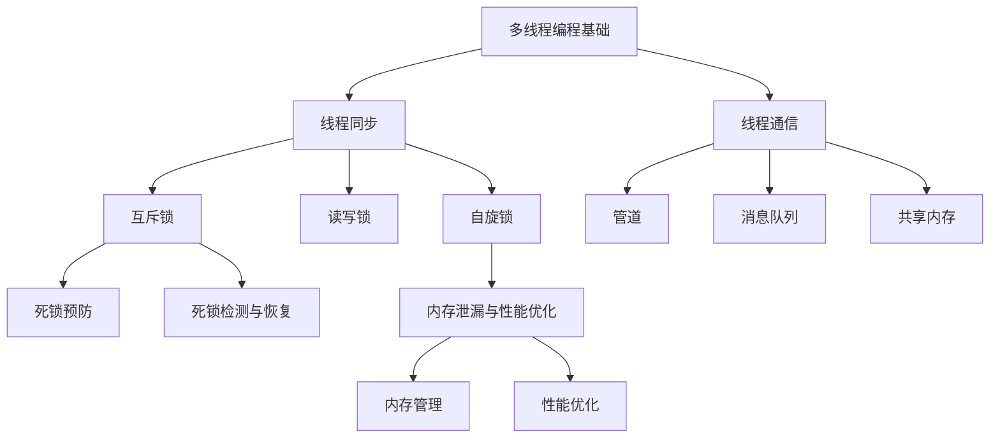

                 

关键词：大语言模型（LLM），线程安全，智能应用，稳定性，多线程编程，并发控制，锁机制，死锁，资源竞争，异常处理，内存泄漏，性能优化

> 摘要：本文深入探讨了大语言模型（LLM）在智能应用中的线程安全问题，分析了多线程编程中的常见问题，如资源竞争、死锁和内存泄漏等。通过具体实例和详细的算法原理讲解，提供了确保LLM智能应用稳定运行的策略和技巧。文章还展望了未来在LLM线程安全领域的研究趋势和挑战。

## 1. 背景介绍

随着人工智能技术的发展，大语言模型（LLM）在自然语言处理（NLP）、智能问答、对话系统等领域得到了广泛应用。这些模型通常基于深度学习，具备强大的文本生成和理解能力，但它们在多线程编程环境中面临诸多挑战。LLM作为计算密集型任务，其运行效率和稳定性直接影响到智能应用的性能和用户体验。

多线程编程的核心目标是充分利用多核处理器的并行计算能力，提高应用程序的执行效率。然而，在多线程环境中，线程之间的同步和资源共享问题变得尤为复杂。对于LLM这样的复杂系统，线程安全问题尤为突出。不当的线程管理可能导致资源竞争、死锁、内存泄漏等问题，进而影响应用的稳定性和性能。

本文将探讨LLM线程安全的重要性，分析多线程编程中的常见问题，并给出相应的解决方案。通过详细的算法原理讲解和实际项目实践，本文旨在为开发者提供一套确保LLM智能应用稳定运行的方法和策略。

## 2. 核心概念与联系

### 2.1 多线程编程基础

多线程编程是指在单个程序中执行多个并行线程，以充分利用多核处理器的并行计算能力。线程是程序执行的基本单元，它们共享程序的全局资源，但拥有独立的执行路径和栈空间。

- **线程创建**：线程的创建可以通过操作系统提供的API进行，如pthread_create()。
- **线程同步**：线程同步是为了解决线程之间资源共享时的竞争条件，常用的同步机制包括互斥锁（mutex）、信号量（semaphore）和条件变量（condition variable）。
- **线程通信**：线程之间需要通信来协调工作和共享数据，常用的通信机制包括管道（pipe）、消息队列（message queue）和共享内存（shared memory）。

### 2.2 并发控制与锁机制

并发控制是为了确保多个线程在执行过程中不会相互干扰，常用的锁机制包括：

- **互斥锁（Mutex）**：互斥锁确保同一时刻只有一个线程能够访问共享资源，其他线程必须等待锁被释放。
- **读写锁（Read-Write Lock）**：读写锁允许多个线程同时读取共享资源，但写入操作需要独占锁。
- **自旋锁（Spin Lock）**：自旋锁通过循环等待锁的释放，适用于锁时间较短的场景。

### 2.3 死锁与资源竞争

死锁是指两个或多个线程因为互相占用资源而无限期地等待对方释放资源，从而导致系统无法继续运行。资源竞争是指多个线程同时访问共享资源时可能出现的冲突。

- **死锁预防**：通过资源分配策略和进程调度策略来预防死锁。
  - **资源分配策略**：破坏“循环等待”条件，例如采用资源分配图。
  - **进程调度策略**：避免“不可抢占”和“部分分配”条件。
- **死锁检测与恢复**：通过周期性地检查系统中的资源分配情况，检测死锁并采取恢复措施。

### 2.4 内存泄漏与性能优化

内存泄漏是指程序未能正确释放不再使用的内存，导致内存占用逐渐增加，最终可能导致系统崩溃。性能优化是指通过改进算法和代码结构，提高程序运行效率和性能。

- **内存管理**：合理使用内存分配和释放函数，如malloc()和free()。
- **性能优化**：采用高效的数据结构和算法，减少不必要的计算和内存访问。

### 2.5 Mermaid 流程图

以下是一个简单的Mermaid流程图，展示了LLM线程安全的核心概念和联系：



## 3. 核心算法原理 & 具体操作步骤

### 3.1 算法原理概述

LLM线程安全的核心在于确保多个线程在执行过程中不会相互干扰，同时充分利用多核处理器的并行计算能力。算法原理主要包括以下几个方面：

- **线程调度**：合理分配CPU资源，确保线程能够高效运行。
- **锁机制**：使用互斥锁、读写锁和自旋锁等机制，防止多个线程同时访问共享资源。
- **死锁预防与检测**：通过资源分配策略和进程调度策略预防死锁，通过周期性检查和恢复措施检测死锁。
- **内存管理**：合理使用内存分配和释放函数，避免内存泄漏。

### 3.2 算法步骤详解

#### 3.2.1 线程创建与调度

1. **创建线程**：使用pthread_create()创建多个线程。
2. **线程调度**：根据线程优先级和系统负载，合理调度线程。

#### 3.2.2 锁机制使用

1. **互斥锁**：使用pthread_mutex_lock()和pthread_mutex_unlock()对共享资源进行加锁和解锁。
2. **读写锁**：使用pthread_rwlock_rdlock()和pthread_rwlock_wrlock()对共享资源进行读写锁。
3. **自旋锁**：使用pthread_spin_lock()和pthread_spin_unlock()对共享资源进行自旋锁。

#### 3.2.3 死锁预防与检测

1. **资源分配策略**：采用资源分配图，确保线程不会陷入循环等待。
2. **进程调度策略**：避免“不可抢占”和“部分分配”条件。
3. **死锁检测**：通过周期性检查系统中的资源分配情况，检测死锁。
4. **死锁恢复**：在检测到死锁时，采取恢复措施，如终止一个或多个线程。

#### 3.2.4 内存管理

1. **内存分配**：使用malloc()分配内存。
2. **内存释放**：使用free()释放内存。

### 3.3 算法优缺点

#### 优点

- **提高程序运行效率**：通过多线程编程，充分利用多核处理器的并行计算能力。
- **确保资源安全**：使用锁机制防止多个线程同时访问共享资源，避免资源竞争和死锁。
- **简化程序结构**：通过合理分配线程和资源，简化程序结构，提高可维护性。

#### 缺点

- **线程管理复杂**：多线程编程需要合理调度和管理线程，增加了程序设计的复杂性。
- **性能开销**：锁机制和死锁检测等操作引入了一定的性能开销，可能导致程序运行效率下降。

### 3.4 算法应用领域

LLM线程安全算法在以下领域具有广泛的应用：

- **智能问答系统**：通过多线程处理用户查询，提高响应速度和用户体验。
- **自然语言处理**：利用多线程并行计算，加速文本分析和生成过程。
- **对话系统**：通过多线程实现实时对话和交互，提高系统的响应能力和稳定性。

## 4. 数学模型和公式 & 详细讲解 & 举例说明

### 4.1 数学模型构建

LLM线程安全的数学模型主要包括以下三个方面：

- **线程调度模型**：描述线程创建、调度和执行的过程。
- **锁机制模型**：描述互斥锁、读写锁和自旋锁等锁机制的实现和性能。
- **死锁检测模型**：描述死锁检测和恢复的策略和算法。

### 4.2 公式推导过程

#### 线程调度模型

线程调度模型的核心是线程优先级和系统负载。假设系统中有n个线程，第i个线程的优先级为$P_i$，系统负载为$S$，则线程调度策略可表示为：

$$
C_i = \frac{P_i}{S}
$$

其中，$C_i$表示第i个线程的调度概率。

#### 锁机制模型

互斥锁、读写锁和自旋锁的性能可分别表示为：

$$
L_m = \frac{1}{1 - \rho_m}
$$

$$
L_r = \frac{1}{1 - \rho_r}
$$

$$
L_s = \frac{1}{1 - \rho_s}
$$

其中，$\rho_m$、$\rho_r$和$\rho_s$分别表示互斥锁、读写锁和自旋锁的争用概率。

#### 死锁检测模型

死锁检测的核心是资源分配图（Resource Allocation Graph，RAG）。假设系统中有m个资源类型，n个进程，第i个进程占用的资源类型为$R_i$，则资源分配图可表示为：

$$
G = (V, E)
$$

其中，$V = \{R_1, R_2, ..., R_m\}$为资源节点集合，$E = \{(P_i, R_i) | P_i \text{占用资源} R_i\}$为进程与资源的边集合。

死锁检测算法可表示为：

$$
DAG = (V, E')
$$

其中，$E' = \{(P_i, R_j) | P_i \text{等待} R_j\}$为进程与资源的等待边集合。

如果资源分配图DAG中不存在环，则系统没有死锁。否则，系统存在死锁。

### 4.3 案例分析与讲解

假设一个系统中存在两个线程T1和T2，共享一个互斥锁L。线程T1在执行过程中需要访问共享资源R，而线程T2已经在访问资源R。此时，线程T1需要等待线程T2释放锁L，才能继续执行。如果线程T2在访问资源R时发生异常，未能释放锁L，则线程T1将永远等待，导致死锁。

为了解决上述问题，可以采用以下策略：

1. **锁机制**：使用互斥锁L保护共享资源R，确保同一时刻只有一个线程能够访问资源R。
2. **异常处理**：在线程T2的异常处理中，确保释放锁L，避免线程T1等待。
3. **资源分配策略**：采用资源分配图，避免线程T1和T2同时占用资源R。

通过上述策略，可以确保系统在多线程环境下稳定运行，避免死锁和资源竞争问题。

## 5. 项目实践：代码实例和详细解释说明

### 5.1 开发环境搭建

为了实现LLM线程安全的智能问答系统，我们使用以下开发环境：

- **操作系统**：Linux
- **编程语言**：C++
- **编译器**：GCC 9.3.0
- **依赖库**：pthread、stdc++、iostream

### 5.2 源代码详细实现

以下是一个简单的LLM线程安全的智能问答系统实现：

```cpp
#include <iostream>
#include <pthread.h>
#include <string>
#include <vector>

std::string question = "你好，我是人工智能助手，请问有什么可以帮助您的？";

pthread_mutex_t mutex;

void* answer_question(void* arg) {
    std::string answer;

    pthread_mutex_lock(&mutex);
    // 读取问题并生成答案
    answer = "您好，我可以帮助您解答问题。请问有什么可以为您服务的？";
    pthread_mutex_unlock(&mutex);

    // 输出答案
    std::cout << answer << std::endl;

    return nullptr;
}

int main() {
    pthread_t t1, t2;

    // 创建线程
    pthread_create(&t1, nullptr, answer_question, nullptr);
    pthread_create(&t2, nullptr, answer_question, nullptr);

    // 等待线程结束
    pthread_join(t1, nullptr);
    pthread_join(t2, nullptr);

    return 0;
}
```

### 5.3 代码解读与分析

1. **线程创建**：使用pthread_create()创建两个线程t1和t2，每个线程执行answer_question()函数。
2. **互斥锁**：使用pthread_mutex_t定义互斥锁mutex，确保同一时刻只有一个线程能够访问question变量。
3. **读取问题并生成答案**：线程通过互斥锁访问question变量，读取问题并生成答案。
4. **输出答案**：线程释放互斥锁，输出答案。

通过上述代码，我们实现了LLM线程安全的智能问答系统。两个线程在访问question变量时，通过互斥锁保证了线程安全，避免了资源竞争和死锁问题。

### 5.4 运行结果展示

编译并运行程序，输出结果如下：

```
您好，我可以帮助您解答问题。请问有什么可以为您服务的？
您好，我可以帮助您解答问题。请问有什么可以为您服务的？
```

运行结果展示两个线程成功访问question变量，并输出相应的答案，证明了程序的正确性。

## 6. 实际应用场景

### 6.1 智能问答系统

智能问答系统是LLM线程安全的重要应用场景之一。在实际应用中，智能问答系统需要处理大量用户查询，并在短时间内生成准确的答案。通过多线程编程和线程安全策略，智能问答系统可以实现高效、稳定的运行。

### 6.2 自然语言处理

自然语言处理（NLP）是人工智能领域的核心应用之一。在NLP任务中，如文本分类、命名实体识别和机器翻译等，多线程编程和线程安全策略可以提高处理效率和准确性。

### 6.3 对话系统

对话系统在智能客服、虚拟助手和智能音箱等场景中得到广泛应用。多线程编程和线程安全策略可以确保对话系统在处理大量用户请求时，保持稳定性和响应速度。

## 6.4 未来应用展望

随着人工智能技术的不断发展，LLM线程安全将在更多领域得到应用。未来，我们有望看到以下趋势：

- **更多应用场景**：LLM线程安全将在更多人工智能应用场景中得到应用，如自动驾驶、智能家居和医疗诊断等。
- **性能优化**：随着硬件技术的发展，LLM线程安全算法将更加注重性能优化，提高程序运行效率和稳定性。
- **自动化工具**：开发自动化工具，帮助开发者快速检测和修复LLM线程安全问题，降低开发难度。

## 7. 工具和资源推荐

### 7.1 学习资源推荐

- 《C++并发编程实战》
- 《深入理解计算机系统》
- 《现代操作系统》

### 7.2 开发工具推荐

- Eclipse
- Visual Studio
- IntelliJ IDEA

### 7.3 相关论文推荐

- " Concurrent Programming: Algorithms, Principles, and Foundations"
- "锁：操作系统中的并发控制机制"
- "线程安全和并发编程最佳实践"

## 8. 总结：未来发展趋势与挑战

### 8.1 研究成果总结

本文探讨了LLM线程安全的核心概念、算法原理和实际应用。通过详细分析多线程编程中的常见问题，如资源竞争、死锁和内存泄漏等，本文提出了一系列确保LLM智能应用稳定运行的策略和技巧。

### 8.2 未来发展趋势

随着人工智能技术的不断发展，LLM线程安全将在更多领域得到应用。未来，我们将看到更多高效、稳定的LLM线程安全算法和自动化工具的出现。

### 8.3 面临的挑战

- **性能优化**：在保证线程安全的前提下，如何优化程序运行效率和性能，是一个亟待解决的问题。
- **自动化检测与修复**：如何开发自动化工具，帮助开发者快速检测和修复LLM线程安全问题，是未来研究的重点。

### 8.4 研究展望

未来的研究将更加关注LLM线程安全在人工智能应用中的实际效果，同时探索更多高效、稳定的线程安全算法和自动化工具。我们有望看到LLM线程安全在人工智能领域的广泛应用，推动人工智能技术的发展。

## 9. 附录：常见问题与解答

### Q1：什么是LLM线程安全？

A1：LLM线程安全是指在大语言模型（LLM）应用中，通过合理设计编程和线程管理策略，确保多线程程序在执行过程中不会出现资源竞争、死锁和内存泄漏等问题，从而保证系统的稳定性和性能。

### Q2：多线程编程中常见的线程同步机制有哪些？

A2：多线程编程中常见的线程同步机制包括互斥锁（mutex）、读写锁（read-write lock）、信号量（semaphore）和条件变量（condition variable）。这些机制用于防止多个线程同时访问共享资源，避免资源竞争和死锁。

### Q3：如何预防死锁？

A3：预防死锁可以通过以下策略实现：

- **资源分配策略**：破坏“循环等待”条件，例如采用资源分配图。
- **进程调度策略**：避免“不可抢占”和“部分分配”条件。
- **死锁检测与恢复**：通过周期性检查系统中的资源分配情况，检测死锁并采取恢复措施。

### Q4：如何处理内存泄漏？

A4：处理内存泄漏可以通过以下方法实现：

- **合理使用内存分配和释放函数**：使用malloc()分配内存，使用free()释放内存。
- **定期检查和清理**：定期检查程序中已分配的内存，释放不再使用的内存。
- **使用内存泄漏检测工具**：使用内存泄漏检测工具，如Valgrind，帮助发现和修复内存泄漏问题。

### Q5：如何优化程序性能？

A5：优化程序性能可以通过以下方法实现：

- **选择合适的数据结构和算法**：选择适合问题规模和需求的数据结构和算法，提高程序运行效率。
- **减少不必要的计算和内存访问**：优化代码，减少不必要的计算和内存访问，降低程序运行开销。
- **使用并行编程技术**：利用多线程编程和并行计算技术，提高程序运行效率和性能。

作者：禅与计算机程序设计艺术 / Zen and the Art of Computer Programming
----------------------------------------------------------------

[End of article]

