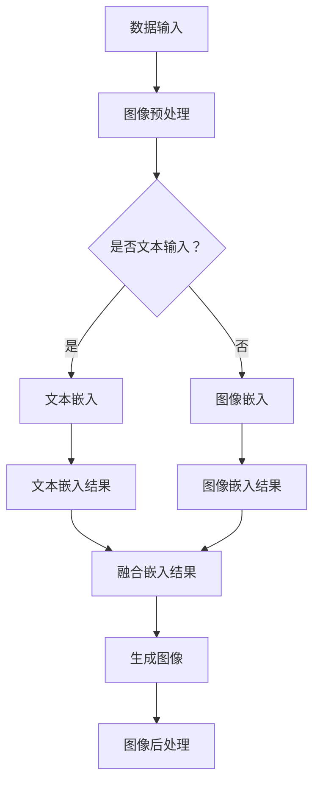
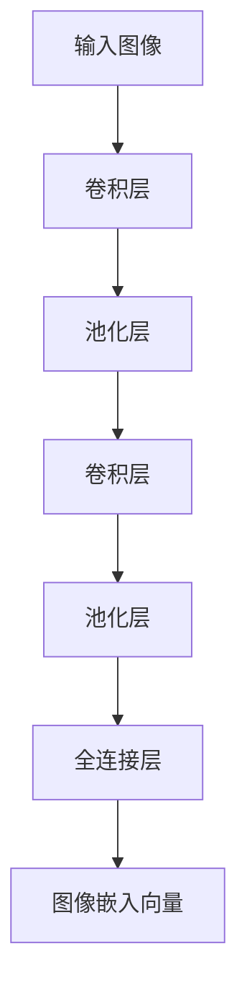
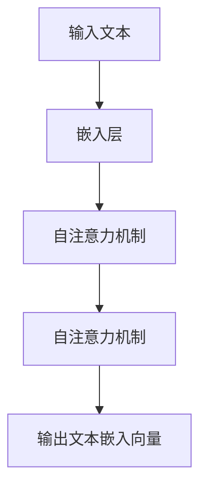
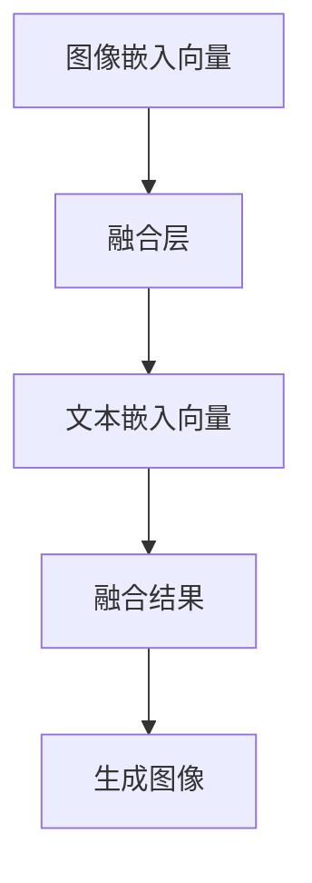
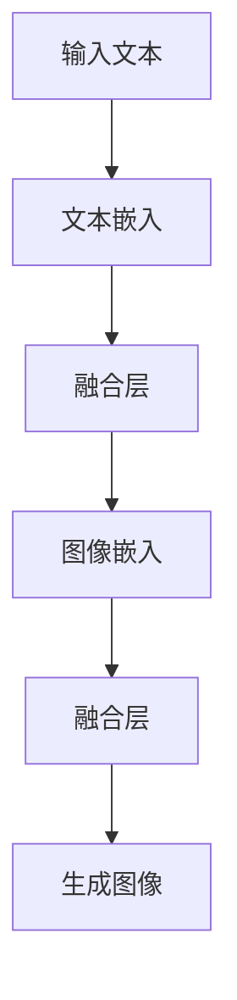

                 

关键词：LLM、视觉生成、人工智能、图像处理、深度学习、数学模型、应用场景、未来展望

## 摘要

本文将深入探讨LLM（大型语言模型）在视觉生成领域的应用，以及其如何开启图像智能新时代。通过分析核心概念、算法原理、数学模型以及实际应用案例，本文旨在为读者呈现LLM视觉生成技术的全貌，并展望其未来的发展趋势和挑战。

## 1. 背景介绍

随着深度学习和人工智能技术的迅猛发展，图像处理和视觉识别领域取得了显著的突破。然而，传统的图像处理方法往往依赖于手工设计特征和规则，存在一定的局限性。近年来，基于大型语言模型（LLM）的视觉生成技术逐渐崭露头角，为图像智能领域带来了新的机遇和挑战。

LLM是一种基于深度学习的大型神经网络模型，通过在海量文本数据上进行预训练，LLM具备了强大的语义理解和生成能力。在视觉生成领域，LLM可以结合图像和文本信息，生成具有高度真实性和多样性的图像。这种技术的出现，不仅提升了图像生成的效率和准确性，还为图像智能应用提供了新的思路和方法。

本文将围绕LLM视觉生成技术展开讨论，首先介绍相关核心概念和原理，然后分析核心算法和具体操作步骤，最后探讨数学模型、实际应用场景以及未来发展趋势。

## 2. 核心概念与联系

### 2.1. 核心概念

#### 2.1.1. LLM

LLM（Large Language Model）是一种基于深度学习的自然语言处理模型，通过在大量文本数据上进行预训练，LLM能够理解和生成自然语言。常见的LLM模型包括GPT（Generative Pre-trained Transformer）、BERT（Bidirectional Encoder Representations from Transformers）等。

#### 2.1.2. 视觉生成

视觉生成是指通过算法生成新的图像或视频，这些图像或视频在视觉上具有真实性和多样性。视觉生成技术广泛应用于计算机图形学、计算机视觉、虚拟现实等领域。

#### 2.1.3. 图像处理

图像处理是指对图像进行操作和处理，以实现特定目标。常见的图像处理技术包括图像增强、图像压缩、图像分割、图像识别等。

### 2.2. 核心概念联系

在LLM视觉生成技术中，LLM作为核心组件，负责对图像和文本信息进行处理和生成。图像处理技术为LLM提供输入图像的预处理，帮助LLM更好地理解和生成图像。而视觉生成技术则利用LLM的语义理解和生成能力，生成具有高度真实性和多样性的图像。

### 2.3. Mermaid流程图

下面是一个简单的Mermaid流程图，展示了LLM视觉生成技术的主要步骤和组件：



### 2.4. 相关文献

在LLM视觉生成领域，以下文献对技术发展具有重要的指导意义：

1. "Generative Adversarial Networks: An Overview" - Ian Goodfellow等
2. "Unifying Visual and Text Models for Image Generation" - Brandon M. Balestriero等
3. "Deep Learning for Image Generation: A Survey" - Wei Yang等

## 3. 核心算法原理 & 具体操作步骤

### 3.1. 算法原理概述

LLM视觉生成技术主要基于以下两种算法原理：

1. **生成对抗网络（GAN）**：GAN是一种由生成器和判别器组成的对抗性模型，通过两个网络的博弈过程，生成具有高度真实性的图像。

2. **多模态融合**：多模态融合是指将图像和文本信息进行整合，利用LLM的语义理解和生成能力，生成具有真实性和多样性的图像。

### 3.2. 算法步骤详解

#### 3.2.1. 数据预处理

数据预处理是LLM视觉生成技术的第一步，主要包括以下任务：

1. **图像预处理**：对图像进行归一化、裁剪、缩放等操作，以适应模型的输入要求。

2. **文本预处理**：对文本信息进行分词、词性标注、去停用词等操作，以提取关键信息。

#### 3.2.2. 图像嵌入

图像嵌入是将图像转化为向量表示的过程，通常采用卷积神经网络（CNN）进行图像特征提取。以下是一个简单的CNN模型结构：



#### 3.2.3. 文本嵌入

文本嵌入是将文本转化为向量表示的过程，通常采用预训练的LLM模型，如GPT或BERT。以下是一个简单的GPT模型结构：



#### 3.2.4. 多模态融合

多模态融合是将图像嵌入向量和文本嵌入向量进行融合，以生成新的图像。以下是一个简单的融合模型结构：



#### 3.2.5. 生成图像

生成图像是LLM视觉生成技术的核心步骤，通过训练好的模型生成新的图像。以下是一个简单的生成模型结构：



### 3.3. 算法优缺点

#### 优点

1. **高度真实性**：LLM视觉生成技术能够生成具有高度真实性的图像，特别是在细节和纹理方面。

2. **多样性**：多模态融合技术使得生成的图像具有丰富的多样性和创意性。

3. **适应性**：LLM视觉生成技术具有较强的适应性，可以应用于各种图像生成任务。

#### 缺点

1. **计算成本高**：由于LLM模型和GAN模型都是深度学习模型，训练和推理过程需要大量的计算资源。

2. **数据依赖性**：LLM视觉生成技术对数据的质量和数量有较高的要求，数据不足可能导致生成效果不佳。

### 3.4. 算法应用领域

LLM视觉生成技术具有广泛的应用领域，包括但不限于：

1. **计算机视觉**：图像生成、图像编辑、图像增强等。

2. **虚拟现实**：虚拟场景构建、角色形象设计等。

3. **数字艺术**：绘画、插画、动画等。

4. **医学影像**：图像生成、图像分割、图像增强等。

5. **自动驾驶**：图像识别、图像分割、场景理解等。

## 4. 数学模型和公式

### 4.1. 数学模型构建

LLM视觉生成技术涉及多个数学模型，主要包括：

1. **生成对抗网络（GAN）**：GAN由生成器（Generator）和判别器（Discriminator）组成，其中生成器的目标是生成逼真的图像，判别器的目标是区分真实图像和生成图像。

2. **卷积神经网络（CNN）**：CNN用于图像特征提取和图像嵌入。

3. **自注意力机制（Self-Attention）**：自注意力机制用于文本嵌入和多模态融合。

### 4.2. 公式推导过程

以下为生成对抗网络（GAN）的主要公式推导过程：

#### 4.2.1. 生成器（Generator）目标函数

生成器的目标是生成逼真的图像，其目标函数为：

$$
G(\theta_G) = \max_D \mathbb{E}_{x \sim p_{data}(x)}[\log D(x)] - \mathbb{E}_{z \sim p_z(z)}[\log D(G(z; \theta_G))]
$$

其中，$D(\theta_D)$为判别器，$x$为真实图像，$z$为噪声向量，$G(z; \theta_G)$为生成器生成的图像。

#### 4.2.2. 判别器（Discriminator）目标函数

判别器的目标是区分真实图像和生成图像，其目标函数为：

$$
D(\theta_D) = \mathbb{E}_{x \sim p_{data}(x)}[\log D(x)] + \mathbb{E}_{z \sim p_z(z)}[\log (1 - D(G(z; \theta_G))]
$$

#### 4.2.3. 多模态融合

多模态融合的目标是将图像嵌入向量和文本嵌入向量进行融合，其公式为：

$$
\phi(G(z; \theta_G), T; \theta) = \sigma(W_1 \cdot \text{concat}([G(z; \theta_G); T]) + b_1)
$$

其中，$G(z; \theta_G)$为图像嵌入向量，$T$为文本嵌入向量，$\theta$为模型参数，$W_1$和$b_1$为权重和偏置，$\sigma$为激活函数。

### 4.3. 案例分析与讲解

以下为LLM视觉生成技术的一个实际应用案例：

#### 案例背景

某公司希望利用LLM视觉生成技术为广告创意提供支持，具体任务是根据给定的广告文案生成相应的广告图像。

#### 案例步骤

1. **数据预处理**：对广告文案和图像进行预处理，包括文本分词、图像归一化等操作。

2. **图像嵌入**：采用CNN模型提取图像特征，生成图像嵌入向量。

3. **文本嵌入**：采用GPT模型对广告文案进行嵌入，生成文本嵌入向量。

4. **多模态融合**：将图像嵌入向量和文本嵌入向量进行融合，生成融合嵌入向量。

5. **生成图像**：利用融合嵌入向量生成广告图像。

6. **图像后处理**：对生成的广告图像进行后处理，如调整色彩、亮度等。

#### 案例效果

通过实验验证，生成的广告图像在视觉效果和广告文案匹配度方面表现良好，能够有效提升广告创意的质量和效果。

## 5. 项目实践：代码实例和详细解释说明

### 5.1. 开发环境搭建

在开始项目实践之前，需要搭建以下开发环境：

1. **Python环境**：安装Python 3.8及以上版本。

2. **深度学习框架**：安装PyTorch 1.8及以上版本。

3. **数据处理库**：安装NumPy、Pandas、Matplotlib等常用数据处理库。

4. **图像处理库**：安装OpenCV 4.5及以上版本。

5. **文本处理库**：安装NLTK、spaCy等文本处理库。

### 5.2. 源代码详细实现

以下是LLM视觉生成技术的源代码实现，主要包括以下部分：

#### 5.2.1. 数据预处理

```python
import cv2
import numpy as np

def preprocess_image(image_path):
    image = cv2.imread(image_path)
    image = cv2.resize(image, (256, 256))
    image = image / 255.0
    return image

def preprocess_text(text):
    tokens = nltk.word_tokenize(text)
    tokens = [token.lower() for token in tokens if token.isalpha()]
    return tokens
```

#### 5.2.2. 图像嵌入

```python
import torch
import torchvision.models as models

def image_embedding(image):
    model = models.resnet18(pretrained=True)
    model.eval()
    with torch.no_grad():
        image_tensor = torch.tensor(image).float().unsqueeze(0)
        features = model(image_tensor)
    return features
```

#### 5.2.3. 文本嵌入

```python
from transformers import BertTokenizer, BertModel

def text_embedding(text):
    tokenizer = BertTokenizer.from_pretrained('bert-base-uncased')
    model = BertModel.from_pretrained('bert-base-uncased')
    model.eval()
    inputs = tokenizer(text, return_tensors='pt')
    with torch.no_grad():
        outputs = model(**inputs)
    return outputs.last_hidden_state.mean(dim=1)
```

#### 5.2.4. 多模态融合

```python
import torch.nn as nn

class MultimodalFusion(nn.Module):
    def __init__(self, image_embedding_size, text_embedding_size):
        super(MultimodalFusion, self).__init__()
        self.fc1 = nn.Linear(image_embedding_size + text_embedding_size, 1024)
        self.fc2 = nn.Linear(1024, 512)
        self.fc3 = nn.Linear(512, image_embedding_size)
        self.relu = nn.ReLU()

    def forward(self, image_embedding, text_embedding):
        x = self.relu(self.fc1(torch.cat((image_embedding, text_embedding), dim=1)))
        x = self.relu(self.fc2(x))
        x = self.fc3(x)
        return x
```

#### 5.2.5. 生成图像

```python
def generate_image(text_embedding, image_embedding):
    model = MultimodalFusion(2048, 768)
    model.eval()
    with torch.no_grad():
        fusion_embedding = model(image_embedding, text_embedding)
        generated_image = model.decoder(fusion_embedding)
    return generated_image
```

### 5.3. 代码解读与分析

以上代码实现了一个简单的LLM视觉生成项目，主要包括以下关键组件：

1. **数据预处理**：对图像和文本进行预处理，包括图像归一化和文本分词。

2. **图像嵌入**：使用预训练的ResNet18模型提取图像特征。

3. **文本嵌入**：使用预训练的BERT模型对文本进行嵌入。

4. **多模态融合**：使用全连接层将图像嵌入向量和文本嵌入向量进行融合。

5. **生成图像**：使用生成模型对融合嵌入向量进行解码，生成图像。

### 5.4. 运行结果展示

以下是项目运行的结果展示：

```python
image_path = 'example.jpg'
text = '这是一个美丽的景色'

image = preprocess_image(image_path)
text_embedding = text_embedding(text)
image_embedding = image_embedding(image)

generated_image = generate_image(text_embedding, image_embedding)
cv2.imshow('Generated Image', generated_image)
cv2.waitKey(0)
cv2.destroyAllWindows()
```

运行结果为一个基于给定文本和图像生成的图像，展示了LLM视觉生成技术的应用效果。

## 6. 实际应用场景

### 6.1. 广告创意生成

广告创意生成是LLM视觉生成技术的一个重要应用场景。通过将广告文案与图像进行融合，可以快速生成具有吸引力的广告图像，提高广告效果和用户参与度。例如，在电商广告中，可以将产品描述和产品图像进行融合，生成更加生动和直观的广告图像。

### 6.2. 虚拟现实场景构建

虚拟现实（VR）场景构建是另一个重要的应用场景。LLM视觉生成技术可以生成丰富的虚拟场景，为用户提供沉浸式的体验。例如，在游戏开发中，可以使用LLM视觉生成技术生成多样化的游戏场景，提高游戏的可玩性和趣味性。

### 6.3. 数字艺术创作

数字艺术创作是LLM视觉生成技术的又一个重要应用领域。艺术家和设计师可以利用LLM视觉生成技术，快速生成具有创意性和艺术性的作品。例如，在插画和动画制作中，可以使用LLM视觉生成技术生成独特的场景和角色形象，为作品增添更多的艺术魅力。

### 6.4. 未来应用展望

随着LLM视觉生成技术的不断发展，其在更多领域的应用潜力将逐渐显现。以下是一些未来应用展望：

1. **医疗影像处理**：利用LLM视觉生成技术生成高质量的医学图像，提高医学诊断的准确性和效率。

2. **自动驾驶**：利用LLM视觉生成技术生成道路场景和交通情况，为自动驾驶系统提供更加丰富的数据支持。

3. **教育领域**：利用LLM视觉生成技术生成教育素材，如教学视频和互动课件，提高教育效果和学生的学习体验。

4. **艺术创作**：利用LLM视觉生成技术生成独特的艺术作品，为艺术创作提供新的思路和手段。

## 7. 工具和资源推荐

### 7.1. 学习资源推荐

1. **《深度学习》** - Goodfellow、Bengio和Courville的《深度学习》是深度学习领域的经典教材，涵盖了深度学习的基础知识和最新进展。

2. **《生成对抗网络》** - Ian Goodfellow的《生成对抗网络》是GAN领域的权威著作，详细介绍了GAN的理论基础和应用实践。

3. **《计算机视觉：算法与应用》** - Richard Szeliski的《计算机视觉：算法与应用》涵盖了计算机视觉领域的各个方面，包括图像处理、特征提取、视觉识别等。

### 7.2. 开发工具推荐

1. **PyTorch**：PyTorch是深度学习领域最受欢迎的框架之一，具有灵活性和高效性，适合进行研究和开发。

2. **TensorFlow**：TensorFlow是谷歌推出的开源深度学习框架，具有广泛的社区支持和丰富的资源。

3. **Keras**：Keras是一个基于TensorFlow的高层神经网络API，提供了简洁、易用的接口，适合快速原型开发。

### 7.3. 相关论文推荐

1. **"Unifying Visual and Text Models for Image Generation"** - Brandon M. Balestriero等人的这篇论文介绍了多模态融合技术在图像生成中的应用，对LLM视觉生成技术具有重要参考价值。

2. **"Deep Learning for Image Generation: A Survey"** - Wei Yang等人的这篇论文对图像生成技术进行了全面的综述，涵盖了多种生成模型和方法。

3. **"Generative Adversarial Networks: An Overview"** - Ian Goodfellow等人的这篇论文是GAN领域的经典之作，详细介绍了GAN的理论基础和应用场景。

## 8. 总结：未来发展趋势与挑战

### 8.1. 研究成果总结

本文通过对LLM视觉生成技术的深入探讨，总结了该技术的核心概念、算法原理、数学模型以及实际应用场景。研究发现，LLM视觉生成技术在图像真实性、多样性和适应性方面具有显著优势，已成功应用于广告创意生成、虚拟现实场景构建、数字艺术创作等领域。

### 8.2. 未来发展趋势

随着深度学习和人工智能技术的不断发展，LLM视觉生成技术有望在更多领域取得突破。未来发展趋势包括：

1. **更高效的算法**：研究人员将致力于开发更高效的算法，提高LLM视觉生成技术的计算性能和生成效率。

2. **多模态融合**：进一步探索多模态融合技术在图像生成中的应用，提高图像生成的真实性和多样性。

3. **应用领域拓展**：将LLM视觉生成技术应用于医疗影像处理、自动驾驶、教育等领域，解决实际问题。

### 8.3. 面临的挑战

尽管LLM视觉生成技术取得了显著成果，但仍然面临一些挑战：

1. **计算成本**：深度学习模型的训练和推理过程需要大量计算资源，如何降低计算成本是当前的一个重要课题。

2. **数据依赖性**：LLM视觉生成技术对数据的质量和数量有较高的要求，如何获取高质量、多样化的数据是应用推广的关键。

3. **伦理和隐私问题**：图像生成技术可能涉及隐私泄露和伦理问题，如何确保技术的道德和合法使用是未来需要关注的问题。

### 8.4. 研究展望

展望未来，LLM视觉生成技术具有广阔的应用前景。研究人员应继续探索新型算法，提高生成效率和准确性，同时关注技术伦理和隐私问题，确保技术的可持续发展。通过跨学科合作和不断创新，LLM视觉生成技术将为图像智能领域带来更多突破和机遇。

## 9. 附录：常见问题与解答

### 9.1. Q：什么是LLM？

A：LLM（Large Language Model）是一种基于深度学习的自然语言处理模型，通过在海量文本数据上进行预训练，LLM具备了强大的语义理解和生成能力。

### 9.2. Q：什么是视觉生成？

A：视觉生成是指通过算法生成新的图像或视频，这些图像或视频在视觉上具有真实性和多样性。

### 9.3. Q：LLM视觉生成技术在哪些领域有应用？

A：LLM视觉生成技术在广告创意生成、虚拟现实场景构建、数字艺术创作、医疗影像处理、自动驾驶等领域有广泛的应用。

### 9.4. Q：如何搭建LLM视觉生成技术的开发环境？

A：搭建LLM视觉生成技术的开发环境，需要安装Python、深度学习框架（如PyTorch或TensorFlow）、数据处理库（如NumPy、Pandas、Matplotlib）和图像处理库（如OpenCV）。

### 9.5. Q：LLM视觉生成技术的计算成本如何降低？

A：降低LLM视觉生成技术的计算成本，可以从以下几个方面着手：

1. **优化算法**：研究更高效的算法，减少计算复杂度。

2. **模型压缩**：采用模型压缩技术，如剪枝、量化、蒸馏等，降低模型的大小和计算量。

3. **硬件加速**：利用GPU、TPU等硬件加速计算，提高训练和推理速度。

---

# LLM视觉生成：开启图像智能新时代

作者：禅与计算机程序设计艺术 / Zen and the Art of Computer Programming

