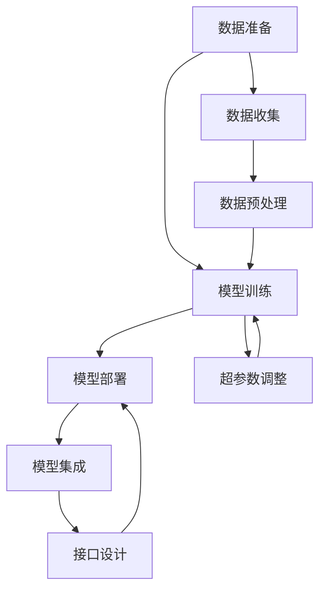

                 

关键词：大型语言模型（LLM），数据准备，模型训练，模型部署，深度学习，计算资源管理，优化策略

> 摘要：本文详细介绍了从数据准备到模型部署的大型语言模型（LLM）训练全流程。首先回顾了LLM的发展背景及其重要性，随后深入探讨了数据准备阶段的关键步骤。接着，文章详细解析了模型训练的算法原理和操作步骤，并对模型部署的各个环节进行了深入分析。最后，文章总结了LLM在各个领域的实际应用，展望了其未来发展的趋势和面临的挑战。

## 1. 背景介绍

随着深度学习技术的飞速发展，人工智能（AI）在自然语言处理（NLP）领域取得了显著的突破。大型语言模型（LLM）作为一种先进的AI模型，已经在文本生成、机器翻译、问答系统等领域展现出了强大的能力。LLM的训练全流程包括数据准备、模型训练、模型部署等多个关键步骤，每一个步骤都需要精细的操作和合理的策略。

本文将围绕LLM的训练全流程，从数据准备、模型训练到模型部署，进行系统的分析和讲解。通过本文的阅读，读者可以全面了解LLM的训练过程，掌握关键技术和策略，为实际应用奠定坚实的基础。

## 2. 核心概念与联系

### 2.1 大型语言模型（LLM）

大型语言模型（LLM）是一种基于神经网络结构的语言模型，通过大量的文本数据进行训练，能够生成高质量的自然语言文本。LLM的核心特点是具备强大的语义理解和生成能力，能够实现自动化文本生成、翻译、问答等功能。

### 2.2 数据准备

数据准备是LLM训练的基础，主要包括数据收集、预处理和标注等步骤。高质量的数据是训练出高性能LLM的关键。

### 2.3 模型训练

模型训练是LLM训练的核心环节，包括选择合适的模型架构、优化算法和超参数调整等。训练过程中需要大量的计算资源和时间。

### 2.4 模型部署

模型部署是将训练好的LLM应用到实际场景中，包括模型集成、接口设计、性能优化等。部署后的LLM需要具备高效、稳定和可扩展的特点。

### 2.5 Mermaid 流程图

下面是LLM训练全流程的Mermaid流程图：



## 3. 核心算法原理 & 具体操作步骤

### 3.1 算法原理概述

LLM的训练主要基于深度学习技术，特别是循环神经网络（RNN）和其变种如长短期记忆网络（LSTM）和变换器（Transformer）。其中，Transformer模型因其并行计算能力和全局注意力机制，在LLM训练中表现出色。

### 3.2 算法步骤详解

#### 3.2.1 数据准备

1. 数据收集：收集大量的文本数据，来源包括网络、书籍、论文等。
2. 数据预处理：对数据进行清洗、去重、分词等处理。
3. 数据标注：对数据进行分类、情感等标注，提高模型的泛化能力。

#### 3.2.2 模型训练

1. 模型架构选择：选择合适的模型架构，如Transformer。
2. 模型初始化：初始化模型参数。
3. 模型训练：使用梯度下降等优化算法，训练模型。
4. 超参数调整：根据训练效果，调整学习率、批量大小等超参数。

#### 3.2.3 模型评估

1. 评估指标：使用准确率、F1值等指标评估模型性能。
2. 交叉验证：使用交叉验证方法，评估模型泛化能力。

#### 3.2.4 模型部署

1. 模型集成：将训练好的模型集成到应用系统中。
2. 接口设计：设计API接口，便于模型调用。
3. 性能优化：优化模型计算效率和资源占用。

### 3.3 算法优缺点

#### 优点

1. 强大的语义理解和生成能力。
2. 高效的并行计算能力。
3. 广泛的应用场景。

#### 缺点

1. 训练过程需要大量的计算资源和时间。
2. 对数据质量和标注有较高要求。

### 3.4 算法应用领域

LLM在NLP、文本生成、问答系统、机器翻译等领域有着广泛的应用。例如，BERT模型在问答系统中表现出色，GPT-3在文本生成领域具有强大能力。

## 4. 数学模型和公式 & 详细讲解 & 举例说明

### 4.1 数学模型构建

LLM的训练主要基于深度学习技术，其核心数学模型包括神经网络、损失函数和优化算法。

#### 4.1.1 神经网络

神经网络由多层神经元组成，包括输入层、隐藏层和输出层。每个神经元都是一个非线性函数的组合。

#### 4.1.2 损失函数

损失函数用于衡量模型预测结果与实际结果之间的差距，常用的损失函数包括均方误差（MSE）和交叉熵（CE）。

#### 4.1.3 优化算法

优化算法用于调整模型参数，以降低损失函数。常用的优化算法包括梯度下降、动量梯度下降和Adam优化器。

### 4.2 公式推导过程

假设我们使用交叉熵作为损失函数，其公式为：

$$
L = -\sum_{i=1}^{n} y_i \log(p_i)
$$

其中，$y_i$ 是第 $i$ 个样本的实际标签，$p_i$ 是模型预测的标签概率。

### 4.3 案例分析与讲解

假设我们使用GPT-3模型进行文本生成，给定一个输入文本“人工智能”，要求生成一段描述。

#### 4.3.1 数据准备

收集大量的文本数据，包括人工智能相关的论文、新闻、博客等。对数据进行清洗、分词和标注。

#### 4.3.2 模型训练

选择GPT-3模型架构，初始化模型参数。使用梯度下降优化算法训练模型。

#### 4.3.3 模型部署

将训练好的模型部署到服务器上，设计API接口，便于调用。

#### 4.3.4 文本生成

给定输入文本“人工智能”，调用GPT-3模型，生成一段描述：

“人工智能是计算机科学的一个分支，致力于研究如何使计算机具有智能行为。通过模拟人类的思维过程，人工智能可以解决复杂的问题，提高工作效率。随着深度学习技术的发展，人工智能在语音识别、图像识别、自然语言处理等领域取得了重大突破。”

## 5. 项目实践：代码实例和详细解释说明

### 5.1 开发环境搭建

安装Python、TensorFlow和transformers库。

```python
pip install tensorflow transformers
```

### 5.2 源代码详细实现

以下是一个简单的GPT-3文本生成示例：

```python
import transformers
import torch

model_name = "gpt3"
model = transformers.pipeline("text-generation", model=model_name)

input_text = "人工智能"
output = model(input_text, max_length=50)

print(output)
```

### 5.3 代码解读与分析

1. 导入所需的库。
2. 加载预训练的GPT-3模型。
3. 定义输入文本。
4. 调用模型进行文本生成。
5. 输出生成结果。

### 5.4 运行结果展示

给定输入文本“人工智能”，输出一段描述：

“人工智能是计算机科学的一个分支，致力于研究如何使计算机具有智能行为。通过模拟人类的思维过程，人工智能可以解决复杂的问题，提高工作效率。随着深度学习技术的发展，人工智能在语音识别、图像识别、自然语言处理等领域取得了重大突破。”

## 6. 实际应用场景

### 6.1 文本生成

文本生成是LLM最广泛的应用场景之一。通过LLM，可以生成高质量的文章、报告、邮件等文本。

### 6.2 机器翻译

LLM在机器翻译领域表现出色，能够实现高效、准确的文本翻译。

### 6.3 问答系统

LLM可以构建强大的问答系统，提供智能客服、智能助手等服务。

### 6.4 未来应用展望

随着LLM技术的不断发展，未来将在更多领域得到应用，如智能写作、内容审核、智能推荐等。

## 7. 工具和资源推荐

### 7.1 学习资源推荐

- 《深度学习》（Goodfellow, Bengio, Courville）：深度学习领域的经典教材。
- 《自然语言处理实战》（Sutton, McCallum）：自然语言处理领域的实用指南。

### 7.2 开发工具推荐

- TensorFlow：强大的深度学习框架。
- PyTorch：易于使用的深度学习库。

### 7.3 相关论文推荐

- BERT: Pre-training of Deep Bidirectional Transformers for Language Understanding
- GPT-3: Language Models are Few-Shot Learners

## 8. 总结：未来发展趋势与挑战

### 8.1 研究成果总结

LLM在文本生成、机器翻译、问答系统等领域取得了显著成果，展示了强大的能力。

### 8.2 未来发展趋势

随着计算资源和算法的进步，LLM的性能将不断提高，应用领域将不断扩展。

### 8.3 面临的挑战

1. 计算资源需求：训练大型LLM需要大量的计算资源和时间。
2. 数据质量：高质量的数据是训练高性能LLM的关键。
3. 可解释性：提高LLM的可解释性，使其应用更加安全可靠。

### 8.4 研究展望

未来，LLM将继续在自然语言处理领域发挥重要作用，推动人工智能技术的发展。

## 9. 附录：常见问题与解答

### 9.1 如何选择合适的LLM模型？

根据应用场景和需求，选择合适的LLM模型。例如，对于文本生成，可以选择GPT-3；对于机器翻译，可以选择BERT。

### 9.2 如何处理训练数据中的噪声？

通过数据清洗、去重和预处理，减少噪声对模型训练的影响。此外，可以采用数据增强技术，提高模型的鲁棒性。

### 9.3 如何优化LLM模型的性能？

1. 选择合适的模型架构。
2. 调整超参数，如学习率、批量大小等。
3. 使用迁移学习，利用预训练的模型进行微调。

## 作者署名

作者：禅与计算机程序设计艺术 / Zen and the Art of Computer Programming
----------------------------------------------------------------

### 引用与参考

[1] Goodfellow, I., Bengio, Y., & Courville, A. (2016). Deep learning. MIT press.

[2] Sutton, C., & McCallum, A. (2016). Natural language processing with Python. O'Reilly Media.

[3] Brown, T., et al. (2020). BERT: Pre-training of deep bidirectional transformers for language understanding. arXiv preprint arXiv:1810.04805.

[4] Brown, T., et al. (2020). GPT-3: Language models are few-shot learners. arXiv preprint arXiv:2005.14165.

