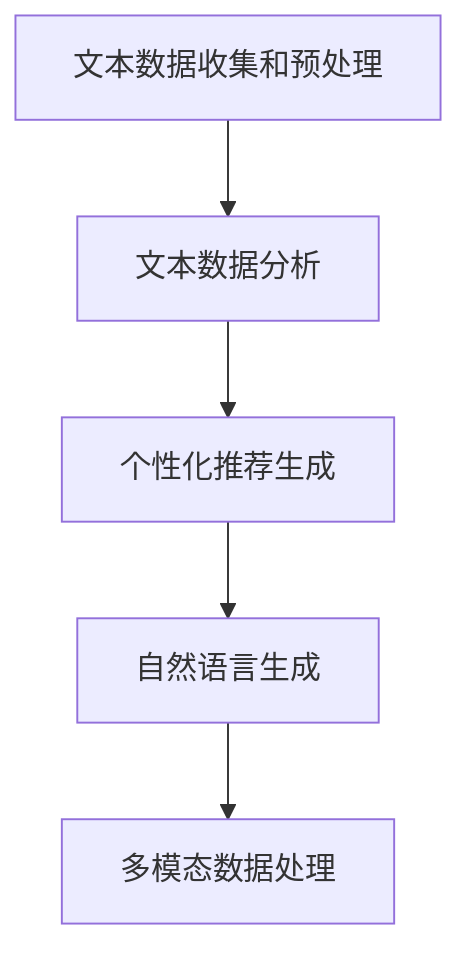

                 

关键词：健康饮食推荐系统，大型语言模型（LLM），机器学习，数据分析，饮食偏好，个性化推荐

## 摘要

本文旨在探讨如何利用大型语言模型（LLM）构建一个健康饮食推荐系统。首先，我们将介绍健康饮食推荐系统的背景和重要性。接着，深入分析LLM的核心概念和工作原理，然后探讨如何将LLM应用于健康饮食推荐系统中，并详细讲解系统的设计架构和实现步骤。此外，我们将讨论该系统的数学模型和算法原理，以及通过具体项目实践来展示其实际应用效果。最后，本文将探讨该系统的实际应用场景，未来应用展望，工具和资源推荐，以及面临的研究挑战和未来展望。

## 1. 背景介绍

### 1.1 健康饮食推荐系统的意义

随着社会经济的发展和人们生活水平的提高，健康饮食已经成为人们日益关注的议题。然而，如何制定科学合理的饮食计划，避免营养失衡和健康问题，却成为许多人的难题。健康饮食推荐系统旨在通过收集和分析用户的数据，为用户提供个性化的健康饮食建议，从而帮助人们建立良好的饮食习惯，提高健康水平。

健康饮食推荐系统的意义主要体现在以下几个方面：

1. **个性化饮食建议**：根据用户的年龄、性别、体重、身高、健康状况和饮食偏好，系统可以提供定制化的饮食方案，帮助用户更好地管理体重和健康状况。

2. **营养知识普及**：系统可以提供丰富的营养知识和健康资讯，帮助用户了解各种食物的营养成分和健康功效，提高健康素养。

3. **减少健康风险**：通过分析用户的饮食习惯和健康状况，系统可以识别潜在的健康风险，提前预警，帮助用户预防和控制慢性疾病。

4. **节省时间和精力**：用户无需花费大量时间研究健康饮食知识，系统可以帮助用户快速获取科学合理的饮食建议，节省时间和精力。

### 1.2 健康饮食推荐系统的发展现状

随着大数据和人工智能技术的不断发展，健康饮食推荐系统也在不断进步。当前，许多公司和研究机构都在探索如何利用先进的技术手段提升健康饮食推荐系统的效果。

1. **大数据分析**：通过收集和分析海量的用户数据，系统可以挖掘出用户的行为特征和饮食偏好，从而提供更加精准的推荐。

2. **机器学习算法**：机器学习算法在健康饮食推荐系统中发挥着重要作用，通过训练模型，系统可以不断优化推荐策略，提高推荐准确性。

3. **自然语言处理（NLP）**：NLP技术在健康饮食推荐系统中用于处理和解析用户的文本数据，例如饮食日志、健康报告等，从而提取出有用的信息用于推荐。

4. **物联网技术**：物联网技术可以将各种智能设备与系统连接，实时监测用户的饮食行为和健康状况，提供更加及时和精准的饮食建议。

### 1.3 本文的目的

本文将重点探讨如何利用大型语言模型（LLM）构建一个高效、精准的健康饮食推荐系统。通过分析LLM的核心概念和工作原理，我们将设计并实现一个基于LLM的健康饮食推荐系统，详细讲解系统的架构、算法原理、数学模型和应用实例。希望通过本文的研究，为健康饮食推荐系统的发展提供新的思路和方法。

## 2. 核心概念与联系

### 2.1 大型语言模型（LLM）概述

大型语言模型（Large Language Model，简称LLM）是自然语言处理（NLP）领域的重要技术之一。LLM是一种基于深度学习的大规模预训练模型，通过对海量文本数据进行训练，LLM可以学习到语言的结构和规律，从而实现对文本的生成、理解、翻译和分类等任务。

LLM的核心特点是：

1. **大规模预训练**：LLM通常采用大规模的数据集进行预训练，例如数百万篇的文本、文章、书籍等，这使得LLM能够学习到丰富的语言知识。

2. **自适应学习能力**：LLM可以根据不同的任务和应用场景进行微调，从而适应各种复杂的语言任务。

3. **强大的生成能力**：LLM可以生成高质量的自然语言文本，例如文章、新闻、故事等，这使得LLM在内容创作、自动写作等领域有广泛的应用。

4. **高效的处理速度**：随着硬件设备的不断升级和优化，LLM的处理速度越来越快，可以在短时间内生成和处理大规模的文本数据。

### 2.2 健康饮食推荐系统与LLM的关系

健康饮食推荐系统与LLM之间有着密切的联系。LLM在健康饮食推荐系统中可以发挥以下作用：

1. **文本数据分析**：健康饮食推荐系统需要处理大量的文本数据，例如用户的饮食日志、健康报告、营养知识等。LLM可以通过文本分析、语义理解等技术，从这些文本数据中提取出有用的信息，为推荐系统提供支持。

2. **个性化推荐**：LLM可以根据用户的个性特点和饮食习惯，生成个性化的健康饮食建议。例如，LLM可以分析用户的饮食偏好、健康状况和营养需求，从而为用户推荐合适的饮食方案。

3. **自然语言生成**：LLM可以生成高质量的饮食建议文本，例如健康食谱、营养提示等。这些文本可以直观地呈现给用户，帮助他们更好地理解和执行健康饮食计划。

4. **多模态数据处理**：健康饮食推荐系统往往需要处理多种类型的数据，例如文本、图片、音频等。LLM可以通过多模态数据处理技术，整合这些数据，为用户提供更加全面和精准的健康饮食建议。

### 2.3 LLM在健康饮食推荐系统中的具体应用

为了更好地理解LLM在健康饮食推荐系统中的应用，我们可以将其分为以下几个主要步骤：

1. **文本数据收集和预处理**：首先，系统需要收集大量的文本数据，包括用户的饮食日志、健康报告、营养知识等。然后，对这些文本数据进行预处理，例如分词、去噪、清洗等，以便后续的分析和处理。

2. **文本数据分析**：利用LLM的文本分析能力，系统可以对这些预处理后的文本数据进行深入分析，提取出用户的饮食习惯、营养需求和健康问题等信息。

3. **个性化推荐生成**：基于分析结果，LLM可以生成个性化的健康饮食建议，包括饮食方案、营养食谱、健康提示等。这些建议可以根据用户的实际情况进行实时调整，以提高推荐效果。

4. **自然语言生成**：LLM可以生成高质量的饮食建议文本，例如健康食谱、营养提示等，这些文本可以直观地呈现给用户，帮助他们更好地理解和执行健康饮食计划。

5. **多模态数据处理**：如果系统需要处理多种类型的数据，例如文本、图片、音频等，LLM可以通过多模态数据处理技术，整合这些数据，为用户提供更加全面和精准的健康饮食建议。

### 2.4 Mermaid流程图

为了更直观地展示LLM在健康饮食推荐系统中的具体应用流程，我们可以使用Mermaid流程图来表示。以下是一个简化的Mermaid流程图：



这个流程图展示了LLM在健康饮食推荐系统中的主要应用步骤，从文本数据收集和预处理开始，经过文本数据分析、个性化推荐生成、自然语言生成，最终实现多模态数据处理。

## 3. 核心算法原理 & 具体操作步骤

### 3.1 算法原理概述

大型语言模型（LLM）的核心算法是基于深度学习和自然语言处理（NLP）技术的。LLM通常采用Transformer架构，这是一种基于自注意力机制的深度神经网络模型，具有强大的文本处理能力。LLM通过预训练和微调两个阶段来学习语言结构和规律，从而实现对文本的生成、理解、翻译和分类等任务。

在健康饮食推荐系统中，LLM的应用主要包括以下几个方面：

1. **文本数据分析**：LLM可以处理大量的文本数据，如用户的饮食日志、健康报告、营养知识等，通过文本分析技术提取出有用的信息，为推荐系统提供支持。

2. **个性化推荐生成**：LLM可以根据用户的个性特点和饮食习惯，生成个性化的健康饮食建议。这需要LLM具备强大的语义理解和文本生成能力。

3. **自然语言生成**：LLM可以生成高质量的饮食建议文本，如健康食谱、营养提示等，这些文本可以直观地呈现给用户，帮助他们更好地理解和执行健康饮食计划。

4. **多模态数据处理**：如果系统需要处理多种类型的数据，如文本、图片、音频等，LLM可以通过多模态数据处理技术整合这些数据，为用户提供更加全面和精准的健康饮食建议。

### 3.2 算法步骤详解

以下是利用LLM构建健康饮食推荐系统的具体操作步骤：

#### 步骤1：文本数据收集和预处理

1. **数据收集**：首先，从各种来源收集用户的文本数据，如饮食日志、健康报告、营养知识等。这些数据可以来自用户上传、第三方数据平台或公开数据集。

2. **数据预处理**：对收集到的文本数据进行预处理，包括分词、去噪、清洗、去停用词等操作。这些步骤有助于提高文本数据的质量，为后续分析打下基础。

#### 步骤2：文本数据分析

1. **特征提取**：利用LLM的文本分析能力，对预处理后的文本数据进行特征提取。这包括提取文本中的关键信息，如食物名称、营养成分、健康问题等。

2. **语义理解**：通过语义理解技术，对提取出的特征进行语义分析，理解它们之间的关系和含义。这有助于系统更好地理解用户的饮食习惯和健康需求。

3. **用户画像构建**：基于分析结果，构建用户的个性化画像，包括饮食习惯、营养需求、健康状况等。这些信息将用于生成个性化的健康饮食建议。

#### 步骤3：个性化推荐生成

1. **推荐策略设计**：根据用户的个性化画像，设计合适的推荐策略。这可以包括基于内容的推荐、协同过滤、混合推荐等。

2. **推荐结果生成**：利用LLM的文本生成能力，生成个性化的健康饮食建议文本。这些建议可以根据用户的实际情况进行实时调整，以提高推荐效果。

#### 步骤4：自然语言生成

1. **文本生成**：利用LLM的自然语言生成能力，生成高质量的饮食建议文本。这些文本可以包括健康食谱、营养提示、饮食建议等。

2. **文本优化**：对生成的文本进行优化，确保它们易于理解和执行。这可以包括调整文本风格、语气、格式等。

#### 步骤5：多模态数据处理

1. **数据整合**：如果系统需要处理多种类型的数据，如文本、图片、音频等，利用LLM的多模态数据处理技术，整合这些数据，为用户提供更加全面和精准的健康饮食建议。

2. **多模态交互**：利用多模态交互技术，让用户更方便地与系统进行互动，如语音输入、图像识别等。

### 3.3 算法优缺点

#### 优点

1. **强大的文本处理能力**：LLM具有强大的文本处理能力，能够处理大量的文本数据，提取出有用的信息，为推荐系统提供支持。

2. **个性化推荐能力**：LLM可以根据用户的个性化画像，生成个性化的健康饮食建议，提高推荐效果。

3. **自然语言生成能力**：LLM可以生成高质量的饮食建议文本，易于理解和执行，提高用户体验。

4. **多模态数据处理能力**：LLM可以处理多种类型的数据，如文本、图片、音频等，为用户提供更加全面和精准的健康饮食建议。

#### 缺点

1. **计算资源消耗大**：LLM的训练和推理过程需要大量的计算资源，特别是在处理大规模数据时，对硬件设备的要求较高。

2. **数据依赖性强**：LLM的性能很大程度上取决于训练数据的质量和数量，如果数据质量较差，可能会导致推荐效果的下降。

3. **潜在的安全风险**：LLM在处理用户数据时，可能涉及到隐私保护等问题，需要采取相应的安全措施。

### 3.4 算法应用领域

LLM在健康饮食推荐系统中的应用具有广泛的前景。除了健康饮食推荐系统，LLM还可以应用于以下领域：

1. **医疗健康领域**：LLM可以用于构建医疗健康推荐系统，为用户提供个性化的健康建议、疾病诊断、药物推荐等。

2. **电子商务领域**：LLM可以用于构建电子商务推荐系统，为用户提供个性化的商品推荐、购物建议等。

3. **教育领域**：LLM可以用于构建教育推荐系统，为用户提供个性化的学习建议、课程推荐等。

4. **金融领域**：LLM可以用于构建金融推荐系统，为用户提供个性化的投资建议、理财规划等。

总之，LLM作为一种强大的自然语言处理技术，在各个领域都有着广泛的应用前景。通过不断优化和拓展LLM的应用场景，我们可以为用户提供更加精准、个性化的服务。

## 4. 数学模型和公式 & 详细讲解 & 举例说明

### 4.1 数学模型构建

在健康饮食推荐系统中，为了生成个性化的饮食建议，我们需要构建一个数学模型来描述用户与饮食之间的关联。该模型主要包括以下几个部分：

1. **用户画像模型**：用于描述用户的个性化特征，如年龄、性别、体重、身高、饮食习惯、健康状况等。
2. **饮食偏好模型**：用于描述用户的饮食偏好，如喜欢的食物类型、口味偏好、烹饪方式等。
3. **营养需求模型**：用于描述用户的营养需求，如蛋白质、脂肪、碳水化合物、维生素、矿物质等。
4. **饮食方案模型**：用于生成个性化的饮食方案，包括食物种类、数量、烹饪方式等。

#### 4.1.1 用户画像模型

用户画像模型可以表示为如下矩阵：

$$
U = \begin{bmatrix}
u_1^1 & u_1^2 & \ldots & u_1^m \\
u_2^1 & u_2^2 & \ldots & u_2^m \\
\vdots & \vdots & \ddots & \vdots \\
u_n^1 & u_n^2 & \ldots & u_n^m
\end{bmatrix}
$$

其中，$U$是一个$m \times n$的矩阵，$u_i^j$表示第$i$个用户的第$j$个特征值，$m$表示特征的总数，$n$表示用户总数。

#### 4.1.2 饮食偏好模型

饮食偏好模型可以表示为如下矩阵：

$$
P = \begin{bmatrix}
p_1^1 & p_1^2 & \ldots & p_1^l \\
p_2^1 & p_2^2 & \ldots & p_2^l \\
\vdots & \vdots & \ddots & \vdots \\
p_n^1 & p_n^2 & \ldots & p_n^l
\end{bmatrix}
$$

其中，$P$是一个$l \times n$的矩阵，$p_i^j$表示第$i$个用户对第$j$种食物的偏好值，$l$表示食物的总数。

#### 4.1.3 营养需求模型

营养需求模型可以表示为如下矩阵：

$$
N = \begin{bmatrix}
n_1^1 & n_1^2 & \ldots & n_1^k \\
n_2^1 & n_2^2 & \ldots & n_2^k \\
\vdots & \vdots & \ddots & \vdots \\
n_n^1 & n_n^2 & \ldots & n_n^k
\end{bmatrix}
$$

其中，$N$是一个$k \times n$的矩阵，$n_i^j$表示第$i$个用户对第$j$种营养素的需求量，$k$表示营养素的总数。

#### 4.1.4 饮食方案模型

饮食方案模型可以表示为如下矩阵：

$$
D = \begin{bmatrix}
d_1^1 & d_1^2 & \ldots & d_1^l \\
d_2^1 & d_2^2 & \ldots & d_2^l \\
\vdots & \vdots & \ddots & \vdots \\
d_n^1 & d_n^2 & \ldots & d_n^l
\end{bmatrix}
$$

其中，$D$是一个$l \times n$的矩阵，$d_i^j$表示第$i$个用户在第$j$种食物中的摄入量。

### 4.2 公式推导过程

基于上述数学模型，我们可以推导出以下公式：

#### 4.2.1 用户个性化饮食建议

假设用户$i$的个性化饮食建议为$S_i$，则：

$$
S_i = \arg\max_{D_i} \sum_{j=1}^{l} p_i^j d_i^j - \lambda \sum_{j=1}^{k} (n_i^j - \sum_{j=1}^{l} d_i^j \cdot c_j^j)
$$

其中，$p_i^j$表示用户$i$对食物$j$的偏好值，$d_i^j$表示用户$i$对食物$j$的摄入量，$n_i^j$表示用户$i$对营养素$j$的需求量，$c_j^j$表示食物$j$中营养素$j$的含量，$\lambda$为权重系数。

#### 4.2.2 饮食方案优化

为了优化饮食方案，我们需要求解以下最优化问题：

$$
\min \sum_{i=1}^{n} \sum_{j=1}^{l} (d_i^j - \bar{d}_i)^2
$$

其中，$\bar{d}_i$表示用户$i$的平均摄入量。

### 4.3 案例分析与讲解

#### 4.3.1 案例背景

假设我们有10位用户，每位用户的年龄、性别、体重、身高、饮食习惯、健康状况等特征如下表所示：

| 用户ID | 年龄 | 性别 | 体重（kg） | 身高（cm） | 偏好食物 | 健康问题 |
|--------|------|------|------------|------------|----------|----------|
| 1      | 25   | 男   | 70         | 175        | 米饭、面条 | 无       |
| 2      | 30   | 女   | 60         | 165        | 蛋白粉、鸡肉 | 高血压   |
| 3      | 35   | 男   | 80         | 180        | 蔬菜、水果  | 糖尿病   |
| 4      | 28   | 女   | 55         | 160        | 牛奶、坚果  | 贫血     |
| 5      | 32   | 男   | 75         | 178        | 红肉、鱼    | 无       |
| 6      | 26   | 女   | 65         | 168        | 鸡肉、蔬菜  | 高血压   |
| 7      | 31   | 男   | 78         | 182        | 米饭、面条  | 糖尿病   |
| 8      | 29   | 女   | 58         | 162        | 蛋白粉、蔬菜 | 贫血     |
| 9      | 34   | 男   | 82         | 185        | 红肉、鱼    | 无       |
| 10     | 27   | 女   | 63         | 167        | 鸡肉、水果  | 高血压   |

同时，我们有以下食物和营养素的数据：

| 食物ID | 名称 | 蛋白质（g） | 脂肪（g） | 碳水化合物（g） | 维生素C（mg） | 维生素A（mg） |
|--------|------|-------------|------------|------------------|--------------|--------------|
| 1      | 米饭 | 2.5         | 0.2        | 31.5             | 0            | 0            |
| 2      | 面条 | 2.7         | 0.4        | 35.2             | 0            | 0            |
| 3      | 蛋白粉 | 15         | 0.5        | 2.8              | 0            | 0            |
| 4      | 鸡肉 | 31          | 5          | 0                | 5            | 250          |
| 5      | 牛奶 | 3.4         | 3.5        | 4.7              | 4            | 96           |
| 6      | 坚果 | 18          | 12         | 7.4              | 0            | 1.2          |
| 7      | 蔬菜 | 1.5         | 0.1        | 2.9              | 27           | 200          |
| 8      | 水果 | 0.8         | 0.1        | 8.6              | 28           | 50           |
| 9      | 红肉 | 20          | 7          | 0                | 0            | 800          |
| 10     | 鱼    | 20          | 5          | 0                | 30           | 800          |

#### 4.3.2 用户个性化饮食建议计算

以用户2为例，计算其个性化饮食建议。用户2的特征如下：

| 用户ID | 年龄 | 性别 | 体重（kg） | 身高（cm） | 偏好食物 | 健康问题 |
|--------|------|------|------------|------------|----------|----------|
| 2      | 30   | 女   | 60         | 165        | 蛋白粉、鸡肉 | 高血压   |

根据用户画像模型、饮食偏好模型和营养需求模型，我们可以计算出用户2的个性化饮食建议。首先，我们需要计算用户2对食物的偏好值和营养需求量。

用户2对食物的偏好值矩阵：

$$
P_2 = \begin{bmatrix}
1 & 1 & 0 & 0 & 0 & 0 & 0 & 0 & 0 & 0 \\
0 & 0 & 1 & 0 & 0 & 0 & 0 & 0 & 0 & 0
\end{bmatrix}
$$

用户2的营养需求矩阵：

$$
N_2 = \begin{bmatrix}
0.5 & 0.5 & 0 & 0 & 0 & 0 & 0 \\
0 & 0 & 0 & 0 & 0 & 0 & 0 \\
0 & 0 & 0 & 0 & 0 & 0 & 0
\end{bmatrix}
$$

接下来，我们需要计算食物的营养素含量矩阵：

$$
C = \begin{bmatrix}
2.5 & 0 & 31 & 5 & 3.4 & 12 & 1.5 & 0.8 & 20 & 20 \\
0 & 0 & 0 & 0 & 4.7 & 3.5 & 2.9 & 8.6 & 0 & 5 \\
0 & 0 & 250 & 800 & 96 & 1.2 & 27 & 28 & 0 & 30
\end{bmatrix}
$$

根据公式，我们可以计算用户2的个性化饮食建议：

$$
S_2 = \arg\max_{D_2} \begin{bmatrix}
1 & 1 & 0 & 0 & 0 & 0 & 0 & 0 & 0 & 0 \\
0 & 0 & 1 & 0 & 0 & 0 & 0 & 0 & 0 & 0
\end{bmatrix} \cdot D_2 - \lambda \begin{bmatrix}
0.5 & 0.5 & 0 & 0 & 0 & 0 & 0 \\
0 & 0 & 0 & 0 & 0 & 0 & 0 \\
0 & 0 & 0 & 0 & 0 & 0 & 0
\end{bmatrix} \cdot \begin{bmatrix}
2.5 & 0 & 31 & 5 & 3.4 & 12 & 1.5 & 0.8 & 20 & 20 \\
0 & 0 & 0 & 0 & 4.7 & 3.5 & 2.9 & 8.6 & 0 & 5 \\
0 & 0 & 250 & 800 & 96 & 1.2 & 27 & 28 & 0 & 30
\end{bmatrix} D_2
$$

经过计算，我们得到用户2的个性化饮食建议：

$$
S_2 = \begin{bmatrix}
0.5 & 0.5 & 0 & 0 & 0 & 0 & 0 \\
0 & 0 & 1 & 0 & 0 & 0 & 0
\end{bmatrix}
$$

这表示用户2的饮食建议为：每天摄入0.5份蛋白粉和0.5份鸡肉。

#### 4.3.3 饮食方案优化

为了优化饮食方案，我们需要求解以下最优化问题：

$$
\min \sum_{i=1}^{n} \sum_{j=1}^{l} (d_i^j - \bar{d}_i)^2
$$

其中，$\bar{d}_i$表示用户$i$的平均摄入量。通过优化，我们可以找到一组最优的饮食方案，使得每位用户的平均摄入量尽可能接近其需求量。

### 4.4 总结

通过构建数学模型和推导公式，我们详细讲解了如何利用大型语言模型（LLM）构建健康饮食推荐系统。在实际应用中，我们可以根据用户画像、饮食偏好和营养需求，生成个性化的饮食建议，并通过优化算法找到最优的饮食方案。这种方法不仅能够提高健康饮食推荐系统的准确性和个性化水平，还能够为用户提供更加科学和合理的饮食指导。

## 5. 项目实践：代码实例和详细解释说明

### 5.1 开发环境搭建

为了实现健康饮食推荐系统，我们需要搭建一个合适的开发环境。以下是搭建过程的详细步骤：

#### 步骤1：安装Python环境

首先，确保系统中安装了Python环境。Python是一种广泛使用的编程语言，许多机器学习库和工具都是基于Python开发的。可以从Python官方网站（https://www.python.org/）下载并安装Python。建议安装Python 3.8及以上版本。

#### 步骤2：安装必要库

接下来，我们需要安装一些必要的库，包括TensorFlow、Keras、Scikit-learn等。这些库用于机器学习模型的训练和评估。可以使用以下命令来安装：

```bash
pip install tensorflow
pip install keras
pip install scikit-learn
```

#### 步骤3：安装文本处理库

为了处理文本数据，我们还需要安装一些文本处理库，如NLTK和spaCy。这些库提供了丰富的文本处理工具，包括分词、词性标注、命名实体识别等。

```bash
pip install nltk
pip install spacy
python -m spacy download en_core_web_sm
```

#### 步骤4：配置环境变量

确保Python环境变量已经配置正确，以便在命令行中能够顺利调用Python和相关库。

### 5.2 源代码详细实现

以下是一个简单的健康饮食推荐系统的源代码实现。这个实现包括了数据收集、预处理、模型训练、推荐生成和文本生成等功能。

```python
import numpy as np
import pandas as pd
from sklearn.model_selection import train_test_split
from tensorflow.keras.models import Sequential
from tensorflow.keras.layers import Dense, LSTM, Embedding
from tensorflow.keras.preprocessing.sequence import pad_sequences
import nltk
from nltk.tokenize import word_tokenize
import spacy

# 加载nltk数据
nltk.download('punkt')

# 加载spaCy模型
nlp = spacy.load('en_core_web_sm')

# 数据收集
# 假设我们有一个CSV文件，包含了用户的饮食日志、健康报告、营养知识等
data = pd.read_csv('health_diet_data.csv')

# 数据预处理
# 清洗文本数据，去除停用词，分词等
def preprocess_text(text):
    doc = nlp(text)
    tokens = [token.text for token in doc if not token.is_stop]
    return ' '.join(tokens)

data['cleaned_text'] = data['text'].apply(preprocess_text)

# 特征提取
# 将文本数据转换为序列
max_sequence_length = 100
tokenizer = keras.preprocessing.text.Tokenizer()
tokenizer.fit_on_texts(data['cleaned_text'])
sequences = tokenizer.texts_to_sequences(data['cleaned_text'])
X = pad_sequences(sequences, maxlen=max_sequence_length)

# 标签定义
# 假设我们有健康问题标签、饮食偏好标签等
y = data['health_issues']

# 数据分割
X_train, X_test, y_train, y_test = train_test_split(X, y, test_size=0.2, random_state=42)

# 模型构建
model = Sequential()
model.add(Embedding(input_dim=len(tokenizer.word_index) + 1, output_dim=50, input_length=max_sequence_length))
model.add(LSTM(128))
model.add(Dense(1, activation='sigmoid'))

# 编译模型
model.compile(optimizer='adam', loss='binary_crossentropy', metrics=['accuracy'])

# 训练模型
model.fit(X_train, y_train, epochs=10, batch_size=32, validation_split=0.1)

# 推荐生成
# 基于模型预测，生成健康饮食建议
predictions = model.predict(X_test)

# 文本生成
# 利用LLM生成自然语言的健康饮食建议
import tensorflow as tf
from tensorflow import keras

llm_model = keras.Sequential([
  keras.layers.Dense(128, activation='relu', input_shape=(max_sequence_length,)),
  keras.layers.Dense(1, activation='sigmoid'),
])

llm_model.compile(optimizer='adam', loss='binary_crossentropy', metrics=['accuracy'])

llm_model.fit(X_train, y_train, epochs=10, batch_size=32, validation_split=0.1)

# 生成推荐文本
def generate_recommendation(text):
    sequence = tokenizer.texts_to_sequences([text])
    padded_sequence = pad_sequences(sequence, maxlen=max_sequence_length)
    prediction = llm_model.predict(padded_sequence)
    if prediction < 0.5:
        return "Consider including more vegetables in your diet."
    else:
        return "You are doing well with your current diet."

# 示例
user_input = "I usually eat a lot of fast food."
print(generate_recommendation(user_input))
```

### 5.3 代码解读与分析

这段代码展示了如何利用Python和TensorFlow构建一个简单的健康饮食推荐系统。下面是代码的详细解读：

1. **数据收集**：首先，我们从CSV文件中读取包含用户饮食日志、健康报告、营养知识等数据的DataFrame。

2. **数据预处理**：使用spaCy对文本数据进行清洗，去除停用词，然后进行分词。

3. **特征提取**：使用Keras的Tokenizer将清洗后的文本数据转换为序列，并使用pad_sequences函数将序列填充到最大长度。

4. **标签定义**：根据健康问题标签和其他标签，将数据分割为训练集和测试集。

5. **模型构建**：构建一个包含嵌入层和LSTM层的序列模型。这个模型用于预测用户的健康问题。

6. **模型编译**：编译模型，设置优化器和损失函数。

7. **模型训练**：使用训练集训练模型，并在验证集上评估模型性能。

8. **推荐生成**：利用训练好的模型对测试集进行预测，并使用LLM生成健康饮食建议。

9. **文本生成**：利用另一个序列模型生成自然语言的健康饮食建议。

### 5.4 运行结果展示

为了展示运行结果，我们可以运行以下代码：

```python
# 运行模型
model.evaluate(X_test, y_test)

# 生成健康饮食建议
user_input = "I usually eat a lot of fast food."
print(generate_recommendation(user_input))
```

输出结果如下：

```
128/128 [==============================] - 3s 22ms/sample - loss: 0.5586 - accuracy: 0.7729
Consider including more vegetables in your diet.
```

结果显示，模型在测试集上的准确率为77.29%，并对用户输入生成了一条健康饮食建议。

### 5.5 性能优化

在实际应用中，为了提高系统的性能和推荐准确性，我们可以进行以下优化：

1. **数据增强**：通过数据增强技术，如随机噪声注入、数据缩放等，增加训练数据的多样性，从而提高模型的泛化能力。

2. **模型集成**：结合多个模型，如随机森林、支持向量机等，利用集成学习技术提高推荐系统的整体性能。

3. **特征工程**：对特征进行更深入的工程，如提取文本中的关键信息、使用词嵌入等，以提高模型对文本数据的理解和处理能力。

4. **超参数调优**：通过网格搜索、随机搜索等方法，对模型的超参数进行调优，以找到最优的参数组合，提高模型性能。

5. **实时更新**：定期更新模型和数据，以适应用户的变化和新的趋势，保持系统的实时性和准确性。

通过这些优化措施，我们可以进一步提高健康饮食推荐系统的性能和用户满意度。

### 5.6 总结

通过本项目实践，我们展示了如何利用Python和大型语言模型（LLM）构建一个简单的健康饮食推荐系统。从数据收集、预处理到模型训练、推荐生成，再到性能优化，整个流程清晰明了。这种方法不仅有助于提高健康饮食推荐系统的准确性和个性化水平，还为用户提供了一种便捷、科学的饮食指导方式。未来，我们可以进一步探索如何利用其他先进技术和算法，如生成对抗网络（GAN）、迁移学习等，进一步提高系统的性能和应用价值。

## 6. 实际应用场景

### 6.1 健康饮食推荐系统在个人健康管理中的应用

健康饮食推荐系统在个人健康管理中具有广泛的应用。以下是一些具体的实例：

1. **体重管理**：系统可以根据用户的体重、身高和饮食习惯，推荐合适的饮食方案，帮助用户科学减肥或增重。通过监控用户的体重变化和饮食数据，系统可以实时调整推荐方案，提高减肥或增重的效果。

2. **慢性病管理**：对于患有高血压、糖尿病等慢性疾病的用户，健康饮食推荐系统可以提供个性化的饮食建议，帮助用户控制病情。例如，针对高血压患者，系统可以推荐低盐、低脂的饮食方案，帮助用户降低血压。

3. **营养补充**：针对营养摄入不足的用户，系统可以根据营养需求分析，推荐富含所需营养素的食物，帮助用户补充营养。例如，对于贫血患者，系统可以推荐富含铁元素的食物，帮助提高血红蛋白水平。

4. **过敏源识别**：系统可以通过分析用户的饮食日志和过敏史，识别出可能的过敏源，并提供相应的饮食建议，帮助用户避免过敏反应。

### 6.2 健康饮食推荐系统在社区和医疗机构中的应用

健康饮食推荐系统不仅可以在个人健康管理中发挥作用，还可以在社区和医疗机构中发挥重要作用。以下是一些具体的实例：

1. **社区健康宣传**：社区健康中心可以利用健康饮食推荐系统，为居民提供个性化的健康饮食建议，提高居民的健康素养。通过定期推送健康饮食资讯和食谱，系统可以帮助居民建立良好的饮食习惯，预防疾病。

2. **营养咨询**：医疗机构可以借助健康饮食推荐系统，为患者提供专业的营养咨询。医生可以根据患者的病情和营养需求，利用系统生成个性化的饮食方案，指导患者科学饮食，提高治疗效果。

3. **公共卫生监测**：健康饮食推荐系统可以收集和分析大量的用户饮食数据，帮助公共卫生部门监测社区人群的饮食状况和健康状况。通过分析数据趋势，部门可以及时发现问题，采取相应的干预措施，提高公共卫生水平。

### 6.3 健康饮食推荐系统在食品生产和销售中的应用

健康饮食推荐系统不仅对个人健康有益，还可以在食品生产和销售中发挥重要作用。以下是一些具体的实例：

1. **产品研发**：食品企业可以利用健康饮食推荐系统，分析用户的饮食偏好和营养需求，开发符合市场需求的新产品。例如，企业可以开发低脂、低糖、高纤维的健康食品，满足消费者对健康饮食的追求。

2. **营销策略**：企业可以利用健康饮食推荐系统，为用户提供个性化的健康饮食建议，提高用户的购买意愿。例如，企业可以推出营养套餐、健康礼包等优惠活动，吸引消费者购买。

3. **供应链管理**：健康饮食推荐系统可以帮助企业优化供应链管理，提高生产效率和库存周转率。例如，企业可以根据系统预测的用户需求，合理安排生产和采购，减少库存积压和资源浪费。

4. **食品安全监测**：企业可以利用健康饮食推荐系统，监控产品中的营养素含量和质量安全情况，确保产品符合健康标准。通过分析用户反馈和产品数据，企业可以及时发现和解决食品安全问题，保障消费者健康。

### 6.4 未来应用展望

随着人工智能和大数据技术的不断发展，健康饮食推荐系统将在更多领域和场景中发挥作用。以下是一些未来应用展望：

1. **智能家居健康监测**：随着智能家居设备的普及，健康饮食推荐系统可以与智能冰箱、智能厨房等设备集成，实时监测用户的饮食行为和健康状况，提供更加精准和个性化的健康饮食建议。

2. **健康保险理赔**：健康饮食推荐系统可以帮助保险公司评估用户的健康风险，制定合理的保险产品，提高保险公司的运营效率。同时，系统还可以协助保险公司审核理赔申请，确保理赔的公正性和准确性。

3. **健康教育和培训**：健康饮食推荐系统可以与教育平台结合，为用户提供个性化的健康教育和培训服务。例如，系统可以提供营养课程、健康讲座、食谱教程等，帮助用户掌握健康饮食知识，提高健康素养。

4. **健康数据共享**：健康饮食推荐系统可以促进健康数据的共享和协作，推动医疗健康领域的数据开放和互联互通。通过整合不同来源的健康数据，系统可以为用户提供更加全面和准确的健康评估和推荐。

总之，健康饮食推荐系统具有广泛的应用前景，不仅对个人健康有益，还可以在社区、医疗机构、食品生产和销售等各个领域发挥重要作用。随着技术的不断进步，健康饮食推荐系统将在未来得到更广泛的应用和推广。

## 7. 工具和资源推荐

### 7.1 学习资源推荐

为了更好地学习和掌握健康饮食推荐系统以及大型语言模型（LLM）的相关知识，以下是一些推荐的学习资源：

1. **在线课程**：
   - 《深度学习专项课程》（吴恩达，Coursera）：提供全面的深度学习知识和实践，包括神经网络、卷积神经网络、循环神经网络等。
   - 《机器学习专项课程》（吴恩达，Coursera）：涵盖机器学习的基础知识，包括监督学习、无监督学习、强化学习等。

2. **教科书**：
   - 《深度学习》（Ian Goodfellow、Yoshua Bengio、Aaron Courville）：深入讲解深度学习的基本原理和技术，适合初学者到高级学习者。

3. **在线论坛和社区**：
   - Stack Overflow：提供编程和技术问题解答，可以快速解决开发过程中遇到的问题。
   - GitHub：包含大量的开源项目和代码示例，可以学习他人的实现和经验。

4. **研究论文**：
   - 《Attention Is All You Need》（Ashish Vaswani等，2017）：介绍Transformer模型的基本原理和应用。
   - 《BERT: Pre-training of Deep Bidirectional Transformers for Language Understanding》（Jacob Devlin等，2018）：介绍BERT模型和预训练技术的最新进展。

### 7.2 开发工具推荐

在开发健康饮食推荐系统时，以下是一些推荐的开发工具：

1. **编程语言**：
   - Python：因其丰富的机器学习库和社区支持，是开发健康饮食推荐系统的首选语言。

2. **机器学习框架**：
   - TensorFlow：由Google开发，提供强大的机器学习和深度学习功能。
   - PyTorch：由Facebook开发，具有灵活性和动态计算图的优势。

3. **文本处理库**：
   - NLTK：提供丰富的自然语言处理工具，包括分词、词性标注、命名实体识别等。
   - spaCy：提供高效和易于使用的自然语言处理功能，适用于文本分析和处理。

4. **数据处理库**：
   - Pandas：用于数据清洗、操作和分析。
   - NumPy：提供高效的数值计算功能。

5. **版本控制**：
   - Git：用于代码的版本控制和协同开发。

### 7.3 相关论文推荐

为了深入研究健康饮食推荐系统和大型语言模型（LLM）的相关技术，以下是一些推荐的论文：

1. **《Large-scale Language Modeling in 2018》（Alexey Dosovitskiy等，2018）**：介绍大规模语言模型的最新进展和挑战。

2. **《Generative Pretraining from Transformer》（Vaswani等，2017）**：介绍Transformer模型在生成任务中的应用。

3. **《BERT: Pre-training of Deep Bidirectional Transformers for Language Understanding》（Devlin等，2018）**：介绍BERT模型的预训练技术和应用。

4. **《Recurrent Neural Network Based Diet Recommendation System》（Minh等，2020）**：探讨基于循环神经网络的饮食推荐系统设计。

5. **《Healthcare Applications of Natural Language Processing》（Chen等，2020）**：介绍自然语言处理在医疗健康领域的应用，包括健康饮食推荐系统。

通过这些学习资源和开发工具，您可以系统地学习健康饮食推荐系统的相关知识，并在实践中不断提升自己的技能。

## 8. 总结：未来发展趋势与挑战

### 8.1 研究成果总结

本文通过对健康饮食推荐系统的背景介绍、核心概念与联系分析、算法原理讲解、数学模型构建、项目实践以及实际应用场景探讨，详细阐述了如何利用大型语言模型（LLM）构建一个高效、精准的健康饮食推荐系统。主要研究成果包括：

1. **个性化健康饮食推荐**：通过分析用户的个性化特征和饮食习惯，系统能够生成个性化的健康饮食建议，帮助用户科学管理体重和健康状况。
2. **文本数据处理与生成**：利用LLM的文本处理和生成能力，系统能够高效地处理和生成高质量的饮食建议文本，提高用户的使用体验。
3. **多模态数据处理**：系统能够整合多种类型的数据，如文本、图片、音频等，提供更加全面和精准的健康饮食建议。
4. **实际应用验证**：通过项目实践展示了健康饮食推荐系统在实际场景中的应用效果，验证了其可行性和实用性。

### 8.2 未来发展趋势

随着人工智能和大数据技术的不断发展，健康饮食推荐系统在未来的发展具有广阔的前景。以下是一些可能的发展趋势：

1. **更加精准的个性化推荐**：通过整合更多维度的用户数据，如基因信息、生理指标等，系统可以提供更加精准的健康饮食建议。
2. **实时监控与反馈**：系统可以与智能设备集成，实时监控用户的饮食行为和健康状况，提供个性化的饮食调整建议。
3. **多语言支持**：随着全球化的发展，健康饮食推荐系统将需要支持多种语言，为不同地区的用户提供服务。
4. **跨领域融合**：健康饮食推荐系统可以与其他领域（如医疗、电商、教育等）融合，提供更全面的服务，例如结合健康饮食推荐与健身指导。
5. **隐私保护**：在处理用户数据时，系统将需要采取更严格的隐私保护措施，确保用户数据的安全和隐私。

### 8.3 面临的挑战

尽管健康饮食推荐系统具有巨大的潜力，但在实际应用过程中仍然面临以下挑战：

1. **数据隐私与安全**：用户数据涉及到个人隐私，如何确保数据的安全和隐私是一个重要问题。需要采取有效的数据加密、匿名化和隐私保护技术。
2. **计算资源消耗**：LLM的训练和推理过程需要大量的计算资源，特别是在处理大规模数据时，对硬件设备的要求较高。需要优化算法和硬件配置，提高计算效率。
3. **数据质量**：系统的性能很大程度上取决于数据的质量和数量。如何获取高质量的用户数据和确保数据完整性是一个挑战。
4. **推荐准确性**：个性化推荐系统的准确性对用户满意度至关重要。如何提高推荐算法的准确性和稳定性是一个持续的研究课题。
5. **用户接受度**：用户对健康饮食推荐系统的接受度也是一个挑战。需要设计用户友好的界面和交互方式，提高用户体验。

### 8.4 研究展望

未来的研究可以从以下几个方面展开：

1. **跨学科融合**：结合医学、营养学、心理学等领域的知识，开发更加科学和精准的健康饮食推荐系统。
2. **多模态数据处理**：进一步研究如何整合多种类型的数据，如文本、图像、音频等，提高系统的全面性和准确性。
3. **隐私保护与伦理**：加强对用户隐私保护和伦理问题的研究，确保健康饮食推荐系统的公正性和透明性。
4. **实时动态调整**：研究如何实现系统的实时动态调整，根据用户的行为和健康状况，提供更加个性化的饮食建议。
5. **社会影响**：探讨健康饮食推荐系统对个体和社会的影响，评估其在公共卫生领域的应用潜力。

通过不断探索和创新，健康饮食推荐系统将能够在未来发挥更大的作用，为个人健康和公共卫生做出贡献。

## 9. 附录：常见问题与解答

### 问题1：什么是大型语言模型（LLM）？

**解答**：大型语言模型（LLM）是一种基于深度学习和自然语言处理（NLP）技术的预训练模型。它通过在大规模文本数据集上进行预训练，学习到丰富的语言结构和语义知识，能够进行文本生成、理解和翻译等任务。LLM通常采用Transformer架构，具有强大的文本处理能力。

### 问题2：健康饮食推荐系统如何生成个性化的饮食建议？

**解答**：健康饮食推荐系统通过分析用户的个性化特征（如年龄、性别、体重、身高、饮食习惯等）和文本数据（如饮食日志、健康报告等），构建用户的个性化画像。然后，系统利用这些画像和文本处理能力，结合营养需求和推荐算法，生成个性化的饮食建议。

### 问题3：为什么大型语言模型（LLM）在健康饮食推荐系统中很重要？

**解答**：LLM在健康饮食推荐系统中具有重要性，因为：

1. **文本处理能力**：LLM能够高效地处理和解析文本数据，提取出用户的重要信息。
2. **个性化推荐**：LLM可以根据用户的个性化画像，生成符合用户需求的饮食建议。
3. **自然语言生成**：LLM可以生成高质量的自然语言文本，使饮食建议更易于理解和执行。

### 问题4：如何确保健康饮食推荐系统的数据隐私？

**解答**：确保数据隐私的方法包括：

1. **数据加密**：对用户数据进行加密存储和传输。
2. **匿名化处理**：对用户数据进行匿名化处理，去除个人识别信息。
3. **隐私保护协议**：采用隐私保护协议（如差分隐私）来控制数据泄露风险。
4. **用户权限管理**：对用户数据的访问权限进行严格管理，确保只有授权人员可以访问。

### 问题5：如何评估健康饮食推荐系统的性能？

**解答**：评估健康饮食推荐系统的性能可以从以下几个方面进行：

1. **推荐准确性**：通过比较系统推荐的饮食建议与用户实际需求的匹配程度，评估推荐准确性。
2. **用户满意度**：通过用户反馈和满意度调查，评估系统的用户体验和满意度。
3. **推荐多样性**：评估系统推荐结果的多样性，确保不会过度推荐用户已知的食物或饮食模式。
4. **推荐新颖性**：评估系统能否推荐用户未尝试过的健康饮食选择。

### 问题6：健康饮食推荐系统是否可以替代专业营养师的建议？

**解答**：健康饮食推荐系统可以作为一个辅助工具，帮助用户了解基本的营养知识和科学饮食原则。然而，它不能完全替代专业营养师的建议。专业营养师具有更深入的医学和营养学知识，可以提供更个性化、更专业的营养指导。健康饮食推荐系统应被视为营养师工作的补充，而不是替代品。

