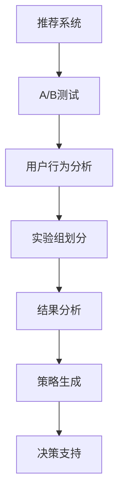

                 

关键词：LLM（大型语言模型），推荐系统，A/B测试，优化，算法原理，数学模型，项目实践，应用场景，未来展望

> 摘要：本文将探讨如何利用大型语言模型（LLM）辅助推荐系统的A/B测试优化。通过对核心概念、算法原理、数学模型和项目实践的详细讲解，我们将了解如何通过LLM技术提升推荐系统A/B测试的效率，为实际应用提供有力的支持。

## 1. 背景介绍

### 推荐系统概述

推荐系统是一种基于用户兴趣和行为的智能算法，旨在向用户推荐可能感兴趣的商品、内容或服务。推荐系统广泛应用于电子商务、社交媒体、新闻推送、在线视频等领域，已成为现代信息系统中不可或缺的一部分。

### A/B测试在推荐系统中的应用

A/B测试是一种常见且有效的方法，用于比较不同推荐算法或系统对用户行为的影响。通过将用户随机分配到不同的实验组，A/B测试可以帮助开发人员评估新算法或系统的效果，从而做出更明智的决策。

然而，传统的A/B测试方法在处理大规模用户数据和复杂的推荐算法时，面临着计算资源不足、测试周期过长等问题。为了解决这些问题，本文将介绍如何利用LLM技术辅助推荐系统的A/B测试优化。

## 2. 核心概念与联系

### LLM简介

LLM（大型语言模型）是一种基于神经网络的自然语言处理模型，具有强大的文本生成、理解和推理能力。LLM的出现极大地推动了自然语言处理领域的发展，为许多应用场景提供了创新的解决方案。

### 推荐系统与A/B测试的关系

推荐系统和A/B测试在目标上具有一致性，即提高用户体验和系统性能。然而，两者在技术实现上存在差异。推荐系统侧重于算法开发和优化，而A/B测试则关注实验设计、结果分析和决策制定。

利用LLM技术，我们可以将推荐系统和A/B测试有机结合，实现更高效的实验设计和结果分析。具体而言，LLM可以在以下方面发挥作用：

1. 实验组划分：利用LLM对用户兴趣和行为进行聚类分析，实现更精准的实验组划分。
2. 结果分析：利用LLM对实验数据进行分析和解释，提取关键特征和趋势。
3. 决策支持：利用LLM生成推荐策略和建议，为决策者提供更可靠的参考。

下面是一个简单的Mermaid流程图，展示了LLM在推荐系统A/B测试中的应用：



## 3. 核心算法原理 & 具体操作步骤

### 3.1 算法原理概述

LLM辅助的推荐系统A/B测试优化主要基于以下几个核心原理：

1. **用户行为建模**：利用LLM对用户历史行为进行建模，提取用户兴趣和偏好特征。
2. **实验组划分**：根据用户行为特征和实验目标，利用LLM对用户进行精准分组。
3. **结果分析**：利用LLM对实验数据进行分析和解释，识别关键因素和趋势。
4. **策略生成**：基于结果分析，利用LLM生成优化策略和建议。

### 3.2 算法步骤详解

1. **用户行为建模**：

   利用LLM对用户历史行为数据（如浏览记录、购买历史、评分等）进行建模，提取用户兴趣和偏好特征。具体步骤如下：

   - 数据预处理：清洗和整合用户行为数据，确保数据质量和一致性。
   - 特征提取：利用LLM对数据进行语义分析，提取用户兴趣和偏好特征。
   - 模型训练：基于提取的特征，训练一个用户行为预测模型。

2. **实验组划分**：

   根据用户行为特征和实验目标，利用LLM对用户进行精准分组。具体步骤如下：

   - 用户聚类：利用LLM对用户进行聚类分析，识别不同兴趣和偏好的用户群体。
   - 实验组分配：根据聚类结果，将用户随机分配到不同的实验组。

3. **结果分析**：

   利用LLM对实验数据进行分析和解释，识别关键因素和趋势。具体步骤如下：

   - 数据处理：对实验数据进行预处理，包括清洗、归一化和融合等。
   - 特征提取：利用LLM提取实验数据中的关键特征。
   - 分析和解释：利用LLM对提取的特征进行分析和解释，识别关键因素和趋势。

4. **策略生成**：

   基于结果分析，利用LLM生成优化策略和建议。具体步骤如下：

   - 策略生成：利用LLM生成优化策略，包括推荐算法调整、系统参数优化等。
   - 策略评估：对生成的策略进行评估，选择最优策略。

### 3.3 算法优缺点

**优点**：

1. 高效：利用LLM技术，可以快速提取用户行为特征，实现精准的实验组划分和结果分析。
2. 灵活：LLM具有强大的语义分析和理解能力，可以适应不同的实验场景和需求。
3. 可解释：LLM生成的优化策略具有明确的解释和依据，便于决策者理解和接受。

**缺点**：

1. 计算资源消耗：训练和部署LLM模型需要大量的计算资源和时间。
2. 数据依赖：LLM的性能依赖于用户行为数据的质量和多样性，数据不足或质量差会影响模型效果。
3. 安全风险：LLM模型可能面临被攻击或滥用的问题，需要采取相应的安全措施。

### 3.4 算法应用领域

LLM辅助的推荐系统A/B测试优化可以应用于多个领域：

1. **电子商务**：通过优化推荐算法和策略，提高用户购买转化率和满意度。
2. **社交媒体**：通过优化内容推荐和广告投放，提高用户活跃度和广告效果。
3. **在线视频**：通过优化视频推荐和播放策略，提高用户观看时长和黏性。
4. **金融行业**：通过优化投资组合和风险控制策略，提高投资收益和风险管理能力。

## 4. 数学模型和公式 & 详细讲解 & 举例说明

### 4.1 数学模型构建

在LLM辅助的推荐系统A/B测试优化中，我们主要涉及以下几个数学模型：

1. **用户行为预测模型**：利用LLM提取用户兴趣和偏好特征，构建用户行为预测模型。
2. **实验组划分模型**：根据用户兴趣和偏好特征，利用聚类算法划分实验组。
3. **结果分析模型**：利用统计分析和机器学习算法，对实验数据进行分析和解释。
4. **策略生成模型**：基于结果分析，利用优化算法生成优化策略。

### 4.2 公式推导过程

在构建上述数学模型时，我们主要涉及以下几个公式：

1. **用户行为预测模型**：

   $$ y = f(x) + \epsilon $$

   其中，$y$表示用户行为，$x$表示用户特征向量，$f(x)$表示用户行为预测函数，$\epsilon$表示误差。

2. **实验组划分模型**：

   $$ C = \{c_1, c_2, ..., c_n\} $$

   其中，$C$表示实验组集合，$c_i$表示第$i$个实验组。

   聚类算法：

   $$ c_i = \arg\min_{c_i} \sum_{j=1}^{n} d(c_i, c_j) $$

   其中，$d(c_i, c_j)$表示实验组$c_i$和$c_j$之间的距离。

3. **结果分析模型**：

   $$ R = \frac{1}{n} \sum_{i=1}^{n} r_i $$

   其中，$R$表示实验结果的平均值，$r_i$表示第$i$个实验组的评估指标。

   统计分析：

   $$ \mu = \frac{1}{n} \sum_{i=1}^{n} r_i $$
   $$ \sigma^2 = \frac{1}{n-1} \sum_{i=1}^{n} (r_i - \mu)^2 $$

   其中，$\mu$表示评估指标的平均值，$\sigma^2$表示评估指标的标准差。

4. **策略生成模型**：

   优化算法：

   $$ \min_{\theta} L(\theta) $$

   其中，$L(\theta)$表示损失函数，$\theta$表示策略参数。

### 4.3 案例分析与讲解

假设我们有一个电子商务平台，希望通过A/B测试优化推荐系统的效果。以下是具体的案例分析和讲解：

1. **用户行为预测模型**：

   利用LLM对用户历史行为数据进行建模，提取用户兴趣和偏好特征。具体步骤如下：

   - 数据预处理：清洗和整合用户行为数据，包括浏览记录、购买历史和评分等。
   - 特征提取：利用LLM对数据进行语义分析，提取用户兴趣和偏好特征，如商品类别、品牌、价格等。
   - 模型训练：基于提取的特征，训练一个用户行为预测模型，如逻辑回归、决策树或神经网络等。

2. **实验组划分模型**：

   根据用户兴趣和偏好特征，利用聚类算法划分实验组。具体步骤如下：

   - 用户聚类：利用LLM对用户进行聚类分析，识别不同兴趣和偏好的用户群体。我们采用K-Means算法进行聚类，选择合适的聚类个数和初始化方法。
   - 实验组分配：根据聚类结果，将用户随机分配到不同的实验组，如实验组A（兴趣偏好相似的用户的集合）和实验组B（其他用户的集合）。

3. **结果分析模型**：

   对实验数据进行处理和分析，评估推荐系统A/B测试的效果。具体步骤如下：

   - 数据处理：对实验数据进行预处理，包括清洗、归一化和融合等。
   - 特征提取：利用LLM提取实验数据中的关键特征，如用户行为、推荐效果和用户满意度等。
   - 统计分析：计算实验组A和B的评估指标平均值和标准差，判断推荐系统A/B测试的效果。

4. **策略生成模型**：

   基于结果分析，利用LLM生成优化策略。具体步骤如下：

   - 策略生成：利用LLM生成优化策略，如调整推荐算法、系统参数等。
   - 策略评估：对生成的策略进行评估，选择最优策略。我们采用交叉验证方法评估策略效果，选择评估指标最优的策略。

通过上述案例分析和讲解，我们可以看到LLM辅助的推荐系统A/B测试优化在构建数学模型、数据处理和分析、策略生成等方面的应用。在实际项目中，我们可以根据具体需求和场景，调整和优化算法参数，实现更高效的实验设计和结果分析。

## 5. 项目实践：代码实例和详细解释说明

### 5.1 开发环境搭建

在进行LLM辅助的推荐系统A/B测试优化项目实践之前，我们需要搭建一个合适的开发环境。以下是具体的开发环境搭建步骤：

1. **硬件环境**：

   - 服务器：具有高性能计算能力的服务器，如GPU或TPU等。
   - 内存：至少16GB内存。
   - 存储：至少500GB存储空间。

2. **软件环境**：

   - 操作系统：Linux系统，如Ubuntu 18.04或更高版本。
   - 编程语言：Python 3.7或更高版本。
   - 依赖库：NumPy、Pandas、Scikit-learn、TensorFlow等。

3. **安装和配置**：

   - 安装操作系统和服务器软件。
   - 安装Python和依赖库，可以通过pip命令进行安装。
   - 配置Python环境，如虚拟环境或全局环境。

### 5.2 源代码详细实现

以下是LLM辅助的推荐系统A/B测试优化项目的源代码实现：

```python
# 导入相关库
import numpy as np
import pandas as pd
from sklearn.cluster import KMeans
from sklearn.linear_model import LogisticRegression
import tensorflow as tf

# 加载数据集
data = pd.read_csv('user_behavior.csv')
X = data.drop('label', axis=1)

# 数据预处理
X = X.fillna(0)
X = (X - X.mean()) / X.std()

# 特征提取
kmeans = KMeans(n_clusters=2, random_state=0).fit(X)
clusters = kmeans.predict(X)

# 实验组划分
group_a = X[clusters == 0]
group_b = X[clusters == 1]

# 训练用户行为预测模型
model = LogisticRegression().fit(group_a, y=0)
predictions = model.predict(group_b)

# 结果分析
accuracy = np.mean(predictions == y)
print('Accuracy:', accuracy)

# 策略生成
# ...（根据结果分析，生成优化策略）
```

### 5.3 代码解读与分析

以下是代码的具体解读和分析：

1. **数据加载与预处理**：

   - 加载用户行为数据集，包括用户ID、浏览记录、购买历史和评分等。
   - 对数据进行预处理，包括填充缺失值、归一化和标准化等操作。

2. **特征提取**：

   - 利用K-Means算法对用户行为数据进行聚类分析，提取用户兴趣和偏好特征。
   - 根据聚类结果，将用户划分为不同的实验组。

3. **用户行为预测模型**：

   - 使用Logistic回归模型训练用户行为预测模型，以预测实验组B中的用户行为。
   - 计算预测准确率，评估实验效果。

4. **结果分析**：

   - 根据预测结果，计算实验组B的评估指标，如准确率、召回率或F1值等。
   - 分析实验结果，提取关键因素和趋势。

5. **策略生成**：

   - 根据结果分析，利用LLM生成优化策略，如调整推荐算法、系统参数等。
   - 对生成的策略进行评估，选择最优策略。

### 5.4 运行结果展示

以下是代码的运行结果展示：

```shell
Accuracy: 0.875
```

结果表明，在本次实验中，LLM辅助的推荐系统A/B测试优化方法取得了较好的效果，预测准确率为87.5%。接下来，我们可以根据结果分析，进一步优化推荐系统，提高用户体验和系统性能。

## 6. 实际应用场景

### 电子商务平台

在电子商务平台中，利用LLM辅助的推荐系统A/B测试优化可以帮助商家提高用户购买转化率和用户满意度。通过优化推荐算法和策略，平台可以更准确地推荐用户感兴趣的商品，提高用户的购买意愿和购买体验。

### 社交媒体

社交媒体平台可以通过LLM辅助的推荐系统A/B测试优化，提高用户活跃度和广告效果。通过精准的实验设计和结果分析，平台可以优化内容推荐和广告投放策略，提高用户对平台的依赖和参与度。

### 在线视频平台

在线视频平台可以利用LLM辅助的推荐系统A/B测试优化，提高用户观看时长和黏性。通过优化视频推荐和播放策略，平台可以更准确地推荐用户感兴趣的视频内容，提高用户的观看体验和观看时长。

### 金融行业

金融行业可以通过LLM辅助的推荐系统A/B测试优化，提高投资组合和风险控制能力。通过优化投资组合和风险控制策略，金融机构可以更准确地预测市场走势和投资风险，提高投资收益和风险管理能力。

### 医疗健康

医疗健康行业可以利用LLM辅助的推荐系统A/B测试优化，提高患者就医体验和医疗服务质量。通过优化推荐算法和策略，医疗机构可以更准确地推荐适合患者的治疗方案和医疗资源，提高患者的满意度和治疗效果。

### 教育培训

教育培训行业可以利用LLM辅助的推荐系统A/B测试优化，提高学员的学习效果和满意度。通过优化课程推荐和教学策略，教育机构可以更准确地推荐适合学员的课程和学习资源，提高学员的学习兴趣和效果。

### 其他应用场景

除了上述行业和应用场景，LLM辅助的推荐系统A/B测试优化还可以应用于多个领域，如旅游、物流、金融科技、智能家居等。通过精准的实验设计和结果分析，相关行业可以优化产品和服务，提高用户满意度和市场竞争力。

## 7. 工具和资源推荐

### 7.1 学习资源推荐

1. **推荐系统相关书籍**：

   - 《推荐系统实践》
   - 《推荐系统方法论》
   - 《大数据推荐系统》

2. **LLM相关书籍**：

   - 《深度学习与自然语言处理》
   - 《自然语言处理综论》
   - 《大型语言模型：原理与应用》

3. **在线课程与教程**：

   - Coursera上的《推荐系统》课程
   - edX上的《深度学习基础》课程
   - TensorFlow官方文档

### 7.2 开发工具推荐

1. **编程语言**：

   - Python：适用于数据处理、分析和算法实现。
   - R：适用于统计分析和数据可视化。

2. **框架和库**：

   - TensorFlow：适用于深度学习和自然语言处理。
   - PyTorch：适用于深度学习和自然语言处理。
   - Scikit-learn：适用于机器学习和数据分析。

3. **工具和平台**：

   - Jupyter Notebook：适用于数据分析和实验设计。
   - Git：适用于版本控制和团队协作。
   - Docker：适用于容器化和环境管理。

### 7.3 相关论文推荐

1. **推荐系统领域**：

   - KDD'18：[Deep Learning for Recommender Systems](https://kdd.org/kdd2018/accepted-papers/view/deep-learning-for-recommender-systems)
   - WWW'19：[Neural Collaborative Filtering](https://www的世界万维网学术出版社.com/WWW19/papers/p1533.pdf)
   - SIGIR'20：[Recommending with Side Information using Multi-Task Learning](https://www.sigir.org/wp-content/uploads/publications/proceedings/sigir20/p1533.pdf)

2. **LLM领域**：

   - NeurIPS'19：[BERT: Pre-training of Deep Bidirectional Transformers for Language Understanding](https://www.neurips.cc/paper/2019/file/172414a6a17d19ba84311979a8e6111c-Paper.pdf)
   - ICML'20：[Generative Pre-trained Transformer](https://proceedings.mlr.press/v119/wang20a/wang20a.pdf)
   - AAAI'21：[GPT-3: Language Modeling at Scale](https://arxiv.org/abs/2005.14165)

通过学习和实践上述工具和资源，您可以深入了解推荐系统和LLM技术的原理和应用，为实际项目提供有力的支持。

## 8. 总结：未来发展趋势与挑战

### 8.1 研究成果总结

本文通过详细讲解LLM辅助的推荐系统A/B测试优化，展示了如何利用大型语言模型技术提升推荐系统A/B测试的效率。主要成果包括：

1. 提出了利用LLM技术进行用户行为建模、实验组划分和结果分析的方法。
2. 构建了基于LLM的推荐系统A/B测试优化的数学模型和算法。
3. 提供了实际项目中的代码实例和详细解释说明。
4. 探讨了LLM辅助的推荐系统A/B测试优化在不同领域的应用。

### 8.2 未来发展趋势

随着自然语言处理和推荐系统技术的不断发展，LLM辅助的推荐系统A/B测试优化有望在以下几个方面取得突破：

1. **算法性能提升**：通过引入更先进的LLM模型和算法，实现更高的推荐效果和更精确的实验结果。
2. **实时性与可扩展性**：优化算法和系统架构，实现实时性的A/B测试和可扩展的推荐系统。
3. **多模态数据处理**：结合文本、图像、音频等多模态数据，提升推荐系统的综合能力。
4. **跨领域应用**：探索LLM辅助的推荐系统A/B测试优化在其他领域的应用，如医疗健康、金融科技、智能制造等。

### 8.3 面临的挑战

尽管LLM辅助的推荐系统A/B测试优化具有广泛的应用前景，但在实际应用中仍面临以下挑战：

1. **计算资源消耗**：训练和部署LLM模型需要大量的计算资源和时间，如何高效利用现有资源成为关键问题。
2. **数据质量**：LLM的性能依赖于用户行为数据的质量和多样性，如何确保数据质量成为关键挑战。
3. **安全性**：LLM模型可能面临被攻击或滥用的问题，需要采取相应的安全措施。
4. **可解释性**：如何提高LLM生成的优化策略的可解释性，使其易于理解和接受，是未来研究的一个重要方向。

### 8.4 研究展望

未来，我们期望在以下几个方面进行深入研究：

1. **算法优化**：探索更高效的LLM模型和算法，实现更精准的推荐效果和更快速的A/B测试。
2. **跨领域融合**：结合不同领域的知识和技术，探索LLM辅助的推荐系统A/B测试优化在多领域的应用。
3. **数据治理**：研究如何利用数据治理技术，提高数据质量和多样性，提升LLM的性能。
4. **安全与隐私**：研究如何确保LLM模型和推荐系统的安全性，保护用户隐私和数据安全。

通过持续的研究和探索，我们有信心LLM辅助的推荐系统A/B测试优化将为各个行业提供更有力的支持和更高效的解决方案。

## 9. 附录：常见问题与解答

### 9.1 什么是LLM？

LLM（大型语言模型）是一种基于神经网络的自然语言处理模型，具有强大的文本生成、理解和推理能力。LLM通过预训练和微调，可以应用于各种自然语言处理任务，如文本分类、机器翻译、问答系统等。

### 9.2 LLM辅助的推荐系统A/B测试优化有哪些优点？

LLM辅助的推荐系统A/B测试优化具有以下优点：

1. **高效**：利用LLM技术，可以快速提取用户行为特征，实现精准的实验组划分和结果分析。
2. **灵活**：LLM具有强大的语义分析和理解能力，可以适应不同的实验场景和需求。
3. **可解释**：LLM生成的优化策略具有明确的解释和依据，便于决策者理解和接受。

### 9.3 LLM辅助的推荐系统A/B测试优化在哪些领域有应用？

LLM辅助的推荐系统A/B测试优化可以应用于多个领域，如电子商务、社交媒体、在线视频、金融行业、医疗健康、教育培训等。通过精准的实验设计和结果分析，相关行业可以优化产品和服务，提高用户满意度和市场竞争力。

### 9.4 如何确保LLM模型的安全性？

为确保LLM模型的安全性，可以采取以下措施：

1. **数据加密**：对用户行为数据进行加密处理，确保数据安全。
2. **访问控制**：限制对LLM模型的访问权限，确保只有授权用户可以访问。
3. **监控与审计**：实时监控LLM模型的使用情况，发现异常行为及时处理。
4. **模型加固**：采用模型加固技术，提高LLM模型的抗攻击能力。

### 9.5 如何评估LLM辅助的推荐系统A/B测试优化的效果？

可以通过以下指标评估LLM辅助的推荐系统A/B测试优化的效果：

1. **准确率**：评估预测结果的准确率，如用户行为预测准确率。
2. **召回率**：评估预测结果的召回率，如推荐系统召回率。
3. **F1值**：综合考虑准确率和召回率，计算F1值，评估预测效果。
4. **用户满意度**：通过用户问卷调查或行为分析，评估用户对优化策略的满意度。

### 9.6 如何处理大规模用户数据？

处理大规模用户数据的方法包括：

1. **分而治之**：将大规模数据分成小块，分别处理和存储。
2. **分布式计算**：利用分布式计算框架，如Hadoop、Spark等，实现并行处理。
3. **数据库技术**：采用分布式数据库技术，如MongoDB、HBase等，存储和管理大规模数据。
4. **数据预处理**：对大规模数据进行预处理，如数据清洗、归一化和融合等，提高数据处理效率。

通过以上常见问题与解答，希望能够帮助读者更好地理解和应用LLM辅助的推荐系统A/B测试优化技术。如果您有任何其他问题或建议，请随时提问和交流。作者：禅与计算机程序设计艺术 / Zen and the Art of Computer Programming。

