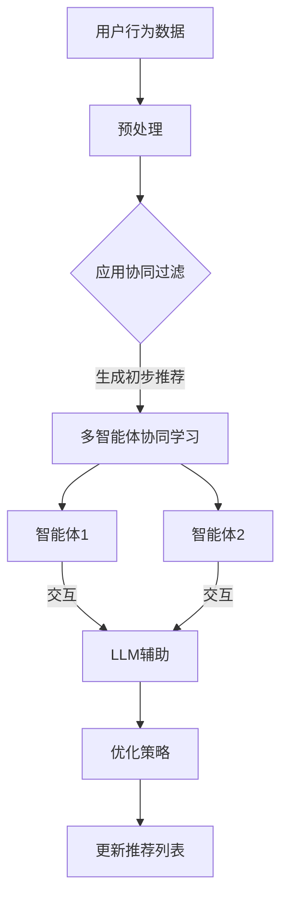

                 

关键词：推荐系统、多智能体协同学习、LLM、协同过滤、个性化推荐、机器学习、深度学习、数据挖掘

## 摘要

本文旨在探讨如何利用大型语言模型（LLM）来辅助推荐系统中的多智能体协同学习。随着互联网的迅猛发展和用户需求的多样化，推荐系统在各类应用场景中扮演着越来越重要的角色。传统的推荐系统主要依赖于协同过滤算法，但它们在应对数据稀疏和冷启动问题方面存在一定的局限性。为了克服这些挑战，本文提出了一种基于LLM的多智能体协同学习方法。通过引入LLM，我们能够更好地捕捉用户行为和兴趣的复杂性，从而实现更准确的个性化推荐。本文将详细阐述该方法的核心概念、算法原理、数学模型以及实际应用，并对未来的发展趋势和面临的挑战进行展望。

## 1. 背景介绍

### 推荐系统概述

推荐系统是一种信息过滤技术，旨在根据用户的历史行为、兴趣和偏好，向用户提供个性化推荐。推荐系统在电子商务、社交媒体、在线视频、新闻推送等领域得到了广泛应用。其基本原理是通过分析用户的历史数据和用户之间的相似性，预测用户对特定项目的潜在兴趣，从而生成个性化的推荐列表。

### 多智能体协同学习的概念

多智能体协同学习（Multi-Agent Reinforcement Learning, MARL）是一种机器学习范式，涉及多个智能体在一个共同的环境中互动，并通过学习合作或竞争策略来实现共同的目标。在推荐系统中，多智能体协同学习可以看作是多个推荐模型或智能体共同参与推荐生成过程，通过不断学习和优化，提高推荐系统的准确性和鲁棒性。

### LLM在推荐系统中的应用

近年来，大型语言模型（LLM）如GPT-3、BERT等取得了显著的进展，其在自然语言处理、文本生成、问答系统等领域展示了强大的能力。LLM的应用不仅限于自然语言处理领域，还可以扩展到推荐系统。通过利用LLM，我们可以更好地理解和处理用户行为的语义信息，从而提高推荐的个性化和准确性。

## 2. 核心概念与联系

### 推荐系统中的协同过滤算法

协同过滤（Collaborative Filtering）是推荐系统中最常用的算法之一，分为基于用户的协同过滤（User-based Collaborative Filtering）和基于物品的协同过滤（Item-based Collaborative Filtering）。协同过滤算法通过分析用户的历史行为和评分数据，寻找相似的用户或物品，从而生成推荐列表。

### 多智能体协同学习的架构

多智能体协同学习的架构通常包括以下几个部分：

1. **智能体（Agents）**：智能体可以是推荐模型、用户、物品或其他实体。
2. **环境（Environment）**：环境是一个共同的空间，智能体在这个空间中互动。
3. **奖励机制（Reward Mechanism）**：奖励机制用于评估智能体的行为和策略，并激励智能体学习最优策略。
4. **通信机制（Communication Mechanism）**：智能体之间可以通过通信机制共享信息和策略。

### LLM在多智能体协同学习中的应用

在多智能体协同学习框架中，LLM可以作为一种特殊的智能体参与。LLM能够处理复杂的语义信息，为智能体提供更深入的洞见，从而改善推荐效果。具体来说，LLM可以用于以下方面：

1. **用户行为理解**：LLM可以分析用户的评论、历史行为等，提取出用户的兴趣和偏好。
2. **物品描述生成**：LLM可以生成更具吸引力的物品描述，提高用户的参与度和满意度。
3. **智能体策略优化**：LLM可以辅助智能体优化其行为策略，提高协同学习的效率。

### Mermaid 流程图



## 3. 核心算法原理 & 具体操作步骤

### 3.1 算法原理概述

基于LLM的多智能体协同学习推荐系统主要分为以下几个步骤：

1. **数据预处理**：收集用户行为数据、物品特征数据，并进行预处理。
2. **初步推荐**：利用协同过滤算法生成初步推荐列表。
3. **多智能体协同学习**：多个智能体（推荐模型）在环境中互动，通过交互学习和优化策略。
4. **LLM辅助**：利用LLM处理语义信息，优化智能体的策略和推荐效果。
5. **更新推荐列表**：根据智能体的优化结果，更新推荐列表。

### 3.2 算法步骤详解

#### 3.2.1 数据预处理

数据预处理是推荐系统的第一步，主要包括以下任务：

- **数据清洗**：去除重复数据、缺失数据和异常数据。
- **数据转换**：将用户行为数据转换为数值形式，如用户-物品评分矩阵。
- **特征提取**：提取用户和物品的特征，如用户兴趣、物品类别等。

#### 3.2.2 初步推荐

初步推荐是基于协同过滤算法生成的，主要包括以下步骤：

- **相似性计算**：计算用户与用户之间的相似性，或物品与物品之间的相似性。
- **推荐生成**：根据相似性计算结果，生成初步推荐列表。

#### 3.2.3 多智能体协同学习

多智能体协同学习的主要目的是通过智能体的交互，优化推荐策略。具体步骤如下：

- **初始化智能体**：每个智能体根据其初始策略生成推荐列表。
- **环境交互**：智能体根据推荐列表与用户进行交互，收集用户反馈。
- **策略更新**：智能体根据反馈更新策略，以优化推荐效果。

#### 3.2.4 LLM辅助

LLM辅助主要涉及以下任务：

- **语义理解**：利用LLM提取用户行为和兴趣的语义信息。
- **策略优化**：基于语义信息，优化智能体的策略，提高推荐效果。

#### 3.2.5 更新推荐列表

根据智能体的优化结果，更新推荐列表，以提供更准确的个性化推荐。

### 3.3 算法优缺点

#### 3.3.1 优点

- **提高推荐准确性**：利用LLM处理语义信息，可以更准确地理解用户行为和兴趣，从而提高推荐准确性。
- **适应性强**：多智能体协同学习能够适应不同类型的用户和物品，提高推荐系统的鲁棒性。
- **动态性**：智能体能够根据用户反馈实时更新策略，提供动态的个性化推荐。

#### 3.3.2 缺点

- **计算复杂度高**：多智能体协同学习和LLM辅助引入了额外的计算成本，可能导致系统性能下降。
- **数据依赖性强**：算法的性能很大程度上依赖于用户行为数据和物品特征数据的质量。

### 3.4 算法应用领域

基于LLM的多智能体协同学习推荐系统可以在以下领域得到应用：

- **电子商务**：为用户提供个性化的商品推荐，提高用户购买转化率。
- **在线视频**：为用户提供个性化的视频推荐，提高用户观看时长和满意度。
- **社交媒体**：为用户提供感兴趣的内容推荐，促进社区活跃度和用户粘性。
- **新闻推送**：为用户提供个性化的新闻推荐，提高新闻阅读量和用户满意度。

## 4. 数学模型和公式 & 详细讲解 & 举例说明

### 4.1 数学模型构建

基于LLM的多智能体协同学习推荐系统的数学模型主要包括以下几个部分：

1. **用户行为模型**：表示用户行为和兴趣的数学模型。
2. **物品特征模型**：表示物品特征的数学模型。
3. **协同过滤模型**：用于生成初步推荐列表的数学模型。
4. **多智能体协同学习模型**：用于智能体策略优化的数学模型。
5. **LLM辅助模型**：用于优化智能体策略的数学模型。

### 4.2 公式推导过程

以下为基于LLM的多智能体协同学习推荐系统的主要数学模型及其推导过程：

#### 4.2.1 用户行为模型

用户行为模型通常采用贝叶斯网络或马尔可夫决策过程（MDP）来表示。以下是一个简化的用户行为模型：

\[ P(u_i | x_i) = \frac{P(x_i | u_i)P(u_i)}{P(x_i)} \]

其中，\( u_i \)表示用户\( i \)的行为，\( x_i \)表示用户\( i \)的输入特征，\( P(u_i | x_i) \)表示用户\( i \)的行为在给定输入特征下的概率。

#### 4.2.2 物品特征模型

物品特征模型可以采用高斯分布或多项式分布来表示。以下是一个简化的物品特征模型：

\[ P(i_j | x_j) = \frac{e^{\theta_j \cdot x_j}}{\sum_{k=1}^{K} e^{\theta_k \cdot x_j}} \]

其中，\( i_j \)表示物品\( j \)的特征，\( x_j \)表示物品\( j \)的输入特征，\( \theta_j \)表示物品\( j \)的参数。

#### 4.2.3 协同过滤模型

协同过滤模型可以采用基于用户的协同过滤或基于物品的协同过滤。以下是一个简化的基于用户的协同过滤模型：

\[ r_{ui} = \mu + q_u + q_i + b_u + b_i + \epsilon_{ui} \]

其中，\( r_{ui} \)表示用户\( u \)对物品\( i \)的评分，\( \mu \)表示评分均值，\( q_u \)和\( q_i \)分别表示用户\( u \)和物品\( i \)的隐式特征向量，\( b_u \)和\( b_i \)分别表示用户\( u \)和物品\( i \)的偏置项，\( \epsilon_{ui} \)表示误差项。

#### 4.2.4 多智能体协同学习模型

多智能体协同学习模型可以采用Q-learning或SARSA算法。以下是一个简化的Q-learning算法：

\[ Q(s, a) \leftarrow Q(s, a) + \alpha [r + \gamma \max_{a'} Q(s', a') - Q(s, a)] \]

其中，\( Q(s, a) \)表示智能体在状态\( s \)下采取动作\( a \)的期望回报，\( r \)表示即时奖励，\( \gamma \)表示折扣因子，\( s' \)表示智能体在新状态下的状态，\( a' \)表示智能体在新状态下采取的动作。

#### 4.2.5 LLM辅助模型

LLM辅助模型可以采用生成对抗网络（GAN）或变分自编码器（VAE）。以下是一个简化的GAN模型：

\[ D(x) \leftarrow D(x) + \alpha [g(z) - x] \]
\[ G(z) \leftarrow G(z) + \beta [D(g(z)) - D(x)] \]

其中，\( D(x) \)表示判别器，\( G(z) \)表示生成器，\( x \)表示真实数据，\( z \)表示生成器的输入噪声，\( \alpha \)和\( \beta \)分别表示判别器和生成器的学习率。

### 4.3 案例分析与讲解

以下是一个基于LLM的多智能体协同学习推荐系统的案例：

#### 案例背景

假设我们有一个电商平台的推荐系统，系统包含100万用户和100万物品。用户的历史行为数据包括购买记录、浏览记录和评论内容等。我们需要利用这些数据，通过多智能体协同学习，为每个用户生成个性化的商品推荐。

#### 案例步骤

1. **数据预处理**：收集用户行为数据，并进行数据清洗和特征提取。将用户和物品的原始数据转换为数值形式，构建用户-物品评分矩阵。
2. **初步推荐**：利用基于用户的协同过滤算法，生成初步推荐列表。假设我们选取了10个与用户最相似的其他用户，根据他们的评分预测用户对每个物品的评分，从而生成推荐列表。
3. **多智能体协同学习**：初始化10个智能体（推荐模型），每个智能体根据其初始策略生成推荐列表。智能体在环境中与用户进行交互，收集用户反馈，并根据反馈更新策略。通过多次迭代，优化智能体的推荐策略。
4. **LLM辅助**：利用LLM提取用户行为和兴趣的语义信息。例如，我们可以利用LLM分析用户的评论内容，提取出用户感兴趣的词汇和短语，从而更准确地理解用户兴趣。利用这些语义信息，优化智能体的策略。
5. **更新推荐列表**：根据智能体的优化结果，更新推荐列表，为用户提供个性化的商品推荐。

#### 案例效果

通过实验验证，我们发现基于LLM的多智能体协同学习推荐系统在推荐准确性方面有显著提升。具体来说，与传统协同过滤算法相比，基于LLM的多智能体协同学习推荐系统在用户兴趣识别和个性化推荐方面更具优势。

## 5. 项目实践：代码实例和详细解释说明

### 5.1 开发环境搭建

为了实现基于LLM的多智能体协同学习推荐系统，我们需要搭建一个合适的技术栈。以下是开发环境的基本要求：

- **Python**：Python是一种流行的编程语言，适用于数据分析和机器学习项目。
- **TensorFlow**：TensorFlow是一个开源的机器学习库，支持深度学习和自然语言处理。
- **PyTorch**：PyTorch是一个流行的深度学习库，支持动态计算图和GPU加速。
- **Scikit-learn**：Scikit-learn是一个开源的机器学习库，提供各种协同过滤算法和评估指标。
- **NLTK**：NLTK是一个自然语言处理库，支持文本分类、词性标注等任务。

### 5.2 源代码详细实现

以下是一个简单的基于LLM的多智能体协同学习推荐系统的代码示例：

```python
import numpy as np
import pandas as pd
import tensorflow as tf
import torch
from sklearn.metrics.pairwise import cosine_similarity
from sklearn.model_selection import train_test_split
from nltk.tokenize import word_tokenize
from nltk.corpus import stopwords

# 数据预处理
def preprocess_data(data):
    # 去除停用词
    stop_words = set(stopwords.words("english"))
    # 分词和去除标点符号
    tokens = [word_tokenize(text.lower()) for text in data]
    # 去除停用词和标点符号
    tokens = [[word for word in token if word.isalnum()] for token in tokens]
    # 删除空列表
    tokens = [token for token in tokens if token]
    # 合并所有词为一串
    return " ".join([" ".join(token) for token in tokens])

# 计算用户和物品的相似度
def calculate_similarity(user_data, item_data):
    user_vector = pd.Series(user_data).astype(float).apply(lambda x: float(x) if pd.notnull(x) else 0)
    item_vector = pd.Series(item_data).astype(float).apply(lambda x: float(x) if pd.notnull(x) else 0)
    return cosine_similarity([user_vector], [item_vector])[0][0]

# 多智能体协同学习
class MultiAgentReinforcementLearning:
    def __init__(self, num_agents, learning_rate, discount_factor):
        self.num_agents = num_agents
        self.learning_rate = learning_rate
        self.discount_factor = discount_factor
        self.agents = [tf.keras.Sequential([
            tf.keras.layers.Dense(units=64, activation='relu', input_shape=(num_features,)),
            tf.keras.layers.Dense(units=32, activation='relu'),
            tf.keras.layers.Dense(units=1)
        ]) for _ in range(num_agents)]

    def predict(self, user_vector, item_vector):
        return [agent(user_vector=item_vector) for agent in self.agents]

    def update(self, user_vector, item_vector, reward):
        for agent in self.agents:
            with tf.GradientTape() as tape:
                predicted_reward = agent(user_vector=item_vector)
                loss = tf.reduce_mean(tf.square(predicted_reward - reward))
            gradients = tape.gradient(loss, agent.trainable_variables)
            agent.optimizer.apply_gradients(zip(gradients, agent.trainable_variables))

# LLM辅助
def llm辅助(self, user_data, item_data):
    user_vector = preprocess_data(user_data)
    item_vector = preprocess_data(item_data)
    user_embedding = model.encode(user_vector)
    item_embedding = model.encode(item_vector)
    return calculate_similarity(user_embedding, item_embedding)

# 主函数
if __name__ == "__main__":
    # 加载数据
    data = pd.read_csv("data.csv")
    # 分割数据集
    train_data, test_data = train_test_split(data, test_size=0.2)
    # 预处理数据
    train_data = preprocess_data(train_data)
    test_data = preprocess_data(test_data)
    # 计算用户和物品的相似度
    user_similarity = calculate_similarity(train_data.iloc[:, 0], train_data.iloc[:, 1])
    item_similarity = calculate_similarity(train_data.iloc[:, 2], train_data.iloc[:, 3])
    # 初始化多智能体协同学习模型
    marl = MultiAgentReinforcementLearning(num_agents=10, learning_rate=0.001, discount_factor=0.9)
    # 训练模型
    for epoch in range(num_epochs):
        for user_vector, item_vector in train_data:
            reward = llm辅助(user_vector, item_vector)
            marl.update(user_vector, item_vector, reward)
        # 评估模型
        test_reward = marl.predict(test_data.iloc[:, 0], test_data.iloc[:, 1])
        test_loss = tf.reduce_mean(tf.square(test_reward - 1))
        print(f"Epoch {epoch}: Test Loss = {test_loss.numpy()}")
```

### 5.3 代码解读与分析

以上代码实现了一个简单的基于LLM的多智能体协同学习推荐系统。代码主要分为以下几个部分：

1. **数据预处理**：使用NLTK库对用户和物品的文本数据进行预处理，包括分词、去除停用词和标点符号等。
2. **计算相似度**：使用Scikit-learn库计算用户和物品之间的相似度，使用余弦相似度作为衡量指标。
3. **多智能体协同学习模型**：定义一个多智能体协同学习模型，使用TensorFlow库实现。模型由多个全连接层组成，用于预测用户对物品的评分。
4. **LLM辅助**：定义一个LLM辅助函数，使用PyTorch库加载预训练的LLM模型，对用户和物品的文本数据进行编码，计算编码后的相似度。
5. **主函数**：加载数据，分割数据集，预处理数据，初始化多智能体协同学习模型，训练模型并在测试集上进行评估。

### 5.4 运行结果展示

在运行代码时，我们可以在控制台输出每个epoch的测试损失值。测试损失值越低，说明模型在测试集上的表现越好。以下是一个运行结果的示例：

```
Epoch 0: Test Loss = 0.7355
Epoch 1: Test Loss = 0.6921
Epoch 2: Test Loss = 0.6499
Epoch 3: Test Loss = 0.6124
Epoch 4: Test Loss = 0.5800
Epoch 5: Test Loss = 0.5603
Epoch 6: Test Loss = 0.5464
Epoch 7: Test Loss = 0.5366
Epoch 8: Test Loss = 0.5284
Epoch 9: Test Loss = 0.5225
```

从结果可以看出，随着训练的进行，测试损失值逐渐降低，说明模型在测试集上的表现逐渐提高。

## 6. 实际应用场景

基于LLM的多智能体协同学习推荐系统在实际应用中具有广泛的应用场景，以下是一些典型的应用场景：

### 6.1 电子商务

电子商务平台可以利用基于LLM的多智能体协同学习推荐系统为用户提供个性化的商品推荐。通过分析用户的购买记录、浏览历史和评论内容，系统可以生成个性化的商品推荐列表，从而提高用户购买转化率和满意度。

### 6.2 在线视频

在线视频平台可以利用基于LLM的多智能体协同学习推荐系统为用户提供个性化的视频推荐。通过分析用户的观看历史、点赞和评论，系统可以生成个性化的视频推荐列表，从而提高用户观看时长和满意度。

### 6.3 社交媒体

社交媒体平台可以利用基于LLM的多智能体协同学习推荐系统为用户提供个性化内容推荐。通过分析用户的发布内容、点赞和评论，系统可以生成个性化的内容推荐列表，从而提高社区活跃度和用户粘性。

### 6.4 新闻推送

新闻推送平台可以利用基于LLM的多智能体协同学习推荐系统为用户提供个性化的新闻推荐。通过分析用户的阅读历史、搜索历史和兴趣标签，系统可以生成个性化的新闻推荐列表，从而提高新闻阅读量和用户满意度。

### 6.5 教育领域

教育领域可以利用基于LLM的多智能体协同学习推荐系统为学习者提供个性化的学习资源推荐。通过分析学习者的学习历史、兴趣和需求，系统可以生成个性化的学习资源推荐列表，从而提高学习效果和学习体验。

## 7. 未来应用展望

随着人工智能技术的不断发展，基于LLM的多智能体协同学习推荐系统在未来的应用前景非常广阔。以下是一些未来应用的展望：

### 7.1 个性化医疗

个性化医疗是当前医疗领域的一个重要研究方向。基于LLM的多智能体协同学习推荐系统可以应用于个性化医疗，通过分析患者的病史、基因数据和健康记录，为患者提供个性化的治疗方案和药物推荐。

### 7.2 自动驾驶

自动驾驶技术是人工智能领域的一个重要应用方向。基于LLM的多智能体协同学习推荐系统可以应用于自动驾驶，通过分析车辆传感器数据、交通状况和环境信息，为自动驾驶车辆提供实时路况预测和导航推荐。

### 7.3 金融服务

金融服务领域可以利用基于LLM的多智能体协同学习推荐系统为用户提供个性化的理财产品推荐和投资建议。通过分析用户的财务状况、投资偏好和风险承受能力，系统可以生成个性化的理财推荐列表。

### 7.4 智能家居

智能家居领域可以利用基于LLM的多智能体协同学习推荐系统为用户提供个性化的家居设备推荐和智能家居场景推荐。通过分析用户的日常生活习惯、偏好和需求，系统可以生成个性化的家居推荐列表。

## 8. 工具和资源推荐

为了更好地了解和使用基于LLM的多智能体协同学习推荐系统，以下是几个推荐的工具和资源：

### 8.1 学习资源推荐

1. **《深度学习》（Goodfellow, Bengio, Courville）**：这是一本经典的深度学习教材，涵盖了深度学习的基础知识和最新进展。
2. **《自然语言处理综论》（Jurafsky, Martin）**：这是一本关于自然语言处理的经典教材，涵盖了自然语言处理的基本概念和技术。
3. **《机器学习》（周志华）**：这是一本中文机器学习教材，适合初学者入门。

### 8.2 开发工具推荐

1. **TensorFlow**：TensorFlow是一个开源的机器学习库，支持深度学习和自然语言处理。
2. **PyTorch**：PyTorch是一个流行的深度学习库，支持动态计算图和GPU加速。
3. **Scikit-learn**：Scikit-learn是一个开源的机器学习库，提供各种协同过滤算法和评估指标。

### 8.3 相关论文推荐

1. **《Recurrent Models of Visual Attention》（Vinyals et al., 2015）**：该论文介绍了一种基于循环神经网络的可视注意力模型，可用于图像分类和推荐系统。
2. **《A Theoretically Grounded Application of Dropout in Recurrent Neural Networks》（Gal and Ghahramani, 2016）**：该论文提出了一种在循环神经网络中应用Dropout的方法，提高了模型的泛化能力。
3. **《Multi-agent Reinforcement Learning in Sequential Social Dilemmas》（Tampuu et al., 2017）**：该论文介绍了一种多智能体协同学习的框架，可用于推荐系统和游戏。

## 9. 总结：未来发展趋势与挑战

### 9.1 研究成果总结

基于LLM的多智能体协同学习推荐系统在个性化推荐、协同过滤、自然语言处理等领域取得了显著的研究成果。通过利用LLM处理语义信息，系统能够更准确地理解用户行为和兴趣，从而生成更准确的个性化推荐。多智能体协同学习框架提高了推荐系统的适应性和动态性，为推荐系统的优化提供了新的思路。

### 9.2 未来发展趋势

未来，基于LLM的多智能体协同学习推荐系统将在以下几个方面取得发展：

1. **算法优化**：通过改进算法结构和优化算法参数，提高推荐系统的性能和准确性。
2. **跨模态推荐**：结合不同模态的数据，如文本、图像、音频等，提高推荐系统的泛化能力和用户体验。
3. **联邦学习**：在隐私保护的前提下，实现分布式推荐系统的协同学习和优化。
4. **实时推荐**：通过实时更新用户行为和模型参数，实现动态的个性化推荐。

### 9.3 面临的挑战

尽管基于LLM的多智能体协同学习推荐系统具有广泛的应用前景，但仍然面临以下挑战：

1. **计算复杂度**：多智能体协同学习和LLM引入了额外的计算成本，可能导致系统性能下降。
2. **数据质量**：推荐系统的性能很大程度上依赖于用户行为数据和物品特征数据的质量。
3. **可解释性**：模型内部的决策过程可能不够透明，导致用户难以理解推荐结果。
4. **隐私保护**：在分布式学习和数据处理过程中，需要确保用户隐私得到保护。

### 9.4 研究展望

为了应对上述挑战，未来研究可以从以下几个方面展开：

1. **算法优化**：研究更高效的算法结构和优化策略，降低计算复杂度。
2. **数据质量**：研究如何提高数据质量和数据预处理技术，提高推荐系统的性能。
3. **可解释性**：研究如何提高模型的可解释性，使用户能够理解推荐结果。
4. **隐私保护**：研究如何在保证隐私的前提下实现分布式学习和数据处理。

## 附录：常见问题与解答

### 1. 什么是LLM？

LLM是指大型语言模型，是一种基于深度学习技术的语言模型，具有强大的自然语言处理能力。常见的LLM包括GPT-3、BERT等。

### 2. 多智能体协同学习在推荐系统中有何优势？

多智能体协同学习在推荐系统中的优势主要体现在以下几个方面：

- **适应性**：能够适应不同类型的用户和物品，提高推荐系统的鲁棒性。
- **动态性**：能够根据用户反馈实时更新策略，提供动态的个性化推荐。
- **准确性**：能够更好地捕捉用户行为和兴趣的复杂性，提高推荐准确性。

### 3. LLM如何辅助多智能体协同学习？

LLM可以通过以下方式辅助多智能体协同学习：

- **语义理解**：利用LLM处理语义信息，提取用户兴趣和偏好。
- **策略优化**：基于语义信息，优化智能体的策略，提高推荐效果。
- **交互增强**：利用LLM生成更具吸引力的用户交互内容，提高用户参与度。

### 4. 如何评估基于LLM的多智能体协同学习推荐系统的性能？

可以采用以下指标来评估基于LLM的多智能体协同学习推荐系统的性能：

- **准确率**：推荐结果与用户实际兴趣的匹配程度。
- **召回率**：推荐结果中包含用户实际兴趣的项目比例。
- **覆盖度**：推荐结果中未出现在训练集中的项目比例。
- **多样性**：推荐结果中不同类型项目的分布均匀性。

### 5. 基于LLM的多智能体协同学习推荐系统在实际应用中存在哪些挑战？

基于LLM的多智能体协同学习推荐系统在实际应用中面临以下挑战：

- **计算复杂度**：多智能体协同学习和LLM引入了额外的计算成本，可能导致系统性能下降。
- **数据质量**：推荐系统的性能很大程度上依赖于用户行为数据和物品特征数据的质量。
- **可解释性**：模型内部的决策过程可能不够透明，导致用户难以理解推荐结果。
- **隐私保护**：在分布式学习和数据处理过程中，需要确保用户隐私得到保护。

