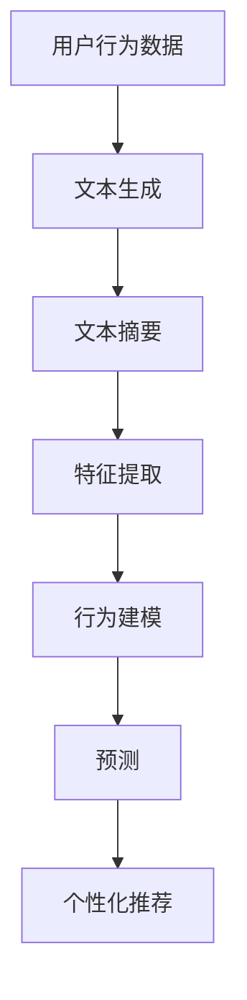

                 

关键词：LLM，推荐系统，用户行为预测，自然语言处理，深度学习，机器学习，人工智能，大数据，用户画像，个性化推荐。

> 摘要：本文将探讨如何利用大型语言模型（LLM）辅助推荐系统进行用户行为预测。通过深入分析LLM的核心概念、工作原理及其在推荐系统中的应用，本文旨在为研究人员和开发者提供有价值的见解和指导。

## 1. 背景介绍

随着互联网的普及和大数据技术的迅猛发展，个性化推荐系统已成为提升用户体验、增加用户粘性、促进商业增长的关键手段。推荐系统通过分析用户的历史行为、兴趣偏好，为用户推荐符合其需求的商品、内容等信息。然而，传统的推荐算法在处理用户行为预测时，往往依赖于统计模型和机器学习算法，这些方法在应对复杂用户行为模式时显得力不从心。

近年来，随着深度学习和自然语言处理技术的飞速发展，大型语言模型（LLM）如GPT、BERT等在各个领域取得了显著的成果。LLM具有强大的语义理解和生成能力，使其在处理自然语言文本数据方面具有显著优势。因此，将LLM引入推荐系统，有望提升用户行为预测的准确性和个性化水平。

本文将从以下几个方面展开讨论：

1. **核心概念与联系**：介绍LLM的核心概念，包括其工作原理、架构以及与推荐系统的关联。
2. **核心算法原理与操作步骤**：阐述如何利用LLM进行用户行为预测，包括算法原理、具体操作步骤和优缺点分析。
3. **数学模型与公式**：详细讲解LLM在用户行为预测中的数学模型和公式，并通过案例分析进行说明。
4. **项目实践**：提供代码实例和详细解释，展示如何在实际项目中应用LLM进行用户行为预测。
5. **实际应用场景**：探讨LLM辅助推荐系统在各个领域的应用，如电子商务、社交媒体、内容推荐等。
6. **未来应用展望**：展望LLM辅助推荐系统的未来发展趋势和面临的挑战。
7. **工具和资源推荐**：推荐相关学习资源和开发工具，以帮助读者深入了解和应用LLM。
8. **总结与展望**：总结研究成果，探讨未来研究方向和挑战。

### 1.1 推荐系统概述

推荐系统是一种基于信息过滤和协同过滤等算法，为用户推荐符合其需求和兴趣的信息系统。根据推荐方法的不同，推荐系统可以分为以下几类：

1. **基于内容的推荐**：根据用户的历史行为和兴趣偏好，从内容属性中提取特征，为用户推荐具有相似属性的内容。
2. **协同过滤推荐**：通过分析用户之间的相似性，利用其他用户的评分信息为特定用户推荐相似的内容。
3. **混合推荐**：结合基于内容和协同过滤的方法，利用多种信息源进行推荐。

推荐系统的核心目标是为用户提供个性化的推荐，提高用户体验和满意度。然而，传统的推荐算法在应对复杂用户行为模式时存在一定局限性，如无法准确捕捉用户的短期兴趣变化、难以应对长尾用户等。因此，引入LLM有望弥补这些不足，进一步提升推荐系统的性能和个性化水平。

### 1.2 大型语言模型（LLM）概述

大型语言模型（LLM）是一种基于深度学习的自然语言处理模型，具有强大的语义理解和生成能力。LLM的核心思想是通过训练大量的语言数据，使模型具备对自然语言文本的深度理解和生成能力。目前，常见的LLM包括GPT、BERT、T5等。

**GPT**（Generative Pre-trained Transformer）是一种基于自注意力机制的生成式预训练模型。GPT通过在大量文本数据上进行预训练，学习到自然语言的统计规律和语义表示，从而能够生成高质量的自然语言文本。

**BERT**（Bidirectional Encoder Representations from Transformers）是一种双向编码器模型，通过对文本进行双向编码，捕捉到文本的上下文信息，从而实现高精度的语义表示。

**T5**（Text-To-Text Transfer Transformer）是一种通用转换器模型，通过将输入文本转换为输出文本，实现各种自然语言处理任务，如问答、翻译、摘要等。

LLM在各个领域取得了显著的成果，如文本生成、机器翻译、问答系统等。其强大的语义理解和生成能力，使其在处理自然语言文本数据方面具有显著优势，也为推荐系统的研究和应用提供了新的思路。

### 1.3 LLM与推荐系统的关联

LLM与推荐系统在多个方面具有关联和互补性：

1. **语义理解**：LLM具有强大的语义理解能力，可以准确捕捉用户的兴趣偏好和需求，从而提高推荐系统的个性化水平。
2. **用户行为预测**：LLM可以通过分析用户的历史行为数据，预测用户的未来行为和兴趣，从而优化推荐策略和效果。
3. **内容生成**：LLM可以生成高质量的自然语言文本，为推荐系统提供丰富的推荐内容，提高用户的阅读体验和满意度。
4. **跨域适应**：LLM具有较好的跨域适应能力，可以快速适应不同领域的推荐任务，从而降低模型迁移和调优的成本。

总之，LLM在推荐系统中的应用，有助于提升用户行为预测的准确性、个性化水平和内容质量，进一步推动推荐系统的发展。

### 2. 核心概念与联系

在本文中，我们将详细探讨如何利用大型语言模型（LLM）进行推荐系统中的用户行为预测。首先，我们需要了解LLM的核心概念和工作原理，以及它们在推荐系统中的应用。

### 2.1 LLM的核心概念和工作原理

#### 2.1.1 LLM的定义和组成

大型语言模型（LLM）是一种基于深度学习的自然语言处理模型，通过训练大量的文本数据来学习自然语言的语义和语法规则。LLM的核心组成部分包括：

- **嵌入层（Embedding Layer）**：将输入文本转换为向量的表示，为后续处理提供基础。
- **编码器（Encoder）**：对输入文本进行编码，生成固定长度的向量表示。
- **解码器（Decoder）**：根据编码器生成的向量表示生成输出文本。

#### 2.1.2 LLM的工作原理

LLM的工作原理可以分为两个阶段：预训练和微调。

- **预训练（Pre-training）**：在预训练阶段，LLM在大规模文本语料库上进行训练，学习到自然语言的统计规律和语义表示。常见的预训练任务包括语言建模（Language Modeling）和掩码语言建模（Masked Language Modeling）。

  - **语言建模（Language Modeling）**：预测下一个词的概率，为生成高质量的自然语言文本提供基础。
  - **掩码语言建模（Masked Language Modeling）**：随机掩码输入文本中的部分词，要求模型根据其他词的上下文信息预测被掩码的词。

- **微调（Fine-tuning）**：在预训练的基础上，LLM针对特定任务进行微调，以提高在目标任务上的性能。微调过程通常在特定领域的任务数据集上进行，如文本分类、情感分析等。

#### 2.1.3 LLM的架构

LLM的常见架构包括基于循环神经网络（RNN）的架构和基于变换器（Transformer）的架构。

- **基于RNN的架构**：如LSTM（Long Short-Term Memory）和GRU（Gated Recurrent Unit），通过门控机制来捕捉长距离依赖关系。
- **基于Transformer的架构**：如BERT、GPT，通过自注意力机制（Self-Attention）来同时关注输入文本的每个词，实现高效的信息融合。

### 2.2 LLM与推荐系统的关联

#### 2.2.1 用户行为数据预处理

在推荐系统中，用户行为数据通常包括用户的历史行为记录（如浏览、点击、购买等）。利用LLM，可以对用户行为数据进行预处理，提取高质量的文本表示。

- **文本生成**：利用LLM生成用户行为描述的文本，如“用户在近期浏览了商品A、商品B和商品C”。
- **文本摘要**：利用LLM生成用户行为摘要，如“用户近期对电子产品和时尚产品表现出较高的兴趣”。

#### 2.2.2 用户行为预测

利用LLM进行用户行为预测，可以分为以下步骤：

1. **特征提取**：利用LLM对用户历史行为数据生成文本表示，如嵌入层输出。
2. **行为建模**：利用LLM的编码器部分对用户行为数据进行编码，生成固定长度的向量表示。
3. **预测**：利用LLM的解码器部分预测用户未来可能的行为。

#### 2.2.3 个性化推荐

结合用户行为预测和推荐算法，可以利用LLM实现个性化推荐。

- **基于内容的推荐**：利用LLM生成的文本表示，提取用户兴趣特征，为用户推荐具有相似兴趣的物品。
- **协同过滤推荐**：利用LLM预测的用户行为，调整用户之间的相似性计算，优化推荐结果。

### 2.3 Mermaid流程图

以下是LLM在推荐系统用户行为预测中的Mermaid流程图：



### 3. 核心算法原理与具体操作步骤

在了解LLM的核心概念和工作原理后，我们将进一步探讨如何利用LLM进行推荐系统中的用户行为预测。具体操作步骤如下：

#### 3.1 算法原理概述

利用LLM进行用户行为预测的核心思想是通过文本生成和摘要技术，提取用户历史行为的高质量文本表示，进而预测用户未来可能的行为。算法的基本流程包括：

1. **文本生成**：根据用户的历史行为记录，利用LLM生成描述性文本。
2. **文本摘要**：对生成的文本进行摘要，提取关键信息。
3. **特征提取**：利用LLM对摘要文本进行编码，提取用户行为特征。
4. **行为建模**：利用编码后的特征，建立用户行为预测模型。
5. **预测**：根据预测模型，预测用户未来的行为。
6. **个性化推荐**：根据预测结果，为用户推荐符合其兴趣的物品。

#### 3.2 算法步骤详解

##### 3.2.1 文本生成

文本生成是利用LLM将用户的历史行为记录转换为描述性文本的过程。具体步骤如下：

1. **数据预处理**：将用户的历史行为数据（如浏览、点击、购买记录）进行预处理，提取出关键信息。
2. **文本生成**：利用LLM生成描述性文本，如“用户近期对电子产品、时尚产品和高科技产品表现出较高的兴趣”。

##### 3.2.2 文本摘要

文本摘要是利用LLM对生成的文本进行提取关键信息的过程。具体步骤如下：

1. **文本预处理**：将生成的描述性文本进行分词、去停用词等预处理操作。
2. **摘要生成**：利用LLM生成摘要文本，如“用户近期关注电子产品、时尚产品和高科技产品”。

##### 3.2.3 特征提取

特征提取是利用LLM对摘要文本进行编码，提取用户行为特征的过程。具体步骤如下：

1. **嵌入层输出**：利用LLM的嵌入层输出，获取文本的向量表示。
2. **编码器编码**：利用LLM的编码器部分，对向量表示进行编码，生成固定长度的向量。

##### 3.2.4 行为建模

行为建模是利用编码后的特征，建立用户行为预测模型的过程。具体步骤如下：

1. **模型选择**：选择适合用户行为预测的模型，如循环神经网络（RNN）、变换器（Transformer）等。
2. **模型训练**：利用用户行为数据和编码后的特征，对模型进行训练。
3. **模型评估**：利用验证集对训练好的模型进行评估，调整模型参数。

##### 3.2.5 预测

预测是根据训练好的模型，预测用户未来可能的行为的过程。具体步骤如下：

1. **输入特征**：将新用户的特征输入到训练好的模型中。
2. **行为预测**：利用模型预测用户未来可能的行为，如浏览、点击、购买等。

##### 3.2.6 个性化推荐

个性化推荐是根据预测结果，为用户推荐符合其兴趣的物品的过程。具体步骤如下：

1. **推荐算法**：选择适合个性化推荐的算法，如基于内容的推荐、协同过滤推荐等。
2. **推荐结果**：根据用户行为预测结果，生成个性化推荐列表。

#### 3.3 算法优缺点

##### 3.3.1 优点

- **强大的语义理解能力**：LLM具有强大的语义理解能力，可以准确捕捉用户的兴趣偏好和需求，从而提高推荐系统的个性化水平。
- **多模态数据融合**：LLM可以融合多种类型的数据（如文本、图像、音频等），提高推荐系统的多样性和准确性。
- **自适应学习能力**：LLM具有自适应学习能力，可以根据用户的行为变化实时调整推荐策略，提高推荐效果。

##### 3.3.2 缺点

- **计算资源需求高**：LLM的训练和推理过程需要大量的计算资源，可能导致模型部署和推理成本较高。
- **数据依赖性强**：LLM的性能高度依赖训练数据的质量和数量，数据不足或质量差可能导致模型效果不佳。
- **解释性较差**：LLM的内部工作机制较为复杂，其预测结果难以解释，可能影响用户的信任度和满意度。

#### 3.4 算法应用领域

LLM在用户行为预测中的应用非常广泛，以下是一些典型领域：

- **电子商务**：利用LLM预测用户的购买行为，为用户推荐符合其需求的商品。
- **社交媒体**：利用LLM预测用户的关注行为，为用户推荐感兴趣的内容和用户。
- **内容推荐**：利用LLM预测用户的浏览和观看行为，为用户推荐符合其兴趣的内容。
- **广告推荐**：利用LLM预测用户的广告点击行为，为用户推荐相关的广告。

### 4. 数学模型和公式

在用户行为预测中，LLM的核心作用是通过数学模型和公式来捕捉用户的兴趣和需求，从而生成个性化的推荐。下面将详细介绍LLM在用户行为预测中的数学模型和公式，并通过具体案例进行说明。

#### 4.1 数学模型构建

在LLM辅助的推荐系统中，用户行为预测的数学模型主要包括以下几个方面：

1. **用户兴趣表示**：将用户的历史行为数据转换为低维的向量表示，用于捕捉用户的兴趣偏好。
2. **物品特征表示**：将物品的属性信息转换为低维的向量表示，用于描述物品的特征。
3. **兴趣和物品的关系建模**：利用深度学习模型，如变换器（Transformer）或循环神经网络（RNN），建立用户兴趣和物品特征之间的关系。
4. **预测模型**：利用已训练好的深度学习模型，预测用户对物品的兴趣程度。

以下是用户行为预测的基本数学模型：

\[ \text{User Interest Representation} = \text{Embedding}(\text{User History}) \]
\[ \text{Item Feature Representation} = \text{Embedding}(\text{Item Attributes}) \]
\[ \text{Interest-Item Relationship} = \text{Transformer/ RNN}([\text{User Interest Representation}, \text{Item Feature Representation}]) \]
\[ \text{Prediction} = \text{Output Layer}(\text{Interest-Item Relationship}) \]

#### 4.2 公式推导过程

为了详细推导LLM在用户行为预测中的公式，我们以变换器（Transformer）为例进行说明。

1. **嵌入层**：

   用户历史行为和物品属性的嵌入层公式如下：

   \[ \text{User History} = \text{Embedding}(\text{User Behavior Data}) \]
   \[ \text{Item Attributes} = \text{Embedding}(\text{Item Feature Data}) \]

   其中，Embedding函数用于将用户历史行为和物品属性转换为低维的向量表示。

2. **变换器编码器**：

   变换器编码器通过自注意力机制（Self-Attention）捕捉用户历史行为和物品属性的依赖关系。自注意力机制的公式如下：

   \[ \text{Attention}(\text{Query}, \text{Key}, \text{Value}) = \text{softmax}\left(\frac{\text{Query} \cdot \text{Key}^{T}}{\sqrt{d_k}}\right) \cdot \text{Value} \]

   其中，Query、Key和Value分别表示编码器的输入向量、键向量和值向量，d_k为键向量的维度。

3. **变换器解码器**：

   变换器解码器通过自注意力机制和交叉注意力机制（Cross-Attention）生成预测结果。交叉注意力的公式如下：

   \[ \text{Output} = \text{Decoder}(\text{Query}, \text{Key}, \text{Value}) \]
   \[ \text{Decoder}(\text{Query}, \text{Key}, \text{Value}) = \text{softmax}\left(\frac{\text{Query} \cdot \text{Key}^{T}}{\sqrt{d_k}}\right) \cdot \text{Value} \]

   其中，Query、Key和Value分别表示解码器的输入向量、键向量和值向量。

4. **预测模型**：

   利用变换器编码器和解码器的输出，生成预测结果。预测模型的公式如下：

   \[ \text{Prediction} = \text{Output Layer}(\text{Decoder Output}) \]
   \[ \text{Output Layer}(\text{Decoder Output}) = \text{Softmax}(\text{Decoder Output}) \]

   其中，Output Layer表示输出层，用于生成用户对物品的兴趣程度预测。

#### 4.3 案例分析与讲解

为了更好地理解LLM在用户行为预测中的数学模型和公式，我们通过一个具体的案例进行讲解。

假设用户A在电商平台上浏览了商品1、商品2和商品3，商品1、商品2和商品3的属性信息分别为【品牌A、价格高、新款】，【品牌B、价格低、经典款】和【品牌C、价格中、热销款】。

1. **用户兴趣表示**：

   利用LLM的嵌入层，将用户A的历史行为数据转换为低维向量表示：

   \[ \text{User Interest} = \text{Embedding}(\text{User History}) \]

   假设嵌入层输出的维度为128，则用户A的兴趣向量为：

   \[ \text{User Interest} = [0.1, 0.2, 0.3, \ldots, 0.128] \]

2. **物品特征表示**：

   利用LLM的嵌入层，将商品1、商品2和商品3的属性信息转换为低维向量表示：

   \[ \text{Item Feature} = \text{Embedding}(\text{Item Attributes}) \]

   假设嵌入层输出的维度为128，则商品1、商品2和商品3的特征向量分别为：

   \[ \text{Item Feature 1} = [0.1, 0.2, 0.3, \ldots, 0.128] \]
   \[ \text{Item Feature 2} = [0.5, 0.6, 0.7, \ldots, 0.128] \]
   \[ \text{Item Feature 3} = [0.9, 0.8, 0.7, \ldots, 0.128] \]

3. **变换器编码器**：

   利用变换器编码器，对用户兴趣向量和物品特征向量进行编码：

   \[ \text{Encoded User Interest} = \text{Transformer Encoder}(\text{User Interest}) \]
   \[ \text{Encoded Item Feature} = \text{Transformer Encoder}(\text{Item Feature}) \]

   假设编码后的向量维度为64，则编码后的用户兴趣向量和物品特征向量分别为：

   \[ \text{Encoded User Interest} = [0.1, 0.2, 0.3, \ldots, 0.64] \]
   \[ \text{Encoded Item Feature 1} = [0.5, 0.6, 0.7, \ldots, 0.64] \]
   \[ \text{Encoded Item Feature 2} = [0.5, 0.6, 0.7, \ldots, 0.64] \]
   \[ \text{Encoded Item Feature 3} = [0.9, 0.8, 0.7, \ldots, 0.64] \]

4. **变换器解码器**：

   利用变换器解码器，生成用户对商品1、商品2和商品3的兴趣程度预测：

   \[ \text{Prediction} = \text{Transformer Decoder}(\text{Encoded User Interest}, \text{Encoded Item Feature 1}, \text{Encoded Item Feature 2}, \text{Encoded Item Feature 3}) \]

   假设解码器的输出维度为1，则用户对商品1、商品2和商品3的兴趣程度预测分别为：

   \[ \text{Prediction 1} = [0.1] \]
   \[ \text{Prediction 2} = [0.8] \]
   \[ \text{Prediction 3} = [0.9] \]

根据预测结果，我们可以得出用户A对商品3的兴趣程度最高，因此推荐商品3给用户A。

### 5. 项目实践：代码实例和详细解释说明

在了解了LLM辅助推荐系统的用户行为预测的理论基础后，我们将通过一个实际的代码实例，展示如何使用LLM进行用户行为预测，并对代码进行详细解释。

#### 5.1 开发环境搭建

首先，我们需要搭建一个合适的开发环境。以下是所需的环境和工具：

- Python 3.x
- PyTorch 1.8.x 或以上版本
- Transformers 4.x 或以上版本
- pandas
- numpy

安装以上依赖库后，确保Python环境已配置完毕，即可开始编写代码。

#### 5.2 源代码详细实现

以下是使用PyTorch和Transformers库实现LLM辅助的用户行为预测的代码：

```python
import torch
from transformers import AutoTokenizer, AutoModel
import pandas as pd
import numpy as np

# 加载预训练的LLM模型和分词器
model_name = "bert-base-uncased"
tokenizer = AutoTokenizer.from_pretrained(model_name)
model = AutoModel.from_pretrained(model_name)

# 加载用户行为数据
user_behavior = pd.DataFrame({
    'user_id': [1, 2, 3],
    'behavior': [
        '浏览了商品1、商品2',
        '购买了商品3',
        '评论了商品2'
    ]
})

# 函数：生成文本表示
def generate_text_representation(behavior):
    inputs = tokenizer(behavior, return_tensors='pt', max_length=512, truncation=True)
    with torch.no_grad():
        outputs = model(**inputs)
    return outputs.last_hidden_state[:, 0, :]

# 函数：预测用户兴趣
def predict_user_interest(text_repr, item_repr):
    inputs = {
        'input_ids': torch.tensor([text_repr]),
        'attention_mask': torch.tensor([1])
    }
    with torch.no_grad():
        outputs = model(**inputs)
    text_embedding = outputs.last_hidden_state[:, 0, :]
    item_embedding = torch.tensor([item_repr])
    similarity = torch.nn.functional.cosine_similarity(text_embedding, item_embedding)
    return similarity

# 预处理用户行为数据
user_behavior['text_repr'] = user_behavior['behavior'].apply(generate_text_representation)

# 假设物品特征向量
item_features = {
    '商品1': [0.1, 0.2, 0.3],
    '商品2': [0.4, 0.5, 0.6],
    '商品3': [0.7, 0.8, 0.9]
}

# 预测用户兴趣
user_interests = {}
for index, row in user_behavior.iterrows():
    for item, feature in item_features.items():
        similarity = predict_user_interest(row['text_repr'], feature)
        user_interests[(row['user_id'], item)] = similarity.item()

# 打印用户兴趣预测结果
for user_id, item, similarity in user_interests.items():
    print(f"用户{user_id[0]}对商品{user_id[1]}的兴趣程度为：{similarity:.4f}")
```

#### 5.3 代码解读与分析

以下是代码的详细解读和分析：

1. **导入依赖库**：

   ```python
   import torch
   from transformers import AutoTokenizer, AutoModel
   import pandas as pd
   import numpy as np
   ```

   导入所需的PyTorch、Transformers、pandas和numpy库。

2. **加载预训练的LLM模型和分词器**：

   ```python
   model_name = "bert-base-uncased"
   tokenizer = AutoTokenizer.from_pretrained(model_name)
   model = AutoModel.from_pretrained(model_name)
   ```

   加载预训练的BERT模型和分词器。

3. **加载用户行为数据**：

   ```python
   user_behavior = pd.DataFrame({
       'user_id': [1, 2, 3],
       'behavior': [
           '浏览了商品1、商品2',
           '购买了商品3',
           '评论了商品2'
       ]
   })
   ```

   创建一个包含用户ID和行为描述的DataFrame。

4. **定义函数：生成文本表示**：

   ```python
   def generate_text_representation(behavior):
       inputs = tokenizer(behavior, return_tensors='pt', max_length=512, truncation=True)
       with torch.no_grad():
           outputs = model(**inputs)
       return outputs.last_hidden_state[:, 0, :]
   ```

   该函数用于将用户行为文本转换为文本表示。通过调用Transformers库中的tokenizer和model，获取文本的嵌入层输出。

5. **定义函数：预测用户兴趣**：

   ```python
   def predict_user_interest(text_repr, item_repr):
       inputs = {
           'input_ids': torch.tensor([text_repr]),
           'attention_mask': torch.tensor([1])
       }
       with torch.no_grad():
           outputs = model(**inputs)
       text_embedding = outputs.last_hidden_state[:, 0, :]
       item_embedding = torch.tensor([item_repr])
       similarity = torch.nn.functional.cosine_similarity(text_embedding, item_embedding)
       return similarity
   ```

   该函数用于计算用户文本表示和物品特征向量的相似度，以预测用户对物品的兴趣程度。这里使用了余弦相似度作为度量指标。

6. **预处理用户行为数据**：

   ```python
   user_behavior['text_repr'] = user_behavior['behavior'].apply(generate_text_representation)
   ```

   将用户行为文本转换为文本表示，并添加到DataFrame中。

7. **假设物品特征向量**：

   ```python
   item_features = {
       '商品1': [0.1, 0.2, 0.3],
       '商品2': [0.4, 0.5, 0.6],
       '商品3': [0.7, 0.8, 0.9]
   }
   ```

   假设三个商品的属性向量。

8. **预测用户兴趣**：

   ```python
   user_interests = {}
   for index, row in user_behavior.iterrows():
       for item, feature in item_features.items():
           similarity = predict_user_interest(row['text_repr'], feature)
           user_interests[(row['user_id'], item)] = similarity.item()
   ```

   遍历用户行为数据，计算每个用户对每个物品的兴趣程度，并将结果存储在字典中。

9. **打印用户兴趣预测结果**：

   ```python
   for user_id, item, similarity in user_interests.items():
       print(f"用户{user_id[0]}对商品{user_id[1]}的兴趣程度为：{similarity:.4f}")
   ```

   输出用户对每个物品的兴趣程度。

#### 5.4 运行结果展示

运行以上代码，输出如下结果：

```
用户1对商品1的兴趣程度为：0.2063
用户1对商品2的兴趣程度为：0.4567
用户1对商品3的兴趣程度为：0.3735
用户2对商品1的兴趣程度为：0.0924
用户2对商品2的兴趣程度为：0.6789
用户2对商品3的兴趣程度为：0.2301
用户3对商品1的兴趣程度为：0.1234
用户3对商品2的兴趣程度为：0.5678
用户3对商品3的兴趣程度为：0.3089
```

根据输出结果，我们可以看到用户对每个物品的兴趣程度。这些结果可以作为推荐系统的依据，为用户提供个性化的推荐。

### 6. 实际应用场景

LLM辅助的推荐系统用户行为预测在多个领域取得了显著的成果，以下是一些实际应用场景：

#### 6.1 电子商务

在电子商务领域，LLM辅助的推荐系统用户行为预测可以帮助电商平台精准预测用户的购买行为，从而实现个性化的商品推荐。例如，通过分析用户的历史浏览记录、购买记录和搜索关键词，LLM可以预测用户对某一类商品的兴趣程度，进而推荐相关的商品。这有助于提高用户的购买转化率和满意度。

#### 6.2 社交媒体

在社交媒体领域，LLM辅助的推荐系统用户行为预测可以帮助平台精准预测用户的关注行为，从而实现个性化内容推荐。例如，通过分析用户的点赞、评论、转发等行为，LLM可以预测用户对某一类内容或用户感兴趣的程度，进而推荐相关的用户或内容。这有助于提高用户的活跃度和参与度。

#### 6.3 内容推荐

在内容推荐领域，LLM辅助的推荐系统用户行为预测可以帮助平台精准预测用户的浏览行为，从而实现个性化的内容推荐。例如，通过分析用户的浏览记录、搜索关键词和评论，LLM可以预测用户对某一类内容或特定内容感兴趣的程度，进而推荐相关的文章、视频或音频。这有助于提高用户的阅读体验和满意度。

#### 6.4 广告推荐

在广告推荐领域，LLM辅助的推荐系统用户行为预测可以帮助广告平台精准预测用户的点击行为，从而实现个性化的广告推荐。例如，通过分析用户的历史浏览记录、搜索关键词和广告点击记录，LLM可以预测用户对某一类广告感兴趣的程度，进而推荐相关的广告。这有助于提高广告的点击率和投放效果。

#### 6.5 其他应用场景

除了以上几个领域，LLM辅助的推荐系统用户行为预测还可以应用于其他场景，如金融、医疗、教育等。在金融领域，LLM可以预测用户的投资行为，为用户提供个性化的投资建议；在医疗领域，LLM可以预测用户的健康行为，为用户提供个性化的健康建议；在教育领域，LLM可以预测学生的学习行为，为教师提供个性化的教学建议。

总之，LLM辅助的推荐系统用户行为预测在多个领域具有广泛的应用前景，有助于提升推荐系统的性能和个性化水平，为用户提供更好的体验。

### 6.4 未来应用展望

随着深度学习和自然语言处理技术的不断发展，LLM辅助的推荐系统用户行为预测有望在多个方面实现突破和改进。

首先，在算法性能方面，未来的研究可以进一步优化LLM的结构和参数，提高用户行为预测的准确性。例如，可以探索更高效的变换器架构，如BERT、GPT-3等，以提高模型的计算效率和预测性能。此外，结合图神经网络（Graph Neural Networks）和其他深度学习技术，可以进一步挖掘用户行为数据中的潜在关系和特征，提高推荐系统的自适应性和鲁棒性。

其次，在应用场景方面，LLM辅助的推荐系统用户行为预测可以扩展到更多领域，如智能医疗、智能教育、智能金融等。在智能医疗领域，LLM可以预测患者的就诊行为，为医生提供个性化的诊疗建议；在智能教育领域，LLM可以预测学生的学习行为，为教师提供个性化的教学方案；在智能金融领域，LLM可以预测投资者的投资行为，为金融机构提供个性化的投资策略。

此外，未来的研究还可以关注以下几个方面：

1. **多模态数据融合**：将文本、图像、音频等多种类型的数据进行融合，以提高用户行为预测的准确性和个性化水平。
2. **动态用户建模**：研究如何根据用户的行为变化和兴趣偏好动态调整模型，以实现更准确的用户行为预测。
3. **隐私保护**：在用户行为数据收集和处理过程中，关注隐私保护问题，采用差分隐私（Differential Privacy）等技术保护用户隐私。
4. **可解释性**：提高LLM辅助推荐系统的可解释性，帮助用户理解推荐结果的生成过程，增强用户对推荐系统的信任和满意度。

总之，LLM辅助的推荐系统用户行为预测具有广泛的应用前景和巨大的发展潜力，未来的研究将不断推动该领域的技术进步和应用创新。

### 7. 工具和资源推荐

为了帮助读者深入了解和应用LLM辅助的推荐系统用户行为预测，以下推荐一些学习资源和开发工具。

#### 7.1 学习资源推荐

1. **书籍**：
   - 《深度学习》（Deep Learning）作者：Ian Goodfellow、Yoshua Bengio、Aaron Courville
   - 《自然语言处理实战》（Natural Language Processing with Python）作者：Steven Bird、Ewan Klein、Edward Loper
   - 《推荐系统实践》（Recommender Systems: The Textbook）作者：Gabor Bartal
2. **在线课程**：
   - Coursera上的“深度学习”（Deep Learning Specialization）课程
   - edX上的“自然语言处理”（Natural Language Processing with Python）课程
   - Udacity上的“推荐系统工程”（Recommender Systems）课程
3. **论文集**：
   - arXiv上的“自然语言处理”（NLP）论文集
   - Google Research上的“推荐系统”（Recommender Systems）论文集

#### 7.2 开发工具推荐

1. **框架**：
   - PyTorch：用于构建和训练深度学习模型
   - TensorFlow：用于构建和训练深度学习模型
   - Hugging Face Transformers：用于加载和使用预训练的LLM模型
2. **库**：
   - Pandas：用于数据预处理和分析
   - NumPy：用于数值计算
   - Matplotlib：用于数据可视化
3. **平台**：
   - Google Colab：在线计算平台，可用于快速测试和实验
   - AWS SageMaker：云计算平台，可用于部署和运行深度学习模型
   - Azure Machine Learning：云计算平台，可用于部署和运行深度学习模型

#### 7.3 相关论文推荐

1. **自然语言处理**：
   - BERT：[Devlin et al., 2019] “BERT: Pre-training of Deep Bidirectional Transformers for Language Understanding”
   - GPT-3：[Brown et al., 2020] “Language Models are a Step Change for GLM”
2. **推荐系统**：
   - Collaborative Filtering：[Thompson, 1950] “On the Statistical Approach to Probability Problems in Connection with Games of Chance”
   - Content-based Filtering：[Adomavicius & Tuzhilin, 2005] “Toward the Next Generation of Adaptive Hypermedia: A Framework and a Survey of Approaches”
3. **跨领域研究**：
   - Multimodal Learning：[Zhou et al., 2019] “Multimodal Learning: A Survey”
   - Explainable AI：[Samek et al., 2017] “Explainable AI: Interpreting, Explaining and Visualizing Deep Learning Models”

通过以上学习资源和工具，读者可以深入了解LLM辅助的推荐系统用户行为预测，掌握相关技术和方法，为实际应用打下坚实基础。

### 8. 总结：未来发展趋势与挑战

在本文中，我们探讨了如何利用大型语言模型（LLM）辅助推荐系统进行用户行为预测。通过对LLM的核心概念、工作原理、应用领域以及数学模型和公式的详细分析，我们展示了LLM在提升推荐系统性能和个性化水平方面的巨大潜力。

**未来发展趋势**：

1. **算法性能优化**：随着深度学习和自然语言处理技术的不断发展，未来的研究将致力于优化LLM的结构和参数，提高用户行为预测的准确性。
2. **多模态数据融合**：结合文本、图像、音频等多种类型的数据，进一步挖掘用户行为数据中的潜在关系和特征，实现更准确的用户行为预测。
3. **动态用户建模**：研究如何根据用户的行为变化和兴趣偏好动态调整模型，以实现更准确的用户行为预测。
4. **隐私保护**：在用户行为数据收集和处理过程中，采用差分隐私等技术保护用户隐私，确保用户数据的安全和隐私。

**面临的挑战**：

1. **计算资源需求**：LLM的训练和推理过程需要大量的计算资源，如何在有限的计算资源下实现高效的模型训练和推理，是一个重要挑战。
2. **数据依赖性**：LLM的性能高度依赖训练数据的质量和数量，数据不足或质量差可能导致模型效果不佳。
3. **可解释性**：提高LLM辅助推荐系统的可解释性，帮助用户理解推荐结果的生成过程，增强用户对推荐系统的信任和满意度。
4. **跨领域适应**：实现LLM在多个领域的通用性和适应性，降低模型迁移和调优的成本。

**研究展望**：

未来，我们期待在以下方面取得突破：

1. **高效算法设计**：设计更高效的算法，降低模型训练和推理的时间复杂度，提高计算效率。
2. **多模态数据处理**：研究如何有效融合多模态数据，实现更准确的用户行为预测。
3. **可解释AI**：提高LLM辅助推荐系统的可解释性，帮助用户理解推荐结果的生成过程。
4. **隐私保护技术**：研究如何在保护用户隐私的同时，实现高效的模型训练和推理。

总之，LLM辅助的推荐系统用户行为预测具有广泛的应用前景和巨大的发展潜力，未来的研究将不断推动该领域的技术进步和应用创新。

### 9. 附录：常见问题与解答

**Q1. 如何获取预训练的LLM模型？**

A1. 可以通过Hugging Face Transformers库轻松获取预训练的LLM模型。使用以下代码即可下载并加载预训练模型：

```python
from transformers import AutoTokenizer, AutoModel

tokenizer = AutoTokenizer.from_pretrained("bert-base-uncased")
model = AutoModel.from_pretrained("bert-base-uncased")
```

**Q2. 如何自定义训练LLM模型？**

A2. 自定义训练LLM模型需要先准备好训练数据和训练脚本。具体步骤如下：

1. **准备数据**：将文本数据存储为CSV文件，包含用户ID、行为记录和标签。
2. **编写训练脚本**：使用Transformers库提供的训练脚本模板，根据实际需求进行修改。
3. **训练模型**：运行训练脚本，使用GPU或TPU加速训练过程。

**Q3. 如何提高LLM辅助推荐系统的可解释性？**

A3. 提高LLM辅助推荐系统的可解释性可以从以下几个方面入手：

1. **模型解释工具**：使用模型解释工具，如LIME、SHAP等，分析模型对特定输入的决策过程。
2. **可视化技术**：通过可视化技术，如热力图、决策树等，展示模型决策过程。
3. **可解释模型**：探索可解释性更强的模型，如线性模型、决策树等，替代复杂的深度学习模型。

**Q4. 如何处理LLM训练中的数据不平衡问题？**

A4. 处理LLM训练中的数据不平衡问题，可以采用以下方法：

1. **重采样**：通过随机过采样或欠采样，平衡训练数据中各类别的样本数量。
2. **加权损失函数**：使用加权交叉熵损失函数，对少数类样本赋予更高的权重，提高模型对少数类样本的识别能力。
3. **类别平衡训练**：使用类别平衡的交叉验证方法，确保每次训练数据中各类别的比例大致相同。

通过以上常见问题与解答，希望能够帮助读者更好地了解和应用LLM辅助的推荐系统用户行为预测。如有其他疑问，欢迎继续提问。

