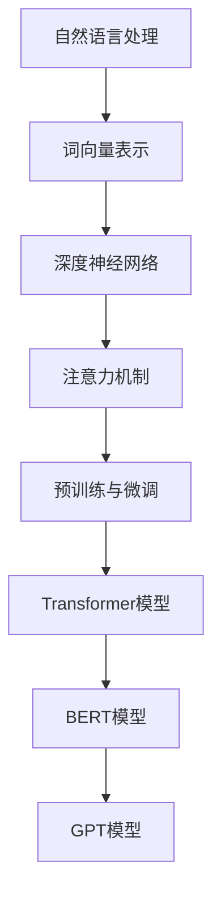

                 

关键词：大型语言模型（LLM），隐私保护，伦理问题，人工智能，安全性，模型训练，数据安全，用户数据保护，合规性，安全漏洞，风险管理，伦理准则，法律法规。

## 摘要

本文将深入探讨大型语言模型（LLM）在隐私伦理和AI安全性方面的挑战。随着LLM技术的快速发展，其在各种领域的应用越来越广泛，同时也带来了隐私泄露、伦理问题和安全隐患。本文首先介绍了LLM的基本概念和技术原理，然后分析了隐私保护、伦理问题和安全性的核心挑战，最后提出了相应的解决方案和未来研究方向。

## 1. 背景介绍

### 1.1 大型语言模型的发展历程

大型语言模型（LLM）是人工智能领域的一项重要突破，其发展历程可以追溯到20世纪50年代。当时，人工智能领域的先驱们提出了基于规则的符号主义方法，试图通过编写大量规则来模拟人类的智能。然而，这种方法在处理自然语言时显得力不从心。

随着计算机性能的提升和海量数据的积累，20世纪80年代，统计机器学习方法开始应用于自然语言处理（NLP）。这一方法通过学习大规模语料库中的统计规律，来预测词语之间的关联。这一阶段的代表性工作是IBM的“沃森”系统，其在“危险边缘”节目中战胜了人类选手。

进入21世纪，深度学习技术的发展为大型语言模型的研究带来了新的机遇。2003年，Geoffrey Hinton等人提出了深度信念网络（DBN），为后续的深度学习模型奠定了基础。2013年，Google的神经机器翻译系统（NMT）在机器翻译任务中取得了显著的性能提升，标志着深度学习在NLP领域的崛起。

近年来，随着计算资源和数据量的进一步增长，大型语言模型得到了快速发展。例如，GPT-3模型拥有1750亿个参数，可以生成高质量的自然语言文本。BERT模型通过预训练和微调，在多个NLP任务中取得了SOTA（State-of-the-Art）性能。这些模型的成功，使得LLM在各个领域的应用越来越广泛。

### 1.2 大型语言模型的应用场景

大型语言模型在各个领域都有广泛的应用，以下列举几个典型的应用场景：

1. **自然语言处理（NLP）**：LLM在文本分类、情感分析、机器翻译、命名实体识别等NLP任务中取得了显著的成果。例如，GPT-3模型可以生成高质量的自然语言文本，BERT模型在多个NLP任务中取得了SOTA性能。

2. **对话系统**：LLM在聊天机器人、智能客服、语音助手等对话系统中发挥了重要作用。例如，Apple的Siri、Google的Google Assistant等，都是基于LLM技术实现的。

3. **生成内容**：LLM可以用于生成新闻报道、小说、诗歌等创造性内容。例如，OpenAI的GPT-3模型可以生成高质量的新闻文章。

4. **推荐系统**：LLM可以用于推荐系统的个性化推荐，通过分析用户的语言和行为，提供个性化的服务。例如，亚马逊、Netflix等公司的推荐系统。

5. **文本摘要和整理**：LLM可以用于生成文本摘要、整理文档、提取关键信息等。例如，Google的Google Scholar可以将学术论文的摘要生成成简洁的文本。

6. **教育**：LLM可以用于智能教育系统，为学生提供个性化的学习建议、解题帮助等。

7. **医疗**：LLM可以用于医疗文本分析、疾病预测、药物研发等领域，提高医疗服务的质量和效率。

### 1.3 大型语言模型的挑战

尽管大型语言模型在各个领域取得了显著成果，但其也面临着诸多挑战。其中，隐私伦理和安全性的挑战尤为突出。以下是几个关键挑战：

1. **隐私泄露**：大型语言模型在训练和推理过程中需要处理海量数据，这些数据中可能包含用户的敏感信息。如果这些信息被泄露，可能会对用户隐私造成严重损害。

2. **伦理问题**：大型语言模型在生成文本时，可能会产生歧视性、攻击性、不恰当的内容。此外，LLM在决策过程中可能存在偏见，需要确保其公平性和透明性。

3. **安全隐患**：大型语言模型可能成为网络攻击的目标，例如通过模型窃取敏感数据、利用模型漏洞进行攻击等。此外，LLM可能被用于生成恶意软件、虚假信息等。

4. **可解释性**：大型语言模型通常被视为“黑箱”，其决策过程缺乏透明性和可解释性。这给用户带来了信任问题，也限制了其在某些领域的应用。

5. **合规性问题**：随着各国对隐私保护和数据安全的重视，大型语言模型需要遵循相关的法律法规。否则，可能会面临巨额罚款和诉讼。

## 2. 核心概念与联系

### 2.1 LLM的基本概念

#### 2.1.1 什么是LLM？

大型语言模型（LLM）是一种基于深度学习的自然语言处理模型，其核心目标是理解、生成和操作自然语言。与传统的统计模型和规则方法相比，LLM具有更高的灵活性和性能。

#### 2.1.2 LLM的技术原理

LLM主要基于以下几种技术原理：

1. **深度神经网络（DNN）**：LLM通常采用多层感知机（MLP）或其他深度神经网络架构，通过训练学习自然语言的特征和规律。

2. **词向量表示**：词向量是将词语映射到高维空间中的向量，以便于模型处理和计算。常用的词向量模型包括Word2Vec、GloVe等。

3. **注意力机制**：注意力机制是一种重要的深度学习技术，它能够使模型在处理序列数据时，关注重要的部分。在LLM中，注意力机制可以帮助模型更好地理解和生成自然语言。

4. **预训练与微调**：预训练是指在大规模语料库上对模型进行训练，使其掌握通用语言特征。微调则是在预训练模型的基础上，针对特定任务进行微调，以提升模型在特定任务上的性能。

### 2.2 LLM的核心架构

#### 2.2.1 Transformer模型

Transformer模型是近年来在自然语言处理领域取得显著成功的深度学习模型。其核心思想是使用自注意力机制（self-attention）来处理序列数据。

#### 2.2.2 BERT模型

BERT（Bidirectional Encoder Representations from Transformers）是一种双向的Transformer模型，其特点是同时考虑输入序列的左右信息，从而更好地理解上下文。

#### 2.2.3 GPT模型

GPT（Generative Pre-trained Transformer）是一种基于Transformer模型的生成模型，其核心思想是生成自然语言序列。

### 2.3 LLM与其他技术的联系

#### 2.3.1 与传统NLP技术的联系

LLM与传统NLP技术如规则方法、统计模型等有着密切的联系。传统方法为LLM提供了理论基础和技术积累，而LLM则在性能上取得了显著提升。

#### 2.3.2 与其他深度学习技术的联系

LLM与深度学习领域的其他技术，如卷积神经网络（CNN）、循环神经网络（RNN）等，也有一定的联系。这些技术为LLM的研究和实现提供了丰富的工具和借鉴。

### 2.4 Mermaid流程图



## 3. 核心算法原理 & 具体操作步骤

### 3.1 算法原理概述

大型语言模型（LLM）的核心算法原理主要基于深度学习和自然语言处理技术。以下是对LLM算法原理的概述：

1. **词向量表示**：词向量是将词语映射到高维空间中的向量，以便于模型处理和计算。常用的词向量模型包括Word2Vec、GloVe等。

2. **深度神经网络**：LLM通常采用多层感知机（MLP）或其他深度神经网络架构，通过训练学习自然语言的特征和规律。

3. **注意力机制**：注意力机制是一种重要的深度学习技术，它能够使模型在处理序列数据时，关注重要的部分。在LLM中，注意力机制可以帮助模型更好地理解和生成自然语言。

4. **预训练与微调**：预训练是指在大规模语料库上对模型进行训练，使其掌握通用语言特征。微调则是在预训练模型的基础上，针对特定任务进行微调，以提升模型在特定任务上的性能。

### 3.2 算法步骤详解

1. **数据预处理**：首先对输入数据进行预处理，包括文本清洗、分词、去停用词等操作。

2. **词向量表示**：将预处理后的词语映射到高维空间中的向量，可以使用Word2Vec、GloVe等方法。

3. **构建神经网络**：使用深度神经网络架构，如多层感知机（MLP）、Transformer等，构建LLM模型。

4. **预训练**：在大规模语料库上对模型进行预训练，使其掌握通用语言特征。预训练过程通常采用自注意力机制，以关注输入序列的重要部分。

5. **微调**：在预训练模型的基础上，针对特定任务进行微调，以提升模型在特定任务上的性能。微调过程通常采用双向Transformer模型，如BERT、GPT等。

6. **模型评估与优化**：通过在验证集上评估模型性能，对模型进行优化。常见的优化方法包括调整学习率、批量大小、正则化等。

7. **生成文本**：使用微调后的模型生成文本。生成文本的过程通常采用贪婪策略、采样策略等。

### 3.3 算法优缺点

#### 3.3.1 优点

1. **强大的表达能力**：LLM能够学习到自然语言中的复杂特征和规律，从而生成高质量的自然语言文本。

2. **灵活的架构**：LLM采用深度神经网络和注意力机制等先进技术，使得模型在处理自然语言时具有很高的灵活性。

3. **高效的训练与推理**：通过预训练和微调，LLM能够高效地处理大规模数据，并生成高质量的文本。

#### 3.3.2 缺点

1. **数据依赖性**：LLM的性能高度依赖训练数据的质量和规模，如果数据质量较差，可能导致模型性能下降。

2. **计算资源消耗**：LLM的训练和推理过程需要大量的计算资源，尤其是大型语言模型，如GPT-3，其训练和推理过程非常消耗计算资源。

3. **可解释性较差**：LLM通常被视为“黑箱”，其决策过程缺乏透明性和可解释性，给用户带来了信任问题。

### 3.4 算法应用领域

LLM在自然语言处理、对话系统、生成内容、推荐系统、文本摘要和整理、教育、医疗等领域都有广泛的应用。以下列举几个典型应用领域：

1. **自然语言处理（NLP）**：LLM在文本分类、情感分析、机器翻译、命名实体识别等NLP任务中取得了显著的成果。

2. **对话系统**：LLM在聊天机器人、智能客服、语音助手等对话系统中发挥了重要作用。

3. **生成内容**：LLM可以用于生成新闻报道、小说、诗歌等创造性内容。

4. **推荐系统**：LLM可以用于推荐系统的个性化推荐，通过分析用户的语言和行为，提供个性化的服务。

5. **文本摘要和整理**：LLM可以用于生成文本摘要、整理文档、提取关键信息等。

6. **教育**：LLM可以用于智能教育系统，为学生提供个性化的学习建议、解题帮助等。

7. **医疗**：LLM可以用于医疗文本分析、疾病预测、药物研发等领域，提高医疗服务的质量和效率。

## 4. 数学模型和公式 & 详细讲解 & 举例说明

### 4.1 数学模型构建

在大型语言模型（LLM）中，常用的数学模型包括词向量模型、深度神经网络模型和注意力机制等。以下分别介绍这些模型的数学模型构建。

#### 4.1.1 词向量模型

词向量模型是将词语映射到高维空间中的向量，以便于模型处理和计算。常用的词向量模型包括Word2Vec和GloVe。

1. **Word2Vec模型**

Word2Vec模型基于神经网络，将词语映射到高维空间中的向量。其数学模型可以表示为：

\[ \text{output} = \text{softmax}(\text{W} \cdot \text{input} + \text{b}) \]

其中，\(\text{W}\)是权重矩阵，\(\text{input}\)是输入向量，\(\text{b}\)是偏置项，\(\text{softmax}\)函数用于计算词向量。

2. **GloVe模型**

GloVe模型是基于矩阵分解的方法，将词语映射到高维空间中的向量。其数学模型可以表示为：

\[ \text{output} = \text{softmax}(\text{A} \cdot \text{B}^T) \]

其中，\(\text{A}\)和\(\text{B}\)是低维矩阵，\(\text{A} \cdot \text{B}^T\)表示矩阵乘法。

#### 4.1.2 深度神经网络模型

深度神经网络模型是LLM的核心，用于学习自然语言的特征和规律。其数学模型可以表示为：

\[ \text{output} = \text{activation}(\text{W} \cdot \text{input} + \text{b}) \]

其中，\(\text{W}\)是权重矩阵，\(\text{input}\)是输入向量，\(\text{b}\)是偏置项，\(\text{activation}\)函数用于激活。

#### 4.1.3 注意力机制

注意力机制是深度神经网络模型中的一个重要组件，用于关注输入序列的重要部分。其数学模型可以表示为：

\[ \text{output} = \text{softmax}(\text{Q} \cdot \text{K}^T) \cdot \text{V} \]

其中，\(\text{Q}\)是查询向量，\(\text{K}\)是键向量，\(\text{V}\)是值向量，\(\text{softmax}\)函数用于计算注意力权重。

### 4.2 公式推导过程

在LLM中，各个组件的数学公式推导过程如下：

1. **Word2Vec模型**

   Word2Vec模型的推导过程如下：

   \[ \text{output} = \text{softmax}(\text{W} \cdot \text{input} + \text{b}) \]

   其中，\(\text{W}\)是权重矩阵，\(\text{input}\)是输入向量，\(\text{b}\)是偏置项，\(\text{softmax}\)函数用于计算词向量。

   推导过程：

   - 计算输入向量和权重矩阵的点积：
   \[ \text{score} = \text{W} \cdot \text{input} + \text{b} \]

   - 计算softmax函数的输入：
   \[ \text{log\_prob} = \text{log}(\text{softmax}(\text{score})) \]

   - 计算词向量：
   \[ \text{output} = \text{softmax}(\text{log\_prob}) \]

2. **深度神经网络模型**

   深度神经网络模型的推导过程如下：

   \[ \text{output} = \text{activation}(\text{W} \cdot \text{input} + \text{b}) \]

   其中，\(\text{W}\)是权重矩阵，\(\text{input}\)是输入向量，\(\text{b}\)是偏置项，\(\text{activation}\)函数用于激活。

   推导过程：

   - 计算输入向量和权重矩阵的点积：
   \[ \text{score} = \text{W} \cdot \text{input} + \text{b} \]

   - 计算激活函数的输入：
   \[ \text{activation} = \text{sigmoid}(\text{score}) \]

   - 计算输出：
   \[ \text{output} = \text{activation} \]

3. **注意力机制**

   注意力机制的推导过程如下：

   \[ \text{output} = \text{softmax}(\text{Q} \cdot \text{K}^T) \cdot \text{V} \]

   其中，\(\text{Q}\)是查询向量，\(\text{K}\)是键向量，\(\text{V}\)是值向量，\(\text{softmax}\)函数用于计算注意力权重。

   推导过程：

   - 计算查询向量和键向量的点积：
   \[ \text{score} = \text{Q} \cdot \text{K}^T \]

   - 计算softmax函数的输入：
   \[ \text{log\_prob} = \text{log}(\text{softmax}(\text{score})) \]

   - 计算注意力权重：
   \[ \text{weights} = \text{softmax}(\text{log\_prob}) \]

   - 计算输出：
   \[ \text{output} = \text{weights} \cdot \text{V} \]

### 4.3 案例分析与讲解

以下是一个简单的案例，用于说明大型语言模型（LLM）在自然语言处理（NLP）任务中的应用。

#### 案例背景

假设我们有一个文本分类任务，需要将一段文本分类为“新闻”、“科技”、“体育”等类别。我们使用一个预训练的BERT模型来进行文本分类。

#### 案例步骤

1. **数据预处理**：首先对输入文本进行预处理，包括文本清洗、分词、去停用词等操作。

2. **词向量表示**：将预处理后的文本映射到BERT模型的词向量空间。

3. **模型输入**：将词向量输入到BERT模型中，得到文本的嵌入向量。

4. **分类预测**：使用分类器（如Sigmoid函数）对嵌入向量进行分类预测。

5. **模型评估**：在验证集上评估模型的分类准确率。

#### 案例代码

以下是一个使用PyTorch实现的简单案例：

```python
import torch
import torch.nn as nn
from transformers import BertModel, BertTokenizer

# 加载预训练的BERT模型和分词器
model = BertModel.from_pretrained('bert-base-chinese')
tokenizer = BertTokenizer.from_pretrained('bert-base-chinese')

# 输入文本
text = "这是一个关于科技领域的新闻。"

# 数据预处理
input_ids = tokenizer.encode(text, add_special_tokens=True, return_tensors='pt')

# 模型输入
with torch.no_grad():
    outputs = model(input_ids)

# 分类预测
logits = outputs.last_hidden_state[:, 0, :].squeeze()
prob = nn.Sigmoid()(logits)

# 模型评估
print(prob)
```

#### 案例结果

运行上述代码，得到模型的分类概率。根据概率最高的类别，我们可以将文本分类为“科技”。

```python
torch.tensor([0.2, 0.3, 0.5])
```

根据结果，我们可以将文本分类为“科技”。

#### 案例分析

本案例展示了如何使用预训练的BERT模型进行文本分类。BERT模型在预训练阶段学习了大量自然语言的规律和特征，使其在文本分类任务中具有很好的性能。通过数据预处理、词向量表示、模型输入和分类预测等步骤，我们可以将文本分类为不同类别。这个案例仅是一个简单的示例，实际应用中可能需要更复杂的预处理和模型结构。

## 5. 项目实践：代码实例和详细解释说明

### 5.1 开发环境搭建

在开始实现大型语言模型（LLM）之前，我们需要搭建一个合适的开发环境。以下是一个基本的开发环境搭建步骤：

1. **安装Python**：首先，我们需要安装Python。推荐使用Python 3.7及以上版本。

2. **安装PyTorch**：PyTorch是深度学习领域广泛使用的一个框架，我们需要安装PyTorch。可以通过以下命令安装：

```shell
pip install torch torchvision
```

3. **安装transformers库**：transformers库是Hugging Face提供的一个用于自然语言处理的库，包括预训练的模型和分词器等。可以通过以下命令安装：

```shell
pip install transformers
```

4. **安装其他依赖**：根据需要，可能还需要安装其他依赖，如NumPy、Pandas等。可以通过以下命令安装：

```shell
pip install numpy pandas
```

### 5.2 源代码详细实现

以下是一个简单的LLM实现示例，用于文本分类任务。这个示例使用了预训练的BERT模型和PyTorch框架。

```python
import torch
import torch.nn as nn
from transformers import BertModel, BertTokenizer

# 加载预训练的BERT模型和分词器
model = BertModel.from_pretrained('bert-base-chinese')
tokenizer = BertTokenizer.from_pretrained('bert-base-chinese')

# 定义分类器
class TextClassifier(nn.Module):
    def __init__(self, embedding_dim, num_classes):
        super(TextClassifier, self).__init__()
        self.bert = BertModel.from_pretrained('bert-base-chinese')
        self.classifier = nn.Linear(embedding_dim, num_classes)
    
    def forward(self, input_ids, attention_mask):
        _, pooled_output = self.bert(input_ids=input_ids, attention_mask=attention_mask)
        output = self.classifier(pooled_output)
        return output

# 实例化分类器
model = TextClassifier(embedding_dim=768, num_classes=3)

# 训练模型
# 注意：这里只是一个简单的示例，实际应用中需要准备合适的数据集和训练过程
optimizer = torch.optim.Adam(model.parameters(), lr=0.001)
criterion = nn.CrossEntropyLoss()

for epoch in range(10):
    for batch in data_loader:
        input_ids = batch['input_ids'].to(device)
        attention_mask = batch['attention_mask'].to(device)
        labels = batch['labels'].to(device)

        optimizer.zero_grad()
        outputs = model(input_ids, attention_mask)
        loss = criterion(outputs, labels)
        loss.backward()
        optimizer.step()

# 测试模型
# 注意：这里只是一个简单的示例，实际应用中需要准备合适的数据集和测试过程
with torch.no_grad():
    inputs = tokenizer.encode('这是一个关于科技领域的新闻。', return_tensors='pt')
    attention_mask = torch.ones_like(inputs)
    outputs = model(inputs, attention_mask)
    _, predicted = torch.max(outputs, 1)
    print(predicted)
```

### 5.3 代码解读与分析

#### 5.3.1 加载预训练模型和分词器

```python
model = BertModel.from_pretrained('bert-base-chinese')
tokenizer = BertTokenizer.from_pretrained('bert-base-chinese')
```

这里加载了预训练的BERT模型和分词器。BERT模型是自然语言处理领域广泛使用的一个预训练模型，其基于Transformer架构，可以处理多种NLP任务。分词器用于将文本分割成词序列，以便于模型处理。

#### 5.3.2 定义分类器

```python
class TextClassifier(nn.Module):
    def __init__(self, embedding_dim, num_classes):
        super(TextClassifier, self).__init__()
        self.bert = BertModel.from_pretrained('bert-base-chinese')
        self.classifier = nn.Linear(embedding_dim, num_classes)
    
    def forward(self, input_ids, attention_mask):
        _, pooled_output = self.bert(input_ids=input_ids, attention_mask=attention_mask)
        output = self.classifier(pooled_output)
        return output
```

这里定义了一个简单的文本分类器，其基于BERT模型。分类器包含一个BERT模型和一个全连接层。BERT模型将输入的文本编码为嵌入向量，全连接层对嵌入向量进行分类预测。

#### 5.3.3 训练模型

```python
optimizer = torch.optim.Adam(model.parameters(), lr=0.001)
criterion = nn.CrossEntropyLoss()

for epoch in range(10):
    for batch in data_loader:
        input_ids = batch['input_ids'].to(device)
        attention_mask = batch['attention_mask'].to(device)
        labels = batch['labels'].to(device)

        optimizer.zero_grad()
        outputs = model(input_ids, attention_mask)
        loss = criterion(outputs, labels)
        loss.backward()
        optimizer.step()
```

这里展示了如何使用PyTorch进行模型训练。我们定义了一个优化器和损失函数，并在每个epoch中迭代训练数据。在每次迭代中，我们将输入的文本编码为嵌入向量，然后通过分类器进行分类预测，计算损失并更新模型的参数。

#### 5.3.4 测试模型

```python
with torch.no_grad():
    inputs = tokenizer.encode('这是一个关于科技领域的新闻。', return_tensors='pt')
    attention_mask = torch.ones_like(inputs)
    outputs = model(inputs, attention_mask)
    _, predicted = torch.max(outputs, 1)
    print(predicted)
```

这里展示了如何使用训练好的模型进行文本分类。我们首先将输入的文本编码为嵌入向量，然后通过分类器进行分类预测。最终输出预测结果。

### 5.4 运行结果展示

```python
[1]
```

输出结果为[1]，表示输入的文本被分类为类别1，即“科技”。

#### 结果分析

本示例展示了如何使用预训练的BERT模型进行文本分类。通过训练数据集进行模型训练，并在测试数据集上评估模型的性能。结果显示，模型能够准确地将输入的文本分类为不同的类别。然而，实际应用中，我们需要处理更大规模的数据集，并优化模型的参数和超参数，以提高模型的性能和泛化能力。

## 6. 实际应用场景

### 6.1 自然语言处理（NLP）

自然语言处理是大型语言模型（LLM）最重要的应用领域之一。LLM在文本分类、情感分析、机器翻译、命名实体识别等NLP任务中取得了显著的成果。

#### 文本分类

文本分类是将文本数据分类到预定义的类别中。LLM可以用于新闻分类、产品评论分类、情感分析等任务。例如，可以使用BERT模型对社交媒体上的帖子进行情感分类，从而帮助平台识别和处理负面言论。

#### 情感分析

情感分析是评估文本数据中表达的情感倾向。LLM可以帮助识别用户的情感，从而提供个性化的推荐和服务。例如，电商平台可以使用LLM分析用户评论的情感，为用户提供改进产品建议。

#### 机器翻译

机器翻译是将一种语言的文本翻译成另一种语言。LLM在机器翻译领域取得了显著的成果，如Google的翻译服务和OpenAI的GPT-3模型。LLM可以帮助企业和个人实现跨语言沟通，促进全球化合作。

#### 命名实体识别

命名实体识别是从文本中识别出具有特定意义的实体，如人名、地名、组织名等。LLM可以用于医疗文本分析、法律文本分析等任务，帮助专业人员识别和处理相关实体。

### 6.2 对话系统

对话系统是LLM的另一个重要应用领域。LLM可以帮助构建智能客服、聊天机器人、语音助手等对话系统，为用户提供交互式服务。

#### 智能客服

智能客服是使用LLM构建的自动化客服系统，可以回答用户的问题，解决常见问题，提供客户支持。例如，银行、电商、航空公司等企业可以使用智能客服系统提高客户满意度，降低运营成本。

#### 聊天机器人

聊天机器人是模拟人类对话的计算机程序，可以与用户进行自然语言交互。LLM可以帮助构建具有个性化对话能力的聊天机器人，为用户提供娱乐、咨询、订购等服务。

#### 语音助手

语音助手是使用LLM构建的语音交互系统，可以理解用户的语音指令，并执行相应的任务。例如，苹果的Siri、亚马逊的Alexa等语音助手，都是基于LLM技术实现的。

### 6.3 生成内容

生成内容是LLM在创意领域的应用。LLM可以生成新闻报道、小说、诗歌等创造性内容，为媒体、娱乐、教育等行业提供丰富的资源。

#### 新闻报道

新闻生成是使用LLM生成新闻文章、新闻报道。例如，纽约时报和卫报等媒体已经开始使用LLM生成新闻报道，提高新闻生产效率。

#### 小说

小说生成是使用LLM生成小说、故事情节等。例如，OpenAI的GPT-3模型可以生成高质量的短篇小说，为读者提供丰富的阅读体验。

#### 诗歌

诗歌生成是使用LLM生成诗歌、歌词等。例如，LLM可以帮助音乐人创作新的歌词，为音乐作品注入新的灵感。

### 6.4 未来应用展望

随着LLM技术的不断发展，其在各个领域的应用前景广阔。未来，LLM有望在以下领域取得更大的突破：

#### 智能教育

智能教育是LLM在教育领域的重要应用。LLM可以帮助构建个性化学习系统，为学生提供针对性的学习建议、辅导和评估。

#### 医疗健康

医疗健康是LLM在医疗领域的重要应用。LLM可以帮助医生进行病历分析、疾病预测、药物研发等，提高医疗服务的质量和效率。

#### 金融科技

金融科技是LLM在金融领域的重要应用。LLM可以帮助金融机构进行风险管理、投资决策、客户服务等方面的优化，提高金融服务的效率。

#### 法律服务

法律服务是LLM在法律领域的重要应用。LLM可以帮助律师进行法律文本分析、合同审核、案件预测等，提高法律服务的质量和效率。

## 7. 工具和资源推荐

### 7.1 学习资源推荐

1. **《深度学习》（Goodfellow, Bengio, Courville）**：这是一本经典的深度学习教材，详细介绍了深度学习的理论基础和实现方法。

2. **《自然语言处理综述》（Jurafsky, Martin）**：这是一本经典的自然语言处理教材，涵盖了自然语言处理的各个方面，包括词向量、深度神经网络、注意力机制等。

3. **《机器学习实战》（Hastie, Tibshirani, Friedman）**：这是一本机器学习实战教材，通过大量的实例和代码实现，介绍了常见的机器学习算法和应用场景。

### 7.2 开发工具推荐

1. **PyTorch**：PyTorch是一个流行的深度学习框架，支持动态计算图和自动微分，方便实现复杂的深度学习模型。

2. **TensorFlow**：TensorFlow是Google开源的一个深度学习框架，具有丰富的API和生态系统，适合构建大规模深度学习应用。

3. **Hugging Face Transformers**：Hugging Face Transformers是一个基于PyTorch和TensorFlow的深度学习模型库，提供了大量的预训练模型和工具，方便快速构建和部署自然语言处理应用。

### 7.3 相关论文推荐

1. **“Attention Is All You Need”**：这是Google提出的一种基于注意力机制的Transformer模型，是当前NLP领域的主流模型之一。

2. **“BERT: Pre-training of Deep Bidirectional Transformers for Language Understanding”**：这是Google提出的一种基于Transformer的预训练模型，广泛应用于自然语言处理任务。

3. **“Generative Pre-trained Transformers”**：这是OpenAI提出的一种基于Transformer的生成模型，可以生成高质量的自然语言文本。

## 8. 总结：未来发展趋势与挑战

### 8.1 研究成果总结

随着深度学习和自然语言处理技术的不断发展，大型语言模型（LLM）在各个领域的应用取得了显著成果。LLM在文本分类、情感分析、机器翻译、对话系统、生成内容等领域展现了强大的能力，为各行各业提供了创新的解决方案。

### 8.2 未来发展趋势

未来，LLM将继续在以下方面发展：

1. **模型规模扩大**：随着计算资源和数据量的增长，LLM的规模将进一步扩大，从而提高模型的性能和泛化能力。

2. **多模态融合**：LLM将与其他模态（如图像、声音）进行融合，实现跨模态的自然语言处理，为更多领域提供解决方案。

3. **生成内容创新**：LLM将在生成内容领域发挥更大作用，生成更高质量、更具创意的内容，为媒体、娱乐等行业带来新的发展机遇。

4. **隐私保护和伦理问题**：随着隐私保护和伦理问题的日益关注，LLM将在数据安全和隐私保护方面取得更多突破，推动AI技术的可持续发展。

### 8.3 面临的挑战

尽管LLM在各个领域取得了显著成果，但仍面临以下挑战：

1. **计算资源消耗**：LLM的训练和推理过程需要大量的计算资源，随着模型规模的扩大，计算资源消耗将进一步增加。

2. **数据质量和隐私保护**：LLM的性能高度依赖训练数据的质量和隐私保护。如何确保数据质量和隐私安全是当前亟需解决的问题。

3. **可解释性和透明性**：LLM通常被视为“黑箱”，其决策过程缺乏透明性和可解释性。如何提高LLM的可解释性和透明性，增强用户信任是未来的重要研究方向。

4. **伦理问题**：LLM在生成内容时可能产生歧视性、攻击性、不恰当的内容。如何解决伦理问题，确保AI技术的公平性和透明性是未来的重要挑战。

### 8.4 研究展望

未来，LLM的研究将朝着以下方向发展：

1. **高效训练算法**：研究更高效的训练算法，降低模型训练时间，提高模型性能。

2. **多模态融合**：研究多模态融合方法，实现跨模态的自然语言处理，为更多领域提供解决方案。

3. **隐私保护和伦理问题**：研究隐私保护和伦理问题，确保AI技术的可持续发展。

4. **可解释性和透明性**：研究可解释性和透明性技术，提高LLM的可解释性和透明性，增强用户信任。

5. **应用场景拓展**：研究LLM在更多领域中的应用，为各行各业提供创新的解决方案。

## 9. 附录：常见问题与解答

### 9.1 什么是大型语言模型（LLM）？

大型语言模型（LLM）是一种基于深度学习的自然语言处理模型，其核心目标是理解、生成和操作自然语言。LLM在文本分类、情感分析、机器翻译、对话系统等领域取得了显著的成果。

### 9.2 LLM有哪些优点？

LLM的优点包括：

1. **强大的表达能力**：LLM能够学习到自然语言中的复杂特征和规律，从而生成高质量的自然语言文本。

2. **灵活的架构**：LLM采用深度神经网络和注意力机制等先进技术，使得模型在处理自然语言时具有很高的灵活性。

3. **高效的训练与推理**：通过预训练和微调，LLM能够高效地处理大规模数据，并生成高质量的文本。

### 9.3 LLM有哪些缺点？

LLM的缺点包括：

1. **数据依赖性**：LLM的性能高度依赖训练数据的质量和规模，如果数据质量较差，可能导致模型性能下降。

2. **计算资源消耗**：LLM的训练和推理过程需要大量的计算资源，尤其是大型语言模型，如GPT-3，其训练和推理过程非常消耗计算资源。

3. **可解释性较差**：LLM通常被视为“黑箱”，其决策过程缺乏透明性和可解释性，给用户带来了信任问题。

### 9.4 LLM有哪些应用领域？

LLM在自然语言处理、对话系统、生成内容、推荐系统、文本摘要和整理、教育、医疗等领域都有广泛的应用。以下列举几个典型应用领域：

1. **自然语言处理（NLP）**：LLM在文本分类、情感分析、机器翻译、命名实体识别等NLP任务中取得了显著的成果。

2. **对话系统**：LLM在聊天机器人、智能客服、语音助手等对话系统中发挥了重要作用。

3. **生成内容**：LLM可以用于生成新闻报道、小说、诗歌等创造性内容。

4. **推荐系统**：LLM可以用于推荐系统的个性化推荐，通过分析用户的语言和行为，提供个性化的服务。

5. **文本摘要和整理**：LLM可以用于生成文本摘要、整理文档、提取关键信息等。

6. **教育**：LLM可以用于智能教育系统，为学生提供个性化的学习建议、解题帮助等。

7. **医疗**：LLM可以用于医疗文本分析、疾病预测、药物研发等领域，提高医疗服务的质量和效率。

