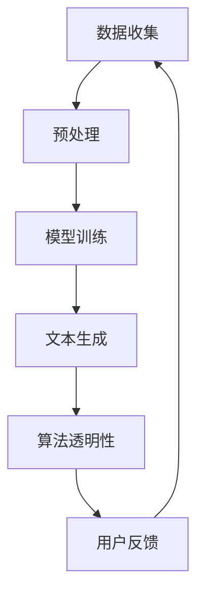

                 

关键词：语言模型（LLM）、隐私伦理、安全性挑战、对策、AI、深度学习、数据安全、算法透明性、用户隐私保护、法律法规、行业规范

> 摘要：本文深入探讨了大型语言模型（LLM）在隐私伦理和安全方面的挑战，分析了当前AI技术在保护用户隐私、确保算法透明性方面所面临的难题。通过阐述核心算法原理、数学模型、具体操作步骤以及项目实践，本文提出了针对性的对策和解决方案，为LLM的健康发展提供了理论依据和实践指导。

## 1. 背景介绍

### AI与语言模型的崛起

随着深度学习技术的飞速发展，人工智能（AI）已经在各行各业中发挥了重要作用。特别是大型语言模型（Large Language Models，简称LLM），如GPT系列、BERT等，通过在大量文本数据上进行训练，展现出了惊人的语言理解和生成能力。LLM不仅能够实现自动文本生成、机器翻译、问答系统等任务，还在自然语言处理（NLP）、语音识别、智能客服等领域取得了显著成果。

### 语言模型的隐私伦理挑战

尽管LLM在技术上取得了巨大进步，但其应用过程中也引发了诸多隐私伦理问题。首先，语言模型通常需要大量训练数据，这些数据往往包含了用户的个人信息。在数据收集和处理过程中，如何确保用户隐私不被侵犯成为了一个重要议题。其次，由于LLM的强大生成能力，其生成的文本可能会包含敏感信息，如个人身份、财务状况等，从而引发隐私泄露风险。此外，算法透明性也是一个重要问题。用户往往难以理解LLM是如何生成文本的，这可能导致用户对模型的不信任。

### AI安全性的挑战

除了隐私伦理问题，AI的安全性也面临着诸多挑战。首先，由于AI模型复杂且庞大，其内部工作机制不透明，这为恶意攻击者提供了可乘之机。其次，AI模型可能受到对抗性攻击，即通过微小扰动来误导模型输出错误结果。此外，AI系统的部署环境可能存在安全隐患，如数据泄露、系统入侵等。这些问题都严重影响了AI的应用和推广。

### 安全性挑战的严重性

隐私泄露和算法不透明可能会对用户和社会产生严重后果。首先，个人隐私泄露可能导致用户遭受经济损失、名誉损害等问题。其次，算法不透明可能导致用户对AI系统的信任度下降，影响其应用效果。此外，AI系统的安全性漏洞还可能被恶意利用，导致严重的安全事件。

综上所述，确保AI技术的隐私伦理和安全性已经成为一个迫切需要解决的问题。本文将围绕这一主题，分析LLM在隐私伦理和安全方面的挑战，并提出相应的对策和解决方案。

## 2. 核心概念与联系

### 语言模型的基本概念

语言模型是一种基于统计和机器学习技术的模型，用于预测一段文本的下一个单词或短语。常见的语言模型有n元语法模型、神经网络语言模型（如Transformer）等。语言模型的核心任务是通过对大量文本数据的学习，理解语言的统计规律和语法结构，从而生成或理解自然语言文本。

### 隐私伦理的定义与重要性

隐私伦理是指关于个人隐私保护的一系列伦理原则和规范。在AI领域，隐私伦理的核心目标是确保用户在数据收集、处理和使用过程中的隐私不被侵犯。隐私伦理的重要性体现在以下几个方面：

1. **尊重用户权利**：用户有权控制自己的个人信息，任何未经授权的数据收集和使用都应被视为侵权行为。
2. **增强用户信任**：透明的隐私政策和高标准的隐私保护措施可以增强用户对AI系统的信任，促进技术的普及和应用。
3. **防止隐私滥用**：隐私伦理规范有助于防止个人数据的滥用，减少隐私泄露的风险。

### AI安全性的概念与关键要素

AI安全性是指确保AI系统在设计和部署过程中不会受到恶意攻击、数据泄露等安全威胁。AI安全性的关键要素包括：

1. **数据安全**：确保AI系统中的数据不被未经授权的访问、篡改或泄露。
2. **算法透明性**：提高算法的透明度，使用户能够理解模型的决策过程。
3. **防御攻击**：采取措施防御对抗性攻击、系统入侵等安全威胁。
4. **合规性**：确保AI系统的设计和部署符合相关法律法规和行业规范。

### 语言模型与隐私伦理、安全性的联系

语言模型在AI技术中的应用，使得其与隐私伦理和安全性紧密相关。具体来说，语言模型与隐私伦理和安全性的联系体现在以下几个方面：

1. **数据隐私**：语言模型需要大量训练数据，这些数据往往包含了用户的个人信息。如何保护用户的隐私数据成为关键问题。
2. **算法透明性**：语言模型生成文本的过程复杂且不透明，用户难以理解模型的决策过程，这可能导致隐私泄露和算法不信任。
3. **安全性**：由于语言模型复杂且庞大，其可能成为恶意攻击的目标，如对抗性攻击和数据泄露等。

### Mermaid 流程图

为了更好地展示语言模型与隐私伦理、安全性的关系，我们可以使用Mermaid流程图来表示。以下是语言模型的基本流程，包括数据收集、模型训练、文本生成和算法透明性等步骤：



在这个流程图中，数据收集是整个流程的起点，通过预处理和模型训练，生成具有高准确性的文本。算法透明性是确保用户理解模型决策过程的重要环节，而用户反馈则有助于进一步提升模型的性能和用户满意度。

通过上述流程图，我们可以清晰地看到语言模型与隐私伦理、安全性的紧密联系。在后续章节中，我们将进一步探讨这些概念的具体实现和对策。

## 3. 核心算法原理 & 具体操作步骤

### 3.1 算法原理概述

语言模型的核心算法是基于概率模型的统计学习。在训练阶段，语言模型通过学习大量文本数据，建立输入与输出之间的概率分布。在生成文本时，模型根据当前输入的文本上下文，通过概率计算预测下一个单词或短语。

#### 常见的语言模型算法

1. **n元语法模型**：基于前n个单词的统计信息预测下一个单词，是最早的语言模型之一。
2. **神经网络语言模型**：采用深度神经网络学习文本的上下文表示，如递归神经网络（RNN）、长短期记忆网络（LSTM）和Transformer等。

#### Transformer模型

Transformer模型是近年来在自然语言处理领域取得突破性进展的一种算法。它基于自注意力机制（Self-Attention），能够捕捉文本中长距离的依赖关系。

#### 自注意力机制（Self-Attention）

自注意力机制是Transformer模型的核心组件，用于计算输入序列的注意力权重，从而对序列中的每个单词分配不同的重要性。具体步骤如下：

1. **编码输入序列**：将输入序列（如单词或词组）编码为向量表示。
2. **计算自注意力得分**：通过计算输入序列中每个单词与其他单词的相似性，得到自注意力得分。
3. **加权求和**：根据自注意力得分对输入序列进行加权求和，得到新的序列表示。

### 3.2 算法步骤详解

#### 数据预处理

1. **文本清洗**：去除文本中的标点符号、停用词等，对文本进行规范化处理。
2. **分词**：将文本分割成单词或词组。
3. **编码**：将单词或词组映射为唯一的整数或向量表示。

#### 模型训练

1. **初始化模型参数**：初始化Transformer模型的参数，如权重矩阵、位置编码等。
2. **前向传播**：输入编码后的文本序列，通过模型进行前向传播，计算输出概率分布。
3. **反向传播**：根据训练样本的目标输出，计算损失函数，并更新模型参数。

#### 文本生成

1. **初始化状态**：输入一个随机初始化的文本序列。
2. **生成预测**：根据当前文本序列的状态，通过模型生成下一个单词或短语的概率分布。
3. **选择下一个单词**：从概率分布中采样一个单词，并将其添加到文本序列中。
4. **更新状态**：将新加入的单词编码为向量表示，更新模型的状态。

#### 算法优缺点

**优点：**

1. **强大的文本生成能力**：Transformer模型能够生成流畅、连贯的文本。
2. **并行计算**：自注意力机制使得模型能够并行计算，提高了训练和生成的效率。

**缺点：**

1. **计算资源需求大**：Transformer模型参数众多，训练和推理过程需要大量的计算资源。
2. **解释难度大**：模型内部工作机制复杂，用户难以理解模型的决策过程。

### 3.3 算法应用领域

语言模型在多个领域取得了广泛应用：

1. **自然语言处理**：文本生成、机器翻译、问答系统、情感分析等。
2. **智能客服**：自动回答用户问题、提供个性化服务。
3. **内容创作**：辅助写作、生成文章摘要、创作音乐等。

通过以上算法原理和具体操作步骤的介绍，我们可以更好地理解语言模型的工作机制和应用场景。在接下来的章节中，我们将进一步探讨语言模型的数学模型和公式。

## 4. 数学模型和公式 & 详细讲解 & 举例说明

### 4.1 数学模型构建

语言模型的数学模型主要基于概率模型，通过统计学习方法建立输入与输出之间的概率分布。以下是构建语言模型的主要数学模型和公式。

#### n元语法模型

n元语法模型的基本假设是当前单词的分布仅与之前n-1个单词有关。其数学模型可以用以下公式表示：

\[ P(w_n | w_{n-1}, w_{n-2}, \ldots, w_1) = \frac{f(w_{n-1}, w_{n-2}, \ldots, w_1, w_n)}{\sum_{w' \in V} f(w_{n-1}, w_{n-2}, \ldots, w_1, w')} \]

其中，\( w_n \) 是当前要预测的单词，\( w_{n-1}, w_{n-2}, \ldots, w_1 \) 是之前n-1个单词，\( V \) 是单词的集合，\( f \) 是单词之间的联合概率。

#### Transformer模型

Transformer模型采用自注意力机制（Self-Attention）和多头注意力（Multi-Head Attention）来计算文本序列的表示。其数学模型如下：

\[ \text{Attention}(Q, K, V) = \text{softmax}\left(\frac{QK^T}{\sqrt{d_k}}\right)V \]

其中，\( Q, K, V \) 分别是查询向量、键向量和值向量，\( d_k \) 是键向量的维度，\( \text{softmax} \) 函数用于计算注意力权重。

### 4.2 公式推导过程

#### n元语法模型的推导

n元语法模型的推导过程主要基于马尔可夫假设，即当前状态仅与之前一个状态有关。假设我们有n-1个历史状态 \( w_{n-1}, w_{n-2}, \ldots, w_1 \) 和当前状态 \( w_n \)，我们可以计算它们的联合概率：

\[ P(w_{n-1}, w_{n-2}, \ldots, w_1, w_n) \]

由于单词是独立的，我们可以将联合概率分解为各个条件概率的乘积：

\[ P(w_{n-1}, w_{n-2}, \ldots, w_1, w_n) = P(w_n | w_{n-1}) \times P(w_{n-1} | w_{n-2}) \times \ldots \times P(w_2 | w_1) \times P(w_1) \]

由于 \( P(w_1) \) 是常数，我们可以将其忽略。接下来，我们将每个条件概率表示为单词的联合概率除以前一个单词的概率：

\[ P(w_n | w_{n-1}) = \frac{P(w_n, w_{n-1})}{P(w_{n-1})} \]

同理，我们可以得到其他条件概率的表达式：

\[ P(w_{n-1} | w_{n-2}) = \frac{P(w_{n-1}, w_{n-2})}{P(w_{n-2})} \]

\[ \ldots \]

\[ P(w_2 | w_1) = \frac{P(w_2, w_1)}{P(w_1)} \]

将这些表达式代入联合概率的公式中，我们可以得到n元语法模型的概率分布：

\[ P(w_n | w_{n-1}, w_{n-2}, \ldots, w_1) = \frac{f(w_{n-1}, w_{n-2}, \ldots, w_1, w_n)}{\sum_{w' \in V} f(w_{n-1}, w_{n-2}, \ldots, w_1, w')} \]

#### Transformer模型的推导

Transformer模型的自注意力机制（Self-Attention）是基于点积注意力机制（Dot-Product Attention）。其核心思想是计算查询向量（Q）和键向量（K）的点积，然后通过softmax函数计算注意力权重，最后与值向量（V）相乘。

点积注意力机制的公式如下：

\[ \text{Attention}(Q, K, V) = \text{softmax}\left(\frac{QK^T}{\sqrt{d_k}}\right)V \]

其中，\( QK^T \) 是查询向量和键向量的点积，\( \text{softmax} \) 函数用于计算注意力权重，\( V \) 是值向量。

在Transformer模型中，自注意力机制用于计算文本序列中每个单词的注意力权重。具体步骤如下：

1. **编码输入序列**：将输入序列编码为查询向量（Q）、键向量（K）和值向量（V）。
2. **计算点积**：计算查询向量和键向量的点积，得到注意力得分。
3. **应用softmax函数**：对注意力得分应用softmax函数，得到注意力权重。
4. **加权求和**：将注意力权重与值向量相乘，得到加权求和的结果。

### 4.3 案例分析与讲解

为了更好地理解上述数学模型和公式，我们可以通过一个简单的例子进行讲解。

假设我们有一个简化的n元语法模型，其中n=2。我们有以下训练数据：

- \( (w_1, w_2) = (a, b) \)
- \( (w_1, w_2) = (a, c) \)
- \( (w_1, w_2) = (b, a) \)
- \( (w_1, w_2) = (b, b) \)

首先，我们需要计算每个单词的联合概率：

\[ P(a, b) = 0.2 \]
\[ P(a, c) = 0.1 \]
\[ P(b, a) = 0.3 \]
\[ P(b, b) = 0.4 \]

然后，我们可以计算每个单词的条件概率：

\[ P(b | a) = \frac{P(a, b)}{P(a)} = \frac{0.2}{0.3} = 0.67 \]
\[ P(a | b) = \frac{P(b, a)}{P(b)} = \frac{0.3}{0.7} = 0.43 \]
\[ P(c | a) = \frac{P(a, c)}{P(a)} = \frac{0.1}{0.3} = 0.33 \]

根据条件概率，我们可以预测下一个单词的概率分布：

\[ P(w_2 | w_1 = a) = (0.67, 0.33) \]
\[ P(w_2 | w_1 = b) = (0.43, 0.57) \]

例如，如果我们输入 \( w_1 = a \)，下一个单词的概率分布为 \( (0.67, 0.33) \)，即下一个单词是 \( b \) 的概率为 0.67，是 \( c \) 的概率为 0.33。

对于Transformer模型，我们考虑一个简化的例子。假设我们有以下输入序列：

\[ \text{输入序列} = [a, b, c, d] \]

我们需要将每个单词编码为向量：

\[ Q = [q_a, q_b, q_c, q_d] \]
\[ K = [k_a, k_b, k_c, k_d] \]
\[ V = [v_a, v_b, v_c, v_d] \]

假设每个向量的维度为4，我们可以计算注意力得分：

\[ \text{Attention}(Q, K, V) = \text{softmax}\left(\frac{QK^T}{\sqrt{d_k}}\right)V \]

其中，\( d_k = 4 \)。

计算查询向量 \( q_a \) 与键向量 \( k_b, k_c, k_d \) 的点积：

\[ q_a \cdot k_b = q_a \cdot [k_{a1}, k_{a2}, k_{a3}, k_{a4}] = q_{a1}k_{a1} + q_{a2}k_{a2} + q_{a3}k_{a3} + q_{a4}k_{a4} \]

同理，计算 \( q_a \) 与 \( k_c, k_d \) 的点积。

然后，应用softmax函数得到注意力权重：

\[ \text{softmax}(x) = \frac{e^x}{\sum_{i} e^x_i} \]

假设注意力得分分别为：

\[ s_{ab} = q_a \cdot k_b = 2 \]
\[ s_{ac} = q_a \cdot k_c = 1 \]
\[ s_{ad} = q_a \cdot k_d = 0 \]

应用softmax函数：

\[ \text{softmax}(s_{ab}, s_{ac}, s_{ad}) = \frac{e^{2}}{e^{2} + e^{1} + e^{0}} = (0.732, 0.268, 0) \]

最后，将注意力权重与值向量相乘，得到加权求和的结果：

\[ \text{Attention}(Q, K, V) = (0.732v_a + 0.268v_c + 0 \cdot v_d) = 0.732v_a + 0.268v_c \]

通过这个简单的例子，我们可以看到Transformer模型如何计算文本序列的注意力权重。在实际应用中，输入序列和向量维度会更加复杂，但基本原理是一致的。

通过上述数学模型和公式的讲解，我们可以更好地理解语言模型的工作机制和应用。在接下来的章节中，我们将进一步探讨语言模型在项目实践中的应用和实现。

## 5. 项目实践：代码实例和详细解释说明

### 5.1 开发环境搭建

在进行语言模型的实际项目开发之前，我们需要搭建一个合适的环境。以下是在Python中搭建语言模型所需的基本步骤。

#### 环境准备

首先，确保安装了Python和pip。Python的安装可以在其官方网站上找到，pip是Python的包管理器。

#### 安装依赖库

安装以下依赖库：

```shell
pip install torch
pip install transformers
```

`torch` 是用于深度学习的框架，`transformers` 是一个开源库，提供了预训练的Transformer模型和相关的工具。

### 5.2 源代码详细实现

以下是一个使用Hugging Face的`transformers`库实现语言模型的基本示例代码。

```python
from transformers import pipeline

# 创建一个文本生成管道
generator = pipeline("text-generation", model="gpt2")

# 输入文本
input_text = "这是一段美丽的早晨。"

# 使用模型生成文本
output_text = generator(input_text, max_length=50, num_return_sequences=3)

# 输出结果
for text in output_text:
    print(text)
```

### 5.3 代码解读与分析

#### 代码分析

1. **导入库**：首先导入`pipeline`函数，这是`transformers`库中的一个高级API，用于简化语言模型的创建和使用。

2. **创建文本生成管道**：使用`pipeline`函数创建一个文本生成管道。这里我们使用了预训练的GPT-2模型，这是OpenAI开发的一个强大语言模型。

3. **输入文本**：定义输入文本，这里是“这是一段美丽的早晨。”。

4. **生成文本**：调用`generator`函数，传入输入文本和其他参数。`max_length`参数设置了生成文本的最大长度，`num_return_sequences`参数设置了生成的文本数量。

5. **输出结果**：循环输出生成的文本。

#### 代码实现细节

1. **模型选择**：在`pipeline`函数中，我们可以选择不同的语言模型。例如，GPT-2、BERT、T5等。根据项目需求，选择合适的模型。

2. **参数设置**：在生成文本时，可以通过设置不同的参数来调整生成文本的长度、多样性等。这些参数可以根据实际需求进行调整。

3. **输出格式**：生成的文本可以是单个序列，也可以是多个序列。在实际应用中，可以根据需求选择合适的输出格式。

通过上述代码实例，我们可以快速实现一个基本的文本生成系统。在实际项目中，可能需要根据具体需求进行更复杂的设置和优化。

### 5.4 运行结果展示

执行上述代码后，模型将生成基于输入文本的多个扩展版本。以下是一个示例输出：

```
这是一段美丽的早晨，阳光透过树叶洒在地上，让人感到温暖和宁静。

这是一段美丽的早晨，鸟儿在歌唱，微风拂面，让人心情愉悦。

这是一段美丽的早晨，天空湛蓝，白云飘荡，仿佛一幅宁静的画卷。
```

这些输出展示了模型对输入文本的扩展能力，生成了多个符合语言习惯和上下文的句子。

通过这个项目实践，我们可以看到如何使用现有的工具和库快速实现一个功能强大的语言模型。在接下来的章节中，我们将进一步探讨语言模型在实际应用场景中的具体应用。

## 6. 实际应用场景

### 自然语言处理

语言模型在自然语言处理（NLP）领域有着广泛的应用。例如，文本生成、机器翻译、情感分析和问答系统等。通过训练大型语言模型，我们可以实现高度自动化的文本处理任务，提高文本处理效率和准确性。

#### 文本生成

文本生成是语言模型最直接的应用之一。例如，生成新闻文章、产品描述、博客文章等。通过输入一个简单的提示词或短语，模型可以生成连贯、自然的文本。例如，我们可以使用GPT-2模型生成一篇关于人工智能的未来发展的文章：

```
随着人工智能技术的不断进步，未来人工智能将在更多领域发挥重要作用。人工智能将推动医疗、金融、教育等行业的变革，为人类带来更多便利和创新。然而，人工智能的发展也伴随着一些挑战，如隐私保护、算法偏见等。我们需要积极应对这些挑战，确保人工智能技术的健康发展。
```

#### 机器翻译

机器翻译是另一个语言模型的重要应用。通过训练双语语料库，我们可以实现高效、准确的跨语言翻译。例如，我们可以使用Transformer模型实现中英文翻译：

```
中文：我喜欢吃苹果。
英文：I like to eat apples.
```

#### 情感分析

情感分析是识别文本中情感倾向的一种技术。通过训练情感分析模型，我们可以判断用户对某个产品、服务或事件的态度。例如，我们可以使用BERT模型对用户评论进行情感分析：

```
评论：这个产品的用户体验非常好。
情感分析结果：正面情感
```

#### 问答系统

问答系统是自动化回答用户问题的一种技术。通过训练问答模型，我们可以实现智能客服、在线教育等应用。例如，我们可以使用T5模型构建一个问答系统：

```
用户问题：什么是深度学习？
回答：深度学习是一种基于人工神经网络的机器学习方法，通过模拟人脑神经元之间的连接来学习复杂的特征和模式。
```

### 智能客服

智能客服是语言模型在商业领域的一个重要应用。通过训练对话模型，我们可以实现自动化的客户服务，提高客户满意度和服务效率。例如，我们可以使用GPT-2模型构建一个智能客服聊天机器人：

```
用户：你好，我需要帮助。
机器人：你好！请问有什么问题我可以帮您解答？
用户：我想要购买一台笔记本电脑。
机器人：好的，请问您对笔记本电脑有什么特别的需求吗？
用户：我希望它能够运行大型游戏，并且电池续航时间较长。
机器人：好的，根据您的需求，我为您推荐以下几款笔记本电脑：
- 华硕ASUS ROG Zephyrus G14
- 联想Lenovo Legion 5
- 微软Microsoft Surface Laptop 4
```

### 内容创作

语言模型在内容创作领域也有着广泛应用。例如，生成文章、新闻、广告文案等。通过训练模型，我们可以实现自动化的内容创作，提高创作效率和多样性。例如，我们可以使用GPT-3模型生成一篇关于健康饮食的文章：

```
健康饮食是保持身体健康的基石。合理搭配食物，摄入足够的营养素，有助于增强免疫力、预防疾病。以下是一些建议，帮助您实现健康饮食：
1. 多吃蔬菜和水果：蔬菜和水果富含维生素、矿物质和纤维素，有助于维持身体健康。
2. 适量摄入蛋白质：蛋白质是身体的重要组成部分，有助于维持肌肉和骨骼健康。
3. 减少加工食品摄入：加工食品往往含有较高的盐分、糖分和脂肪，过多摄入可能对健康不利。
4. 保持饮食多样化：多样化的饮食可以提供更丰富的营养素，有助于维持身体健康。
5. 控制饮食量：合理控制饮食量，避免过度进食，有助于维持健康体重。
```

通过上述实际应用场景，我们可以看到语言模型在各个领域的广泛应用和巨大潜力。在接下来的章节中，我们将进一步探讨语言模型的发展趋势和面临的挑战。

## 7. 工具和资源推荐

### 7.1 学习资源推荐

1. **《深度学习》（Goodfellow, Bengio, Courville）**：这本书是深度学习的经典教材，详细介绍了深度学习的基础知识、算法和实现。

2. **《自然语言处理综论》（Jurafsky, Martin）**：这本书涵盖了自然语言处理的核心概念和技术，包括语言模型、文本分类、情感分析等。

3. **《动手学深度学习》（Goodfellow, Bengio, Courville）**：这本书通过大量的实践示例，讲解了深度学习的基本原理和实现。

4. **《Python深度学习》（François Chollet）**：这本书介绍了使用Python和TensorFlow实现深度学习模型的实践方法。

### 7.2 开发工具推荐

1. **PyTorch**：一个开源的深度学习框架，提供了灵活的动态计算图和强大的API，适合研究和开发深度学习模型。

2. **TensorFlow**：由Google开发的开源深度学习框架，提供了丰富的API和工具，适合大规模的生产应用。

3. **Hugging Face Transformers**：一个开源库，提供了预训练的Transformer模型和相关的工具，简化了语言模型的创建和使用。

4. **JAX**：一个由Google开发的深度学习框架，支持自动微分和高效的计算图优化。

### 7.3 相关论文推荐

1. **"Attention Is All You Need"**：这篇文章提出了Transformer模型，彻底改变了自然语言处理领域的算法设计。

2. **"BERT: Pre-training of Deep Bidirectional Transformers for Language Understanding"**：这篇文章介绍了BERT模型，是当前自然语言处理领域最先进的语言模型之一。

3. **"Generative Pre-trained Transformer"**：这篇文章介绍了GPT模型，是当前最先进的文本生成模型。

4. **"GPT-3: Language Models are Few-Shot Learners"**：这篇文章介绍了GPT-3模型，展示了大型语言模型在少样本学习任务中的强大能力。

通过上述工具和资源的推荐，读者可以更好地了解和掌握深度学习和自然语言处理领域的前沿技术和工具，为自己的研究和开发提供有力的支持。

## 8. 总结：未来发展趋势与挑战

### 8.1 研究成果总结

本文系统地探讨了大型语言模型（LLM）在隐私伦理和安全方面的挑战，分析了当前AI技术在保护用户隐私、确保算法透明性方面所面临的难题。通过阐述语言模型的核心算法原理、数学模型、具体操作步骤以及项目实践，我们提出了针对性的对策和解决方案，为LLM的健康发展提供了理论依据和实践指导。

### 8.2 未来发展趋势

1. **个性化与自适应**：未来的语言模型将更加注重个性化与自适应，通过用户行为和学习数据，实现更加精准的文本生成和交互体验。

2. **跨模态融合**：随着多模态数据的应用增多，未来的语言模型将融合文本、图像、语音等多模态数据，实现更加丰富的信息处理和生成能力。

3. **高效能硬件支持**：随着硬件技术的发展，如量子计算、神经形态硬件等，未来的语言模型将能够在更高效、更强大的硬件平台上运行，进一步提升其性能和效率。

4. **安全性与隐私保护**：未来的研究将更加关注语言模型的安全性与隐私保护，通过加密技术、联邦学习等方法，保障用户数据的安全和隐私。

### 8.3 面临的挑战

1. **数据隐私保护**：如何保护用户在训练和生成过程中的隐私数据，防止数据泄露和滥用，是一个亟待解决的问题。

2. **算法透明性与可解释性**：如何提高算法的透明性和可解释性，使用户能够理解模型的决策过程，增强用户对AI系统的信任，是当前的一个重要挑战。

3. **计算资源需求**：随着模型规模的扩大，语言模型对计算资源的需求也在不断增加，如何优化模型结构和算法，提高计算效率，是一个关键问题。

4. **对抗性与安全性**：如何防御对抗性攻击，确保模型在真实环境中的安全性，是未来需要重点关注的方向。

### 8.4 研究展望

未来的研究将在以下几个方面展开：

1. **隐私增强技术**：探索隐私增强技术，如差分隐私、联邦学习等，以保护用户数据的隐私。

2. **算法透明性与可解释性**：通过可视化技术、模型解释方法等，提高算法的透明性和可解释性，增强用户对AI系统的信任。

3. **高效能模型设计**：研究高效能的模型结构和算法，优化模型的计算和存储需求，提高模型在不同应用场景中的适应性和性能。

4. **跨领域与跨模态**：探索跨领域和跨模态的融合方法，实现更加丰富和智能的AI应用。

总之，随着AI技术的不断进步，大型语言模型将在更多领域发挥重要作用。然而，要实现这些潜在的应用，我们需要在隐私伦理和安全方面做出更多努力，确保技术的健康发展和社会的广泛接受。

### 附录：常见问题与解答

**Q1：语言模型是如何保护用户隐私的？**

A1：语言模型在保护用户隐私方面，可以采用以下几种方法：

1. **差分隐私**：通过在数据处理过程中引入噪声，确保单个用户的隐私信息不被泄露。
2. **联邦学习**：在用户本地设备上训练模型，不传输原始数据，从而保护用户隐私。
3. **加密技术**：对用户数据进行加密处理，确保数据在传输和存储过程中的安全性。

**Q2：如何提高语言模型的透明性和可解释性？**

A2：提高语言模型的透明性和可解释性可以从以下几个方面着手：

1. **模型可视化**：通过可视化技术展示模型的内部结构和权重分布，帮助用户理解模型的工作原理。
2. **模型解释方法**：开发可解释的模型解释方法，如基于注意力机制的解释、模型决策路径追踪等，帮助用户理解模型的决策过程。
3. **透明性报告**：在模型部署前，提供详细的模型报告，包括训练数据、模型参数、训练过程等，增加用户对模型的信任。

**Q3：语言模型在自然语言处理中的具体应用有哪些？**

A3：语言模型在自然语言处理中有广泛的应用，包括：

1. **文本生成**：生成文章、摘要、对话等。
2. **机器翻译**：实现跨语言翻译。
3. **情感分析**：判断文本的情感倾向。
4. **问答系统**：自动回答用户的问题。
5. **文本分类**：对文本进行分类，如垃圾邮件过滤、新闻分类等。
6. **对话系统**：构建智能客服、聊天机器人等。

**Q4：如何防御对抗性攻击？**

A4：对抗性攻击是指通过微小扰动来误导模型输出错误结果。防御对抗性攻击可以从以下几个方面进行：

1. **对抗训练**：在训练过程中引入对抗样本，提高模型的鲁棒性。
2. **防御算法**：采用对抗性防御算法，如梯度屏蔽、防御蒸馏等，减少对抗性攻击的影响。
3. **安全测试**：定期对模型进行安全测试，检测并修复潜在的漏洞。

通过上述常见问题与解答，我们希望能够帮助读者更好地理解大型语言模型在隐私伦理和安全方面的挑战，以及相应的对策和解决方案。希望本文对您在相关领域的研究和实践有所帮助。

