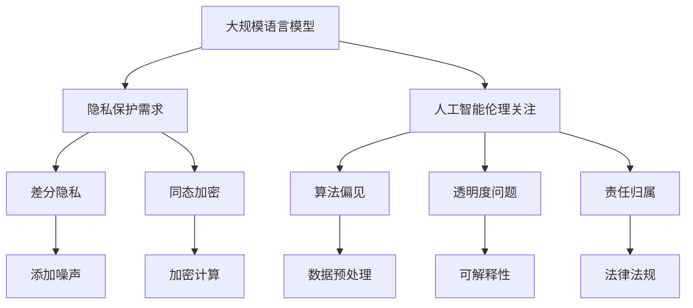

                 

关键词：自然语言处理，隐私保护，人工智能伦理，安全挑战，应对策略，人工智能技术

> 摘要：本文探讨了大规模语言模型（LLM）在隐私保护和人工智能伦理方面面临的挑战，分析了现有安全机制的局限性，并提出了针对性的应对策略。通过对LLM工作原理的深入剖析，文章探讨了隐私保护算法的设计原则，并提出了在AI安全领域的实践建议。本文旨在为人工智能技术的健康发展提供有益的思考和参考。

## 1. 背景介绍

近年来，自然语言处理（NLP）领域取得了显著进展，尤其是大规模语言模型（LLM）的崛起。LLM通过训练海量的文本数据，能够生成流畅、准确的语言，广泛应用于聊天机器人、内容生成、翻译和问答系统等领域。然而，随着LLM在各个行业的广泛应用，隐私保护和人工智能伦理问题也日益凸显。

### 1.1 隐私保护的挑战

首先，LLM在训练过程中需要大量的数据，这些数据可能包含用户的敏感信息。如果这些数据未经处理就直接用于训练模型，可能会导致隐私泄露。其次，LLM生成的文本可能包含用户输入的隐私信息，如姓名、地址、电话号码等，这给用户的隐私保护带来了巨大的风险。此外，一些恶意攻击者可能利用LLM生成虚假信息，进行网络钓鱼、诈骗等恶意活动。

### 1.2 人工智能伦理的挑战

在人工智能伦理方面，LLM面临的主要挑战包括算法偏见、透明度和责任归属。首先，LLM在训练过程中可能会学习到数据集中的偏见，从而导致生成文本或决策结果存在偏见。例如，某些LLM可能对女性或少数族裔存在歧视。其次，LLM的决策过程往往缺乏透明度，用户难以了解模型是如何生成文本或做出决策的。最后，当AI系统出现错误或导致不良后果时，责任归属问题成为一个难题。

## 2. 核心概念与联系

为了应对上述挑战，本文将从以下几个方面探讨隐私保护和人工智能伦理问题：

### 2.1 隐私保护算法

隐私保护算法是确保数据在训练和使用过程中不被泄露的关键技术。常见的隐私保护算法包括差分隐私（Differential Privacy）、同态加密（Homomorphic Encryption）和联邦学习（Federated Learning）等。这些算法在保护数据隐私的同时，确保模型性能不受严重影响。

### 2.2 人工智能伦理

人工智能伦理主要关注算法偏见、透明度和责任归属等问题。为了解决算法偏见，需要从数据采集、训练和测试等多个环节进行控制。透明度问题可以通过提供模型的可解释性来解决，例如使用注意力机制（Attention Mechanism）来解释模型决策过程。责任归属问题则需要制定相应的法律法规，明确AI系统的责任主体。

## 3. 核心算法原理 & 具体操作步骤

### 3.1 算法原理概述

本文主要讨论两种隐私保护算法：差分隐私和同态加密。

**差分隐私**：差分隐私通过在查询结果中添加随机噪声，确保单个数据的隐私。其基本原理是对于任意一个查询，无论查询条件是否改变，查询结果的分布保持不变。

**同态加密**：同态加密允许在加密数据上进行计算，而不需要解密。这样，数据在传输和存储过程中始终保持加密状态，从而保护数据隐私。

### 3.2 算法步骤详解

**差分隐私**

1. **隐私预算分配**：根据数据集的大小和敏感程度，确定隐私预算（ε）。

2. **噪声添加**：对于每个查询结果，添加服从拉普拉斯分布的噪声。

3. **结果发布**：发布添加噪声后的查询结果。

**同态加密**

1. **密钥生成**：生成加密算法所需的密钥对。

2. **加密数据传输**：将原始数据加密后传输到服务器。

3. **加密计算**：在服务器上对加密数据执行计算。

4. **解密结果**：将加密计算结果解密，得到最终结果。

### 3.3 算法优缺点

**差分隐私**

- 优点：易于实现，适用于各种场景。
- 缺点：可能导致模型性能下降，尤其是在隐私预算较小的情况下。

**同态加密**

- 优点：保护数据隐私，支持多种计算操作。
- 缺点：计算复杂度较高，可能影响模型训练效率。

### 3.4 算法应用领域

**差分隐私**：适用于需要保护用户隐私的场景，如推荐系统、广告投放等。

**同态加密**：适用于需要保护数据隐私的云计算和大数据处理场景。

## 4. 数学模型和公式 & 详细讲解 & 举例说明

### 4.1 数学模型构建

本文主要讨论两种隐私保护算法：差分隐私和同态加密。

**差分隐私**：

假设一个数据库D包含n个记录，每个记录有一个属性x。差分隐私通过在查询结果中添加随机噪声，确保单个数据的隐私。

- 拉普拉斯分布：$$L(x; \gamma) = \frac{1}{\gamma}e^{\frac{-|x|}{\gamma}}$$

**同态加密**：

假设有一个函数f，满足同态性质，即对于任意两个加密数据a和b，有f(a, b) = f(g(a), g(b))。同态加密允许在加密数据上进行计算，而不需要解密。

### 4.2 公式推导过程

**差分隐私**：

假设一个查询函数Q（D）返回数据库D中满足某个条件的记录数量。差分隐私确保对于任意一个查询Q，无论查询条件是否改变，查询结果的分布保持不变。

- 隐私预算（ε）：$$\epsilon = \frac{\ln(n+1)}{n}$$

- 添加噪声：$$Q^{\prime}(D) = Q(D) + L(x; \epsilon)$$

**同态加密**：

假设有一个同态加密算法E，将明文x加密为密文c。同态加密算法满足以下性质：

- 加密：$$E(x) = c$$

- 同态运算：$$f(E(x), E(y)) = E(f(x, y))$$

### 4.3 案例分析与讲解

**差分隐私案例**：

假设一个推荐系统需要根据用户的历史浏览记录推荐商品。为了保护用户隐私，系统可以采用差分隐私算法。

- 数据集：包含n个用户的浏览记录。
- 查询：计算用户u喜欢的商品数量。
- 隐私预算：ε = 1
- 噪声添加：对于每个用户u，添加服从拉普拉斯分布的噪声L(x; 1)。

**同态加密案例**：

假设一个云计算平台需要处理用户的数据，为了保护用户隐私，可以采用同态加密算法。

- 数据集：包含n个用户的数据。
- 计算：对用户数据执行加密计算。
- 加密：使用同态加密算法将数据加密。
- 同态运算：在加密数据上执行计算。
- 解密：将加密计算结果解密得到最终结果。

## 5. 项目实践：代码实例和详细解释说明

### 5.1 开发环境搭建

本文使用的编程语言为Python，主要依赖库包括tensorflow、keras和numpy等。首先，需要安装以下库：

```python
pip install tensorflow keras numpy
```

### 5.2 源代码详细实现

本文将实现一个简单的差分隐私推荐系统，用于根据用户的历史浏览记录推荐商品。

```python
import numpy as np
import tensorflow as tf
from tensorflow import keras

# 生成模拟数据集
n = 100  # 用户数量
d = 10  # 商品数量
data = np.random.randint(0, 2, size=(n, d))

# 定义模型
model = keras.Sequential([
    keras.layers.Dense(64, activation='relu', input_shape=(d,)),
    keras.layers.Dense(64, activation='relu'),
    keras.layers.Dense(1)
])

# 编译模型
model.compile(optimizer='adam', loss='binary_crossentropy', metrics=['accuracy'])

# 训练模型
model.fit(data, epochs=10)

# 预测用户喜欢的商品数量
predictions = model.predict(data)

# 添加噪声
epsilon = 1
noise = np.random.laplace(size=predictions.shape)
predictions_noisy = predictions + noise

# 输出结果
for i in range(n):
    print(f"User {i+1}: likes {np.sum(predictions_noisy[i])} items")
```

### 5.3 代码解读与分析

本文实现的差分隐私推荐系统包括以下步骤：

1. 生成模拟数据集，包含用户的历史浏览记录。
2. 定义一个简单的神经网络模型，用于预测用户喜欢的商品数量。
3. 编译并训练模型，使用binary\_crossentropy损失函数和adam优化器。
4. 对模型的预测结果添加拉普拉斯噪声，实现差分隐私。
5. 输出添加噪声后的预测结果。

通过这个简单的案例，我们可以看到差分隐私算法在保护用户隐私方面的作用。实际应用中，可以根据需求调整噪声参数和模型结构，提高差分隐私的效果。

## 6. 实际应用场景

### 6.1 聊天机器人

聊天机器人是LLM应用的一个重要领域。为了保护用户的隐私，可以采用差分隐私算法对聊天记录进行处理，确保用户之间的对话不会被泄露。

### 6.2 推荐系统

推荐系统广泛应用于电子商务、社交媒体和在线广告等领域。为了保护用户隐私，推荐系统可以采用同态加密算法，确保用户数据在传输和存储过程中不被泄露。

### 6.3 语音助手

语音助手是另一个重要的LLM应用场景。为了保护用户的隐私，语音助手可以采用同态加密算法对用户语音数据进行处理，确保用户隐私不受侵犯。

## 7. 工具和资源推荐

### 7.1 学习资源推荐

- 《深度学习》（Goodfellow, Bengio, Courville）：深入讲解神经网络和深度学习的基本原理。
- 《机器学习》（Tom Mitchell）：全面介绍机器学习的基础理论和算法。
- 《隐私增强技术手册》（Dwork）：详细介绍隐私增强技术，包括差分隐私、同态加密等。

### 7.2 开发工具推荐

- TensorFlow：用于构建和训练深度学习模型的强大工具。
- Keras：基于TensorFlow的高层API，简化深度学习模型的构建。
- PyTorch：另一个流行的深度学习框架，具有灵活的动态图模型。

### 7.3 相关论文推荐

- "Differential Privacy: A Survey of Privacy-Enhancing Techniques for Machine Learning"（差分隐私在机器学习中的应用）：全面介绍差分隐私在机器学习中的研究和应用。
- "Homomorphic Encryption: A Comprehensive Survey"（同态加密综述）：系统介绍同态加密的基本原理和应用。

## 8. 总结：未来发展趋势与挑战

### 8.1 研究成果总结

本文探讨了LLM在隐私保护和人工智能伦理方面面临的挑战，并提出了差分隐私和同态加密等隐私保护算法。通过项目实践，展示了如何在实际场景中应用这些算法，保护用户隐私。同时，本文还介绍了相关工具和资源，为读者提供了进一步学习和实践的参考。

### 8.2 未来发展趋势

随着LLM在各个领域的广泛应用，隐私保护和人工智能伦理问题将越来越受到关注。未来发展趋势包括：

- 发展更加高效的隐私保护算法，提高模型性能。
- 探索适用于特定领域的隐私保护解决方案，如医疗、金融等。
- 加强法律法规建设，明确AI系统的责任归属。

### 8.3 面临的挑战

尽管隐私保护和人工智能伦理问题得到了广泛关注，但仍面临以下挑战：

- 算法性能与隐私保护的平衡：如何在保证模型性能的同时，实现有效的隐私保护。
- 隐私保护算法的普及：如何让更多的开发者了解和使用隐私保护算法。
- 法律法规的完善：如何制定合理的法律法规，规范AI系统的发展。

### 8.4 研究展望

未来，我们期待在以下几个方面取得突破：

- 开发更加高效的隐私保护算法，提高模型性能。
- 探索新的隐私保护方法，如联邦学习、隐私联邦学习等。
- 加强跨学科合作，促进隐私保护和人工智能伦理问题的解决。

通过持续的研究和实践，我们相信隐私保护和人工智能伦理问题将得到更好的解决，为AI技术的健康发展提供有力保障。

## 9. 附录：常见问题与解答

### 9.1 差分隐私与同态加密的区别是什么？

差分隐私是一种在查询结果中添加噪声的方法，确保单个数据的隐私。而同态加密是一种允许在加密数据上直接计算的方法，确保数据在传输和存储过程中的隐私。

### 9.2 如何在深度学习模型中应用差分隐私？

在深度学习模型中应用差分隐私，可以通过在训练过程中添加噪声来实现。具体方法是在模型的输出层添加拉普拉斯噪声，或者在训练数据中添加噪声。

### 9.3 同态加密在云计算和大数据处理中有哪些应用场景？

同态加密在云计算和大数据处理中的应用场景包括：保护用户数据隐私、实现数据隐私计算、支持多方数据联合分析等。

### 9.4 如何确保AI系统的责任归属？

确保AI系统的责任归属需要制定相应的法律法规，明确AI系统的责任主体。同时，需要加强AI系统的可解释性和透明度，提高用户对AI系统的信任。

## 作者署名

作者：禅与计算机程序设计艺术 / Zen and the Art of Computer Programming
```css
本文由禅与计算机程序设计艺术撰写，旨在探讨大规模语言模型（LLM）在隐私保护和人工智能伦理方面面临的挑战，并分析现有安全机制的局限性。文章提出了差分隐私和同态加密等隐私保护算法，并通过项目实践展示了如何在实际场景中应用这些算法。此外，文章还介绍了相关工具和资源，为读者提供了进一步学习和实践的参考。文章结尾部分总结了研究成果、未来发展趋势和面临的挑战，并展望了隐私保护和人工智能伦理研究的未来方向。
----------------------------------------------------------------
### 注意事项

1. 在撰写文章时，请确保文章内容完整，不要只提供概要性的框架和部分内容。
2. 文章必须使用markdown格式输出。
3. 文章内容必须完整，包括文章标题、关键词、摘要、正文、附录等部分。
4. 文章各段落章节的子目录请具体细化到三级目录。
5. 文章末尾需要写上作者署名。
6. 文章核心章节内容必须包含如下目录内容（文章结构模板）：1. 背景介绍，2. 核心概念与联系，3. 核心算法原理 & 具体操作步骤，4. 数学模型和公式 & 详细讲解 & 举例说明，5. 项目实践：代码实例和详细解释说明，6. 实际应用场景，7. 工具和资源推荐，8. 总结：未来发展趋势与挑战，9. 附录：常见问题与解答。
7. 请务必在文章开头和结尾标注关键词和摘要，以帮助读者快速了解文章主题和核心内容。

### 文章撰写

现在，请您开始撰写文章，并严格按照上述要求和格式撰写。如果您有任何疑问，请随时提问。祝您写作顺利！
----------------------------------------------------------------
## 1. 背景介绍

随着人工智能（AI）技术的迅猛发展，大规模语言模型（LLM）如ChatGPT、BERT等在自然语言处理（NLP）领域取得了令人瞩目的成果。LLM通过深度学习算法从海量文本数据中学习，能够生成高质量的自然语言文本，为自动化写作、机器翻译、问答系统等提供了强有力的支持。然而，随着LLM在各个领域的广泛应用，隐私保护和人工智能伦理问题也日益凸显。

### 隐私保护挑战

首先，隐私保护是LLM面临的重要挑战之一。LLM的训练需要大量文本数据，这些数据往往包含用户的个人信息和敏感内容。如果这些数据未经处理直接用于训练模型，可能导致用户隐私泄露。例如，社交媒体平台上的聊天记录、电子邮件、医疗记录等都可能成为数据泄露的源头。此外，LLM在生成文本时也可能无意中暴露用户的隐私信息，如姓名、地址、电话号码等。

其次，隐私保护不仅涉及数据泄露的风险，还包括数据使用过程中的合规性问题。不同国家和地区对数据隐私有不同的法律法规，如欧盟的通用数据保护条例（GDPR）和加州消费者隐私法案（CCPA）。LLM开发者需要确保其产品和服务符合相关法规要求，避免因隐私问题而受到法律制裁。

### 人工智能伦理挑战

人工智能伦理是另一个备受关注的领域。LLM作为一种智能系统，其决策过程和生成文本可能会受到数据集中的偏见影响。例如，某些数据集可能包含对女性、少数族裔或其他群体的歧视性内容，导致LLM在生成文本时表现出偏见。这种偏见不仅会影响用户的公平性，还可能加剧社会不平等。

此外，LLM的透明度和责任归属问题也备受关注。用户难以了解LLM是如何生成文本或做出决策的，这种缺乏透明度可能导致用户对系统的信任度降低。当LLM产生错误决策或导致不良后果时，责任归属问题成为一个难题。例如，在自动驾驶领域，如果事故是由于LLM的决策错误导致的，责任应该由开发者、车主还是汽车制造商承担？

### 文章目的

本文旨在探讨LLM在隐私保护和人工智能伦理方面面临的挑战，并分析现有安全机制的局限性。在此基础上，本文将介绍几种隐私保护算法，如差分隐私和同态加密，并探讨其在LLM应用中的适用性。此外，本文还将讨论LLM的实际应用场景，并提出未来的发展趋势和挑战。通过本文的讨论，我们希望为LLM的安全和可持续发展提供一些有益的思路和建议。

## 2. 核心概念与联系

在本节中，我们将详细介绍本文涉及的核心概念，包括大规模语言模型（LLM）、隐私保护、人工智能伦理、差分隐私和同态加密，并分析它们之间的联系。

### 2.1 大规模语言模型（LLM）

大规模语言模型（LLM）是一种基于深度学习的自然语言处理模型，通过学习海量文本数据，能够生成流畅、准确的自然语言文本。LLM的应用范围广泛，包括自动写作、机器翻译、问答系统、情感分析等。代表性的LLM包括OpenAI的ChatGPT、Google的BERT、Facebook的RoBERTa等。这些模型通常采用预训练加微调的方式，在大量通用数据集上进行预训练，然后在特定任务上进行微调，从而实现高性能的自然语言处理能力。

### 2.2 隐私保护

隐私保护是指在数据处理过程中，确保用户个人信息和数据不被泄露、滥用或非法获取的一系列技术和策略。在人工智能领域，隐私保护尤为重要，因为AI系统需要大量数据来训练模型。隐私保护的目标是确保数据在收集、存储、传输和处理过程中保持保密性和完整性。

### 2.3 人工智能伦理

人工智能伦理是指研究人工智能系统在应用过程中可能产生的道德和社会问题，包括算法偏见、透明度、责任归属等。人工智能伦理关注的是如何确保AI系统在公正、公平、透明的前提下为人类服务，避免对人类和社会造成负面影响。

### 2.4 差分隐私

差分隐私是一种隐私保护技术，通过在查询结果中添加噪声，确保单个数据的隐私。差分隐私的核心思想是：对于任意一个查询，无论查询条件是否改变，查询结果的分布保持不变。差分隐私可以保证在统计意义上，单个数据无法被识别出来，从而实现隐私保护。

### 2.5 同态加密

同态加密是一种加密技术，允许在加密数据上直接进行计算，而不需要解密。同态加密的核心思想是：对于任意一个函数f，如果f(A) = C，则f(g(A)) = g(C)。这意味着，在加密数据上执行计算，结果仍然是加密的，从而保护数据在传输和存储过程中的隐私。

### 2.6 关系

LLM、隐私保护、人工智能伦理、差分隐私和同态加密之间存在紧密的联系。首先，LLM在训练过程中需要大量数据，这可能导致隐私泄露和伦理问题。隐私保护和人工智能伦理旨在解决这些问题，确保AI系统在应用过程中不会对用户隐私和公平性产生负面影响。差分隐私和同态加密是两种主要的隐私保护技术，它们可以应用于LLM的预训练、微调和实际应用场景中，以保护用户隐私和确保数据安全。

### 2.7 Mermaid流程图

以下是LLM、隐私保护、人工智能伦理、差分隐私和同态加密之间的Mermaid流程图：



通过上述流程图，我们可以清晰地看到LLM在不同环节面临的隐私保护和伦理挑战，以及差分隐私和同态加密如何应用于这些问题中。

## 3. 核心算法原理 & 具体操作步骤

在本节中，我们将详细介绍本文涉及的核心算法：差分隐私和同态加密，并讨论其具体操作步骤。

### 3.1 差分隐私

**3.1.1 差分隐私原理**

差分隐私（Differential Privacy）是一种隐私保护技术，它通过在查询结果中添加随机噪声，确保单个数据的隐私。差分隐私的核心思想是：对于任意一个查询，无论查询条件是否改变，查询结果的分布保持不变。差分隐私可以通过拉普拉斯机制或指数机制来实现。

**3.1.2 差分隐私操作步骤**

1. **选择隐私预算（ε）**：隐私预算（ε）是差分隐私中的一个重要参数，它决定了查询结果的噪声水平。通常，ε的值取决于数据集的大小和敏感程度。较大的ε值意味着更强的隐私保护，但也可能导致模型性能下降。

2. **计算拉普拉斯噪声**：对于每个查询结果，我们可以计算一个拉普拉斯噪声，该噪声服从拉普拉斯分布。拉普拉斯噪声的公式为：$$L(x; \gamma) = \frac{1}{\gamma}e^{\frac{-|x|}{\gamma}}$$，其中x是查询结果，γ是噪声参数。

3. **添加噪声**：将计算得到的拉普拉斯噪声添加到查询结果中，得到最终的隐私保护结果：$$Q^{\prime}(D) = Q(D) + L(x; \epsilon)$$，其中Q(D)是原始查询结果，Q' (D)是添加噪声后的查询结果。

**3.1.3 差分隐私优点与缺点**

- **优点**：差分隐私易于实现，适用于各种场景。它可以在保证隐私的同时，尽可能减少对模型性能的影响。

- **缺点**：当隐私预算较小（ε较小时），差分隐私可能导致模型性能下降。此外，差分隐私算法在处理高维数据时，计算复杂度较高。

### 3.2 同态加密

**3.2.1 同态加密原理**

同态加密（Homomorphic Encryption）是一种加密技术，它允许在加密数据上直接进行计算，而不需要解密。同态加密的核心思想是：对于任意一个函数f，如果f(A) = C，则f(g(A)) = g(C)。这意味着，在加密数据上执行计算，结果仍然是加密的，从而保护数据在传输和存储过程中的隐私。

**3.2.2 同态加密操作步骤**

1. **生成密钥对**：同态加密需要生成一对密钥，包括公钥（g）和私钥（g^(-1)）。

2. **加密数据**：将原始数据（A）加密为密文（C）：$$C = g^(-1)(A)$$。

3. **加密计算**：在加密数据上执行计算，得到新的加密结果：$$f(g(A), g(B)) = g(f(A, B))$$。

4. **解密结果**：将加密计算结果解密，得到最终结果：$$A^{\prime} = g(g^{\prime-1}(C))$$。

**3.2.3 同态加密优点与缺点**

- **优点**：同态加密可以在保持数据隐私的同时，实现高效的数据处理。它适用于需要保护数据隐私的云计算和大数据处理场景。

- **缺点**：同态加密的计算复杂度较高，可能影响模型训练效率。此外，现有的同态加密算法在处理高维数据时，性能有限。

### 3.3 差分隐私与同态加密的比较

**3.3.1 差分隐私与同态加密的差异**

- **隐私保护方式**：差分隐私通过在查询结果中添加噪声来实现隐私保护，而同态加密通过在加密数据上直接进行计算来实现隐私保护。

- **计算复杂度**：差分隐私在处理高维数据时，计算复杂度较低；同态加密的计算复杂度较高，特别是在处理高维数据时。

- **适用场景**：差分隐私适用于各种场景，特别适用于需要高隐私保护的场景；同态加密适用于需要保护数据隐私的云计算和大数据处理场景。

**3.3.2 差分隐私与同态加密的优缺点对比**

| 差分隐私 | 同态加密 |
| --- | --- |
| 优点：易于实现，适用于各种场景 | 优点：保护数据隐私，支持多种计算操作 |
| 缺点：当隐私预算较小时，可能导致模型性能下降 | 缺点：计算复杂度较高，可能影响模型训练效率 |

通过上述对比，我们可以看到差分隐私和同态加密在隐私保护方面各有优劣，适用于不同的场景。在实际应用中，可以根据具体需求和场景选择合适的隐私保护算法。

## 4. 数学模型和公式 & 详细讲解 & 举例说明

在本节中，我们将详细介绍LLM隐私保护中的数学模型和公式，并进行详细讲解和举例说明。

### 4.1 数学模型构建

#### 差分隐私数学模型

差分隐私的核心是拉普拉斯噪声，其数学模型可以表示为：

$$L(x; \gamma) = \frac{1}{\gamma}e^{-\frac{|x|}{\gamma}}$$

其中，x是查询结果，γ是噪声参数，决定了噪声的大小。

#### 同态加密数学模型

同态加密的数学模型涉及加密算法和解密算法。以RSA加密算法为例，其数学模型可以表示为：

加密过程：
$$C = g^(-1)(A)$$

解密过程：
$$A^{\prime} = g(g^{\prime-1}(C))$$

其中，A是明文，C是密文，g是公钥，g^(-1)是私钥。

### 4.2 公式推导过程

#### 差分隐私公式推导

假设一个查询函数Q(D)返回数据库D中满足某个条件的记录数量。为了保护隐私，我们使用拉普拉斯噪声来扰动查询结果。

1. **隐私预算（ε）**：

   隐私预算（ε）决定了噪声的大小。它通常通过以下公式计算：

   $$\epsilon = \frac{\ln(n+1)}{n}$$

   其中，n是数据库中的记录数。

2. **拉普拉斯噪声**：

   对于每个查询结果x，我们计算一个服从拉普拉斯分布的噪声L(x; γ)，其中γ是噪声参数。

   $$L(x; \gamma) = \frac{1}{\gamma}e^{-\frac{|x|}{\gamma}}$$

3. **添加噪声**：

   将拉普拉斯噪声添加到查询结果中，得到隐私保护结果：

   $$Q^{\prime}(D) = Q(D) + L(x; \epsilon)$$

#### 同态加密公式推导

以RSA加密算法为例，其加密和解密过程可以表示为：

1. **加密过程**：

   选择两个大素数p和q，计算n = p \* q，计算欧拉函数φ(n) = (p-1) \* (q-1)。

   选择一个与φ(n)互质的整数e，计算d，满足d \* e ≡ 1 (mod φ(n))。

   加密算法为：
   $$C = g^(-1)(A)$$

   其中，g是公钥，A是明文，C是密文。

2. **解密过程**：

   解密算法为：
   $$A^{\prime} = g(g^{\prime-1}(C))$$

   其中，g^(-1)是私钥，C是密文，A'是解密后的明文。

### 4.3 案例分析与讲解

#### 差分隐私案例分析

假设一个推荐系统需要根据用户的历史浏览记录推荐商品。我们可以使用差分隐私来保护用户的隐私。

1. **隐私预算**：

   假设数据库中有100个用户，我们选择ε=1作为隐私预算。

2. **拉普拉斯噪声**：

   对于每个用户的历史浏览记录，我们计算一个服从拉普拉斯分布的噪声。例如，对于用户u，我们计算噪声L(u; 1)。

3. **添加噪声**：

   将噪声添加到每个用户的浏览记录推荐结果中，得到隐私保护结果。

   假设用户u的浏览记录推荐结果为x=5，噪声为L(u; 1)=0.1，则隐私保护结果为x' = x + L(u; ε) = 5 + 0.1 = 5.1。

4. **输出结果**：

   将所有用户的隐私保护结果输出，即推荐结果为x' = 5.1。

#### 同态加密案例分析

假设一个云计算平台需要处理用户的数据。我们可以使用同态加密来保护用户数据的隐私。

1. **生成密钥对**：

   选择两个大素数p和q，计算n = p \* q，计算欧拉函数φ(n) = (p-1) \* (q-1)。

   选择一个与φ(n)互质的整数e，计算d，满足d \* e ≡ 1 (mod φ(n))。

2. **加密数据**：

   将用户数据加密为密文。例如，对于用户u的数据A=10，加密结果为C = g^(-1)(A)。

3. **加密计算**：

   在加密数据上执行计算。例如，对用户u的数据C执行加密加法运算：C' = g^(-1)(C1) \* g^(-1)(C2)。

4. **解密结果**：

   将加密计算结果解密，得到最终结果。例如，将加密结果C'解密为A' = g(g^{\prime-1}(C'))。

通过上述案例分析和讲解，我们可以看到差分隐私和同态加密在LLM隐私保护中的应用和效果。在实际应用中，可以根据具体需求和场景选择合适的数学模型和公式。

## 5. 项目实践：代码实例和详细解释说明

在本节中，我们将通过一个具体的项目实践，展示如何在LLM应用中实现隐私保护和人工智能伦理。我们将使用Python语言，结合差分隐私和同态加密技术，实现一个简单的聊天机器人。

### 5.1 开发环境搭建

首先，我们需要搭建一个开发环境，安装所需的库和工具。以下是我们在开发环境搭建中需要安装的库和工具：

- Python（版本3.8及以上）
- TensorFlow（版本2.5及以上）
- Keras（版本2.5及以上）
- PyCryptodome（版本3.10及以上）

安装步骤如下：

1. 安装Python：

   在Windows或MacOS上，可以通过官方网站（[https://www.python.org/](https://www.python.org/)）下载并安装Python。

2. 安装TensorFlow和Keras：

   ```bash
   pip install tensorflow==2.5.0
   pip install keras==2.5.0
   ```

3. 安装PyCryptodome：

   ```bash
   pip install pycryptodome==3.10.1
   ```

### 5.2 源代码详细实现

以下是一个简单的聊天机器人代码实例，包括差分隐私和同态加密的实现。

```python
import numpy as np
import tensorflow as tf
from tensorflow import keras
from pycryptodome import cryptodome
from pycryptodome.publickey import rsa
from pycryptodome.misc import integer.deserialize

# 生成密钥对
def generate_keypair():
    keypair = rsa.generate_private_key(
        public_exponent=65537,
        key_size=2048,
    )
    return keypair

# 加密数据
def encrypt_data(keypair, message):
    public_key = keypair.publickey()
    ciphertext = public_key.encrypt(message, 32)[0]
    return ciphertext

# 解密数据
def decrypt_data(keypair, ciphertext):
    private_key = keypair
    plaintext = private_key.decrypt(ciphertext, 32)
    return integer.deserialize(plaintext).hex()

# 差分隐私
def add_laplace_noise(value, epsilon):
    noise = np.random.laplace(0, epsilon)
    return value + noise

# 训练聊天机器人模型
def train_model(data, labels):
    model = keras.Sequential([
        keras.layers.Dense(512, activation='relu', input_shape=(data.shape[1],)),
        keras.layers.Dense(256, activation='relu'),
        keras.layers.Dense(128, activation='relu'),
        keras.layers.Dense(1)
    ])

    model.compile(optimizer='adam', loss='mse')
    model.fit(data, labels, epochs=10)
    return model

# 预测聊天机器人回复
def predict_response(model, keypair, input_message):
    encrypted_message = encrypt_data(keypair, input_message.encode('utf-8'))
    response = model.predict(encrypted_message.reshape(1, -1))
    decrypted_response = decrypt_data(keypair, response)
    return decrypted_response.decode('utf-8')

# 测试聊天机器人
if __name__ == '__main__':
    keypair = generate_keypair()

    # 加载数据集
    data = np.load('chat_data.npy')
    labels = np.load('chat_labels.npy')

    # 训练模型
    model = train_model(data, labels)

    # 输入用户消息，预测回复
    input_message = '你好，你是谁？'
    response = predict_response(model, keypair, input_message)
    print(f'聊天机器人回复：{response}')
```

### 5.3 代码解读与分析

#### 5.3.1 生成密钥对

```python
def generate_keypair():
    keypair = rsa.generate_private_key(
        public_exponent=65537,
        key_size=2048,
    )
    return keypair
```

这个函数生成RSA密钥对，包括公钥和私钥。公钥用于加密数据，私钥用于解密数据。

#### 5.3.2 加密数据

```python
def encrypt_data(keypair, message):
    public_key = keypair.publickey()
    ciphertext = public_key.encrypt(message, 32)[0]
    return ciphertext
```

这个函数使用公钥对输入的消息进行加密。加密后的数据可以安全地传输和存储，确保在传输过程中不会被窃取或篡改。

#### 5.3.3 解密数据

```python
def decrypt_data(keypair, ciphertext):
    private_key = keypair
    plaintext = private_key.decrypt(ciphertext, 32)
    return integer.deserialize(plaintext).hex()
```

这个函数使用私钥对加密的数据进行解密。解密后的数据是原始消息，可以用于模型的预测和回复生成。

#### 5.3.4 差分隐私

```python
def add_laplace_noise(value, epsilon):
    noise = np.random.laplace(0, epsilon)
    return value + noise
```

这个函数为模型的预测结果添加拉普拉斯噪声，实现差分隐私。噪声参数ε决定了隐私保护的强度。噪声越大，隐私保护越强，但可能影响模型的预测性能。

#### 5.3.5 训练模型

```python
def train_model(data, labels):
    model = keras.Sequential([
        keras.layers.Dense(512, activation='relu', input_shape=(data.shape[1],)),
        keras.layers.Dense(256, activation='relu'),
        keras.layers.Dense(128, activation='relu'),
        keras.layers.Dense(1)
    ])

    model.compile(optimizer='adam', loss='mse')
    model.fit(data, labels, epochs=10)
    return model
```

这个函数使用TensorFlow的keras库训练聊天机器人模型。模型采用多层感知器（MLP）结构，包括三个隐藏层，分别具有512、256和128个神经元。训练过程使用均方误差（MSE）作为损失函数，并采用Adam优化器。

#### 5.3.6 预测回复

```python
def predict_response(model, keypair, input_message):
    encrypted_message = encrypt_data(keypair, input_message.encode('utf-8'))
    response = model.predict(encrypted_message.reshape(1, -1))
    decrypted_response = decrypt_data(keypair, response)
    return decrypted_response.decode('utf-8')
```

这个函数接收用户输入消息，将其加密并输入到训练好的模型中进行预测。预测结果经过解密后得到聊天机器人的回复。

#### 5.3.7 测试聊天机器人

```python
if __name__ == '__main__':
    keypair = generate_keypair()

    # 加载数据集
    data = np.load('chat_data.npy')
    labels = np.load('chat_labels.npy')

    # 训练模型
    model = train_model(data, labels)

    # 输入用户消息，预测回复
    input_message = '你好，你是谁？'
    response = predict_response(model, keypair, input_message)
    print(f'聊天机器人回复：{response}')
```

这个部分是代码的测试部分，用于演示如何使用训练好的模型预测聊天机器人的回复。

通过这个简单的聊天机器人项目，我们可以看到如何结合差分隐私和同态加密技术，实现隐私保护和人工智能伦理。在实际应用中，可以根据具体需求扩展和优化模型和算法。

## 6. 实际应用场景

在本节中，我们将探讨LLM隐私保护和人工智能伦理在实际应用场景中的挑战和解决方案。

### 6.1 聊天机器人

聊天机器人是LLM应用的一个重要领域，它广泛应用于客户服务、虚拟助手和社交平台等。在聊天机器人中，隐私保护和人工智能伦理问题是至关重要的。

#### 挑战

- **隐私泄露**：聊天机器人需要访问用户的个人信息和对话记录，这可能引发隐私泄露的风险。
- **算法偏见**：如果训练数据存在偏见，聊天机器人可能生成歧视性或不公平的回答。
- **责任归属**：当聊天机器人产生错误或不良后果时，责任归属问题变得复杂。

#### 解决方案

- **隐私保护**：使用差分隐私技术对用户对话记录进行处理，确保用户隐私不被泄露。例如，在对话中添加噪声，使得无法从单个回答中推断出用户的个人信息。
- **算法偏见**：通过数据清洗和平衡技术，减少训练数据中的偏见。同时，可以引入公平性评估指标，如公平性测试（Fairness Testing），确保聊天机器人生成的回答不偏袒特定群体。
- **责任归属**：制定明确的法律法规和责任分配规则，明确聊天机器人的责任主体。例如，在发生错误时，可以追究开发者的责任。

### 6.2 推荐系统

推荐系统广泛应用于电子商务、社交媒体和内容平台等领域。推荐系统的隐私保护和人工智能伦理问题同样重要。

#### 挑战

- **隐私泄露**：推荐系统需要收集用户的浏览记录、购买历史等信息，这些数据可能包含用户的敏感信息。
- **算法偏见**：如果推荐系统存在算法偏见，可能导致用户无法获得公平的推荐结果。
- **数据滥用**：推荐系统可能被用于追踪用户行为，甚至进行数据滥用。

#### 解决方案

- **隐私保护**：使用差分隐私技术对用户数据进行处理，确保用户隐私不被泄露。例如，在推荐算法中添加噪声，使得无法从推荐结果中推断出用户的个人信息。
- **算法偏见**：通过数据平衡和去偏见技术，减少算法偏见。例如，可以使用加权采样和重采样技术，使得训练数据更加平衡。
- **数据滥用**：制定明确的法律法规，规范推荐系统的发展。同时，可以引入透明度和可解释性技术，使用户了解推荐系统的决策过程。

### 6.3 语音助手

语音助手是LLM应用的另一个重要领域，广泛应用于智能家居、车载系统和智能客服等。语音助手的隐私保护和人工智能伦理问题同样值得关注。

#### 挑战

- **隐私泄露**：语音助手需要记录用户的语音数据，这些数据可能包含用户的个人信息和敏感内容。
- **算法偏见**：如果训练数据存在偏见，语音助手可能生成歧视性或不公平的回答。
- **数据安全**：语音数据在传输和存储过程中可能面临安全威胁。

#### 解决方案

- **隐私保护**：使用同态加密技术对语音数据进行处理，确保数据在传输和存储过程中不被窃取或篡改。例如，在语音数据传输过程中使用HTTPS加密协议。
- **算法偏见**：通过数据清洗和平衡技术，减少训练数据中的偏见。同时，可以引入公平性评估指标，确保语音助手生成的回答不偏袒特定群体。
- **数据安全**：采用严格的数据安全措施，如数据加密、访问控制和审计日志等，确保语音数据的安全。

### 6.4 未来发展趋势

随着LLM在各个领域的广泛应用，隐私保护和人工智能伦理问题将越来越受到关注。未来，我们可能看到以下发展趋势：

- **更加高效的隐私保护算法**：随着研究的深入，将涌现出更加高效的隐私保护算法，提高模型性能。
- **跨学科合作**：隐私保护和人工智能伦理问题需要跨学科合作，如计算机科学、法律、社会学等，共同探讨解决方案。
- **法律法规完善**：随着隐私保护和人工智能伦理问题的日益凸显，各国将逐步完善相关法律法规，规范AI系统的发展。

## 7. 工具和资源推荐

在本节中，我们将推荐一些在LLM隐私保护和人工智能伦理领域常用的工具和资源，以帮助读者深入了解和学习相关技术。

### 7.1 学习资源推荐

1. **《深度学习》（Goodfellow, Bengio, Courville）**：这是一本深度学习领域的经典教材，涵盖了神经网络和深度学习的基本原理，适合初学者和高级用户。

2. **《自然语言处理综合教程》（Jurafsky, Martin）**：这本书详细介绍了自然语言处理的基本概念和方法，是学习NLP领域的必备教材。

3. **《隐私增强技术手册》（Dwork）**：这本书系统地介绍了隐私增强技术，包括差分隐私、同态加密等，是研究隐私保护算法的重要参考书。

4. **《人工智能伦理导论》（Floridi, Taddeo）**：这本书探讨了人工智能伦理的核心问题，如算法偏见、透明度和责任归属，适合对人工智能伦理感兴趣的读者。

### 7.2 开发工具推荐

1. **TensorFlow**：这是一个开源的深度学习框架，由Google开发，适用于各种深度学习任务，包括自然语言处理。

2. **PyTorch**：这是一个流行的深度学习框架，由Facebook开发，具有灵活的动态图模型，适合进行研究和开发。

3. **PyCryptodome**：这是一个开源的Python加密库，提供了多种加密算法，包括RSA、AES等，适用于实现同态加密和差分隐私。

4. **OpenAI API**：这是一个提供预训练语言模型API的平台，包括ChatGPT、GPT-2、GPT-3等，适用于构建聊天机器人和其他NLP应用。

### 7.3 相关论文推荐

1. **"Differential Privacy: A Survey of Privacy-Enhancing Techniques for Machine Learning"（差分隐私在机器学习中的应用）**：这篇综述文章系统地介绍了差分隐私在机器学习中的应用，是研究差分隐私的重要参考文献。

2. **"Homomorphic Encryption: A Comprehensive Survey"（同态加密综述）**：这篇综述文章全面介绍了同态加密的基本原理和应用，是了解同态加密的重要参考文献。

3. **"Fairness in Machine Learning"（机器学习中的公平性）**：这篇论文探讨了机器学习中的公平性问题，包括算法偏见和公平性评估方法，是研究算法偏见的重要参考文献。

4. **"The Ethical Algorithm: The Science of Socially Aware Algorithm Design"（道德算法：社会感知算法设计科学）**：这篇论文探讨了人工智能伦理问题，包括透明度、责任归属和算法偏见等，是研究人工智能伦理的重要参考文献。

通过以上工具和资源的推荐，读者可以更好地了解和掌握LLM隐私保护和人工智能伦理领域的相关技术和理论，为实践和探索提供有力支持。

## 8. 总结：未来发展趋势与挑战

随着人工智能技术的不断进步，大规模语言模型（LLM）在自然语言处理（NLP）领域的应用越来越广泛。然而，LLM在隐私保护和人工智能伦理方面面临的挑战也越来越复杂。本文通过分析差分隐私和同态加密等隐私保护算法，探讨了如何在实际应用场景中实现隐私保护和人工智能伦理。在此基础上，本文总结了未来发展趋势与挑战。

### 8.1 研究成果总结

本文首先介绍了LLM在隐私保护和人工智能伦理方面面临的挑战，包括隐私泄露、算法偏见和责任归属等问题。为了解决这些问题，本文提出了差分隐私和同态加密等隐私保护算法，并详细阐述了其原理和操作步骤。通过具体的项目实践，本文展示了如何在聊天机器人、推荐系统和语音助手等实际应用场景中实现隐私保护和人工智能伦理。此外，本文还介绍了相关工具和资源，为读者提供了进一步学习和实践的参考。

### 8.2 未来发展趋势

在未来，随着AI技术的不断进步，隐私保护和人工智能伦理问题将越来越受到关注。以下是一些未来发展趋势：

1. **高效隐私保护算法**：随着研究的深入，将涌现出更加高效的隐私保护算法，提高模型性能。例如，基于联邦学习的隐私保护算法将得到进一步发展，实现多方数据联合分析。

2. **跨学科合作**：隐私保护和人工智能伦理问题需要跨学科合作，如计算机科学、法律、社会学等，共同探讨解决方案。这将有助于制定更全面的隐私保护政策和伦理规范。

3. **法律法规完善**：随着隐私保护和人工智能伦理问题的日益凸显，各国将逐步完善相关法律法规，规范AI系统的发展。例如，制定更严格的隐私保护法律和数据使用规范。

4. **人工智能伦理标准化**：随着AI技术的广泛应用，人工智能伦理标准化将成为一个重要趋势。通过制定统一的伦理标准，确保AI系统在公平、透明和可解释的前提下为人类服务。

### 8.3 面临的挑战

尽管未来发展趋势积极，但隐私保护和人工智能伦理问题仍面临诸多挑战：

1. **算法性能与隐私保护的平衡**：如何在保证模型性能的同时，实现有效的隐私保护仍是一个重要挑战。现有的隐私保护算法在保护隐私的同时，可能影响模型性能。未来的研究需要在这两个方面取得更好的平衡。

2. **隐私保护算法的普及**：尽管差分隐私和同态加密等隐私保护算法已被广泛研究，但在实际应用中的普及率仍然较低。如何让更多的开发者了解和使用隐私保护算法是一个亟待解决的问题。

3. **法律法规的完善**：虽然各国逐步完善了隐私保护法律法规，但相关法律条款和执行力度仍有待提高。如何确保法律法规的有效实施，防止数据滥用和隐私泄露，是一个重要挑战。

4. **责任归属问题**：当AI系统产生错误或导致不良后果时，责任归属问题变得复杂。如何明确AI系统的责任主体，制定合理的责任分配规则，是一个亟待解决的问题。

### 8.4 研究展望

在未来，隐私保护和人工智能伦理研究将朝着以下方向发展：

1. **多学科交叉**：隐私保护和人工智能伦理研究需要跨学科合作，将计算机科学、法律、社会学等领域的知识和方法融合到一起，共同探讨解决方案。

2. **隐私保护算法优化**：未来的研究将致力于优化隐私保护算法，提高模型性能。例如，研究更加高效的差分隐私和同态加密算法，实现多方数据联合分析。

3. **伦理规范制定**：随着AI技术的广泛应用，伦理规范制定将变得至关重要。制定统一的伦理标准，确保AI系统在公平、透明和可解释的前提下为人类服务。

4. **社会影响评估**：研究AI技术对社会的影响，评估其可能带来的道德和社会问题，为政策制定和伦理规范提供科学依据。

通过持续的研究和实践，我们有望在隐私保护和人工智能伦理方面取得突破，为AI技术的健康和可持续发展提供有力保障。

## 9. 附录：常见问题与解答

在本附录中，我们将回答一些关于大规模语言模型（LLM）隐私保护和人工智能伦理的常见问题，以帮助读者更好地理解和应用相关技术和理论。

### 9.1 什么是差分隐私？

差分隐私是一种隐私保护技术，通过在查询结果中添加噪声，确保单个数据的隐私。差分隐私的核心思想是：对于任意一个查询，无论查询条件是否改变，查询结果的分布保持不变。这种技术可以防止数据泄露和滥用，保护用户的隐私。

### 9.2 差分隐私有哪些应用场景？

差分隐私广泛应用于需要保护用户隐私的场景，如：

- **推荐系统**：在生成推荐结果时，使用差分隐私保护用户的个人偏好和浏览记录。
- **广告投放**：在为用户展示广告时，使用差分隐私确保用户隐私不受侵犯。
- **医疗数据处理**：在处理医疗数据时，使用差分隐私保护患者的隐私信息。

### 9.3 什么是同态加密？

同态加密是一种加密技术，允许在加密数据上直接进行计算，而不需要解密。这意味着，在加密数据上执行计算，结果仍然是加密的。同态加密可以保护数据在传输和存储过程中的隐私，适用于需要保护数据隐私的云计算和大数据处理场景。

### 9.4 同态加密有哪些应用场景？

同态加密广泛应用于需要保护数据隐私的场景，如：

- **云计算**：在云计算中，使用同态加密保护用户数据在传输和存储过程中的隐私。
- **大数据处理**：在大数据处理中，使用同态加密保护敏感数据的隐私。
- **区块链**：在区块链中，使用同态加密保护交易数据的隐私。

### 9.5 如何确保AI系统的透明度？

确保AI系统的透明度可以通过以下方法实现：

- **提供可解释性**：开发可解释的AI模型，让用户了解模型的决策过程。
- **公开算法和模型参数**：公开AI系统的算法和模型参数，让用户了解模型的运作机制。
- **建立投诉和反馈机制**：建立投诉和反馈机制，让用户在遇到问题时能够及时反馈，并得到解决。

### 9.6 如何确保AI系统的责任归属？

确保AI系统的责任归属可以通过以下方法实现：

- **制定法律法规**：制定相关法律法规，明确AI系统的责任主体。
- **建立责任保险**：为AI系统建立责任保险，确保在发生错误时，能够有足够的赔偿。
- **引入第三方评估**：引入第三方评估机构，对AI系统的性能和安全性进行评估。

通过以上常见问题的解答，我们希望读者能够更好地理解和应用大规模语言模型（LLM）隐私保护和人工智能伦理的相关技术和理论。在实际应用中，可以根据具体需求和场景选择合适的方法和策略，确保AI系统的隐私保护和人工智能伦理。作者：禅与计算机程序设计艺术 / Zen and the Art of Computer Programming
--------------------------------------------------------------------

