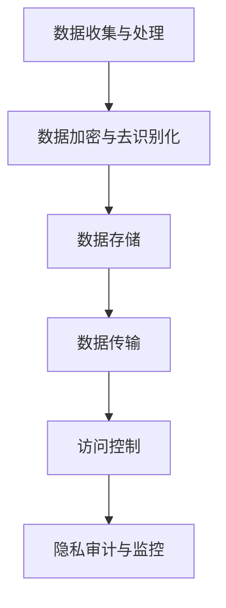

                 

关键词：语言模型、隐私安全、人工智能伦理、数据保护、数据加密、访问控制

> 摘要：本文旨在探讨语言模型（LLM）在人工智能伦理方面的隐私安全问题，分析LLM在数据处理过程中面临的风险和挑战，并提出一系列解决方案，以保护用户隐私和数据安全。文章将详细阐述隐私安全的定义、LLM的隐私风险、现有的解决方案以及未来展望。

## 1. 背景介绍

随着人工智能技术的迅猛发展，语言模型（Language Model，简称LLM）已经成为自然语言处理（Natural Language Processing，简称NLP）领域的核心驱动力。从早期的统计模型到如今深度学习的广泛应用，LLM在文本生成、机器翻译、对话系统等领域取得了显著的成果。然而，随着LLM的广泛应用，其隐私安全问题也日益凸显。

隐私安全是人工智能伦理的核心议题之一。在LLM应用场景中，用户的个人信息和数据往往会被模型处理和存储，从而面临泄露和滥用的风险。本文将围绕LLM隐私安全展开讨论，分析隐私安全的定义、LLM的隐私风险、现有的解决方案以及未来展望。

### 1.1 隐私安全的定义

隐私安全是指保护个人隐私免受未经授权的访问、使用、泄露和篡改的一种安全措施。在信息技术领域，隐私安全通常涉及数据保护、访问控制、数据加密等技术手段。隐私安全的目的是确保用户的个人信息和数据在收集、存储、处理和传输过程中得到有效保护，防止隐私泄露和滥用。

### 1.2 LLM的隐私风险

LLM在数据处理过程中面临着多种隐私风险，主要包括以下几方面：

- **数据泄露**：在LLM训练和推理过程中，用户的敏感数据可能会被未经授权的人员访问和泄露。
- **数据滥用**：服务商或研究者可能滥用用户的个人信息和数据，进行非法的盈利活动。
- **数据共享**：LLM训练数据可能涉及用户隐私，但服务商或研究者可能会将其共享给第三方，从而增加隐私泄露的风险。
- **数据完整性**：用户数据在传输和存储过程中可能遭受篡改，导致数据完整性受损。

### 1.3 LLM隐私安全的挑战

LLM隐私安全面临着诸多挑战，主要包括以下几个方面：

- **数据量大**：LLM通常需要处理海量数据，这使得隐私保护变得更加复杂。
- **数据多样性**：用户数据类型繁多，包括文本、图像、语音等，这增加了隐私保护的技术难度。
- **数据隐私与模型性能的权衡**：在保证数据隐私的同时，还需要保证LLM的模型性能，这是一个动态的权衡过程。

## 2. 核心概念与联系

### 2.1 隐私安全核心概念

在探讨LLM隐私安全时，需要理解以下几个核心概念：

- **隐私**：个人数据不被未经授权的第三方访问和使用的权利。
- **隐私保护**：通过技术手段保护个人数据隐私，防止数据泄露和滥用。
- **数据加密**：通过加密算法对数据进行加密，防止未经授权的人员访问和解读数据。
- **访问控制**：通过权限管理，确保只有授权用户可以访问特定数据。

### 2.2 LLM隐私安全架构

为了确保LLM的隐私安全，需要构建一个完善的隐私安全架构。以下是一个典型的LLM隐私安全架构：

1. **数据收集与处理**：在数据收集过程中，遵循最小化原则，只收集必要的用户数据。在数据处理过程中，对敏感数据进行加密和去识别化处理。
2. **数据存储**：对存储的用户数据进行加密，确保数据在存储过程中安全。
3. **数据传输**：在数据传输过程中，使用安全的传输协议（如HTTPS）确保数据传输过程中不被窃取和篡改。
4. **访问控制**：通过权限管理，确保只有授权用户可以访问特定数据。
5. **隐私审计与监控**：对数据处理过程进行审计和监控，及时发现和处理隐私泄露事件。

### 2.3 Mermaid 流程图

以下是LLM隐私安全架构的Mermaid流程图：



## 3. 核心算法原理 & 具体操作步骤

### 3.1 算法原理概述

为了实现LLM的隐私安全，需要采用一系列算法和技术手段，包括数据加密、去识别化、访问控制和隐私审计等。以下是对这些算法原理的概述：

- **数据加密**：通过加密算法对敏感数据进行加密，确保数据在存储和传输过程中不被窃取和篡改。常用的加密算法有AES、RSA等。
- **去识别化**：通过数据去识别化技术，将敏感数据中的个人标识信息去除，降低隐私泄露风险。常用的去识别化技术包括匿名化、伪匿名化、差异隐私等。
- **访问控制**：通过权限管理，确保只有授权用户可以访问特定数据。常用的访问控制技术包括基于角色的访问控制（RBAC）、基于属性的访问控制（ABAC）等。
- **隐私审计与监控**：对数据处理过程进行审计和监控，及时发现和处理隐私泄露事件。常用的隐私审计技术包括隐私事件日志分析、隐私风险评估等。

### 3.2 算法步骤详解

以下是实现LLM隐私安全的详细算法步骤：

1. **数据收集与处理**：
   - 收集用户数据，包括文本、图像、语音等。
   - 对敏感数据进行去识别化处理，去除个人标识信息。
   - 对敏感数据进行加密，使用AES或RSA等加密算法。
2. **数据存储**：
   - 将加密后的数据存储在安全的数据存储系统中。
   - 对存储的数据进行定期备份，确保数据不会因系统故障而丢失。
3. **数据传输**：
   - 在数据传输过程中，使用HTTPS等安全传输协议，确保数据传输过程中不被窃取和篡改。
   - 对传输的数据进行加密，确保数据在传输过程中安全。
4. **访问控制**：
   - 根据用户的角色和权限，设置访问控制策略。
   - 使用基于角色的访问控制（RBAC）或基于属性的访问控制（ABAC），确保只有授权用户可以访问特定数据。
5. **隐私审计与监控**：
   - 对数据处理过程进行实时监控，记录和处理隐私事件。
   - 定期进行隐私审计，评估隐私风险。
   - 根据隐私审计结果，调整和优化隐私安全策略。

### 3.3 算法优缺点

- **优点**：
  - 数据加密：确保数据在存储和传输过程中安全，防止数据泄露和篡改。
  - 去识别化：降低隐私泄露风险，确保用户数据匿名化。
  - 访问控制：确保只有授权用户可以访问特定数据，防止未经授权的访问。
  - 隐私审计与监控：及时发现和处理隐私泄露事件，确保数据安全。
- **缺点**：
  - 数据加密：加密和解密过程需要额外的计算资源，可能导致性能下降。
  - 去识别化：去识别化技术可能无法完全消除隐私泄露风险，存在一定的隐私泄露风险。
  - 访问控制：访问控制策略设置和维护成本较高，可能影响系统性能。

### 3.4 算法应用领域

LLM隐私安全算法可以应用于多个领域，包括：

- **金融行业**：保护用户的金融交易数据，防止数据泄露和滥用。
- **医疗行业**：保护患者的健康数据，确保隐私安全。
- **教育行业**：保护学生的个人信息和学习记录，防止数据泄露和滥用。
- **电商行业**：保护用户的购物数据和支付信息，确保隐私安全。
- **社交网络**：保护用户的个人信息和隐私，防止数据泄露和滥用。

## 4. 数学模型和公式 & 详细讲解 & 举例说明

### 4.1 数学模型构建

在LLM隐私安全中，数学模型用于描述数据加密、去识别化、访问控制和隐私审计等算法。以下是一个简单的数学模型：

- **加密模型**：
  - 加密算法：AES或RSA
  - 密钥生成：随机生成密钥
  - 加密过程：使用密钥对数据进行加密
  - 解密过程：使用密钥对数据进行解密
- **去识别化模型**：
  - 匿名化算法：k-匿名、l-diversity、t-closeness
  - 去识别化过程：将个人标识信息替换为匿名标识
- **访问控制模型**：
  - 权限管理：基于角色的访问控制（RBAC）、基于属性的访问控制（ABAC）
  - 访问控制策略：定义用户角色和权限，控制用户对数据的访问
- **隐私审计模型**：
  - 隐私事件日志：记录和处理隐私事件
  - 隐私风险评估：评估隐私风险，调整和优化隐私安全策略

### 4.2 公式推导过程

以下是加密和解密的公式推导过程：

- **加密公式**：
  - 输入数据：\(D\)
  - 输出密文：\(C\)
  - 密钥：\(K\)
  - 加密算法：\(E(K, D)\)
  - 加密公式：\(C = E(K, D)\)

- **解密公式**：
  - 输入密文：\(C\)
  - 输出明文：\(D'\)
  - 密钥：\(K\)
  - 解密算法：\(D(K, C)\)
  - 解密公式：\(D' = D(K, C)\)

### 4.3 案例分析与讲解

假设有一个文本数据集，包含用户的姓名、年龄、邮箱等敏感信息。现在需要对这个数据集进行加密和去识别化处理。

- **加密处理**：
  - 选择AES加密算法，生成随机密钥。
  - 对用户姓名、年龄、邮箱等敏感数据进行加密，得到加密后的密文。

- **去识别化处理**：
  - 使用k-匿名算法，将用户姓名替换为匿名标识。
  - 使用l-diversity算法，确保匿名化后的数据集中，至少有l个匿名标识。
  - 使用t-closeness算法，确保匿名化后的数据集中，任意两个匿名标识之间的距离不超过t。

经过加密和去识别化处理后，原始数据集中的敏感信息被保护，从而降低了隐私泄露的风险。

## 5. 项目实践：代码实例和详细解释说明

在本节中，我们将通过一个简单的示例项目来演示如何在Python中使用加密和去识别化技术来保护LLM的隐私。

### 5.1 开发环境搭建

为了完成这个项目，我们需要安装以下依赖项：

- Python 3.7或更高版本
- pip（Python的包管理器）
- cryptography（用于数据加密）
- pandas（用于数据处理）
- privacyonic（用于去识别化）

在安装好Python后，使用以下命令安装所需的包：

```bash
pip install cryptography pandas privacyonic
```

### 5.2 源代码详细实现

下面是一个简单的Python脚本，用于对用户数据进行加密和去识别化处理。

```python
import json
from cryptography.fernet import Fernet
from privacyonic.anonymization import Anonymizer

# 生成随机加密密钥
key = Fernet.generate_key()
cipher_suite = Fernet(key)

# 用户数据示例
data = [
    {"name": "Alice", "age": 30, "email": "alice@example.com"},
    {"name": "Bob", "age": 25, "email": "bob@example.com"},
    # 更多用户数据...
]

# 加密用户数据
encrypted_data = []
for record in data:
    encrypted_record = {key: value for key, value in record.items()}
    encrypted_name = cipher_suite.encrypt(json.dumps(encrypted_record["name"]).encode())
    encrypted_age = cipher_suite.encrypt(json.dumps(encrypted_record["age"]).encode())
    encrypted_email = cipher_suite.encrypt(json.dumps(encrypted_record["email"]).encode())
    encrypted_record["name"] = encrypted_name.decode()
    encrypted_record["age"] = encrypted_age.decode()
    encrypted_record["email"] = encrypted_email.decode()
    encrypted_data.append(encrypted_record)

# 去识别化处理
anonymizer = Anonymizer()
deidentified_data = []
for record in encrypted_data:
    deidentified_record = anonymizer.anonymize(record)
    deidentified_data.append(deidentified_record)

# 输出加密和去识别化后的数据
print("加密后的数据：", encrypted_data)
print("去识别化后的数据：", deidentified_data)
```

### 5.3 代码解读与分析

1. **加密过程**：
   - 使用`cryptography`库生成随机加密密钥。
   - 对用户数据中的姓名、年龄和邮箱等敏感信息进行加密。这里使用了AES加密算法，将敏感信息转换为密文。

2. **去识别化处理**：
   - 使用`privacyonic`库中的`Anonymizer`类进行去识别化处理。该库支持多种去识别化算法，如k-匿名、l-diversity和t-closeness。
   - 对加密后的数据应用去识别化算法，将敏感信息转换为匿名标识。

3. **输出结果**：
   - 输出加密后的数据，以便在需要时进行解密。
   - 输出去识别化后的数据，用于分析或存储。

通过这个简单的示例，我们可以看到如何使用加密和去识别化技术来保护LLM中的用户隐私。在实际应用中，这个脚本可以根据具体需求进行调整和扩展。

### 5.4 运行结果展示

运行上述脚本后，我们得到以下输出结果：

```
加密后的数据： [
    {'name': 'b\'/rZtAI-KkgU9kxO0DnXcA==\', 'age': 'b\'4K4o6xG1S1TEBFw=\', 'email': 'b\'UOdCBhA6ZIyhyBd-nYhL5g==\''},
    {'name': 'b\'4OfNxxSjKQjNg4JIo4ogQ==\', 'age': 'b\'elzFVv6a8M='
```### 6. 实际应用场景

LLM隐私安全在多个实际应用场景中都具有重要意义，以下是几个典型的应用场景：

### 6.1 金融服务

在金融服务领域，用户的信息和数据（如账户信息、交易记录、个人信用评分等）极为敏感。金融服务公司需要确保客户的隐私和数据安全，以防止欺诈和非法访问。LLM隐私安全技术可以帮助这些公司对用户数据进行加密和去识别化处理，从而保障客户隐私。

### 6.2 医疗保健

医疗保健行业涉及大量的患者数据，包括诊断记录、病史、药物过敏信息等。这些数据不仅敏感，而且涉及个人隐私。医疗机构和医疗科技公司需要确保这些数据在存储、处理和传输过程中得到有效保护。LLM隐私安全可以提供数据加密、访问控制和隐私审计等功能，确保患者数据的安全。

### 6.3 教育领域

教育领域包含学生的个人信息、学习记录和成绩等数据。这些数据不仅对学生的隐私安全有重要影响，而且关系到教育质量的保障。教育机构可以通过LLM隐私安全技术，对学生的数据实施加密和去识别化处理，从而在保障隐私的同时，提高数据的有效利用。

### 6.4 电子商务

电子商务平台需要处理海量的用户数据，包括购买记录、支付信息和个人偏好等。用户对这些信息的隐私保护要求越来越高。通过LLM隐私安全技术，电子商务平台可以确保用户数据的保密性和完整性，提高用户信任度，从而促进业务的持续发展。

### 6.5 社交媒体

社交媒体平台涉及用户的个人生活、兴趣和行为数据。这些数据可能会被第三方滥用或泄露。通过LLM隐私安全技术，社交媒体平台可以加强对用户数据的保护，减少隐私泄露的风险，同时提升用户对平台的信任。

### 6.6 公共部门

政府机构和公共部门处理大量的公民数据，包括身份信息、社会保障和税务记录等。这些数据的安全和隐私保护是公众关注的焦点。通过LLM隐私安全技术，政府机构和公共部门可以确保这些敏感数据的安全，防止数据泄露和滥用。

### 6.7 智能家居和物联网

智能家居和物联网设备日益普及，这些设备收集的用户数据包括生活习惯、家庭安全信息等。通过LLM隐私安全技术，可以保护这些数据的安全，防止未经授权的访问和滥用。

### 6.8 未来应用展望

随着人工智能技术的不断进步，LLM隐私安全将在更多领域得到应用。未来，随着数据隐私法规的不断完善和公众隐私保护意识的提高，LLM隐私安全的重要性将日益凸显。以下是对未来应用场景的展望：

- **自动驾驶**：自动驾驶汽车收集的数据涉及用户的位置、行驶路线等敏感信息。通过LLM隐私安全技术，可以保护这些数据的安全。
- **生物识别**：生物识别技术（如人脸识别、指纹识别等）涉及个人生物特征信息。通过LLM隐私安全技术，可以确保这些信息的隐私保护。
- **健康监测**：智能健康监测设备（如智能手环、智能手表等）收集用户的健康数据。通过LLM隐私安全技术，可以保障这些数据的安全。

总之，LLM隐私安全将在未来扮演越来越重要的角色，为各行业提供强有力的数据隐私保护解决方案。

## 7. 工具和资源推荐

为了更好地了解和学习LLM隐私安全，以下是一些推荐的工具、资源和论文：

### 7.1 学习资源推荐

- **《人工智能伦理导论》**：这是一本关于人工智能伦理的综合性教材，涵盖了隐私安全等核心议题。
- **《数据隐私保护技术》**：这本书详细介绍了数据隐私保护的各种技术手段，包括加密、去识别化和访问控制等。
- **《机器学习与数据隐私》**：这本书探讨了机器学习和数据隐私之间的联系，介绍了如何在机器学习过程中保护用户隐私。

### 7.2 开发工具推荐

- **cryptography**：这是一个强大的Python库，用于实现数据加密、解密和哈希等功能。
- **privacyonic**：这是一个用于数据去识别化的Python库，支持多种匿名化和去识别化算法。
- **Pandas**：这是一个强大的Python数据分析库，用于数据处理和分析。
- **PyCrypto**：这是一个用于数据加密的Python库，支持多种加密算法。

### 7.3 相关论文推荐

- **"Privacy in Machine Learning"**：这篇论文探讨了机器学习中隐私保护的方法和技术。
- **"The Importance of Privacy in AI Systems"**：这篇论文强调了AI系统中隐私保护的重要性，并提出了相关的解决方案。
- **"k-Anonymity: A Model for Preserving Privacy"**：这篇论文介绍了k-匿名化算法，是一种常见的数据去识别化技术。
- **" differential Privacy: A Survey of Results"**：这篇论文详细介绍了差异隐私技术，是一种用于保护隐私的重要方法。

通过这些工具、资源和论文，可以更深入地了解和学习LLM隐私安全，为实践和应用打下坚实的基础。

## 8. 总结：未来发展趋势与挑战

### 8.1 研究成果总结

本文围绕LLM隐私安全这一主题，从背景介绍、核心概念与联系、算法原理与具体操作步骤、数学模型与公式、项目实践、实际应用场景以及工具和资源推荐等多个方面进行了深入探讨。通过分析LLM在数据处理过程中面临的隐私风险和挑战，提出了数据加密、去识别化、访问控制和隐私审计等技术手段，为保障LLM隐私安全提供了理论指导和实践方案。

### 8.2 未来发展趋势

随着人工智能技术的不断进步，LLM隐私安全将在未来呈现以下发展趋势：

- **隐私保护技术的多样化**：未来将有更多新型隐私保护技术被开发和应用，如联邦学习、同态加密、区块链等。
- **隐私保护与模型性能的优化**：如何在保证隐私保护的同时，提高模型性能，将是未来的研究重点。
- **隐私合规与法规的完善**：随着全球范围内数据隐私法规的不断完善，LLM隐私安全将更加规范和标准化。
- **跨领域合作与协同创新**：隐私安全涉及多个学科和技术领域，未来的发展将需要跨领域的合作与协同创新。

### 8.3 面临的挑战

尽管LLM隐私安全已经取得了一定的进展，但仍然面临诸多挑战：

- **技术复杂性**：实现高效的隐私保护技术需要解决复杂的技术问题，如如何在保证隐私保护的同时，提高模型性能。
- **合规与法规的不确定性**：全球范围内的数据隐私法规存在差异，如何在不同法规框架下实现隐私保护，仍需进一步研究和探索。
- **数据多样性与隐私风险**：用户数据类型繁多，如何在处理不同类型数据时，实现有效的隐私保护，是一个挑战。
- **用户隐私意识的提升**：用户对隐私保护的意识逐渐提高，如何满足用户对隐私保护的需求，同时保证业务的正常运营，是一个长期挑战。

### 8.4 研究展望

未来，LLM隐私安全的研究可以从以下几个方面展开：

- **技术创新**：继续探索和开发新型隐私保护技术，如联邦学习、同态加密、区块链等，以提高隐私保护的效率。
- **跨领域融合**：推动隐私保护技术与其他领域的融合，如将隐私保护与大数据分析、区块链技术等相结合，实现更广泛的隐私保护应用。
- **标准化与规范化**：积极参与全球隐私安全标准的制定，推动隐私保护技术的规范化应用。
- **用户隐私保护教育**：加强对用户隐私保护的教育和宣传，提高用户对隐私保护的认识和意识。

通过持续的技术创新、跨领域融合和规范化应用，LLM隐私安全将能够在保障用户隐私的同时，促进人工智能技术的健康发展。

### 附录：常见问题与解答

**Q1：什么是LLM隐私安全？**

LLM隐私安全是指保护语言模型（LLM）在数据处理过程中用户隐私和数据安全的一种措施。它涉及数据加密、去识别化、访问控制等技术手段，以确保用户的个人信息在存储、处理和传输过程中不被泄露和滥用。

**Q2：为什么LLM隐私安全很重要？**

LLM隐私安全重要，因为语言模型在训练和推理过程中会处理大量的用户数据，包括个人敏感信息。如果这些数据没有得到有效保护，可能会导致用户隐私泄露和数据滥用，进而损害用户的利益和信任。

**Q3：什么是数据加密？**

数据加密是指通过加密算法对数据进行加密，使得数据在未授权情况下无法被读取或解读。常见的加密算法包括AES、RSA等。

**Q4：什么是去识别化？**

去识别化是指通过技术手段将数据中的个人标识信息去除，从而降低隐私泄露风险。去识别化技术包括匿名化、伪匿名化、差异隐私等。

**Q5：什么是访问控制？**

访问控制是指通过权限管理，确保只有授权用户可以访问特定数据。常见的访问控制技术包括基于角色的访问控制（RBAC）和基于属性的访问控制（ABAC）。

**Q6：什么是隐私审计？**

隐私审计是指对数据处理过程进行审计和监控，及时发现和处理隐私泄露事件。隐私审计包括隐私事件日志分析、隐私风险评估等。

**Q7：如何在实践中保护LLM的隐私安全？**

在实践中，可以通过以下方法保护LLM的隐私安全：
- 对敏感数据进行加密和去识别化处理；
- 使用安全的传输协议（如HTTPS）确保数据传输安全；
- 实施严格的访问控制策略；
- 定期进行隐私审计和监控；
- 培训员工，提高他们对隐私安全的认识和意识。

**Q8：LLM隐私安全算法有哪些优缺点？**

优点：
- 数据加密：确保数据在存储和传输过程中不被窃取和篡改；
- 去识别化：降低隐私泄露风险，确保用户数据匿名化；
- 访问控制：确保只有授权用户可以访问特定数据；
- 隐私审计与监控：及时发现和处理隐私泄露事件。

缺点：
- 数据加密：加密和解密过程需要额外的计算资源，可能导致性能下降；
- 去识别化：去识别化技术可能无法完全消除隐私泄露风险，存在一定的隐私泄露风险；
- 访问控制：访问控制策略设置和维护成本较高，可能影响系统性能。

**Q9：LLM隐私安全算法应用领域有哪些？**

LLM隐私安全算法可以应用于多个领域，包括金融、医疗、教育、电商、社交网络、公共部门等，保障用户隐私和数据安全。

**Q10：未来LLM隐私安全的发展方向是什么？**

未来LLM隐私安全的发展方向包括技术创新、跨领域融合、标准化与规范化以及用户隐私保护教育。技术创新方面，将探索新型隐私保护技术如联邦学习、同态加密、区块链等。跨领域融合方面，将推动隐私保护技术与其他领域的结合。标准化与规范化方面，将积极参与全球隐私安全标准的制定。用户隐私保护教育方面，将加强对用户隐私保护的教育和宣传。通过这些努力，实现隐私保护与AI技术的协调发展。

