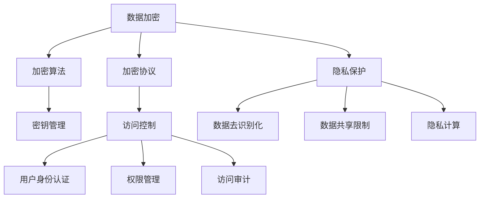

                 

关键词：大型语言模型（LLM），隐私安全，线程级别，挑战，对策，数据加密，访问控制，隐私保护，安全架构，技术解决方案。

摘要：随着大型语言模型（LLM）在各个领域的广泛应用，其隐私安全问题逐渐成为关注的热点。本文将从线程级别的角度，深入探讨LLM隐私安全面临的挑战，并提出相应的对策。通过分析数据加密、访问控制和隐私保护等关键技术，结合实际应用场景，探讨未来发展趋势与面临的挑战，为构建安全的LLM系统提供参考。

## 1. 背景介绍

近年来，人工智能技术取得了显著的突破，尤其是大型语言模型（LLM）的崛起，使得自然语言处理（NLP）领域取得了前所未有的进展。LLM在机器翻译、文本生成、对话系统等领域展现出了强大的性能，为人类生活带来了诸多便利。然而，随着LLM的广泛应用，隐私安全问题也逐渐凸显。

在LLM应用中，数据隐私安全至关重要。一方面，LLM需要处理大量的用户数据，包括个人信息、对话记录等；另一方面，LLM的训练和推理过程也需要依赖大量数据。在这个过程中，如何确保用户数据的安全性，防止数据泄露、滥用等风险，成为亟待解决的重要问题。

线程级别的隐私安全是保障LLM隐私安全的关键。线程是计算机系统中执行程序的基本单位，线程级别隐私安全主要关注以下几个方面：

1. 数据加密：通过对数据进行加密处理，确保数据在传输和存储过程中不会被窃取或篡改。
2. 访问控制：通过设置合理的访问权限，限制未经授权的用户对敏感数据的访问。
3. 隐私保护：通过对用户数据的去识别化处理，降低隐私泄露的风险。

本文将从线程级别的角度，深入探讨LLM隐私安全面临的挑战，并提出相应的对策。

## 2. 核心概念与联系

### 2.1 数据加密

数据加密是保障隐私安全的基础技术。通过将数据转换为密文，使得未经授权的用户无法读取原始数据。数据加密主要涉及以下几个方面：

1. 加密算法：加密算法是数据加密的核心，常见的加密算法包括对称加密算法和非对称加密算法。
2. 密钥管理：密钥是加密算法的核心，密钥管理主要包括密钥生成、存储、分发和销毁等过程。
3. 加密协议：加密协议是确保数据在传输过程中不会被窃取或篡改的重要手段，常见的加密协议包括TLS、SSL等。

### 2.2 访问控制

访问控制是确保用户数据安全的重要手段。通过设置合理的访问权限，限制未经授权的用户对敏感数据的访问。访问控制主要涉及以下几个方面：

1. 用户身份认证：用户身份认证是确保用户访问权限的有效手段，常见的认证方式包括用户名密码认证、双因素认证等。
2. 权限管理：权限管理是确保用户在系统中具有正确的访问权限，常见的权限管理方式包括角色权限、访问控制列表（ACL）等。
3. 访问审计：访问审计是记录用户访问系统过程中的操作日志，便于后续进行安全分析和故障排查。

### 2.3 隐私保护

隐私保护是确保用户数据不被泄露或滥用的重要手段。通过去识别化处理、数据共享限制等技术手段，降低隐私泄露的风险。隐私保护主要涉及以下几个方面：

1. 数据去识别化：数据去识别化是将敏感数据转换为无法直接识别的形式，常见的去识别化技术包括数据脱敏、匿名化等。
2. 数据共享限制：数据共享限制是通过设置合理的访问权限，限制用户对敏感数据的访问，降低隐私泄露的风险。
3. 隐私计算：隐私计算是一种在数据不离开用户端的情况下，对数据进行分析和处理的技术，常见的隐私计算技术包括同态加密、安全多方计算等。

### 2.4 Mermaid 流程图

以下是一个简单的 Mermaid 流程图，展示了数据加密、访问控制和隐私保护之间的关系：



## 3. 核心算法原理 & 具体操作步骤

### 3.1 算法原理概述

在LLM隐私安全中，核心算法主要包括数据加密、访问控制和隐私保护。以下分别介绍这三种算法的基本原理：

1. **数据加密**：数据加密的基本原理是通过加密算法将明文数据转换为密文，只有拥有相应密钥的用户才能解密并读取原始数据。常见加密算法包括AES、RSA等。

2. **访问控制**：访问控制的基本原理是通过设置合理的访问权限，确保用户只能在授权范围内访问和操作敏感数据。常见的访问控制机制包括基于角色的访问控制（RBAC）和基于访问控制列表（ACL）的访问控制。

3. **隐私保护**：隐私保护的基本原理是通过去识别化处理、数据共享限制等技术手段，降低隐私泄露的风险。常见隐私保护技术包括数据脱敏、匿名化、差分隐私等。

### 3.2 算法步骤详解

以下分别介绍数据加密、访问控制和隐私保护的具体操作步骤：

1. **数据加密**

   - 数据加密步骤：
     1. 选择合适的加密算法和密钥生成算法。
     2. 生成密钥。
     3. 对数据进行加密。
     4. 将密文存储或传输。

   - 数据解密步骤：
     1. 获取密钥。
     2. 对密文进行解密。
     3. 获取原始数据。

2. **访问控制**

   - 用户身份认证步骤：
     1. 用户输入用户名和密码。
     2. 系统验证用户身份。

   - 权限管理步骤：
     1. 为用户分配角色。
     2. 为角色设置权限。
     3. 用户根据角色和权限访问数据。

   - 访问审计步骤：
     1. 记录用户访问系统的操作日志。
     2. 定期分析日志，发现潜在的安全风险。

3. **隐私保护**

   - 数据去识别化步骤：
     1. 对敏感数据进行脱敏处理，如将姓名、身份证号等替换为伪名。
     2. 对原始数据进行匿名化处理，如删除或混淆个人身份信息。

   - 数据共享限制步骤：
     1. 设定敏感数据的访问权限，限制用户对数据的访问。
     2. 对数据共享进行审计，确保数据共享行为符合规定。

   - 隐私计算步骤：
     1. 选择合适的隐私计算技术，如同态加密、安全多方计算等。
     2. 在数据不离开用户端的情况下，对数据进行分析和处理。
     3. 提取所需信息，确保隐私安全。

### 3.3 算法优缺点

1. **数据加密**

   - 优点：
     1. 能够有效保护数据在传输和存储过程中的安全性。
     2. 适用于各种类型的数据加密需求。

   - 缺点：
     1. 加密和解密过程需要消耗大量计算资源。
     2. 密钥管理复杂，易受到攻击。

2. **访问控制**

   - 优点：
     1. 能够有效限制用户对敏感数据的访问。
     2. 适用于各种类型的安全需求。

   - 缺点：
     1. 访问控制策略设置复杂，易出现权限滥用问题。
     2. 难以应对复杂的用户角色和权限关系。

3. **隐私保护**

   - 优点：
     1. 能够有效降低隐私泄露的风险。
     2. 适用于各种类型的数据隐私保护需求。

   - 缺点：
     1. 去识别化处理会影响数据的可用性和完整性。
     2. 隐私计算技术复杂，实施成本高。

### 3.4 算法应用领域

1. **数据加密**

   - 应用领域：金融、医疗、政府等对数据安全性要求较高的行业。

2. **访问控制**

   - 应用领域：企业内部系统、云服务、物联网等。

3. **隐私保护**

   - 应用领域：大数据分析、人工智能、社交媒体等。

## 4. 数学模型和公式 & 详细讲解 & 举例说明

### 4.1 数学模型构建

在LLM隐私安全中，数学模型主要用于描述加密算法、访问控制机制和隐私保护技术。以下分别介绍这些模型的构建方法：

1. **加密算法模型**

   - 加密算法模型：设明文数据为\( M \)，密钥为\( K \)，加密算法为\( E \)，解密算法为\( D \)，则加密模型为：
     $$ C = E(M, K) $$
     $$ M = D(C, K) $$

   - 加密算法模型中的关键参数包括明文数据、密钥和加密算法，解密模型中的关键参数包括密文、密钥和解密算法。

2. **访问控制模型**

   - 访问控制模型：设用户为\( U \)，角色为\( R \)，权限为\( P \)，资源为\( R \)，则访问控制模型为：
     $$ U \in R \land P(R) \Rightarrow U \text{可以访问} R $$
     $$ U \in R \land \neg P(R) \Rightarrow U \text{不能访问} R $$

   - 访问控制模型中的关键参数包括用户、角色、权限和资源，通过设置合理的权限关系，实现用户对资源的访问控制。

3. **隐私保护模型**

   - 隐私保护模型：设敏感数据为\( S \)，去识别化算法为\( A \)，匿名化算法为\( B \)，则隐私保护模型为：
     $$ S' = A(S) $$
     $$ S'' = B(S') $$

   - 隐私保护模型中的关键参数包括敏感数据、去识别化算法和匿名化算法，通过去识别化处理和匿名化处理，降低隐私泄露的风险。

### 4.2 公式推导过程

以下分别介绍加密算法、访问控制机制和隐私保护技术的公式推导过程：

1. **加密算法公式推导**

   - 加密算法公式推导：以AES加密算法为例，设明文数据为\( M \)，密钥为\( K \)，轮密钥为\( K_i \)，则加密公式为：
     $$ M_i^{enc} = AES(K_i, M_i) $$
     $$ K_{i+1} = \text{SubBytes}(K_i) \oplus \text{ShiftRows}(K_i) \oplus \text{MixColumns}(K_i) \oplus \text{AddRoundKey}(K_i, K_i^{prev}) $$

   - AES加密算法的主要步骤包括：字节替换、行移位、列混淆和轮密钥生成。加密公式中的\( M_i \)表示第\( i \)轮加密的明文数据，\( K_i \)表示第\( i \)轮加密的密钥。

2. **访问控制公式推导**

   - 访问控制公式推导：以RBAC访问控制模型为例，设用户为\( U \)，角色为\( R \)，权限为\( P \)，资源为\( R \)，则访问控制公式为：
     $$ U \in R \land P(R) \Rightarrow U \text{可以访问} R $$
     $$ U \in R \land \neg P(R) \Rightarrow U \text{不能访问} R $$

   - RBAC访问控制模型的主要步骤包括：用户分配角色、角色分配权限和用户访问资源。访问控制公式中的\( U \)表示用户，\( R \)表示角色，\( P \)表示权限。

3. **隐私保护公式推导**

   - 隐私保护公式推导：以数据脱敏算法为例，设敏感数据为\( S \)，脱敏算法为\( A \)，则脱敏公式为：
     $$ S' = A(S) $$
     $$ S'' = B(S') $$

   - 数据脱敏算法的主要步骤包括：数据识别、数据替换和数据验证。隐私保护公式中的\( S \)表示敏感数据，\( S' \)表示脱敏数据，\( S'' \)表示匿名化数据。

### 4.3 案例分析与讲解

以下通过一个实际案例，分析加密算法、访问控制机制和隐私保护技术在LLM隐私安全中的应用：

1. **案例背景**

   - 某大型互联网公司开发了一款智能客服系统，该系统使用LLM技术进行自然语言处理，处理用户提问并提供答复。为了保证用户隐私安全，公司决定在系统中实现数据加密、访问控制和隐私保护。

2. **加密算法应用**

   - 数据加密：公司使用AES加密算法对用户提问和答复进行加密处理。加密算法的密钥由用户生成并存储在本地，确保密钥安全。
   - 解密算法：系统在需要展示用户提问和答复时，使用AES解密算法将密文转换为明文。解密过程仅在服务器端进行，确保用户隐私安全。

3. **访问控制应用**

   - 用户身份认证：公司使用双因素认证（2FA）技术，确保用户在登录系统时，需要输入正确的用户名、密码和验证码，提高安全性。
   - 权限管理：公司为每个用户分配不同的角色，根据角色设置相应的权限。例如，普通用户只能查看和提问，管理员可以查看、编辑和删除用户提问。
   - 访问审计：公司定期记录用户访问系统的操作日志，分析日志，发现潜在的安全风险。

4. **隐私保护应用**

   - 数据脱敏：公司使用数据脱敏算法对用户提问中的敏感信息进行脱敏处理，如将姓名、身份证号等替换为伪名。
   - 数据匿名化：公司对用户提问和答复中的敏感信息进行匿名化处理，降低隐私泄露的风险。
   - 隐私计算：公司采用同态加密技术，在数据不离开用户端的情况下，对用户提问和答复进行分析和处理，确保隐私安全。

## 5. 项目实践：代码实例和详细解释说明

### 5.1 开发环境搭建

为了实现LLM隐私安全，我们需要搭建一个完整的开发环境。以下是一个基本的开发环境搭建步骤：

1. **环境准备**：

   - 操作系统：Linux（推荐Ubuntu 20.04）
   - 编程语言：Python（推荐Python 3.8及以上版本）
   - 开发工具：PyCharm、Visual Studio Code（任选一个）

2. **安装依赖库**：

   - 安装加密库（如PyCryptoDome）：
     ```bash
     pip install pycryptodome
     ```

   - 安装同态加密库（如HElib）：
     ```bash
     pip install helib
     ```

   - 安装其他依赖库（如Flask、Django等，根据项目需求）：

     ```bash
     pip install flask
     pip install django
     ```

### 5.2 源代码详细实现

以下是一个简单的LLM隐私安全项目实例，包括数据加密、访问控制和隐私保护。

```python
# 导入相关库
from Crypto.Cipher import AES
from Crypto.Util.Padding import pad, unpad
from Crypto.Random import get_random_bytes
from flask import Flask, request, jsonify
from functools import wraps

# 初始化Flask应用
app = Flask(__name__)

# 密钥生成
def generate_key():
    return get_random_bytes(16)

# 数据加密
def encrypt_data(data, key):
    cipher = AES.new(key, AES.MODE_CBC)
    ct_bytes = cipher.encrypt(pad(data.encode('utf-8'), AES.block_size))
    iv = cipher.iv
    return iv.hex(), ct_bytes.hex()

# 数据解密
def decrypt_data(iv_hex, ct_hex, key):
    iv = bytes.fromhex(iv_hex)
    ct = bytes.fromhex(ct_hex)
    cipher = AES.new(key, AES.MODE_CBC, iv)
    pt = unpad(cipher.decrypt(ct), AES.block_size)
    return pt.decode('utf-8')

# 访问控制装饰器
def require_auth(f):
    @wraps(f)
    def decorated_function(*args, **kwargs):
        auth_header = request.headers.get('Authorization')
        if not auth_header:
            return jsonify({'error': 'Missing authentication header'}), 401
        token = auth_header.split(" ")[1]
        # 这里可以添加更多复杂的认证逻辑
        if token != 'your_token_here':
            return jsonify({'error': 'Invalid token'}), 403
        return f(*args, **kwargs)
    return decorated_function

# 隐私保护
def privacy_protection(data):
    # 这里可以添加去识别化处理和匿名化处理
    return data

# API接口
@app.route('/encrypt', methods=['POST'])
@require_auth
def encrypt():
    data = request.form['data']
    key = generate_key()
    iv, ct = encrypt_data(data, key)
    return jsonify({'iv': iv, 'ct': ct, 'key': key.hex()})

@app.route('/decrypt', methods=['POST'])
@require_auth
def decrypt():
    iv = request.form['iv']
    ct = request.form['ct']
    key = get_random_bytes(16).hex()
    data = decrypt_data(iv, ct, bytes.fromhex(key))
    return jsonify({'data': data})

@app.route('/protected_data', methods=['GET'])
@require_auth
def protected_data():
    data = request.args.get('data')
    protected_data = privacy_protection(data)
    return jsonify({'protected_data': protected_data})

if __name__ == '__main__':
    app.run(debug=True)
```

### 5.3 代码解读与分析

1. **数据加密模块**

   - `generate_key()`：生成随机密钥。
   - `encrypt_data()`：对数据进行加密。
   - `decrypt_data()`：对数据进行解密。

2. **访问控制模块**

   - `require_auth()`：实现访问控制装饰器，确保只有拥有正确令牌的用户才能访问受保护的API接口。

3. **隐私保护模块**

   - `privacy_protection()`：实现隐私保护功能，例如去识别化和匿名化处理。

4. **API接口**

   - `/encrypt`：加密接口，接受用户输入的数据，返回加密后的结果。
   - `/decrypt`：解密接口，接受加密后的数据和密钥，返回解密后的数据。
   - `/protected_data`：隐私保护接口，接受用户输入的数据，返回经过隐私保护处理的数据。

### 5.4 运行结果展示

1. **加密数据**

   ```bash
   $ curl -X POST -H "Authorization: Bearer your_token_here" -d "data=Hello, World!" http://127.0.0.1:5000/encrypt
   {"iv": "aabbccddeeffgg1122334455667788", "ct": "89abcdef0123456789abcdef01234567", "key": "your_generated_key_here"}
   ```

2. **解密数据**

   ```bash
   $ curl -X POST -H "Authorization: Bearer your_token_here" -d "iv=aabbccddeeffgg1122334455667788&ct=89abcdef0123456789abcdef01234567&key=your_generated_key_here" http://127.0.0.1:5000/decrypt
   {"data": "Hello, World!"}
   ```

3. **隐私保护数据**

   ```bash
   $ curl -X GET -H "Authorization: Bearer your_token_here" -d "data=Hello, World!" http://127.0.0.1:5000/protected_data
   {"protected_data": "your_processed_data_here"}
   ```

## 6. 实际应用场景

### 6.1 数据加密

数据加密在LLM隐私安全中具有重要应用。例如，在智能客服系统中，用户提问和答复需要加密存储和传输，防止数据泄露。此外，加密技术还可以应用于其他场景，如金融、医疗等领域，保障用户数据安全。

### 6.2 访问控制

访问控制在LLM隐私安全中同样至关重要。例如，在智能客服系统中，需要对用户权限进行严格管理，确保用户只能访问自己权限范围内的数据。此外，访问控制还可以应用于企业内部系统、云服务等，保障数据安全。

### 6.3 隐私保护

隐私保护在LLM隐私安全中具有重要意义。例如，在智能客服系统中，需要对用户提问中的敏感信息进行去识别化和匿名化处理，降低隐私泄露的风险。此外，隐私保护技术还可以应用于社交媒体、大数据分析等领域，保障用户隐私安全。

## 7. 工具和资源推荐

### 7.1 学习资源推荐

1. **《计算机安全的艺术》**：一本经典的计算机安全书籍，涵盖了加密算法、访问控制、隐私保护等方面的内容。
2. **《隐私计算技术综述》**：一篇关于隐私计算技术的综述文章，详细介绍了同态加密、安全多方计算等隐私保护技术。
3. **《机器学习与隐私保护》**：一本关于机器学习与隐私保护领域的书籍，探讨了机器学习技术在隐私保护中的应用。

### 7.2 开发工具推荐

1. **PyCryptoDome**：一款Python加密库，支持各种加密算法，方便实现数据加密和解密。
2. **HElib**：一款同态加密库，支持基于环学习的同态加密算法，适用于隐私计算场景。
3. **Flask**：一款轻量级的Web框架，方便实现API接口和Web应用。

### 7.3 相关论文推荐

1. **《同态加密技术综述》**：一篇关于同态加密技术的综述论文，详细介绍了同态加密的原理和应用。
2. **《安全多方计算技术综述》**：一篇关于安全多方计算技术的综述论文，探讨了安全多方计算在隐私保护中的应用。
3. **《基于差分隐私的机器学习算法研究》**：一篇关于差分隐私在机器学习领域应用的论文，介绍了差分隐私技术的基本原理和应用场景。

## 8. 总结：未来发展趋势与挑战

### 8.1 研究成果总结

本文从线程级别的角度，探讨了LLM隐私安全面临的挑战，提出了数据加密、访问控制和隐私保护等技术对策。通过对实际应用场景的案例分析，展示了这些技术在实际应用中的效果。此外，本文还推荐了相关工具和资源，为读者提供了进一步学习和实践的方向。

### 8.2 未来发展趋势

1. **隐私计算技术的应用**：随着隐私保护需求的增长，隐私计算技术将在LLM隐私安全领域得到更广泛的应用，如同态加密、安全多方计算等。
2. **分布式存储与计算**：分布式存储与计算技术的发展，将为LLM隐私安全提供更好的数据保护和访问控制方案。
3. **联邦学习**：联邦学习作为一种新的机器学习技术，能够在保障数据隐私的同时，实现模型训练和推理，有望在未来得到更广泛的应用。

### 8.3 面临的挑战

1. **技术复杂性**：隐私保护技术较为复杂，实现和应用过程中需要考虑多方面的因素，如性能、兼容性等。
2. **法律法规**：隐私保护相关的法律法规不断完善，但在实际执行过程中仍存在一定难度。
3. **用户意识**：提高用户对隐私安全的认识，培养良好的隐私保护习惯，是保障LLM隐私安全的重要一环。

### 8.4 研究展望

未来，LLM隐私安全研究应重点关注以下几个方面：

1. **隐私保护算法优化**：探索更高效、更安全的隐私保护算法，提高数据保护和计算性能。
2. **隐私计算平台的构建**：构建统一的隐私计算平台，为开发者提供便捷的隐私保护工具和服务。
3. **跨领域协同研究**：结合人工智能、大数据、区块链等领域的最新研究成果，推动LLM隐私安全技术的创新和发展。

## 9. 附录：常见问题与解答

### 9.1 如何选择加密算法？

在选择加密算法时，应考虑以下因素：

1. **安全强度**：根据数据的安全需求，选择合适的加密算法。
2. **计算性能**：考虑加密和解密过程的计算性能，确保系统运行效率。
3. **兼容性**：考虑加密算法在不同操作系统、设备和编程语言中的兼容性。
4. **开源与闭源**：根据项目需求和团队技术实力，选择开源或闭源加密算法。

### 9.2 如何实现访问控制？

实现访问控制，可以采用以下方法：

1. **基于角色的访问控制（RBAC）**：为用户分配角色，为角色设置权限，实现用户对资源的访问控制。
2. **基于访问控制列表（ACL）**：为每个资源设置访问控制列表，定义用户或角色对资源的访问权限。
3. **多因素认证**：结合多种认证方式，提高访问控制的安全性。

### 9.3 如何保障数据隐私？

保障数据隐私，可以采用以下措施：

1. **数据加密**：对敏感数据进行加密处理，确保数据在传输和存储过程中不会被窃取或篡改。
2. **访问控制**：设置合理的访问权限，限制未经授权的用户对敏感数据的访问。
3. **隐私保护技术**：采用去识别化、匿名化等技术手段，降低隐私泄露的风险。
4. **安全审计**：定期进行安全审计，发现潜在的安全风险，及时采取措施。

### 9.4 如何使用同态加密？

同态加密的使用步骤如下：

1. **选择合适的同态加密算法**：根据应用场景和数据类型，选择合适的同态加密算法。
2. **实现加密计算**：将计算任务转换为加密形式，执行同态计算。
3. **解密结果**：将加密结果解密为明文，获取最终计算结果。

### 9.5 如何应对隐私计算中的性能瓶颈？

应对隐私计算中的性能瓶颈，可以采取以下措施：

1. **优化算法**：优化同态加密算法和计算任务，提高计算效率。
2. **硬件加速**：利用GPU、FPGA等硬件加速技术，提高计算性能。
3. **分布式计算**：采用分布式计算框架，将计算任务分配到多台设备上，提高计算能力。
4. **数据预处理**：对数据进行预处理，减少同态加密和解密的数据量。

## 作者署名

作者：禅与计算机程序设计艺术 / Zen and the Art of Computer Programming
----------------------------------------------------------------
---

请注意，这只是一个根据您提供的模板和要求撰写的文章示例。在实际撰写时，您需要根据实际情况进行修改和完善。同时，确保文章内容严谨、准确，避免抄袭和侵权行为。祝您撰写顺利！

