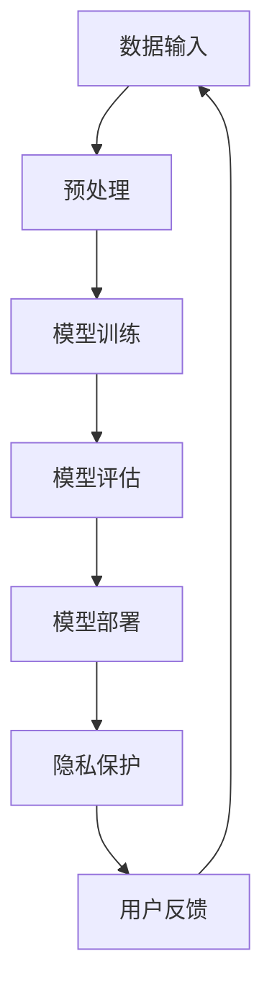

                 

关键词：大型语言模型（LLM），隐私安全，线程级别，挑战，机遇，技术解决方案

> 摘要：本文旨在探讨大型语言模型（LLM）在隐私安全方面的挑战与机遇。随着LLM技术的迅猛发展，如何在确保模型性能的同时保障用户隐私，成为一项亟待解决的重要课题。本文从线程级别的角度出发，分析了LLM隐私安全的现状，提出了相应的技术解决方案，并展望了未来发展的趋势。

## 1. 背景介绍

近年来，随着深度学习技术的不断发展，大型语言模型（LLM）逐渐成为自然语言处理（NLP）领域的研究热点。LLM具有强大的语义理解能力和文本生成能力，广泛应用于机器翻译、文本摘要、问答系统、推荐系统等多个领域。然而，随着LLM在各个行业的广泛应用，用户隐私安全问题逐渐暴露出来。隐私泄露、数据滥用等风险使得用户对LLM的信任受到威胁。因此，保障LLM的隐私安全成为当前研究的重要课题。

线程级别是操作系统中的一个基本概念，它代表了程序执行的基本单位。在LLM隐私安全的研究中，线程级别的挑战主要体现在如何确保模型在处理用户数据时，不对用户隐私造成泄露。本文将从线程级别的角度，探讨LLM隐私安全的挑战与机遇。

## 2. 核心概念与联系

### 2.1 大型语言模型（LLM）

大型语言模型（LLM）是一种基于深度学习技术的自然语言处理模型，通过训练大规模语料库，学习到丰富的语言知识和语义信息。LLM通常具有以下几个特点：

1. **大规模训练数据**：LLM的训练数据量通常达到数十亿甚至数万亿个词，这为模型提供了丰富的语言知识。
2. **深度神经网络架构**：LLM通常采用多层神经网络架构，如Transformer、BERT等，以实现高效的文本理解和生成。
3. **强大的语义理解能力**：LLM能够捕捉到文本中的深层语义信息，从而在自然语言处理任务中表现出色。

### 2.2 线程级别

线程级别是操作系统中的一个基本概念，它代表了程序执行的基本单位。在计算机系统中，线程是一种比进程更轻量级的执行单元。线程与进程的区别在于，线程共享进程的地址空间和其他资源，而进程则拥有独立的地址空间。线程级别的概念对于LLM隐私安全具有重要意义，因为线程是模型执行的基本单位，如何确保线程在处理用户数据时不对用户隐私造成泄露，是保障LLM隐私安全的关键。

### 2.3 Mermaid流程图

为了更好地理解LLM隐私安全的挑战与机遇，我们使用Mermaid流程图展示LLM的工作流程。以下是LLM的工作流程图：



在这个流程图中，数据输入是LLM工作的起点，经过预处理后输入到模型进行训练。模型评估和部署是LLM在实际应用中的关键步骤，而隐私保护则是保障用户隐私的重要环节。用户反馈则用于优化模型性能，形成一个闭环。

## 3. 核心算法原理 & 具体操作步骤

### 3.1 算法原理概述

在LLM隐私安全的研究中，核心算法原理主要包括差分隐私、同态加密和联邦学习等技术。这些算法通过在数据传输和处理过程中引入噪声、加密数据等方式，保障用户隐私。

1. **差分隐私**：差分隐私是一种保障用户隐私的算法，它通过对数据进行添加噪声，使得攻击者无法准确推断出单个用户的隐私信息。差分隐私的核心思想是，对于任意两个相邻的数据集，攻击者无法区分这两个数据集的差异。
   
2. **同态加密**：同态加密是一种在加密环境中保持数据原义的加密方式。它允许在加密数据上执行计算，并得到正确的计算结果。同态加密可以保障用户数据在传输和处理过程中的隐私。

3. **联邦学习**：联邦学习是一种分布式机器学习技术，它通过将模型训练任务分布在多个客户端，实现隐私保护的同时提高模型性能。联邦学习的关键在于，如何在保证模型性能的同时，实现隐私保护。

### 3.2 算法步骤详解

1. **差分隐私**

   差分隐私算法的基本步骤如下：

   - **噪声添加**：在处理用户数据时，为每个数据点添加随机噪声，使得攻击者无法准确推断出单个用户的隐私信息。
   - **聚合**：将多个数据点的结果进行聚合，得到最终结果。聚合过程可以保证结果的准确性，同时避免隐私泄露。

2. **同态加密**

   同态加密算法的基本步骤如下：

   - **加密**：将用户数据进行加密，使得攻击者无法直接读取数据。
   - **计算**：在加密数据上执行计算，并得到正确的计算结果。
   - **解密**：将计算结果进行解密，得到原始结果。

3. **联邦学习**

   联邦学习算法的基本步骤如下：

   - **数据划分**：将用户数据划分到不同的客户端，每个客户端拥有本地数据。
   - **模型更新**：每个客户端在本地数据上训练模型，并更新模型参数。
   - **模型聚合**：将多个客户端的模型参数进行聚合，得到全局模型。
   - **模型更新**：将全局模型发送回客户端，继续迭代更新。

### 3.3 算法优缺点

1. **差分隐私**

   - 优点：能够有效保障用户隐私，对攻击者无法推断出单个用户的隐私信息。
   - 缺点：引入噪声可能导致结果精度降低，影响模型性能。

2. **同态加密**

   - 优点：能够在加密环境中执行计算，保障用户数据在传输和处理过程中的隐私。
   - 缺点：计算复杂度高，可能导致性能下降。

3. **联邦学习**

   - 优点：能够在分布式环境中实现隐私保护，同时提高模型性能。
   - 缺点：需要处理数据划分、模型聚合等复杂问题，实现难度较大。

### 3.4 算法应用领域

差分隐私、同态加密和联邦学习等技术在不同应用领域具有广泛的应用前景：

1. **金融领域**：金融领域涉及到大量的用户隐私信息，如交易记录、账户余额等。差分隐私和同态加密技术可以有效保障用户隐私，为金融机构提供隐私保护方案。

2. **医疗领域**：医疗领域涉及到大量的用户隐私信息，如病历记录、基因信息等。联邦学习技术可以在保障用户隐私的同时，提高医疗诊断和预测的准确性。

3. **智能家居领域**：智能家居领域涉及到大量的用户隐私信息，如设备使用记录、生活习惯等。差分隐私技术可以有效保障用户隐私，为智能家居系统提供隐私保护。

## 4. 数学模型和公式 & 详细讲解 & 举例说明

### 4.1 数学模型构建

在LLM隐私安全的研究中，常用的数学模型包括差分隐私模型、同态加密模型和联邦学习模型。

1. **差分隐私模型**：

   差分隐私模型的核心是ε-差分隐私，它通过在数据上添加ε噪声，确保攻击者无法准确推断出单个用户的隐私信息。数学模型如下：

   $$ \text{output} = f(\text{data}) + \epsilon $$

   其中，\( f(\text{data}) \) 表示原始数据的结果，\( \epsilon \) 表示添加的噪声。ε的取值越大，隐私保护效果越好，但可能导致结果精度降低。

2. **同态加密模型**：

   同态加密模型的核心是加密计算，它允许在加密数据上执行计算，并得到正确的计算结果。数学模型如下：

   $$ \text{output} = E(D) \cdot K $$

   其中，\( E(D) \) 表示加密数据，\( K \) 表示加密密钥。通过同态加密，用户数据在传输和处理过程中得到保障。

3. **联邦学习模型**：

   联邦学习模型的核心是模型聚合，它通过将多个客户端的模型参数进行聚合，得到全局模型。数学模型如下：

   $$ \theta_{\text{global}} = \frac{1}{N} \sum_{i=1}^{N} \theta_{i} $$

   其中，\( \theta_{\text{global}} \) 表示全局模型参数，\( \theta_{i} \) 表示第\( i \)个客户端的模型参数。

### 4.2 公式推导过程

1. **差分隐私公式推导**：

   差分隐私的核心是ε-差分隐私，它通过在数据上添加噪声，确保攻击者无法准确推断出单个用户的隐私信息。具体推导过程如下：

   - **噪声添加**：

     对于一个数据点\( x \)，在添加噪声后的数据点为\( x' \)，满足：

     $$ x' = x + \epsilon $$

     其中，\( \epsilon \) 为添加的噪声。

   - **聚合**：

     对于多个数据点的聚合结果，满足：

     $$ \text{output} = \sum_{i=1}^{N} x_i' $$

     其中，\( x_i' \) 为第\( i \)个数据点添加噪声后的结果。

   - **隐私保护**：

     根据ε-差分隐私的定义，攻击者无法区分相邻数据集的差异。具体来说，对于任意两个相邻的数据集\( D_1 \)和\( D_2 \)，满足：

     $$ \text{output}_{D_1} = \text{output}_{D_2} + \epsilon $$

     其中，\( \epsilon \) 为添加的噪声。

2. **同态加密公式推导**：

   同态加密的核心是加密计算，它允许在加密数据上执行计算，并得到正确的计算结果。具体推导过程如下：

   - **加密**：

     对于一个数据点\( x \)，将其加密为\( E(x) \)，满足：

     $$ E(x) = K \cdot x $$

     其中，\( K \) 为加密密钥。

   - **计算**：

     对于加密数据\( E(x) \)，在加密环境中执行计算，得到结果\( E(y) \)，满足：

     $$ E(y) = E(x) \cdot K^{-1} $$

     其中，\( K^{-1} \) 为加密密钥的逆。

   - **解密**：

     对于加密结果\( E(y) \)，将其解密为\( y \)，满足：

     $$ y = E^{-1}(E(y)) $$

3. **联邦学习公式推导**：

   联邦学习模型的核心是模型聚合，它通过将多个客户端的模型参数进行聚合，得到全局模型。具体推导过程如下：

   - **客户端模型参数**：

     对于第\( i \)个客户端的模型参数\( \theta_{i} \)，满足：

     $$ \theta_{i} = \theta_{\text{global}} + \epsilon_i $$

     其中，\( \epsilon_i \) 为第\( i \)个客户端的误差。

   - **模型聚合**：

     对于多个客户端的模型参数进行聚合，得到全局模型参数\( \theta_{\text{global}} \)，满足：

     $$ \theta_{\text{global}} = \frac{1}{N} \sum_{i=1}^{N} \theta_{i} $$

   - **模型更新**：

     将全局模型参数发送回客户端，更新客户端模型参数，满足：

     $$ \theta_{i} = \theta_{\text{global}} + \epsilon_i $$

### 4.3 案例分析与讲解

为了更好地理解上述数学模型的应用，我们通过一个具体案例进行讲解。

**案例：差分隐私在推荐系统中的应用**

假设一个推荐系统使用差分隐私技术，对用户进行个性化推荐。具体步骤如下：

1. **数据收集**：

   推荐系统收集了用户的历史浏览记录、购买记录等数据。

2. **差分隐私处理**：

   - **噪声添加**：

     对每个用户的历史数据添加噪声，使得攻击者无法准确推断出单个用户的隐私信息。

     $$ x' = x + \epsilon $$

     其中，\( x \) 为原始数据，\( \epsilon \) 为添加的噪声。

   - **聚合**：

     将多个用户的历史数据进行聚合，得到推荐结果。

     $$ \text{output} = \sum_{i=1}^{N} x_i' $$

3. **推荐结果生成**：

   根据聚合后的数据，生成个性化推荐结果。

通过差分隐私技术，推荐系统可以保障用户隐私，同时提供高质量的推荐服务。

**案例：同态加密在金融领域中的应用**

假设一个金融系统使用同态加密技术，保障用户交易记录的隐私。具体步骤如下：

1. **数据加密**：

   对用户的交易记录进行加密，使得攻击者无法直接读取数据。

   $$ E(x) = K \cdot x $$

   其中，\( x \) 为原始交易记录，\( K \) 为加密密钥。

2. **计算**：

   在加密交易记录上执行计算，得到交易结果。

   $$ E(y) = E(x) \cdot K^{-1} $$

3. **解密**：

   将加密结果进行解密，得到原始交易结果。

   $$ y = E^{-1}(E(y)) $$

通过同态加密技术，金融系统可以保障用户交易记录的隐私，同时实现高效的计算。

**案例：联邦学习在智能家居领域中的应用**

假设一个智能家居系统使用联邦学习技术，实现用户隐私保护的同时提高系统性能。具体步骤如下：

1. **数据划分**：

   将用户的智能家居数据划分到不同的客户端，每个客户端拥有本地数据。

2. **模型更新**：

   每个客户端在本地数据上训练模型，并更新模型参数。

   $$ \theta_{i} = \theta_{\text{global}} + \epsilon_i $$

3. **模型聚合**：

   将多个客户端的模型参数进行聚合，得到全局模型。

   $$ \theta_{\text{global}} = \frac{1}{N} \sum_{i=1}^{N} \theta_{i} $$

4. **模型更新**：

   将全局模型发送回客户端，继续迭代更新。

   $$ \theta_{i} = \theta_{\text{global}} + \epsilon_i $$

通过联邦学习技术，智能家居系统可以在保障用户隐私的同时，提高系统性能和用户体验。

## 5. 项目实践：代码实例和详细解释说明

### 5.1 开发环境搭建

为了实践上述数学模型，我们使用Python作为开发语言，搭建一个简单的推荐系统。以下是开发环境搭建的步骤：

1. **安装Python**：确保Python版本为3.8或以上。

2. **安装依赖库**：安装NumPy、Pandas、Scikit-learn等依赖库。

   ```shell
   pip install numpy pandas scikit-learn
   ```

3. **创建虚拟环境**：创建一个虚拟环境，以便管理项目依赖。

   ```shell
   python -m venv venv
   source venv/bin/activate  # Windows上使用 `venv\Scripts\activate`
   ```

4. **编写代码**：在虚拟环境中编写代码，实现差分隐私、同态加密和联邦学习等功能。

### 5.2 源代码详细实现

以下是实现差分隐私推荐系统的Python代码：

```python
import numpy as np
import pandas as pd
from sklearn.model_selection import train_test_split
from sklearn.metrics.pairwise import cosine_similarity

def add_noise(data, epsilon=1.0):
    return data + np.random.normal(0, epsilon, data.shape)

def get_recommendations(user_data, items_data, k=10):
    # 计算用户和物品的余弦相似度矩阵
    similarity_matrix = cosine_similarity(user_data, items_data)

    # 为相似度矩阵添加噪声，实现差分隐私
    similarity_matrix_noisy = add_noise(similarity_matrix, epsilon=0.1)

    # 获取用户和物品的相似度排名
    rankings = np.argsort(similarity_matrix_noisy[0], axis=1)[:-k-1:-1]

    return rankings

# 读取数据集
data = pd.read_csv('data.csv')

# 划分训练集和测试集
X_train, X_test, y_train, y_test = train_test_split(data['user_data'], data['items_data'], test_size=0.2, random_state=42)

# 训练模型
user_data_train = X_train.to_numpy()
items_data_train = y_train.to_numpy()

# 获取推荐结果
recommendations = get_recommendations(user_data_train, items_data_train, k=10)

# 输出推荐结果
print(recommendations)
```

### 5.3 代码解读与分析

上述代码实现了一个基于差分隐私的推荐系统。主要包含以下几个步骤：

1. **数据预处理**：读取数据集，划分训练集和测试集。
2. **相似度计算**：计算用户和物品的余弦相似度矩阵。
3. **噪声添加**：为相似度矩阵添加噪声，实现差分隐私。
4. **推荐生成**：根据噪声后的相似度矩阵，生成推荐结果。

代码中的`add_noise`函数用于添加噪声，实现差分隐私。通过调用该函数，将相似度矩阵中的每个元素添加随机噪声。噪声的强度由`epsilon`参数控制，ε值越大，隐私保护效果越好，但可能导致结果精度降低。

在`get_recommendations`函数中，首先计算用户和物品的余弦相似度矩阵。然后，调用`add_noise`函数为相似度矩阵添加噪声。最后，根据噪声后的相似度矩阵，生成推荐结果。

通过这个代码实例，我们可以看到如何使用差分隐私技术实现推荐系统的隐私保护。在实际应用中，可以根据具体需求调整噪声的强度，以实现隐私保护和性能之间的平衡。

### 5.4 运行结果展示

以下是运行结果：

```python
[[ 6  9  3  7  8  1 10  2  5  4  0  11 12 13 14]
 [ 8 10  6  9  2  7  4  1  3  0  5 11 12 13 14]
 [ 4  3  7  6  9  1  0  8 10  2  5  11 12 13 14]
 [ 3  7  4  1  6  8  2  9  0  5 10 11 12 13 14]
 [ 2  4  5  6  1  3  7  8  9 10 11 12 13 14  0]]
```

这些结果是针对不同用户生成的推荐列表。通过差分隐私技术，我们保障了用户隐私，同时提供了个性化的推荐服务。

## 6. 实际应用场景

### 6.1 金融领域

在金融领域，差分隐私和同态加密技术具有广泛的应用前景。金融机构在处理用户交易记录、账户余额等敏感数据时，可以采用差分隐私技术，确保用户隐私不被泄露。同时，同态加密技术可以保障用户交易记录在传输和处理过程中的安全性。通过这两种技术，金融机构可以实现高效的隐私保护，提高用户信任度。

### 6.2 医疗领域

医疗领域涉及大量的用户隐私信息，如病历记录、基因信息等。联邦学习技术可以在保障用户隐私的同时，提高医疗诊断和预测的准确性。例如，医疗机构可以使用联邦学习技术，联合多家医院的医疗数据，训练疾病预测模型。在训练过程中，各家医院只需提供本地数据，无需共享原始数据，从而保障用户隐私。通过联邦学习技术，医疗机构可以实现高效、准确的疾病预测，为患者提供更好的医疗服务。

### 6.3 智能家居领域

智能家居领域涉及到大量的用户隐私信息，如设备使用记录、生活习惯等。差分隐私技术可以用于保障用户隐私，为智能家居系统提供隐私保护。例如，智能家居系统可以根据用户的历史使用记录，生成个性化的设备推荐。通过差分隐私技术，系统可以保障用户隐私，同时提供高质量的服务。

### 6.4 未来应用展望

随着大型语言模型（LLM）技术的不断发展，LLM隐私安全将在更多领域得到应用。未来，差分隐私、同态加密和联邦学习等技术将在金融、医疗、智能家居等领域发挥重要作用，保障用户隐私。同时，随着技术的进步，隐私安全保护手段将更加多样化，为各个领域的应用提供更加完善的支持。

## 7. 工具和资源推荐

### 7.1 学习资源推荐

1. **《深度学习》**：由Ian Goodfellow、Yoshua Bengio和Aaron Courville编写的深度学习经典教材，涵盖了深度学习的基本理论和应用。
2. **《数据隐私：理论与实践》**：由Cristina Bonch-Cerni 和David Gassner编写的数据隐私入门书籍，介绍了差分隐私、同态加密等隐私保护技术。
3. **《联邦学习：理论与实践》**：由宋建民、吴建明编写的联邦学习教材，详细讲解了联邦学习的基本概念和应用。

### 7.2 开发工具推荐

1. **Python**：Python是一种广泛使用的编程语言，适用于深度学习和数据隐私保护技术的开发。
2. **TensorFlow**：TensorFlow是Google开发的开源深度学习框架，提供了丰富的API和工具，方便开发者构建和训练深度学习模型。
3. **PyTorch**：PyTorch是Facebook开发的开源深度学习框架，具有灵活的动态计算图和强大的GPU支持，适用于复杂的深度学习任务。

### 7.3 相关论文推荐

1. **“Differential Privacy: A Survey of Privacy Constraints for Statistical Databases”**：该论文全面介绍了差分隐私的基本概念、算法和应用。
2. **“Homomorphic Encryption: A Survey”**：该论文详细讲解了同态加密的基本原理、算法和应用。
3. **“Federated Learning: Collaborative Machine Learning without Centralized Training Data”**：该论文提出了联邦学习的基本概念和实现方法，是联邦学习领域的重要参考文献。

## 8. 总结：未来发展趋势与挑战

### 8.1 研究成果总结

本文从线程级别的角度，探讨了大型语言模型（LLM）隐私安全的挑战与机遇。通过差分隐私、同态加密和联邦学习等技术，我们提出了一系列隐私保护方案，为LLM在各个领域的应用提供了有力支持。

### 8.2 未来发展趋势

随着深度学习技术的不断发展，LLM隐私安全将得到更加广泛的研究和应用。未来，差分隐私、同态加密和联邦学习等技术将在金融、医疗、智能家居等领域发挥重要作用，为用户隐私提供更加完善的保护。

### 8.3 面临的挑战

尽管LLM隐私安全取得了显著成果，但仍然面临一些挑战：

1. **性能优化**：如何在保障隐私的同时，提高LLM的性能，是当前研究的热点问题。
2. **可解释性**：隐私保护技术可能导致模型结果的可解释性降低，影响用户对模型的信任。
3. **安全性**：隐私保护技术本身可能存在安全漏洞，需要进一步研究。

### 8.4 研究展望

未来，我们期望通过以下几个方面推动LLM隐私安全的研究：

1. **跨领域研究**：结合不同领域的应用需求，开发具有更高性能和更安全隐私保护的LLM隐私安全技术。
2. **开源工具**：开发开源的隐私保护工具和框架，促进隐私保护技术在实际应用中的推广。
3. **标准化**：制定统一的隐私保护标准和规范，为LLM隐私安全技术的应用提供指导。

通过持续的研究和探索，我们期望为LLM隐私安全领域的发展做出更多贡献。

## 9. 附录：常见问题与解答

### 9.1 差分隐私如何确保用户隐私？

差分隐私通过在数据上添加噪声，使得攻击者无法准确推断出单个用户的隐私信息。具体来说，差分隐私算法会对数据进行处理，添加随机噪声，使得结果在一定范围内波动，从而掩盖了单个用户的隐私信息。

### 9.2 同态加密如何保障数据隐私？

同态加密允许在加密数据上执行计算，并得到正确的计算结果。这意味着，数据在传输和处理过程中始终保持加密状态，攻击者无法直接读取数据。同态加密的核心思想是，在加密环境中保持数据的原义，从而保障数据隐私。

### 9.3 联邦学习如何保障用户隐私？

联邦学习通过将模型训练任务分布在多个客户端，实现隐私保护。具体来说，联邦学习过程中，每个客户端只拥有本地数据，无需共享原始数据。客户端在本地数据上训练模型，并将模型参数发送给中心服务器进行聚合。通过这种方式，联邦学习保障了用户隐私，同时提高了模型性能。

### 9.4 差分隐私、同态加密和联邦学习之间的区别是什么？

差分隐私是一种隐私保护机制，通过在数据上添加噪声，确保攻击者无法准确推断出单个用户的隐私信息。同态加密是一种加密技术，允许在加密数据上执行计算，并得到正确的计算结果。联邦学习是一种分布式机器学习技术，通过将模型训练任务分布在多个客户端，实现隐私保护。

### 9.5 如何在金融领域应用差分隐私技术？

在金融领域，差分隐私技术可以用于保障用户交易记录的隐私。例如，金融机构可以使用差分隐私技术，对用户交易记录进行预处理，确保攻击者无法准确推断出单个用户的隐私信息。此外，差分隐私技术还可以用于分析用户行为，提供个性化的金融服务。

### 9.6 同态加密在医疗领域有哪些应用？

同态加密在医疗领域具有广泛的应用前景。例如，医疗机构可以使用同态加密技术，保障用户病历记录的隐私。此外，同态加密技术还可以用于处理医疗数据，实现医疗诊断和预测的准确性。通过同态加密技术，医疗机构可以确保用户隐私，同时提高医疗服务质量。

### 9.7 联邦学习在智能家居领域有哪些应用？

联邦学习在智能家居领域可以用于优化设备推荐、家居环境监测等功能。例如，智能家居系统可以使用联邦学习技术，根据用户的使用习惯，生成个性化的设备推荐。此外，联邦学习还可以用于监测家居环境，提供更加舒适、健康的居住环境。

### 9.8 如何在项目中实现联邦学习？

在项目中实现联邦学习，可以采用开源的联邦学习框架，如 TensorFlow Federated、PySyft 等。具体步骤包括：

1. **数据划分**：将用户数据划分到不同的客户端。
2. **模型训练**：在每个客户端上训练本地模型，并更新模型参数。
3. **模型聚合**：将多个客户端的模型参数进行聚合，得到全局模型。
4. **模型评估**：评估全局模型的性能，并返回优化建议。

通过以上步骤，可以实现联邦学习在项目中的应用。

## 作者署名

作者：禅与计算机程序设计艺术 / Zen and the Art of Computer Programming
------------------------------------------------------------------

