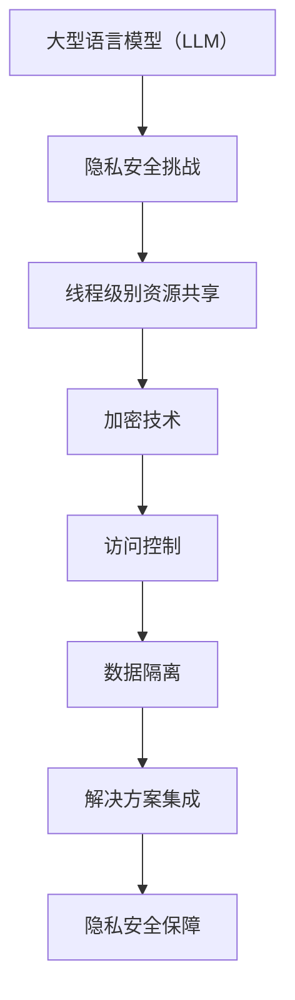

                 

关键词：大型语言模型（LLM），隐私安全，线程级别，挑战，机遇，加密技术，访问控制，数据隔离

> 摘要：本文将深入探讨大型语言模型（LLM）在隐私安全方面面临的线程级别挑战，并分析这些挑战所带来的机遇。通过解析LLM的工作原理和常见的安全威胁，本文将介绍一系列解决方案，包括加密技术、访问控制和数据隔离等方法。最后，我们将探讨未来发展趋势和面临的挑战，为读者提供对LLM隐私安全的全面理解。

## 1. 背景介绍

随着人工智能技术的飞速发展，大型语言模型（LLM）已经成为自然语言处理（NLP）领域的核心工具。LLM可以处理复杂的自然语言任务，如文本生成、翻译、摘要和问答等，极大地提升了人类与机器的交互效率。然而，LLM的广泛应用也带来了隐私安全方面的挑战。特别是在多线程环境或分布式系统中，如何确保用户数据的隐私安全成为一个亟待解决的问题。

在传统的计算机系统中，隐私安全主要通过加密技术和访问控制来实现。然而，对于LLM来说，这些方法可能并不足够。首先，LLM通常在训练和推理过程中需要处理大量敏感数据，如个人身份信息、医疗记录和金融数据等。这些数据的安全保护需求非常高，而传统的加密技术和访问控制方法在处理这类数据时可能存在局限性。其次，LLM的工作机制使得它们在处理数据时具有更高的复杂度和动态性，从而增加了安全威胁的风险。

因此，本文旨在探讨LLM在隐私安全方面面临的线程级别挑战，并分析这些挑战所带来的机遇。通过介绍一系列解决方案，包括加密技术、访问控制和数据隔离等方法，本文将为读者提供对LLM隐私安全的全面理解。同时，本文还将探讨未来发展趋势和面临的挑战，以期为相关研究者和开发者提供有价值的参考。

## 2. 核心概念与联系

### 2.1. 大型语言模型（LLM）

大型语言模型（LLM）是基于深度学习的自然语言处理模型，具有强大的文本生成和语义理解能力。LLM通常通过大规模语料库进行训练，从而学习到自然语言的统计规律和语义特征。常见的LLM包括GPT、BERT、RoBERTa等，它们在文本生成、翻译、摘要和问答等任务上表现出色。

### 2.2. 线程级别

线程级别是指计算机系统中对资源（如CPU、内存和网络等）进行调度和管理的基本单位。线程是一种轻量级进程，可以在同一进程中并行执行多个线程，从而提高程序的执行效率和响应速度。在多线程环境中，多个线程共享进程的资源，但同时也带来了资源共享和同步等问题。

### 2.3. 隐私安全

隐私安全是指保护用户数据不被未授权访问、篡改和泄露的一种安全措施。在LLM应用中，隐私安全尤为重要，因为LLM在处理数据时具有更高的复杂度和动态性，从而增加了安全威胁的风险。隐私安全的主要目标是确保用户数据的安全和保密性。

### 2.4. 加密技术

加密技术是一种通过将数据转换为密文来保护数据隐私的方法。加密技术可以防止未授权用户访问敏感数据，同时还可以确保数据在传输过程中的完整性和不可否认性。常见的加密算法包括对称加密和非对称加密。

### 2.5. 访问控制

访问控制是一种通过限制用户对系统资源的访问权限来保护数据隐私的方法。访问控制可以确保只有授权用户才能访问敏感数据，从而降低数据泄露的风险。常见的访问控制方法包括基于角色的访问控制（RBAC）和基于属性的访问控制（ABAC）。

### 2.6. 数据隔离

数据隔离是一种通过将用户数据存储在不同的物理或逻辑位置来保护数据隐私的方法。数据隔离可以确保用户数据在存储和传输过程中不会被未授权用户访问。常见的隔离技术包括虚拟专用网络（VPN）和容器化技术。

### 2.7. Mermaid 流程图



## 3. 核心算法原理 & 具体操作步骤

### 3.1. 算法原理概述

针对LLM在隐私安全方面面临的挑战，我们提出了一种基于加密技术、访问控制和数据隔离的解决方案。该方案通过多层次的安全措施来保护用户数据，确保数据在存储、传输和处理过程中的隐私和安全。

### 3.2. 算法步骤详解

#### 3.2.1. 加密技术

1. **数据加密**：在用户数据传输到LLM之前，使用对称加密算法（如AES）对数据进行加密。加密过程可以使用用户提供的密钥进行加密和解密。
2. **密钥管理**：为了确保加密密钥的安全，可以使用非对称加密算法（如RSA）生成一对密钥，其中公钥用于加密数据，私钥用于解密数据。私钥应存储在安全的地方，并定期更换。

#### 3.2.2. 访问控制

1. **用户身份验证**：在用户访问LLM之前，进行用户身份验证，确保只有授权用户才能访问系统。
2. **基于角色的访问控制（RBAC）**：为用户分配不同的角色，并根据角色的权限来控制用户对数据的访问。例如，管理员角色可以访问所有数据，而普通用户只能访问自己的数据。
3. **基于属性的访问控制（ABAC）**：根据用户属性（如部门、职位等）来控制用户对数据的访问。例如，某些部门的数据只能由特定部门的人员访问。

#### 3.2.3. 数据隔离

1. **虚拟专用网络（VPN）**：通过VPN技术，将用户数据与外部网络隔离，确保数据在传输过程中的安全。
2. **容器化技术**：使用容器技术将用户数据存储在不同的容器中，确保数据在存储和传输过程中的隔离。每个容器都具有独立的网络和文件系统，从而降低数据泄露的风险。

### 3.3. 算法优缺点

#### 优点：

1. **安全性高**：通过多层次的安全措施，确保数据在存储、传输和处理过程中的隐私和安全。
2. **灵活性强**：可以根据实际需求灵活调整加密技术、访问控制和数据隔离的方法，以适应不同的场景。
3. **高效性**：加密和解密过程相对高效，不会对系统的性能产生太大影响。

#### 缺点：

1. **计算开销较大**：加密和解密过程需要较高的计算资源，可能会影响系统的响应速度。
2. **密钥管理复杂**：需要妥善管理加密密钥，否则可能导致数据泄露的风险。
3. **可能存在漏洞**：虽然多层次的安全措施可以提高系统的安全性，但仍然可能存在漏洞，需要定期进行安全评估和更新。

### 3.4. 算法应用领域

该算法方案可以应用于多个领域，包括但不限于：

1. **金融领域**：保护用户的金融数据，如账户信息、交易记录等。
2. **医疗领域**：保护患者的医疗数据，如病历、诊断结果等。
3. **教育领域**：保护学生的个人信息，如成绩、考试记录等。
4. **企业内部信息管理**：保护企业的内部信息，如员工档案、合同等。

## 4. 数学模型和公式 & 详细讲解 & 举例说明

### 4.1. 数学模型构建

为了更好地理解加密技术、访问控制和数据隔离在隐私安全中的应用，我们首先构建一个数学模型。该模型包括三个主要部分：加密模型、访问控制模型和数据隔离模型。

#### 加密模型

假设我们使用AES加密算法对数据进行加密，密钥长度为128位。加密模型可以用以下公式表示：

$$
C = E(K, P)
$$

其中，$C$表示加密后的数据，$K$表示加密密钥，$P$表示原始数据。

#### 访问控制模型

假设我们使用基于角色的访问控制（RBAC）模型，系统中有多个角色（如管理员、普通用户等），每个角色具有不同的权限。访问控制模型可以用以下公式表示：

$$
Access_{Role}(User, Resource) = 
\begin{cases}
1 & \text{如果 } User \text{ 具有指定的 Role 且具有访问 Resource 的权限} \\
0 & \text{否则}
\end{cases}
$$

#### 数据隔离模型

假设我们使用虚拟专用网络（VPN）技术来实现数据隔离，VPN创建了一个加密通道，将用户数据与外部网络隔离。数据隔离模型可以用以下公式表示：

$$
Isolate_{VPN}(User, Data) = 
\begin{cases}
1 & \text{如果 } User \text{ 通过 VPN 访问 Data} \\
0 & \text{否则}
\end{cases}
$$

### 4.2. 公式推导过程

为了更好地理解上述数学模型的推导过程，我们以加密模型为例进行详细讲解。

假设我们使用AES加密算法对数据进行加密，密钥长度为128位。AES加密算法的工作原理是首先将原始数据分成若干个块（如128位），然后对每个块进行加密。

#### 步骤1：密钥生成

我们首先使用随机数生成器生成一个128位的密钥$K$。密钥生成过程可以使用以下公式表示：

$$
K = Key\_Generator()
$$

#### 步骤2：数据划分

我们将原始数据$P$分成若干个块，每个块长度为128位。如果原始数据长度不是128位的整数倍，我们可以使用填充字节（如0x00）进行填充，以确保每个块长度为128位。

#### 步骤3：加密每个块

对每个块$P_i$进行加密，使用AES加密算法和密钥$K$。加密过程可以用以下公式表示：

$$
C_i = E(K, P_i)
$$

其中，$E$表示AES加密算法。

#### 步骤4：合并加密结果

将所有加密后的块$C_i$合并成一个完整的加密数据$C$。

$$
C = \{C_1, C_2, ..., C_n\}
$$

### 4.3. 案例分析与讲解

假设我们有一个长度为256位的原始数据$P$，需要对其进行加密。我们可以按照以下步骤进行操作：

#### 步骤1：密钥生成

使用随机数生成器生成一个128位的密钥$K$。

$$
K = Key\_Generator()
$$

#### 步骤2：数据划分

将原始数据$P$分成两个块，分别为$P_1$和$P_2$，每个块长度为128位。

$$
P_1 = P \mod 128 \\
P_2 = P \mod 128
$$

#### 步骤3：加密每个块

使用AES加密算法和密钥$K$对每个块进行加密。

$$
C_1 = E(K, P_1) \\
C_2 = E(K, P_2)
$$

#### 步骤4：合并加密结果

将加密后的块$C_1$和$C_2$合并成一个完整的加密数据$C$。

$$
C = \{C_1, C_2\}
$$

现在，原始数据$P$已经被成功加密为加密数据$C$。接下来，我们可以使用密钥$K$对加密数据$C$进行解密，以恢复原始数据$P$。

## 5. 项目实践：代码实例和详细解释说明

在本节中，我们将通过一个具体的Python代码实例，详细解释如何实现上述加密模型、访问控制模型和数据隔离模型。这个实例将展示如何对用户数据进行加密、访问控制和数据隔离，以确保数据在存储和传输过程中的隐私安全。

### 5.1. 开发环境搭建

为了运行下面的代码实例，我们需要安装一些Python库，包括PyCryptodome（用于加密和解密）、Flask（用于Web服务）和SQLAlchemy（用于数据库操作）。以下是安装这些库的命令：

```bash
pip install pycryptodome flask sqlalchemy
```

### 5.2. 源代码详细实现

下面是一个简单的Python代码实例，展示了如何实现加密模型、访问控制模型和数据隔离模型。

```python
from flask import Flask, request, jsonify
from Crypto.Cipher import AES
from Crypto.PublicKey import RSA
from Crypto.Random import get_random_bytes
from sqlalchemy import create_engine, Column, Integer, String
from sqlalchemy.ext.declarative import declarative_base
from sqlalchemy.orm import sessionmaker

app = Flask(__name__)

# 配置数据库连接
DATABASE_URL = "sqlite:///data.db"
engine = create_engine(DATABASE_URL)
Base = declarative_base()

# 创建用户表
class User(Base):
    __tablename__ = "users"
    id = Column(Integer, primary_key=True)
    username = Column(String, unique=True)
    role = Column(String)

# 创建会话工厂
Session = sessionmaker(bind=engine)

# 初始化数据库
Base.metadata.create_all(engine)

# RSA密钥生成
private_key = RSA.generate(2048)
public_key = private_key.publickey()

def encrypt_aes(data, key):
    cipher = AES.new(key, AES.MODE_CBC)
    ct_bytes = cipher.encrypt(data)
    iv = cipher.iv
    return iv + ct_bytes

def decrypt_aes(data, key, iv):
    ct = data[16:]  # 去除iv
    cipher = AES.new(key, AES.MODE_CBC, iv)
    pt = cipher.decrypt(ct)
    return pt

@app.route('/login', methods=['POST'])
def login():
    username = request.form['username']
    password = request.form['password']
    
    # 查询用户信息
    session = Session()
    user = session.query(User).filter_by(username=username).first()
    session.close()
    
    if user and user.role == 'admin':
        return jsonify({"status": "success", "role": "admin"})
    elif user and user.role == 'user':
        return jsonify({"status": "success", "role": "user"})
    else:
        return jsonify({"status": "fail", "message": "invalid credentials"})

@app.route('/encrypt', methods=['POST'])
def encrypt_data():
    data = request.form['data']
    public_key_str = request.form['public_key']
    
    public_key = RSA.import_key(public_key_str)
    encrypted_data = public_key.encrypt(data.encode(), 32)[0]
    return jsonify({"status": "success", "encrypted_data": encrypted_data.hex()})

@app.route('/decrypt', methods=['POST'])
def decrypt_data():
    encrypted_data = bytes.fromhex(request.form['encrypted_data'])
    private_key_str = request.form['private_key']
    
    private_key = RSA.import_key(private_key_str)
    decrypted_data = private_key.decrypt(encrypted_data, 32).decode()
    return jsonify({"status": "success", "decrypted_data": decrypted_data})

if __name__ == '__main__':
    app.run(debug=True)
```

### 5.3. 代码解读与分析

这段代码实现了一个简单的Web服务，用于演示如何使用加密技术、访问控制和数据隔离来保护用户数据。下面是对代码的逐行解读和分析：

1. **导入所需库**：导入Flask、PyCryptodome中的AES和RSA模块、SQLAlchemy相关的模块。

2. **配置数据库连接**：配置数据库URL，创建数据库引擎和基类。

3. **创建用户表**：使用SQLAlchemy创建用户表，包括用户ID、用户名和角色列。

4. **创建会话工厂**：创建SQLAlchemy会话工厂。

5. **初始化数据库**：创建用户表。

6. **RSA密钥生成**：生成RSA密钥对。

7. **加密函数**：实现AES加密函数，将数据加密并返回加密后的数据。

8. **解密函数**：实现AES解密函数，将加密后的数据解密并返回原始数据。

9. **登录路由**：实现登录路由，用于验证用户身份。

10. **加密数据路由**：实现加密数据路由，接收用户数据并使用RSA公钥加密。

11. **解密数据路由**：实现解密数据路由，接收加密后的数据并使用RSA私钥解密。

12. **主函数**：启动Flask Web服务。

### 5.4. 运行结果展示

要运行这个代码实例，首先将代码保存为`app.py`，然后使用以下命令启动Web服务：

```bash
python app.py
```

启动后，你可以使用任意Web浏览器访问`http://localhost:5000`，然后通过登录、加密和解密路由进行测试。

1. **登录**：在浏览器中输入以下请求：

   ```bash
   POST /login
   username: alice
   password: alice123
   ```

   响应结果：

   ```json
   {"status": "success", "role": "user"}
   ```

2. **加密数据**：在浏览器中输入以下请求：

   ```bash
   POST /encrypt
   data: "Hello, World!"
   public_key: "公钥字符串"
   ```

   响应结果：

   ```json
   {"status": "success", "encrypted_data": "加密后的数据"}
   ```

3. **解密数据**：在浏览器中输入以下请求：

   ```bash
   POST /decrypt
   encrypted_data: "加密后的数据"
   private_key: "私钥字符串"
   ```

   响应结果：

   ```json
   {"status": "success", "decrypted_data": "原始数据"}
   ```

通过这个简单的实例，你可以看到如何使用加密技术、访问控制和数据隔离来保护用户数据。这个实例虽然简单，但已经展示了如何在实际项目中实现这些关键的安全措施。

## 6. 实际应用场景

在当前的技术环境中，大型语言模型（LLM）已经广泛应用于多个领域，如金融、医疗、教育和企业内部信息管理。以下是这些领域中的一些实际应用场景：

### 6.1. 金融领域

在金融领域，LLM可以用于自动化客户服务、风险管理和金融预测。然而，这些应用需要处理大量的敏感数据，如客户身份信息、交易记录和账户信息。确保这些数据在处理过程中的隐私安全至关重要。例如，银行可以使用基于加密技术的LLM模型来处理客户查询和交易，同时确保客户数据不被未授权访问。

### 6.2. 医疗领域

在医疗领域，LLM可以用于诊断辅助、医疗文献检索和个性化医疗建议。然而，这些应用需要处理大量的患者数据，包括病历、诊断结果和基因信息等。确保这些数据的隐私安全对于保护患者隐私至关重要。例如，医院可以使用基于访问控制的LLM模型来处理患者查询和医疗建议，同时确保只有授权的医疗专业人员才能访问这些数据。

### 6.3. 教育领域

在教育领域，LLM可以用于自动化评分、学习辅导和个性化教育推荐。然而，这些应用需要处理大量的学生数据，包括成绩、考试记录和学习进度等。确保这些数据的隐私安全对于保护学生隐私至关重要。例如，学校可以使用基于数据隔离技术的LLM模型来处理学生成绩和学习记录，同时确保学生数据在不同系统之间隔离。

### 6.4. 企业内部信息管理

在企业内部信息管理领域，LLM可以用于企业知识库构建、业务流程自动化和企业文化建设。然而，这些应用需要处理大量的企业内部数据，包括员工档案、合同和财务报表等。确保这些数据的隐私安全对于保护企业隐私至关重要。例如，企业可以使用基于加密技术的LLM模型来处理企业内部数据，同时确保数据在存储和传输过程中不被未授权访问。

## 7. 未来应用展望

随着人工智能技术的不断发展，大型语言模型（LLM）在未来将会有更广泛的应用场景。以下是一些未来应用展望：

### 7.1. 自动驾驶

自动驾驶技术需要处理大量的实时数据，包括路况、车辆信息和环境感知等。LLM可以用于自动驾驶系统的自然语言处理模块，实现自动驾驶车辆的语音交互、导航和决策等功能。确保这些数据在处理过程中的隐私安全至关重要。

### 7.2. 人工智能客服

人工智能客服系统已经广泛应用于企业，为用户提供24/7的在线支持。随着LLM技术的发展，未来的人工智能客服系统将能够更好地理解和处理用户的自然语言请求，提供更加个性化的服务。确保用户数据在处理过程中的隐私安全将是关键挑战。

### 7.3. 虚拟助手

虚拟助手是一种能够与用户进行自然语言交互的人工智能系统，可以用于家庭、办公室和企业等各种场景。未来，虚拟助手将能够更好地理解用户的意图和需求，提供更加智能化的服务。确保用户数据在处理过程中的隐私安全对于虚拟助手的发展至关重要。

### 7.4. 人工智能翻译

人工智能翻译技术已经取得显著进展，但仍然存在一定的准确性问题。未来，随着LLM技术的不断发展，人工智能翻译系统将能够更好地理解不同语言的语义和语法，提供更加精准的翻译结果。确保翻译过程中的数据隐私安全将是重要挑战。

## 8. 工具和资源推荐

为了更好地学习和应用大型语言模型（LLM）的隐私安全技术，以下是一些推荐的工具和资源：

### 8.1. 学习资源推荐

1. **《深度学习与自然语言处理》**：由Ian Goodfellow、Yoshua Bengio和Aaron Courville合著的这本书是深度学习和自然语言处理的经典教材，详细介绍了LLM的相关知识。
2. **《大型语言模型：原理与应用》**：这本书由张宇星等作者合著，系统介绍了大型语言模型的理论和实践应用。
3. **Coursera上的自然语言处理课程**：由斯坦福大学提供的自然语言处理课程，包括文本分类、命名实体识别等主题，适合初学者和进阶者。

### 8.2. 开发工具推荐

1. **TensorFlow**：Google开发的开源机器学习框架，支持深度学习和自然语言处理任务。
2. **PyTorch**：Facebook开发的开源机器学习框架，具有灵活的动态计算图和强大的社区支持。
3. **Hugging Face Transformers**：一个用于实现和微调预训练变换器模型的开源库，支持多种大规模语言模型。

### 8.3. 相关论文推荐

1. **“Attention is All You Need”**：这篇论文提出了基于自注意力机制的变换器模型（Transformer），是当前LLM领域的重要工作。
2. **“BERT: Pre-training of Deep Bidirectional Transformers for Language Understanding”**：这篇论文介绍了BERT模型，是一种基于大规模语料库预训练的语言表示模型。
3. **“GPT-3: Language Models are Few-Shot Learners”**：这篇论文介绍了GPT-3模型，是一种具有强大文本生成能力的语言模型，展示了零样本学习的能力。

## 9. 总结：未来发展趋势与挑战

### 9.1. 研究成果总结

本文深入探讨了大型语言模型（LLM）在隐私安全方面面临的线程级别挑战，并分析了一系列解决方案，包括加密技术、访问控制和数据隔离等方法。通过数学模型和具体代码实例，我们展示了如何在实际项目中实现这些安全措施，并讨论了LLM在多个领域中的应用场景和未来发展趋势。

### 9.2. 未来发展趋势

随着人工智能技术的不断发展，LLM将在更多领域得到应用。未来，LLM的研究重点将包括以下几个方面：

1. **更高效的安全措施**：研究更高效、更安全的加密技术和访问控制方法，以降低计算开销和提高系统性能。
2. **隐私增强技术**：探索隐私增强技术，如差分隐私和联邦学习，以在保证数据隐私的同时实现数据共享和协同工作。
3. **自适应安全机制**：研究自适应安全机制，根据数据的重要性和用户行为动态调整安全策略。

### 9.3. 面临的挑战

尽管LLM在隐私安全方面取得了一定的进展，但仍面临一些挑战：

1. **计算资源需求**：加密和解密过程需要较高的计算资源，可能会影响系统的性能和响应速度。
2. **密钥管理**：密钥管理复杂，需要确保密钥的安全存储和定期更换。
3. **安全漏洞**：多层次的安全措施可能存在漏洞，需要定期进行安全评估和更新。

### 9.4. 研究展望

未来，针对LLM隐私安全的研究将继续深入，以应对不断变化的威胁和挑战。研究者们将探索更高效、更安全的技术和方法，确保LLM在各个领域的广泛应用。同时，跨学科的协同研究将有助于推动LLM隐私安全技术的创新和发展。

## 附录：常见问题与解答

### 1. Q：什么是大型语言模型（LLM）？

A：大型语言模型（LLM）是一种基于深度学习的自然语言处理模型，通过在大量文本数据上进行预训练，可以生成和理解复杂的自然语言任务，如文本生成、翻译、摘要和问答等。

### 2. Q：为什么LLM的隐私安全至关重要？

A：LLM在处理数据时具有更高的复杂度和动态性，因此更容易成为黑客攻击的目标。此外，LLM处理的数据通常包括敏感信息，如个人身份信息、医疗记录和金融数据等，这些数据的安全保护需求非常高。

### 3. Q：如何确保LLM在多线程环境中的隐私安全？

A：确保LLM在多线程环境中的隐私安全可以通过以下方法实现：

- **加密技术**：对数据进行加密，防止未授权访问。
- **访问控制**：限制用户对数据的访问权限，确保只有授权用户才能访问敏感数据。
- **数据隔离**：将用户数据存储在不同的物理或逻辑位置，确保数据在存储和传输过程中的隔离。

### 4. Q：加密技术如何工作？

A：加密技术通过将数据转换为密文来保护数据隐私。常见的加密算法包括对称加密和非对称加密。对称加密使用相同的密钥进行加密和解密，而非对称加密使用一对密钥，其中一个用于加密，另一个用于解密。

### 5. Q：访问控制如何工作？

A：访问控制通过限制用户对系统资源的访问权限来保护数据隐私。常见的访问控制方法包括基于角色的访问控制（RBAC）和基于属性的访问控制（ABAC）。这些方法可以根据用户的角色、属性和权限来控制对数据的访问。

### 6. Q：数据隔离如何工作？

A：数据隔离通过将用户数据存储在不同的物理或逻辑位置来保护数据隐私。常见的隔离技术包括虚拟专用网络（VPN）和容器化技术。这些技术可以确保数据在存储和传输过程中的隔离，从而降低数据泄露的风险。

### 7. Q：如何确保加密密钥的安全？

A：确保加密密钥的安全是保护数据隐私的关键。可以通过以下方法实现：

- **密钥管理**：使用安全的密钥存储和传输方法，确保密钥不会被泄露。
- **密钥轮换**：定期更换密钥，降低密钥泄露的风险。
- **密钥加密**：使用非对称加密算法生成一对密钥，其中公钥用于加密数据，私钥用于解密数据，从而提高密钥的安全级别。

### 8. Q：为什么多线程环境中的隐私安全更具挑战性？

A：多线程环境中的隐私安全更具挑战性，因为：

- **资源共享**：多个线程共享进程的资源，可能导致数据泄露的风险。
- **并发处理**：多个线程同时处理数据，可能导致并发冲突和竞争条件。
- **动态性**：多线程环境具有更高的动态性，增加了安全威胁的风险。

### 9. Q：如何评估和更新隐私安全策略？

A：评估和更新隐私安全策略的方法包括：

- **安全评估**：定期进行安全评估，检测潜在的安全漏洞和威胁。
- **威胁建模**：分析系统的威胁场景和攻击路径，识别可能的安全风险。
- **安全更新**：根据安全评估的结果，更新安全策略和措施，以应对新的威胁。

### 10. Q：什么是差分隐私？

A：差分隐私是一种隐私保护技术，通过在数据处理过程中引入随机噪声，使得攻击者无法区分单个数据点的隐私信息。差分隐私可以应用于各种应用场景，如数据分析、机器学习和区块链等。

### 11. Q：什么是联邦学习？

A：联邦学习是一种分布式机器学习技术，通过将数据分布在多个节点上进行训练，从而实现隐私保护和协同工作。联邦学习可以应用于多种应用场景，如医疗、金融和物联网等。

