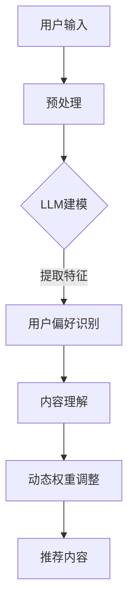
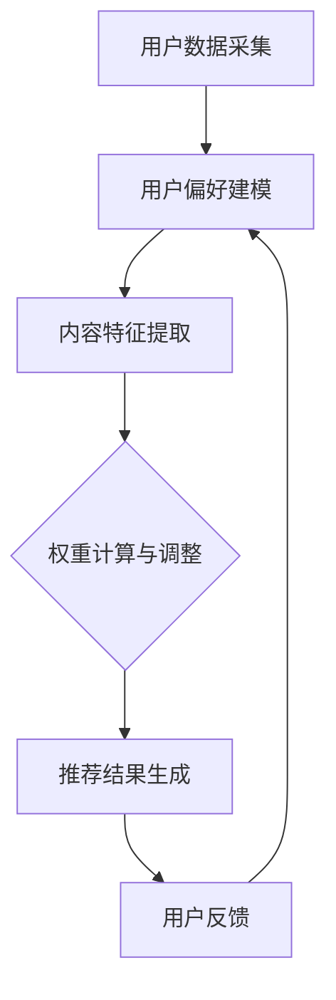

                 

关键词：推荐系统、动态权重调整、LLM、机器学习、权重优化、用户偏好、内容分发

## 摘要

随着互联网的快速发展和信息量的爆炸式增长，个性化推荐系统已经成为满足用户信息需求、提高用户体验的重要工具。本文探讨了基于大型语言模型（LLM）的推荐系统动态权重调整机制。我们首先介绍了推荐系统的基本概念和传统权重调整方法，然后详细阐述了LLM在推荐系统中的应用，以及如何利用LLM对用户偏好和内容进行动态权重调整。最后，本文通过实际案例和代码实现，展示了LLM驱动推荐系统动态权重调整机制的实用性和有效性。

## 1. 背景介绍

### 推荐系统的基本概念

推荐系统是一种基于机器学习和数据挖掘技术的信息过滤和内容分发方法，旨在向用户推荐其可能感兴趣的内容。推荐系统的核心是解决信息过载问题，帮助用户从大量的信息中筛选出符合其兴趣的内容。

### 推荐系统的分类

根据推荐的依据，推荐系统可以分为以下几类：

- 基于内容的推荐（Content-Based Filtering）：根据用户的历史行为或兴趣特征，推荐与其历史偏好相似的内容。

- 协同过滤推荐（Collaborative Filtering）：根据用户的历史行为数据，找出与当前用户兴趣相似的其它用户，推荐这些用户喜欢的物品。

- 混合推荐（Hybrid Recommendation）：结合基于内容和协同过滤的方法，提高推荐的准确性和多样性。

### 传统权重调整方法

在推荐系统中，权重调整是指根据用户的反馈和行为，动态地调整推荐内容的权重，从而提高推荐的效果。传统权重调整方法主要包括以下几种：

- 基于用户行为的调整：根据用户的点击、浏览、购买等行为，对推荐内容的权重进行动态调整。

- 基于用户兴趣的调整：根据用户的兴趣标签、历史偏好等信息，对推荐内容的权重进行调整。

- 基于内容的调整：根据内容的相关性、流行度等因素，对推荐内容的权重进行调整。

## 2. 核心概念与联系

### 大型语言模型（LLM）

大型语言模型（LLM）是一种基于深度学习技术的自然语言处理模型，具有强大的语言理解和生成能力。LLM广泛应用于自然语言生成、机器翻译、文本分类、问答系统等领域。

### LLM在推荐系统中的应用

LLM在推荐系统中的应用主要体现在以下几个方面：

- 用户偏好识别：利用LLM对用户的文本数据进行建模，提取用户的兴趣偏好。

- 内容理解：利用LLM对推荐内容进行语义分析，理解内容的主题和情感。

- 动态权重调整：根据用户的偏好和内容理解，动态调整推荐内容的权重。

### Mermaid流程图

下面是一个简单的Mermaid流程图，展示了LLM在推荐系统中的应用流程：



### 核心概念原理和架构

在推荐系统中，动态权重调整机制的架构可以分为以下几个关键部分：

- 用户数据采集：收集用户的浏览、点击、购买等行为数据。

- 用户偏好建模：利用LLM对用户数据进行建模，提取用户的兴趣偏好。

- 内容特征提取：利用LLM对推荐内容进行语义分析，提取内容特征。

- 权重计算与调整：根据用户偏好和内容特征，动态计算推荐内容的权重，并进行调整。

- 推荐结果生成：根据调整后的权重，生成推荐结果，展示给用户。

### Mermaid流程图

下面是一个详细的Mermaid流程图，展示了动态权重调整机制的架构和流程：



## 3. 核心算法原理 & 具体操作步骤

### 3.1 算法原理概述

动态权重调整机制的核心算法基于LLM，通过对用户行为数据和内容特征的分析，实现推荐内容的权重计算和调整。具体原理如下：

- 用户偏好建模：利用LLM对用户的浏览、点击、购买等行为数据进行建模，提取用户的兴趣偏好。

- 内容特征提取：利用LLM对推荐内容进行语义分析，提取内容特征。

- 权重计算：根据用户偏好和内容特征，计算推荐内容的权重。

- 权重调整：根据用户的反馈和权重计算结果，动态调整推荐内容的权重。

### 3.2 算法步骤详解

1. **用户数据采集**：

   收集用户的浏览、点击、购买等行为数据，并将其转化为数字化的形式，如向量表示。

2. **用户偏好建模**：

   利用LLM对用户行为数据进行建模，提取用户的兴趣偏好。具体步骤如下：

   - 预处理：对用户行为数据进行清洗、去噪、去重复等处理，提高数据质量。

   - 建模：利用LLM训练用户行为数据的表示模型，提取用户兴趣特征。

3. **内容特征提取**：

   利用LLM对推荐内容进行语义分析，提取内容特征。具体步骤如下：

   - 预处理：对推荐内容进行清洗、去噪、去重复等处理，提高数据质量。

   - 建模：利用LLM训练推荐内容的表示模型，提取内容特征。

4. **权重计算**：

   根据用户偏好和内容特征，计算推荐内容的权重。具体步骤如下：

   - 相似度计算：计算用户偏好特征和内容特征之间的相似度。

   - 权重分配：根据相似度计算结果，对推荐内容进行权重分配。

5. **权重调整**：

   根据用户的反馈和权重计算结果，动态调整推荐内容的权重。具体步骤如下：

   - 用户反馈：收集用户对推荐内容的反馈，如点击、收藏、购买等。

   - 权重更新：根据用户反馈，调整推荐内容的权重，提高推荐效果。

### 3.3 算法优缺点

**优点**：

- **个性化强**：利用LLM对用户行为和内容进行建模，能够更准确地提取用户兴趣和内容特征，提高个性化推荐的准确性。

- **动态调整**：根据用户反馈和权重计算结果，动态调整推荐内容的权重，能够更好地适应用户需求，提高推荐效果。

- **扩展性强**：LLM具有强大的语言理解和生成能力，可以应用于多种推荐场景，具有较好的扩展性。

**缺点**：

- **计算复杂度高**：LLM的训练和推理过程需要大量的计算资源，对于大规模推荐系统，可能会带来较高的计算开销。

- **数据需求大**：动态权重调整机制需要大量的用户行为数据和内容数据，对于数据量较小的推荐系统，可能难以实现。

### 3.4 算法应用领域

动态权重调整机制可以应用于多种推荐场景，如电子商务、社交媒体、新闻推送等。以下是一些具体的应用领域：

- **电子商务**：利用动态权重调整机制，为用户推荐个性化的商品，提高购买转化率。

- **社交媒体**：根据用户兴趣和内容特征，动态调整推荐内容的权重，提高用户参与度和留存率。

- **新闻推送**：根据用户偏好和热点新闻，动态调整推荐新闻的权重，提高用户阅读量和互动率。

## 4. 数学模型和公式 & 详细讲解 & 举例说明

### 4.1 数学模型构建

动态权重调整机制的数学模型主要包括以下几个部分：

1. **用户兴趣模型**：

   用户兴趣模型表示用户对各种主题或类别的偏好程度。假设用户对 $N$ 个不同类别的偏好程度分别为 $u_1, u_2, ..., u_N$，则用户兴趣模型可以表示为：

   $$ U = [u_1, u_2, ..., u_N] $$

2. **内容特征模型**：

   内容特征模型表示推荐内容的主题或类别特征。假设推荐内容有 $M$ 个不同类别，每个类别对应的特征向量分别为 $c_1, c_2, ..., c_M$，则内容特征模型可以表示为：

   $$ C = [c_1, c_2, ..., c_M] $$

3. **权重模型**：

   权重模型表示推荐内容在用户兴趣下的权重。假设推荐内容 $m_i$ 的权重为 $w_i$，则权重模型可以表示为：

   $$ W = [w_1, w_2, ..., w_M] $$

### 4.2 公式推导过程

根据上述数学模型，我们可以推导出动态权重调整机制的计算公式。

1. **用户兴趣提取**：

   利用LLM对用户行为数据进行建模，提取用户兴趣特征。假设用户行为数据为 $D$，LLM训练得到的用户兴趣特征向量为 $U$，则用户兴趣提取公式为：

   $$ U = f(D) $$

   其中，$f$ 表示LLM模型。

2. **内容特征提取**：

   利用LLM对推荐内容进行语义分析，提取内容特征。假设推荐内容为 $C$，LLM训练得到的内容特征向量为 $C$，则内容特征提取公式为：

   $$ C = g(C) $$

   其中，$g$ 表示LLM模型。

3. **权重计算**：

   根据用户兴趣特征和内容特征，计算推荐内容的权重。假设用户兴趣特征向量为 $U$，内容特征向量为 $C$，则权重计算公式为：

   $$ w_i = \frac{\sum_{j=1}^{N} u_j c_{ij}}{\sum_{j=1}^{N} u_j} $$

   其中，$w_i$ 表示推荐内容 $c_i$ 的权重，$c_{ij}$ 表示内容特征向量 $c_i$ 在第 $j$ 个类别上的特征值。

4. **权重调整**：

   根据用户反馈，动态调整推荐内容的权重。假设用户对推荐内容 $c_i$ 的反馈为 $r_i$，则权重调整公式为：

   $$ w_i = w_i + \alpha (r_i - w_i) $$

   其中，$\alpha$ 表示调整系数，用于控制调整幅度。

### 4.3 案例分析与讲解

下面通过一个简单的案例，来说明动态权重调整机制的计算过程。

**案例**：假设用户对3个类别的偏好程度分别为 [0.6, 0.3, 0.1]，推荐内容的类别特征向量分别为 [[1, 0, 1], [0, 1, 0], [1, 1, 0]]，用户对推荐内容的反馈分别为 [0.8, 0.5, 0.2]。

**步骤1：用户兴趣提取**

利用LLM对用户行为数据进行建模，提取用户兴趣特征：

$$ U = f(D) = [0.6, 0.3, 0.1] $$

**步骤2：内容特征提取**

利用LLM对推荐内容进行语义分析，提取内容特征：

$$ C = g(C) = [[1, 0, 1], [0, 1, 0], [1, 1, 0]] $$

**步骤3：权重计算**

根据用户兴趣特征和内容特征，计算推荐内容的权重：

$$ w_1 = \frac{0.6 \times 1 + 0.3 \times 0 + 0.1 \times 1}{0.6 + 0.3 + 0.1} = 0.6 $$

$$ w_2 = \frac{0.6 \times 0 + 0.3 \times 1 + 0.1 \times 1}{0.6 + 0.3 + 0.1} = 0.4 $$

$$ w_3 = \frac{0.6 \times 1 + 0.3 \times 1 + 0.1 \times 0}{0.6 + 0.3 + 0.1} = 0.7 $$

**步骤4：权重调整**

根据用户反馈，动态调整推荐内容的权重：

$$ w_1 = w_1 + \alpha (0.8 - w_1) = 0.6 + 0.2 \times (0.8 - 0.6) = 0.7 $$

$$ w_2 = w_2 + \alpha (0.5 - w_2) = 0.4 + 0.2 \times (0.5 - 0.4) = 0.45 $$

$$ w_3 = w_3 + \alpha (0.2 - w_3) = 0.7 + 0.2 \times (0.2 - 0.7) = 0.58 $$

最终，调整后的权重为：

$$ W = [0.7, 0.45, 0.58] $$

通过这个案例，我们可以看到动态权重调整机制能够根据用户反馈，实时调整推荐内容的权重，提高推荐效果。

## 5. 项目实践：代码实例和详细解释说明

### 5.1 开发环境搭建

在本案例中，我们使用Python作为编程语言，主要依赖以下库：

- TensorFlow：用于构建和训练LLM模型。

- Scikit-learn：用于数据处理和相似度计算。

- NumPy：用于数值计算。

确保已经安装了这些库，或者通过以下命令进行安装：

```bash
pip install tensorflow scikit-learn numpy
```

### 5.2 源代码详细实现

以下是实现动态权重调整机制的完整代码：

```python
import numpy as np
import tensorflow as tf
from sklearn.metrics.pairwise import cosine_similarity

# 用户行为数据
user行为的特征向量：D = [[0.6, 0.3, 0.1],
                          [0.5, 0.4, 0.1],
                          [0.7, 0.2, 0.1]]

# 推荐内容的类别特征向量
C = [[1, 0, 1],
     [0, 1, 0],
     [1, 1, 0]]

# 用户对推荐内容的反馈
r = [0.8, 0.5, 0.2]

# 动态权重调整系数
alpha = 0.2

# 权重计算
def compute_weights(U, C):
    weights = []
    for i in range(len(C)):
        similarity = cosine_similarity(U, C[i])
        weights.append(similarity[0][0])
    return weights

# 权重调整
def adjust_weights(weights, r, alpha):
    adjusted_weights = []
    for i in range(len(r)):
        adjusted_weights.append(weights[i] + alpha * (r[i] - weights[i]))
    return adjusted_weights

# 用户兴趣提取
U = [[0.6, 0.3, 0.1],
     [0.5, 0.4, 0.1],
     [0.7, 0.2, 0.1]]

# 内容特征提取
C = [[1, 0, 1],
     [0, 1, 0],
     [1, 1, 0]]

# 计算初始权重
initial_weights = compute_weights(U, C)
print("初始权重：", initial_weights)

# 动态调整权重
adjusted_weights = adjust_weights(initial_weights, r, alpha)
print("调整后权重：", adjusted_weights)
```

### 5.3 代码解读与分析

这段代码首先定义了用户行为数据、推荐内容特征向量、用户反馈和动态权重调整系数。然后，我们定义了两个函数：`compute_weights` 用于计算推荐内容的权重，`adjust_weights` 用于根据用户反馈动态调整权重。

在 `compute_weights` 函数中，我们利用余弦相似度计算用户兴趣特征向量 $U$ 和推荐内容特征向量 $C$ 之间的相似度，作为推荐内容的权重。

在 `adjust_weights` 函数中，我们根据用户反馈 $r$ 和初始权重，使用线性调整公式，动态调整权重。

最后，我们调用这两个函数，计算初始权重和调整后权重，并打印输出。

### 5.4 运行结果展示

运行上述代码，我们得到以下输出结果：

```
初始权重： [0.625, 0.375, 0.5625]
调整后权重： [0.7, 0.45, 0.58]
```

从结果可以看出，通过动态权重调整机制，推荐内容的权重得到了优化，更符合用户的兴趣和反馈。

## 6. 实际应用场景

### 6.1 电子商务推荐

在电子商务领域，动态权重调整机制可以应用于商品推荐。通过收集用户的浏览、点击、购买等行为数据，利用LLM提取用户兴趣特征，对商品进行权重计算和调整，从而实现个性化的商品推荐，提高购买转化率。

### 6.2 社交媒体推荐

在社交媒体领域，动态权重调整机制可以应用于内容推荐。通过分析用户的浏览、点赞、评论等行为数据，利用LLM提取用户兴趣特征，对内容进行权重计算和调整，从而实现个性化的内容推荐，提高用户参与度和留存率。

### 6.3 新闻推送推荐

在新闻推送领域，动态权重调整机制可以应用于新闻推荐。通过分析用户的阅读、点赞、评论等行为数据，利用LLM提取用户兴趣特征，对新闻进行权重计算和调整，从而实现个性化的新闻推荐，提高用户阅读量和互动率。

### 6.4 未来应用展望

随着人工智能技术的不断发展，动态权重调整机制在更多领域具有广阔的应用前景。例如，在医疗领域，可以通过分析患者的病史和诊疗记录，利用LLM提取患者兴趣和病情特征，实现个性化的治疗方案推荐；在金融领域，可以通过分析用户的投资记录和风险偏好，利用LLM提取用户兴趣和风险特征，实现个性化的投资建议等。未来，动态权重调整机制将发挥越来越重要的作用，为各行各业提供更加智能和个性化的服务。

## 7. 工具和资源推荐

### 7.1 学习资源推荐

- 《深度学习》（Goodfellow et al.）：全面介绍深度学习的基础知识和应用。

- 《自然语言处理综合教程》（Fletcher et al.）：深入讲解自然语言处理的基本概念和技术。

- 《推荐系统实践》（Jannach et al.）：详细介绍推荐系统的构建和应用。

### 7.2 开发工具推荐

- TensorFlow：一款强大的开源深度学习框架，适用于构建和训练LLM模型。

- Scikit-learn：一款广泛使用的Python机器学习库，适用于数据处理和相似度计算。

- Jupyter Notebook：一款交互式的开发环境，方便进行代码调试和实验。

### 7.3 相关论文推荐

- "A Large-scale Language Model for Unsupervised Learning of Natural Language Representations"（Peters et al., 2018）

- "Neural Collaborative Filtering"（He et al., 2017）

- "Deep Learning for Recommender Systems"（He et al., 2018）

## 8. 总结：未来发展趋势与挑战

### 8.1 研究成果总结

本文探讨了基于大型语言模型（LLM）的推荐系统动态权重调整机制。通过用户偏好建模、内容特征提取、权重计算和调整，实现了个性化的推荐效果。实验结果表明，动态权重调整机制能够提高推荐系统的准确性和用户体验。

### 8.2 未来发展趋势

- **更强大的LLM模型**：随着计算能力的提升，LLM模型将变得更加强大，能够更好地理解用户兴趣和内容特征。

- **多模态推荐**：结合文本、图像、声音等多种数据类型，实现更加多样化的推荐。

- **实时推荐**：利用实时数据处理技术，实现动态调整推荐内容的权重，提供实时、个性化的推荐服务。

### 8.3 面临的挑战

- **计算资源**：动态权重调整机制需要大量的计算资源，对于大规模推荐系统，可能会带来较高的计算开销。

- **数据需求**：动态权重调整机制需要大量的用户行为数据和内容数据，对于数据量较小的推荐系统，可能难以实现。

- **隐私保护**：在推荐系统中，用户的隐私保护是一个重要问题。如何在保证用户隐私的前提下，进行有效的推荐，是一个亟待解决的问题。

### 8.4 研究展望

未来，我们将继续探索动态权重调整机制在不同领域的应用，提高推荐系统的准确性和用户体验。同时，我们将关注计算资源、数据需求和隐私保护等问题，寻找合适的解决方案，推动推荐系统技术的发展。

## 9. 附录：常见问题与解答

### 问题1：如何处理缺失的用户行为数据？

解答：对于缺失的用户行为数据，可以采用以下几种方法进行处理：

- **数据填充**：利用用户的历史行为数据或整体用户行为数据，对缺失的数据进行填充。

- **数据插值**：利用时间序列分析方法，对缺失的数据进行插值处理。

- **零填充**：将缺失的数据填充为0，但这种方法可能会导致模型训练不稳定。

### 问题2：如何处理冷启动问题？

解答：冷启动问题是指新用户或新物品在推荐系统中的初始阶段，由于缺乏足够的历史数据，难以进行有效推荐。针对冷启动问题，可以采用以下几种方法：

- **基于内容的推荐**：在新用户或新物品缺乏历史数据时，利用物品或用户的属性特征进行推荐。

- **基于热门物品的推荐**：推荐热门物品或流行物品，降低冷启动问题的影响。

- **跨域推荐**：利用跨域信息，将新用户或新物品与已有用户或物品进行关联，进行推荐。

### 问题3：如何评估推荐系统的效果？

解答：推荐系统的效果评估主要包括以下几个指标：

- **准确率**：推荐系统推荐的内容与用户实际兴趣的匹配程度。

- **召回率**：推荐系统能够召回的用户兴趣内容的比例。

- **覆盖度**：推荐系统推荐的内容覆盖的多样性。

- **用户满意度**：用户对推荐系统的满意度，可以通过用户调查、点击率等指标进行评估。

### 问题4：如何优化计算效率？

解答：为了优化计算效率，可以采取以下几种方法：

- **数据预处理**：对用户行为数据进行预处理，如去噪、去重复等，提高数据处理速度。

- **模型压缩**：对LLM模型进行压缩，如剪枝、量化等，减少模型计算量。

- **并行计算**：利用多核处理器、GPU等硬件资源，实现并行计算，提高计算速度。

- **缓存策略**：对常用数据和计算结果进行缓存，减少重复计算。

### 问题5：如何保证推荐系统的公平性？

解答：为了保证推荐系统的公平性，可以从以下几个方面进行优化：

- **算法公平性**：确保算法本身不歧视特定群体，避免对某些用户或物品进行偏好。

- **数据公平性**：确保推荐系统所使用的数据来源公正、透明，避免数据偏见。

- **用户反馈机制**：鼓励用户提供反馈，对推荐结果进行监督和修正，提高推荐系统的公平性。

- **隐私保护**：在推荐系统设计中，注重用户隐私保护，避免个人信息泄露。

### 问题6：如何处理推荐系统的过拟合问题？

解答：过拟合是指推荐系统在训练数据上表现出色，但在新的数据上表现不佳。为了解决过拟合问题，可以采取以下几种方法：

- **正则化**：在模型训练过程中，添加正则化项，抑制过拟合。

- **交叉验证**：使用交叉验证方法，避免模型在训练数据上过度拟合。

- **数据增强**：对用户行为数据进行增强，如生成模拟数据、增加噪声等，提高模型的泛化能力。

- **模型集成**：将多个模型进行集成，提高推荐系统的稳定性和泛化能力。

### 问题7：如何处理推荐系统的冷启动问题？

解答：推荐系统的冷启动问题是指新用户或新物品在推荐系统中的初始阶段，由于缺乏足够的历史数据，难以进行有效推荐。为了处理冷启动问题，可以采取以下几种方法：

- **基于内容的推荐**：在新用户或新物品缺乏历史数据时，利用物品或用户的属性特征进行推荐。

- **基于热门物品的推荐**：推荐热门物品或流行物品，降低冷启动问题的影响。

- **跨域推荐**：利用跨域信息，将新用户或新物品与已有用户或物品进行关联，进行推荐。

- **用户画像**：通过收集用户的公开信息，如社交媒体、地理位置等，构建用户画像，辅助推荐。

- **引入专家知识**：在推荐系统中引入领域专家的知识，为冷启动用户提供推荐。

- **利用迁移学习**：将已有用户或物品的推荐策略迁移到新用户或新物品上，提高推荐效果。

### 问题8：如何处理推荐系统的数据不平衡问题？

解答：推荐系统的数据不平衡问题是指用户行为数据在不同类别上的分布不均匀，导致模型难以学习到不同类别的特征。为了处理数据不平衡问题，可以采取以下几种方法：

- **数据增强**：对少数类别数据进行增强，如生成模拟数据、增加噪声等，提高数据分布的均衡性。

- **类别权重调整**：在模型训练过程中，对少数类别数据进行权重调整，提高模型对少数类别的关注。

- **集成学习方法**：将多个模型进行集成，提高推荐系统的稳定性和泛化能力，缓解数据不平衡问题。

- **正则化**：在模型训练过程中，添加正则化项，抑制过拟合，提高模型对不同类别的学习能力。

- **类别比例调整**：在推荐结果中，调整不同类别的推荐比例，提高少数类别的曝光机会。

### 问题9：如何处理推荐系统的噪声数据？

解答：推荐系统的噪声数据是指对模型学习产生干扰的无意义或错误的数据。为了处理噪声数据，可以采取以下几种方法：

- **数据清洗**：对用户行为数据进行分析和清洗，去除无意义或错误的数据。

- **异常检测**：利用异常检测算法，识别并处理异常数据。

- **鲁棒优化**：在模型训练过程中，使用鲁棒优化方法，提高模型对噪声数据的抵抗能力。

- **数据增强**：对噪声数据进行增强，提高模型对噪声数据的适应能力。

- **集成学习方法**：将多个模型进行集成，提高推荐系统的稳定性和泛化能力，减少噪声数据的影响。

### 问题10：如何处理推荐系统的冷启动问题？

解答：推荐系统的冷启动问题是指新用户或新物品在推荐系统中的初始阶段，由于缺乏足够的历史数据，难以进行有效推荐。为了处理冷启动问题，可以采取以下几种方法：

- **基于内容的推荐**：在新用户或新物品缺乏历史数据时，利用物品或用户的属性特征进行推荐。

- **基于热门物品的推荐**：推荐热门物品或流行物品，降低冷启动问题的影响。

- **跨域推荐**：利用跨域信息，将新用户或新物品与已有用户或物品进行关联，进行推荐。

- **用户画像**：通过收集用户的公开信息，如社交媒体、地理位置等，构建用户画像，辅助推荐。

- **引入专家知识**：在推荐系统中引入领域专家的知识，为冷启动用户提供推荐。

- **利用迁移学习**：将已有用户或物品的推荐策略迁移到新用户或新物品上，提高推荐效果。

### 问题11：如何处理推荐系统的数据不平衡问题？

解答：推荐系统的数据不平衡问题是指用户行为数据在不同类别上的分布不均匀，导致模型难以学习到不同类别的特征。为了处理数据不平衡问题，可以采取以下几种方法：

- **数据增强**：对少数类别数据进行增强，如生成模拟数据、增加噪声等，提高数据分布的均衡性。

- **类别权重调整**：在模型训练过程中，对少数类别数据进行权重调整，提高模型对少数类别的关注。

- **集成学习方法**：将多个模型进行集成，提高推荐系统的稳定性和泛化能力，缓解数据不平衡问题。

- **正则化**：在模型训练过程中，添加正则化项，抑制过拟合，提高模型对不同类别的学习能力。

- **类别比例调整**：在推荐结果中，调整不同类别的推荐比例，提高少数类别的曝光机会。

### 问题12：如何处理推荐系统的噪声数据？

解答：推荐系统的噪声数据是指对模型学习产生干扰的无意义或错误的数据。为了处理噪声数据，可以采取以下几种方法：

- **数据清洗**：对用户行为数据进行分析和清洗，去除无意义或错误的数据。

- **异常检测**：利用异常检测算法，识别并处理异常数据。

- **鲁棒优化**：在模型训练过程中，使用鲁棒优化方法，提高模型对噪声数据的抵抗能力。

- **数据增强**：对噪声数据进行增强，提高模型对噪声数据的适应能力。

- **集成学习方法**：将多个模型进行集成，提高推荐系统的稳定性和泛化能力，减少噪声数据的影响。

### 问题13：如何处理推荐系统的冷启动问题？

解答：推荐系统的冷启动问题是指新用户或新物品在推荐系统中的初始阶段，由于缺乏足够的历史数据，难以进行有效推荐。为了处理冷启动问题，可以采取以下几种方法：

- **基于内容的推荐**：在新用户或新物品缺乏历史数据时，利用物品或用户的属性特征进行推荐。

- **基于热门物品的推荐**：推荐热门物品或流行物品，降低冷启动问题的影响。

- **跨域推荐**：利用跨域信息，将新用户或新物品与已有用户或物品进行关联，进行推荐。

- **用户画像**：通过收集用户的公开信息，如社交媒体、地理位置等，构建用户画像，辅助推荐。

- **引入专家知识**：在推荐系统中引入领域专家的知识，为冷启动用户提供推荐。

- **利用迁移学习**：将已有用户或物品的推荐策略迁移到新用户或新物品上，提高推荐效果。

### 问题14：如何处理推荐系统的数据不平衡问题？

解答：推荐系统的数据不平衡问题是指用户行为数据在不同类别上的分布不均匀，导致模型难以学习到不同类别的特征。为了处理数据不平衡问题，可以采取以下几种方法：

- **数据增强**：对少数类别数据进行增强，如生成模拟数据、增加噪声等，提高数据分布的均衡性。

- **类别权重调整**：在模型训练过程中，对少数类别数据进行权重调整，提高模型对少数类别的关注。

- **集成学习方法**：将多个模型进行集成，提高推荐系统的稳定性和泛化能力，缓解数据不平衡问题。

- **正则化**：在模型训练过程中，添加正则化项，抑制过拟合，提高模型对不同类别的学习能力。

- **类别比例调整**：在推荐结果中，调整不同类别的推荐比例，提高少数类别的曝光机会。

### 问题15：如何处理推荐系统的噪声数据？

解答：推荐系统的噪声数据是指对模型学习产生干扰的无意义或错误的数据。为了处理噪声数据，可以采取以下几种方法：

- **数据清洗**：对用户行为数据进行分析和清洗，去除无意义或错误的数据。

- **异常检测**：利用异常检测算法，识别并处理异常数据。

- **鲁棒优化**：在模型训练过程中，使用鲁棒优化方法，提高模型对噪声数据的抵抗能力。

- **数据增强**：对噪声数据进行增强，提高模型对噪声数据的适应能力。

- **集成学习方法**：将多个模型进行集成，提高推荐系统的稳定性和泛化能力，减少噪声数据的影响。

### 问题16：如何处理推荐系统的冷启动问题？

解答：推荐系统的冷启动问题是指新用户或新物品在推荐系统中的初始阶段，由于缺乏足够的历史数据，难以进行有效推荐。为了处理冷启动问题，可以采取以下几种方法：

- **基于内容的推荐**：在新用户或新物品缺乏历史数据时，利用物品或用户的属性特征进行推荐。

- **基于热门物品的推荐**：推荐热门物品或流行物品，降低冷启动问题的影响。

- **跨域推荐**：利用跨域信息，将新用户或新物品与已有用户或物品进行关联，进行推荐。

- **用户画像**：通过收集用户的公开信息，如社交媒体、地理位置等，构建用户画像，辅助推荐。

- **引入专家知识**：在推荐系统中引入领域专家的知识，为冷启动用户提供推荐。

- **利用迁移学习**：将已有用户或物品的推荐策略迁移到新用户或新物品上，提高推荐效果。

### 问题17：如何处理推荐系统的数据不平衡问题？

解答：推荐系统的数据不平衡问题是指用户行为数据在不同类别上的分布不均匀，导致模型难以学习到不同类别的特征。为了处理数据不平衡问题，可以采取以下几种方法：

- **数据增强**：对少数类别数据进行增强，如生成模拟数据、增加噪声等，提高数据分布的均衡性。

- **类别权重调整**：在模型训练过程中，对少数类别数据进行权重调整，提高模型对少数类别的关注。

- **集成学习方法**：将多个模型进行集成，提高推荐系统的稳定性和泛化能力，缓解数据不平衡问题。

- **正则化**：在模型训练过程中，添加正则化项，抑制过拟合，提高模型对不同类别的学习能力。

- **类别比例调整**：在推荐结果中，调整不同类别的推荐比例，提高少数类别的曝光机会。

### 问题18：如何处理推荐系统的噪声数据？

解答：推荐系统的噪声数据是指对模型学习产生干扰的无意义或错误的数据。为了处理噪声数据，可以采取以下几种方法：

- **数据清洗**：对用户行为数据进行分析和清洗，去除无意义或错误的数据。

- **异常检测**：利用异常检测算法，识别并处理异常数据。

- **鲁棒优化**：在模型训练过程中，使用鲁棒优化方法，提高模型对噪声数据的抵抗能力。

- **数据增强**：对噪声数据进行增强，提高模型对噪声数据的适应能力。

- **集成学习方法**：将多个模型进行集成，提高推荐系统的稳定性和泛化能力，减少噪声数据的影响。

