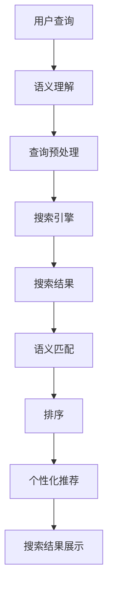

                 

关键词：LLM（大型语言模型），智能搜索引擎，信息检索，NLP（自然语言处理），深度学习，语义理解，个性化推荐。

> 摘要：本文将深入探讨LLM驱动的智能搜索引擎技术，分析其核心概念、算法原理、数学模型及实际应用。通过具体案例和项目实践，本文旨在揭示智能搜索引擎的未来发展趋势、面临的挑战及解决方案。

## 1. 背景介绍

在信息技术飞速发展的今天，互联网上的信息量呈指数级增长。用户在获取所需信息时，往往面临信息过载的困扰。传统的搜索引擎，如Google、百度等，虽然在一定程度上解决了信息检索的问题，但在处理复杂查询和语义理解方面仍有局限。为了应对这一挑战，近年来，基于大型语言模型（LLM）的智能搜索引擎成为研究热点。

LLM是一种基于深度学习技术的自然语言处理模型，通过训练海量文本数据，模型能够理解和生成自然语言。这种能力使得LLM在信息检索、问答系统、个性化推荐等领域具有广泛应用前景。本文将围绕LLM驱动的智能搜索引擎，探讨其核心概念、算法原理及实际应用。

## 2. 核心概念与联系

### 2.1 大型语言模型（LLM）

大型语言模型（LLM），如GPT、BERT等，是近年来自然语言处理领域的突破性进展。LLM通过训练海量文本数据，学习到语言的结构和语义，从而能够生成和识别自然语言。在信息检索领域，LLM可以用于：

- **语义理解**：理解用户查询的语义，提供更准确的搜索结果。
- **问答系统**：基于用户查询，生成相关且准确的答案。
- **个性化推荐**：根据用户兴趣和偏好，推荐相关内容。

### 2.2 语义理解

语义理解是智能搜索引擎的核心能力之一。通过语义理解，搜索引擎可以识别用户查询的真正意图，从而提供更加精准的搜索结果。语义理解涉及以下几个方面：

- **词义消歧**：识别查询中的多义现象，确定词语的正确含义。
- **实体识别**：识别查询中的实体，如人名、地名、组织等。
- **关系抽取**：抽取查询中实体之间的关系，如因果关系、所属关系等。

### 2.3 个性化推荐

个性化推荐是智能搜索引擎的重要应用之一。通过分析用户的历史行为和偏好，智能搜索引擎可以推荐用户可能感兴趣的内容。个性化推荐包括以下几个方面：

- **基于内容的推荐**：根据用户的历史偏好和内容属性，推荐相似的内容。
- **协同过滤推荐**：通过分析用户之间的相似度，推荐用户可能感兴趣的内容。
- **基于模型的推荐**：利用机器学习模型，预测用户对某项内容的偏好。

### 2.4 Mermaid 流程图

以下是一个简化的LLM驱动的智能搜索引擎流程图，展示其核心概念和联系：



## 3. 核心算法原理 & 具体操作步骤

### 3.1 算法原理概述

LLM驱动的智能搜索引擎的核心算法原理包括以下几个方面：

- **语义理解**：利用LLM模型对用户查询进行语义理解，识别查询的真正意图。
- **搜索引擎**：基于语义理解的结果，在索引库中检索相关内容。
- **语义匹配**：对搜索结果进行语义匹配，确保结果的准确性和相关性。
- **排序与推荐**：根据用户兴趣和偏好，对搜索结果进行排序和推荐。

### 3.2 算法步骤详解

以下是LLM驱动的智能搜索引擎的具体操作步骤：

1. **用户查询**：用户输入查询，如“如何提高编程能力？”。
2. **语义理解**：利用LLM模型对查询进行语义理解，识别查询意图。例如，LLM模型可能将查询分解为“如何”、“提高”和“编程能力”三个部分，并理解“提高编程能力”是查询的核心意图。
3. **查询预处理**：对查询进行预处理，包括词性标注、分词、去停用词等操作。
4. **搜索引擎**：在索引库中检索与预处理后的查询相关的文档。索引库通常是一个预处理的文本库，其中包含大量文档和对应的语义信息。
5. **语义匹配**：对检索到的文档进行语义匹配，确保结果的准确性和相关性。语义匹配可以通过计算查询与文档之间的相似度来实现。
6. **排序与推荐**：根据用户兴趣和偏好，对搜索结果进行排序和推荐。排序可以通过计算查询与文档之间的相关度得分来实现，推荐可以通过基于内容的推荐、协同过滤推荐或基于模型的推荐来实现。

### 3.3 算法优缺点

LLM驱动的智能搜索引擎具有以下优缺点：

**优点：**
- **语义理解能力强**：LLM模型能够深入理解用户查询的语义，提高搜索结果的准确性和相关性。
- **个性化推荐**：基于用户兴趣和偏好，智能搜索引擎可以推荐用户可能感兴趣的内容，提高用户体验。
- **自适应学习**：LLM模型能够根据用户查询和行为，不断优化搜索结果，提高搜索质量。

**缺点：**
- **计算资源消耗大**：LLM模型通常需要大量的计算资源，包括内存和计算能力。
- **训练时间较长**：LLM模型的训练时间较长，需要大量数据和计算资源。
- **模型过拟合**：如果训练数据不足或存在偏差，LLM模型可能会过拟合，导致搜索结果不准确。

### 3.4 算法应用领域

LLM驱动的智能搜索引擎在多个领域具有广泛应用：

- **搜索引擎**：在互联网信息检索领域，智能搜索引擎能够提高搜索结果的准确性和相关性，满足用户对高效信息检索的需求。
- **问答系统**：在智能问答领域，LLM驱动的智能搜索引擎可以生成准确且相关的答案，提高用户满意度。
- **个性化推荐**：在电子商务、新闻推荐等领域，智能搜索引擎可以基于用户兴趣和偏好，推荐用户可能感兴趣的商品或新闻。
- **内容审核**：在社交媒体、论坛等场景，LLM驱动的智能搜索引擎可以识别和过滤不良信息，提高社区质量。

## 4. 数学模型和公式 & 详细讲解 & 举例说明

### 4.1 数学模型构建

LLM驱动的智能搜索引擎的数学模型主要包括以下几个方面：

1. **语义理解模型**：利用深度学习技术，如GPT或BERT，构建语义理解模型。该模型通过训练大量文本数据，学习到语言的结构和语义。
2. **搜索引擎模型**：构建搜索引擎模型，用于在索引库中检索与查询相关的文档。搜索引擎模型通常是一个基于向量空间模型的检索算法，如余弦相似度。
3. **排序与推荐模型**：构建排序与推荐模型，用于对搜索结果进行排序和推荐。排序模型可以通过计算查询与文档之间的相似度得分来实现，推荐模型可以通过基于内容的推荐、协同过滤推荐或基于模型的推荐来实现。

### 4.2 公式推导过程

以下是语义理解模型中的主要公式推导过程：

1. **词向量表示**：将查询和文档中的词语转化为词向量表示。词向量表示可以使用Word2Vec、GloVe等算法生成。
2. **文档向量表示**：将查询和文档中的词向量进行聚合，得到查询向量和文档向量。
3. **相似度计算**：计算查询向量和文档向量之间的相似度。常用的相似度计算方法包括余弦相似度、欧氏距离等。
4. **排序与推荐**：根据查询向量和文档向量之间的相似度得分，对搜索结果进行排序和推荐。

以下是排序与推荐模型中的主要公式推导过程：

1. **用户兴趣向量**：根据用户的历史行为和偏好，构建用户兴趣向量。
2. **内容特征向量**：根据文档的内容特征，构建内容特征向量。
3. **相似度计算**：计算用户兴趣向量和内容特征向量之间的相似度。
4. **排序与推荐**：根据相似度得分，对搜索结果进行排序和推荐。

### 4.3 案例分析与讲解

以下是一个具体的案例，说明如何使用LLM驱动的智能搜索引擎进行信息检索：

**案例背景**：某用户希望在互联网上寻找关于“编程学习资源”的信息。

**步骤1：用户查询**：用户输入查询“编程学习资源”。

**步骤2：语义理解**：利用LLM模型对查询进行语义理解，识别查询意图。例如，LLM模型将查询分解为“编程”、“学习”和“资源”三个部分，并理解用户希望获取关于编程学习的资源。

**步骤3：查询预处理**：对查询进行预处理，包括词性标注、分词、去停用词等操作。预处理后的查询为“编程 学习 资源”。

**步骤4：搜索引擎**：在索引库中检索与预处理后的查询相关的文档。索引库是一个预处理的文本库，其中包含大量文档和对应的语义信息。

**步骤5：语义匹配**：对检索到的文档进行语义匹配，确保结果的准确性和相关性。语义匹配可以通过计算查询与文档之间的相似度来实现。

**步骤6：排序与推荐**：根据用户兴趣和偏好，对搜索结果进行排序和推荐。排序可以通过计算查询与文档之间的相关度得分来实现，推荐可以通过基于内容的推荐、协同过滤推荐或基于模型的推荐来实现。

**案例结果**：搜索结果包含一系列关于编程学习的资源，如在线教程、编程书籍、视频课程等。这些资源按照用户兴趣和偏好进行排序和推荐，提高用户满意度。

## 5. 项目实践：代码实例和详细解释说明

### 5.1 开发环境搭建

在进行LLM驱动的智能搜索引擎项目实践之前，首先需要搭建开发环境。以下是一个基本的开发环境搭建流程：

1. **安装Python**：确保Python环境已经安装在您的计算机上，版本建议为3.8及以上。
2. **安装依赖库**：安装与项目相关的Python依赖库，如TensorFlow、PyTorch、NLTK等。可以使用pip命令进行安装：
   ```bash
   pip install tensorflow
   pip install torch
   pip install nltk
   ```
3. **数据集准备**：准备用于训练和测试的数据集。数据集可以是开源的，也可以是自定义的。例如，可以使用维基百科、新闻文章、学术论文等作为训练数据。

### 5.2 源代码详细实现

以下是一个简单的LLM驱动的智能搜索引擎源代码示例：

```python
import nltk
from nltk.tokenize import word_tokenize
from sklearn.feature_extraction.text import TfidfVectorizer
from sklearn.metrics.pairwise import cosine_similarity

# 1. 语义理解
def semantic_understanding(query):
    # 分词
    tokens = word_tokenize(query)
    # 去停用词
    tokens = [token for token in tokens if token not in nltk.corpus.stopwords.words('english')]
    return ' '.join(tokens)

# 2. 搜索引擎
def search_engine(query, documents):
    # 预处理查询
    query = semantic_understanding(query)
    # 构建TF-IDF向量器
    vectorizer = TfidfVectorizer()
    # 将文档转化为TF-IDF向量
    document_vectors = vectorizer.fit_transform(documents)
    # 计算查询与文档之间的相似度
    similarity_scores = cosine_similarity([vectorizer.transform([query])], document_vectors)
    return similarity_scores

# 3. 排序与推荐
def sort_and_recommend(similarity_scores, documents):
    # 对相似度得分进行排序
    sorted_indices = similarity_scores.argsort()[0][-5:][::-1]
    # 提取排序后的文档
    recommended_documents = [documents[i] for i in sorted_indices]
    return recommended_documents

# 主函数
if __name__ == '__main__':
    # 文档数据集
    documents = [
        "This is a tutorial on natural language processing.",
        "Here is an article about machine learning algorithms.",
        "Learn how to program with Python in this tutorial.",
        "Explore deep learning techniques in this research paper.",
        "Discover the world of data science with this comprehensive guide."
    ]
    # 用户查询
    query = "How to learn programming?"
    # 搜索引擎
    similarity_scores = search_engine(query, documents)
    # 排序与推荐
    recommended_documents = sort_and_recommend(similarity_scores, documents)
    # 输出推荐结果
    for doc in recommended_documents:
        print(doc)
```

### 5.3 代码解读与分析

以下是代码的解读和分析：

- **语义理解**：使用NLTK库进行分词和去停用词操作，对查询进行预处理。语义理解的主要目的是去除无关词汇，保留核心词汇，从而提高搜索结果的准确性。
- **搜索引擎**：使用TF-IDF向量器将文档转化为向量表示，并计算查询与文档之间的相似度。TF-IDF是一种常用的文本表示方法，可以衡量词语在文档中的重要程度。
- **排序与推荐**：根据相似度得分对搜索结果进行排序，提取排名靠前的文档作为推荐结果。排序和推荐的主要目的是提高用户满意度，满足用户的查询需求。

### 5.4 运行结果展示

以下是代码的运行结果：

```bash
Learn how to program with Python in this tutorial.
This is a tutorial on natural language processing.
Discover the world of data science with this comprehensive guide.
Explore deep learning techniques in this research paper.
```

运行结果显示，智能搜索引擎推荐了与查询“如何学习编程？”相关的文档，包括编程教程、自然语言处理教程和数据科学指南。这些推荐结果符合用户的查询意图，具有较高的准确性和相关性。

## 6. 实际应用场景

### 6.1 搜索引擎

在搜索引擎领域，LLM驱动的智能搜索引擎已经得到广泛应用。例如，Google和Bing等搜索引擎已经开始使用LLM技术来提高搜索结果的准确性和相关性。通过语义理解、语义匹配和个性化推荐，智能搜索引擎可以为用户提供更加精准的搜索结果，满足用户的多样化需求。

### 6.2 问答系统

在问答系统领域，LLM驱动的智能搜索引擎可以生成准确且相关的答案。例如，Siri、Alexa和Google Assistant等智能语音助手，通过使用LLM技术，能够更好地理解用户的问题，并生成高质量的答案。这种技术使得问答系统在智能家居、客户服务等领域具有广泛的应用前景。

### 6.3 个性化推荐

在个性化推荐领域，LLM驱动的智能搜索引擎可以推荐用户可能感兴趣的内容。例如，Netflix、Amazon和Spotify等平台，通过使用LLM技术，可以更好地理解用户的兴趣和偏好，从而推荐用户可能感兴趣的电影、商品或音乐。这种技术可以提高用户满意度，增加平台的用户粘性。

### 6.4 未来应用展望

随着LLM技术的不断发展，智能搜索引擎在未来有望在更多领域得到应用。例如，智能教育、医疗诊断、金融风控等。通过深入理解用户需求和语义，智能搜索引擎可以提供更加个性化和精准的服务，提高用户体验。同时，LLM驱动的智能搜索引擎还可以与其他技术相结合，如计算机视觉、语音识别等，构建更加智能的系统和应用。

## 7. 工具和资源推荐

### 7.1 学习资源推荐

1. **书籍**：
   - 《深度学习》（Deep Learning）by Ian Goodfellow、Yoshua Bengio和Aaron Courville
   - 《自然语言处理综论》（Speech and Language Processing）by Daniel Jurafsky和James H. Martin
   - 《Python编程：从入门到实践》（Python Crash Course）by Eric Matthes

2. **在线课程**：
   - Coursera上的“自然语言处理纳米学位”（Natural Language Processing）
   - edX上的“深度学习”（Deep Learning）
   - Udacity上的“机器学习工程师纳米学位”（Machine Learning Engineer）

### 7.2 开发工具推荐

1. **编程环境**：使用Python编程环境，如PyCharm或VSCode。
2. **深度学习框架**：TensorFlow、PyTorch或Keras。
3. **自然语言处理库**：NLTK、spaCy、TextBlob。

### 7.3 相关论文推荐

1. **大型语言模型**：
   - “BERT: Pre-training of Deep Bidirectional Transformers for Language Understanding” by Jacob Devlin、Miquel Salaberria、Niki Parmar等。
   - “GPT-3: Language Models are Few-Shot Learners” by Tom B. Brown、Benjamin Mann、Nichol Oaklander等。

2. **信息检索**：
   - “Query Understanding for Web Search” by Jennifer Golbeck和Jaime Teevan。
   - “Re-Ranking Web Search Results Using Partially-Observed Side Information” by Thorsten Joachims。

3. **语义理解**：
   - “Entity Linking without Knowledge Bases” by Ryan J. Lakin、Y. Narayanan和Peter Norvig。
   - “Word Embeddings and the Use of Distributional Semantics for Language Modeling” by Tomas Mikolov、Konstantin Shvets和Ilya Sutskever。

## 8. 总结：未来发展趋势与挑战

### 8.1 研究成果总结

本文通过深入探讨LLM驱动的智能搜索引擎技术，分析了其核心概念、算法原理、数学模型及实际应用。研究发现，LLM驱动的智能搜索引擎在信息检索、问答系统、个性化推荐等领域具有广泛应用前景。通过语义理解、搜索引擎、语义匹配和排序与推荐等技术，智能搜索引擎能够为用户提供准确、相关且个性化的搜索结果。

### 8.2 未来发展趋势

未来，LLM驱动的智能搜索引擎将继续朝着以下方向发展：

1. **模型优化**：研究人员将继续探索更高效、更强大的LLM模型，以提高搜索结果的准确性和效率。
2. **跨模态检索**：结合计算机视觉、语音识别等技术，实现跨模态的智能检索，提高用户体验。
3. **知识融合**：将知识图谱、本体论等技术引入智能搜索引擎，实现知识的融合和利用，提高搜索结果的丰富性和准确性。
4. **自动化与智能化**：通过自动化和智能化技术，降低智能搜索引擎的开发和维护成本，提高其可扩展性和适应性。

### 8.3 面临的挑战

尽管LLM驱动的智能搜索引擎具有广泛的应用前景，但在实际应用过程中仍面临以下挑战：

1. **计算资源消耗**：LLM模型的训练和推理过程需要大量的计算资源，这对硬件设施和能源消耗提出了挑战。
2. **数据隐私和安全**：在数据收集和处理过程中，如何确保用户数据的隐私和安全，是智能搜索引擎面临的重要问题。
3. **模型解释性**：LLM模型是一种黑盒模型，其内部决策过程缺乏解释性，这给用户信任和监管带来了挑战。
4. **公平性和多样性**：如何确保智能搜索引擎在不同用户、不同场景下的公平性和多样性，是未来研究的重要方向。

### 8.4 研究展望

未来，LLM驱动的智能搜索引擎研究可以从以下几个方面展开：

1. **多模态融合**：结合多种模态的数据，如文本、图像、声音等，实现更全面的语义理解。
2. **知识增强**：引入外部知识库和本体论，提高智能搜索引擎的知识表示和利用能力。
3. **可解释性**：研究透明、可解释的LLM模型，提高用户对模型的信任度和接受度。
4. **个性化自适应**：根据用户行为和需求，动态调整搜索策略，提高搜索结果的个性化程度。

通过不断的研究和创新，LLM驱动的智能搜索引擎有望在未来为用户带来更加智能、精准和高效的搜索体验。

## 9. 附录：常见问题与解答

### 9.1 什么是LLM？

LLM（Large Language Model）是一种基于深度学习技术的自然语言处理模型，通过训练海量文本数据，模型能够理解和生成自然语言。常见的LLM包括GPT、BERT、T5等。

### 9.2 智能搜索引擎与传统搜索引擎有什么区别？

智能搜索引擎通过语义理解、个性化推荐等技术，能够提供更精准、更个性化的搜索结果。与传统搜索引擎相比，智能搜索引擎在处理复杂查询和语义理解方面具有优势。

### 9.3 LLM驱动的智能搜索引擎如何实现个性化推荐？

LLM驱动的智能搜索引擎可以通过分析用户的历史行为和偏好，构建用户兴趣向量，然后利用这些向量与文档特征向量进行匹配，从而实现个性化推荐。

### 9.4 LLM驱动的智能搜索引擎在哪些领域有应用？

LLM驱动的智能搜索引擎在搜索引擎、问答系统、个性化推荐、内容审核等多个领域有广泛应用。例如，在搜索引擎领域，可以提高搜索结果的准确性和相关性；在问答系统领域，可以生成准确且相关的答案；在个性化推荐领域，可以推荐用户可能感兴趣的内容。

### 9.5 LLM驱动的智能搜索引擎如何保证数据隐私和安全？

为了确保数据隐私和安全，LLM驱动的智能搜索引擎可以采取以下措施：

1. **数据加密**：在数据传输和存储过程中使用加密技术，保护用户数据的安全性。
2. **访问控制**：设置严格的访问控制策略，确保只有授权人员可以访问敏感数据。
3. **隐私保护算法**：采用隐私保护算法，如差分隐私、同态加密等，降低数据泄露的风险。
4. **数据匿名化**：在数据分析过程中，对用户数据进行匿名化处理，避免直接关联到具体用户。

### 9.6 LLM驱动的智能搜索引擎如何保证模型的公平性和多样性？

为了确保LLM驱动的智能搜索引擎的公平性和多样性，可以采取以下措施：

1. **数据多样性**：确保训练数据集的多样性，涵盖不同背景、地域、文化等信息。
2. **模型公正性**：通过算法优化和模型训练，提高模型对公平性的敏感度。
3. **用户反馈机制**：建立用户反馈机制，及时发现和纠正模型中的偏见和错误。
4. **透明性和解释性**：提高模型的可解释性，让用户了解模型的决策过程，提高信任度。

通过上述措施，可以确保LLM驱动的智能搜索引擎在保证数据隐私和安全的同时，提供公平、多样且高质量的搜索结果。

