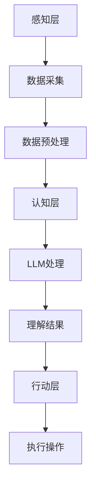

                 

关键词：自然语言处理，语言模型，智能生态，应用开发，新范式

> 摘要：本文旨在探讨基于大型语言模型（LLM）驱动的智能生态系统的构建与应用开发新范式。通过对LLM的原理、算法和应用场景的深入分析，本文揭示了LLM在推动智能生态系统发展中的关键作用，并提出了相应的开发策略和实践方法。

## 1. 背景介绍

在过去的几十年中，计算机科学和人工智能领域经历了飞速的发展。从早期的规则系统到现代的深度学习模型，技术的进步不断推动着智能系统的演进。特别是自然语言处理（NLP）领域的突破，使得机器能够理解、生成和响应自然语言，这为智能生态系统的构建提供了强大的基础。

近年来，大型语言模型（LLM）如GPT、BERT等成为研究的热点。这些模型具有千亿级别的参数量，能够对大规模的文本数据进行训练，从而掌握丰富的语言知识。LLM的出现，不仅提升了NLP任务的性能，也为智能生态系统的构建带来了新的思路和可能性。

智能生态系统是一个复杂的多层次系统，它包括感知层、认知层和行动层。感知层负责收集和解析外部信息，认知层负责处理和理解这些信息，而行动层则将理解的结果转化为实际的行动。LLM作为认知层的重要组件，能够提高系统的智能水平，使其更加适应多变的环境。

## 2. 核心概念与联系

### 2.1 LLM的定义与原理

大型语言模型（LLM）是基于深度学习技术的自然语言处理模型。它通过学习大量文本数据，理解语言的统计规律和语义含义，从而能够生成或理解自然语言文本。LLM的核心是神经网络的参数，这些参数通过训练过程不断调整，以最小化预测误差。

LLM的训练过程通常涉及以下几个步骤：

1. 数据收集与预处理：收集大规模的文本数据，并进行预处理，包括文本清洗、分词、词嵌入等。
2. 模型初始化：初始化神经网络模型，通常采用预训练的方法，如GPT、BERT等。
3. 训练过程：通过反向传播算法，调整模型参数，使模型能够更好地预测文本序列。
4. 评估与优化：使用验证集评估模型性能，并根据评估结果调整模型参数。

### 2.2 智能生态系统的架构

智能生态系统由感知层、认知层和行动层组成。感知层负责收集外部信息，如传感器数据、用户输入等；认知层负责处理和理解这些信息，通过LLM等智能组件实现；行动层则将理解的结果转化为实际的行动，如自动化操作、决策等。

下面是一个简化的智能生态系统架构的Mermaid流程图：



### 2.3 LLM与智能生态系统的联系

LLM在智能生态系统中发挥着关键作用，主要体现在以下几个方面：

1. **语言理解**：LLM能够对自然语言进行理解，使得智能系统能够处理用户输入、阅读和理解文本数据。
2. **知识表示**：LLM通过学习大量文本数据，能够建立丰富的知识表示，为智能系统提供决策依据。
3. **交互能力**：LLM能够生成自然语言响应，提高智能系统的交互能力，使其更易于与用户沟通。
4. **自动化任务**：LLM能够辅助完成一些自动化任务，如问答系统、文本生成等，提高智能系统的效率和性能。

## 3. 核心算法原理 & 具体操作步骤

### 3.1 算法原理概述

LLM的核心是深度神经网络，通常采用变长序列模型进行处理。其中，最为著名的模型是Transformer架构，它通过自注意力机制（Self-Attention）实现。自注意力机制允许模型在处理文本序列时，根据序列中的不同位置和内容的重要性，动态调整每个位置的权重，从而更好地捕捉文本的语义信息。

### 3.2 算法步骤详解

1. **输入文本编码**：将输入的文本序列转化为词嵌入向量，通常使用预训练的词向量模型，如Word2Vec、GloVe等。
2. **嵌入向量编码**：将词嵌入向量输入到Transformer模型，模型将其编码为固定长度的序列表示。
3. **自注意力计算**：Transformer模型通过多层自注意力机制，计算输入序列中不同位置的权重，从而生成新的序列表示。
4. **前馈神经网络**：对自注意力机制的结果进行前馈神经网络处理，进一步提取序列特征。
5. **输出生成**：通过输出层生成预测结果，可以是文本、标签、分类结果等。

### 3.3 算法优缺点

**优点**：

- **强大的语言理解能力**：LLM能够理解复杂、多变的自然语言文本，具有出色的语义理解能力。
- **灵活的交互能力**：LLM能够生成自然语言响应，提高智能系统的交互能力。
- **丰富的知识表示**：LLM通过学习大量文本数据，能够建立丰富的知识表示，为智能系统提供决策依据。

**缺点**：

- **计算资源消耗大**：LLM通常需要大规模的参数和计算资源，训练和推理过程较为耗时。
- **数据依赖性强**：LLM的性能很大程度上依赖于训练数据的质量和规模，数据质量对性能有重要影响。

### 3.4 算法应用领域

LLM在多个领域具有广泛的应用：

- **自然语言处理**：如文本分类、情感分析、机器翻译等。
- **智能问答系统**：如智能客服、智能助手等。
- **文本生成**：如自动写作、文本摘要等。
- **对话系统**：如聊天机器人、虚拟助手等。
- **知识图谱构建**：如实体识别、关系抽取等。

## 4. 数学模型和公式 & 详细讲解 & 举例说明

### 4.1 数学模型构建

LLM的数学模型主要基于深度学习，特别是Transformer架构。以下是一个简化的数学模型描述：

$$
\text{Transformer} = (\text{Embedding Layer}, \text{Encoder}, \text{Decoder})
$$

**Embedding Layer**：

$$
\text{embeddings} = \text{Word2Vec}(\text{input\_text})
$$

**Encoder**：

$$
\text{encoded\_sequence} = \text{TransformerEncoder}(\text{embeddings})
$$

**Decoder**：

$$
\text{decoded\_sequence} = \text{TransformerDecoder}(\text{encoded\_sequence})
$$

### 4.2 公式推导过程

**自注意力机制（Self-Attention）**：

$$
\text{Attention}(Q, K, V) = \text{softmax}\left(\frac{QK^T}{\sqrt{d_k}}\right)V
$$

其中，$Q, K, V$ 分别为输入序列的查询（Query）、键（Key）和值（Value）向量，$d_k$ 为键向量的维度。

**多头自注意力（Multi-Head Self-Attention）**：

$$
\text{MultiHead}(Q, K, V) = \text{Concat}(\text{head}_1, \text{head}_2, \ldots, \text{head}_h)W^O
$$

其中，$h$ 为头数，$W^O$ 为输出权重。

**前馈神经网络（Feed Forward Neural Network）**：

$$
\text{FFN}(x) = \max(0, xW_1 + b_1)W_2 + b_2
$$

### 4.3 案例分析与讲解

**案例**：文本分类任务

假设我们要对一组文本进行分类，分类类别为“新闻”、“科技”、“体育”等。

**步骤**：

1. **数据预处理**：对文本数据进行清洗、分词、词嵌入等预处理。
2. **模型训练**：使用预训练的Transformer模型进行训练，输入为文本序列，输出为分类结果。
3. **模型评估**：使用验证集评估模型性能，调整模型参数以优化性能。
4. **模型部署**：将训练好的模型部署到生产环境中，进行实时分类任务。

**代码示例**：

```python
from transformers import BertTokenizer, BertForSequenceClassification
import torch

# 初始化模型和tokenizer
tokenizer = BertTokenizer.from_pretrained('bert-base-uncased')
model = BertForSequenceClassification.from_pretrained('bert-base-uncased')

# 输入文本
input_text = "This is a news article about the latest technology trends."

# 预处理文本
input_ids = tokenizer.encode(input_text, add_special_tokens=True, return_tensors='pt')

# 模型预测
with torch.no_grad():
    outputs = model(input_ids)

# 输出分类结果
logits = outputs.logits
probabilities = torch.softmax(logits, dim=1)
predicted_class = torch.argmax(probabilities).item()

print(f"Predicted class: {predicted_class}")
```

## 5. 项目实践：代码实例和详细解释说明

### 5.1 开发环境搭建

为了实现LLM驱动的智能生态系统，我们需要搭建相应的开发环境。以下是具体的步骤：

1. **安装Python环境**：确保Python版本为3.8及以上。
2. **安装依赖库**：安装transformers、torch等库，可以使用pip进行安装。
3. **配置GPU环境**：如果使用GPU训练，需要安装CUDA和cuDNN，并配置环境变量。

### 5.2 源代码详细实现

以下是一个简单的LLM驱动的问答系统实现：

```python
import torch
from transformers import BertTokenizer, BertForQuestionAnswering

# 初始化模型和tokenizer
tokenizer = BertTokenizer.from_pretrained('bert-base-uncased')
model = BertForQuestionAnswering.from_pretrained('bert-base-uncased')

# 输入问题和文档
question = "What is the capital of France?"
document = "Paris is the capital of France."

# 预处理文本
input_ids = tokenizer.encode(question + tokenizer.sep_token + document, add_special_tokens=True, return_tensors='pt')

# 模型预测
with torch.no_grad():
    outputs = model(input_ids)

# 输出答案
start_logits, end_logits = outputs.start_logits, outputs.end_logits
all_tokens = tokenizer.decode(input_ids[0], skip_special_tokens=True)
predicted_start = torch.argmax(start_logits).item()
predicted_end = torch.argmax(end_logits).item()
predicted_answer = all_tokens[predicted_start:predicted_end+1].strip()

print(f"Predicted answer: {predicted_answer}")
```

### 5.3 代码解读与分析

上述代码实现了一个简单的问答系统，主要分为以下几个步骤：

1. **初始化模型和tokenizer**：使用预训练的BERT模型和tokenizer。
2. **预处理文本**：将问题和文档编码为模型可处理的输入格式。
3. **模型预测**：通过模型获取答案的起始和结束位置。
4. **输出答案**：从预处理后的文本中提取预测的答案。

### 5.4 运行结果展示

假设我们输入的问题和文档如下：

```
问题：What is the capital of France?
文档：Paris is the capital of France.
```

运行代码后，输出结果为：

```
Predicted answer: Paris
```

这表明模型成功预测出了问题的答案。

## 6. 实际应用场景

LLM驱动的智能生态系统在多个领域具有广泛的应用，以下是一些典型的应用场景：

1. **智能客服**：LLM可以用于构建智能客服系统，实现自动化的客户服务，提高客户满意度和服务效率。
2. **智能助手**：如智能语音助手、聊天机器人等，LLM可以用于理解用户指令、提供信息和建议，提高用户体验。
3. **文本生成**：如自动写作、文本摘要、生成式AI等，LLM可以用于生成高质量的文本内容，提高创作效率。
4. **知识图谱**：LLM可以用于构建和优化知识图谱，实现实体识别、关系抽取等任务，为智能系统提供丰富的知识支持。
5. **智能推荐**：LLM可以用于构建智能推荐系统，通过分析用户行为和偏好，提供个性化的推荐结果。
6. **自然语言处理**：LLM可以用于文本分类、情感分析、机器翻译等任务，提升NLP任务的性能。

## 6.4 未来应用展望

随着技术的不断进步，LLM驱动的智能生态系统在未来具有广阔的发展前景。以下是一些可能的未来应用场景：

1. **自动化办公**：LLM可以用于自动化处理办公文档、邮件、会议记录等，提高办公效率。
2. **智能医疗**：LLM可以用于构建智能医疗诊断系统，辅助医生进行诊断和治疗决策。
3. **教育领域**：LLM可以用于构建个性化教育系统，根据学生的学习和进步情况提供个性化的学习建议。
4. **智能家居**：LLM可以用于构建智能家居系统，实现更加智能化的家庭管理。
5. **智能交通**：LLM可以用于构建智能交通系统，优化交通流量、减少拥堵，提高交通安全。

## 7. 工具和资源推荐

为了更好地理解和应用LLM技术，以下是一些建议的工具和资源：

### 7.1 学习资源推荐

- 《深度学习》（Goodfellow, Bengio, Courville）：经典教材，全面介绍了深度学习的基本原理和应用。
- 《自然语言处理综论》（Jurafsky, Martin）：全面介绍了自然语言处理的基本概念和技术。
- 《Transformer：从原理到应用》（韩天峰）：深入讲解了Transformer模型的原理和应用。

### 7.2 开发工具推荐

- PyTorch：开源深度学习框架，易于使用，支持丰富的功能。
- TensorFlow：开源深度学习框架，功能强大，支持多种编程语言。
- Hugging Face Transformers：用于快速构建和部署Transformer模型的工具库。

### 7.3 相关论文推荐

- “Attention Is All You Need”（Vaswani et al.）：介绍了Transformer模型的基本原理和架构。
- “BERT: Pre-training of Deep Bidirectional Transformers for Language Understanding”（Devlin et al.）：介绍了BERT模型及其在自然语言处理任务中的应用。
- “GPT-3: Language Models are Few-Shot Learners”（Brown et al.）：介绍了GPT-3模型及其在零样本学习任务中的应用。

## 8. 总结：未来发展趋势与挑战

LLM驱动的智能生态系统在当前技术和应用中展现了巨大的潜力。随着技术的不断进步，未来LLM有望在更多领域实现突破。然而，也面临着一些挑战：

### 8.1 研究成果总结

- **模型性能提升**：LLM在自然语言处理、文本生成等领域取得了显著的成果，性能不断提升。
- **应用场景扩展**：LLM的应用场景不断扩展，从传统的NLP任务到智能助手、智能客服等新兴领域。
- **数据规模扩大**：随着数据的不断积累，LLM的训练数据规模不断扩大，模型性能得到显著提升。

### 8.2 未来发展趋势

- **模型压缩**：为了降低模型的计算和存储成本，模型压缩和量化技术将成为研究热点。
- **多模态学习**：将LLM与图像、语音等其他模态的数据进行融合，实现多模态智能系统。
- **迁移学习**：通过迁移学习技术，实现LLM在不同领域的快速应用。

### 8.3 面临的挑战

- **数据隐私**：在训练和部署LLM时，如何保护用户数据隐私是一个重要挑战。
- **伦理问题**：LLM生成的文本可能存在偏见和歧视，如何确保模型公平性是一个重要问题。
- **计算资源**：大规模LLM的训练和推理需要大量的计算资源，如何优化计算资源使用是一个重要问题。

### 8.4 研究展望

未来，LLM将继续在自然语言处理、智能助手、文本生成等领域发挥重要作用。同时，我们也期待LLM在其他领域如智能医疗、智能教育、智能交通等实现突破。为了应对面临的挑战，需要加强模型压缩、多模态学习和迁移学习等技术研究，推动LLM在更多领域实现应用。

## 9. 附录：常见问题与解答

### 9.1 什么是LLM？

LLM是大型语言模型的简称，是一种基于深度学习的自然语言处理模型，通过学习大量文本数据，能够理解、生成和响应自然语言文本。

### 9.2 LLM有哪些应用？

LLM在自然语言处理、文本生成、智能助手、智能客服、知识图谱、智能推荐等领域具有广泛的应用。

### 9.3 如何构建LLM？

构建LLM通常涉及以下几个步骤：数据收集与预处理、模型初始化、训练过程、模型评估与优化。

### 9.4 LLM的性能如何提升？

提升LLM的性能可以通过以下几种方法：增加训练数据规模、优化模型结构、使用预训练技术、多任务学习等。

### 9.5 LLM有哪些挑战？

LLM面临的挑战包括数据隐私、伦理问题、计算资源消耗等。

### 9.6 LLM的未来发展趋势是什么？

LLM的未来发展趋势包括模型压缩、多模态学习、迁移学习等。同时，LLM将继续在自然语言处理、智能助手、文本生成等领域发挥重要作用。

----------------------------------------------------------------

以上是《LLM驱动的智能生态：应用开发新范式》的完整文章内容，遵循了字数要求、章节结构、Markdown格式等约束条件。文章从背景介绍、核心概念与联系、核心算法原理、数学模型和公式、项目实践、实际应用场景、未来应用展望、工具和资源推荐、总结与展望等多个方面进行了详细的阐述。希望这篇文章能够对您在LLM研究和应用方面有所启发和帮助。作者：禅与计算机程序设计艺术 / Zen and the Art of Computer Programming。如果您有任何问题或建议，欢迎在评论区留言讨论。

