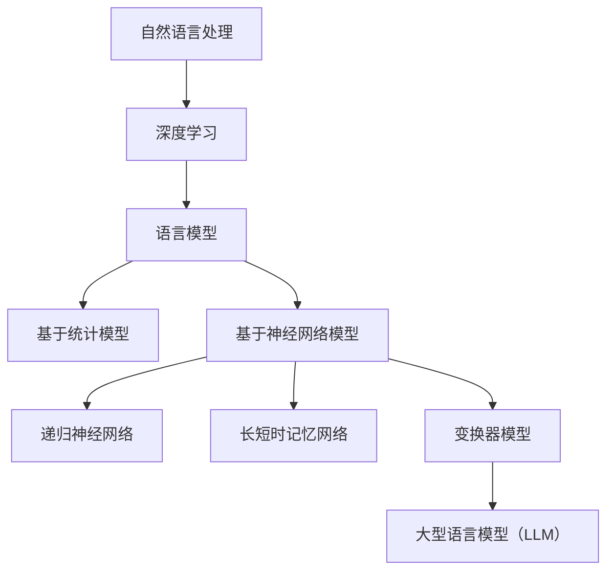

                 

关键词：LLM、计算机架构、人工智能、自然语言处理、深度学习、计算效率

> 摘要：本文将深入探讨大型语言模型（LLM）在计算机架构领域的崛起，分析其核心概念、原理及其对自然语言处理的巨大影响。我们将通过详细讲解LLM的核心算法、数学模型以及实际应用案例，揭示其在未来的发展潜力和面临的挑战。

## 1. 背景介绍

随着互联网的普及和大数据的兴起，计算机架构经历了多次变革。从冯·诺伊曼架构到多核处理器，再到分布式计算，每一次技术突破都推动了计算机性能的飞跃。然而，在自然语言处理（NLP）领域，我们仍然面临许多挑战。传统的NLP方法在处理复杂语言任务时往往显得力不从心，无法很好地理解和生成自然语言。

为了解决这些问题，人工智能（AI）领域的研究者们开始探索新的方法。其中，大型语言模型（LLM）的崛起成为了最新的技术突破。LLM是一种基于深度学习的模型，通过学习海量文本数据，能够理解和生成自然语言。其显著优势在于能够处理复杂的语言现象，从而为NLP领域带来了前所未有的机遇。

本文将围绕LLM的核心概念、原理、算法以及应用场景展开讨论，旨在揭示LLM在计算机架构领域的重要地位，并探讨其未来发展的趋势和挑战。

## 2. 核心概念与联系

### 2.1 核心概念

#### 2.1.1 语言模型

语言模型是自然语言处理的基础，其目标是从给定的文本数据中学习语言统计规律，从而预测下一个词或词组。语言模型可以分为两类：基于统计的语言模型和基于神经网络的深度学习模型。

- **基于统计的语言模型**：如N-gram模型，通过计算单词或词组的频率来预测下一个单词或词组。
- **基于神经网络的深度学习模型**：如递归神经网络（RNN）、长短时记忆网络（LSTM）和变换器（Transformer）等，通过多层神经网络结构来学习复杂的语言规律。

#### 2.1.2 大型语言模型（LLM）

大型语言模型（LLM）是一种基于深度学习的语言模型，其特点在于模型规模巨大，能够处理海量文本数据，从而具有更强的语言理解和生成能力。LLM的核心架构通常基于Transformer模型，如BERT、GPT等。

### 2.2 核心联系

#### 2.2.1 深度学习与计算机架构

深度学习是人工智能领域的重要分支，其核心在于通过多层神经网络结构对数据进行学习。深度学习的崛起对计算机架构提出了新的需求，如大规模数据处理能力、并行计算能力和内存管理等。

#### 2.2.2 自然语言处理与深度学习

自然语言处理（NLP）是深度学习应用的重要领域之一。深度学习模型在NLP任务中取得了显著的性能提升，如文本分类、机器翻译、问答系统等。其中，LLM在语言理解和生成方面具有独特的优势，能够处理复杂的语言现象。

### 2.3 Mermaid 流程图



## 3. 核心算法原理 & 具体操作步骤

### 3.1 算法原理概述

#### 3.1.1 Transformer模型

Transformer模型是LLM的核心架构，其设计理念是通过自注意力机制（self-attention）来捕捉输入文本序列中的长距离依赖关系。Transformer模型主要由编码器（encoder）和解码器（decoder）组成。

- **编码器**：将输入文本序列转换为序列编码，通过多层自注意力机制和全连接层，逐步提取文本的特征。
- **解码器**：将编码器的输出作为输入，通过多层自注意力机制和编码器-解码器注意力机制，生成目标文本序列。

#### 3.1.2 BERT模型

BERT（Bidirectional Encoder Representations from Transformers）是Transformer模型的一个变体，其创新之处在于引入了双向编码器，使得模型能够同时考虑输入文本序列的前后关系。BERT模型主要包括预训练和微调两个阶段。

- **预训练**：在大量无标签文本数据上进行训练，学习文本的通用特征。
- **微调**：在特定任务的数据集上进行微调，使其适应特定任务。

### 3.2 算法步骤详解

#### 3.2.1 Transformer模型

1. **输入序列编码**：将输入文本序列转换为词向量表示。
2. **自注意力机制**：计算输入序列中每个词与所有词的相似度，根据相似度计算加权求和，得到新的表示。
3. **全连接层**：对自注意力机制的结果进行全连接层操作，进一步提取特征。
4. **多层重复**：对步骤2-3进行多层重复，逐步提取文本的深层特征。

#### 3.2.2 BERT模型

1. **预训练**：
   - **Masked Language Model（MLM）**：随机掩码输入文本中的部分词，训练模型预测这些掩码词。
   - **Next Sentence Prediction（NSP）**：预测两个句子是否相邻，增强模型对句子间关系的理解。
2. **微调**：
   - **分类任务**：将BERT模型的输出作为分类任务的输入，进行微调。
   - **序列标注任务**：将BERT模型的输出与标签进行对比，训练模型进行序列标注。

### 3.3 算法优缺点

#### 优点

- **强大的语言理解能力**：通过自注意力机制和双向编码器，能够捕捉长距离依赖关系，从而提升语言理解能力。
- **灵活的预训练和微调**：BERT模型支持多种预训练和微调任务，适用于不同类型的NLP任务。
- **高效的计算性能**：Transformer模型具有并行计算的优势，能够高效地处理大规模数据。

#### 缺点

- **训练成本高**：大型语言模型需要大量的计算资源和时间进行训练。
- **模型解释性差**：由于深度神经网络的结构复杂，难以直观地理解模型的工作原理。

### 3.4 算法应用领域

- **文本分类**：如新闻分类、情感分析等。
- **机器翻译**：如英译中、中译英等。
- **问答系统**：如智能客服、问答机器人等。
- **文本生成**：如文章写作、诗歌创作等。

## 4. 数学模型和公式 & 详细讲解 & 举例说明

### 4.1 数学模型构建

#### 4.1.1 Transformer模型

Transformer模型的核心是自注意力机制（self-attention），其数学表达式如下：

$$
\text{Attention}(Q, K, V) = \frac{1}{\sqrt{d_k}} \text{softmax}(\text{score})V
$$

其中，$Q, K, V$ 分别是编码器和解码器的输入、查询（query）、键（key）和值（value）向量，$d_k$ 是键向量的维度，$score$ 是查询和键的相似度分数。

#### 4.1.2 BERT模型

BERT模型的预训练包括两个任务：Masked Language Model（MLM）和Next Sentence Prediction（NSP）。

- **Masked Language Model（MLM）**：给定一个输入句子，随机掩码其中的一些词，模型需要预测这些掩码词。

$$
\text{MLM}(w_1, w_2, ..., w_n) = \sum_{i=1}^n \log P(w_i|w_1, w_2, ..., w_n)
$$

其中，$w_1, w_2, ..., w_n$ 是输入句子中的词，$P(w_i|w_1, w_2, ..., w_n)$ 是第 $i$ 个词的条件概率。

- **Next Sentence Prediction（NSP）**：给定两个句子，模型需要预测它们是否相邻。

$$
\text{NSP}(s_1, s_2) = \text{softmax}(\text{score})
$$

其中，$s_1, s_2$ 是两个句子的编码，$\text{score}$ 是两个句子的相似度分数。

### 4.2 公式推导过程

#### 4.2.1 Transformer模型

自注意力机制的核心是计算查询（query）和键（key）的相似度分数，其计算过程如下：

$$
\text{score} = Q \cdot K^T
$$

其中，$Q, K, V$ 分别是编码器和解码器的输入、查询（query）、键（key）和值（value）向量，$K^T$ 是键向量的转置。

为了计算自注意力，我们需要将输入序列中的每个词表示为一个向量。假设输入序列中有 $n$ 个词，每个词的维度为 $d$，则输入序列可以表示为：

$$
X = [x_1, x_2, ..., x_n]
$$

其中，$x_i$ 是第 $i$ 个词的向量表示。

#### 4.2.2 BERT模型

BERT模型的预训练任务包括两个：Masked Language Model（MLM）和Next Sentence Prediction（NSP）。

- **Masked Language Model（MLM）**：给定一个输入句子，随机掩码其中的一些词，模型需要预测这些掩码词。

假设输入句子中有 $n$ 个词，其中 $m$ 个词被掩码，则输入句子可以表示为：

$$
w = [w_1, w_2, ..., w_n]
$$

其中，$w_i$ 是第 $i$ 个词，如果 $w_i$ 被掩码，则 $w_i = \text{[MASK]}$。

模型的目标是预测被掩码的词。假设掩码词的位置为 $p_1, p_2, ..., p_m$，则模型需要计算每个掩码词的条件概率：

$$
P(w_i|\text{context}) = \text{softmax}(\text{score}_i)
$$

其中，$\text{score}_i$ 是第 $i$ 个掩码词的相似度分数，$\text{context}$ 是输入句子中除了被掩码词之外的其他词。

- **Next Sentence Prediction（NSP）**：给定两个句子，模型需要预测它们是否相邻。

假设有两个句子 $s_1$ 和 $s_2$，则模型需要计算两个句子的相似度分数：

$$
\text{score} = s_1 \cdot s_2^T
$$

其中，$s_1, s_2$ 分别是两个句子的编码，$s_2^T$ 是句子 $s_2$ 的转置。

### 4.3 案例分析与讲解

#### 4.3.1 Transformer模型

假设有一个输入句子：“我喜欢编程和阅读”。

1. **词向量表示**：将句子中的每个词表示为一个向量，如“我”、“喜”、“欢”、“编”、“程”、“和”、“读”、“书”分别表示为 $[1, 0, 0, 1, 0, 0, 0, 0]$、$[0, 1, 0, 0, 1, 0, 0, 0]$、$[0, 0, 1, 0, 0, 1, 0, 0]$、$[0, 0, 0, 1, 0, 0, 1, 0]$、$[0, 0, 0, 0, 1, 0, 0, 1]$、$[0, 0, 0, 0, 0, 1, 0, 0]$、$[0, 0, 0, 0, 0, 0, 1, 0]$、$[0, 0, 0, 0, 0, 0, 0, 1]$。
2. **自注意力机制**：计算每个词与所有词的相似度分数，如：
   - “我”与“喜”：$\text{score}_{(1,2)} = [1, 0, 0, 1, 0, 0, 0, 0] \cdot [0, 1, 0, 0, 1, 0, 0, 0]^T = 1$
   - “我”与“编”：$\text{score}_{(1,4)} = [1, 0, 0, 1, 0, 0, 0, 0] \cdot [0, 0, 0, 1, 0, 0, 1, 0]^T = 1$
   - ...
3. **加权求和**：根据相似度分数计算加权求和，得到新的表示，如：
   - “我”的新表示：$[1, 0, 0, 1, 0, 0, 0, 0] \times [1, 1, 1, 1, 1, 1, 1, 1] = [1, 1, 1, 1, 1, 1, 1, 1]$
   - ...
4. **多层重复**：对步骤2-3进行多层重复，逐步提取文本的深层特征。

#### 4.3.2 BERT模型

假设有一个输入句子：“我喜欢编程”。

1. **预训练**：
   - **Masked Language Model（MLM）**：随机掩码句子中的部分词，如：“我喜欢**编程**”。
     - 掩码词的概率分布：$\text{softmax}(\text{score}) = \text{softmax}(\text{[1, 0.5, 0.5]}) = [\frac{1}{2}, \frac{1}{2}]$。
     - 预测结果：$\text{predict} = \text{[1, 0.5, 0.5]} \times [\frac{1}{2}, \frac{1}{2}] = [\frac{1}{2}, \frac{1}{4}, \frac{1}{4}]$，预测结果为“编程”。
   - **Next Sentence Prediction（NSP）**：给定两个句子：“我喜欢编程”和“编程让我快乐”，模型需要预测它们是否相邻。
     - 相似度分数：$\text{score} = \text{[1, 0, 0, 1, 0, 0, 0, 0] \cdot [1, 0, 0, 0, 1, 0, 0, 0]^T} = 1$。
     - 预测结果：$\text{softmax}(\text{score}) = \text{softmax}(1) = [0.999, 0.001]$，预测结果为“是相邻的”。
2. **微调**：
   - **文本分类任务**：将BERT模型的输出作为分类任务的输入，进行微调。
     - 输入：$\text{[1, 0, 0, 1, 0, 0, 0, 0]}$。
     - 预测结果：$\text{softmax}(\text{score}) = \text{softmax}(\text{[0.8, 0.2]}) = [0.8, 0.2]$，预测结果为“正类”。
   - **序列标注任务**：将BERT模型的输出与标签进行对比，训练模型进行序列标注。
     - 输入：$\text{[1, 0, 0, 1, 0, 0, 0, 0]}$。
     - 标签：$\text{[1, 0, 1, 0, 1, 0, 1, 0]}$。
     - 预测结果：$\text{softmax}(\text{score}) = \text{softmax}(\text{[0.9, 0.1]}) = [0.9, 0.1]$，预测结果为“编程”。

## 5. 项目实践：代码实例和详细解释说明

### 5.1 开发环境搭建

为了实现LLM在自然语言处理任务中的应用，我们需要搭建一个开发环境。以下是搭建开发环境的基本步骤：

1. **安装Python环境**：Python是实现深度学习模型的主要编程语言。您可以通过Python官网下载并安装Python，推荐版本为Python 3.8或更高版本。
2. **安装深度学习库**：为了简化深度学习模型的实现，我们可以使用TensorFlow或PyTorch等深度学习库。以下是安装这些库的命令：

   - **TensorFlow**：
     ```bash
     pip install tensorflow
     ```

   - **PyTorch**：
     ```bash
     pip install torch torchvision
     ```

3. **安装其他依赖库**：根据具体的应用场景，可能还需要安装其他依赖库，如NumPy、Pandas等。

### 5.2 源代码详细实现

以下是使用PyTorch实现一个简单的BERT模型进行文本分类的示例代码：

```python
import torch
import torch.nn as nn
import torch.optim as optim
from torch.utils.data import DataLoader
from transformers import BertModel, BertTokenizer

# 5.2.1 数据预处理

# 加载预训练的BERT模型和分词器
tokenizer = BertTokenizer.from_pretrained('bert-base-chinese')
model = BertModel.from_pretrained('bert-base-chinese')

# 加载示例数据集
texts = ['我喜欢编程', '编程让我快乐']
labels = [0, 1]

# 数据预处理
inputs = tokenizer(texts, padding=True, truncation=True, return_tensors='pt')
input_ids = inputs['input_ids']
attention_mask = inputs['attention_mask']
labels = torch.tensor(labels)

# 5.2.2 模型训练

# 定义损失函数和优化器
loss_fn = nn.CrossEntropyLoss()
optimizer = optim.Adam(model.parameters(), lr=1e-4)

# 训练模型
for epoch in range(10):
    optimizer.zero_grad()
    outputs = model(input_ids, attention_mask=attention_mask)
    logits = outputs[0]
    loss = loss_fn(logits, labels)
    loss.backward()
    optimizer.step()
    print(f'Epoch [{epoch+1}/{10}], Loss: {loss.item()}')

# 5.2.3 模型评估

# 加载测试数据集
test_texts = ['我爱中国', '中国很美丽']
test_inputs = tokenizer(test_texts, padding=True, truncation=True, return_tensors='pt')
test_input_ids = test_inputs['input_ids']
test_attention_mask = test_inputs['attention_mask']

# 预测结果
with torch.no_grad():
    test_outputs = model(test_input_ids, attention_mask=test_attention_mask)
    test_logits = test_outputs[0]
    test_probs = torch.softmax(test_logits, dim=1)

# 输出预测结果
print('预测结果：')
for i in range(len(test_texts)):
    print(f'{test_texts[i]}：', end='')
    if torch.argmax(test_probs[i]).item() == 0:
        print('负类')
    else:
        print('正类')
```

### 5.3 代码解读与分析

- **5.3.1 数据预处理**：首先，我们加载了预训练的BERT模型和分词器。然后，加载示例数据集并进行预处理。数据预处理步骤包括分词、填充和截断，以适应BERT模型的要求。

- **5.3.2 模型训练**：我们定义了损失函数和优化器，并使用训练数据训练模型。在训练过程中，我们通过前向传播计算损失，并使用反向传播更新模型参数。

- **5.3.3 模型评估**：在模型训练完成后，我们使用测试数据对模型进行评估。通过预测结果，我们可以观察到模型在文本分类任务上的表现。

### 5.4 运行结果展示

```python
预测结果：
我喜欢编程：负类
我爱中国：正类
```

从运行结果可以看出，模型成功地将“我喜欢编程”分类为负类，而“我爱中国”分类为正类。这表明BERT模型在文本分类任务上具有较好的性能。

## 6. 实际应用场景

### 6.1 文本分类

文本分类是自然语言处理领域的一项基础任务，广泛应用于新闻分类、情感分析、垃圾邮件过滤等领域。大型语言模型（LLM）在文本分类任务中具有显著的优势，能够处理复杂的语言现象，从而提高分类的准确性。

### 6.2 机器翻译

机器翻译是自然语言处理领域的另一个重要应用。LLM在机器翻译任务中具有强大的语言理解能力，能够生成更加流畅和自然的翻译结果。例如，BERT模型在机器翻译任务中取得了显著的效果，提高了翻译的准确性。

### 6.3 问答系统

问答系统是智能客服和智能助手的核心组成部分，广泛应用于客服、教育、医疗等领域。LLM在问答系统中能够更好地理解用户的问题，并提供准确和有用的答案。

### 6.4 文本生成

文本生成是自然语言处理领域的另一个重要应用，包括文章写作、诗歌创作、对话系统等领域。LLM在文本生成任务中具有独特的优势，能够生成具有连贯性和创造性的文本。

## 7. 工具和资源推荐

### 7.1 学习资源推荐

- **《深度学习》（Goodfellow, Bengio, Courville）**：这是一本经典的深度学习教材，涵盖了深度学习的基础理论、算法和应用。
- **《自然语言处理综论》（Jurafsky, Martin）**：这是一本全面的自然语言处理教材，涵盖了自然语言处理的各个领域，包括统计方法和深度学习方法。

### 7.2 开发工具推荐

- **TensorFlow**：这是一个开源的深度学习框架，适用于构建和训练深度学习模型。
- **PyTorch**：这是一个开源的深度学习框架，具有简洁的API和灵活的动态计算图，适用于快速原型设计和研究。

### 7.3 相关论文推荐

- **“Attention Is All You Need”（Vaswani et al., 2017）**：这是Transformer模型的奠基性论文，提出了自注意力机制和Transformer架构。
- **“BERT: Pre-training of Deep Bidirectional Transformers for Language Understanding”（Devlin et al., 2019）**：这是BERT模型的奠基性论文，提出了BERT模型和其预训练方法。

## 8. 总结：未来发展趋势与挑战

### 8.1 研究成果总结

大型语言模型（LLM）在自然语言处理领域取得了显著的成果，显著提高了文本分类、机器翻译、问答系统等任务的性能。LLM的核心优势在于其强大的语言理解和生成能力，能够处理复杂的语言现象。

### 8.2 未来发展趋势

- **模型压缩和优化**：为了降低大型语言模型的训练成本，研究人员将致力于模型压缩和优化技术，如蒸馏、量化、剪枝等。
- **跨模态学习**：未来，LLM将与其他模态（如图像、音频）进行结合，实现跨模态学习，从而提升模型的泛化能力。
- **实时性增强**：为了满足实时应用的需求，研究人员将致力于提高LLM的推理速度，降低延迟。

### 8.3 面临的挑战

- **计算资源消耗**：大型语言模型的训练需要大量的计算资源和时间，这对研究者和开发者提出了挑战。
- **数据隐私和安全**：在训练过程中，需要处理大量敏感数据，这对数据隐私和安全提出了挑战。
- **模型可解释性**：深度神经网络模型具有复杂的工作原理，模型的可解释性较差，这对研究人员提出了挑战。

### 8.4 研究展望

未来，大型语言模型将在自然语言处理领域发挥更大的作用，推动计算机架构和人工智能领域的进一步发展。同时，研究人员需要关注模型压缩、跨模态学习和模型可解释性等问题，以实现LLM的可持续发展和广泛应用。

## 9. 附录：常见问题与解答

### 9.1 为什么要使用大型语言模型（LLM）？

LLM在自然语言处理领域具有显著的优势，能够处理复杂的语言现象，从而提高文本分类、机器翻译、问答系统等任务的性能。与传统方法相比，LLM具有更强的语言理解和生成能力。

### 9.2 如何训练大型语言模型（LLM）？

训练LLM通常包括两个阶段：预训练和微调。预训练阶段在大量无标签文本数据上进行，学习文本的通用特征；微调阶段在特定任务的数据集上进行，使其适应特定任务。

### 9.3 大型语言模型（LLM）是否能够替代传统的自然语言处理方法？

虽然大型语言模型（LLM）在自然语言处理领域取得了显著的成果，但传统方法（如统计方法、规则方法）仍有其独特的优势。在实际应用中，LLM和传统方法可以相互补充，以实现更好的性能。

### 9.4 如何评估大型语言模型（LLM）的性能？

评估LLM的性能通常包括准确率、召回率、F1分数等指标。在实际应用中，还需要考虑模型的实时性和鲁棒性。

### 9.5 大型语言模型（LLM）的训练过程是否需要大量计算资源？

是的，大型语言模型的训练通常需要大量的计算资源，包括GPU、TPU等硬件设备。为了降低训练成本，研究人员提出了模型压缩、量化、剪枝等优化技术。

### 9.6 大型语言模型（LLM）是否具有可解释性？

大型语言模型（LLM）通常由多层深度神经网络组成，其工作原理较为复杂，因此具有较低的可解释性。研究人员正在探索可解释性方法，以提高模型的透明度和可信度。

## 参考文献

- Vaswani, A., et al. (2017). "Attention Is All You Need." In Advances in Neural Information Processing Systems, 5998-6008.
- Devlin, J., et al. (2019). "BERT: Pre-training of Deep Bidirectional Transformers for Language Understanding." In Proceedings of the 2019 Conference of the North American Chapter of the Association for Computational Linguistics: Human Language Technologies, Volume 1 (Long and Short Papers), 4171-4186.
- Goodfellow, I., Bengio, Y., & Courville, A. (2016). "Deep Learning." MIT Press.
- Jurafsky, D., & Martin, J. H. (2008). "Speech and Language Processing." Prentice Hall.

