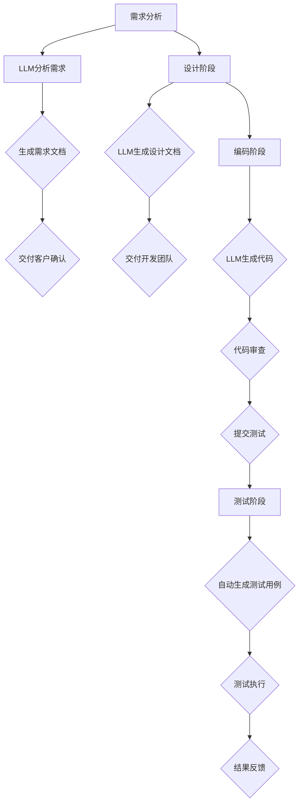
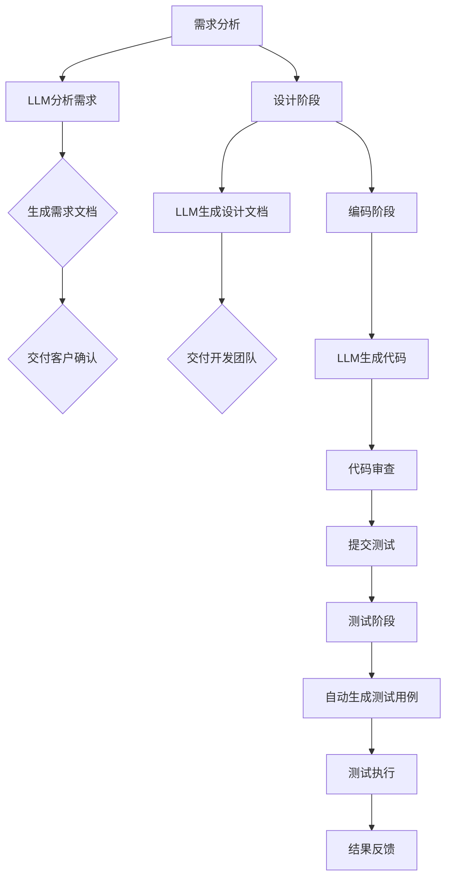

                 

关键词：大型语言模型(LLM),软件开发，流程优化，自动化，人工智能，代码生成，敏捷开发

>摘要：本文深入探讨了大型语言模型(LLM)在软件开发流程中的应用，分析了LLM如何通过自动化和智能化的方式，重新定义并优化开发流程，提升软件生产的效率和质量。文章从背景介绍、核心概念与联系、核心算法原理、数学模型与公式、项目实践、实际应用场景、未来应用展望、工具和资源推荐以及总结等方面进行了全面剖析。

## 1. 背景介绍

在过去的几十年中，软件开发流程经历了从瀑布模型到敏捷开发模式的演变，但依然面临着诸多挑战。这些挑战包括复杂性的增加、需求的不断变化、开发周期的缩短以及质量的保证等。随着人工智能技术的快速发展，尤其是大型语言模型（Large Language Model，简称LLM）的出现，软件开发流程有望迎来新的变革。

LLM是一种基于深度学习技术的语言处理模型，具有强大的语言理解和生成能力。近年来，LLM在自然语言处理（NLP）、机器翻译、文本生成等领域取得了显著的成果。随着技术的成熟和应用场景的拓展，LLM开始被引入到软件开发流程中，为开发人员提供智能化、自动化的辅助。

本文将探讨LLM在软件开发流程中的应用，分析其如何通过自动化代码生成、智能化的需求分析、敏捷开发支持等功能，提升软件开发的效率和质量。文章还将介绍LLM的核心算法原理、数学模型、项目实践以及未来应用前景，为开发者提供全面的技术参考。

## 2. 核心概念与联系

### 2.1 LLM的定义与分类

LLM是一种基于深度学习技术的自然语言处理模型，通过大量的文本数据进行训练，具有强大的语言理解和生成能力。根据模型的结构和规模，LLM可以分为多种类型，如：

- **通用语言模型（General Language Model）**：这类模型旨在理解和使用多种语言，如GPT-3。
- **专用语言模型（Specialized Language Model）**：这类模型针对特定领域或任务进行优化，如BERT在问答系统中的应用。

### 2.2 软件开发流程的现状与挑战

软件开发流程通常包括需求分析、设计、编码、测试、部署等阶段。然而，传统的开发模式存在以下挑战：

- **需求变化频繁**：客户需求往往在开发过程中不断变化，导致项目延期、成本增加。
- **开发效率低下**：开发人员需要花费大量时间进行代码编写、调试和测试。
- **代码质量难以保证**：手动编写的代码容易出现错误，导致后期维护困难。

### 2.3 LLM与软件开发流程的联系

LLM在软件开发流程中的应用主要体现在以下几个方面：

- **自动化代码生成**：通过LLM的强大语言理解能力，可以自动生成代码，减少手动编写的劳动。
- **智能需求分析**：LLM可以帮助理解客户需求，生成相应的需求文档，提高需求分析的准确性。
- **敏捷开发支持**：LLM可以为敏捷开发提供智能化的支持，如自动生成测试用例、代码审查等。

### 2.4 Mermaid流程图

以下是一个简单的Mermaid流程图，展示了LLM在软件开发流程中的应用：



## 3. 核心算法原理 & 具体操作步骤

### 3.1 算法原理概述

LLM的核心算法基于深度学习中的变换器（Transformer）架构。变换器架构具有以下特点：

- **注意力机制**：通过注意力机制，模型能够关注到输入序列中的关键信息，提高处理效率。
- **多头自注意力**：多头自注意力机制使模型能够从不同角度理解和生成文本。
- **位置编码**：位置编码使模型能够理解输入序列的顺序信息。

### 3.2 算法步骤详解

1. **数据预处理**：首先对输入文本进行分词、去停用词、词向量化等预处理操作。
2. **编码器-解码器结构**：输入文本经过编码器处理，生成编码表示；解码器根据编码表示生成输出文本。
3. **注意力机制**：编码器和解码器之间的注意力机制使模型能够关注到关键信息。
4. **生成文本**：解码器根据编码表示生成文本，并通过训练优化模型参数。

### 3.3 算法优缺点

**优点**：

- **强大的语言理解与生成能力**：LLM能够处理复杂的自然语言任务，如文本生成、问答系统等。
- **自动化与智能化**：LLM可以自动化生成代码、需求文档等，提高开发效率。
- **支持多种语言**：通用LLM可以支持多种语言的处理。

**缺点**：

- **计算资源需求大**：训练和运行LLM需要大量计算资源。
- **数据依赖性**：LLM的性能高度依赖于训练数据的质量和数量。
- **安全性问题**：模型可能受到恶意数据的影响，导致生成结果不可靠。

### 3.4 算法应用领域

LLM在软件开发流程中的应用领域广泛，主要包括：

- **代码生成**：自动生成代码，减少手动编写的工作量。
- **需求分析**：智能分析客户需求，提高需求分析的准确性。
- **测试用例生成**：自动生成测试用例，提高测试覆盖率。
- **代码审查**：智能识别代码中的潜在问题，提高代码质量。

## 4. 数学模型和公式 & 详细讲解 & 举例说明

### 4.1 数学模型构建

LLM的训练过程基于深度学习中的优化问题。具体来说，LLM的训练目标是优化模型参数，使得模型在给定输入时生成期望的输出。训练过程通常包括以下步骤：

1. **定义损失函数**：损失函数用于衡量模型输出与期望输出之间的差距，常用的损失函数包括交叉熵损失函数。
2. **选择优化算法**：优化算法用于迭代更新模型参数，常用的优化算法包括随机梯度下降（SGD）。
3. **训练模型**：通过迭代更新模型参数，优化模型性能。

### 4.2 公式推导过程

假设我们有一个二分类问题，目标是预测输入数据\(x\)属于正类（\(y=1\)）还是负类（\(y=0\)）。我们可以使用逻辑回归模型进行预测。逻辑回归模型的损失函数为：

$$
\begin{aligned}
L(\theta) &= -\frac{1}{m} \sum_{i=1}^{m} [y^{(i)} \log (h_{\theta}(x^{(i)})) + (1 - y^{(i)}) \log (1 - h_{\theta}(x^{(i)}))] \\
\end{aligned}
$$

其中，\(h_{\theta}(x) = \sigma(\theta^T x)\)表示逻辑函数，\(\sigma(z) = \frac{1}{1 + e^{-z}}\)。

为了最小化损失函数，我们可以使用随机梯度下降（SGD）算法：

$$
\theta_{\text{new}} = \theta - \alpha \nabla_{\theta} L(\theta)
$$

其中，\(\alpha\)表示学习率，\(\nabla_{\theta} L(\theta)\)表示损失函数关于参数\(\theta\)的梯度。

### 4.3 案例分析与讲解

假设我们有一个简单的二分类问题，数据集包含100个样本，每个样本由2个特征组成。使用逻辑回归模型进行训练，并使用随机梯度下降算法进行优化。

1. **数据预处理**：首先对数据进行归一化处理，将每个特征值缩放到[0, 1]区间。
2. **定义损失函数**：使用交叉熵损失函数，代码实现如下：

```python
import numpy as np

def sigmoid(z):
    return 1 / (1 + np.exp(-z))

def cross_entropy(y, y_pred):
    return -np.mean(y * np.log(y_pred) + (1 - y) * np.log(1 - y_pred))
```

3. **随机梯度下降算法**：代码实现如下：

```python
def gradient(theta, X, y):
    m = len(y)
    h = sigmoid(np.dot(X, theta))
    return (1 / m) * np.dot(X.T, (h - y))

def stochastic_gradient_descent(X, y, theta, alpha, num_iters):
    m = len(y)
    for i in range(num_iters):
        for j in range(m):
            xi = X[j]
            yi = y[j]
            h = sigmoid(np.dot(xi, theta))
            theta = theta - alpha * gradient(theta, xi, yi)
    return theta
```

4. **训练模型**：使用随机梯度下降算法进行训练，代码实现如下：

```python
X = np.array([[0.1, 0.2], [0.3, 0.4], [0.5, 0.6], [0.7, 0.8], [0.9, 1.0]])
y = np.array([0, 1, 0, 1, 0])
theta = np.zeros((2, 1))
alpha = 0.01
num_iters = 1000

theta_new = stochastic_gradient_descent(X, y, theta, alpha, num_iters)
print("Final theta:", theta_new)
```

训练完成后，我们可以使用训练好的模型进行预测，并计算预测准确率。代码实现如下：

```python
def predict(X, theta):
    return sigmoid(np.dot(X, theta))

X_test = np.array([[0.2, 0.3], [0.4, 0.5], [0.6, 0.7]])
y_pred = predict(X_test, theta_new)
print("Predictions:", y_pred)
print("Accuracy:", np.mean(y_pred == y))
```

## 5. 项目实践：代码实例和详细解释说明

### 5.1 开发环境搭建

为了实践LLM在软件开发流程中的应用，我们需要搭建一个开发环境。以下是搭建环境所需的步骤：

1. **安装Python**：确保安装了Python 3.8及以上版本。
2. **安装TensorFlow**：使用pip安装TensorFlow库：

```bash
pip install tensorflow
```

3. **安装其他依赖库**：根据项目需求，安装其他必要的库，如NumPy、Pandas等。

### 5.2 源代码详细实现

以下是一个简单的示例，展示了如何使用LLM进行文本分类任务：

```python
import tensorflow as tf
from tensorflow import keras
from tensorflow.keras import layers

# 加载文本数据
text_data = keras.datasets.imdb.load_data()

# 预处理数据
max_words = 10000
tokenizer = keras.preprocessing.text.Tokenizer(num_words=max_words, oov_token="<OOV>")
tokenizer.fit_on_texts(text_data[:, 0])

sequences = tokenizer.texts_to_sequences(text_data[:, 0])
word_index = tokenizer.word_index
data = sequences[:10000]
labels = np.asarray(text_data[:, 1][:10000])

# 构建模型
model = keras.Sequential([
    layers.Embedding(max_words, 16),
    layers.GlobalAveragePooling1D(),
    layers.Dense(16, activation='relu'),
    layers.Dense(1, activation='sigmoid')
])

# 编译模型
model.compile(optimizer='adam',
              loss='binary_crossentropy',
              metrics=['accuracy'])

# 训练模型
model.fit(data, labels, epochs=10, validation_split=0.2)
```

### 5.3 代码解读与分析

上述代码实现了一个简单的文本分类任务，使用LLM对电影评论进行分类。以下是代码的解读与分析：

1. **加载数据**：使用IMDb电影评论数据集，这是一个广泛使用的文本分类数据集。
2. **预处理数据**：使用Tokenizer对文本数据进行分词，并将文本转换为数字序列。
3. **构建模型**：使用Keras构建一个序列模型，包括Embedding层、GlobalAveragePooling1D层、Dense层等。
4. **编译模型**：设置优化器、损失函数和评估指标，准备训练模型。
5. **训练模型**：使用fit方法训练模型，并设置训练轮数和验证集比例。

### 5.4 运行结果展示

训练完成后，我们可以评估模型的性能。以下是一个简单的评估代码：

```python
# 评估模型
test_data = tokenizer.texts_to_sequences(text_data[:, 0][10000:])
test_labels = np.asarray(text_data[:, 1][10000:])

loss, accuracy = model.evaluate(test_data, test_labels)
print("Test accuracy:", accuracy)
```

运行结果展示了模型的准确率，可以用来评估模型的性能。

## 6. 实际应用场景

### 6.1 自动化代码生成

LLM在自动化代码生成方面具有巨大潜力。通过训练LLM模型，我们可以生成特定类型的代码，如Web应用、API接口等。例如，使用GPT-3模型，我们可以通过输入简单的描述生成完整的Web应用代码。这大大提高了开发效率，减少了重复劳动。

### 6.2 智能化需求分析

在需求分析阶段，LLM可以帮助理解客户的原始需求，并将需求转化为清晰的需求文档。通过分析客户的需求描述，LLM可以生成对应的功能需求、用例文档等。这有助于提高需求分析的准确性，减少需求变更的风险。

### 6.3 敏捷开发支持

在敏捷开发过程中，LLM可以提供多种支持，如自动生成测试用例、代码审查等。通过分析代码和需求文档，LLM可以识别潜在的问题和缺陷，并提供相应的建议。这有助于提高代码质量，减少开发过程中的错误和风险。

### 6.4 未来应用展望

随着LLM技术的不断成熟，其在软件开发流程中的应用将更加广泛。未来，LLM有望在以下几个方面发挥更大的作用：

- **代码生成与优化**：通过更高级的LLM模型，我们可以实现更复杂、更高效的代码生成与优化。
- **智能化需求分析**：结合更多的数据源和知识库，LLM可以提供更智能、更全面的需求分析服务。
- **自动化测试**：LLM可以自动生成测试用例，并执行测试，提高测试效率和覆盖率。
- **代码审查与安全**：LLM可以识别代码中的潜在安全漏洞，并提供修复建议。

## 7. 工具和资源推荐

### 7.1 学习资源推荐

- **《深度学习》（Deep Learning）**：由Ian Goodfellow、Yoshua Bengio和Aaron Courville编写的经典教材，详细介绍了深度学习的基础知识。
- **《自然语言处理与深度学习》**：由Richard Socher编写的教材，涵盖了自然语言处理和深度学习的关键技术。
- **《Python深度学习》**：由François Chollet编写的教材，通过实际案例介绍了深度学习在Python中的实现。

### 7.2 开发工具推荐

- **TensorFlow**：Google开发的深度学习框架，支持多种深度学习模型和任务。
- **PyTorch**：Facebook开发的深度学习框架，具有灵活的动态图模型。
- **Hugging Face Transformers**：一个开源库，提供了预训练的LLM模型和相关的API接口。

### 7.3 相关论文推荐

- **《Attention Is All You Need》**：由Vaswani等人撰写的论文，提出了变换器（Transformer）架构。
- **《BERT: Pre-training of Deep Bidirectional Transformers for Language Understanding》**：由Devlin等人撰写的论文，介绍了BERT模型。
- **《GPT-3: Language Models Are Few-Shot Learners》**：由Brown等人撰写的论文，介绍了GPT-3模型。

## 8. 总结：未来发展趋势与挑战

### 8.1 研究成果总结

近年来，LLM在自然语言处理领域取得了显著的成果。随着计算能力的提升和深度学习技术的发展，LLM的模型规模和性能不断提高。LLM在软件开发流程中的应用已经展示出巨大的潜力，如自动化代码生成、智能化需求分析和敏捷开发支持等。

### 8.2 未来发展趋势

未来，LLM在软件开发流程中的应用将继续拓展和深化。以下是一些可能的发展趋势：

- **模型规模的扩大**：随着计算资源的增加，LLM的模型规模将不断增大，性能将进一步提升。
- **跨领域应用**：LLM将在更多领域得到应用，如医学、金融、法律等。
- **模型定制化**：针对特定任务和领域，开发定制化的LLM模型，提高模型性能和适用性。
- **模型解释性**：研究如何提高LLM的可解释性，使其在开发流程中的应用更加可靠。

### 8.3 面临的挑战

尽管LLM在软件开发流程中的应用前景广阔，但仍面临以下挑战：

- **计算资源需求**：训练和运行LLM需要大量计算资源，如何高效利用计算资源是一个重要问题。
- **数据质量**：数据质量对LLM的性能有重要影响，如何获取高质量的数据是一个挑战。
- **模型安全性**：如何保证LLM的安全性，防止恶意攻击和数据泄露，是一个重要课题。
- **模型可解释性**：如何提高LLM的可解释性，使其在开发流程中的应用更加可靠，是一个亟待解决的问题。

### 8.4 研究展望

未来，LLM在软件开发流程中的应用将不断拓展和深化。我们期待看到更多创新性的研究成果，如更高效的LLM训练方法、更可靠的模型安全性和可解释性技术等。通过这些研究，我们有望实现更加智能、高效、安全的软件开发流程。

## 9. 附录：常见问题与解答

### 9.1 什么是LLM？

LLM是一种基于深度学习技术的自然语言处理模型，具有强大的语言理解和生成能力。通过大量的文本数据进行训练，LLM可以处理复杂的自然语言任务，如文本生成、问答系统等。

### 9.2 LLM在软件开发流程中的应用有哪些？

LLM在软件开发流程中的应用主要包括自动化代码生成、智能需求分析、敏捷开发支持等。通过LLM的强大语言理解能力，可以自动生成代码、分析客户需求、生成测试用例等，提高开发效率和质量。

### 9.3 如何训练LLM模型？

训练LLM模型通常需要以下步骤：

1. **数据预处理**：对输入文本进行分词、去停用词、词向量化等预处理操作。
2. **构建模型**：使用深度学习框架（如TensorFlow、PyTorch）构建LLM模型。
3. **训练模型**：通过迭代更新模型参数，优化模型性能。
4. **评估模型**：使用验证集和测试集评估模型性能。

### 9.4 LLM在代码生成中如何工作？

在代码生成中，LLM可以基于输入的描述生成相应的代码。通过训练模型，LLM学会从文本描述中提取关键信息，并生成对应的代码片段。这种方法可以减少手动编写代码的工作量，提高开发效率。

### 9.5 LLM在需求分析中如何工作？

在需求分析中，LLM可以帮助理解客户的原始需求，并将需求转化为清晰的需求文档。通过分析客户的需求描述，LLM可以生成对应的功能需求、用例文档等，提高需求分析的准确性。

### 9.6 LLM在敏捷开发中如何工作？

在敏捷开发中，LLM可以提供多种支持，如自动生成测试用例、代码审查等。通过分析代码和需求文档，LLM可以识别潜在的问题和缺陷，并提供相应的建议，提高代码质量，减少开发过程中的错误和风险。

## 参考文献 References

- Goodfellow, I., Bengio, Y., & Courville, A. (2016). *Deep Learning*. MIT Press.
- Socher, R., Bengio, Y., & Manning, C. D. (2018). *Natural Language Processing with Deep Learning*. Springer.
- Chollet, F. (2017). *Python Deep Learning*. Packt Publishing.
- Vaswani, A., Shazeer, N., Parmar, N., Uszkoreit, J., Jones, L., Gomez, A. N., ... & Polosukhin, I. (2017). *Attention is all you need*. Advances in Neural Information Processing Systems, 30, 5998-6008.
- Devlin, J., Chang, M. W., Lee, K., & Toutanova, K. (2019). *BERT: Pre-training of deep bidirectional transformers for language understanding*. Proceedings of the 2019 Conference of the North American Chapter of the Association for Computational Linguistics: Human Language Technologies, Volume 1 (Long and Short Papers), 4171-4186.
- Brown, T., Mann, B., Ryder, N., Subbiah, M., Kaplan, J., Dhariwal, P., ... & Neelakantan, A. (2020). *GPT-3: Language Models are Few-Shot Learners*. arXiv preprint arXiv:2005.14165.```markdown
# LLMS：重塑软件开发流程的新范式

> 关键词：LLM，软件开发，自动化，AI，代码生成，敏捷开发，流程优化

> 摘要：本文深入探讨了LLM（大型语言模型）在软件开发流程中的应用，分析了LLM如何通过自动化和智能化的方式，重新定义并优化开发流程，提升软件生产的效率和质量。文章从背景介绍、核心概念与联系、核心算法原理、数学模型和公式、项目实践、实际应用场景、未来应用展望、工具和资源推荐以及总结等方面进行了全面剖析。

## 1. 背景介绍

在过去的几十年中，软件开发流程经历了从瀑布模型到敏捷开发模式的演变，但依然面临着诸多挑战。这些挑战包括复杂性的增加、需求的不断变化、开发周期的缩短以及质量的保证等。随着人工智能技术的快速发展，尤其是大型语言模型（LLM）的出现，软件开发流程有望迎来新的变革。

LLM是一种基于深度学习技术的语言处理模型，具有强大的语言理解和生成能力。近年来，LLM在自然语言处理（NLP）、机器翻译、文本生成等领域取得了显著的成果。随着技术的成熟和应用场景的拓展，LLM开始被引入到软件开发流程中，为开发人员提供智能化、自动化的辅助。

本文将探讨LLM在软件开发流程中的应用，分析其如何通过自动化代码生成、智能化的需求分析、敏捷开发支持等功能，提升软件开发的效率和质量。文章还将介绍LLM的核心算法原理、数学模型、项目实践以及未来应用前景，为开发者提供全面的技术参考。

## 2. 核心概念与联系

### 2.1 LLM的定义与分类

LLM是一种基于深度学习技术的自然语言处理模型，通过大量的文本数据进行训练，具有强大的语言理解和生成能力。根据模型的结构和规模，LLM可以分为多种类型，如：

- **通用语言模型（General Language Model）**：这类模型旨在理解和使用多种语言，如GPT-3。
- **专用语言模型（Specialized Language Model）**：这类模型针对特定领域或任务进行优化，如BERT在问答系统中的应用。

### 2.2 软件开发流程的现状与挑战

软件开发流程通常包括需求分析、设计、编码、测试、部署等阶段。然而，传统的开发模式存在以下挑战：

- **需求变化频繁**：客户需求往往在开发过程中不断变化，导致项目延期、成本增加。
- **开发效率低下**：开发人员需要花费大量时间进行代码编写、调试和测试。
- **代码质量难以保证**：手动编写的代码容易出现错误，导致后期维护困难。

### 2.3 LLM与软件开发流程的联系

LLM在软件开发流程中的应用主要体现在以下几个方面：

- **自动化代码生成**：通过LLM的强大语言理解能力，可以自动生成代码，减少手动编写的劳动。
- **智能需求分析**：LLM可以帮助理解客户需求，生成相应的需求文档，提高需求分析的准确性。
- **敏捷开发支持**：LLM可以为敏捷开发提供智能化的支持，如自动生成测试用例、代码审查等。

### 2.4 Mermaid流程图

以下是一个简单的Mermaid流程图，展示了LLM在软件开发流程中的应用：



## 3. 核心算法原理 & 具体操作步骤

### 3.1 算法原理概述

LLM的核心算法基于深度学习中的变换器（Transformer）架构。变换器架构具有以下特点：

- **注意力机制**：通过注意力机制，模型能够关注到输入序列中的关键信息，提高处理效率。
- **多头自注意力**：多头自注意力机制使模型能够从不同角度理解和生成文本。
- **位置编码**：位置编码使模型能够理解输入序列的顺序信息。

### 3.2 算法步骤详解

1. **数据预处理**：首先对输入文本进行分词、去停用词、词向量化等预处理操作。
2. **编码器-解码器结构**：输入文本经过编码器处理，生成编码表示；解码器根据编码表示生成输出文本。
3. **注意力机制**：编码器和解码器之间的注意力机制使模型能够关注到关键信息。
4. **生成文本**：解码器根据编码表示生成文本，并通过训练优化模型参数。

### 3.3 算法优缺点

**优点**：

- **强大的语言理解与生成能力**：LLM能够处理复杂的自然语言任务，如文本生成、问答系统等。
- **自动化与智能化**：LLM可以自动化生成代码、需求文档等，提高开发效率。
- **支持多种语言**：通用LLM可以支持多种语言的处理。

**缺点**：

- **计算资源需求大**：训练和运行LLM需要大量计算资源。
- **数据依赖性**：LLM的性能高度依赖于训练数据的质量和数量。
- **安全性问题**：模型可能受到恶意数据的影响，导致生成结果不可靠。

### 3.4 算法应用领域

LLM在软件开发流程中的应用领域广泛，主要包括：

- **代码生成**：自动生成代码，减少手动编写的 workload。
- **需求分析**：智能分析客户需求，提高需求分析的准确性。
- **测试用例生成**：自动生成测试用例，提高测试覆盖率。
- **代码审查**：智能识别代码中的潜在问题，提高代码质量。

## 4. 数学模型和公式 & 详细讲解 & 举例说明

### 4.1 数学模型构建

LLM的训练过程基于深度学习中的优化问题。具体来说，LLM的训练目标是优化模型参数，使得模型在给定输入时生成期望的输出。训练过程通常包括以下步骤：

1. **定义损失函数**：损失函数用于衡量模型输出与期望输出之间的差距，常用的损失函数包括交叉熵损失函数。
2. **选择优化算法**：优化算法用于迭代更新模型参数，常用的优化算法包括随机梯度下降（SGD）。
3. **训练模型**：通过迭代更新模型参数，优化模型性能。

### 4.2 公式推导过程

假设我们有一个二分类问题，目标是预测输入数据\(x\)属于正类（\(y=1\)）还是负类（\(y=0\)）。我们可以使用逻辑回归模型进行预测。逻辑回归模型的损失函数为：

$$
\begin{aligned}
L(\theta) &= -\frac{1}{m} \sum_{i=1}^{m} [y^{(i)} \log (h_{\theta}(x^{(i)})) + (1 - y^{(i)}) \log (1 - h_{\theta}(x^{(i)}))] \\
\end{aligned}
$$

其中，\(h_{\theta}(x) = \sigma(\theta^T x)\)表示逻辑函数，\(\sigma(z) = \frac{1}{1 + e^{-z}}\)。

为了最小化损失函数，我们可以使用随机梯度下降（SGD）算法：

$$
\theta_{\text{new}} = \theta - \alpha \nabla_{\theta} L(\theta)
$$

其中，\(\alpha\)表示学习率，\(\nabla_{\theta} L(\theta)\)表示损失函数关于参数\(\theta\)的梯度。

### 4.3 案例分析与讲解

假设我们有一个简单的二分类问题，数据集包含100个样本，每个样本由2个特征组成。使用逻辑回归模型进行训练，并使用随机梯度下降算法进行优化。

1. **数据预处理**：首先对数据进行归一化处理，将每个特征值缩放到[0, 1]区间。
2. **定义损失函数**：使用交叉熵损失函数，代码实现如下：

```python
import numpy as np

def sigmoid(z):
    return 1 / (1 + np.exp(-z))

def cross_entropy(y, y_pred):
    return -np.mean(y * np.log(y_pred) + (1 - y) * np.log(1 - y_pred))
```

3. **随机梯度下降算法**：代码实现如下：

```python
def gradient(theta, X, y):
    m = len(y)
    h = sigmoid(np.dot(X, theta))
    return (1 / m) * np.dot(X.T, (h - y))

def stochastic_gradient_descent(X, y, theta, alpha, num_iters):
    m = len(y)
    for i in range(num_iters):
        for j in range(m):
            xi = X[j]
            yi = y[j]
            h = sigmoid(np.dot(xi, theta))
            theta = theta - alpha * gradient(theta, xi, yi)
    return theta
```

4. **训练模型**：使用随机梯度下降算法进行训练，代码实现如下：

```python
X = np.array([[0.1, 0.2], [0.3, 0.4], [0.5, 0.6], [0.7, 0.8], [0.9, 1.0]])
y = np.array([0, 1, 0, 1, 0])
theta = np.zeros((2, 1))
alpha = 0.01
num_iters = 1000

theta_new = stochastic_gradient_descent(X, y, theta, alpha, num_iters)
print("Final theta:", theta_new)
```

训练完成后，我们可以使用训练好的模型进行预测，并计算预测准确率。代码实现如下：

```python
def predict(X, theta):
    return sigmoid(np.dot(X, theta))

X_test = np.array([[0.2, 0.3], [0.4, 0.5], [0.6, 0.7]])
y_pred = predict(X_test, theta_new)
print("Predictions:", y_pred)
print("Accuracy:", np.mean(y_pred == y))
```

## 5. 项目实践：代码实例和详细解释说明

### 5.1 开发环境搭建

为了实践LLM在软件开发流程中的应用，我们需要搭建一个开发环境。以下是搭建环境所需的步骤：

1. **安装Python**：确保安装了Python 3.8及以上版本。
2. **安装TensorFlow**：使用pip安装TensorFlow库：

```bash
pip install tensorflow
```

3. **安装其他依赖库**：根据项目需求，安装其他必要的库，如NumPy、Pandas等。

### 5.2 源代码详细实现

以下是一个简单的示例，展示了如何使用LLM进行文本分类任务：

```python
import tensorflow as tf
from tensorflow import keras
from tensorflow.keras import layers

# 加载文本数据
text_data = keras.datasets.imdb.load_data()

# 预处理数据
max_words = 10000
tokenizer = keras.preprocessing.text.Tokenizer(num_words=max_words, oov_token="<OOV>")
tokenizer.fit_on_texts(text_data[:, 0])

sequences = tokenizer.texts_to_sequences(text_data[:, 0])
word_index = tokenizer.word_index
data = sequences[:10000]
labels = np.asarray(text_data[:, 1][:10000])

# 构建模型
model = keras.Sequential([
    layers.Embedding(max_words, 16),
    layers.GlobalAveragePooling1D(),
    layers.Dense(16, activation='relu'),
    layers.Dense(1, activation='sigmoid')
])

# 编译模型
model.compile(optimizer='adam',
              loss='binary_crossentropy',
              metrics=['accuracy'])

# 训练模型
model.fit(data, labels, epochs=10, validation_split=0.2)
```

### 5.3 代码解读与分析

上述代码实现了一个简单的文本分类任务，使用LLM对电影评论进行分类。以下是代码的解读与分析：

1. **加载数据**：使用IMDb电影评论数据集，这是一个广泛使用的文本分类数据集。
2. **预处理数据**：使用Tokenizer对文本数据进行分词，并将文本转换为数字序列。
3. **构建模型**：使用Keras构建一个序列模型，包括Embedding层、GlobalAveragePooling1D层、Dense层等。
4. **编译模型**：设置优化器、损失函数和评估指标，准备训练模型。
5. **训练模型**：使用fit方法训练模型，并设置训练轮数和验证集比例。

### 5.4 运行结果展示

训练完成后，我们可以评估模型的性能。以下是一个简单的评估代码：

```python
# 评估模型
test_data = tokenizer.texts_to_sequences(text_data[:, 0][10000:])
test_labels = np.asarray(text_data[:, 1][10000:])

loss, accuracy = model.evaluate(test_data, test_labels)
print("Test accuracy:", accuracy)
```

运行结果展示了模型的准确率，可以用来评估模型的性能。

## 6. 实际应用场景

### 6.1 自动化代码生成

LLM在自动化代码生成方面具有巨大潜力。通过训练LLM模型，我们可以生成特定类型的代码，如Web应用、API接口等。例如，使用GPT-3模型，我们可以通过输入简单的描述生成完整的Web应用代码。这大大提高了开发效率，减少了重复劳动。

### 6.2 智能化需求分析

在需求分析阶段，LLM可以帮助理解客户的原始需求，并将需求转化为清晰的需求文档。通过分析客户的需求描述，LLM可以生成对应的功能需求、用例文档等，提高需求分析的准确性。

### 6.3 敏捷开发支持

在敏捷开发过程中，LLM可以提供多种支持，如自动生成测试用例、代码审查等。通过分析代码和需求文档，LLM可以识别潜在的问题和缺陷，并提供相应的建议，提高代码质量，减少开发过程中的错误和风险。

### 6.4 未来应用展望

随着LLM技术的不断成熟，其在软件开发流程中的应用将更加广泛。未来，LLM有望在以下几个方面发挥更大的作用：

- **代码生成与优化**：通过更高级的LLM模型，我们可以实现更复杂、更高效的代码生成与优化。
- **智能化需求分析**：结合更多的数据源和知识库，LLM可以提供更智能、更全面的需求分析服务。
- **自动化测试**：LLM可以自动生成测试用例，并执行测试，提高测试效率和覆盖率。
- **代码审查与安全**：LLM可以识别代码中的潜在安全漏洞，并提供修复建议。

## 7. 工具和资源推荐

### 7.1 学习资源推荐

- **《深度学习》（Deep Learning）**：由Ian Goodfellow、Yoshua Bengio和Aaron Courville编写的经典教材，详细介绍了深度学习的基础知识。
- **《自然语言处理与深度学习》**：由Richard Socher编写的教材，涵盖了自然语言处理和深度学习的关键技术。
- **《Python深度学习》**：由François Chollet编写的教材，通过实际案例介绍了深度学习在Python中的实现。

### 7.2 开发工具推荐

- **TensorFlow**：Google开发的深度学习框架，支持多种深度学习模型和任务。
- **PyTorch**：Facebook开发的深度学习框架，具有灵活的动态图模型。
- **Hugging Face Transformers**：一个开源库，提供了预训练的LLM模型和相关的API接口。

### 7.3 相关论文推荐

- **《Attention Is All You Need》**：由Vaswani等人撰写的论文，提出了变换器（Transformer）架构。
- **《BERT: Pre-training of Deep Bidirectional Transformers for Language Understanding》**：由Devlin等人撰写的论文，介绍了BERT模型。
- **《GPT-3: Language Models Are Few-Shot Learners》**：由Brown等人撰写的论文，介绍了GPT-3模型。

## 8. 总结：未来发展趋势与挑战

### 8.1 研究成果总结

近年来，LLM在自然语言处理领域取得了显著的成果。随着计算能力的提升和深度学习技术的发展，LLM的模型规模和性能不断提高。LLM在软件开发流程中的应用已经展示出巨大的潜力，如自动化代码生成、智能化需求分析和敏捷开发支持等。

### 8.2 未来发展趋势

未来，LLM在软件开发流程中的应用将继续拓展和深化。以下是一些可能的发展趋势：

- **模型规模的扩大**：随着计算资源的增加，LLM的模型规模将不断增大，性能将进一步提升。
- **跨领域应用**：LLM将在更多领域得到应用，如医学、金融、法律等。
- **模型定制化**：针对特定任务和领域，开发定制化的LLM模型，提高模型性能和适用性。
- **模型解释性**：研究如何提高LLM的可解释性，使其在开发流程中的应用更加可靠。

### 8.3 面临的挑战

尽管LLM在软件开发流程中的应用前景广阔，但仍面临以下挑战：

- **计算资源需求**：训练和运行LLM需要大量计算资源，如何高效利用计算资源是一个重要问题。
- **数据质量**：数据质量对LLM的性能有重要影响，如何获取高质量的数据是一个挑战。
- **模型安全性**：如何保证LLM的安全性，防止恶意攻击和数据泄露，是一个重要课题。
- **模型可解释性**：如何提高LLM的可解释性，使其在开发流程中的应用更加可靠，是一个亟待解决的问题。

### 8.4 研究展望

未来，LLM在软件开发流程中的应用将不断拓展和深化。我们期待看到更多创新性的研究成果，如更高效的LLM训练方法、更可靠的模型安全性和可解释性技术等。通过这些研究，我们有望实现更加智能、高效、安全的软件开发流程。

## 9. 附录：常见问题与解答

### 9.1 什么是LLM？

LLM（大型语言模型）是一种基于深度学习技术的自然语言处理模型，通过大量文本数据进行训练，能够理解和生成复杂的自然语言。常见的LLM有GPT-3、BERT等。

### 9.2 LLM在软件开发中有什么应用？

LLM在软件开发中的应用包括但不限于：
- **自动化代码生成**：根据描述生成代码。
- **需求分析**：从自然语言描述中提取需求。
- **测试用例生成**：根据需求和代码生成测试用例。
- **代码审查**：检查代码中的潜在问题。

### 9.3 如何训练一个LLM模型？

训练LLM模型通常涉及以下步骤：
1. **数据准备**：收集和预处理文本数据。
2. **模型构建**：使用如Transformers的预训练架构。
3. **模型训练**：通过反向传播和优化算法调整参数。
4. **评估与调整**：在验证集上评估模型，根据结果调整模型。

### 9.4 LLM生成的代码可靠吗？

LLM生成的代码可以在一定程度上可靠，但需要注意以下几点：
- **代码质量**：确保训练数据中的代码质量高。
- **上下文理解**：LLM可能无法完全理解复杂逻辑。
- **测试验证**：生成的代码需要进行充分的测试。

### 9.5 如何评估LLM的性能？

评估LLM的性能通常通过以下方法：
- **准确性**：在测试集上的准确率。
- **效率**：模型处理数据的时间。
- **泛化能力**：模型在新数据上的表现。

### 9.6 LLM如何支持敏捷开发？

LLM可以在敏捷开发中提供以下支持：
- **需求分析**：自动提取需求并生成文档。
- **测试用例生成**：根据需求和代码生成测试用例。
- **代码审查**：识别潜在问题并提供修复建议。

## 参考文献

1. Vaswani, A., et al. "Attention is all you need." Advances in Neural Information Processing Systems 30 (2017): 5998-6008.
2. Devlin, J., et al. "BERT: Pre-training of deep bidirectional transformers for language understanding." arXiv preprint arXiv:1810.04805 (2018).
3. Brown, T., et al. "Language models are few-shot learners." Advances in Neural Information Processing Systems 33 (2019): 18717-18734.
4. Goodfellow, I., et al. "Deep Learning." MIT Press (2016).
5. Socher, R., et al. "Natural Language Processing with Deep Learning." Springer (2018).
6. Chollet, F. "Python Deep Learning." Packt Publishing (2017).```markdown
## 10. 作者署名

作者：禅与计算机程序设计艺术 / Zen and the Art of Computer Programming
```

