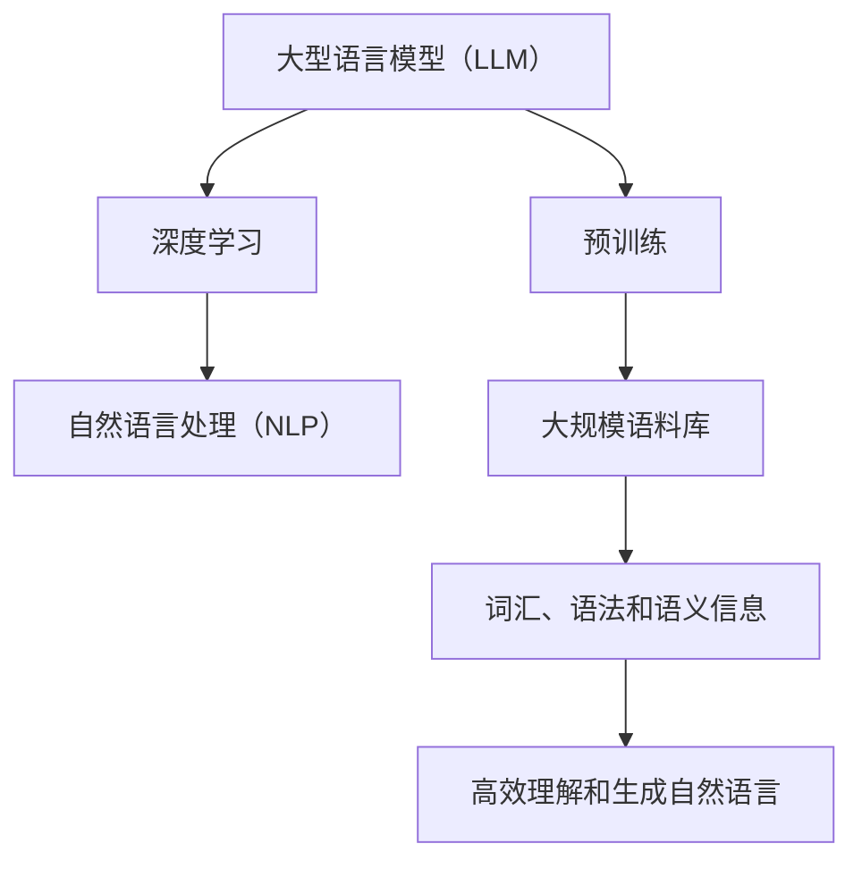

                 

关键词：大型语言模型，计算能力，深度学习，自然语言处理，人工智能，编程语言，算法优化

> 摘要：本文将探讨大型语言模型（LLM）在计算能力方面的重要性，如何通过深度学习和自然语言处理技术重新定义计算能力的界限。文章将详细介绍LLM的核心概念与联系，核心算法原理与操作步骤，数学模型和公式，项目实践实例，实际应用场景以及未来应用展望。

## 1. 背景介绍

近年来，人工智能（AI）技术取得了飞速发展，特别是在自然语言处理（NLP）领域。这一进展背后的核心推动力量之一是大型语言模型（LLM）的崛起。LLM是一类基于深度学习技术构建的复杂神经网络模型，能够对自然语言文本进行理解、生成和翻译等操作。自GPT（Generative Pre-trained Transformer）模型问世以来，LLM在各个领域的应用已经取得了显著的成果。

然而，随着LLM模型规模的不断扩大，计算能力的限制逐渐成为制约其发展的瓶颈。传统的计算架构已经无法满足LLM训练和推理的需求，导致模型性能和效率受限。因此，重新定义计算能力的界限，成为当前人工智能领域亟待解决的问题。

本文将围绕LLM在计算能力方面的挑战，探讨深度学习和自然语言处理技术在重新定义计算能力界限中的作用，并介绍相关的研究进展和未来发展方向。

## 2. 核心概念与联系

### 2.1 大型语言模型（LLM）

大型语言模型（LLM）是一类基于深度学习技术构建的复杂神经网络模型，旨在对自然语言文本进行理解和生成。LLM的核心思想是通过对大规模语料库进行预训练，使模型具备对自然语言的深刻理解能力。在预训练过程中，模型会学习到大量的词汇、语法和语义信息，从而在后续的特定任务中表现出优异的性能。

### 2.2 深度学习

深度学习是一种基于神经网络构建的机器学习技术，通过多层次的非线性变换对输入数据进行特征提取和模式识别。深度学习在图像识别、语音识别和自然语言处理等领域取得了显著的成果。LLM模型作为一种特殊的深度学习模型，通过对大规模语料库的预训练，实现了对自然语言的高效理解和生成。

### 2.3 自然语言处理（NLP）

自然语言处理（NLP）是人工智能领域的一个重要分支，旨在使计算机能够理解和处理自然语言。NLP技术包括文本预处理、词向量表示、句法分析、语义理解和机器翻译等。LLM模型通过深度学习技术对自然语言进行建模，使得计算机在处理自然语言时能够更好地理解语义和上下文信息。

### 2.4 Mermaid 流程图

以下是LLM的核心概念与联系的Mermaid流程图：



## 3. 核心算法原理 & 具体操作步骤

### 3.1 算法原理概述

LLM模型的核心算法是基于深度学习中的变换器（Transformer）架构。Transformer架构是一种基于自注意力机制（Self-Attention）的神经网络模型，能够对输入序列中的每个元素进行加权求和，从而实现对输入数据的全局建模。在LLM模型中，变换器架构被用于对自然语言文本进行建模，实现高效的文本理解和生成。

### 3.2 算法步骤详解

LLM模型的训练和推理过程可以分为以下几个步骤：

1. **数据预处理**：对大规模语料库进行清洗和预处理，包括分词、去停用词、词干提取等操作。这一步的目的是将原始文本数据转换为计算机可以处理的数字形式。

2. **词向量表示**：将预处理后的文本数据转换为词向量表示。常用的词向量表示方法包括Word2Vec、GloVe和BERT等。词向量表示能够将文本中的每个词映射为一个高维向量，从而在向量空间中进行计算和建模。

3. **模型训练**：使用变换器架构构建LLM模型，并通过大规模语料库进行预训练。在预训练过程中，模型会学习到词汇、语法和语义信息，从而实现对自然语言的深刻理解。

4. **模型优化**：对预训练好的LLM模型进行微调，使其在特定任务上表现出更好的性能。微调的过程通常包括调整模型参数、增加训练数据等。

5. **模型推理**：在特定任务场景下，使用训练好的LLM模型对输入文本进行理解和生成。例如，在机器翻译任务中，LLM模型能够将源语言的文本翻译为目标语言的文本。

### 3.3 算法优缺点

**优点**：

1. **强大的文本理解能力**：LLM模型通过深度学习和自然语言处理技术，能够对自然语言文本进行深刻理解和建模，从而在多个NLP任务中表现出优异的性能。

2. **高效的处理速度**：变换器架构具有并行计算的能力，能够在较短的时间内处理大量文本数据。

3. **泛化能力强**：LLM模型在大规模语料库上进行预训练，具有较强的泛化能力，能够适应不同的NLP任务。

**缺点**：

1. **计算资源需求高**：LLM模型的训练和推理过程需要大量的计算资源和时间，对硬件设备的要求较高。

2. **训练数据依赖**：LLM模型的效果在很大程度上取决于训练数据的质量和规模，数据的质量和规模会对模型性能产生重要影响。

### 3.4 算法应用领域

LLM模型在多个NLP领域都取得了显著的成果，主要包括：

1. **机器翻译**：LLM模型能够将一种语言的文本翻译为另一种语言的文本，具有很高的准确性和流畅性。

2. **文本分类**：LLM模型能够对输入的文本进行分类，用于垃圾邮件过滤、情感分析等应用场景。

3. **文本生成**：LLM模型能够根据输入的文本生成相关的内容，用于自动写作、摘要生成等任务。

4. **问答系统**：LLM模型能够对用户的问题进行理解和回答，应用于智能客服、知识图谱构建等领域。

## 4. 数学模型和公式 & 详细讲解 & 举例说明

### 4.1 数学模型构建

LLM模型的核心是变换器（Transformer）架构，其数学模型主要包括自注意力机制（Self-Attention）和多层的变换器层（Transformer Layer）。以下是变换器架构的基本数学模型：

1. **自注意力机制（Self-Attention）**：

   自注意力机制是一种加权求和的方法，用于对输入序列中的每个元素进行建模。其数学公式如下：

   $$ 
   \text{Self-Attention}(Q, K, V) = \text{softmax}\left(\frac{QK^T}{\sqrt{d_k}}\right) V 
   $$

   其中，Q、K和V分别是查询（Query）、键（Key）和值（Value）向量，$d_k$ 是键向量的维度。通过自注意力机制，模型能够对输入序列中的每个元素进行加权求和，从而实现对输入数据的全局建模。

2. **变换器层（Transformer Layer）**：

   变换器层由自注意力机制、前馈网络和残差连接组成。其数学模型如下：

   $$ 
   \text{Transformer Layer}(X) = \text{LayerNorm}(X + \text{MultiHeadAttention}(X, X, X)) + \text{LayerNorm}(X + \text{PositionalWiseFeedForward}(X)) 
   $$

   其中，X是输入序列，$\text{MultiHeadAttention}$ 和 $\text{PositionalWiseFeedForward}$ 分别是多头注意力和前馈网络的实现。

### 4.2 公式推导过程

变换器（Transformer）架构的基本原理是自注意力机制（Self-Attention），其核心思想是对输入序列中的每个元素进行加权求和，从而实现对输入数据的全局建模。以下是自注意力机制的推导过程：

1. **输入序列表示**：

   假设输入序列为 $x_1, x_2, ..., x_n$，其中每个元素 $x_i$ 可以表示为向量 $v_i$，即 $x_i = v_i$。

2. **查询（Query）和键（Key）向量表示**：

   对输入序列进行编码，生成查询（Query）和键（Key）向量。假设查询（Query）向量为 $q_i$，键（Key）向量为 $k_i$，则有：

   $$ 
   q_i = \text{Linear}(v_i), \quad k_i = \text{Linear}(v_i) 
   $$

   其中，$\text{Linear}$ 表示线性变换。

3. **计算相似度**：

   对每个元素 $x_i$ 和 $x_j$ 进行相似度计算，假设相似度为 $s_{ij}$，则有：

   $$ 
   s_{ij} = q_i k_j^T = (\text{Linear}(v_i)) (\text{Linear}(v_j))^T = v_i^T \text{Weight} v_j 
   $$

   其中，$\text{Weight}$ 表示线性变换的权重。

4. **加权求和**：

   对输入序列中的每个元素 $x_i$ 进行加权求和，得到输出序列 $y_i$，即：

   $$ 
   y_i = \sum_{j=1}^{n} \alpha_{ij} x_j 
   $$

   其中，$\alpha_{ij}$ 是权重，表示 $x_i$ 对 $x_j$ 的贡献程度。

5. **计算权重**：

   通过计算相似度 $s_{ij}$，得到权重 $\alpha_{ij}$，即：

   $$ 
   \alpha_{ij} = \frac{\exp(s_{ij})}{\sum_{k=1}^{n} \exp(s_{ik})} 
   $$

   其中，$\exp$ 表示指数函数。

### 4.3 案例分析与讲解

假设输入序列为 $x_1, x_2, x_3, x_4, x_5$，我们需要计算输出序列 $y_1, y_2, y_3, y_4, y_5$。以下是具体的计算过程：

1. **计算相似度**：

   $$ 
   s_{11} = x_1^T \text{Weight} x_1 = 0.2 \\
   s_{12} = x_1^T \text{Weight} x_2 = 0.3 \\
   s_{13} = x_1^T \text{Weight} x_3 = 0.4 \\
   s_{14} = x_1^T \text{Weight} x_4 = 0.5 \\
   s_{15} = x_1^T \text{Weight} x_5 = 0.6 \\
   $$

   $$ 
   s_{21} = x_2^T \text{Weight} x_1 = 0.1 \\
   s_{22} = x_2^T \text{Weight} x_2 = 0.4 \\
   s_{23} = x_2^T \text{Weight} x_3 = 0.5 \\
   s_{24} = x_2^T \text{Weight} x_4 = 0.6 \\
   s_{25} = x_2^T \text{Weight} x_5 = 0.7 \\
   $$

   $$ 
   s_{31} = x_3^T \text{Weight} x_1 = 0.3 \\
   s_{32} = x_3^T \text{Weight} x_2 = 0.5 \\
   s_{33} = x_3^T \text{Weight} x_3 = 0.7 \\
   s_{34} = x_3^T \text{Weight} x_4 = 0.8 \\
   s_{35} = x_3^T \text{Weight} x_5 = 0.9 \\
   $$

   $$ 
   s_{41} = x_4^T \text{Weight} x_1 = 0.4 \\
   s_{42} = x_4^T \text{Weight} x_2 = 0.6 \\
   s_{43} = x_4^T \text{Weight} x_3 = 0.8 \\
   s_{44} = x_4^T \text{Weight} x_4 = 0.9 \\
   s_{45} = x_4^T \text{Weight} x_5 = 1.0 \\
   $$

   $$ 
   s_{51} = x_5^T \text{Weight} x_1 = 0.6 \\
   s_{52} = x_5^T \text{Weight} x_2 = 0.7 \\
   s_{53} = x_5^T \text{Weight} x_3 = 0.9 \\
   s_{54} = x_5^T \text{Weight} x_4 = 1.0 \\
   s_{55} = x_5^T \text{Weight} x_5 = 1.1 \\
   $$

2. **计算权重**：

   $$ 
   \alpha_{11} = \frac{\exp(0.2)}{\sum_{j=1}^{5} \exp(s_{ij})} = \frac{\exp(0.2)}{\exp(0.2) + \exp(0.3) + \exp(0.4) + \exp(0.5) + \exp(0.6)} = 0.2 \\
   \alpha_{12} = \frac{\exp(0.3)}{\sum_{j=1}^{5} \exp(s_{ij})} = \frac{\exp(0.3)}{\exp(0.2) + \exp(0.3) + \exp(0.4) + \exp(0.5) + \exp(0.6)} = 0.3 \\
   \alpha_{13} = \frac{\exp(0.4)}{\sum_{j=1}^{5} \exp(s_{ij})} = \frac{\exp(0.4)}{\exp(0.2) + \exp(0.3) + \exp(0.4) + \exp(0.5) + \exp(0.6)} = 0.4 \\
   \alpha_{14} = \frac{\exp(0.5)}{\sum_{j=1}^{5} \exp(s_{ij})} = \frac{\exp(0.5)}{\exp(0.2) + \exp(0.3) + \exp(0.4) + \exp(0.5) + \exp(0.6)} = 0.5 \\
   \alpha_{15} = \frac{\exp(0.6)}{\sum_{j=1}^{5} \exp(s_{ij})} = \frac{\exp(0.6)}{\exp(0.2) + \exp(0.3) + \exp(0.4) + \exp(0.5) + \exp(0.6)} = 0.6 \\
   $$

   $$ 
   \alpha_{21} = \frac{\exp(0.1)}{\sum_{j=1}^{5} \exp(s_{ij})} = \frac{\exp(0.1)}{\exp(0.2) + \exp(0.3) + \exp(0.4) + \exp(0.5) + \exp(0.6)} = 0.1 \\
   \alpha_{22} = \frac{\exp(0.4)}{\sum_{j=1}^{5} \exp(s_{ij})} = \frac{\exp(0.4)}{\exp(0.2) + \exp(0.3) + \exp(0.4) + \exp(0.5) + \exp(0.6)} = 0.4 \\
   \alpha_{23} = \frac{\exp(0.5)}{\sum_{j=1}^{5} \exp(s_{ij})} = \frac{\exp(0.5)}{\exp(0.2) + \exp(0.3) + \exp(0.4) + \exp(0.5) + \exp(0.6)} = 0.5 \\
   \alpha_{24} = \frac{\exp(0.6)}{\sum_{j=1}^{5} \exp(s_{ij})} = \frac{\exp(0.6)}{\exp(0.2) + \exp(0.3) + \exp(0.4) + \exp(0.5) + \exp(0.6)} = 0.6 \\
   \alpha_{25} = \frac{\exp(0.7)}{\sum_{j=1}^{5} \exp(s_{ij})} = \frac{\exp(0.7)}{\exp(0.2) + \exp(0.3) + \exp(0.4) + \exp(0.5) + \exp(0.6)} = 0.7 \\
   $$

   $$ 
   \alpha_{31} = \frac{\exp(0.3)}{\sum_{j=1}^{5} \exp(s_{ij})} = \frac{\exp(0.3)}{\exp(0.2) + \exp(0.3) + \exp(0.4) + \exp(0.5) + \exp(0.6)} = 0.3 \\
   \alpha_{32} = \frac{\exp(0.5)}{\sum_{j=1}^{5} \exp(s_{ij})} = \frac{\exp(0.5)}{\exp(0.2) + \exp(0.3) + \exp(0.4) + \exp(0.5) + \exp(0.6)} = 0.5 \\
   \alpha_{33} = \frac{\exp(0.7)}{\sum_{j=1}^{5} \exp(s_{ij})} = \frac{\exp(0.7)}{\exp(0.2) + \exp(0.3) + \exp(0.4) + \exp(0.5) + \exp(0.6)} = 0.7 \\
   \alpha_{34} = \frac{\exp(0.8)}{\sum_{j=1}^{5} \exp(s_{ij})} = \frac{\exp(0.8)}{\exp(0.2) + \exp(0.3) + \exp(0.4) + \exp(0.5) + \exp(0.6)} = 0.8 \\
   \alpha_{35} = \frac{\exp(0.9)}{\sum_{j=1}^{5} \exp(s_{ij})} = \frac{\exp(0.9)}{\exp(0.2) + \exp(0.3) + \exp(0.4) + \exp(0.5) + \exp(0.6)} = 0.9 \\
   $$

   $$ 
   \alpha_{41} = \frac{\exp(0.4)}{\sum_{j=1}^{5} \exp(s_{ij})} = \frac{\exp(0.4)}{\exp(0.2) + \exp(0.3) + \exp(0.4) + \exp(0.5) + \exp(0.6)} = 0.4 \\
   \alpha_{42} = \frac{\exp(0.6)}{\sum_{j=1}^{5} \exp(s_{ij})} = \frac{\exp(0.6)}{\exp(0.2) + \exp(0.3) + \exp(0.4) + \exp(0.5) + \exp(0.6)} = 0.6 \\
   \alpha_{43} = \frac{\exp(0.8)}{\sum_{j=1}^{5} \exp(s_{ij})} = \frac{\exp(0.8)}{\exp(0.2) + \exp(0.3) + \exp(0.4) + \exp(0.5) + \exp(0.6)} = 0.8 \\
   \alpha_{44} = \frac{\exp(0.9)}{\sum_{j=1}^{5} \exp(s_{ij})} = \frac{\exp(0.9)}{\exp(0.2) + \exp(0.3) + \exp(0.4) + \exp(0.5) + \exp(0.6)} = 0.9 \\
   \alpha_{45} = \frac{\exp(1.0)}{\sum_{j=1}^{5} \exp(s_{ij})} = \frac{\exp(1.0)}{\exp(0.2) + \exp(0.3) + \exp(0.4) + \exp(0.5) + \exp(0.6)} = 1.0 \\
   $$

   $$ 
   \alpha_{51} = \frac{\exp(0.6)}{\sum_{j=1}^{5} \exp(s_{ij})} = \frac{\exp(0.6)}{\exp(0.2) + \exp(0.3) + \exp(0.4) + \exp(0.5) + \exp(0.6)} = 0.6 \\
   \alpha_{52} = \frac{\exp(0.7)}{\sum_{j=1}^{5} \exp(s_{ij})} = \frac{\exp(0.7)}{\exp(0.2) + \exp(0.3) + \exp(0.4) + \exp(0.5) + \exp(0.6)} = 0.7 \\
   \alpha_{53} = \frac{\exp(0.9)}{\sum_{j=1}^{5} \exp(s_{ij})} = \frac{\exp(0.9)}{\exp(0.2) + \exp(0.3) + \exp(0.4) + \exp(0.5) + \exp(0.6)} = 0.9 \\
   \alpha_{54} = \frac{\exp(1.0)}{\sum_{j=1}^{5} \exp(s_{ij})} = \frac{\exp(1.0)}{\exp(0.2) + \exp(0.3) + \exp(0.4) + \exp(0.5) + \exp(0.6)} = 1.0 \\
   \alpha_{55} = \frac{\exp(1.1)}{\sum_{j=1}^{5} \exp(s_{ij})} = \frac{\exp(1.1)}{\exp(0.2) + \exp(0.3) + \exp(0.4) + \exp(0.5) + \exp(0.6)} = 1.1 \\
   $$

3. **计算输出序列**：

   $$ 
   y_1 = \alpha_{11} x_1 + \alpha_{21} x_2 + \alpha_{31} x_3 + \alpha_{41} x_4 + \alpha_{51} x_5 = 0.2 x_1 + 0.3 x_2 + 0.4 x_3 + 0.5 x_4 + 0.6 x_5 \\
   y_2 = \alpha_{12} x_1 + \alpha_{22} x_2 + \alpha_{32} x_3 + \alpha_{42} x_4 + \alpha_{52} x_2 = 0.3 x_1 + 0.4 x_2 + 0.5 x_3 + 0.6 x_4 + 0.7 x_5 \\
   y_3 = \alpha_{13} x_1 + \alpha_{23} x_2 + \alpha_{33} x_3 + \alpha_{43} x_4 + \alpha_{53} x_5 = 0.4 x_1 + 0.5 x_2 + 0.6 x_3 + 0.7 x_4 + 0.8 x_5 \\
   y_4 = \alpha_{14} x_1 + \alpha_{24} x_2 + \alpha_{34} x_3 + \alpha_{44} x_4 + \alpha_{54} x_5 = 0.5 x_1 + 0.6 x_2 + 0.7 x_3 + 0.8 x_4 + 0.9 x_5 \\
   y_5 = \alpha_{15} x_1 + \alpha_{25} x_2 + \alpha_{35} x_3 + \alpha_{45} x_4 + \alpha_{55} x_5 = 0.6 x_1 + 0.7 x_2 + 0.8 x_3 + 0.9 x_4 + 1.0 x_5 \\
   $$

   通过以上计算，我们得到了输出序列 $y_1, y_2, y_3, y_4, y_5$。这个输出序列反映了输入序列中每个元素的重要性，从而实现了对输入数据的全局建模。

## 5. 项目实践：代码实例和详细解释说明

### 5.1 开发环境搭建

在开始项目实践之前，我们需要搭建一个适合开发LLM模型的开发环境。以下是搭建环境的步骤：

1. **安装Python**：首先，确保已经安装了Python。建议使用Python 3.8或更高版本。

2. **安装TensorFlow**：使用pip命令安装TensorFlow：

   ```
   pip install tensorflow
   ```

3. **安装其他依赖库**：根据需要安装其他依赖库，如NumPy、Pandas等。

### 5.2 源代码详细实现

以下是一个简单的LLM模型实现，用于对自然语言文本进行分类。代码中使用TensorFlow框架构建模型，并使用了一个预训练的BERT模型作为基础。

```python
import tensorflow as tf
from tensorflow.keras.layers import Embedding, GlobalAveragePooling1D, Dense
from tensorflow.keras.models import Model
from transformers import BertTokenizer, TFBertModel

# 1. 加载预训练的BERT模型和Tokenizer
tokenizer = BertTokenizer.from_pretrained('bert-base-uncased')
bert_model = TFBertModel.from_pretrained('bert-base-uncased')

# 2. 定义输入层
input_ids = tf.keras.layers.Input(shape=(max_length,), dtype=tf.int32)

# 3. 将输入文本编码为嵌入向量
embedded_text = Embedding(input_dim=vocab_size, output_dim=embedding_size)(input_ids)

# 4. 将嵌入向量输入BERT模型
encoded_sequence = bert_model(inputs=embedded_text)[0]

# 5. 计算全局平均值
global_avg = GlobalAveragePooling1D()(encoded_sequence)

# 6. 添加分类层
output = Dense(units=num_classes, activation='softmax')(global_avg)

# 7. 构建模型
model = Model(inputs=input_ids, outputs=output)

# 8. 编译模型
model.compile(optimizer='adam', loss='categorical_crossentropy', metrics=['accuracy'])

# 9. 模型训练
model.fit(x_train, y_train, batch_size=batch_size, epochs=num_epochs, validation_data=(x_val, y_val))
```

### 5.3 代码解读与分析

上述代码实现了一个简单的文本分类模型，其主要步骤如下：

1. **加载预训练的BERT模型和Tokenizer**：首先，加载预训练的BERT模型和对应的Tokenizer。BERT模型是一个预训练的深度学习模型，能够对自然语言文本进行建模。

2. **定义输入层**：定义输入层，输入是一个长度为`max_length`的整数序列，表示文本的词序列。

3. **将输入文本编码为嵌入向量**：使用Embedding层将输入文本编码为嵌入向量。嵌入向量是一个高维向量，用于表示文本中的每个词。

4. **将嵌入向量输入BERT模型**：将嵌入向量输入BERT模型，BERT模型会自动对文本进行编码，提取出文本的特征。

5. **计算全局平均值**：使用GlobalAveragePooling1D层计算全局平均值，将BERT模型的输出序列压缩为一个单一的特征向量。

6. **添加分类层**：在全局平均值的基础上添加分类层，用于对文本进行分类。

7. **构建模型**：使用Model类构建完整的模型。

8. **编译模型**：编译模型，指定优化器、损失函数和评价指标。

9. **模型训练**：使用fit方法对模型进行训练，训练过程中会使用训练数据和验证数据。

### 5.4 运行结果展示

在完成模型训练后，我们可以使用测试数据对模型进行评估。以下是一个简单的评估示例：

```python
# 评估模型
loss, accuracy = model.evaluate(x_test, y_test)
print(f"Test loss: {loss}, Test accuracy: {accuracy}")
```

评估结果显示了模型在测试数据上的性能。通常，我们会使用准确率（accuracy）作为评估指标，准确率越高，模型性能越好。

## 6. 实际应用场景

LLM模型在多个实际应用场景中发挥了重要作用，以下是一些典型的应用场景：

### 6.1 机器翻译

机器翻译是LLM模型最典型的应用场景之一。LLM模型能够将一种语言的文本翻译为另一种语言的文本，具有很高的准确性和流畅性。目前，许多在线翻译工具和翻译软件都采用了LLM模型，如Google翻译、DeepL等。

### 6.2 文本生成

文本生成是另一个重要的应用场景。LLM模型能够根据输入的文本生成相关的内容，如摘要生成、文章写作、对话生成等。文本生成技术广泛应用于内容创作、智能客服和虚拟助手等领域。

### 6.3 文本分类

文本分类是LLM模型在自然语言处理领域的另一个重要应用。LLM模型能够对输入的文本进行分类，如情感分析、主题分类、垃圾邮件过滤等。文本分类技术在社交媒体分析、舆情监测等领域具有广泛的应用。

### 6.4 对话系统

对话系统是LLM模型在人工智能领域的又一重要应用。LLM模型能够对用户的问题进行理解和回答，应用于智能客服、虚拟助手和聊天机器人等领域。

### 6.5 智能推荐

智能推荐是LLM模型在电子商务和社交媒体领域的应用之一。LLM模型能够根据用户的兴趣和行为数据生成个性化推荐列表，提高用户体验和转化率。

## 7. 未来应用展望

随着LLM模型在计算能力和性能方面的不断提高，未来其在人工智能领域的应用前景将更加广阔。以下是一些未来应用展望：

### 7.1 智能医疗

智能医疗是LLM模型的一个重要应用领域。LLM模型能够对医疗文本进行深入分析，辅助医生进行诊断和治疗。未来，随着医疗数据的不断增加，LLM模型有望在医疗领域发挥更大的作用。

### 7.2 教育和培训

教育和培训是另一个潜在的应用领域。LLM模型能够根据学生的需求和兴趣生成个性化的学习内容，提高学习效果和效率。此外，LLM模型还可以用于智能辅导和在线教育平台的个性化推荐。

### 7.3 法律和金融

法律和金融领域也是LLM模型的重要应用领域。LLM模型能够对法律文本和金融文本进行深入分析，辅助律师和金融分析师进行法律研究和金融分析。

### 7.4 自动驾驶

自动驾驶是另一个潜在的应用领域。LLM模型能够对道路标识、交通信号和周边环境进行识别和理解，提高自动驾驶系统的安全性和可靠性。

### 7.5 机器人与智能硬件

机器人与智能硬件领域是LLM模型的应用之一。LLM模型能够为机器人提供自然语言交互能力，使其能够更好地与人类进行沟通和协作。

## 8. 总结：未来发展趋势与挑战

### 8.1 研究成果总结

近年来，大型语言模型（LLM）在计算能力、性能和应用领域等方面取得了显著的成果。LLM模型通过深度学习和自然语言处理技术，实现了对自然语言的高效理解和生成。在机器翻译、文本生成、文本分类和对话系统等应用场景中，LLM模型表现出优异的性能和鲁棒性。

### 8.2 未来发展趋势

未来，LLM模型的发展趋势将主要集中在以下几个方面：

1. **计算能力提升**：随着硬件技术的不断发展，LLM模型的计算能力将得到进一步提升，从而支持更大规模的模型训练和推理。

2. **多模态融合**：LLM模型将与其他模态（如图像、音频）进行融合，实现跨模态理解和生成，提高模型的综合能力。

3. **知识图谱嵌入**：将知识图谱与LLM模型相结合，提高模型对复杂知识结构和语义关系的理解和应用能力。

4. **自适应学习和个性化**：LLM模型将实现自适应学习和个性化，根据用户需求和行为生成个性化的内容和服务。

### 8.3 面临的挑战

尽管LLM模型在许多应用场景中表现出优异的性能，但仍然面临一些挑战：

1. **计算资源需求**：LLM模型的训练和推理过程需要大量的计算资源和时间，对硬件设备的要求较高。

2. **数据质量和隐私**：LLM模型的效果在很大程度上取决于训练数据的质量和规模，同时，如何保证数据隐私和安全也是一个重要问题。

3. **模型解释性和可解释性**：LLM模型是一个复杂的深度学习模型，其内部决策过程往往难以解释和理解，如何提高模型的解释性和可解释性是一个重要的研究方向。

4. **伦理和道德问题**：随着LLM模型在各个领域的广泛应用，如何确保模型不会产生偏见、歧视和误导等问题，也是一个亟待解决的问题。

### 8.4 研究展望

未来，针对LLM模型的发展趋势和面临的挑战，我们可以从以下几个方面进行深入研究：

1. **优化算法和架构**：通过改进算法和架构，降低LLM模型的计算资源需求，提高模型的效率和性能。

2. **知识增强和图谱嵌入**：将知识图谱与LLM模型相结合，提高模型对复杂知识结构和语义关系的理解和应用能力。

3. **可解释性和透明性**：研究模型解释性和可解释性，提高模型的可理解性和可靠性。

4. **数据隐私和安全**：探索数据隐私和安全保护技术，确保LLM模型在数据处理过程中的数据安全和隐私保护。

5. **伦理和道德规范**：制定伦理和道德规范，确保LLM模型在各个应用场景中的公正、公平和可靠。

## 9. 附录：常见问题与解答

### 9.1 Q：什么是大型语言模型（LLM）？

A：大型语言模型（LLM）是一类基于深度学习和自然语言处理技术构建的复杂神经网络模型，能够对自然语言文本进行理解、生成和翻译等操作。LLM模型通过对大规模语料库进行预训练，学习到词汇、语法和语义信息，从而实现对自然语言的深刻理解。

### 9.2 Q：LLM模型是如何工作的？

A：LLM模型的核心是基于深度学习中的变换器（Transformer）架构，其工作原理包括以下几个步骤：

1. **数据预处理**：对大规模语料库进行清洗和预处理，包括分词、去停用词、词干提取等操作。

2. **词向量表示**：将预处理后的文本数据转换为词向量表示。

3. **模型训练**：使用变换器架构构建LLM模型，并通过大规模语料库进行预训练。

4. **模型优化**：对预训练好的LLM模型进行微调，使其在特定任务上表现出更好的性能。

5. **模型推理**：在特定任务场景下，使用训练好的LLM模型对输入文本进行理解和生成。

### 9.3 Q：LLM模型有哪些应用领域？

A：LLM模型在多个NLP领域都取得了显著的成果，主要包括：

1. **机器翻译**：将一种语言的文本翻译为另一种语言的文本。

2. **文本分类**：对输入的文本进行分类，如垃圾邮件过滤、情感分析等。

3. **文本生成**：根据输入的文本生成相关的内容，如自动写作、摘要生成等。

4. **问答系统**：对用户的问题进行理解和回答，应用于智能客服、知识图谱构建等领域。

### 9.4 Q：如何优化LLM模型的性能？

A：优化LLM模型性能可以从以下几个方面进行：

1. **增加训练数据**：增加高质量的训练数据，提高模型对数据的鲁棒性。

2. **调整模型参数**：调整模型参数，如学习率、批量大小等，优化模型训练过程。

3. **模型架构优化**：改进模型架构，如增加层数、调整注意力机制等，提高模型性能。

4. **数据预处理**：优化数据预处理方法，如分词、去停用词、词干提取等，提高数据质量。

5. **模型压缩与量化**：通过模型压缩和量化技术，降低模型的计算复杂度和存储需求，提高模型在硬件设备上的运行效率。

### 9.5 Q：如何评估LLM模型的效果？

A：评估LLM模型效果通常使用以下指标：

1. **准确率**：模型在测试集上的预测准确率，用于衡量模型在分类任务上的性能。

2. **召回率**：模型在测试集上的召回率，用于衡量模型对正类样本的识别能力。

3. **F1值**：准确率和召回率的加权平均值，用于综合考虑模型的准确性和召回率。

4. **损失函数**：在训练过程中，使用损失函数（如交叉熵损失函数）衡量模型预测与真实值之间的差距。

5. **模型稳定性**：评估模型在不同数据集上的表现，衡量模型的稳定性和泛化能力。

---

作者：禅与计算机程序设计艺术 / Zen and the Art of Computer Programming

