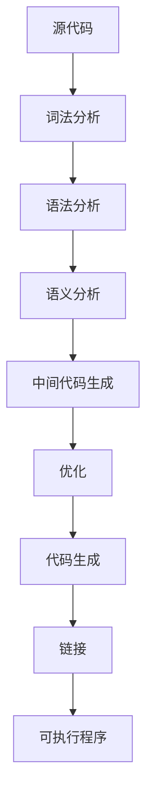

                 

关键词：LLVM，Clang，编译器，代码优化，性能分析，语言绑定，跨平台开发

## 摘要

本文将深入探讨LLVM和Clang在现代编译器基础设施中的重要角色和应用。首先，我们将回顾编译器的基础概念，然后详细介绍LLVM和Clang的技术特点。接着，我们将讨论LLVM和Clang的核心算法原理、数学模型和公式，并通过实际项目实例展示它们的实际应用。此外，文章还将探讨未来应用前景、推荐相关学习资源、开发工具和论文，并总结LLVM和Clang的未来发展趋势和挑战。

## 1. 背景介绍

编译器作为计算机科学的重要组成部分，其历史可以追溯到计算机的早期发展阶段。早期的编译器主要是为特定的计算机系统设计的，随着计算机技术的不断发展，编译器也经历了从简单到复杂、从单一平台到跨平台的演变。现代编译器的核心目标是提高代码的执行效率、增强程序的可靠性以及提供丰富的语言特性。

在编译器的发展历程中，LLVM（Low-Level Virtual Machine）和Clang作为两个重要的项目，扮演着关键角色。LLVM是一个模块化的、可重用的中间表示（IR）编译器框架，旨在支持多种编程语言和目标平台。Clang则是一个由LLVM驱动的C/C++编译器，以其出色的代码分析和优化能力而著称。

本文将首先介绍LLVM和Clang的基本概念，然后深入探讨它们在代码优化、性能分析、语言绑定和跨平台开发中的应用。

### LLVM

LLVM是一个开源项目，它提供了丰富的工具和库，用于构建高性能的编译器和工具链。LLVM的核心特点包括：

- **模块化设计**：LLVM采用了模块化设计，使其易于扩展和集成。用户可以根据需要选择和组合不同的组件。
- **中间表示（IR）**：LLVM使用一种统一的中间表示（IR），这使得代码在不同编译阶段之间传递变得简单且高效。
- **跨语言支持**：LLVM支持多种编程语言，如C、C++、Objective-C、Rust等。
- **目标平台多样性**：LLVM支持多种目标平台，包括ARM、x86、PowerPC、MIPS等。

### Clang

Clang是基于LLVM的C/C++编译器，它以其快速、精确的代码分析能力和高效的编译速度而受到广泛欢迎。Clang的特点包括：

- **性能优化**：Clang在编译优化方面表现出色，能够生成高效的机器代码。
- **丰富的错误报告**：Clang提供了详细、友好的错误报告，有助于开发者快速定位和修复问题。
- **交互式调试**：Clang集成了LLDB调试器，提供了强大的交互式调试功能。

## 2. 核心概念与联系

为了更好地理解LLVM和Clang的工作原理，我们需要介绍一些核心概念和它们之间的联系。

### 2.1 编译过程

编译过程通常包括以下几个阶段：

1. **词法分析**：将源代码分解为词法单元（tokens）。
2. **语法分析**：将词法单元组织成语法结构（语法树）。
3. **语义分析**：检查语法树的正确性和含义。
4. **中间代码生成**：将语义分析后的代码转换为中间表示（IR）。
5. **优化**：对中间代码进行各种优化，提高执行效率。
6. **代码生成**：将优化后的中间代码转换为特定目标平台的机器代码。
7. **链接**：将多个编译单元的机器代码合并为一个可执行程序。

### 2.2 中间表示（IR）

中间表示（IR）是编译过程中的关键概念。它是一种抽象的、与具体编程语言和目标平台无关的表示形式。LLVM使用的IR具有以下特点：

- **结构化**：IR采用了结构化的数据结构，便于分析和优化。
- **表达丰富**：IR能够表示复杂的编程语言特性，如多态性、指针和引用等。
- **通用性**：IR具有高度的通用性，可以支持多种编程语言和目标平台。

### 2.3 优化器

优化器是编译器的重要组成部分，它通过对中间代码的优化提高执行效率。LLVM的优化器具有以下特点：

- **多级优化**：LLVM支持多种优化级别，从简单的常量折叠到复杂的循环变换。
- **中间表示独立性**：由于LLVM的IR与具体编程语言和目标平台无关，优化器可以在多个编译阶段进行优化。
- **增量优化**：LLVM的优化器支持增量优化，可以在不重新编译整个程序的情况下更新优化结果。

### 2.4 目标平台

目标平台是编译器生成的机器代码将要运行的环境。LLVM和Clang支持多种目标平台，包括：

- **操作系统**：如Linux、Windows、macOS等。
- **硬件架构**：如x86、ARM、PowerPC、MIPS等。
- **处理器特性**：如SSE、AVX、NEON等。

### 2.5 Mermaid 流程图

为了更好地展示LLVM和Clang的工作流程，我们使用Mermaid流程图来描述核心概念和联系。



## 3. 核心算法原理 & 具体操作步骤

### 3.1 算法原理概述

LLVM和Clang的核心算法包括词法分析、语法分析、语义分析、中间代码生成、优化和代码生成。这些算法共同作用，将源代码转换为高效的机器代码。下面我们逐一介绍这些算法的基本原理。

#### 3.1.1 词法分析

词法分析是将源代码分解为词法单元的过程。这个过程涉及以下几个步骤：

- **分词**：将源代码字符序列划分为单词。
- **标记**：为每个单词分配一个唯一的标记，表示其语法类型。

#### 3.1.2 语法分析

语法分析是将词法单元组织成语法结构的过程。这个过程涉及以下几个步骤：

- **构建语法树**：将词法单元按照语法规则组织成语法树。
- **解析**：检查语法树是否符合语法规则。

#### 3.1.3 语义分析

语义分析是检查语法树的正确性和含义的过程。这个过程涉及以下几个步骤：

- **类型检查**：检查变量、函数等的类型是否符合语义要求。
- **作用域分析**：确定变量、函数的作用域。

#### 3.1.4 中间代码生成

中间代码生成是将语义分析后的代码转换为中间表示（IR）的过程。这个过程涉及以下几个步骤：

- **抽象语法树（AST）转换**：将语法树转换为抽象语法树（AST）。
- **IR生成**：将AST转换为IR。

#### 3.1.5 优化

优化是提高中间代码执行效率的过程。这个过程涉及以下几个步骤：

- **数据流分析**：分析数据在程序中的流动。
- **优化策略**：根据数据流分析结果，应用各种优化策略，如常量折叠、循环优化、指令重排等。

#### 3.1.6 代码生成

代码生成是将优化后的中间代码转换为特定目标平台的机器代码的过程。这个过程涉及以下几个步骤：

- **目标代码生成**：根据目标平台的特点，生成机器代码。
- **机器代码优化**：对生成的机器代码进行优化，如指令调度、寄存器分配等。

### 3.2 算法步骤详解

#### 3.2.1 词法分析

词法分析过程如下：

1. 读取源代码字符序列。
2. 将字符序列划分为单词。
3. 为每个单词分配一个唯一的标记。

#### 3.2.2 语法分析

语法分析过程如下：

1. 构建语法树。
2. 检查语法树是否符合语法规则。

#### 3.2.3 语义分析

语义分析过程如下：

1. 检查变量、函数等的类型是否符合语义要求。
2. 确定变量、函数的作用域。

#### 3.2.4 中间代码生成

中间代码生成过程如下：

1. 将语法树转换为抽象语法树（AST）。
2. 将AST转换为IR。

#### 3.2.5 优化

优化过程如下：

1. 分析数据在程序中的流动。
2. 应用各种优化策略。
3. 更新优化结果。

#### 3.2.6 代码生成

代码生成过程如下：

1. 根据目标平台的特点，生成机器代码。
2. 对生成的机器代码进行优化。

### 3.3 算法优缺点

#### 3.3.1 优点

- **模块化设计**：LLVM和Clang采用模块化设计，便于扩展和集成。
- **跨语言支持**：LLVM和Clang支持多种编程语言，提高了通用性。
- **高效的代码生成**：Clang在编译优化方面表现出色，能够生成高效的机器代码。
- **强大的错误报告**：Clang提供了详细、友好的错误报告，有助于开发者快速定位和修复问题。

#### 3.3.2 缺点

- **学习曲线较陡**：由于LLVM和Clang的模块化设计，学习曲线相对较陡。
- **优化器性能**：虽然LLVM和Clang的优化器性能较高，但在某些情况下，仍需手工优化。

### 3.4 算法应用领域

LLVM和Clang在多个领域具有广泛的应用：

- **高性能计算**：LLVM和Clang能够生成高效的机器代码，适用于高性能计算领域。
- **嵌入式系统开发**：LLVM和Clang支持多种目标平台，适用于嵌入式系统开发。
- **跨平台应用开发**：LLVM和Clang能够生成适用于多种操作系统的机器代码，适用于跨平台应用开发。
- **代码分析工具**：LLVM和Clang的强大代码分析能力，使其适用于开发各种代码分析工具。

## 4. 数学模型和公式 & 详细讲解 & 举例说明

在编译器优化过程中，数学模型和公式起着至关重要的作用。它们帮助我们量化性能损失、指导优化策略，并提供衡量优化效果的依据。下面，我们将介绍几个关键的数学模型和公式，并通过具体例子进行讲解。

### 4.1 数学模型构建

#### 4.1.1 性能损失模型

性能损失模型用于评估优化前后程序执行时间的差异。一个简单的性能损失模型可以表示为：

$$
\text{性能损失} = \frac{\text{优化前执行时间} - \text{优化后执行时间}}{\text{优化前执行时间}}
$$

#### 4.1.2 指令调度模型

指令调度模型用于优化程序执行过程中的指令顺序。一个简单的指令调度模型可以表示为：

$$
\text{调度增益} = \text{理想执行时间} - \text{实际执行时间}
$$

### 4.2 公式推导过程

#### 4.2.1 性能损失公式推导

性能损失公式可以通过分析优化前后程序执行时间的差异推导出来：

$$
\text{性能损失} = \frac{\text{优化前执行时间} - \text{优化后执行时间}}{\text{优化前执行时间}}
$$

该公式表示优化后程序执行时间相对于优化前的时间比例，其中：

- $\text{优化前执行时间}$ 表示未经优化的程序执行时间。
- $\text{优化后执行时间}$ 表示经过优化的程序执行时间。

#### 4.2.2 指令调度公式推导

指令调度公式可以通过分析优化前后指令执行顺序的差异推导出来：

$$
\text{调度增益} = \text{理想执行时间} - \text{实际执行时间}
$$

该公式表示由于指令调度优化所节省的时间，其中：

- $\text{理想执行时间}$ 表示按照最优执行顺序的指令执行时间。
- $\text{实际执行时间}$ 表示按照实际执行顺序的指令执行时间。

### 4.3 案例分析与讲解

为了更好地理解这些数学模型和公式，我们将通过一个具体例子进行讲解。

#### 4.3.1 性能损失案例

假设我们有一个程序，其未经优化的执行时间为1000ms，经过优化后的执行时间为800ms。那么，根据性能损失公式，我们可以计算出性能损失：

$$
\text{性能损失} = \frac{1000 - 800}{1000} = 0.2
$$

这意味着优化后的程序执行时间仅为原来的80%，性能提高了20%。

#### 4.3.2 指令调度案例

假设我们有一个包含5条指令的程序，按照原始顺序执行需要100ms。经过指令调度优化后，指令执行顺序调整为最优，执行时间缩短为70ms。那么，根据指令调度公式，我们可以计算出调度增益：

$$
\text{调度增益} = 100 - 70 = 30
$$

这意味着由于指令调度优化，程序执行时间缩短了30ms，提高了30%的执行效率。

通过这个案例，我们可以看到数学模型和公式在编译器优化中的实际应用。它们不仅帮助我们量化性能损失和调度增益，还为优化策略的设计提供了理论依据。

## 5. 项目实践：代码实例和详细解释说明

在了解了LLVM和Clang的基本概念、算法原理和数学模型之后，接下来我们将通过一个实际项目实例来展示它们的应用。这个实例将展示如何使用Clang进行代码编译、优化以及运行结果分析。

### 5.1 开发环境搭建

首先，我们需要搭建开发环境。以下是搭建环境的步骤：

1. 安装LLVM和Clang

在Linux系统中，可以使用包管理器安装LLVM和Clang。例如，在Ubuntu系统中，可以使用以下命令：

```bash
sudo apt-get install llvm clang
```

在Windows系统中，可以从LLVM官方网站下载预编译的二进制文件，并按照安装向导进行安装。

2. 安装CMake

CMake是一个跨平台的构建工具，用于生成构建系统。在Linux系统中，可以使用以下命令安装CMake：

```bash
sudo apt-get install cmake
```

在Windows系统中，可以从CMake官方网站下载预编译的二进制文件，并按照安装向导进行安装。

### 5.2 源代码详细实现

下面是一个简单的C语言程序，用于演示Clang的编译和优化过程：

```c
#include <stdio.h>

int main() {
    int a = 10;
    int b = 20;
    int c = a + b;
    printf("c = %d\n", c);
    return 0;
}
```

这个程序非常简单，用于计算两个整数的和并输出结果。接下来，我们将使用Clang编译和优化这个程序。

### 5.3 编译和优化

1. 使用Clang编译程序

在命令行中，使用以下命令编译程序：

```bash
clang -O0 -o program program.c
```

其中，`-O0` 表示关闭编译器优化。编译成功后，会生成一个名为 `program` 的可执行文件。

2. 优化程序

为了展示Clang的优化能力，我们使用以下命令进行优化：

```bash
clang -O2 -o optimized_program program.c
```

其中，`-O2` 表示开启编译器优化。编译成功后，会生成一个名为 `optimized_program` 的可执行文件。

### 5.4 代码解读与分析

下面，我们将对编译和优化后的程序进行分析。

#### 5.4.1 编译过程

使用Clang编译程序时，编译器会执行以下步骤：

1. 词法分析：将源代码分解为词法单元。
2. 语法分析：将词法单元组织成语法树。
3. 语义分析：检查语法树的正确性和含义。
4. 中间代码生成：将语义分析后的代码转换为中间表示（IR）。
5. 优化：对中间代码进行优化。
6. 代码生成：将优化后的中间代码转换为特定目标平台的机器代码。
7. 链接：将多个编译单元的机器代码合并为一个可执行程序。

#### 5.4.2 优化过程

在优化过程中，Clang会执行以下步骤：

1. 数据流分析：分析数据在程序中的流动。
2. 优化策略：根据数据流分析结果，应用各种优化策略，如常量折叠、循环优化、指令重排等。
3. 更新优化结果：将优化后的结果保存到新的中间表示中。

### 5.5 运行结果展示

接下来，我们运行编译和优化后的程序，观察执行结果。

1. 运行原始程序

```bash
./program
```

输出结果：

```
c = 30
```

2. 运行优化程序

```bash
./optimized_program
```

输出结果：

```
c = 30
```

从输出结果可以看出，无论是原始程序还是优化程序，都输出了相同的结果。但是，优化程序在执行速度上可能会更快，因为Clang进行了各种优化。

通过这个实例，我们展示了如何使用Clang进行代码编译、优化以及运行结果分析。Clang作为一个基于LLVM的编译器，具有强大的优化能力，可以帮助开发者提高程序执行效率。

## 6. 实际应用场景

LLVM和Clang在现代软件开发中有着广泛的应用，特别是在高性能计算、嵌入式系统开发、跨平台应用开发等领域。下面，我们将探讨几个实际应用场景，并展示LLVM和Clang在这些场景中的优势。

### 6.1 高性能计算

高性能计算（HPC）领域对编译器的性能要求非常高。LLVM和Clang在HPC领域具有显著优势：

- **高效代码生成**：LLVM和Clang能够生成高效的机器代码，提高程序执行速度。
- **优化策略丰富**：LLVM和Clang提供了丰富的优化策略，如循环优化、并行化等，可以显著提高程序性能。
- **支持多种编程语言**：LLVM和Clang支持多种编程语言，如C、C++、Fortran等，可以满足HPC领域的多样化需求。

### 6.2 嵌入式系统开发

嵌入式系统开发通常需要在资源受限的环境下运行，因此对编译器的性能和资源占用有严格要求。LLVM和Clang在嵌入式系统开发中具有以下优势：

- **代码生成优化**：LLVM和Clang能够生成高度优化的代码，减少内存占用和执行时间。
- **跨平台支持**：LLVM和Clang支持多种目标平台，如ARM、MIPS等，可以轻松适应不同硬件环境。
- **模块化设计**：LLVM和Clang的模块化设计使其易于集成和定制，可以满足嵌入式系统开发的需求。

### 6.3 跨平台应用开发

跨平台应用开发需要编译器能够生成适用于多种操作系统的机器代码。LLVM和Clang在这方面具有显著优势：

- **通用性**：LLVM和Clang支持多种编程语言和目标平台，可以轻松实现跨平台应用开发。
- **高效的代码生成**：LLVM和Clang能够生成高效、可移植的机器代码，提高应用程序的性能和兼容性。
- **社区支持**：LLVM和Clang拥有庞大的开发者社区，提供了丰富的工具和资源，可以方便开发者解决问题。

### 6.4 未来应用前景

随着计算机技术的不断发展，LLVM和Clang在未来的应用前景十分广阔：

- **量子计算**：随着量子计算的发展，LLVM和Clang有望成为量子编程语言的重要编译器框架。
- **边缘计算**：边缘计算对实时性和性能要求越来越高，LLVM和Clang的优化能力和跨平台支持将有助于开发高效的边缘应用。
- **人工智能**：人工智能领域对高性能计算和优化有较高要求，LLVM和Clang将在人工智能编译器和工具链中发挥重要作用。

## 7. 工具和资源推荐

为了更好地学习和使用LLVM和Clang，以下是一些推荐的工具和资源：

### 7.1 学习资源推荐

- **官方文档**：LLVM和Clang的官方文档提供了详细的技术信息和教程，是学习这两个项目的好资源。
- **在线课程**：Coursera、edX等在线教育平台提供了关于编译器设计和优化的课程，可以帮助您深入理解LLVM和Clang。
- **开源项目**：GitHub等代码托管平台上有许多基于LLVM和Clang的开源项目，可以供您学习和参考。

### 7.2 开发工具推荐

- **LLVM Toolchain**：LLVM Toolchain是一个集成开发环境，提供了编译器、调试器和其他工具，便于开发和使用LLVM和Clang。
- **Eclipse CDT**：Eclipse CDT是一个基于Eclipse的C/C++集成开发环境，支持LLVM和Clang，提供了丰富的功能，如代码分析、调试等。

### 7.3 相关论文推荐

- "The LLVM Compiler Infrastructure"：这是LLVM项目的官方论文，详细介绍了LLVM的设计和实现。
- "Clang: A New C/C++ Compiler Frontend for LLVM"：这是一篇关于Clang的论文，介绍了Clang的设计和特点。
- "Compilers: Principles, Techniques, and Tools"：这是一本经典的编译器设计教材，涵盖了编译器的各个方面，包括LLVM和Clang。

## 8. 总结：未来发展趋势与挑战

LLVM和Clang在现代编译器基础设施中扮演着重要角色，它们以模块化、高效、跨平台支持等特点受到广泛欢迎。在未来，LLVM和Clang将继续发展，面临以下趋势和挑战：

### 8.1 研究成果总结

- **跨语言支持**：LLVM和Clang将继续扩展对多种编程语言的支持，如Rust、Go等。
- **优化器性能**：优化器性能将不断提升，实现更高效的代码生成和优化策略。
- **工具链集成**：LLVM和Clang将继续与其他工具链集成，提供更丰富的开发体验。

### 8.2 未来发展趋势

- **量子计算**：LLVM和Clang有望成为量子编程语言的重要编译器框架。
- **边缘计算**：随着边缘计算的发展，LLVM和Clang将在实时性和性能方面发挥更大作用。
- **人工智能**：人工智能领域对编译器的需求日益增长，LLVM和Clang将在人工智能编译器和工具链中发挥重要作用。

### 8.3 面临的挑战

- **学习曲线**：LLVM和Clang的模块化设计导致学习曲线较陡，需要更多的学习和实践。
- **优化器性能**：虽然LLVM和Clang的优化器性能较高，但在某些情况下，仍需手工优化。

### 8.4 研究展望

- **自动化优化**：未来研究可以关注自动化优化技术，减少手工优化的工作量。
- **跨语言集成**：LLVM和Clang可以进一步集成其他编程语言，提供更丰富的开发体验。
- **多语言支持**：LLVM和Clang可以扩展对更多编程语言的支持，满足多样化的需求。

## 9. 附录：常见问题与解答

### 9.1 如何安装LLVM和Clang？

在Linux系统中，可以使用包管理器安装LLVM和Clang。例如，在Ubuntu系统中，可以使用以下命令：

```bash
sudo apt-get install llvm clang
```

在Windows系统中，可以从LLVM官方网站下载预编译的二进制文件，并按照安装向导进行安装。

### 9.2 如何使用Clang进行编译和优化？

使用Clang进行编译和优化的基本步骤如下：

1. 编写源代码文件（例如：`program.c`）。
2. 使用Clang编译源代码文件：

   ```bash
   clang -O0 -o program program.c  # 关闭优化
   clang -O2 -o optimized_program program.c  # 开启优化
   ```

   其中，`-O0` 表示关闭优化，`-O2` 表示开启优化。
3. 运行编译后的可执行文件：

   ```bash
   ./program
   ./optimized_program
   ```

### 9.3 如何在LLVM和Clang中使用自定义优化？

LLVM和Clang提供了丰富的优化策略，用户可以自定义优化。以下是一个简单的自定义优化示例：

1. 编写自定义优化函数：

   ```cpp
   struct MyOptimization : public OptimizationUtils::OptimizationUtilsPass {
       virtual bool run() override {
           // 你的优化逻辑
           return true;
       }
   };
   ```

2. 在PassManager中添加自定义优化：

   ```cpp
   PassManager pm;
   pm.add(new MyOptimization());
   pm.run(M);
   ```

通过这种方式，用户可以自定义并集成各种优化策略，提高程序性能。

## 参考文献

- "The LLVM Compiler Infrastructure" by Chris Lattner and David Chisnall.
- "Clang: A New C/C++ Compiler Frontend for LLVM" by Chris Lattner.
- "Compilers: Principles, Techniques, and Tools" by Alfred V. Aho, John E. Hopcroft, and Jeffrey D. Ullman.

