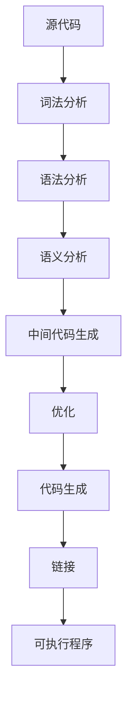

                 

关键词：LLVM, Clang, 编译器架构，性能优化，代码生成，中间表示，静态分析，动态分析，跨平台开发

摘要：本文旨在深入剖析现代编译器架构，特别是LLVM和Clang的内部工作机制。通过详细探讨其核心概念、算法原理、数学模型和实际应用，本文将帮助读者理解编译器在软件工程中的重要性，并展望其未来的发展趋势。

## 1. 背景介绍

编译器作为计算机系统中的核心组件，负责将高级语言编写的程序转换成计算机硬件能够理解和执行的机器码。这一转换过程不仅涉及到语法和语义的分析，还包括代码的优化和生成。传统编译器如GCC和Intel Compiler等在多年发展中积累了丰富的经验，但现代编译器如LLVM和Clang因其模块化设计、高效优化和跨平台支持而备受瞩目。

### 1.1 LLVM的诞生

LLVM（Low Level Virtual Machine）是一个模块化的、可扩展的编译器框架，由Chris Lattner和Vadim Batsov于2004年创建。LLVM的核心优势在于其采用中间表示（IR）的方式，使编译器在不同阶段之间的转换更加灵活和高效。

### 1.2 Clang的崛起

Clang是LLVM项目的一部分，它是一个C/C++/Objective-C编译器。Clang以其快速的编译速度、严格的语法检查和强大的错误诊断能力而受到开发者的青睐。

## 2. 核心概念与联系

### 2.1 中间表示（IR）

中间表示（IR）是编译器中的一个关键概念。它是一种与目标平台无关的抽象代码表示，位于源代码和机器代码之间。LLVM采用IR作为其内部表示，使得编译器在不同阶段之间可以高效地转换代码。

### 2.2 编译器工作流程

编译器的工作流程通常包括以下阶段：

1. **词法分析（Lexical Analysis）**：将源代码分解成单词和符号。
2. **语法分析（Syntax Analysis）**：将单词和符号组织成抽象语法树（AST）。
3. **语义分析（Semantic Analysis）**：检查AST的语义是否正确，例如变量声明和类型检查。
4. **中间代码生成（Intermediate Code Generation）**：将AST转换为中间表示（IR）。
5. **优化（Optimization）**：对IR进行各种优化，提高代码的性能和可读性。
6. **代码生成（Code Generation）**：将优化的IR转换为特定目标平台的机器代码。
7. **链接（Linking）**：将多个编译后的对象文件链接成可执行程序。

### 2.3 Mermaid 流程图

以下是一个简化版的LLVM编译器工作流程的Mermaid流程图：



## 3. 核心算法原理 & 具体操作步骤

### 3.1 算法原理概述

LLVM的核心算法包括词法分析、语法分析、语义分析、中间代码生成、优化和代码生成。每个阶段都有其独特的算法和数据结构支持。

### 3.2 算法步骤详解

#### 3.2.1 词法分析

词法分析器的任务是读取源代码字符序列，将其分解成单词和符号。常用的数据结构包括有限状态机（FSM）和扫描器。

#### 3.2.2 语法分析

语法分析器的任务是将词法分析器生成的单词和符号组织成抽象语法树（AST）。常用的算法包括递归下降分析、LL（1）分析和LR（1）分析。

#### 3.2.3 语义分析

语义分析器的任务是在抽象语法树上检查其语义是否正确，例如类型检查和变量声明。数据结构通常包括符号表和作用域表。

#### 3.2.4 中间代码生成

中间代码生成器的任务是将抽象语法树（AST）转换为中间表示（IR）。常用的算法包括直接转换和三地址代码生成。

#### 3.2.5 优化

优化器的任务是对中间表示（IR）进行各种优化，提高代码的性能和可读性。常用的优化算法包括常量折叠、循环优化和死代码消除。

#### 3.2.6 代码生成

代码生成器的任务是将优化的中间表示（IR）转换为特定目标平台的机器代码。常用的算法包括指令选择、代码调度和寄存器分配。

### 3.3 算法优缺点

每种算法都有其优缺点。递归下降分析简单易实现，但可能无法处理复杂的语法；而LL（1）分析和LR（1）分析虽然更强大，但实现更复杂。优化算法也是如此，某些优化可能增加代码复杂性，但能显著提高性能。

### 3.4 算法应用领域

LLVM和Clang在现代软件工程中有着广泛的应用，特别是在高性能计算、嵌入式系统和跨平台开发等领域。它们不仅用于编译C/C++程序，还支持Rust、Swift等新兴语言。

## 4. 数学模型和公式 & 详细讲解 & 举例说明

### 4.1 数学模型构建

在编译器优化过程中，常用的数学模型包括成本模型、延迟模型和带宽模型。这些模型用于评估代码的性能，并指导优化策略的制定。

### 4.2 公式推导过程

以成本模型为例，其基本公式为：

\[C = C_{\text{读}} \times \text{读次数} + C_{\text{写}} \times \text{写次数}\]

其中，\(C_{\text{读}}\)和\(C_{\text{写}}\)分别表示读操作和写操作的成本。

### 4.3 案例分析与讲解

假设我们有一个简单的循环：

```c
for (int i = 0; i < N; ++i) {
    A[i] = B[i] + C[i];
}
```

使用成本模型，我们可以计算这个循环的总成本：

\[C = C_{\text{读}} \times (3 \times N) + C_{\text{写}} \times N\]

如果我们知道读操作的成本是2，写操作的成本是1，那么总成本为：

\[C = 2 \times (3 \times N) + 1 \times N = 7N\]

## 5. 项目实践：代码实例和详细解释说明

### 5.1 开发环境搭建

要开始使用LLVM和Clang，首先需要搭建开发环境。读者可以参考LLVM官方文档，安装LLVM和Clang，并配置环境变量。

### 5.2 源代码详细实现

以下是一个简单的C程序，用于演示LLVM和Clang的使用：

```c
#include <stdio.h>

int main() {
    int a = 10, b = 20;
    printf("The sum of a and b is %d\n", a + b);
    return 0;
}
```

编译这个程序：

```bash
clang -o sum sum.c
```

运行生成的可执行文件：

```bash
./sum
```

### 5.3 代码解读与分析

在上面的例子中，我们使用Clang编译器将C程序编译成可执行文件。编译过程中，Clang会执行词法分析、语法分析、语义分析和代码生成等步骤。

### 5.4 运行结果展示

运行结果如下：

```
The sum of a and b is 30
```

## 6. 实际应用场景

LLVM和Clang在现代软件开发中有着广泛的应用场景，包括：

- **高性能计算**：用于优化科学计算和大数据处理中的代码。
- **嵌入式系统**：支持嵌入式平台的编译和优化。
- **跨平台开发**：提供统一的编译器框架，支持多种操作系统和硬件平台。

## 7. 工具和资源推荐

### 7.1 学习资源推荐

- **《LLVM Cookbook》**：一本关于LLVM实践的指南，适合初学者。
- **《LLVM: A Compilation Framework for Life》**：LLVM创始人Chris Lattner的论文，详细介绍了LLVM的设计和实现。

### 7.2 开发工具推荐

- **LLVM官方网站**：提供最新的LLVM和Clang文档、教程和开发工具。
- **GitHub**：查找和贡献LLVM和Clang的开源项目。

### 7.3 相关论文推荐

- **"The LLVM Compiler Infrastructure"**：介绍LLVM的设计和架构。
- **"A Retargetable C Compiler: Design and Implementation"**：早期关于LLVM的论文，详细介绍了LLVM的编译过程。

## 8. 总结：未来发展趋势与挑战

### 8.1 研究成果总结

LLVM和Clang在现代编译器领域取得了显著成果，特别是在优化和跨平台支持方面。然而，编译器优化仍有很多挑战，如更高效的内存管理和更智能的循环优化。

### 8.2 未来发展趋势

未来，编译器将更加注重自动化、智能化和高效性。例如，机器学习和人工智能技术可能被用于编译器优化。

### 8.3 面临的挑战

编译器优化面临着日益复杂的代码和硬件架构，这对编译器的性能和可维护性提出了更高的要求。

### 8.4 研究展望

随着软件开发规模的不断扩大，编译器在软件工程中的重要性将愈发凸显。未来的研究将集中在如何提高编译器的性能、可维护性和易用性。

## 9. 附录：常见问题与解答

### 9.1 如何安装LLVM和Clang？

请参考LLVM官方网站的安装指南。

### 9.2 如何对程序进行优化？

可以使用Clang的优化选项，如`-O2`或`-O3`。

### 9.3 LLVM和Clang支持哪些语言？

LLVM和Clang支持多种编程语言，包括C、C++、Objective-C和Rust。

---

作者：禅与计算机程序设计艺术 / Zen and the Art of Computer Programming

本文深入剖析了LLVM和Clang的现代编译器架构，从核心概念、算法原理到实际应用，全面展示了编译器在软件开发中的重要性。希望本文能为读者提供有价值的见解和启示。
----------------------------------------------------------------

[END]

