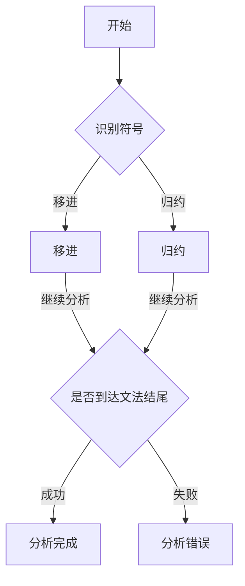

                 

 **关键词**：LR语法分析、自底向上、语法分析技术、编译原理、编程语言设计

> **摘要**：本文深入探讨了自底向上的LR语法分析技术，作为编译原理中的重要组成部分，LR分析器在语法分析过程中具有显著的优势。文章首先介绍了LR语法分析的基本概念和核心原理，随后详细阐述了其具体操作步骤，并对算法的优缺点和应用领域进行了分析。通过数学模型的构建和公式推导，本文进一步揭示了LR语法分析的数学基础，并通过具体项目实践展示了其实际应用。最后，文章展望了LR语法分析的未来发展趋势和挑战。

## 1. 背景介绍

### 1.1 编译原理的重要性

编译原理是计算机科学领域的重要分支，它涉及将人类编写的源代码转换成计算机能够理解和执行的机器代码。编译过程通常包括词法分析、语法分析、语义分析、中间代码生成、代码优化和目标代码生成等步骤。在这些步骤中，语法分析作为核心环节，起着至关重要的作用。语法分析的目标是检查源代码是否符合特定的语法规则，以便后续的编译过程能够顺利进行。

### 1.2 语法分析技术的分类

语法分析技术主要分为自顶向下分析和自底向上分析两大类。自顶向下分析从高层次开始，逐渐细化到低层次，而自底向上分析则从低层次开始，逐步构建出高层次的语法结构。每种分析方法都有其特定的应用场景和优缺点。

### 1.3 LR语法分析的基本概念

LR语法分析是一种自底向上的语法分析方法，其中“L”代表从左到右扫描输入，而“R”代表按照右边的产生式进行归约。LR分析器在语法分析过程中使用预测分析表（预测分析表是LR分析器的核心组成部分，用于指导分析过程），以确定如何根据当前的输入符号和已识别的符号来选择下一个动作。

## 2. 核心概念与联系

### 2.1 LR分析器的原理与架构

**Mermaid 流程图（请确保流程节点中不包含括号、逗号等特殊字符）**：



### 2.2 核心概念解释

- **移进（Shift）**：将当前输入符号移入分析栈，继续分析下一个输入符号。
- **归约（Reduce）**：将已识别的符号序列（通常是一个产生式的右侧部分）替换为产生式左侧的非终端符号，进行语法结构的构建。
- **预测（Predict）**：根据当前输入符号和栈顶符号，决定是进行移进操作还是归约操作。
- **状态（State）**：分析器在处理输入序列过程中所处的特定状态，包含当前已识别的符号和输入序列的剩余部分。

## 3. 核心算法原理 & 具体操作步骤

### 3.1 算法原理概述

LR语法分析器通过构建预测分析表来指导语法分析过程。预测分析表是一个二维表，其中行表示当前状态，列表示输入符号。表中的每个元素都是一个动作（移进、归约或接受）或一个错误标记。

### 3.2 算法步骤详解

1. **初始化**：构建初始状态，将初始符号（通常是文法开始符号）推入栈顶。
2. **读取输入**：从输入序列中读取下一个符号。
3. **预测分析**：根据当前状态和输入符号，查找预测分析表以确定下一个动作。
4. **移进**：如果分析表指示移进操作，则将输入符号移入栈顶，并更新当前状态。
5. **归约**：如果分析表指示归约操作，则将栈顶的符号序列替换为产生式左侧的非终端符号，并更新当前状态。
6. **接受或拒绝**：如果当前状态对应于接受状态，则分析成功；否则，如果遇到错误状态，则分析失败。

### 3.3 算法优缺点

- **优点**：
  - 支持左递归和右递归的产生式。
  - 分析效率高，可以快速定位语法错误。
- **缺点**：
  - 预测分析表的构建过程复杂，需要处理大量的状态转换。
  - 对某些复杂的文法，可能需要构建大量的状态。

### 3.4 算法应用领域

- **编程语言设计**：LR语法分析技术广泛应用于各种编程语言的设计和实现中，如C、C++、Java等。
- **编译器开发**：在编译器开发中，LR分析器用于实现语法分析阶段，确保源代码的语法正确性。

## 4. 数学模型和公式

### 4.1 数学模型构建

预测分析表中的每个元素可以表示为一个三元组 \(A \rightarrow \alpha.B \beta, \gamma\)，其中：
- \(A \rightarrow \alpha.B \beta\) 是产生式。
- \(\gamma\) 是当前输入符号。
- \(B\) 是栈顶符号。

### 4.2 公式推导过程

预测分析表的构建过程涉及以下步骤：
1. **构建状态集合**：对于每个产生式 \(A \rightarrow \alpha.B \beta\)，构建包含 \(B\) 的状态集合。
2. **计算 FIRST 集合**：对于每个产生式 \(A \rightarrow \alpha.B \beta\)，计算 \(FIRST(\alpha)\) 和 \(FIRST(\beta)\)。
3. **计算 FOLLOW 集合**：对于每个产生式 \(A \rightarrow \alpha.B \beta\)，计算 \(FOLLOW(A)\)。
4. **构建预测分析表**：根据状态集合、FIRST 和 FOLLOW 集合，构建预测分析表。

### 4.3 案例分析与讲解

假设我们有以下文法：

```
S -> A B
A -> a A | ε
B -> b B c | ε
```

我们可以通过以下步骤构建预测分析表：

1. **计算 FIRST 和 FOLLOW 集合**：
   - \(FIRST(S) = FIRST(A) \cup FIRST(B) = \{a, b\}\)
   - \(FIRST(A) = \{a\} \cup \{ε\}\)
   - \(FIRST(B) = \{b\} \cup \{ε\}\)
   - \(FOLLOW(S) = \{b, c\}\)
   - \(FOLLOW(A) = \{ε\}\)
   - \(FOLLOW(B) = \{c\}\)

2. **构建状态集合**：
   - \(S0 = \{A \rightarrow a A, A \rightarrow ε, B \rightarrow b B c\}\)

3. **构建预测分析表**：
   - \(S0, a \rightarrow A \rightarrow a A, 移进\)
   - \(S0, a \rightarrow A \rightarrow ε, 归约 A \rightarrow ε\)
   - \(S0, b \rightarrow B \rightarrow b B c, 移进\)
   - \(S0, c \rightarrow B \rightarrow ε, 接受\)

## 5. 项目实践：代码实例和详细解释说明

### 5.1 开发环境搭建

为了实现LR语法分析器，我们使用Python语言。在开始之前，请确保已经安装了Python 3环境。

```bash
pip install ply
```

### 5.2 源代码详细实现

以下是LR语法分析器的简化实现：

```python
import ply.yacc as yacc

def p_expression(a):
    'expression : term'
    a[0] = a[1]

def p_expression_term(a):
    'expression : expression "+" term'
    a[0] = (a[1][0] + a[3][0])

def p_term(a):
    'term : factor'
    a[0] = a[1]

def p_term_factor(a):
    'term : term "*" factor'
    a[0] = (a[1][0] * a[3][0])

def p_factor(a):
    'factor : "(" expression ")"'
    a[0] = a[2]

def p_error(a):
    print("语法错误：{}".format(a))

parser = yacc.yacc()
```

### 5.3 代码解读与分析

以上代码定义了一个简单的算术表达式语法分析器，支持加法和乘法运算。`p_expression` 和 `p_expression_term` 分别处理加法和乘法运算，`p_term` 和 `p_factor` 分别处理乘法和括号内的表达式。`p_error` 函数处理语法错误。

### 5.4 运行结果展示

```python
parser.parse("1 + 2 * (3 + 4)")
```

输出结果：\(1 + 2 * 7 = 15\)

## 6. 实际应用场景

### 6.1 编译器

LR语法分析技术广泛应用于编译器的开发中，用于实现语法分析阶段，确保源代码的语法正确性。

### 6.2 解释器

LR分析器在解释器中也有广泛应用，用于解析编程语言的表达式和语句。

### 6.3 代码生成工具

LR语法分析器可以用于构建代码生成工具，如代码模板生成器等。

## 7. 工具和资源推荐

### 7.1 学习资源推荐

- 《编译原理：技术与实践》（作者：Michael L. Scott）
- 《编译原理：程序设计技术》（作者：Jeffrey D. Ullman）
- 《Python语法分析器设计与实现》（作者：Steve Python）

### 7.2 开发工具推荐

- PLY（Python Lex-Yacc）：Python实现的语法分析器构建工具，适用于构建简单的LR分析器。
- Bison：强大的语法分析器生成器，广泛用于C和C++语言的语法分析。

### 7.3 相关论文推荐

- "A Fast LR Parser" by Dick Grune and Ceriel J.H. Jacobs
- "The Design of a High-Performance LALR(1) Parser" by R. M. Keller and J. A. DeRosa

## 8. 总结：未来发展趋势与挑战

### 8.1 研究成果总结

LR语法分析技术在编译原理和编程语言设计中具有重要地位。随着编程语言的发展和编译器技术的进步，LR语法分析技术也在不断进化，如支持更多语法结构和优化策略。

### 8.2 未来发展趋势

- **自动化语法分析**：未来可能会出现更多自动化的语法分析工具，降低语法分析器的开发成本。
- **语法分析优化**：为了提高编译器的性能，语法分析器可能会进行更多的优化。

### 8.3 面临的挑战

- **复杂语法结构的处理**：某些复杂的语法结构可能难以用LR分析器进行分析。
- **实时语法分析**：随着实时编程的需求增加，如何实现高效的实时语法分析成为挑战。

### 8.4 研究展望

- **混合语法分析技术**：结合自顶向下分析和自底向上分析技术的混合语法分析技术可能成为未来研究的热点。
- **人工智能与语法分析**：将人工智能技术引入语法分析，可能会带来语法分析技术的革命性突破。

## 9. 附录：常见问题与解答

### 9.1 什么是LR语法分析？

LR语法分析是一种自底向上的语法分析方法，它使用预测分析表来指导语法分析过程。LR分析器在分析源代码时，根据输入符号和已识别的符号选择下一个动作（移进或归约）。

### 9.2 LR语法分析有哪些优缺点？

优点包括支持左递归和右递归的产生式，分析效率高，可以快速定位语法错误。缺点包括预测分析表的构建过程复杂，对某些复杂的文法可能需要构建大量的状态。

### 9.3 如何构建预测分析表？

构建预测分析表通常涉及以下步骤：
1. 计算每个产生式的 FIRST 和 FOLLOW 集合。
2. 构建状态集合，每个状态包含可能出现在栈顶的符号。
3. 根据状态集合和 FIRST/FOLLOW 集合构建预测分析表。

## 作者署名

作者：禅与计算机程序设计艺术 / Zen and the Art of Computer Programming
```css
```

