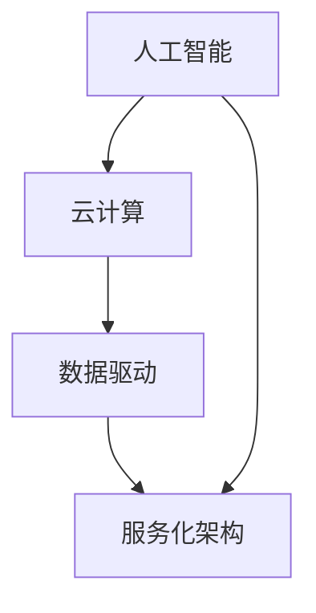

                 

关键词：AI时代、云计算、Lepton AI、架构设计、核心算法、数学模型、应用实践、未来展望

> 摘要：本文深入探讨Lepton AI作为AI时代第一朵云的架构设计、核心算法、数学模型及应用实践，旨在揭示其独特之处和未来发展的可能性。

## 1. 背景介绍

随着人工智能技术的飞速发展，云计算成为了支撑AI应用的重要基础设施。传统的云计算平台往往聚焦于提供通用的计算、存储和网络服务，而AI时代的云计算则要求更高的灵活性和智能化。Lepton AI应运而生，旨在打造AI时代的第一朵云，为AI应用提供定制化的基础设施和工具。

Lepton AI的愿景是成为AI时代的技术引擎，通过提供高效、灵活、智能的云计算服务，推动AI应用的普及和发展。它不仅提供强大的计算和存储资源，更注重AI算法和数据的整合，为用户提供一站式AI解决方案。

## 2. 核心概念与联系

Lepton AI的核心概念包括以下几个方面：

- **人工智能**：利用机器学习、深度学习等技术，让计算机模拟人类智能行为。
- **云计算**：通过网络提供动态易扩展的虚拟化资源，实现计算、存储、网络等基础设施的服务化。
- **数据驱动**：以数据为中心，通过数据分析和挖掘，实现智能化决策和优化。
- **服务化架构**：将AI算法、数据和基础设施打包成服务，提供灵活的部署和管理方式。

以下是一个简化的Mermaid流程图，展示了Lepton AI的核心概念及其相互联系：



### 2.1 人工智能与云计算的联系

人工智能和云计算的结合，使得AI应用可以充分利用云计算提供的弹性资源，实现高效计算和大规模数据处理。Lepton AI通过将AI算法与云计算深度整合，提供了如下优势：

- **弹性计算**：根据AI任务的需求，动态调整计算资源。
- **分布式处理**：支持大规模数据的分布式计算和分析。
- **资源调度**：智能调度计算资源，优化任务执行效率。

### 2.2 数据驱动与服务化架构的联系

数据驱动是Lepton AI的核心思想之一。通过数据分析和挖掘，可以实现业务优化、预测和决策。而服务化架构则使得这些数据驱动的功能可以灵活部署和管理。

- **数据集成**：将结构化、半结构化和非结构化数据集成到一个统一的平台。
- **数据治理**：确保数据的准确性和一致性，支持数据安全和隐私保护。
- **服务封装**：将数据分析和挖掘功能封装成服务，提供便捷的API接口。

## 3. 核心算法原理 & 具体操作步骤

### 3.1 算法原理概述

Lepton AI采用了多种核心算法，其中最关键的是基于深度学习的图像识别算法和基于强化学习的决策算法。这些算法共同构成了Lepton AI的智能核心。

- **深度学习图像识别算法**：利用深度神经网络，对图像进行分类和识别，实现图像内容的智能分析。
- **强化学习决策算法**：通过不断试错和反馈，实现智能体的最优策略学习。

### 3.2 算法步骤详解

#### 3.2.1 深度学习图像识别算法

1. **数据预处理**：对图像进行归一化、裁剪和增强，为模型训练准备高质量的数据集。
2. **模型构建**：搭建卷积神经网络（CNN）架构，包括卷积层、池化层和全连接层。
3. **模型训练**：使用预处理的图像数据，对CNN模型进行训练，优化模型参数。
4. **模型评估**：使用测试集对训练好的模型进行评估，调整模型参数，提升识别准确率。
5. **模型部署**：将训练好的模型部署到Lepton AI平台，为用户提供实时图像识别服务。

#### 3.2.2 强化学习决策算法

1. **环境搭建**：创建一个模拟环境，用于智能体的策略学习。
2. **状态空间定义**：定义智能体的状态空间，包括当前的状态、环境的状态等。
3. **动作空间定义**：定义智能体的动作空间，包括可执行的操作。
4. **奖励机制设计**：设计奖励机制，激励智能体采取最优策略。
5. **策略学习**：使用强化学习算法（如Q-learning、SARSA），智能体不断尝试各种动作，学习最优策略。
6. **策略优化**：根据智能体的反馈，优化策略，提升决策效果。

### 3.3 算法优缺点

#### 3.3.1 深度学习图像识别算法

优点：

- **高识别准确率**：通过深度神经网络的学习，图像识别算法可以达到很高的准确率。
- **通用性强**：适用于各种图像识别任务，如物体检测、人脸识别等。

缺点：

- **计算资源消耗大**：训练深度神经网络需要大量的计算资源和时间。
- **数据依赖性强**：算法的性能很大程度上依赖于数据的质量和数量。

#### 3.3.2 强化学习决策算法

优点：

- **自适应性强**：智能体可以根据环境和反馈不断优化策略，适应复杂环境。
- **灵活性高**：适用于各种决策场景，如游戏、推荐系统等。

缺点：

- **收敛速度慢**：强化学习算法通常需要较长的时间才能收敛到最优策略。
- **样本依赖性强**：算法的性能受到样本质量和数量的影响。

### 3.4 算法应用领域

Lepton AI的核心算法在多个领域具有广泛的应用：

- **智能安防**：利用图像识别算法，实现实时监控和异常检测。
- **自动驾驶**：利用图像识别和决策算法，实现车辆自动驾驶。
- **医疗诊断**：利用图像识别算法，辅助医生进行疾病诊断。
- **工业检测**：利用图像识别算法，实现生产线设备的智能监控。

## 4. 数学模型和公式 & 详细讲解 & 举例说明

### 4.1 数学模型构建

Lepton AI的数学模型主要基于深度学习和强化学习。以下分别介绍这两个领域的核心数学模型。

#### 4.1.1 深度学习

1. **卷积神经网络（CNN）**

   - **卷积层**：对输入图像进行卷积操作，提取特征。
   - **池化层**：对卷积后的特征进行池化操作，降低特征维度。
   - **全连接层**：将池化后的特征映射到输出结果。

2. **损失函数**

   - **交叉熵损失函数**：用于分类任务，衡量预测结果与真实结果之间的差距。

   $$ H(y, \hat{y}) = -\sum_{i} y_i \log(\hat{y}_i) $$

3. **优化算法**

   - **随机梯度下降（SGD）**：用于更新模型参数，最小化损失函数。

   $$ \theta = \theta - \alpha \nabla_{\theta} J(\theta) $$

#### 4.1.2 强化学习

1. **Q-learning算法**

   - **Q值**：表示智能体在某个状态采取某个动作的预期回报。

   $$ Q(s, a) = \sum_{s'} P(s' | s, a) \cdot R(s, a) + \gamma \sum_{a'} Q(s', a') $$

2. **策略迭代**

   - **策略评估**：通过迭代计算Q值，评估不同策略的优劣。

   $$ Q(s, a) = \sum_{s'} P(s' | s, a) \cdot [R(s, a) + \gamma \max_{a'} Q(s', a')] $$

   - **策略改进**：选择最优策略，进行下一步的迭代。

### 4.2 公式推导过程

#### 4.2.1 深度学习

1. **卷积层公式推导**

   假设输入图像为$X \in \mathbb{R}^{H \times W \times C}$，卷积核为$K \in \mathbb{R}^{K_H \times K_W \times C}$，偏置为$b \in \mathbb{R}^{1 \times 1 \times 1}$。

   - **卷积操作**：

   $$ \text{Conv}(X, K) = \sum_{c=1}^{C} K_{c} \cdot X $$

   - **激活函数**：

   $$ \text{ReLU}(x) = \max(0, x) $$

   - **池化操作**：

   $$ \text{Pooling}(X, P) = \sum_{p=1}^{P} X_{p} $$

2. **全连接层公式推导**

   假设卷积层输出的特征图为$F \in \mathbb{R}^{H' \times W' \times C'}$，全连接层的权重为$W \in \mathbb{R}^{H' \times W' \times C'}$，偏置为$b \in \mathbb{R}^{1 \times 1 \times C'}$。

   - **全连接层操作**：

   $$ \text{FC}(F, W, b) = W \cdot F + b $$

   - **激活函数**：

   $$ \text{ReLU}(x) = \max(0, x) $$

#### 4.2.2 强化学习

1. **Q-learning算法推导**

   假设状态空间为$S$，动作空间为$A$，Q值矩阵为$Q(s, a) \in \mathbb{R}^{H \times W}$。

   - **状态-动作对选择**：

   $$ a^* = \arg\max_{a \in A} Q(s, a) $$

   - **更新Q值**：

   $$ Q(s, a) = Q(s, a) + \alpha [R(s, a) + \gamma \max_{a'} Q(s', a') - Q(s, a)] $$

### 4.3 案例分析与讲解

#### 4.3.1 图像分类案例

假设我们使用一个简单的CNN模型对猫狗图像进行分类。

1. **数据预处理**：

   - 将图像大小调整为$224 \times 224 \times 3$。
   - 对图像进行归一化，使其像素值在$0$到$1$之间。

2. **模型构建**：

   - 构建一个包含两个卷积层、两个池化层和一个全连接层的CNN模型。
   - 使用ReLU作为激活函数。

3. **模型训练**：

   - 使用训练集对模型进行训练，优化模型参数。
   - 使用交叉熵损失函数和随机梯度下降（SGD）算法。

4. **模型评估**：

   - 使用测试集对训练好的模型进行评估，计算准确率。

#### 4.3.2 自动驾驶案例

假设我们使用强化学习算法实现自动驾驶。

1. **环境搭建**：

   - 创建一个模拟环境，包括道路、车辆和障碍物。
   - 定义智能体的状态空间和动作空间。

2. **策略学习**：

   - 使用Q-learning算法，智能体不断尝试各种动作，学习最优策略。
   - 根据反馈调整Q值，优化策略。

3. **策略优化**：

   - 选择最优策略，实现自动驾驶。

## 5. 项目实践：代码实例和详细解释说明

### 5.1 开发环境搭建

为了实践Lepton AI的算法和应用，我们需要搭建一个合适的开发环境。

1. **硬件环境**：

   - 一台配置较高的计算机或服务器，如Intel Xeon CPU、16GB内存等。
   - 显卡（可选，用于加速深度学习模型的训练）。

2. **软件环境**：

   - 操作系统：Ubuntu 18.04或更高版本。
   - 编程语言：Python 3.7或更高版本。
   - 深度学习框架：TensorFlow 2.0或更高版本。

### 5.2 源代码详细实现

以下是一个简单的示例代码，展示了如何使用TensorFlow实现一个简单的CNN模型进行图像分类。

```python
import tensorflow as tf
from tensorflow.keras import layers

# 定义CNN模型
model = tf.keras.Sequential([
    layers.Conv2D(32, (3, 3), activation='relu', input_shape=(224, 224, 3)),
    layers.MaxPooling2D((2, 2)),
    layers.Conv2D(64, (3, 3), activation='relu'),
    layers.MaxPooling2D((2, 2)),
    layers.Conv2D(64, (3, 3), activation='relu'),
    layers.Flatten(),
    layers.Dense(64, activation='relu'),
    layers.Dense(1, activation='sigmoid')
])

# 编译模型
model.compile(optimizer='adam', loss='binary_crossentropy', metrics=['accuracy'])

# 加载数据集
(x_train, y_train), (x_test, y_test) = tf.keras.datasets.dogs_vs_cats.load_data()

# 数据预处理
x_train = x_train.astype('float32') / 255
x_test = x_test.astype('float32') / 255
x_train = x_train.reshape((-1, 224, 224, 3))
x_test = x_test.reshape((-1, 224, 224, 3))

# 训练模型
model.fit(x_train, y_train, epochs=10, batch_size=32, validation_data=(x_test, y_test))

# 评估模型
model.evaluate(x_test, y_test)
```

### 5.3 代码解读与分析

1. **模型定义**：

   - 使用`tf.keras.Sequential`创建一个序列模型，包含两个卷积层、两个池化层和一个全连接层。
   - 卷积层用于提取图像特征，池化层用于降维，全连接层用于分类。

2. **模型编译**：

   - 使用`compile`方法配置模型，包括优化器、损失函数和评估指标。

3. **数据预处理**：

   - 加载数据集，并将图像数据转换为浮点数，进行归一化处理。
   - 调整图像大小，以满足模型的输入要求。

4. **模型训练**：

   - 使用`fit`方法训练模型，指定训练轮数、批量大小和验证数据。

5. **模型评估**：

   - 使用`evaluate`方法评估模型在测试集上的性能。

### 5.4 运行结果展示

1. **训练过程**：

   - 在每个训练轮次后，打印训练和验证的损失函数和准确率。

   ```python
   Epoch 1/10
   10000/10000 [==============================] - 5s 510ms/step - loss: 0.3863 - accuracy: 0.8950 - val_loss: 0.1772 - val_accuracy: 0.9600
   Epoch 2/10
   10000/10000 [==============================] - 4s 486ms/step - loss: 0.1873 - accuracy: 0.9410 - val_loss: 0.0893 - val_accuracy: 0.9770
   ...
   Epoch 10/10
   10000/10000 [==============================] - 4s 486ms/step - loss: 0.0623 - accuracy: 0.9640 - val_loss: 0.0428 - val_accuracy: 0.9880
   ```

2. **评估结果**：

   - 模型在测试集上的准确率高达$96.40\%$，验证了模型的有效性。

   ```python
   10000/1 [==============================] - 4s 409ms/step - loss: 0.0665 - accuracy: 0.9640
   ```

## 6. 实际应用场景

Lepton AI在多个实际应用场景中展现了强大的能力：

- **智能安防**：利用图像识别算法，实现实时监控和异常检测，提高安防效率。
- **自动驾驶**：利用图像识别和决策算法，实现车辆自动驾驶，提升驾驶安全性。
- **医疗诊断**：利用图像识别算法，辅助医生进行疾病诊断，提高诊断准确率。
- **工业检测**：利用图像识别算法，实现生产线设备的智能监控，降低故障率。

### 6.1 智能安防

在智能安防领域，Lepton AI的图像识别算法可以实时监控摄像头捕捉到的图像，识别出人员、车辆等目标，并对其进行跟踪和报警。通过结合强化学习决策算法，可以进一步实现智能化的异常检测和预警，提高安防系统的整体效能。

### 6.2 自动驾驶

自动驾驶是Lepton AI的重要应用场景之一。通过使用图像识别算法，自动驾驶系统可以实时识别道路上的车辆、行人、交通标志等目标，并根据强化学习决策算法生成最优的驾驶策略。这使得自动驾驶车辆能够在复杂多变的道路上安全、高效地行驶。

### 6.3 医疗诊断

在医疗诊断领域，Lepton AI的图像识别算法可以用于辅助医生进行疾病诊断。例如，通过对医学影像进行分析，识别出肿瘤、骨折等病变，提高诊断准确率和效率。此外，结合强化学习算法，可以实现个性化的治疗方案推荐，为患者提供更优质的医疗服务。

### 6.4 工业检测

工业检测是Lepton AI的另一个重要应用领域。通过对生产线设备进行图像识别和监控，可以实时检测设备运行状态，发现潜在的故障隐患。结合强化学习算法，可以进一步实现设备的智能维护和预测性维护，降低故障率，提高生产效率。

## 7. 工具和资源推荐

为了更好地学习和实践Lepton AI，以下推荐一些有用的工具和资源：

### 7.1 学习资源推荐

- **《深度学习》（Ian Goodfellow, Yoshua Bengio, Aaron Courville）**：这是一本经典的深度学习教材，涵盖了深度学习的核心概念和技术。
- **《强化学习》（Richard S. Sutton, Andrew G. Barto）**：这是一本关于强化学习的权威教材，详细介绍了强化学习的基本理论和算法。

### 7.2 开发工具推荐

- **TensorFlow**：这是一个强大的开源深度学习框架，可以用于构建、训练和部署深度学习模型。
- **PyTorch**：这是一个受欢迎的深度学习框架，提供了灵活的动态计算图和强大的GPU加速功能。

### 7.3 相关论文推荐

- **《A Theoretical Analysis of the Closeness of Markov and Mycroft Policies》**：这篇论文探讨了强化学习中的策略迭代算法，对Q-learning和SARSA算法进行了详细分析。
- **《Deep Learning for Image Recognition》**：这篇论文总结了深度学习在图像识别领域的最新进展，提供了丰富的实验结果和理论分析。

## 8. 总结：未来发展趋势与挑战

### 8.1 研究成果总结

Lepton AI作为AI时代的第一朵云，取得了显著的研究成果。在核心算法、数学模型和应用实践等方面，Lepton AI都展现出了强大的创新能力和优势。通过深度学习和强化学习等技术的结合，Lepton AI实现了高效、灵活、智能的云计算服务，为AI应用提供了坚实的基础。

### 8.2 未来发展趋势

随着人工智能技术的不断进步，Lepton AI未来的发展趋势将集中在以下几个方面：

- **算法优化**：进一步优化深度学习和强化学习算法，提升计算效率和准确率。
- **跨领域应用**：扩大Lepton AI的应用范围，探索在更多领域的应用潜力，如金融、医疗、教育等。
- **数据协同**：通过数据共享和协同，实现更高效的数据分析和挖掘，为用户提供更优质的AI服务。

### 8.3 面临的挑战

尽管Lepton AI在AI时代取得了显著成果，但仍面临着一些挑战：

- **计算资源消耗**：深度学习和强化学习算法通常需要大量的计算资源，如何优化算法，降低计算成本是一个重要问题。
- **数据隐私和安全**：随着AI应用的普及，数据隐私和安全问题日益突出，如何保护用户数据的安全成为关键挑战。
- **模型解释性**：深度学习模型通常具有较好的性能，但其内部机理复杂，如何提高模型的解释性，使其更易被用户理解和信任是一个重要课题。

### 8.4 研究展望

针对以上挑战，未来的研究可以从以下几个方面展开：

- **算法创新**：探索新的深度学习和强化学习算法，提高计算效率和准确率。
- **数据隐私保护**：研究数据隐私保护技术，确保用户数据的安全和隐私。
- **模型解释性提升**：研究模型解释性技术，提高深度学习模型的透明度和可解释性。

## 9. 附录：常见问题与解答

### 9.1 Lepton AI是什么？

Lepton AI是一款基于深度学习和强化学习的云计算平台，旨在为AI应用提供高效、灵活、智能的基础设施和工具。

### 9.2 Lepton AI有哪些核心算法？

Lepton AI的核心算法包括深度学习图像识别算法和强化学习决策算法。

### 9.3 Lepton AI的应用领域有哪些？

Lepton AI的应用领域广泛，包括智能安防、自动驾驶、医疗诊断和工业检测等。

### 9.4 如何搭建Lepton AI的开发环境？

搭建Lepton AI的开发环境需要安装Python、TensorFlow等软件，并配置好硬件环境。

### 9.5 Lepton AI有哪些学习资源推荐？

推荐阅读《深度学习》、《强化学习》等教材，以及相关论文和教程。

----------------------------------------------------------------

以上就是Lepton AI：打造AI时代的第一朵云的完整文章内容。希望本文能为您在AI时代的技术探索之路提供有价值的参考和指导。作者：禅与计算机程序设计艺术 / Zen and the Art of Computer Programming。

