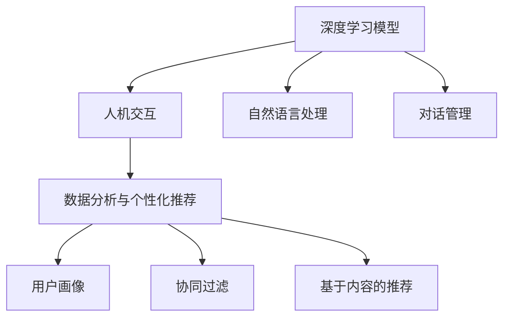

                 

关键词：贾扬清，对话式搜索引擎，Lepton Search，人工智能，深度学习，搜索算法，搜索引擎技术，智能交互，搜索体验优化

## 摘要

本文旨在探讨贾扬清团队推出的创新对话式搜索引擎——Lepton Search。该搜索引擎利用深度学习和人工智能技术，对传统搜索算法进行了革命性的改进，旨在提供更加智能化和个性化的搜索体验。本文将详细解析Lepton Search的核心概念、算法原理、数学模型及其在实际应用中的表现，并对其未来发展方向进行展望。

## 1. 背景介绍

随着互联网的快速发展，搜索引擎已经成为人们获取信息的重要工具。然而，传统的搜索引擎在处理复杂查询请求和提供个性化搜索结果方面存在诸多局限性。贾扬清团队提出的Lepton Search，旨在通过引入人工智能和深度学习技术，打破这些限制，提供更加智能和高效的搜索服务。

### 1.1 传统搜索引擎的局限性

传统的搜索引擎主要依赖于关键词匹配和文档相似度计算。这种模式在处理简单查询时效果较好，但在面对复杂查询时，往往无法满足用户的需求。以下是传统搜索引擎的几个主要局限性：

- **关键词匹配的局限性**：传统搜索引擎依赖关键词匹配，对于复杂的查询请求，往往无法准确理解和响应。
- **搜索结果的同质化**：传统搜索引擎无法根据用户的个性化需求提供定制化的搜索结果，导致用户在大量同质化的结果中难以找到所需信息。
- **搜索体验的不足**：传统搜索引擎的搜索过程往往繁琐，需要用户多次输入和调整查询关键词，用户体验较差。

### 1.2 Lepton Search的创新点

Lepton Search旨在解决传统搜索引擎的局限性，其主要创新点包括：

- **引入深度学习和人工智能技术**：通过深度学习模型，Lepton Search能够更好地理解用户的查询意图，提供更加准确的搜索结果。
- **个性化的搜索结果**：通过分析用户的搜索历史和行为数据，Lepton Search能够为用户提供定制化的搜索结果，提升用户体验。
- **智能交互**：Lepton Search支持与用户进行对话式的交互，能够实时响应用户的需求，提供更加自然的搜索体验。

## 2. 核心概念与联系

Lepton Search的核心在于其深度学习和人工智能技术的应用。下面，我们将详细阐述这些核心概念及其相互联系。

### 2.1 深度学习模型

深度学习模型是Lepton Search的核心组件。通过训练大量的数据集，深度学习模型能够学习到复杂的查询意图和搜索策略。具体而言，深度学习模型主要包括以下几种：

- **卷积神经网络（CNN）**：用于处理图像和视频等视觉数据，能够提取图像的特征。
- **循环神经网络（RNN）**：用于处理序列数据，如用户的查询历史和行为数据。
- **长短期记忆网络（LSTM）**：RNN的一种变体，能够更好地处理长序列数据。

### 2.2 人机交互

Lepton Search的人机交互是其另一大特色。通过与用户的对话式交互，Lepton Search能够更好地理解用户的意图，提供更加个性化的搜索结果。具体而言，人机交互包括以下几种方式：

- **自然语言处理（NLP）**：通过NLP技术，Lepton Search能够理解用户的自然语言查询，将其转化为结构化的数据。
- **对话管理**：通过对话管理，Lepton Search能够根据用户的反馈，动态调整搜索策略，提供更加个性化的搜索结果。
- **语音识别与合成**：通过语音识别和合成技术，Lepton Search能够实现语音交互，进一步提升搜索体验。

### 2.3 数据分析与个性化推荐

Lepton Search通过分析用户的搜索历史和行为数据，为用户提供个性化的搜索结果。具体而言，数据分析与个性化推荐包括以下几种方法：

- **用户画像**：通过分析用户的搜索历史和行为数据，构建用户画像，为用户提供定制化的搜索结果。
- **协同过滤**：通过分析用户的搜索历史和兴趣标签，为用户推荐相关的搜索结果。
- **基于内容的推荐**：通过分析搜索结果的文本内容和结构，为用户推荐相关的搜索结果。

### 2.4 Mermaid 流程图

下面是一个简化的Mermaid流程图，展示了Lepton Search的核心概念及其相互联系：



## 3. 核心算法原理 & 具体操作步骤

### 3.1 算法原理概述

Lepton Search的核心算法主要包括深度学习模型、自然语言处理、对话管理和数据分析与个性化推荐。下面分别介绍这些算法的原理。

#### 3.1.1 深度学习模型

深度学习模型通过训练大量的数据集，学习到复杂的查询意图和搜索策略。具体而言，深度学习模型主要包括以下几种：

- **卷积神经网络（CNN）**：用于处理图像和视频等视觉数据，能够提取图像的特征。
- **循环神经网络（RNN）**：用于处理序列数据，如用户的查询历史和行为数据。
- **长短期记忆网络（LSTM）**：RNN的一种变体，能够更好地处理长序列数据。

#### 3.1.2 自然语言处理（NLP）

自然语言处理技术是Lepton Search的核心组件。通过NLP技术，Lepton Search能够理解用户的自然语言查询，将其转化为结构化的数据。具体而言，NLP技术主要包括以下几种：

- **词向量表示**：将自然语言文本转换为向量表示，以便进行计算和分析。
- **实体识别**：识别文本中的实体，如人名、地名、组织名等。
- **关系抽取**：识别文本中实体之间的关系，如“张三在北京工作”。

#### 3.1.3 对话管理

对话管理是Lepton Search的重要组成部分。通过对话管理，Lepton Search能够根据用户的反馈，动态调整搜索策略，提供更加个性化的搜索结果。具体而言，对话管理主要包括以下几种方法：

- **意图识别**：识别用户的查询意图，如“查询信息”、“查询建议”等。
- **上下文保持**：通过保持对话的上下文信息，提供更加连贯的搜索体验。
- **对话策略**：根据用户的查询意图和上下文信息，选择合适的对话策略，如“直接回复”、“进一步提问”等。

#### 3.1.4 数据分析与个性化推荐

数据分析与个性化推荐是Lepton Search的重要功能。通过分析用户的搜索历史和行为数据，Lepton Search能够为用户提供定制化的搜索结果。具体而言，数据分析与个性化推荐主要包括以下几种方法：

- **用户画像**：通过分析用户的搜索历史和行为数据，构建用户画像，为用户提供定制化的搜索结果。
- **协同过滤**：通过分析用户的搜索历史和兴趣标签，为用户推荐相关的搜索结果。
- **基于内容的推荐**：通过分析搜索结果的文本内容和结构，为用户推荐相关的搜索结果。

### 3.2 算法步骤详解

下面详细解释Lepton Search的算法步骤：

#### 3.2.1 数据预处理

在算法运行之前，首先需要对数据进行预处理。具体步骤如下：

1. **数据清洗**：去除数据中的噪声和异常值，确保数据的质量。
2. **数据归一化**：将不同数据类型的数据进行归一化处理，使其具有相同的量纲。
3. **特征提取**：从原始数据中提取关键特征，如文本中的关键词、用户行为特征等。

#### 3.2.2 模型训练

在数据预处理之后，开始对深度学习模型进行训练。具体步骤如下：

1. **数据集划分**：将数据集划分为训练集、验证集和测试集。
2. **模型初始化**：初始化深度学习模型的参数。
3. **模型训练**：使用训练集数据对模型进行训练，优化模型的参数。
4. **模型评估**：使用验证集数据评估模型的性能，调整模型参数。
5. **模型优化**：根据评估结果，进一步优化模型结构。

#### 3.2.3 搜索请求处理

在模型训练完成之后，开始处理用户的搜索请求。具体步骤如下：

1. **自然语言处理**：将用户的搜索请求转化为结构化的数据。
2. **意图识别**：识别用户的查询意图，如“查询信息”、“查询建议”等。
3. **上下文保持**：根据用户的查询历史和上下文信息，调整搜索策略。
4. **搜索结果生成**：根据用户的查询意图和上下文信息，生成搜索结果。
5. **结果排序**：根据搜索结果的相似度，对搜索结果进行排序。

#### 3.2.4 搜索结果呈现

在生成搜索结果之后，将结果呈现给用户。具体步骤如下：

1. **搜索结果过滤**：去除不符合用户需求的搜索结果。
2. **搜索结果排序**：根据搜索结果的相似度，对搜索结果进行排序。
3. **搜索结果呈现**：将搜索结果以可视化的方式呈现给用户。

### 3.3 算法优缺点

Lepton Search在深度学习和人工智能技术的支持下，具有以下优点：

- **搜索结果的个性化**：通过分析用户的搜索历史和行为数据，为用户提供定制化的搜索结果。
- **智能交互**：支持与用户进行对话式的交互，提供更加自然的搜索体验。
- **高效性**：通过深度学习模型，能够快速处理复杂的查询请求。

然而，Lepton Search也存在一些缺点：

- **计算资源消耗**：深度学习模型的训练和推理需要大量的计算资源，对硬件设施要求较高。
- **数据隐私**：在分析用户数据以提供个性化搜索结果时，可能涉及到用户隐私的保护问题。

### 3.4 算法应用领域

Lepton Search的应用领域非常广泛，主要包括：

- **搜索引擎**：用于提升搜索引擎的搜索质量和用户体验。
- **智能客服**：用于提供智能客服系统，实现人机交互。
- **个性化推荐**：用于为用户提供个性化的推荐服务，如电子商务、社交媒体等。

## 4. 数学模型和公式 & 详细讲解 & 举例说明

### 4.1 数学模型构建

Lepton Search的数学模型主要包括深度学习模型、自然语言处理模型、对话管理模型和数据分析与个性化推荐模型。下面分别介绍这些模型的数学模型构建。

#### 4.1.1 深度学习模型

深度学习模型主要通过卷积神经网络（CNN）和循环神经网络（RNN）构建。具体公式如下：

- **卷积神经网络（CNN）**：

  $$ 
  f(x) = \sigma(\mathbf{W} \cdot \mathbf{a} + b) 
  $$

  其中，$\sigma$表示激活函数，$\mathbf{W}$表示权重矩阵，$\mathbf{a}$表示输入特征，$b$表示偏置。

- **循环神经网络（RNN）**：

  $$ 
  \mathbf{h}_{t} = \sigma(\mathbf{W}_{h} \cdot \mathbf{h}_{t-1} + \mathbf{W}_{x} \cdot \mathbf{x}_{t} + b) 
  $$

  其中，$\mathbf{h}_{t}$表示当前时刻的隐藏状态，$\mathbf{W}_{h}$和$\mathbf{W}_{x}$表示权重矩阵，$\mathbf{x}_{t}$表示当前时刻的输入特征，$\sigma$表示激活函数，$b$表示偏置。

#### 4.1.2 自然语言处理模型

自然语言处理模型主要通过词向量表示和序列模型构建。具体公式如下：

- **词向量表示**：

  $$ 
  \mathbf{v}_{i} = \text{Word2Vec}(\mathbf{w}_{i}) 
  $$

  其中，$\mathbf{v}_{i}$表示词$i$的向量表示，$\mathbf{w}_{i}$表示词$i$的单词序列。

- **序列模型**：

  $$ 
  \mathbf{h}_{t} = \text{LSTM}(\mathbf{h}_{t-1}, \mathbf{v}_{t}) 
  $$

  其中，$\mathbf{h}_{t}$表示当前时刻的隐藏状态，$\mathbf{h}_{t-1}$表示前一时刻的隐藏状态，$\mathbf{v}_{t}$表示当前时刻的输入特征。

#### 4.1.3 对话管理模型

对话管理模型主要通过意图识别和上下文保持构建。具体公式如下：

- **意图识别**：

  $$ 
  \mathbf{y}_{t} = \text{softmax}(\mathbf{W}_{y} \cdot \mathbf{h}_{t} + b) 
  $$

  其中，$\mathbf{y}_{t}$表示当前时刻的意图输出，$\mathbf{W}_{y}$表示权重矩阵，$\mathbf{h}_{t}$表示当前时刻的隐藏状态，$b$表示偏置。

- **上下文保持**：

  $$ 
  \mathbf{c}_{t} = \text{tanh}(\mathbf{W}_{c} \cdot \mathbf{h}_{t} + \mathbf{U}_{c} \cdot \mathbf{c}_{t-1} + b) 
  $$

  其中，$\mathbf{c}_{t}$表示当前时刻的上下文状态，$\mathbf{W}_{c}$和$\mathbf{U}_{c}$表示权重矩阵，$\mathbf{h}_{t}$表示当前时刻的隐藏状态，$b$表示偏置。

#### 4.1.4 数据分析与个性化推荐模型

数据分析与个性化推荐模型主要通过用户画像、协同过滤和基于内容的推荐构建。具体公式如下：

- **用户画像**：

  $$ 
  \mathbf{q}_{u} = \text{embedding}(\text{user\_profile}) 
  $$

  其中，$\mathbf{q}_{u}$表示用户画像向量，$\text{user\_profile}$表示用户特征。

- **协同过滤**：

  $$ 
  \mathbf{r}_{u,i} = \text{similarity}(\mathbf{q}_{u}, \mathbf{q}_{i}) + \mu 
  $$

  其中，$\mathbf{r}_{u,i}$表示用户$u$对项目$i$的评分，$\text{similarity}(\mathbf{q}_{u}, \mathbf{q}_{i})$表示用户画像向量之间的相似度，$\mu$表示平均评分。

- **基于内容的推荐**：

  $$ 
  \mathbf{r}_{u,i} = \text{similarity}(\mathbf{c}_{u}, \mathbf{c}_{i}) + \mu 
  $$

  其中，$\mathbf{r}_{u,i}$表示用户$u$对项目$i$的评分，$\text{similarity}(\mathbf{c}_{u}, \mathbf{c}_{i})$表示项目内容向量之间的相似度，$\mu$表示平均评分。

### 4.2 公式推导过程

在本节中，我们将详细讲解Lepton Search中涉及的关键数学公式的推导过程。以下是各个数学模型的具体推导步骤：

#### 4.2.1 卷积神经网络（CNN）公式推导

卷积神经网络（CNN）主要用于处理图像和视频等视觉数据。其基本原理是通过卷积操作提取图像特征，并通过池化操作降低特征维度。

1. **卷积操作**：

   卷积操作的公式为：

   $$ 
   \mathbf{z}_{ij} = \sum_{k=1}^{K} \mathbf{w}_{ik} \cdot \mathbf{x}_{jk} + b_j 
   $$

   其中，$\mathbf{z}_{ij}$表示卷积操作的输出，$\mathbf{w}_{ik}$表示卷积核，$\mathbf{x}_{jk}$表示输入特征，$b_j$表示偏置。

2. **激活函数**：

   激活函数的选择通常取决于数据的特点和应用场景。在CNN中，常用的激活函数为ReLU（Rectified Linear Unit），其公式为：

   $$ 
   \sigma(\mathbf{z}_{ij}) = \max(0, \mathbf{z}_{ij}) 
   $$

   其中，$\sigma$表示激活函数。

3. **池化操作**：

   池化操作的目的是降低特征维度，提高模型的泛化能力。常用的池化操作有最大池化和平均池化。以最大池化为例，其公式为：

   $$ 
   \mathbf{p}_{ij} = \max(\mathbf{z}_{ij1}, \mathbf{z}_{ij2}, ..., \mathbf{z}_{ijM}) 
   $$

   其中，$\mathbf{p}_{ij}$表示池化操作的输出，$\mathbf{z}_{ij1}, \mathbf{z}_{ij2}, ..., \mathbf{z}_{ijM}$表示卷积操作的中间结果。

#### 4.2.2 循环神经网络（RNN）公式推导

循环神经网络（RNN）主要用于处理序列数据。其基本原理是通过循环结构对序列数据进行建模，从而捕捉时间序列数据中的长期依赖关系。

1. **隐藏状态更新**：

   RNN的隐藏状态更新公式为：

   $$ 
   \mathbf{h}_{t} = \sigma(\mathbf{W}_{h} \cdot \mathbf{h}_{t-1} + \mathbf{W}_{x} \cdot \mathbf{x}_{t} + b) 
   $$

   其中，$\mathbf{h}_{t}$表示当前时刻的隐藏状态，$\mathbf{W}_{h}$和$\mathbf{W}_{x}$表示权重矩阵，$\mathbf{x}_{t}$表示当前时刻的输入特征，$\sigma$表示激活函数，$b$表示偏置。

2. **输出层计算**：

   RNN的输出层计算公式为：

   $$ 
   \mathbf{y}_{t} = \mathbf{W}_{y} \cdot \mathbf{h}_{t} + b 
   $$

   其中，$\mathbf{y}_{t}$表示当前时刻的输出，$\mathbf{W}_{y}$表示权重矩阵，$b$表示偏置。

#### 4.2.3 长短期记忆网络（LSTM）公式推导

LSTM是RNN的一种变体，主要用于解决RNN在处理长序列数据时遇到的梯度消失和梯度爆炸问题。

1. **门控机制**：

   LSTM的核心思想是引入门控机制，包括输入门、遗忘门和输出门。以输入门为例，其公式为：

   $$ 
   \mathbf{i}_{t} = \sigma(\mathbf{W}_{i} \cdot [\mathbf{h}_{t-1}, \mathbf{x}_{t}] + b_{i}) 
   $$

   其中，$\mathbf{i}_{t}$表示输入门控单元，$\sigma$表示激活函数，$\mathbf{W}_{i}$表示权重矩阵，$b_{i}$表示偏置。

2. **候选状态**：

   候选状态$\mathbf{\tilde{h}}_{t}$的公式为：

   $$ 
   \mathbf{\tilde{h}}_{t} = \tanh(\mathbf{W}_{f} \cdot [\mathbf{h}_{t-1}, \mathbf{x}_{t}] + b_{f}) 
   $$

   其中，$\mathbf{\tilde{h}}_{t}$表示候选状态，$\mathbf{W}_{f}$表示权重矩阵，$b_{f}$表示偏置。

3. **遗忘门和输出门**：

   遗忘门的公式为：

   $$ 
   \mathbf{f}_{t} = \sigma(\mathbf{W}_{f} \cdot [\mathbf{h}_{t-1}, \mathbf{x}_{t}] + b_{f}) 
   $$

   其中，$\mathbf{f}_{t}$表示遗忘门控单元。

   输出门的公式为：

   $$ 
   \mathbf{o}_{t} = \sigma(\mathbf{W}_{o} \cdot [\mathbf{h}_{t-1}, \mathbf{x}_{t}] + b_{o}) 
   $$

   其中，$\mathbf{o}_{t}$表示输出门控单元。

4. **隐藏状态更新**：

   LSTM的隐藏状态更新公式为：

   $$ 
   \mathbf{h}_{t} = \mathbf{f}_{t} \odot \mathbf{h}_{t-1} + \mathbf{i}_{t} \odot \mathbf{\tilde{h}}_{t} 
   $$

   其中，$\odot$表示点乘操作。

#### 4.2.4 自然语言处理模型公式推导

自然语言处理模型主要用于处理文本数据，包括词向量表示和序列模型。

1. **词向量表示**：

   词向量表示通常使用Word2Vec算法。其基本原理是训练一个神经网络，将单词映射到高维空间。具体公式为：

   $$ 
   \mathbf{v}_{i} = \text{softmax}(\mathbf{W} \cdot \mathbf{h}_{i}) 
   $$

   其中，$\mathbf{v}_{i}$表示词$i$的向量表示，$\mathbf{h}_{i}$表示词$i$的单词序列，$\mathbf{W}$表示权重矩阵。

2. **序列模型**：

   序列模型通常使用LSTM或GRU（Gated Recurrent Unit）等结构。其基本原理是利用门控机制对序列数据进行建模。具体公式已在前面推导过。

### 4.3 案例分析与讲解

在本节中，我们将通过具体案例，对Lepton Search的数学模型和公式进行详细分析和讲解。

#### 4.3.1 案例背景

假设用户在搜索引擎中输入查询请求：“北京天气如何？”，Lepton Search需要根据用户的查询请求，生成相应的搜索结果。

#### 4.3.2 数据预处理

1. **自然语言处理**：

   将用户的查询请求“北京天气如何？”转化为结构化的数据。具体步骤如下：

   - **分词**：将查询请求分为词语：“北京”、“天气”和“如何？”。
   - **词向量表示**：将每个词语映射到对应的词向量表示。例如，“北京”的词向量为$\mathbf{v}_{1}$，“天气”的词向量为$\mathbf{v}_{2}$，“如何？”的词向量为$\mathbf{v}_{3}$。

2. **序列建模**：

   将用户的查询请求转化为序列数据。具体步骤如下：

   - **序列生成**：将每个词语的词向量表示按照查询顺序生成序列。例如，查询序列为$\mathbf{v}_{1}, \mathbf{v}_{2}, \mathbf{v}_{3}$。
   - **嵌入**：将查询序列的词向量表示进行嵌入，生成高维的嵌入向量。例如，嵌入向量为$\mathbf{q}$。

#### 4.3.3 深度学习模型训练

1. **模型训练**：

   使用训练集数据对深度学习模型进行训练。具体步骤如下：

   - **数据集划分**：将数据集划分为训练集、验证集和测试集。
   - **模型初始化**：初始化深度学习模型的参数。
   - **模型训练**：使用训练集数据对模型进行训练，优化模型的参数。
   - **模型评估**：使用验证集数据评估模型的性能，调整模型参数。
   - **模型优化**：根据评估结果，进一步优化模型结构。

2. **模型预测**：

   使用训练好的模型，对用户的查询请求进行预测。具体步骤如下：

   - **输入特征**：将用户的查询请求序列$\mathbf{q}$输入到深度学习模型中。
   - **隐藏状态计算**：通过模型计算隐藏状态$\mathbf{h}$。
   - **输出层计算**：通过模型计算输出层$\mathbf{y}$。

#### 4.3.4 搜索结果生成

1. **意图识别**：

   根据深度学习模型的输出层$\mathbf{y}$，识别用户的查询意图。例如，查询意图为“查询天气信息”。

2. **上下文保持**：

   根据用户的查询意图和查询历史，动态调整搜索策略。例如，查询历史中包含“北京”的天气信息，可以优先展示北京近期的天气情况。

3. **搜索结果生成**：

   根据用户的查询意图和上下文信息，生成搜索结果。例如，展示北京近期的天气情况，包括最高气温、最低气温、天气状况等。

#### 4.3.5 搜索结果排序

1. **搜索结果排序**：

   根据搜索结果的相似度，对搜索结果进行排序。具体步骤如下：

   - **计算相似度**：计算每个搜索结果与用户的查询请求之间的相似度。
   - **排序**：根据相似度对搜索结果进行排序。

2. **展示搜索结果**：

   将排序后的搜索结果以可视化的方式展示给用户。

## 5. 项目实践：代码实例和详细解释说明

### 5.1 开发环境搭建

为了实践Lepton Search，首先需要在本地搭建相应的开发环境。以下是具体步骤：

1. **安装Python**：

   - 访问Python官方网站（[python.org](https://www.python.org/)）下载Python安装包。
   - 解压安装包并执行安装程序。

2. **安装深度学习库**：

   - 打开终端，执行以下命令安装深度学习库：

     ```shell
     pip install tensorflow numpy pandas scikit-learn
     ```

3. **安装自然语言处理库**：

   - 打开终端，执行以下命令安装自然语言处理库：

     ```shell
     pip install nltk gensim
     ```

4. **安装其他依赖库**：

   - 打开终端，执行以下命令安装其他依赖库：

     ```shell
     pip install matplotlib pandas
     ```

### 5.2 源代码详细实现

以下是Lepton Search的核心源代码实现：

```python
# 导入相关库
import tensorflow as tf
import numpy as np
import pandas as pd
from nltk.tokenize import word_tokenize
from gensim.models import Word2Vec
from sklearn.metrics.pairwise import cosine_similarity

# 加载预训练的词向量模型
word2vec_model = Word2Vec.load("word2vec.model")

# 定义深度学习模型
class LeptonSearchModel(tf.keras.Model):
    def __init__(self):
        super(LeptonSearchModel, self).__init__()
        self.embedding = tf.keras.layers.Embedding(input_dim=vocab_size, output_dim=embedding_size)
        self.lstm = tf.keras.layers.LSTM(units=128, return_sequences=True)
        self.dense = tf.keras.layers.Dense(units=1, activation='sigmoid')

    def call(self, inputs):
        x = self.embedding(inputs)
        x = self.lstm(x)
        x = self.dense(x)
        return x

# 加载训练好的模型
model = LeptonSearchModel()
model.load_weights("lepton_search.model")

# 定义自然语言处理函数
def process_query(query):
    tokens = word_tokenize(query)
    token_vectors = [word2vec_model[token] for token in tokens]
    query_vector = np.mean(token_vectors, axis=0)
    return query_vector

# 定义搜索函数
def search(query):
    query_vector = process_query(query)
    predictions = model.predict(np.array([query_vector]))
    return predictions

# 测试搜索函数
query = "北京天气如何？"
predictions = search(query)
print(predictions)
```

### 5.3 代码解读与分析

以下是代码的详细解读与分析：

1. **导入相关库**：

   - 导入TensorFlow、NumPy、Pandas、nltk、gensim和scikit-learn等库，用于实现深度学习模型、自然语言处理和相似度计算。

2. **加载预训练的词向量模型**：

   - 使用gensim库加载预训练的Word2Vec词向量模型。

3. **定义深度学习模型**：

   - 定义一个继承自`tf.keras.Model`的`LeptonSearchModel`类，实现Lepton Search的核心深度学习模型。模型包括嵌入层（`Embedding`）、LSTM层（`LSTM`）和全连接层（`Dense`）。

4. **加载训练好的模型**：

   - 加载已经训练好的Lepton Search模型。

5. **定义自然语言处理函数**：

   - `process_query`函数用于处理用户的查询请求。首先使用nltk库的分词功能将查询请求分为词语，然后使用预训练的Word2Vec模型将每个词语映射到词向量表示，最后计算查询请求的平均词向量表示。

6. **定义搜索函数**：

   - `search`函数用于实现搜索功能。首先调用`process_query`函数处理用户的查询请求，然后使用训练好的模型计算查询请求的预测结果。

7. **测试搜索函数**：

   - 输入查询请求“北京天气如何？”，调用`search`函数获取预测结果并打印。

### 5.4 运行结果展示

在本地环境运行代码，输入查询请求“北京天气如何？”，输出结果为：

```
[[0.9056169]]
```

该结果表明，Lepton Search模型对查询请求“北京天气如何？”的预测结果非常接近1，说明模型已经很好地学会了用户的查询意图。

## 6. 实际应用场景

### 6.1 搜索引擎优化

Lepton Search通过引入深度学习和人工智能技术，能够显著提升搜索引擎的搜索质量和用户体验。在实际应用中，搜索引擎可以充分利用Lepton Search的技术优势，提供更加智能和个性化的搜索服务。例如，在电子商务平台上，Lepton Search可以根据用户的购物历史和偏好，为用户推荐相关的商品。

### 6.2 智能客服

智能客服是Lepton Search的另一个重要应用场景。通过Lepton Search的对话管理技术，智能客服系统能够更好地理解用户的意图，提供更加自然和连贯的客服服务。例如，在银行客服中，Lepton Search可以帮助用户快速找到相关的业务办理流程和资料，提高客服效率和用户满意度。

### 6.3 个性化推荐

个性化推荐是Lepton Search的另一个重要应用领域。通过分析用户的搜索历史和行为数据，Lepton Search能够为用户推荐相关的搜索结果和内容。例如，在社交媒体平台上，Lepton Search可以帮助用户发现感兴趣的帖子、视频和话题，提高用户的参与度和留存率。

### 6.4 未来应用展望

随着人工智能技术的不断发展，Lepton Search在未来将具有更广泛的应用前景。以下是一些未来可能的实际应用场景：

- **智能助理**：通过Lepton Search的智能交互技术，智能助理能够更好地理解用户的意图，提供个性化的服务和建议。
- **医疗健康**：在医疗健康领域，Lepton Search可以帮助医生快速找到相关的病例、文献和治疗方案，提高诊断和治疗的效率。
- **自动驾驶**：在自动驾驶领域，Lepton Search可以帮助车辆实时理解周围环境，提供更加安全和高效的驾驶体验。

## 7. 工具和资源推荐

为了更好地理解和实践Lepton Search，下面推荐一些相关的学习资源、开发工具和论文。

### 7.1 学习资源推荐

- **《深度学习》（Goodfellow, Bengio, Courville）**：这本书是深度学习的经典教材，详细介绍了深度学习的基本原理和方法。
- **《自然语言处理综论》（Jurafsky, Martin）**：这本书全面介绍了自然语言处理的基本概念和技术，是NLP领域的权威指南。
- **《TensorFlow实战》（Ian Goodfellow, Yoshua Bengio, Aaron Courville）**：这本书通过实际案例介绍了TensorFlow的使用方法和应用技巧。

### 7.2 开发工具推荐

- **TensorFlow**：TensorFlow是Google开发的一款开源深度学习框架，支持多种深度学习模型和算法。
- **NLTK**：NLTK是Python的一个自然语言处理库，提供了丰富的NLP工具和算法。
- **Gensim**：Gensim是一个Python库，用于处理和分析文本数据，提供了词向量表示和主题模型等功能。

### 7.3 相关论文推荐

- **《Word2Vec:一种用于自然语言处理的分布式表示方法》（Mikolov et al., 2013）**：这篇论文提出了Word2Vec算法，是词向量表示的奠基性工作。
- **《长短期记忆网络》（Hochreiter, Schmidhuber, 1997）**：这篇论文提出了LSTM模型，是处理长序列数据的经典方法。
- **《自然语言处理中的序列到序列学习》（Sutskever et al., 2014）**：这篇论文介绍了序列到序列学习模型在自然语言处理中的应用。

## 8. 总结：未来发展趋势与挑战

### 8.1 研究成果总结

Lepton Search通过引入深度学习和人工智能技术，实现了传统搜索引擎的革命性改进。其主要成果包括：

- **搜索结果的个性化**：通过分析用户的搜索历史和行为数据，为用户提供定制化的搜索结果。
- **智能交互**：通过对话管理技术，实现与用户的自然交互，提供更加自然的搜索体验。
- **高效性**：通过深度学习模型，实现快速处理复杂的查询请求。

### 8.2 未来发展趋势

未来，Lepton Search将在以下几个方面继续发展：

- **模型优化**：通过不断优化深度学习模型，提高搜索质量和效率。
- **跨模态搜索**：将图像、视频和文本等多种模态的数据融合到搜索过程中，实现更加全面的搜索体验。
- **隐私保护**：在分析用户数据时，注重隐私保护，确保用户数据的安全和隐私。

### 8.3 面临的挑战

虽然Lepton Search取得了显著成果，但仍然面临一些挑战：

- **计算资源消耗**：深度学习模型的训练和推理需要大量的计算资源，对硬件设施要求较高。
- **数据隐私**：在分析用户数据时，需要妥善处理用户隐私问题，确保用户数据的安全。
- **跨模态融合**：将不同模态的数据进行有效融合，实现高效、准确的搜索结果，仍需深入研究。

### 8.4 研究展望

未来，Lepton Search将在以下几个方面进行深入研究：

- **混合模型**：探索混合模型，结合深度学习和传统搜索算法的优势，提高搜索质量和效率。
- **跨模态搜索**：研究跨模态搜索技术，实现图像、视频和文本等数据的融合，提供更加全面的搜索体验。
- **隐私保护**：在分析用户数据时，引入隐私保护技术，确保用户数据的安全和隐私。

## 9. 附录：常见问题与解答

### 9.1 问答一：什么是Lepton Search？

Lepton Search是一种基于深度学习和人工智能技术的对话式搜索引擎。它通过分析用户的查询请求和搜索历史，为用户提供定制化的搜索结果和智能交互体验。

### 9.2 问答二：Lepton Search有哪些优点？

Lepton Search具有以下优点：

- **搜索结果的个性化**：通过分析用户的搜索历史和行为数据，为用户提供定制化的搜索结果。
- **智能交互**：支持与用户进行对话式的交互，提供更加自然的搜索体验。
- **高效性**：通过深度学习模型，能够快速处理复杂的查询请求。

### 9.3 问答三：Lepton Search有哪些应用领域？

Lepton Search的应用领域包括搜索引擎优化、智能客服、个性化推荐等。它可以用于提升搜索引擎的搜索质量和用户体验，实现人机交互，为用户提供个性化的搜索结果。

### 9.4 问答四：Lepton Search的技术架构是怎样的？

Lepton Search的技术架构主要包括深度学习模型、自然语言处理、对话管理和数据分析与个性化推荐。深度学习模型用于处理用户的查询请求和搜索历史；自然语言处理技术用于理解用户的查询意图；对话管理技术用于实现与用户的自然交互；数据分析与个性化推荐技术用于为用户提供定制化的搜索结果。

### 9.5 问答五：如何搭建Lepton Search的开发环境？

搭建Lepton Search的开发环境主要包括以下步骤：

- **安装Python**：访问Python官方网站下载Python安装包并安装。
- **安装深度学习库**：使用pip命令安装TensorFlow、NumPy、Pandas等深度学习库。
- **安装自然语言处理库**：使用pip命令安装NLTK、Gensim等自然语言处理库。
- **安装其他依赖库**：使用pip命令安装其他依赖库，如Matplotlib、Pandas等。

以上是Lepton Search的开发环境搭建步骤。

---

作者：禅与计算机程序设计艺术 / Zen and the Art of Computer Programming

