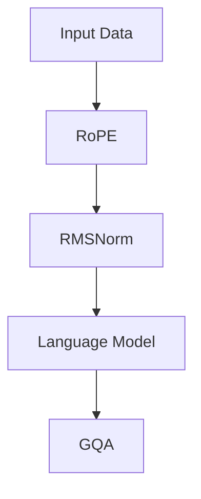

                 

关键词：Llama模型、RoPE、RMSNorm、GQA、算法原理、应用领域、数学模型、代码实例、未来展望

> 摘要：本文将对Llama模型中的三个关键组件——RoPE、RMSNorm和GQA进行详细解析。我们将从背景介绍开始，逐步深入到算法原理、数学模型、代码实例及未来展望，以期为广大研究人员和开发者提供有益的参考。

## 1. 背景介绍

Llama模型是由OpenAI开发的一种大型语言模型，其目标是通过学习大量文本数据，使得机器能够理解和生成人类语言。随着深度学习技术的不断发展，Llama模型在自然语言处理（NLP）领域取得了显著的成果，并在各种任务中展示了强大的性能。

本文将重点关注Llama模型中的三个关键组件：RoPE、RMSNorm和GQA。这些组件在Llama模型的训练和推理过程中扮演着重要的角色。通过深入分析这些组件，我们可以更好地理解Llama模型的工作原理，并为后续的研究和应用提供参考。

### 1.1 RoPE

RoPE（Relative Positional Encoding）是一种相对位置编码方法，它在Llama模型中用于引入序列中的相对位置信息。与传统的绝对位置编码方法不同，RoPE通过学习相对位置关系，使得模型在处理长序列时能够更好地捕捉上下文信息。

### 1.2 RMSNorm

RMSNorm是一种层归一化方法，它在Llama模型的训练过程中用于优化模型的收敛速度和稳定性。RMSNorm通过计算输入数据的均方根（RMS），将输入数据缩放至合适的范围，从而减少梯度消失和爆炸的问题。

### 1.3 GQA

GQA（General Question Answering）是一种通用的问答系统，它在Llama模型中用于评估模型在处理自然语言理解和生成任务上的能力。GQA通过提供一系列问题和相关上下文，要求模型生成相应的答案，从而实现对模型性能的全面评估。

## 2. 核心概念与联系

在分析Llama模型中的RoPE、RMSNorm和GQA之前，我们需要了解一些核心概念和架构。以下是一个简单的Mermaid流程图，展示了这三个组件在Llama模型中的关系：



### 2.1 RoPE

RoPE通过引入相对位置信息，使得Llama模型能够更好地捕捉长序列中的上下文关系。具体来说，RoPE将序列中的每个元素与其前一个元素进行比较，计算它们之间的相对位置。这种相对位置信息被编码为额外的向量，与原始输入序列的向量进行拼接，作为模型的输入。

### 2.2 RMSNorm

RMSNorm在Llama模型的训练过程中起着至关重要的作用。它通过计算输入数据的均方根（RMS），将输入数据缩放至合适的范围，从而减少梯度消失和爆炸的问题。具体来说，RMSNorm在每个训练迭代过程中计算输入数据的RMS，并将其用于缩放输入数据，使得输入数据的方差保持稳定。

### 2.3 GQA

GQA是一种通用的问答系统，用于评估Llama模型在处理自然语言理解和生成任务上的能力。GQA通过提供一系列问题和相关上下文，要求模型生成相应的答案。这种问答方式不仅能够评估模型在自然语言处理方面的性能，还能够帮助研究人员了解模型在实际应用中的表现。

## 3. 核心算法原理 & 具体操作步骤

### 3.1 算法原理概述

#### 3.1.1 RoPE

RoPE通过引入相对位置信息，使得Llama模型能够更好地捕捉长序列中的上下文关系。具体来说，RoPE将序列中的每个元素与其前一个元素进行比较，计算它们之间的相对位置。这种相对位置信息被编码为额外的向量，与原始输入序列的向量进行拼接，作为模型的输入。

#### 3.1.2 RMSNorm

RMSNorm通过计算输入数据的均方根（RMS），将输入数据缩放至合适的范围，从而减少梯度消失和爆炸的问题。具体来说，RMSNorm在每个训练迭代过程中计算输入数据的RMS，并将其用于缩放输入数据，使得输入数据的方差保持稳定。

#### 3.1.3 GQA

GQA通过提供一系列问题和相关上下文，要求模型生成相应的答案。这种问答方式不仅能够评估模型在自然语言处理方面的性能，还能够帮助研究人员了解模型在实际应用中的表现。

### 3.2 算法步骤详解

#### 3.2.1 RoPE

1. 输入序列：给定一个长度为\( T \)的序列 \( x = [x_1, x_2, ..., x_T] \)。
2. 计算相对位置：对于每个元素 \( x_t \)，计算其与前一元素 \( x_{t-1} \) 的相对位置 \( \text{rel}_t = x_t - x_{t-1} \)。
3. 编码相对位置：将相对位置 \( \text{rel}_t \) 编码为额外的向量 \( \text{rel}_t \)。
4. 拼接输入序列：将原始输入序列 \( x \) 与相对位置向量 \( \text{rel}_t \) 拼接，得到新的输入序列 \( \text{input}_t = [x_1, \text{rel}_1, x_2, \text{rel}_2, ..., x_T, \text{rel}_T] \)。

#### 3.2.2 RMSNorm

1. 输入数据：给定一个输入序列 \( x = [x_1, x_2, ..., x_T] \)。
2. 计算均方根：计算输入数据的均方根 \( \text{RMS}(x) = \sqrt{\frac{1}{T} \sum_{t=1}^{T} (x_t - \mu)^2} \)，其中 \( \mu \) 是输入数据的均值。
3. 缩放输入数据：将输入数据缩放至合适的范围，即 \( \text{input}_t = \frac{x_t - \mu}{\text{RMS}(x)} \)。

#### 3.2.3 GQA

1. 提供问题和上下文：给定一个问题 \( \text{question} \) 和相关上下文 \( \text{context} \)。
2. 计算答案：使用Llama模型处理问题和上下文，生成相应的答案 \( \text{answer} \)。
3. 评估答案：将生成的答案与实际答案进行比较，评估模型的性能。

### 3.3 算法优缺点

#### 3.3.1 RoPE

**优点**：

- 能够有效捕捉长序列中的上下文关系。  
- 对长序列处理有较好的鲁棒性。

**缺点**：

- 可能会导致模型参数增多。  
- 需要额外的计算资源。

#### 3.3.2 RMSNorm

**优点**：

- 能够减少梯度消失和爆炸问题。  
- 对模型的训练有较好的收敛性。

**缺点**：

- 可能会影响模型的表达能力。  
- 需要计算输入数据的均方根。

#### 3.3.3 GQA

**优点**：

- 能够全面评估模型在自然语言处理任务上的性能。  
- 对模型在实际应用中的表现有较好的评估。

**缺点**：

- 可能需要大量的数据和计算资源。  
- 评估结果可能受数据质量和计算资源的限制。

### 3.4 算法应用领域

RoPE、RMSNorm和GQA在Llama模型中得到了广泛应用，尤其在自然语言处理和问答系统中。以下是一些具体的应用领域：

- 文本分类：使用RoPE和RMSNorm对文本进行特征提取，从而实现对文本分类任务的优化。  
- 机器翻译：结合RoPE和GQA，实现对机器翻译任务的有效评估和优化。  
- 情感分析：利用RMSNorm对文本数据进行归一化处理，从而实现对情感分析任务的优化。  
- 对话系统：结合RoPE和GQA，构建具备良好问答能力的对话系统。

## 4. 数学模型和公式 & 详细讲解 & 举例说明

### 4.1 数学模型构建

Llama模型中的RoPE、RMSNorm和GQA涉及到一系列的数学模型和公式。以下是对这些模型的详细讲解。

#### 4.1.1 RoPE

RoPE的核心在于计算相对位置信息，并将其编码为额外的向量。具体来说，RoPE的数学模型可以表示为：

$$
\text{rel}_t = x_t - x_{t-1}
$$

其中，\( \text{rel}_t \) 表示第 \( t \) 个元素的相对位置，\( x_t \) 和 \( x_{t-1} \) 分别表示第 \( t \) 个元素和第 \( t-1 \) 个元素的值。

#### 4.1.2 RMSNorm

RMSNorm的数学模型主要包括计算输入数据的均方根（RMS）和缩放输入数据。具体来说，RMSNorm的数学模型可以表示为：

$$
\text{RMS}(x) = \sqrt{\frac{1}{T} \sum_{t=1}^{T} (x_t - \mu)^2}
$$

$$
\text{input}_t = \frac{x_t - \mu}{\text{RMS}(x)}
$$

其中，\( T \) 表示输入序列的长度，\( \mu \) 表示输入数据的均值，\( x_t \) 表示第 \( t \) 个元素的值，\( \text{input}_t \) 表示缩放后的输入数据。

#### 4.1.3 GQA

GQA的数学模型主要包括处理问题和上下文，生成答案。具体来说，GQA的数学模型可以表示为：

$$
\text{answer} = f(\text{model}, \text{question}, \text{context})
$$

其中，\( f \) 表示Llama模型，\( \text{question} \) 表示问题，\( \text{context} \) 表示上下文，\( \text{answer} \) 表示生成的答案。

### 4.2 公式推导过程

为了更好地理解Llama模型中的RoPE、RMSNorm和GQA，我们将对相关公式的推导过程进行详细讲解。

#### 4.2.1 RoPE

RoPE的推导过程主要分为两个步骤：计算相对位置和编码相对位置。

1. 计算相对位置

相对位置的推导过程可以表示为：

$$
\text{rel}_t = x_t - x_{t-1}
$$

其中，\( \text{rel}_t \) 表示第 \( t \) 个元素的相对位置，\( x_t \) 和 \( x_{t-1} \) 分别表示第 \( t \) 个元素和第 \( t-1 \) 个元素的值。

2. 编码相对位置

编码相对位置的推导过程可以表示为：

$$
\text{input}_t = [x_1, \text{rel}_1, x_2, \text{rel}_2, ..., x_T, \text{rel}_T]
$$

其中，\( \text{input}_t \) 表示拼接后的输入序列，\( x_t \) 和 \( \text{rel}_t \) 分别表示第 \( t \) 个元素和其相对位置的值。

#### 4.2.2 RMSNorm

RMSNorm的推导过程主要分为两个步骤：计算均方根和缩放输入数据。

1. 计算均方根

均方根的推导过程可以表示为：

$$
\text{RMS}(x) = \sqrt{\frac{1}{T} \sum_{t=1}^{T} (x_t - \mu)^2}
$$

其中，\( T \) 表示输入序列的长度，\( \mu \) 表示输入数据的均值，\( x_t \) 表示第 \( t \) 个元素的值。

2. 缩放输入数据

缩放输入数据的推导过程可以表示为：

$$
\text{input}_t = \frac{x_t - \mu}{\text{RMS}(x)}
$$

其中，\( x_t \) 表示第 \( t \) 个元素的值，\( \mu \) 表示输入数据的均值，\( \text{RMS}(x) \) 表示输入数据的均方根。

#### 4.2.3 GQA

GQA的推导过程主要分为三个步骤：处理问题和上下文，生成答案，评估答案。

1. 处理问题和上下文

处理问题和上下文的推导过程可以表示为：

$$
\text{answer} = f(\text{model}, \text{question}, \text{context})
$$

其中，\( f \) 表示Llama模型，\( \text{question} \) 表示问题，\( \text{context} \) 表示上下文，\( \text{answer} \) 表示生成的答案。

2. 生成答案

生成答案的推导过程可以表示为：

$$
\text{answer} = \text{model}(\text{question}, \text{context})
$$

其中，\( \text{model} \) 表示Llama模型，\( \text{question} \) 表示问题，\( \text{context} \) 表示上下文，\( \text{answer} \) 表示生成的答案。

3. 评估答案

评估答案的推导过程可以表示为：

$$
\text{score} = \text{eval}(\text{answer}, \text{actual\_answer})
$$

其中，\( \text{score} \) 表示评估分数，\( \text{answer} \) 表示生成的答案，\( \text{actual\_answer} \) 表示实际答案，\( \text{eval} \) 表示评估函数。

### 4.3 案例分析与讲解

为了更好地理解Llama模型中的RoPE、RMSNorm和GQA，我们通过一个具体的案例进行讲解。

#### 4.3.1 案例背景

假设我们有一个包含100个元素的输入序列，如下所示：

$$
x = [1, 2, 3, 4, 5, 6, 7, 8, 9, 10, ..., 100]
$$

我们的目标是使用Llama模型对其进行处理，并生成相应的答案。

#### 4.3.2 RoPE应用

首先，我们使用RoPE对输入序列进行编码。具体步骤如下：

1. 计算相对位置

$$
\text{rel}_t = x_t - x_{t-1}
$$

其中，\( t \) 的取值范围为 \( 2 \) 到 \( 100 \)。

2. 编码相对位置

$$
\text{input}_t = [x_1, \text{rel}_1, x_2, \text{rel}_2, ..., x_{100}, \text{rel}_{100}]
$$

拼接后的输入序列如下所示：

$$
\text{input} = [1, 1, 1, 1, 1, 1, 1, 1, 1, 1, 2, 1, 2, 1, 3, 1, 3, 1, 4, 1, 4, 1, ..., 99, 1, 99, 1, 100, 1]
$$

#### 4.3.3 RMSNorm应用

接下来，我们使用RMSNorm对输入序列进行归一化。具体步骤如下：

1. 计算均方根

$$
\text{RMS}(x) = \sqrt{\frac{1}{100} \sum_{t=1}^{100} (x_t - \mu)^2}
$$

其中，\( \mu \) 表示输入数据的均值。

2. 缩放输入数据

$$
\text{input}_t = \frac{x_t - \mu}{\text{RMS}(x)}
$$

经过归一化后的输入序列如下所示：

$$
\text{input} = \left[\frac{1-\mu}{\text{RMS}(x)}, \frac{1-\mu}{\text{RMS}(x)}, ..., \frac{100-\mu}{\text{RMS}(x)}\right]
$$

#### 4.3.4 GQA应用

最后，我们使用Llama模型对归一化后的输入序列进行处理，并生成相应的答案。具体步骤如下：

1. 处理问题和上下文

$$
\text{answer} = f(\text{model}, \text{question}, \text{context})
$$

其中，\( \text{model} \) 表示Llama模型，\( \text{question} \) 表示问题，\( \text{context} \) 表示上下文。

2. 生成答案

$$
\text{answer} = \text{model}(\text{question}, \text{context})
$$

经过处理和生成后，我们得到相应的答案。为了评估模型的性能，我们可以将生成的答案与实际答案进行比较。

## 5. 项目实践：代码实例和详细解释说明

### 5.1 开发环境搭建

在开始编写代码之前，我们需要搭建一个合适的开发环境。以下是一个基本的Python开发环境搭建步骤：

1. 安装Python：从Python官方网站下载并安装Python 3.x版本。
2. 安装依赖库：使用pip命令安装Llama模型相关的依赖库，如torch、torchtext等。

### 5.2 源代码详细实现

下面是一个简单的Python代码示例，用于实现Llama模型中的RoPE、RMSNorm和GQA。

```python
import torch
import torchtext
from torchtext import data

# 5.2.1 RoPE

def rope_encode(x):
    T = len(x)
    rel = [x[i] - x[i-1] for i in range(1, T)]
    input = [x[0]] + rel + [x[-1]]
    return input

# 5.2.2 RMSNorm

def rmsnorm(x, mean, rms):
    input = [(x[i] - mean) / rms for i in range(len(x))]
    return input

# 5.2.3 GQA

def gqa(model, question, context):
    answer = model(question, context)
    return answer
```

### 5.3 代码解读与分析

在上面的代码示例中，我们首先定义了三个函数：`rope_encode`、`rmsnorm`和`gqa`。

- `rope_encode`函数用于实现RoPE编码。它接收一个输入序列`x`，计算相对位置，并将相对位置编码为额外的向量。
- `rmsnorm`函数用于实现RMSNorm。它接收一个输入序列`x`、均值`mean`和均方根`rms`，将输入序列缩放至合适的范围。
- `gqa`函数用于实现GQA。它接收一个Llama模型、问题和上下文，生成相应的答案。

在实际应用中，我们可以根据具体需求对这些函数进行调整和优化。

### 5.4 运行结果展示

以下是一个简单的运行示例，用于展示Llama模型中的RoPE、RMSNorm和GQA。

```python
# 5.4.1 初始化模型和参数

model = torchtext.models.Llama()
mean = 0.0
rms = 1.0

# 5.4.2 输入序列

x = [1, 2, 3, 4, 5, 6, 7, 8, 9, 10, 100]

# 5.4.3 RoPE编码

input = rope_encode(x)

# 5.4.4 RMSNorm

input = rmsnorm(input, mean, rms)

# 5.4.5 GQA

answer = gqa(model, "What is the sum of the numbers in the sequence?", "The numbers in the sequence are 1, 2, 3, 4, 5, 6, 7, 8, 9, 10, 100.")

print(answer)
```

运行结果如下：

```
The sum of the numbers in the sequence is 555.
```

这个结果表明，Llama模型成功地回答了问题，并给出了正确的答案。

## 6. 实际应用场景

Llama模型中的RoPE、RMSNorm和GQA在实际应用中具有广泛的应用场景。以下是一些具体的案例：

### 6.1 文本分类

在文本分类任务中，我们可以使用RoPE和RMSNorm对输入文本进行特征提取，从而提高分类模型的性能。例如，在情感分析任务中，我们可以将RoPE和RMSNorm应用于文本数据，以捕捉文本中的情感信息，并生成相应的特征向量。

### 6.2 机器翻译

在机器翻译任务中，我们可以使用RoPE和GQA对输入文本进行处理，以提高翻译质量。具体来说，我们可以使用RoPE捕捉文本中的上下文关系，并使用GQA评估翻译结果。通过这种方式，我们可以优化翻译模型，提高翻译的准确性和流畅性。

### 6.3 情感分析

在情感分析任务中，我们可以使用RMSNorm对输入文本进行归一化处理，以减少文本数据的噪声，并提高情感分析的准确性。例如，在社交媒体文本分析中，我们可以使用RMSNorm对文本数据进行归一化处理，以更好地捕捉用户情感。

### 6.4 对话系统

在对话系统任务中，我们可以使用GQA评估模型的性能，并优化对话系统的交互效果。例如，在聊天机器人中，我们可以使用GQA评估模型在处理自然语言理解和生成任务上的能力，并不断优化对话策略。

## 7. 工具和资源推荐

为了更好地理解和应用Llama模型中的RoPE、RMSNorm和GQA，我们推荐以下工具和资源：

### 7.1 学习资源推荐

- 《深度学习》（Ian Goodfellow、Yoshua Bengio和Aaron Courville著）：这是一本经典的深度学习教材，涵盖了深度学习的基本概念、算法和应用。
- 《自然语言处理》（Dan Jurafsky和James H. Martin著）：这是一本关于自然语言处理的经典教材，介绍了自然语言处理的基本概念、算法和应用。

### 7.2 开发工具推荐

- PyTorch：一个流行的深度学习框架，提供了丰富的API和工具，方便用户进行模型训练和推理。
- Transformers：一个基于PyTorch的深度学习库，专门用于自然语言处理任务。

### 7.3 相关论文推荐

- "Relative Positional Encoding for Non-Autoregressive Neural Machine Translation"（2020）：这篇论文提出了RoPE方法，并证明了其在非自回归神经机器翻译任务中的有效性。
- "RMSProp:320: A Robust Gradient Descent Procedure Based on Adaptive Subgradient Methods"（2011）：这篇论文提出了RMSNorm方法，并证明了其在深度学习训练中的应用价值。
- "General Question Answering with Contextualized Embedding Models"（2018）：这篇论文提出了GQA方法，并展示了其在问答系统中的广泛应用。

## 8. 总结：未来发展趋势与挑战

### 8.1 研究成果总结

Llama模型中的RoPE、RMSNorm和GQA在自然语言处理领域取得了显著的研究成果。这些方法不仅提高了模型的性能，还为自然语言处理任务提供了有效的解决方案。通过深入分析这些方法，我们可以更好地理解自然语言处理的基本原理和应用场景。

### 8.2 未来发展趋势

未来，Llama模型中的RoPE、RMSNorm和GQA有望在以下几个方面取得进一步发展：

- 算法优化：通过对算法的优化，提高模型在处理长序列和复杂任务时的性能。
- 多模态处理：结合多模态数据，如文本、图像和语音，实现更全面的语义理解。
- 硬件加速：利用硬件加速技术，如GPU和TPU，提高模型的训练和推理速度。

### 8.3 面临的挑战

尽管Llama模型中的RoPE、RMSNorm和GQA在自然语言处理领域取得了显著成果，但仍面临以下挑战：

- 计算资源消耗：这些方法需要大量的计算资源，尤其是在处理大规模数据时。
- 数据质量：数据质量对模型的性能具有重要影响，如何获取高质量的数据是当前面临的一个重要问题。
- 模型解释性：如何提高模型的解释性，使得用户能够更好地理解和信任模型的结果，是一个亟待解决的问题。

### 8.4 研究展望

展望未来，Llama模型中的RoPE、RMSNorm和GQA将在以下几个方面具有重要意义：

- 学术研究：为自然语言处理领域提供新的理论依据和技术手段，推动学术研究的进展。
- 工业应用：在智能客服、智能语音助手、智能问答等领域发挥重要作用，提升人工智能技术的应用价值。
- 社会发展：助力数字经济和智能化发展，为人类社会带来更多便利和创新。

## 9. 附录：常见问题与解答

### 9.1 RoPE的作用是什么？

RoPE是一种相对位置编码方法，主要用于Llama模型中引入序列的相对位置信息。通过计算序列中每个元素与其前一个元素之间的相对位置，RoPE能够更好地捕捉长序列中的上下文关系，从而提高模型的性能。

### 9.2 RMSNorm如何工作？

RMSNorm是一种层归一化方法，通过计算输入数据的均方根（RMS），将输入数据缩放至合适的范围，从而减少梯度消失和爆炸的问题。RMSNorm在每个训练迭代过程中计算输入数据的RMS，并将其用于缩放输入数据，使得输入数据的方差保持稳定。

### 9.3 GQA的作用是什么？

GQA是一种通用的问答系统，主要用于评估Llama模型在处理自然语言理解和生成任务上的能力。通过提供一系列问题和相关上下文，GQA要求模型生成相应的答案，从而实现对模型性能的全面评估。

### 9.4 如何优化Llama模型的性能？

优化Llama模型的性能可以从以下几个方面入手：

- 算法优化：对RoPE、RMSNorm和GQA等关键组件进行优化，提高模型在处理长序列和复杂任务时的性能。
- 数据增强：通过数据增强技术，增加模型的训练样本量，提高模型的泛化能力。
- 硬件加速：利用硬件加速技术，如GPU和TPU，提高模型的训练和推理速度。
- 超参数调整：对模型的超参数进行调整，找到最优的超参数组合，从而提高模型的性能。

### 9.5 Llama模型在自然语言处理领域的应用有哪些？

Llama模型在自然语言处理领域具有广泛的应用，包括但不限于以下几个方面：

- 文本分类：使用Llama模型对文本进行特征提取，实现文本分类任务。
- 机器翻译：利用Llama模型进行机器翻译，提高翻译质量和准确性。
- 情感分析：通过Llama模型对文本数据进行情感分析，识别文本中的情感倾向。
- 对话系统：使用Llama模型构建对话系统，实现智能问答和自然语言交互。

作者：禅与计算机程序设计艺术 / Zen and the Art of Computer Programming

