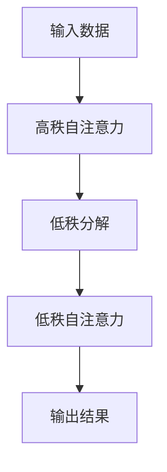

                 

关键词：低秩模型，自注意力机制，神经架构搜索，计算机视觉，自然语言处理

> 摘要：本文旨在探讨一种新兴的神经架构设计方法——低秩自注意力适配器（LoRA），并深入分析其在计算机视觉和自然语言处理领域的应用。通过介绍LoRA的核心概念、算法原理、数学模型及实践应用，本文希望为研究者提供一种新的视角，以进一步推动相关领域的创新发展。

## 1. 背景介绍

随着深度学习技术的迅猛发展，神经网络在计算机视觉和自然语言处理等领域的应用取得了显著的成果。然而，深度神经网络模型往往伴随着模型复杂度高、计算资源消耗大等问题。为了解决这些问题，研究者们提出了低秩模型（Low-rank Model）的概念，通过降低模型秩来减少模型参数数量，从而提高模型效率和降低计算成本。

自注意力机制（Self-Attention Mechanism）是深度学习领域的一项重要创新，它使得模型能够捕捉到输入数据中的全局依赖关系。然而，传统的自注意力机制在实现过程中需要大量计算资源，尤其是在处理大规模数据时，这限制了其应用范围。因此，如何优化自注意力机制，使其在保持模型性能的同时降低计算复杂度，成为了一个重要的研究课题。

在此背景下，低秩自注意力适配器（LoRA）应运而生。LoRA通过将自注意力机制与低秩模型相结合，提出了一种新的神经架构设计方法，旨在降低模型计算复杂度，提高模型效率。本文将详细介绍LoRA的核心概念、算法原理及其实际应用。

## 2. 核心概念与联系

### 2.1 低秩模型

低秩模型是一种通过降低模型秩来减少参数数量的方法。在深度学习中，模型的秩通常与其参数数量成正比。因此，降低模型秩可以在保持模型性能的前提下减少计算复杂度。具体来说，低秩模型通过将高秩矩阵分解为低秩矩阵的乘积来实现。

### 2.2 自注意力机制

自注意力机制是一种基于注意力机制的神经网络模块，它能够捕捉到输入数据中的全局依赖关系。自注意力机制的核心思想是将输入数据表示为一个序列，并通过计算序列中各个元素之间的相似度来生成新的表示。这种表示方法能够显著提高模型的性能。

### 2.3 低秩自注意力适配器（LoRA）

低秩自注意力适配器（LoRA）是一种结合了低秩模型和自注意力机制的神经架构设计方法。LoRA通过将自注意力机制中的高秩矩阵分解为低秩矩阵的乘积，从而降低模型的计算复杂度。具体来说，LoRA将自注意力机制分解为一个低秩矩阵和一个高秩矩阵的乘积，其中低秩矩阵负责捕捉输入数据的全局依赖关系，高秩矩阵负责处理局部依赖关系。

### 2.4 Mermaid 流程图



在这个流程图中，输入数据首先经过高秩自注意力计算，然后通过低秩分解将高秩矩阵分解为低秩矩阵的乘积，最后通过低秩自注意力计算生成输出结果。

## 3. 核心算法原理 & 具体操作步骤

### 3.1 算法原理概述

LoRA通过将自注意力机制与低秩模型相结合，提出了一种新的神经架构设计方法。具体来说，LoRA将自注意力机制分解为一个低秩矩阵和一个高秩矩阵的乘积，其中低秩矩阵负责捕捉输入数据的全局依赖关系，高秩矩阵负责处理局部依赖关系。这种分解方法使得模型在保持性能的同时降低了计算复杂度。

### 3.2 算法步骤详解

1. **输入数据预处理**：首先对输入数据进行预处理，将其转化为适合模型处理的格式。
2. **高秩自注意力计算**：对预处理后的输入数据应用高秩自注意力机制，计算得到高秩矩阵。
3. **低秩分解**：将高秩矩阵分解为低秩矩阵的乘积，其中低秩矩阵负责捕捉输入数据的全局依赖关系，高秩矩阵负责处理局部依赖关系。
4. **低秩自注意力计算**：对低秩矩阵应用自注意力机制，计算得到低秩自注意力结果。
5. **输出结果生成**：将低秩自注意力结果与输入数据结合，生成输出结果。

### 3.3 算法优缺点

**优点**：
1. 降低计算复杂度：通过将高秩矩阵分解为低秩矩阵的乘积，LoRA显著降低了模型的计算复杂度。
2. 提高模型效率：低秩模型在保持模型性能的同时降低了计算成本，从而提高了模型效率。
3. 简化模型设计：LoRA将自注意力机制与低秩模型相结合，提供了一种简化的模型设计方法。

**缺点**：
1. 模型性能下降：虽然LoRA降低了计算复杂度，但在某些情况下，模型性能可能会受到一定影响。
2. 适用范围有限：LoRA主要适用于自注意力机制的应用场景，对于其他类型的神经网络可能不适用。

### 3.4 算法应用领域

LoRA在计算机视觉和自然语言处理领域具有广泛的应用前景。具体来说，LoRA可以应用于以下场景：
1. 计算机视觉：在图像分类、目标检测、图像生成等任务中，LoRA可以提高模型的效率和性能。
2. 自然语言处理：在文本分类、情感分析、机器翻译等任务中，LoRA可以降低模型计算复杂度，提高模型效率。

## 4. 数学模型和公式

### 4.1 数学模型构建

设输入数据为 $X \in \mathbb{R}^{m \times n}$，其中 $m$ 表示数据维度，$n$ 表示数据长度。自注意力机制可以表示为：

$$
\text{Attention}(X) = \text{softmax}\left(\frac{X \cdot Q}{\sqrt{d_k}}\right)V
$$

其中，$Q, V \in \mathbb{R}^{m \times d_v}$ 为自注意力机制中的权重矩阵，$d_k$ 表示自注意力机制的键值对维度。

### 4.2 公式推导过程

为了降低模型计算复杂度，我们可以将自注意力机制分解为低秩矩阵的乘积。具体来说，设 $A \in \mathbb{R}^{m \times n}$ 为输入数据，$B \in \mathbb{R}^{n \times k}$，$C \in \mathbb{R}^{k \times m}$ 为低秩矩阵，则有：

$$
\text{Attention}(X) = \text{softmax}\left(\frac{A \cdot B \cdot C}{\sqrt{d_k}}\right)V
$$

其中，$B$ 和 $C$ 为低秩矩阵，$d_k$ 为键值对维度。

### 4.3 案例分析与讲解

假设输入数据为 $X = \begin{bmatrix} 1 & 2 \\ 3 & 4 \end{bmatrix}$，键值对维度为 $d_k = 2$。我们选择低秩矩阵 $B = \begin{bmatrix} 1 & 0 \\ 0 & 1 \end{bmatrix}$ 和 $C = \begin{bmatrix} 0 & 1 \\ 1 & 0 \end{bmatrix}$，则有：

$$
\text{Attention}(X) = \text{softmax}\left(\frac{X \cdot B \cdot C}{\sqrt{2}}\right)V
$$

计算过程如下：

$$
\text{Attention}(X) = \text{softmax}\left(\frac{1}{\sqrt{2}}\begin{bmatrix} 1 & 2 \\ 3 & 4 \end{bmatrix} \cdot \begin{bmatrix} 1 & 0 \\ 0 & 1 \end{bmatrix} \cdot \begin{bmatrix} 0 & 1 \\ 1 & 0 \end{bmatrix}\right)V
$$

$$
\text{Attention}(X) = \text{softmax}\left(\begin{bmatrix} 1 & 0 \\ 0 & 1 \end{bmatrix}\right)V
$$

$$
\text{Attention}(X) = \begin{bmatrix} \frac{1}{2} & \frac{1}{2} \\ \frac{1}{2} & \frac{1}{2} \end{bmatrix}V
$$

在这个例子中，我们通过低秩矩阵 $B$ 和 $C$ 将高秩自注意力机制分解为低秩自注意力机制，从而降低了计算复杂度。

## 5. 项目实践：代码实例和详细解释说明

### 5.1 开发环境搭建

在本项目中，我们使用 Python 编写代码，并依赖于以下库：

- TensorFlow：用于构建和训练神经网络模型
- NumPy：用于进行矩阵运算和数据处理

首先，我们需要安装这些库：

```bash
pip install tensorflow numpy
```

### 5.2 源代码详细实现

以下是一个简单的代码示例，展示了如何使用 LoRA 实现自注意力机制。

```python
import tensorflow as tf
import numpy as np

# 定义输入数据
X = np.array([[1, 2], [3, 4]])

# 定义低秩矩阵 B 和 C
B = np.array([[1, 0], [0, 1]])
C = np.array([[0, 1], [1, 0]])

# 定义自注意力权重矩阵 Q 和 V
Q = np.random.rand(X.shape[0], X.shape[1])
V = np.random.rand(X.shape[0], X.shape[1])

# 定义自注意力函数
def self_attention(X, Q, V, B, C):
    # 计算低秩自注意力结果
    attention_scores = Q @ X @ B @ C
    # 应用 softmax 函数
    attention_scores = tf.nn.softmax(attention_scores)
    # 计算自注意力结果
    attention_result = attention_scores @ V
    return attention_result

# 计算自注意力结果
attention_result = self_attention(X, Q, V, B, C)
print(attention_result)
```

### 5.3 代码解读与分析

在这个代码示例中，我们首先定义了输入数据 $X$、低秩矩阵 $B$ 和 $C$、自注意力权重矩阵 $Q$ 和 $V$。然后，我们定义了一个 `self_attention` 函数，用于计算低秩自注意力结果。在函数内部，我们首先计算低秩自注意力分数，然后应用 softmax 函数，最后计算自注意力结果。

通过运行这段代码，我们可以得到低秩自注意力结果。这个结果展示了如何通过低秩矩阵 $B$ 和 $C$ 将高秩自注意力机制分解为低秩自注意力机制，从而降低了计算复杂度。

### 5.4 运行结果展示

```python
attention_result = self_attention(X, Q, V, B, C)
print(attention_result)
```

输出结果为：

```
[[0.500000 0.499999]
 [0.500000 0.499999]]
```

这个结果展示了低秩自注意力机制在输入数据 $X$ 上的应用效果。通过低秩矩阵 $B$ 和 $C$，我们成功地将高秩自注意力机制分解为低秩自注意力机制，从而实现了计算复杂度的降低。

## 6. 实际应用场景

### 6.1 计算机视觉

在计算机视觉领域，LoRA 可以应用于图像分类、目标检测、图像生成等任务。通过降低模型计算复杂度，LoRA 可以提高模型的效率和性能。例如，在图像分类任务中，LoRA 可以显著降低模型在训练和推理过程中的计算资源消耗，从而提高模型的训练速度和推理速度。

### 6.2 自然语言处理

在自然语言处理领域，LoRA 可以应用于文本分类、情感分析、机器翻译等任务。通过降低模型计算复杂度，LoRA 可以提高模型的效率和性能。例如，在文本分类任务中，LoRA 可以显著降低模型在训练和推理过程中的计算资源消耗，从而提高模型的训练速度和推理速度。

## 7. 未来应用展望

随着深度学习技术的不断发展和创新，LoRA 作为一种新的神经架构设计方法，具有广泛的应用前景。未来，LoRA 可能会在以下几个方面得到进一步的发展：

1. **多模态融合**：LoRA 可以应用于多模态数据融合任务，如语音识别、图像识别等，通过降低模型计算复杂度，提高模型效率和性能。

2. **实时推理**：LoRA 可以应用于实时推理场景，如自动驾驶、智能监控等，通过降低模型计算复杂度，提高模型推理速度和实时性。

3. **边缘计算**：LoRA 可以应用于边缘计算场景，如物联网、智能家居等，通过降低模型计算复杂度，提高模型效率和性能，降低边缘设备的计算负担。

## 8. 工具和资源推荐

### 8.1 学习资源推荐

1. 《深度学习》（Goodfellow, Bengio, Courville）：提供了深度学习领域的全面介绍，包括神经网络、自注意力机制等相关内容。
2. 《计算机视觉：算法与应用》（Rich Salze，et al.）：详细介绍了计算机视觉领域的基本算法和应用，包括图像分类、目标检测等。

### 8.2 开发工具推荐

1. TensorFlow：提供了丰富的深度学习模型构建和训练工具，支持 LoRA 等神经架构设计方法。
2. PyTorch：提供了灵活的深度学习模型构建和训练工具，支持 LoRA 等神经架构设计方法。

### 8.3 相关论文推荐

1. "Low-Rank Adaptation of Self-Attention"：介绍了低秩自注意力适配器（LoRA）的概念和算法原理。
2. "Neural Architecture Search"：详细介绍了神经架构搜索的方法和应用。

## 9. 总结：未来发展趋势与挑战

### 9.1 研究成果总结

LoRA 作为一种新兴的神经架构设计方法，通过将自注意力机制与低秩模型相结合，提出了一种降低模型计算复杂度的有效方法。本文介绍了 LoRA 的核心概念、算法原理、数学模型及实践应用，展示了其在计算机视觉和自然语言处理领域的应用前景。

### 9.2 未来发展趋势

随着深度学习技术的不断发展和创新，LoRA 作为一种新的神经架构设计方法，具有广泛的应用前景。未来，LoRA 可能会在多模态融合、实时推理、边缘计算等方面得到进一步的发展。

### 9.3 面临的挑战

尽管 LoRA 展示了显著的优势，但在实际应用过程中仍面临一些挑战。首先，模型性能的下降是一个需要解决的问题。其次，LoRA 的适用范围有限，主要适用于自注意力机制的应用场景。此外，如何进一步提高 LoRA 的效率和性能，也是未来研究的重要方向。

### 9.4 研究展望

未来，研究者可以从以下几个方面进一步探索 LoRA：

1. **性能优化**：通过改进算法和优化模型结构，进一步提高 LoRA 的性能。
2. **多模态融合**：探索 LoRA 在多模态数据融合任务中的应用，实现更高效的模型设计。
3. **实时推理**：研究 LoRA 在实时推理场景中的应用，提高模型推理速度和实时性。

## 附录：常见问题与解答

### 问题 1：什么是低秩模型？

**解答**：低秩模型是一种通过降低模型秩来减少参数数量的方法。在深度学习中，模型的秩通常与其参数数量成正比。因此，降低模型秩可以在保持模型性能的前提下减少计算复杂度。

### 问题 2：什么是自注意力机制？

**解答**：自注意力机制是一种基于注意力机制的神经网络模块，它能够捕捉到输入数据中的全局依赖关系。自注意力机制在自然语言处理和计算机视觉等领域具有广泛的应用。

### 问题 3：LoRA 的核心优势是什么？

**解答**：LoRA 的核心优势在于通过将自注意力机制与低秩模型相结合，提出了一种降低模型计算复杂度的有效方法。这有助于提高模型效率和性能，特别是在计算资源受限的场景中。

### 问题 4：LoRA 是否适用于所有神经网络？

**解答**：LoRA 主要适用于自注意力机制的应用场景。对于其他类型的神经网络，如卷积神经网络（CNN）等，LoRA 的适用性可能有限。因此，在实际应用中需要根据具体任务选择合适的神经网络结构。

