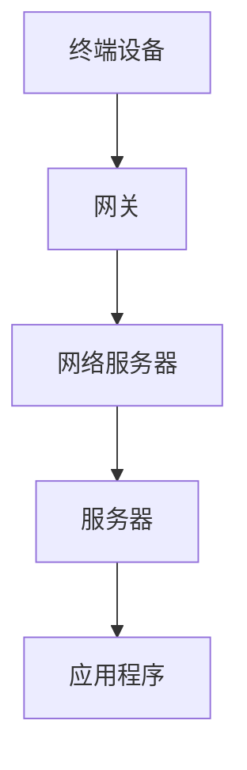

                 

关键词：LoRaWAN、IoT、低功耗广域网络、物联网、传感器网络、通信协议、网络架构、部署与优化、应用场景

> 摘要：本文深入探讨了LoRaWAN（Long Range Wide Area Network）作为物联网（IoT）中的低功耗广域网络技术的应用。通过背景介绍、核心概念与架构、算法原理、数学模型、项目实践以及未来展望等多个维度，全面解析了LoRaWAN的运作机制、优势与挑战，为IoT领域的从业者提供了有价值的参考。

## 1. 背景介绍

随着物联网（IoT）的迅速发展，越来越多的设备和系统通过互联网进行连接和数据交换。传统的无线通信技术在覆盖范围、功耗、可靠性等方面存在诸多限制，难以满足大规模物联网应用的需求。因此，一种新的通信协议和架构——低功耗广域网络（LPWAN）应运而生，其中最具代表性的是LoRaWAN。

LoRaWAN是由LoRa联盟（LoRa Alliance）推出的一种通信协议，旨在为物联网提供长距离、低功耗、低成本的数据传输解决方案。其基于LoRa（Long Range）调制技术，能够实现低速率、远距离的通信，特别适用于传感器网络和远程监控应用。

LoRaWAN的出现不仅解决了传统无线通信的许多问题，还为物联网的进一步发展提供了有力支持。本文将详细介绍LoRaWAN的核心概念、架构、算法原理、数学模型以及实际应用，帮助读者全面了解这一技术。

## 2. 核心概念与联系

### 2.1 LoRaWAN的定义与特点

LoRaWAN是一种无线通信协议，专门为物联网应用设计。它基于LoRa调制技术，具有以下特点：

- **长距离传输**：LoRaWAN可以覆盖广泛的地理区域，单频段的通信距离可达数十公里，多频段通信可以实现全球覆盖。

- **低功耗**：LoRaWAN采用自适应数据速率技术，可以根据信道状况和传输距离动态调整数据速率，从而实现低功耗通信。

- **多节点连接**：LoRaWAN支持大量设备同时连接，特别适合大规模物联网部署。

- **安全性**：LoRaWAN提供端到端的数据加密和身份验证机制，确保数据传输的安全性和隐私性。

- **低成本**：LoRaWAN设备相对便宜，易于部署和维护，降低了物联网应用的门槛。

### 2.2 LoRaWAN的架构

LoRaWAN的架构分为三个层次：设备层、网络层和应用层。

- **设备层**：由终端设备（End Node）和网关（Gateway）组成。终端设备负责数据采集和发送，网关负责将终端设备的数据转发到网络。

- **网络层**：由网络服务器（Network Server）和服务器（Server）组成。网络服务器负责管理终端设备和网关，服务器负责数据存储和处理。

- **应用层**：由应用程序（Application）组成，负责处理和分析来自终端设备的数据，实现具体业务功能。

### 2.3 Mermaid流程图

下面是一个描述LoRaWAN架构的Mermaid流程图：



## 3. 核心算法原理 & 具体操作步骤

### 3.1 算法原理概述

LoRaWAN的核心算法主要包括三个部分：数据速率自适应、频率跳变和前向纠错编码。

- **数据速率自适应**：LoRaWAN采用自适应数据速率技术，根据信道状况和传输距离动态调整数据速率。高数据速率适合短距离、高带宽应用，低数据速率适合长距离、低带宽应用。

- **频率跳变**：LoRaWAN采用频率跳变（FHSS）技术，在传输过程中不断更换频率，以提高通信的稳定性和抗干扰能力。

- **前向纠错编码**：LoRaWAN采用前向纠错编码（FEC），增加传输数据的冗余度，提高数据传输的可靠性。

### 3.2 算法步骤详解

LoRaWAN的通信过程可以分为以下几个步骤：

1. **终端设备发送数据**：终端设备将数据发送到网关。

2. **网关接收数据**：网关接收终端设备的数据，并将其转发到网络服务器。

3. **网络服务器处理数据**：网络服务器对接收到的数据进行处理，包括数据加密、认证、路由和存储。

4. **服务器处理数据**：服务器对网络服务器转发来的数据进行进一步处理，包括数据分析和应用逻辑执行。

5. **应用程序处理数据**：应用程序对接收到的数据进行处理，实现具体业务功能。

### 3.3 算法优缺点

- **优点**：
  - 长距离传输：LoRaWAN可以覆盖广泛的地理区域。
  - 低功耗：自适应数据速率技术实现低功耗通信。
  - 安全性：提供端到端的数据加密和身份验证机制。
  - 成本低：设备便宜，易于部署和维护。

- **缺点**：
  - 数据速率较低：LoRaWAN适合低速率应用。
  - 容易受干扰：频率跳变技术虽然提高稳定性，但仍然容易受到外部干扰。

### 3.4 算法应用领域

LoRaWAN在以下领域具有广泛的应用前景：

- **智慧城市**：环境监测、垃圾回收、路灯管理、交通监控等。
- **智能家居**：智能门锁、智能照明、智能家电等。
- **工业物联网**：设备监控、远程维护、能耗管理、生产优化等。
- **农业物联网**：土壤湿度监测、作物生长监测、自动化灌溉等。

## 4. 数学模型和公式

### 4.1 数学模型构建

LoRaWAN的数学模型主要包括信号模型和信道模型。

- **信号模型**：描述了信号在信道中的传播特性，包括信号功率、带宽和调制方式等。
- **信道模型**：描述了信道对信号的影响，包括信道衰减、噪声和干扰等。

### 4.2 公式推导过程

下面是一个描述信号传播的数学模型：

$$
P_r = P_t + G_t + G_r + K_d \cdot d
$$

其中，$P_r$表示接收信号功率，$P_t$表示发射信号功率，$G_t$和$G_r$分别表示发射天线和接收天线的增益，$K_d$表示与距离相关的常数，$d$表示发射天线和接收天线之间的距离。

### 4.3 案例分析与讲解

假设一个LoRaWAN终端设备距离网关10公里，发射功率为20dBm，发射天线增益为2dB，接收天线增益为3dB，距离相关常数$K_d$为0.001，求接收信号功率。

根据上述公式，代入数值计算：

$$
P_r = 20dBm + 2dB + 3dB + 0.001 \cdot 10km
$$

$$
P_r = 25.1dBm
$$

因此，接收信号功率为25.1dBm。这个值表明信号在传输过程中受到了一定的衰减，但仍然可以在接收端恢复。

## 5. 项目实践：代码实例和详细解释说明

### 5.1 开发环境搭建

为了实践LoRaWAN，我们需要搭建一个开发环境。以下是搭建环境的基本步骤：

1. 安装LoRaWAN网关软件，如LoRaServer或LoRa Gateway Bridge。
2. 配置网络服务器，如LoRa Server或TtnServer。
3. 选择合适的开发工具，如Python或Node.js。
4. 安装相关库和依赖项，如PyLoRa或LoRaWAN Node.js SDK。

### 5.2 源代码详细实现

以下是一个简单的Python示例，用于实现一个LoRaWAN终端设备的通信。

```python
import time
from pylorawan import PyLoRaWAN

# 初始化LoRaWAN终端设备
device = PyLoRaWAN()

# 设置网络服务器地址和设备密钥
device.set_network_server("https://example.com", "your_device_key")

# 发送数据
while True:
    data = "Hello, World!"
    device.send_data(data)
    time.sleep(60)
```

### 5.3 代码解读与分析

上述代码首先导入所需的库，然后初始化LoRaWAN终端设备。接着，设置网络服务器地址和设备密钥，确保设备能够连接到网络。最后，进入一个无限循环，每隔60秒发送一次数据。

这个示例展示了LoRaWAN终端设备的基本通信流程，包括连接网络、发送数据和解码数据。在实际应用中，可以根据需要进行扩展和定制。

### 5.4 运行结果展示

当运行上述代码时，终端设备将连接到网络服务器，并发送数据。网络服务器将接收并处理这些数据，并将其存储或转发到应用程序。

## 6. 实际应用场景

### 6.1 智慧城市

LoRaWAN在智慧城市中的应用广泛，如环境监测、垃圾回收和路灯管理。通过部署LoRaWAN网关和终端设备，可以实现实时数据采集和远程监控，提高城市管理效率。

### 6.2 智能家居

LoRaWAN在智能家居中也非常适用，如智能门锁、智能照明和智能家电。通过LoRaWAN网络，可以实现设备之间的远程控制和数据交换，提高家居生活的便利性。

### 6.3 工业物联网

LoRaWAN在工业物联网中可用于设备监控、远程维护和能耗管理。通过部署LoRaWAN网络，可以实现设备之间的数据传输和远程监控，提高生产效率。

### 6.4 农业物联网

LoRaWAN在农业物联网中可用于土壤湿度监测、作物生长监测和自动化灌溉。通过LoRaWAN网络，可以实现农业生产过程中的实时数据采集和远程控制，提高农业生产的效率和质量。

## 7. 工具和资源推荐

### 7.1 学习资源推荐

- 《LoRaWAN：低功耗广域网络在物联网中的应用》
- 《物联网：从概念到实践》
- 《智慧城市：物联网、大数据与云计算的融合应用》

### 7.2 开发工具推荐

- PyLoRa：Python库，用于实现LoRaWAN通信。
- LoRaWAN Node.js SDK：Node.js库，用于实现LoRaWAN通信。
- LoRa Server：LoRaWAN网络服务器。

### 7.3 相关论文推荐

- "LoRaWAN: A Secure and Flexible Network for the Internet of Things"
- "A Survey on Low-Power Wide Area Networks for the Internet of Things"
- "Smart City: A Comprehensive Survey on Applications, Technologies, and Challenges"

## 8. 总结：未来发展趋势与挑战

### 8.1 研究成果总结

LoRaWAN作为一种低功耗广域网络技术，在物联网领域取得了显著成果。其长距离传输、低功耗、多节点连接和安全性等特点，使其在智慧城市、智能家居、工业物联网和农业物联网等领域具有广泛的应用前景。

### 8.2 未来发展趋势

未来，LoRaWAN将继续发展，提升通信速率、降低功耗、提高安全性，并与其他物联网技术深度融合，如5G、NB-IoT和Wi-Fi等。同时，LoRaWAN也将向更多垂直行业拓展，推动物联网的进一步发展。

### 8.3 面临的挑战

尽管LoRaWAN在物联网领域具有广泛应用，但仍面临一些挑战。主要包括：

- **频谱资源竞争**：LoRaWAN需要占用大量的频谱资源，与其他无线通信技术存在频谱资源竞争。
- **信道干扰**：LoRaWAN采用频率跳变技术，虽然提高通信的稳定性，但仍然容易受到外部干扰。
- **数据速率限制**：LoRaWAN的数据速率相对较低，难以满足高速数据传输的需求。

### 8.4 研究展望

未来，LoRaWAN的研究将主要集中在以下几个方面：

- **提高通信速率**：通过改进调制技术、编码技术和信道编码技术，提高LoRaWAN的数据传输速率。
- **降低功耗**：通过优化协议设计、硬件设计和算法，降低LoRaWAN的功耗。
- **增强安全性**：通过改进加密算法、身份验证机制和网络安全协议，提高LoRaWAN的安全性。

## 9. 附录：常见问题与解答

### 9.1 LoRaWAN的通信距离是多少？

LoRaWAN的通信距离取决于多种因素，如信道状况、传输距离、发射功率和接收灵敏度等。在理想条件下，单频段的通信距离可达数十公里，多频段通信可以实现全球覆盖。

### 9.2 LoRaWAN的数据速率是多少？

LoRaWAN的数据速率较低，一般在50kbps到300kbps之间。数据速率取决于信道状况、传输距离和调制方式等。

### 9.3 如何确保LoRaWAN通信的安全性？

LoRaWAN提供端到端的数据加密和身份验证机制，确保数据传输的安全性和隐私性。用户可以通过配置网络服务器和终端设备，实现数据加密和身份验证。

### 9.4 LoRaWAN是否适合我的应用场景？

LoRaWAN适合大多数物联网应用场景，特别是需要长距离、低功耗、多节点连接和安全性要求较高的应用场景。如果您不确定是否适合，请咨询相关领域的专家或供应商。

---

**作者：禅与计算机程序设计艺术 / Zen and the Art of Computer Programming**

