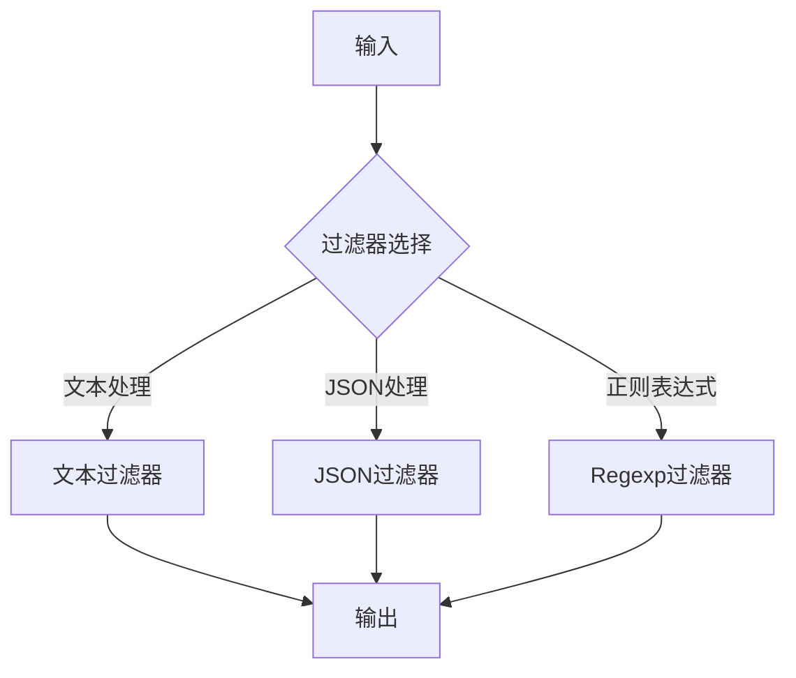

                 

  
## 1. 背景介绍

在当今数字化时代，日志数据在系统运维、性能优化、安全监控等领域扮演着至关重要的角色。然而，由于日志数据的多样性和复杂性，如何有效地处理和利用这些日志数据成为了一个挑战。Logstash是一款开源的数据处理工具，它能够帮助用户轻松地收集、过滤和转换日志数据，并将其导入到指定的存储或分析系统中。本文将深入探讨Logstash的工作原理、核心概念及其在实际应用中的重要性。

### 日志数据的重要性

日志数据是系统运行过程中产生的记录，包括错误、警告、调试信息等。它们不仅可以帮助我们了解系统的工作状态，还可以用于故障排除、性能分析和安全监控。然而，日志数据往往非常庞大且分散，处理这些数据需要高效且可靠的工具。

### Logstash的背景

Logstash最初是由Elasticsearch的开发者Elastic公司推出的，作为Elastic Stack的一部分。Elastic Stack是一个强大的开源工具集，旨在提供从数据收集、存储到分析的一系列解决方案。Logstash作为其中的一员，负责收集和预处理日志数据，以确保这些数据能够被Elasticsearch或Elasticsearch相关产品（如Kibana）有效地存储和分析。

### Logstash的优势

- **灵活性强**：Logstash支持多种输入和输出插件，可以轻松地与各种数据源和存储系统集成。
- **可扩展性好**：Logstash的处理能力可以水平扩展，以处理大规模的日志数据。
- **易于配置**：Logstash的配置基于JSON格式，使得配置和管理工作变得简单且直观。

## 2. 核心概念与联系

### Logstash的核心概念

- **输入（Inputs）**：负责从不同的数据源收集日志数据，如文件、网络套接字、消息队列等。
- **过滤（Filters）**：对收集到的日志数据进行处理和转换，以提取有用的信息或进行格式化。
- **输出（Outputs）**：将处理后的日志数据发送到指定的存储或分析系统，如Elasticsearch、MongoDB等。

### Logstash的整体架构


### Mermaid流程图



## 3. 核心算法原理 & 具体操作步骤

### 3.1 算法原理概述

Logstash的核心算法基于数据流处理模型，主要包括输入、过滤和输出三个主要阶段。

- **输入阶段**：Logstash从各种数据源（如文件、网络套接字、消息队列等）收集日志数据。
- **过滤阶段**：根据配置的过滤器对日志数据进行处理和转换，以提取有用的信息或进行格式化。
- **输出阶段**：将处理后的日志数据发送到指定的存储或分析系统。

### 3.2 算法步骤详解

1. **启动Logstash**：在配置文件中指定输入、过滤和输出的插件。
2. **收集日志数据**：Logstash从指定的数据源读取日志数据。
3. **过滤日志数据**：根据配置的过滤器对日志数据进行处理，如文本过滤、JSON解析、正则表达式匹配等。
4. **输出日志数据**：将处理后的日志数据发送到指定的存储或分析系统。

### 3.3 算法优缺点

**优点**：

- **灵活性高**：Logstash支持多种输入和输出插件，可以与各种数据源和存储系统集成。
- **扩展性强**：Logstash可以水平扩展，以处理大规模的日志数据。
- **易于配置**：基于JSON格式的配置文件，使得配置和管理工作变得简单。

**缺点**：

- **性能瓶颈**：在处理大量日志数据时，单台Logstash服务器可能会成为性能瓶颈。
- **维护复杂**：由于插件众多，配置和管理工作可能会变得复杂。

### 3.4 算法应用领域

- **系统监控**：收集和分析系统日志，以便快速发现和解决问题。
- **安全监控**：分析日志数据，以检测潜在的安全威胁。
- **性能分析**：通过日志数据进行分析，优化系统性能。

## 4. 数学模型和公式 & 详细讲解 & 举例说明

### 4.1 数学模型构建

在Logstash中，数据处理过程可以看作是一个数据流模型，其中每个节点表示一个处理步骤，数据从输入节点流向输出节点。数学上，我们可以将这个过程表示为一个有向图，其中每个节点都有一定的处理时间和延迟。

### 4.2 公式推导过程

设Logstash中的处理节点数为 \( n \)，每个节点的处理时间为 \( t_i \)，则整个数据处理时间 \( T \) 可以表示为：

\[ T = \sum_{i=1}^{n} t_i + \sum_{i=1}^{n-1} d_i \]

其中， \( d_i \) 表示节点 \( i \) 到节点 \( i+1 \) 的延迟时间。

### 4.3 案例分析与讲解

假设我们有一个Logstash配置，其中包含3个处理节点，每个节点的处理时间分别为1秒、2秒和3秒。节点之间的延迟时间均为0.5秒。根据上述公式，整个数据处理时间 \( T \) 为：

\[ T = 1 + 2 + 3 + 0.5 + 0.5 = 7 \text{ 秒} \]

这意味着，如果一个日志事件从输入节点开始，经过所有处理节点后到达输出节点，整个过程需要7秒的时间。

## 5. 项目实践：代码实例和详细解释说明

### 5.1 开发环境搭建

要使用Logstash，首先需要安装Elasticsearch和Kibana，因为Logstash作为Elastic Stack的一部分，依赖于这些组件。具体安装步骤可以参考Elastic官方文档。

### 5.2 源代码详细实现

以下是一个简单的Logstash配置文件示例，用于从文件中读取日志数据，并将其发送到Elasticsearch：

```json
input {
    file {
        path => "/path/to/logs/*.log"
        type => "syslog"
    }
}

filter {
    if "syslog" in [type] {
        grok {
            match => { "message" => "%{TIMESTAMP_ISO8601} %{DATA:hostname} %{DATA:program} %{DATA:pid} %{DATA:msgid} %{GREEDYDATA:msg}" }
        }
    }
}

output {
    if "syslog" in [type] {
        elasticsearch {
            hosts => ["localhost:9200"]
            index => "logstash-%{+YYYY.MM.dd}"
        }
    }
}
```

### 5.3 代码解读与分析

- **输入部分**：定义了文件输入插件，用于从指定路径的日志文件中读取数据，并将数据类型设置为“syslog”。
- **过滤部分**：使用Grok过滤器对日志数据进行模式匹配，提取出有用的信息，如时间戳、主机名、程序名称、进程ID和消息内容。
- **输出部分**：将处理后的日志数据发送到Elasticsearch，并定义了索引名称的模板，以便按日期创建索引。

### 5.4 运行结果展示

在运行Logstash之后，我们可以使用Kibana查看Elasticsearch中的日志数据。通过Kibana的搜索和分析功能，可以轻松地发现和解决问题。

## 6. 实际应用场景

### 6.1 系统监控

Logstash可以用来收集和分析系统日志，以便快速发现和解决问题。例如，在大型分布式系统中，使用Logstash可以收集所有服务器的日志，然后统一分析，以便更好地监控系统的健康状况。

### 6.2 安全监控

通过分析日志数据，Logstash可以帮助识别潜在的安全威胁。例如，可以使用正则表达式匹配来检测恶意IP地址、异常登录尝试等。

### 6.3 性能分析

通过对日志数据进行分析，可以优化系统性能。例如，分析系统日志可以帮助确定哪些操作或请求对系统性能产生了负面影响，然后针对性地进行优化。

## 7. 工具和资源推荐

### 7.1 学习资源推荐

- **官方文档**：Elastic官方文档提供了详细的Logstash配置和使用说明。
- **在线课程**：多个在线平台提供了关于Logstash的免费和付费课程。
- **社区论坛**：Elastic社区论坛是一个很好的资源，可以解决使用Logstash时遇到的问题。

### 7.2 开发工具推荐

- **Visual Studio Code**：一个强大的代码编辑器，支持Logstash配置文件的语法高亮和插件管理。
- **Logstash Forwarder**：一个轻量级的Logstash输入插件，适用于需要将日志数据发送到Logstash的场景。

### 7.3 相关论文推荐

- **"Elastic Stack: The Definitive Guide to Using Elasticsearch, Logstash, and Kibana"**：这是一本关于Elastic Stack的权威指南，其中详细介绍了Logstash的使用方法。
- **"Building a Real-Time Analytics Platform with Logstash, Elasticsearch, and Kibana"**：这篇文章讨论了如何使用Logstash、Elasticsearch和Kibana构建实时数据分析平台。

## 8. 总结：未来发展趋势与挑战

### 8.1 研究成果总结

本文详细介绍了Logstash的工作原理、核心概念、算法原理以及实际应用场景。通过分析，Logstash作为一种高效、灵活的日志数据处理工具，在系统监控、安全监控和性能分析等领域具有广泛的应用。

### 8.2 未来发展趋势

随着大数据和云计算技术的发展，Logstash在处理和分析大规模日志数据方面将发挥越来越重要的作用。未来，Logstash可能会更加注重性能优化、自动化配置和与更多数据源的集成。

### 8.3 面临的挑战

- **性能瓶颈**：在处理大规模日志数据时，单台Logstash服务器可能会成为性能瓶颈。
- **维护复杂性**：随着插件和功能的增加，Logstash的配置和管理可能会变得复杂。

### 8.4 研究展望

未来，Logstash的研究将集中在以下几个方面：

- **性能优化**：通过分布式架构和并行处理技术，提高Logstash的处理性能。
- **自动化配置**：开发更智能的配置工具，以简化Logstash的配置和管理。
- **生态拓展**：与更多数据源和存储系统的集成，以扩大Logstash的应用范围。

## 9. 附录：常见问题与解答

### 9.1 如何安装Logstash？

您可以通过Elastic官方文档了解如何在不同操作系统上安装Logstash。

### 9.2 Logstash如何处理海量日志数据？

Logstash支持分布式架构，可以通过增加Logstash实例来水平扩展，以处理海量日志数据。

### 9.3 Logstash的配置文件是什么格式？

Logstash的配置文件使用JSON格式，这使得配置和管理变得简单且直观。

## 作者署名

本文作者：禅与计算机程序设计艺术 / Zen and the Art of Computer Programming
----------------------------------------------------------------
### 结束语

通过本文的介绍，我们深入了解了Logstash的工作原理、核心概念及其在实际应用中的重要性。Logstash作为一种高效的日志数据处理工具，在系统监控、安全监控和性能分析等领域具有广泛的应用。未来，随着大数据和云计算技术的发展，Logstash将在处理和分析大规模日志数据方面发挥更加重要的作用。希望本文能为您提供有关Logstash的全面了解，并帮助您在实际项目中更好地应用这一工具。感谢您的阅读！

