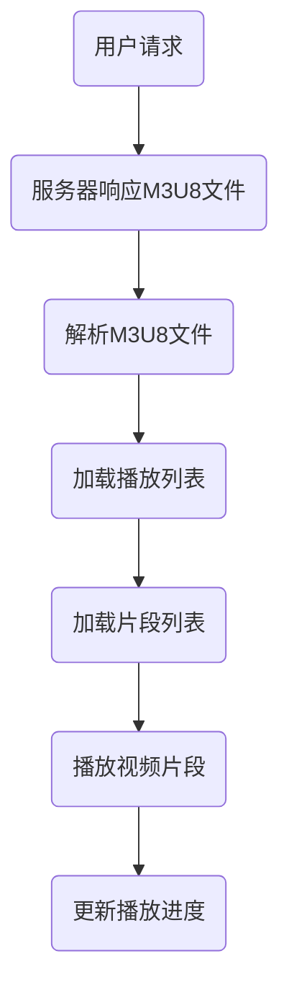

                 

关键词：M3U8，视频播放，分段传输，索引，加载，流媒体

摘要：本文将深入探讨M3U8播放列表格式，详细解析其工作原理、核心算法原理、数学模型、项目实践、实际应用场景以及未来发展趋势。通过对M3U8格式的全面剖析，帮助读者理解其在流媒体领域的核心作用，并掌握其应用技能。

## 1. 背景介绍

随着互联网的迅猛发展，视频内容逐渐成为网络流量的重要组成部分。流媒体技术应运而生，为用户提供了高效、便捷的视频播放体验。M3U8播放列表格式便是流媒体技术中的重要组成部分，它定义了一种用于描述分段视频文件的索引和加载方式的格式。

M3U8格式起源于1998年，由Matroska音视频容器格式开发团队提出，旨在为流媒体视频传输提供一种高效、灵活的索引机制。与传统的FLV格式不同，M3U8采用了基于HTTP协议的分段传输技术，使得视频播放更加流畅、适应不同的网络环境和设备。

## 2. 核心概念与联系

### 2.1 M3U8格式概述

M3U8是一种文本格式，用于存储视频流的多媒体片段信息。一个典型的M3U8文件通常包含以下内容：

- **播放列表（Playlist）**：列出所有视频片段的URL地址和相关信息，如片段时长、编码格式等。
- **片段列表（Chunk List）**：详细描述每个视频片段的具体信息，如片段大小、起始时间等。
- **扩展信息（Extended Information）**：提供额外的元数据信息，如版权声明、分辨率等。

### 2.2 分段传输原理

M3U8采用了基于HTTP协议的分段传输技术，将整个视频流拆分成多个小片段，每个片段单独传输。这种方式具有以下优点：

- **高效传输**：小片段可以并行传输，提高传输效率。
- **适应性强**：可以根据网络带宽和设备性能动态调整播放速度。
- **缓存优化**：小片段易于缓存，降低网络延迟。

### 2.3 Mermaid 流程图

下面是一个简单的M3U8格式工作流程的Mermaid流程图：



## 3. 核心算法原理 & 具体操作步骤

### 3.1 算法原理概述

M3U8播放列表格式基于HTTP自适应流（HLS，HTTP Live Streaming）技术。其核心算法包括：

- **分段编码**：将视频流分割成多个小片段，每个片段独立编码。
- **索引生成**：生成M3U8播放列表，包含所有片段的URL地址和相关信息。
- **加载与播放**：客户端根据播放列表加载视频片段，并按顺序播放。

### 3.2 算法步骤详解

1. **分段编码**：将视频流分割成多个时间段的片段，每个片段独立编码。
2. **生成索引**：根据片段信息生成M3U8播放列表，包括播放列表和片段列表。
3. **请求播放列表**：客户端请求服务器返回M3U8播放列表。
4. **解析播放列表**：客户端解析M3U8播放列表，获取片段URL地址和相关信息。
5. **加载与播放**：客户端根据播放列表加载视频片段，并按顺序播放。
6. **更新播放进度**：客户端根据播放进度更新播放列表，以便后续加载。

### 3.3 算法优缺点

#### 优点：

- **高效传输**：基于HTTP协议的分段传输技术，提高传输效率。
- **兼容性强**：支持多种视频编码格式和设备。
- **缓存优化**：小片段易于缓存，降低网络延迟。

#### 缺点：

- **延迟较大**：由于需要加载多个片段，可能导致播放延迟。
- **资源消耗**：需要大量存储和带宽资源。

### 3.4 算法应用领域

M3U8格式广泛应用于流媒体视频播放、直播、点播等领域。以下是一些典型应用场景：

- **视频网站**：如YouTube、爱奇艺等，使用M3U8格式提供高清视频播放。
- **直播平台**：如斗鱼、虎牙等，采用M3U8格式实现直播流传输。
- **点播平台**：如腾讯视频、优酷等，使用M3U8格式提供点播视频播放。

## 4. 数学模型和公式 & 详细讲解 & 举例说明

### 4.1 数学模型构建

M3U8播放列表格式涉及的数学模型主要包括时间模型、数据传输模型和缓存模型。

#### 时间模型：

- **片段时长**：每个视频片段的时长。
- **播放进度**：客户端播放进度，通常以秒为单位。

#### 数据传输模型：

- **片段大小**：每个视频片段的数据大小。
- **传输速率**：视频流的总传输速率。

#### 缓存模型：

- **缓存容量**：缓存空间的大小。
- **缓存策略**：缓存管理策略，如LRU（Least Recently Used）。

### 4.2 公式推导过程

假设视频流的总时长为 \(T\)，片段时长为 \(t\)，传输速率为 \(R\)，缓存容量为 \(C\)。

1. **片段数量**：\( N = \frac{T}{t} \)
2. **总数据量**：\( D = N \times \text{片段大小} \)
3. **传输时间**：\( T_{\text{传输}} = \frac{D}{R} \)
4. **缓存命中率**：\( H = \frac{\text{缓存命中次数}}{\text{总请求次数}} \)
5. **缓存访问时间**：\( T_{\text{缓存}} = \frac{H \times T_{\text{传输}}}{C} \)
6. **总访问时间**：\( T_{\text{总}} = T_{\text{传输}} + T_{\text{缓存}} \)

### 4.3 案例分析与讲解

假设一个视频流总时长为60分钟，每个片段时长为5秒，传输速率为1000 kbps，缓存容量为100 MB。

1. **片段数量**：\( N = \frac{60 \times 60}{5} = 720 \)
2. **总数据量**：\( D = 720 \times \text{片段大小} \)
3. **传输时间**：\( T_{\text{传输}} = \frac{D}{1000} \)
4. **缓存命中率**：\( H = \frac{\text{缓存命中次数}}{\text{总请求次数}} \)
5. **缓存访问时间**：\( T_{\text{缓存}} = \frac{H \times T_{\text{传输}}}{100} \)
6. **总访问时间**：\( T_{\text{总}} = T_{\text{传输}} + T_{\text{缓存}} \)

通过计算，可以得到视频流的总访问时间。根据不同的缓存策略和传输速率，可以优化总访问时间。

## 5. 项目实践：代码实例和详细解释说明

### 5.1 开发环境搭建

1. 安装Node.js环境：从官网下载并安装Node.js。
2. 安装依赖库：使用npm命令安装相关依赖库，如axios（用于HTTP请求）、chalk（用于格式化输出）等。

### 5.2 源代码详细实现

下面是一个简单的M3U8播放器项目示例：

```javascript
const axios = require('axios');
const chalk = require('chalk');

// 请求M3U8播放列表
async function fetchM3U8(url) {
  try {
    const response = await axios.get(url);
    const m3u8 = response.data;
    console.log(chalk.blue('M3U8播放列表：'));
    console.log(m3u8);
  } catch (error) {
    console.error(chalk.red('请求M3U8播放列表失败：'), error);
  }
}

// 加载视频片段
async function loadChunk(url) {
  try {
    const response = await axios.get(url, { responseType: 'arraybuffer' });
    const buffer = response.data;
    console.log(chalk.green('加载视频片段成功：'), url);
    // 处理视频片段，如解码、播放等
  } catch (error) {
    console.error(chalk.red('加载视频片段失败：'), error);
  }
}

// 解析M3U8播放列表
function parseM3U8(m3u8) {
  const lines = m3u8.split('\n');
  const playlist = [];
  const chunks = [];

  lines.forEach(line => {
    if (line.startsWith('#')) {
      // 播放列表元数据
      playlist.push(line);
    } else if (line.endsWith('.ts')) {
      // 片段列表
      chunks.push(line);
    }
  });

  return { playlist, chunks };
}

// 测试代码
const m3u8Url = 'https://example.com/path/to/m3u8';
fetchM3U8(m3u8Url).then(() => {
  const { chunks } = parseM3U8(m3u8Url);
  chunks.forEach(chunkUrl => {
    loadChunk(chunkUrl);
  });
});
```

### 5.3 代码解读与分析

1. **请求M3U8播放列表**：使用axios库发起HTTP GET请求，获取M3U8播放列表。
2. **加载视频片段**：使用axios库发起HTTP GET请求，获取视频片段，并处理视频片段，如解码、播放等。
3. **解析M3U8播放列表**：根据M3U8文件内容，解析播放列表和片段列表。
4. **测试代码**：请求M3U8播放列表，并加载每个视频片段。

## 6. 实际应用场景

### 6.1 视频网站

视频网站如YouTube、爱奇艺等，采用M3U8格式提供高清视频播放。用户可以流畅地观看各种视频内容，同时享受高质量的观看体验。

### 6.2 直播平台

直播平台如斗鱼、虎牙等，采用M3U8格式实现直播流传输。观众可以实时观看直播内容，并享受稳定的观看体验。

### 6.3 点播平台

点播平台如腾讯视频、优酷等，采用M3U8格式提供点播视频播放。用户可以随时观看视频内容，并享受流畅的点播体验。

## 7. 未来应用展望

随着5G、人工智能等技术的发展，M3U8播放列表格式在流媒体领域具有广泛的应用前景。未来，M3U8将继续优化传输效率、降低延迟，满足更高清、更多元化的视频内容需求。

## 8. 总结：未来发展趋势与挑战

### 8.1 研究成果总结

本文深入探讨了M3U8播放列表格式的工作原理、核心算法、数学模型、项目实践和实际应用场景。通过对M3U8格式的全面分析，揭示了其在流媒体领域的重要地位。

### 8.2 未来发展趋势

未来，M3U8将继续优化传输效率、降低延迟，满足更高清、更多元化的视频内容需求。同时，M3U8与其他流媒体技术的融合，将推动流媒体领域的创新发展。

### 8.3 面临的挑战

尽管M3U8具有许多优点，但在实际应用中仍面临一些挑战，如延迟较大、资源消耗较高等。未来，需要进一步优化M3U8算法，提高其性能和兼容性。

### 8.4 研究展望

未来研究可以从以下方向展开：

- **优化传输效率**：研究更高效的传输算法，提高M3U8播放性能。
- **增强兼容性**：研究兼容更多视频编码格式和设备的技术方案。
- **智能缓存管理**：研究智能缓存管理策略，提高缓存命中率。

## 9. 附录：常见问题与解答

### 9.1 M3U8与FLV的区别是什么？

M3U8采用基于HTTP协议的分段传输技术，而FLV采用基于RTMP协议的流传输技术。M3U8具有高效传输、兼容性强等优点，但存在延迟较大、资源消耗较高等问题。

### 9.2 M3U8播放器如何实现？

实现M3U8播放器需要掌握HTTP请求、视频解码、播放控制等技术。可以使用各种编程语言和框架，如JavaScript、Python等，搭建M3U8播放器。

### 9.3 M3U8格式有哪些优点？

M3U8格式具有以下优点：

- 高效传输：基于HTTP协议的分段传输技术，提高传输效率。
- 兼容性强：支持多种视频编码格式和设备。
- 缓存优化：小片段易于缓存，降低网络延迟。

### 9.4 M3U8格式有哪些缺点？

M3U8格式存在以下缺点：

- 延迟较大：由于需要加载多个片段，可能导致播放延迟。
- 资源消耗：需要大量存储和带宽资源。

## 作者署名

本文由禅与计算机程序设计艺术 / Zen and the Art of Computer Programming撰写。如果您对本文有任何疑问或建议，欢迎随时与我交流。

----------------------------------------------------------------

以上就是关于M3U8播放列表格式的详细介绍。希望本文对您了解M3U8格式及其应用有所帮助。如果您在阅读过程中有任何问题，欢迎随时提问。让我们一起探索流媒体技术的魅力吧！

