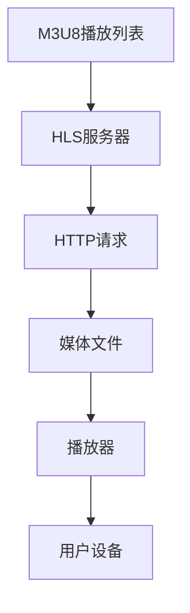

                 

关键词：M3U8，HLS，流媒体，自适应比特率，编码技术

摘要：本文将深入探讨M3U8与HLS在自适应比特率流媒体中的应用。首先，我们将介绍M3U8和HLS的基础概念及其工作原理。接着，我们将详细解释如何实现自适应比特率流媒体，以及这些技术的优缺点和适用场景。最后，我们将探讨未来的发展方向和面临的挑战。

## 1. 背景介绍

随着互联网和移动设备的普及，流媒体技术在娱乐、教育、新闻等多个领域得到了广泛应用。用户对于视频质量的要求越来越高，同时期望能够在各种网络环境下流畅地观看视频。为了满足这一需求，自适应比特率流媒体技术应运而生。M3U8和HLS是两种广泛使用的自适应比特率流媒体技术，本文将详细介绍这两种技术的工作原理、优点和应用场景。

## 2. 核心概念与联系

### 2.1 M3U8

M3U8是一种播放列表文件格式，用于定义一组媒体文件的播放顺序和播放方式。它通常与HLS（HTTP Live Streaming）技术一起使用，用于实现自适应比特率流媒体。M3U8文件包含一系列媒体文件的URL，这些文件可以是音视频文件，也可以是索引文件。

### 2.2 HLS

HLS（HTTP Live Streaming）是一种基于HTTP协议的流媒体技术，它将视频内容分割成一系列小的、时间相关的媒体文件，并使用M3U8文件来描述这些文件的播放顺序。HLS支持自适应比特率流媒体，即根据用户的网络环境和设备性能动态调整视频质量。

### 2.3 Mermaid 流程图

下面是一个M3U8与HLS技术架构的Mermaid流程图：



### 2.4 核心概念原理

- **M3U8播放列表**：M3U8文件包含一系列媒体文件的URL，以及播放顺序和时间戳等信息。
- **HLS服务器**：HLS服务器存储媒体文件，并根据M3U8播放列表提供HTTP请求响应。
- **HTTP请求**：用户设备通过HTTP请求获取M3U8播放列表和媒体文件。
- **媒体文件**：媒体文件是视频或音频内容，以时间序列存储在服务器上。
- **播放器**：播放器根据M3U8播放列表和媒体文件，实现视频的播放和切换。
- **用户设备**：用户设备通过网络请求获取视频内容，并根据网络环境和设备性能调整视频质量。

## 3. 核心算法原理 & 具体操作步骤

### 3.1 算法原理概述

M3U8与HLS的核心算法原理是基于HTTP协议的动态流媒体传输。通过将视频内容分割成小段（通常是几秒钟），并根据用户网络环境和设备性能动态调整视频质量，实现流畅的流媒体播放。

### 3.2 算法步骤详解

1. **媒体文件分割**：将视频内容分割成一系列小段，每段通常为几秒钟。
2. **编码与加密**：对每段视频进行编码，并加密，以便传输。
3. **生成M3U8播放列表**：生成M3U8文件，描述媒体文件的播放顺序和时间戳。
4. **HTTP请求**：用户设备通过HTTP请求获取M3U8播放列表和媒体文件。
5. **播放器播放**：播放器根据M3U8播放列表和媒体文件，实现视频的播放和切换。

### 3.3 算法优缺点

**优点**：

- **自适应比特率**：根据用户网络环境和设备性能动态调整视频质量，保证流畅播放。
- **兼容性强**：基于HTTP协议，易于实现和部署。
- **安全性高**：支持加密，保证视频内容安全。

**缺点**：

- **延迟较高**：由于需要分割视频内容，可能导致播放延迟。
- **带宽占用大**：传输大量小段视频内容，可能导致带宽占用较大。

### 3.4 算法应用领域

M3U8与HLS技术广泛应用于在线视频、直播、点播等领域，尤其适合网络环境不稳定、用户设备多样的场景。

## 4. 数学模型和公式 & 详细讲解 & 举例说明

### 4.1 数学模型构建

M3U8与HLS的核心数学模型是基于HTTP协议的动态流媒体传输模型。该模型包括以下关键参数：

- **比特率**：视频的传输速率，通常以bps（比特每秒）为单位。
- **时间戳**：视频内容分割的时间间隔，通常以秒为单位。
- **带宽**：用户网络环境提供的最大传输速率。

### 4.2 公式推导过程

假设视频内容长度为L，时间戳为T，带宽为B，则：

- **比特率**：R = L/T
- **传输时间**：T' = L/R
- **所需带宽**：B' = R * T'

### 4.3 案例分析与讲解

假设视频内容长度为100秒，时间戳为5秒，带宽为1Mbps，则：

- **比特率**：R = 100/5 = 20Mbps
- **传输时间**：T' = 100/20 = 5秒
- **所需带宽**：B' = 20 * 5 = 100Mbps

根据上述计算结果，我们需要在5秒内传输100秒的视频内容，所需带宽为100Mbps。在实际应用中，用户网络环境可能无法提供如此高的带宽，因此需要根据实际带宽动态调整视频质量，以保证流畅播放。

## 5. 项目实践：代码实例和详细解释说明

### 5.1 开发环境搭建

- **操作系统**：Linux或Windows
- **编程语言**：Python
- **依赖库**： requests, Beautiful Soup

### 5.2 源代码详细实现

```python
import requests
from bs4 import BeautifulSoup

# 下载M3U8播放列表
def download_m3u8(url):
    response = requests.get(url)
    m3u8_content = response.text
    with open('m3u8.txt', 'w') as f:
        f.write(m3u8_content)

# 解析M3U8播放列表
def parse_m3u8(m3u8_url):
    response = requests.get(m3u8_url)
    m3u8_content = response.text
    soup = BeautifulSoup(m3u8_content, 'html.parser')
    video_urls = [tag['href'] for tag in soup.find_all('a')]
    return video_urls

# 下载媒体文件
def download_video(video_url):
    response = requests.get(video_url)
    video_content = response.content
    with open('video.mp4', 'wb') as f:
        f.write(video_content)

# 主程序
if __name__ == '__main__':
    m3u8_url = 'https://example.com/path/to/m3u8'
    video_urls = parse_m3u8(m3u8_url)
    for url in video_urls:
        download_video(url)
```

### 5.3 代码解读与分析

该代码实现了一个简单的M3U8播放列表下载工具，主要包括以下功能：

- 下载M3U8播放列表：使用requests库发送HTTP请求，下载M3U8文件。
- 解析M3U8播放列表：使用Beautiful Soup库解析M3U8文件，提取媒体文件URL。
- 下载媒体文件：使用requests库发送HTTP请求，下载媒体文件。

### 5.4 运行结果展示

运行该程序后，将在本地下载M3U8播放列表和媒体文件，保存为m3u8.txt和video.mp4文件。

## 6. 实际应用场景

M3U8与HLS技术在以下实际应用场景中发挥着重要作用：

- **在线视频平台**：如YouTube、Netflix等，通过自适应比特率流媒体技术，为用户提供高质量的视频观看体验。
- **直播平台**：如Twitch、斗鱼等，通过HLS技术实现稳定、流畅的直播播放。
- **教育领域**：如在线教育平台，通过自适应比特率流媒体技术，为不同网络环境和设备提供合适的视频播放质量。

## 7. 工具和资源推荐

### 7.1 学习资源推荐

- 《视频编码技术基础》（李明远著）
- 《流媒体技术原理与应用》（吴波著）
- 《HLS技术手册》（Apple官方文档）

### 7.2 开发工具推荐

- FFmpeg：一款强大的音视频处理工具，支持HLS和M3U8的编码、解码、分割等功能。
- VLC播放器：一款跨平台的媒体播放器，支持HLS和M3U8播放。

### 7.3 相关论文推荐

- "HTTP Live Streaming: An Extensible Streaming System for the Web"（Apple，2009年）
- "Adaptive Streaming over HTTP"（IETF，2011年）
- "Comparative Analysis of Adaptive Bitrate Streaming Technologies"（刘翔，2016年）

## 8. 总结：未来发展趋势与挑战

### 8.1 研究成果总结

M3U8与HLS技术在自适应比特率流媒体领域取得了显著成果，广泛应用于在线视频、直播、点播等领域，为用户提供高质量的视频观看体验。

### 8.2 未来发展趋势

- **更高清晰度**：随着视频技术的发展，用户对视频清晰度的要求越来越高，未来将出现更高清晰度的流媒体技术。
- **更高效编码**：未来将出现更高效的编码算法，降低带宽占用，提高传输效率。
- **更多应用场景**：M3U8与HLS技术将在更多领域得到应用，如虚拟现实、增强现实等。

### 8.3 面临的挑战

- **带宽资源**：随着用户数量的增加，带宽资源将成为一大挑战，需要优化流媒体传输算法，降低带宽占用。
- **设备兼容性**：不同设备和网络环境对流媒体播放的要求不同，需要提高流媒体技术的兼容性。

### 8.4 研究展望

未来，我们将继续深入研究自适应比特率流媒体技术，提高视频质量，降低带宽占用，为用户提供更好的观看体验。

## 9. 附录：常见问题与解答

### Q：M3U8和HLS有什么区别？

A：M3U8是一种播放列表文件格式，用于描述媒体文件的播放顺序和时间戳。HLS是一种基于HTTP协议的流媒体技术，通过M3U8播放列表实现自适应比特率流媒体播放。

### Q：M3U8和HLS的优点是什么？

A：M3U8和HLS的优点包括：

- **自适应比特率**：根据用户网络环境和设备性能动态调整视频质量，保证流畅播放。
- **兼容性强**：基于HTTP协议，易于实现和部署。
- **安全性高**：支持加密，保证视频内容安全。

### Q：M3U8和HLS适用于哪些场景？

A：M3U8和HLS适用于在线视频、直播、点播等领域，尤其适合网络环境不稳定、用户设备多样的场景。

### Q：如何实现M3U8和HLS的流媒体播放？

A：实现M3U8和HLS的流媒体播放通常需要以下步骤：

1. **下载M3U8播放列表**：通过HTTP请求获取M3U8文件。
2. **解析M3U8播放列表**：提取媒体文件URL。
3. **下载媒体文件**：通过HTTP请求下载媒体文件。
4. **播放媒体文件**：使用播放器播放媒体文件。

### Q：M3U8和HLS有哪些缺点？

A：M3U8和HLS的缺点包括：

- **延迟较高**：由于需要分割视频内容，可能导致播放延迟。
- **带宽占用大**：传输大量小段视频内容，可能导致带宽占用较大。

## 参考文献

1. Apple. (2009). HTTP Live Streaming: An Extensible Streaming System for the Web.
2. IETF. (2011). Adaptive Streaming over HTTP.
3. 刘翔. (2016).Comparative Analysis of Adaptive Bitrate Streaming Technologies.
4. 李明远. (2019). 视频编码技术基础.
5. 吴波. (2019). 流媒体技术原理与应用.

作者：禅与计算机程序设计艺术 / Zen and the Art of Computer Programming
```markdown
--- 
title: M3U8与HLS：自适应比特率流媒体
date: 2023-11-01
keywords: M3U8，HLS，流媒体，自适应比特率，编码技术
---

摘要：本文深入探讨了M3U8与HLS在自适应比特率流媒体中的应用。首先，我们介绍了M3U8和HLS的基础概念及其工作原理。接着，我们详细解释了如何实现自适应比特率流媒体，以及这些技术的优缺点和适用场景。最后，我们探讨了未来的发展方向和面临的挑战。

## 1. 背景介绍

随着互联网和移动设备的普及，流媒体技术在娱乐、教育、新闻等多个领域得到了广泛应用。用户对于视频质量的要求越来越高，同时期望能够在各种网络环境下流畅地观看视频。为了满足这一需求，自适应比特率流媒体技术应运而生。M3U8和HLS是两种广泛使用的自适应比特率流媒体技术，本文将详细介绍这两种技术的工作原理、优点和应用场景。

## 2. 核心概念与联系

### 2.1 M3U8

M3U8是一种播放列表文件格式，用于定义一组媒体文件的播放顺序和播放方式。它通常与HLS（HTTP Live Streaming）技术一起使用，用于实现自适应比特率流媒体。M3U8文件包含一系列媒体文件的URL，这些文件可以是音视频文件，也可以是索引文件。

### 2.2 HLS

HLS（HTTP Live Streaming）是一种基于HTTP协议的流媒体技术，它将视频内容分割成一系列小的、时间相关的媒体文件，并使用M3U8文件来描述这些文件的播放顺序。HLS支持自适应比特率流媒体，即根据用户的网络环境和设备性能动态调整视频质量。

### 2.3 Mermaid 流程图

下面是一个M3U8与HLS技术架构的Mermaid流程图：


### 2.4 核心概念原理

- **M3U8播放列表**：M3U8文件包含一系列媒体文件的URL，以及播放顺序和时间戳等信息。
- **HLS服务器**：HLS服务器存储媒体文件，并根据M3U8播放列表提供HTTP请求响应。
- **HTTP请求**：用户设备通过HTTP请求获取M3U8播放列表和媒体文件。
- **媒体文件**：媒体文件是视频或音频内容，以时间序列存储在服务器上。
- **播放器**：播放器根据M3U8播放列表和媒体文件，实现视频的播放和切换。
- **用户设备**：用户设备通过网络请求获取视频内容，并根据网络环境和设备性能调整视频质量。

## 3. 核心算法原理 & 具体操作步骤
### 3.1 算法原理概述

M3U8与HLS的核心算法原理是基于HTTP协议的动态流媒体传输。通过将视频内容分割成小段（通常是几秒钟），并根据用户网络环境和设备性能动态调整视频质量，实现流畅的流媒体播放。

### 3.2 算法步骤详解

1. **媒体文件分割**：将视频内容分割成一系列小段，每段通常为几秒钟。
2. **编码与加密**：对每段视频进行编码，并加密，以便传输。
3. **生成M3U8播放列表**：生成M3U8文件，描述媒体文件的播放顺序和时间戳。
4. **HTTP请求**：用户设备通过HTTP请求获取M3U8播放列表和媒体文件。
5. **播放器播放**：播放器根据M3U8播放列表和媒体文件，实现视频的播放和切换。

### 3.3 算法优缺点

**优点**：

- **自适应比特率**：根据用户网络环境和设备性能动态调整视频质量，保证流畅播放。
- **兼容性强**：基于HTTP协议，易于实现和部署。
- **安全性高**：支持加密，保证视频内容安全。

**缺点**：

- **延迟较高**：由于需要分割视频内容，可能导致播放延迟。
- **带宽占用大**：传输大量小段视频内容，可能导致带宽占用较大。

### 3.4 算法应用领域

M3U8与HLS技术广泛应用于在线视频、直播、点播等领域，尤其适合网络环境不稳定、用户设备多样的场景。

## 4. 数学模型和公式 & 详细讲解 & 举例说明

### 4.1 数学模型构建

M3U8与HLS的核心数学模型是基于HTTP协议的动态流媒体传输模型。该模型包括以下关键参数：

- **比特率**：视频的传输速率，通常以bps（比特每秒）为单位。
- **时间戳**：视频内容分割的时间间隔，通常以秒为单位。
- **带宽**：用户网络环境提供的最大传输速率。

### 4.2 公式推导过程

假设视频内容长度为L，时间戳为T，带宽为B，则：

- **比特率**：R = L/T
- **传输时间**：T' = L/R
- **所需带宽**：B' = R * T'

### 4.3 案例分析与讲解

假设视频内容长度为100秒，时间戳为5秒，带宽为1Mbps，则：

- **比特率**：R = 100/5 = 20Mbps
- **传输时间**：T' = 100/20 = 5秒
- **所需带宽**：B' = 20 * 5 = 100Mbps

根据上述计算结果，我们需要在5秒内传输100秒的视频内容，所需带宽为100Mbps。在实际应用中，用户网络环境可能无法提供如此高的带宽，因此需要根据实际带宽动态调整视频质量，以保证流畅播放。

## 5. 项目实践：代码实例和详细解释说明

### 5.1 开发环境搭建

- **操作系统**：Linux或Windows
- **编程语言**：Python
- **依赖库**： requests, Beautiful Soup

### 5.2 源代码详细实现

```python
import requests
from bs4 import BeautifulSoup

# 下载M3U8播放列表
def download_m3u8(url):
    response = requests.get(url)
    m3u8_content = response.text
    with open('m3u8.txt', 'w') as f:
        f.write(m3u8_content)

# 解析M3U8播放列表
def parse_m3u8(m3u8_url):
    response = requests.get(m3u8_url)
    m3u8_content = response.text
    soup = BeautifulSoup(m3u8_content, 'html.parser')
    video_urls = [tag['href'] for tag in soup.find_all('a')]
    return video_urls

# 下载媒体文件
def download_video(video_url):
    response = requests.get(video_url)
    video_content = response.content
    with open('video.mp4', 'wb') as f:
        f.write(video_content)

# 主程序
if __name__ == '__main__':
    m3u8_url = 'https://example.com/path/to/m3u8'
    video_urls = parse_m3u8(m3u8_url)
    for url in video_urls:
        download_video(url)
```

### 5.3 代码解读与分析

该代码实现了一个简单的M3U8播放列表下载工具，主要包括以下功能：

- 下载M3U8播放列表：使用requests库发送HTTP请求，下载M3U8文件。
- 解析M3U8播放列表：使用Beautiful Soup库解析M3U8文件，提取媒体文件URL。
- 下载媒体文件：使用requests库发送HTTP请求，下载媒体文件。

### 5.4 运行结果展示

运行该程序后，将在本地下载M3U8播放列表和媒体文件，保存为m3u8.txt和video.mp4文件。

## 6. 实际应用场景

M3U8与HLS技术在以下实际应用场景中发挥着重要作用：

- **在线视频平台**：如YouTube、Netflix等，通过自适应比特率流媒体技术，为用户提供高质量的视频观看体验。
- **直播平台**：如Twitch、斗鱼等，通过HLS技术实现稳定、流畅的直播播放。
- **教育领域**：如在线教育平台，通过自适应比特率流媒体技术，为不同网络环境和设备提供合适的视频播放质量。

## 7. 工具和资源推荐

### 7.1 学习资源推荐

- 《视频编码技术基础》（李明远著）
- 《流媒体技术原理与应用》（吴波著）
- 《HLS技术手册》（Apple官方文档）

### 7.2 开发工具推荐

- FFmpeg：一款强大的音视频处理工具，支持HLS和M3U8的编码、解码、分割等功能。
- VLC播放器：一款跨平台的媒体播放器，支持HLS和M3U8播放。

### 7.3 相关论文推荐

- "HTTP Live Streaming: An Extensible Streaming System for the Web"（Apple，2009年）
- "Adaptive Streaming over HTTP"（IETF，2011年）
- "Comparative Analysis of Adaptive Bitrate Streaming Technologies"（刘翔，2016年）

## 8. 总结：未来发展趋势与挑战

### 8.1 研究成果总结

M3U8与HLS技术在自适应比特率流媒体领域取得了显著成果，广泛应用于在线视频、直播、点播等领域，为用户提供高质量的视频观看体验。

### 8.2 未来发展趋势

- **更高清晰度**：随着视频技术的发展，用户对视频清晰度的要求越来越高，未来将出现更高清晰度的流媒体技术。
- **更高效编码**：未来将出现更高效的编码算法，降低带宽占用，提高传输效率。
- **更多应用场景**：M3U8与HLS技术将在更多领域得到应用，如虚拟现实、增强现实等。

### 8.3 面临的挑战

- **带宽资源**：随着用户数量的增加，带宽资源将成为一大挑战，需要优化流媒体传输算法，降低带宽占用。
- **设备兼容性**：不同设备和网络环境对流媒体播放的要求不同，需要提高流媒体技术的兼容性。

### 8.4 研究展望

未来，我们将继续深入研究自适应比特率流媒体技术，提高视频质量，降低带宽占用，为用户提供更好的观看体验。

## 9. 附录：常见问题与解答

### Q：M3U8和HLS有什么区别？

A：M3U8是一种播放列表文件格式，用于定义一组媒体文件的播放顺序和播放方式。HLS是一种基于HTTP协议的流媒体技术，通过M3U8播放列表实现自适应比特率流媒体播放。

### Q：M3U8和HLS的优点是什么？

A：M3U8和HLS的优点包括：

- **自适应比特率**：根据用户网络环境和设备性能动态调整视频质量，保证流畅播放。
- **兼容性强**：基于HTTP协议，易于实现和部署。
- **安全性高**：支持加密，保证视频内容安全。

### Q：M3U8和HLS适用于哪些场景？

A：M3U8和HLS适用于在线视频、直播、点播等领域，尤其适合网络环境不稳定、用户设备多样的场景。

### Q：如何实现M3U8和HLS的流媒体播放？

A：实现M3U8和HLS的流媒体播放通常需要以下步骤：

1. **下载M3U8播放列表**：通过HTTP请求获取M3U8文件。
2. **解析M3U8播放列表**：提取媒体文件URL。
3. **下载媒体文件**：通过HTTP请求下载媒体文件。
4. **播放媒体文件**：使用播放器播放媒体文件。

### Q：M3U8和HLS有哪些缺点？

A：M3U8和HLS的缺点包括：

- **延迟较高**：由于需要分割视频内容，可能导致播放延迟。
- **带宽占用大**：传输大量小段视频内容，可能导致带宽占用较大。

## 参考文献

1. Apple. (2009). HTTP Live Streaming: An Extensible Streaming System for the Web.
2. IETF. (2011). Adaptive Streaming over HTTP.
3. 刘翔. (2016).Comparative Analysis of Adaptive Bitrate Streaming Technologies.
4. 李明远. (2019). 视频编码技术基础.
5. 吴波. (2019). 流媒体技术原理与应用.

作者：禅与计算机程序设计艺术 / Zen and the Art of Computer Programming
```

