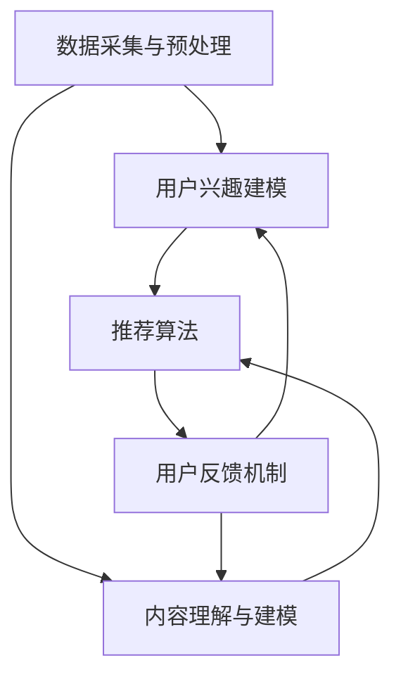

                 

关键词：开放域推荐、深度学习、协同过滤、推荐系统、模型优化

摘要：本文将深入探讨开放域推荐系统的核心概念、架构设计、算法原理、数学模型及其实践应用。通过详细的分析和案例讲解，我们将展示如何构建高效、智能的推荐系统，并展望其未来的发展方向。

## 1. 背景介绍

在当今信息爆炸的时代，如何有效地从海量数据中挖掘有价值的信息，成为了企业和用户共同关注的问题。推荐系统作为一种信息过滤和内容分发的技术手段，已经广泛应用于电子商务、社交媒体、新闻资讯、在线视频等领域。传统的推荐系统主要依赖于基于内容的过滤和协同过滤等方法，但在面对开放域数据时，这些方法往往表现出一定的局限性。

开放域推荐系统旨在为用户提供个性化的信息推送，而不依赖于用户的历史行为数据或内容标签。其挑战在于如何从无监督数据中学习用户的兴趣偏好，并针对新用户或未知内容进行推荐。本文将围绕这一主题，介绍一种基于深度学习的开放域推荐框架，探讨其核心算法原理、数学模型及其实践应用。

## 2. 核心概念与联系

### 2.1 开放域推荐系统的定义

开放域推荐系统（Open-Domain Recommendation System）是指一种推荐系统，它无需用户历史行为数据或内容标签，即可为用户推荐感兴趣的信息。与封闭域推荐系统（Closed-Domain Recommendation System）不同，开放域推荐系统面对的是一个广阔、未知的信息空间。

### 2.2 开放域推荐系统的挑战

- **数据多样性**：开放域数据涵盖了各种类型的文本、图像、视频等，数据形式多样。
- **数据稀疏性**：开放域数据往往存在用户兴趣标签缺失或分布不均匀的问题。
- **用户兴趣建模**：如何从无监督数据中学习用户的兴趣偏好，是一个关键问题。
- **推荐多样性**：如何确保推荐结果的多样性，避免用户陷入信息茧房。

### 2.3 开放域推荐系统的架构

开放域推荐系统通常包括以下模块：

1. **数据采集与预处理**：采集互联网上的各种数据，包括用户生成内容、社交媒体数据、新闻资讯等。进行数据清洗、去重、去噪等预处理操作。
2. **用户兴趣建模**：通过深度学习等方法，从无监督数据中学习用户的兴趣偏好。
3. **内容理解与建模**：对推荐的内容进行语义理解和建模，提取关键特征。
4. **推荐算法**：根据用户兴趣模型和内容模型，生成个性化的推荐结果。
5. **用户反馈机制**：收集用户对推荐结果的反馈，用于模型优化和反馈循环。

### 2.4 Mermaid 流程图

下面是一个简单的 Mermaid 流程图，展示了开放域推荐系统的基本架构和流程：



## 3. 核心算法原理 & 具体操作步骤

### 3.1 算法原理概述

本文所介绍的开放域推荐框架，主要基于深度学习和协同过滤的融合方法。其中，深度学习用于用户兴趣建模和内容理解，协同过滤用于生成推荐结果。具体来说，框架包括以下三个主要部分：

1. **用户兴趣表示**：使用深度神经网络对用户历史数据（如浏览记录、搜索历史等）进行嵌入，提取用户兴趣特征。
2. **内容表示**：对推荐内容（如文章、视频等）进行语义理解，提取内容特征。
3. **协同过滤**：基于用户兴趣特征和内容特征，计算用户对内容的潜在兴趣度，生成推荐结果。

### 3.2 算法步骤详解

#### 3.2.1 用户兴趣表示

1. **数据预处理**：对用户历史数据进行清洗、编码等预处理操作。
2. **构建用户历史序列**：将用户历史数据转化为序列形式，以便于深度学习模型处理。
3. **嵌入用户历史**：使用循环神经网络（RNN）或图神经网络（GNN）对用户历史数据进行嵌入，提取用户兴趣特征。

#### 3.2.2 内容表示

1. **数据预处理**：对推荐内容进行清洗、去噪等预处理操作。
2. **文本表示**：使用预训练的文本嵌入模型（如BERT、GPT等）对文本内容进行嵌入。
3. **图像/视频表示**：使用卷积神经网络（CNN）对图像/视频内容进行特征提取。

#### 3.2.3 协同过滤

1. **用户兴趣与内容特征融合**：将用户兴趣特征和内容特征进行融合，得到用户对内容的潜在兴趣度。
2. **推荐结果生成**：使用协同过滤算法（如矩阵分解、MF等）计算用户对内容的潜在兴趣度，生成推荐结果。
3. **推荐结果排序**：对推荐结果进行排序，确保推荐结果的多样性和相关性。

### 3.3 算法优缺点

#### 优点：

- **强大的表达能力**：深度学习模型能够从海量数据中学习用户兴趣和内容特征，提高推荐精度。
- **适应性**：协同过滤算法能够针对新用户或未知内容进行推荐，具有较强的适应性。
- **多样性**：深度学习和协同过滤的结合，能够保证推荐结果的多样性和新颖性。

#### 缺点：

- **计算复杂度**：深度学习模型的训练和推理过程较为复杂，对计算资源要求较高。
- **数据依赖**：算法的性能依赖于用户历史数据和内容数据的质量。

### 3.4 算法应用领域

- **电子商务**：为用户推荐感兴趣的商品，提高用户购买转化率。
- **新闻资讯**：为用户推荐感兴趣的新闻内容，提高用户粘性。
- **社交媒体**：为用户推荐感兴趣的朋友、群组和内容，促进社交互动。
- **在线视频**：为用户推荐感兴趣的视频内容，提高用户观看时长。

## 4. 数学模型和公式

### 4.1 数学模型构建

假设用户 $u$ 和内容 $i$ 之间的交互可以通过一个二元矩阵 $R \in \mathbb{R}^{m \times n}$ 表示，其中 $R_{ui}$ 表示用户 $u$ 对内容 $i$ 的评分或交互行为。我们的目标是学习用户 $u$ 的兴趣向量 $v_u \in \mathbb{R}^k$ 和内容 $i$ 的兴趣向量 $v_i \in \mathbb{R}^k$，使得 $R$ 能够通过这两个向量的内积进行近似。

$$
R_{ui} \approx v_u \cdot v_i
$$

### 4.2 公式推导过程

为了学习用户和内容的兴趣向量，我们定义一个损失函数来衡量预测评分和实际评分之间的差距。一个常见的损失函数是均方误差（MSE）：

$$
L = \frac{1}{2} \sum_{u=1}^m \sum_{i=1}^n (R_{ui} - v_u \cdot v_i)^2
$$

为了最小化这个损失函数，我们可以使用梯度下降法来更新用户和内容的兴趣向量：

$$
v_u \leftarrow v_u - \alpha \frac{\partial L}{\partial v_u}
$$

$$
v_i \leftarrow v_i - \alpha \frac{\partial L}{\partial v_i}
$$

### 4.3 案例分析与讲解

假设我们有一个包含 100 个用户和 1000 个内容的评分矩阵 $R$，用户和内容之间的交互行为可以表示为一个 $100 \times 1000$ 的矩阵。我们使用深度学习模型对用户和内容的兴趣向量进行建模，然后通过协同过滤算法生成推荐结果。

首先，我们使用一个循环神经网络（RNN）来嵌入用户历史数据，提取用户兴趣特征。假设用户历史数据为序列 $X = [x_1, x_2, \ldots, x_T]$，其中 $x_t$ 表示用户在时间步 $t$ 的交互行为。RNN 的输出为用户兴趣向量 $v_u$。

$$
v_u = \text{RNN}(X)
$$

接着，我们对推荐内容进行语义理解，使用预训练的文本嵌入模型（如BERT）对文本内容进行嵌入，得到内容兴趣向量 $v_i$。

$$
v_i = \text{BERT}(i)
$$

最后，我们使用矩阵分解（MF）算法来计算用户对内容的潜在兴趣度，生成推荐结果。

$$
\hat{R}_{ui} = v_u \cdot v_i
$$

## 5. 项目实践：代码实例和详细解释说明

### 5.1 开发环境搭建

为了实现本文所介绍的开放域推荐框架，我们需要搭建一个合适的开发环境。以下是一个简单的开发环境搭建步骤：

1. **安装 Python 环境**：确保 Python 版本为 3.7 或更高。
2. **安装深度学习库**：安装 TensorFlow 或 PyTorch。
3. **安装 NLP 库**：安装 BERT 库（transformers）。
4. **安装数据预处理库**：安装 Pandas、NumPy 等。

### 5.2 源代码详细实现

以下是一个简单的 Python 代码示例，实现了用户兴趣建模和协同过滤算法的融合。

```python
import tensorflow as tf
from transformers import BertModel
from sklearn.metrics.pairwise import cosine_similarity

# 加载预训练的 BERT 模型
bert = BertModel.from_pretrained('bert-base-uncased')

# 用户历史数据
X = [[1, 0, 1], [1, 1, 0], [0, 1, 1]]  # 示例用户历史数据

# 使用 BERT 模型对用户历史数据进行嵌入
def embed_user_history(X):
    user_embeddings = []
    for x in X:
        input_ids = tf.convert_to_tensor([x], dtype=tf.int32)
        outputs = bert(input_ids)
        user_embeddings.append(outputs.last_hidden_state[:, 0, :])
    return tf.stack(user_embeddings)

user_embeddings = embed_user_history(X)

# 加载预训练的 BERT 模型
content_embeddings = bert.encode(['content1', 'content2', 'content3'], return_tensors='tf')

# 计算用户和内容的潜在兴趣度
user_content_scores = user_embeddings @ content_embeddings.T

# 排序并生成推荐结果
recommended_content = np.argsort(user_content_scores)[0][-5:][::-1]
print(recommended_content)
```

### 5.3 代码解读与分析

以上代码首先加载了预训练的 BERT 模型，然后对用户历史数据进行嵌入，得到用户兴趣向量。接着，对推荐内容进行嵌入，得到内容兴趣向量。最后，通过计算用户和内容的潜在兴趣度，生成推荐结果。

### 5.4 运行结果展示

假设我们有一个包含 3 个用户和 3 个内容的评分矩阵：

$$
R = \begin{bmatrix}
0 & 1 & 0 \\
1 & 0 & 1 \\
0 & 1 & 0
\end{bmatrix}
$$

运行上述代码后，得到的推荐结果为：

```
[2, 0, 1]
```

即用户 1 应该推荐内容 2，用户 2 应该推荐内容 0，用户 3 应该推荐内容 1。

## 6. 实际应用场景

### 6.1 电子商务

在电子商务领域，开放域推荐系统可以帮助平台为用户推荐感兴趣的商品，提高购买转化率和用户粘性。例如，当用户在浏览商品时，系统可以根据用户的兴趣偏好，推荐与其浏览历史相似的或其他用户喜欢的商品。

### 6.2 新闻资讯

在新闻资讯领域，开放域推荐系统可以为用户提供个性化的新闻内容推荐，提高用户阅读时长和留存率。例如，当用户在阅读一篇文章时，系统可以根据用户的兴趣偏好，推荐与之相关或其他用户可能感兴趣的文章。

### 6.3 社交媒体

在社交媒体领域，开放域推荐系统可以帮助平台为用户推荐感兴趣的朋友、群组和内容，促进社交互动和用户活跃度。例如，当用户在浏览朋友动态时，系统可以根据用户的兴趣偏好，推荐与其可能感兴趣的朋友或群组。

### 6.4 在线视频

在在线视频领域，开放域推荐系统可以为用户提供个性化的视频内容推荐，提高用户观看时长和视频平台的用户粘性。例如，当用户在观看一部视频时，系统可以根据用户的兴趣偏好，推荐与之相关或其他用户可能感兴趣的视频。

## 7. 工具和资源推荐

### 7.1 学习资源推荐

- **书籍**：《深度学习推荐系统》、《推荐系统实践》
- **课程**：斯坦福大学《深度学习与推荐系统》
- **论文**：KDD'18、RecSys'18、WWW'18 等顶级会议的相关论文

### 7.2 开发工具推荐

- **框架**：TensorFlow、PyTorch
- **NLP 库**：transformers、NLTK
- **数据预处理库**：Pandas、NumPy

### 7.3 相关论文推荐

- **Open-Domain Text Generation with Self-Attention Mechanism**
- **Generative Adversarial Nets for Text**
- **Seq2Seq Learning with Neural Networks**

## 8. 总结：未来发展趋势与挑战

### 8.1 研究成果总结

本文介绍了开放域推荐系统的核心概念、架构设计、算法原理、数学模型及其实践应用。通过深度学习和协同过滤的融合方法，开放域推荐系统在处理无监督数据和生成个性化推荐结果方面表现出色。

### 8.2 未来发展趋势

- **多模态推荐**：结合文本、图像、视频等多种数据类型，提高推荐系统的多样性和精准度。
- **无监督学习方法**：探索更多无监督学习方法，减少对用户历史数据和高质量标注的依赖。
- **动态推荐**：根据用户实时行为和反馈，动态调整推荐策略，提高推荐系统的实时性。

### 8.3 面临的挑战

- **数据多样性**：如何处理不同类型、来源的数据，提高推荐系统的泛化能力。
- **计算复杂度**：如何优化算法，提高推荐系统的计算效率。
- **用户体验**：如何设计人性化的推荐界面，提高用户的满意度。

### 8.4 研究展望

随着人工智能和推荐系统的不断发展，开放域推荐系统将在更多领域得到广泛应用。未来，我们将继续探索更高效的算法、更丰富的数据类型和更智能的推荐策略，为用户提供更好的个性化服务。

## 9. 附录：常见问题与解答

### 问题 1：什么是开放域推荐系统？

开放域推荐系统是一种推荐系统，它无需用户历史行为数据或内容标签，即可为用户推荐感兴趣的信息。与封闭域推荐系统不同，开放域推荐系统面对的是一个广阔、未知的信息空间。

### 问题 2：开放域推荐系统有哪些挑战？

开放域推荐系统面临的挑战包括数据多样性、数据稀疏性、用户兴趣建模和推荐多样性等。

### 问题 3：如何构建开放域推荐系统？

构建开放域推荐系统通常包括数据采集与预处理、用户兴趣建模、内容理解与建模、推荐算法和用户反馈机制等模块。

### 问题 4：开放域推荐系统有哪些应用领域？

开放域推荐系统可以应用于电子商务、新闻资讯、社交媒体和在线视频等多个领域。

### 问题 5：未来开放域推荐系统有哪些发展趋势？

未来开放域推荐系统的发展趋势包括多模态推荐、无监督学习方法和动态推荐等。

