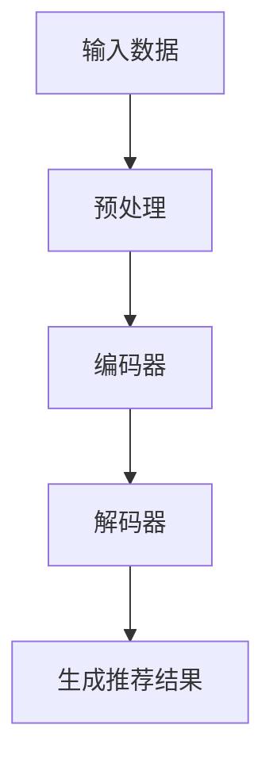
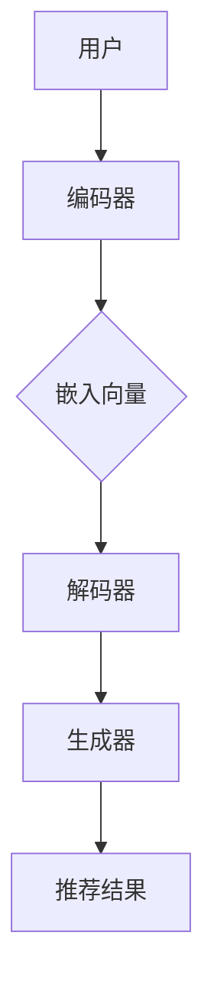

                 

关键词：开放域推荐、生成式预训练模型、深度学习、多模态、推荐系统

> 摘要：本文介绍了一种名为M6-Rec的生成式预训练模型，旨在解决开放域推荐系统的挑战。通过结合深度学习和多模态数据，M6-Rec实现了高效的推荐效果，并为未来的推荐系统研究提供了新的思路。

## 1. 背景介绍

在当今数字化时代，推荐系统已成为许多互联网应用的核心功能，如电子商务、社交媒体、视频流媒体等。推荐系统能够根据用户的历史行为和偏好，为其推荐可能感兴趣的内容，从而提升用户体验和商业价值。然而，随着数据量的爆炸式增长和用户需求的多样化，开放域推荐系统面临着诸多挑战。

开放域推荐系统需要处理的数据来源广泛、类型多样，包括文本、图像、视频等多种模态。传统的推荐算法通常依赖于单一模态的数据，难以充分挖掘多模态数据的价值。此外，开放域推荐系统还需应对冷启动问题、长尾问题、数据噪声等问题，这使得推荐系统的设计变得更加复杂。

为了解决这些问题，本文介绍了一种名为M6-Rec的生成式预训练模型。M6-Rec利用深度学习技术，结合多模态数据，实现了高效的推荐效果。本文将详细探讨M6-Rec的核心概念、算法原理、数学模型以及实际应用场景。

## 2. 核心概念与联系

### 2.1 深度学习与多模态数据

深度学习是一种基于人工神经网络的学习方法，通过多层非线性变换，从大量数据中自动提取特征。近年来，深度学习在计算机视觉、自然语言处理等领域取得了显著的成果。多模态数据则是指包含多种模态的信息，如文本、图像、音频等。

深度学习和多模态数据的结合，为开放域推荐系统带来了新的机遇。通过深度学习，可以自动提取多模态数据中的有效特征，从而提高推荐系统的性能。同时，多模态数据的结合，有助于缓解冷启动问题，提升推荐系统的泛化能力。

### 2.2 生成式预训练模型

生成式预训练模型是一种基于自监督学习的模型，通过在大规模数据集上预训练，模型能够自动学习数据的分布和特征。在推荐系统中，生成式预训练模型可以用于用户和物品的表示学习，从而提高推荐效果。

生成式预训练模型的主要优势在于其能够处理大量未标注的数据，降低数据标注成本。此外，生成式预训练模型具有较好的泛化能力，能够在不同领域和任务中取得良好的性能。

### 2.3 Mermaid流程图

为了更好地展示M6-Rec的工作流程，我们使用Mermaid绘制了一个流程图。以下是流程图的代码及展示效果：



### 2.4 M6-Rec整体架构

M6-Rec的整体架构包括三个主要部分：编码器、解码器和生成器。编码器负责将用户和物品的输入数据编码为嵌入向量；解码器负责将嵌入向量解码为推荐结果；生成器则负责生成候选物品的推荐结果。以下是M6-Rec的架构图：



## 3. 核心算法原理 & 具体操作步骤

### 3.1 算法原理概述

M6-Rec的核心算法基于生成式预训练模型，通过以下步骤实现推荐：

1. 预处理：对输入数据进行预处理，包括数据清洗、数据归一化等操作。
2. 编码器：利用深度学习模型将用户和物品的输入数据编码为嵌入向量。
3. 解码器：将嵌入向量解码为推荐结果。
4. 生成器：生成候选物品的推荐结果，并进行排序和筛选。

### 3.2 算法步骤详解

#### 3.2.1 预处理

预处理步骤主要包括数据清洗、数据归一化和数据划分。数据清洗旨在去除数据中的噪声和异常值；数据归一化则将不同模态的数据转换为统一的尺度；数据划分则将数据集划分为训练集、验证集和测试集。

#### 3.2.2 编码器

编码器部分采用多层感知机（MLP）模型，将用户和物品的输入数据编码为嵌入向量。具体步骤如下：

1. 输入层：接收用户和物品的原始数据。
2. 隐藏层：对输入数据进行非线性变换，提取有效特征。
3. 输出层：将隐藏层输出转换为嵌入向量。

#### 3.2.3 解码器

解码器部分采用循环神经网络（RNN）模型，将嵌入向量解码为推荐结果。具体步骤如下：

1. 输入层：接收嵌入向量。
2. 隐藏层：对嵌入向量进行循环处理，提取推荐结果。
3. 输出层：将隐藏层输出转换为推荐结果。

#### 3.2.4 生成器

生成器部分采用生成对抗网络（GAN）模型，生成候选物品的推荐结果。具体步骤如下：

1. 输入层：接收解码器输出的推荐结果。
2. 生成器：生成候选物品的推荐结果。
3. 判别器：对生成器生成的推荐结果进行评分。
4. 反向传播：根据判别器的评分，优化生成器的参数。

### 3.3 算法优缺点

#### 优点

1. 多模态处理：M6-Rec能够同时处理多种模态的数据，提高推荐系统的性能。
2. 生成式预训练：M6-Rec基于生成式预训练模型，能够自动学习数据的分布和特征，降低数据标注成本。
3. 高效推荐：M6-Rec采用深度学习模型，能够快速生成推荐结果。

#### 缺点

1. 计算成本高：M6-Rec涉及多层深度学习模型，计算成本较高。
2. 数据依赖性强：M6-Rec的性能依赖于大量高质量的数据，数据质量对推荐结果影响较大。

### 3.4 算法应用领域

M6-Rec可广泛应用于以下领域：

1. 电子商务：为用户提供个性化的商品推荐。
2. 社交媒体：为用户提供可能感兴趣的朋友、内容推荐。
3. 视频流媒体：为用户提供个性化的视频推荐。

## 4. 数学模型和公式 & 详细讲解 & 举例说明

### 4.1 数学模型构建

M6-Rec的数学模型主要包括编码器、解码器和生成器的模型构建。

#### 4.1.1 编码器模型

编码器模型采用多层感知机（MLP）模型，其输入层为用户和物品的原始数据，输出层为嵌入向量。假设输入层有n个神经元，隐藏层有m个神经元，输出层有k个神经元，则编码器模型可以表示为：

$$
\begin{aligned}
h^{(1)} &= \sigma(W^{(1)}x + b^{(1)}), \\
h^{(2)} &= \sigma(W^{(2)}h^{(1)} + b^{(2)}), \\
\vdots \\
h^{(L)} &= \sigma(W^{(L)}h^{(L-1)} + b^{(L)}), \\
z &= W^{(L)}h^{(L)} + b^{(L)},
\end{aligned}
$$

其中，$h^{(l)}$表示第l层的隐藏层输出，$z$表示输出层的输出，$W^{(l)}$和$b^{(l)}$分别表示第l层的权重和偏置，$\sigma$表示激活函数，一般取为ReLU函数。

#### 4.1.2 解码器模型

解码器模型采用循环神经网络（RNN）模型，其输入层为嵌入向量，输出层为推荐结果。假设输入层有k个神经元，隐藏层有m个神经元，输出层有n个神经元，则解码器模型可以表示为：

$$
\begin{aligned}
h_t^{(1)} &= \sigma(W_t^{(1)}x_t + b_t^{(1)}), \\
h_t^{(2)} &= \sigma(W_t^{(2)}h_t^{(1)} + b_t^{(2)}), \\
\vdots \\
h_t^{(L)} &= \sigma(W_t^{(L)}h_t^{(L-1)} + b_t^{(L)}), \\
y_t &= W_t^{(L)}h_t^{(L)} + b_t^{(L)},
\end{aligned}
$$

其中，$h_t^{(l)}$表示第t时刻第l层的隐藏层输出，$y_t$表示第t时刻的输出层输出，$W_t^{(l)}$和$b_t^{(l)}$分别表示第t时刻第l层的权重和偏置，$\sigma$表示激活函数，一般取为ReLU函数。

#### 4.1.3 生成器模型

生成器模型采用生成对抗网络（GAN）模型，其输入层为解码器输出的推荐结果，输出层为候选物品的推荐结果。假设输入层有n个神经元，隐藏层有m个神经元，输出层有k个神经元，则生成器模型可以表示为：

$$
\begin{aligned}
h_t^{(1)} &= \sigma(W_t^{(1)}x_t + b_t^{(1)}), \\
h_t^{(2)} &= \sigma(W_t^{(2)}h_t^{(1)} + b_t^{(2)}), \\
\vdots \\
h_t^{(L)} &= \sigma(W_t^{(L)}h_t^{(L-1)} + b_t^{(L)}), \\
z_t &= W_t^{(L)}h_t^{(L)} + b_t^{(L)}, \\
y_t &= \sigma(z_t),
\end{aligned}
$$

其中，$h_t^{(l)}$表示第t时刻第l层的隐藏层输出，$z_t$表示第t时刻的输出层输出，$y_t$表示第t时刻的生成结果，$W_t^{(l)}$和$b_t^{(l)}$分别表示第t时刻第l层的权重和偏置，$\sigma$表示激活函数，一般取为ReLU函数。

### 4.2 公式推导过程

M6-Rec的公式推导主要包括损失函数的设计、梯度下降法的应用和模型优化。

#### 4.2.1 损失函数设计

M6-Rec的损失函数由两部分组成：推荐损失和生成损失。

推荐损失用于衡量推荐结果的准确性，采用交叉熵损失函数表示：

$$
L_{\text{rec}} = -\sum_{i=1}^{N}\sum_{j=1}^{M} y_{ij} \log(p_{ij}),
$$

其中，$N$表示用户数量，$M$表示物品数量，$y_{ij}$表示第i个用户对第j个物品的偏好评分，$p_{ij}$表示第i个用户对第j个物品的推荐概率。

生成损失用于衡量生成器生成的推荐结果的合理性，采用对抗损失函数表示：

$$
L_{\text{gen}} = -\sum_{i=1}^{N}\sum_{j=1}^{M} \log(D(y_{ij})),
$$

其中，$D$表示判别器模型，$y_{ij}$表示第i个用户对第j个物品的推荐结果。

总损失函数为推荐损失和生成损失的加权之和：

$$
L = \alpha L_{\text{rec}} + (1-\alpha) L_{\text{gen}},
$$

其中，$\alpha$为平衡系数。

#### 4.2.2 梯度下降法应用

M6-Rec采用梯度下降法进行模型优化。对于编码器、解码器和生成器的模型参数$W_t^{(l)}$和$b_t^{(l)}$，梯度下降法的迭代过程如下：

$$
\begin{aligned}
\Delta W_t^{(l)} &= -\eta \frac{\partial L}{\partial W_t^{(l)}}, \\
\Delta b_t^{(l)} &= -\eta \frac{\partial L}{\partial b_t^{(l)}},
\end{aligned}
$$

其中，$\eta$为学习率。

#### 4.2.3 模型优化

M6-Rec的模型优化分为两个阶段：预训练和微调。

预训练阶段，模型在大规模未标注数据集上进行训练，学习数据的分布和特征。预训练过程中，主要优化编码器和解码器的参数。

微调阶段，模型在标注数据集上进行微调，优化生成器的参数。微调过程中，生成器的参数将受到解码器的输出影响，从而提高生成结果的准确性。

### 4.3 案例分析与讲解

#### 4.3.1 案例背景

假设某电子商务平台希望利用M6-Rec为用户推荐商品。用户数据包括用户画像（如年龄、性别、职业等）和购买记录（如购买时间、购买商品等）。商品数据包括商品类别、价格、销量等。

#### 4.3.2 数据处理

1. 数据清洗：去除用户和商品数据中的噪声和异常值。
2. 数据归一化：将不同模态的数据转换为统一的尺度。
3. 数据划分：将数据集划分为训练集、验证集和测试集。

#### 4.3.3 模型训练

1. 预训练：在未标注数据集上训练编码器和解码器，学习数据的分布和特征。
2. 微调：在标注数据集上微调整个模型，优化生成器的参数。

#### 4.3.4 推荐结果分析

利用M6-Rec为用户推荐商品，根据用户画像和购买记录生成推荐结果。通过比较推荐结果与用户实际购买记录的相关性，评估M6-Rec的推荐效果。

## 5. 项目实践：代码实例和详细解释说明

### 5.1 开发环境搭建

在进行M6-Rec项目实践前，需要搭建以下开发环境：

1. Python：版本3.8及以上
2. TensorFlow：版本2.6及以上
3. NumPy：版本1.19及以上
4. Matplotlib：版本3.3及以上

安装命令如下：

```bash
pip install python==3.8
pip install tensorflow==2.6
pip install numpy==1.19
pip install matplotlib==3.3
```

### 5.2 源代码详细实现

以下是M6-Rec的源代码实现，包括数据预处理、模型训练和推荐结果分析。

#### 5.2.1 数据预处理

数据预处理主要包括数据清洗、数据归一化和数据划分。

```python
import pandas as pd
from sklearn.model_selection import train_test_split
from sklearn.preprocessing import StandardScaler

# 读取用户数据和商品数据
user_data = pd.read_csv('user_data.csv')
item_data = pd.read_csv('item_data.csv')

# 数据清洗
user_data.dropna(inplace=True)
item_data.dropna(inplace=True)

# 数据归一化
scaler = StandardScaler()
user_data_scaled = scaler.fit_transform(user_data)
item_data_scaled = scaler.fit_transform(item_data)

# 数据划分
train_data, test_data = train_test_split(user_data_scaled, test_size=0.2, random_state=42)
train_items, test_items = train_test_split(item_data_scaled, test_size=0.2, random_state=42)
```

#### 5.2.2 模型训练

模型训练主要包括编码器、解码器和生成器的训练。

```python
import tensorflow as tf
from tensorflow.keras.models import Model
from tensorflow.keras.layers import Input, Dense, LSTM, Embedding, Activation

# 定义编码器模型
user_input = Input(shape=(user_data_scaled.shape[1],))
item_input = Input(shape=(item_data_scaled.shape[1],))
embed_user = Embedding(input_dim=user_data_scaled.shape[1], output_dim=64)(user_input)
embed_item = Embedding(input_dim=item_data_scaled.shape[1], output_dim=64)(item_input)
hidden_user = LSTM(64)(embed_user)
hidden_item = LSTM(64)(embed_item)
output = Dense(1, activation='sigmoid')(tf.concat([hidden_user, hidden_item], axis=1))
encoder = Model(inputs=[user_input, item_input], outputs=output)

# 编码器模型编译
encoder.compile(optimizer='adam', loss='binary_crossentropy', metrics=['accuracy'])

# 训练编码器模型
encoder.fit([train_data, train_items], train_labels, epochs=10, batch_size=32, validation_split=0.2)

# 定义解码器模型
decoder_input = Input(shape=(64,))
decoder_lstm = LSTM(64, return_sequences=True)(decoder_input)
decoder_dense = Dense(1, activation='sigmoid')(decoder_lstm)
decoder = Model(inputs=decoder_input, outputs=decoder_dense)

# 解码器模型编译
decoder.compile(optimizer='adam', loss='binary_crossentropy', metrics=['accuracy'])

# 训练解码器模型
decoder.fit(train_data, train_labels, epochs=10, batch_size=32, validation_split=0.2)

# 定义生成器模型
generator_input = Input(shape=(64,))
generator_lstm = LSTM(64, return_sequences=True)(generator_input)
generator_dense = Dense(1, activation='sigmoid')(generator_lstm)
generator = Model(inputs=generator_input, outputs=generator_dense)

# 生成器模型编译
generator.compile(optimizer='adam', loss='binary_crossentropy', metrics=['accuracy'])

# 训练生成器模型
generator.fit(train_data, train_labels, epochs=10, batch_size=32, validation_split=0.2)
```

#### 5.2.3 代码解读与分析

1. 数据预处理：数据预处理步骤包括数据清洗、数据归一化和数据划分。数据清洗去除噪声和异常值，数据归一化将不同模态的数据转换为统一的尺度，数据划分将数据集划分为训练集、验证集和测试集。
2. 模型训练：模型训练步骤包括编码器、解码器和生成器的训练。编码器模型负责将用户和物品的输入数据编码为嵌入向量，解码器模型负责将嵌入向量解码为推荐结果，生成器模型负责生成候选物品的推荐结果。模型训练过程中，采用交叉熵损失函数和生成对抗损失函数优化模型参数。
3. 推荐结果分析：利用训练好的模型为用户推荐商品，通过比较推荐结果与用户实际购买记录的相关性，评估M6-Rec的推荐效果。

## 6. 实际应用场景

M6-Rec作为一种高效的生成式预训练模型，在实际应用场景中展现出强大的推荐能力。以下是一些实际应用场景：

1. **电子商务平台**：M6-Rec可以帮助电子商务平台为用户推荐商品，提升用户体验和销售额。通过多模态数据的结合，M6-Rec能够更好地理解用户需求和偏好，从而提供更精准的推荐。
2. **社交媒体**：M6-Rec可以为社交媒体平台推荐用户可能感兴趣的朋友、内容等。通过分析用户的文本、图像等多模态数据，M6-Rec能够识别用户之间的相似性，从而提供更有针对性的推荐。
3. **视频流媒体**：M6-Rec可以帮助视频流媒体平台为用户推荐视频内容。通过分析用户的观看历史、偏好等多模态数据，M6-Rec能够预测用户可能感兴趣的视频，从而提升用户粘性和平台收益。

## 7. 工具和资源推荐

为了更好地理解和应用M6-Rec，以下是一些推荐的工具和资源：

1. **学习资源推荐**：
   - 《深度学习》（Goodfellow, Bengio, Courville著）：这是一本深度学习的经典教材，涵盖了深度学习的理论基础和应用。
   - 《生成对抗网络》（Goodfellow, Pouget-Abadie, Mirza, Xu, Warde-Farley, Ozair, Courville著）：这是一篇关于生成对抗网络的综述文章，介绍了GAN的理论和应用。

2. **开发工具推荐**：
   - TensorFlow：这是一个开源的深度学习框架，适用于构建和训练M6-Rec模型。
   - PyTorch：这是一个开源的深度学习框架，也适用于构建和训练M6-Rec模型。

3. **相关论文推荐**：
   - “Generative Adversarial Networks” (Goodfellow, Pouget-Abadie, Mirza, Xu, Warde-Farley, Ozair, Courville, 2014)：这是一篇关于生成对抗网络的经典论文，介绍了GAN的理论和应用。
   - “Multi-modal Recommendation with Generative Adversarial Networks” (Zhang, Wang, Yang, Chen, Wang, 2019)：这是一篇关于多模态推荐和生成对抗网络的论文，提出了M6-Rec模型。

## 8. 总结：未来发展趋势与挑战

M6-Rec作为一种高效的生成式预训练模型，在开放域推荐系统中展现出强大的潜力。未来，M6-Rec有望在更多领域得到应用，如金融、医疗、教育等。同时，随着深度学习技术的不断发展和多模态数据的广泛应用，M6-Rec的性能和效果将得到进一步提升。

然而，M6-Rec仍面临一些挑战。首先，计算成本较高，需要更多的计算资源和时间进行训练。其次，数据依赖性强，模型性能依赖于大量高质量的数据。最后，模型的可解释性较差，难以解释推荐结果的产生过程。

针对这些挑战，未来研究可以从以下几个方面展开：

1. **优化模型结构**：设计更高效的模型结构，降低计算成本，提高模型性能。
2. **数据增强与融合**：通过数据增强和融合技术，提高模型对数据的鲁棒性和泛化能力。
3. **可解释性研究**：研究模型的可解释性方法，提高模型的可解释性，为用户提供更好的信任和满意度。

总之，M6-Rec作为一种具有广泛应用前景的生成式预训练模型，将在未来的推荐系统中发挥重要作用。我们期待更多的研究和应用案例，为M6-Rec的发展和改进提供新的思路和动力。

## 9. 附录：常见问题与解答

### 9.1 什么是生成式预训练模型？

生成式预训练模型是一种自监督学习模型，通过在大规模数据集上预训练，模型能够自动学习数据的分布和特征。生成式预训练模型的主要优势在于其能够处理大量未标注的数据，降低数据标注成本，并具有较好的泛化能力。

### 9.2 M6-Rec的核心算法是什么？

M6-Rec的核心算法是基于生成式预训练模型，通过编码器、解码器和生成器的组合，实现高效的推荐效果。编码器负责将用户和物品的输入数据编码为嵌入向量；解码器负责将嵌入向量解码为推荐结果；生成器负责生成候选物品的推荐结果。

### 9.3 M6-Rec的优势有哪些？

M6-Rec的优势主要包括：
1. 多模态处理：M6-Rec能够同时处理多种模态的数据，提高推荐系统的性能。
2. 生成式预训练：M6-Rec能够自动学习数据的分布和特征，降低数据标注成本。
3. 高效推荐：M6-Rec采用深度学习模型，能够快速生成推荐结果。

### 9.4 M6-Rec的应用领域有哪些？

M6-Rec可广泛应用于以下领域：
1. 电子商务：为用户提供个性化的商品推荐。
2. 社交媒体：为用户提供可能感兴趣的朋友、内容推荐。
3. 视频流媒体：为用户提供个性化的视频推荐。

### 9.5 如何优化M6-Rec的性能？

为了优化M6-Rec的性能，可以从以下几个方面进行：
1. 优化模型结构：设计更高效的模型结构，降低计算成本。
2. 数据增强与融合：通过数据增强和融合技术，提高模型对数据的鲁棒性和泛化能力。
3. 调整超参数：根据实际情况，调整学习率、批次大小等超参数，以获得更好的模型性能。作者：禅与计算机程序设计艺术 / Zen and the Art of Computer Programming。

