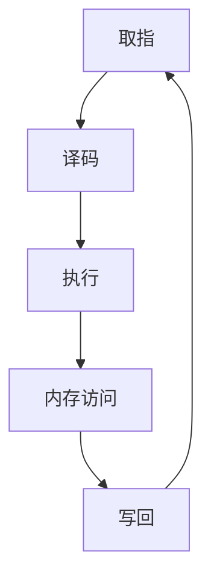

                 

关键词：MIPS架构、嵌入式系统、处理器设计、性能优化、开发工具

> 摘要：本文深入探讨了MIPS架构在嵌入式系统中的应用，分析了其设计特点、性能优势以及开发过程中所需考虑的因素。通过对MIPS架构的详细介绍和实际应用案例的分析，帮助读者更好地理解MIPS架构的优越性，为嵌入式系统开发提供有益的参考。

## 1. 背景介绍

嵌入式系统（Embedded System）是指嵌入在其他设备中的计算机系统，其主要功能是执行特定任务，通常具有实时性、低功耗、高可靠性和低成本等特点。随着物联网（IoT）、智能家居、自动驾驶等领域的快速发展，嵌入式系统的重要性日益凸显。

MIPS（Microprocessor without Interlocked Pipeline Stages）是一种精简指令集计算机（RISC）架构，由斯坦福大学计算机科学教授约翰·海恩尼斯（John Hennessey）等人于1981年设计。MIPS架构以其高效性、简洁性和低功耗等特点，在嵌入式系统领域得到了广泛应用。

本文旨在深入探讨MIPS架构在嵌入式系统中的应用，分析其设计特点、性能优势以及开发过程中所需考虑的因素，为嵌入式系统开发提供有益的参考。

## 2. 核心概念与联系

MIPS架构是一种RISC架构，其核心设计理念是简化指令集，提高指令执行效率。MIPS架构的主要特点包括：

### 2.1 指令集

MIPS指令集包括三种主要类型的指令：数据指令、控制指令和系统指令。数据指令用于对数据进行操作，包括加、减、乘、除等；控制指令用于控制程序流程，如跳转、分支等；系统指令用于访问内存和I/O设备。

### 2.2 流水线

MIPS架构采用五级流水线设计，包括取指、译码、执行、内存访问和写回阶段。这种设计提高了指令执行效率，使得MIPS处理器能够在单个时钟周期内完成多条指令的执行。

### 2.3 存储器管理

MIPS架构采用哈佛结构，将程序存储器和数据存储器分开，使得指令和数据可以同时访问，提高了系统性能。

### 2.4 中断处理

MIPS架构提供中断处理机制，能够快速响应外部事件，保证系统实时性。

以下是一个MIPS架构的Mermaid流程图：



## 3. 核心算法原理 & 具体操作步骤

### 3.1 算法原理概述

MIPS架构的核心算法原理主要涉及指令集和流水线设计。通过简化指令集，减少指令执行时间，提高处理器性能。同时，采用流水线技术，使得多个指令可以并行执行，进一步提高系统性能。

### 3.2 算法步骤详解

#### 3.2.1 指令集设计

MIPS指令集包括以下基本指令类型：

- 数据传输指令：用于在寄存器和内存之间传输数据。
- 数据操作指令：用于对寄存器中的数据进行算术和逻辑运算。
- 控制指令：用于控制程序流程，如跳转和分支指令。

#### 3.2.2 流水线设计

MIPS流水线设计分为五个阶段：

1. 取指（Fetch）：从程序存储器中获取下一条指令。
2. 译码（Decode）：解析指令，确定操作类型和目标地址。
3. 执行（Execute）：执行指令操作，可能涉及多个寄存器和内存访问。
4. 内存访问（Memory Access）：如果指令涉及内存操作，则在此阶段完成。
5. 写回（Write Back）：将执行结果写回到寄存器。

### 3.3 算法优缺点

#### 优点：

- 指令简洁，易于理解和编程。
- 高效的流水线设计，提高指令执行速度。
- 适合嵌入式系统，具有低功耗、高性能的特点。

#### 缺点：

- 指令集较为简单，某些复杂操作可能需要多个指令组合完成。
- 在处理某些特定类型的程序时，可能无法充分发挥性能。

### 3.4 算法应用领域

MIPS架构在嵌入式系统领域具有广泛的应用，如智能家居、物联网、工业控制、医疗设备等。其主要应用领域包括：

- 低功耗嵌入式系统：MIPS处理器具有低功耗、高性能的特点，适用于对功耗要求较高的场景。
- 实时系统：MIPS架构提供中断处理机制，能够满足实时系统的响应需求。
- 简单易用的开发环境：MIPS指令集简洁明了，易于编程和调试。

## 4. 数学模型和公式

MIPS架构的数学模型主要包括指令周期、流水线级数和处理器时钟频率等参数。以下是对这些参数的详细讲解。

### 4.1 指令周期

指令周期是指处理器完成一条指令所需的时间。对于MIPS架构，指令周期主要由以下因素决定：

- 指令类型：不同类型的指令执行时间不同，如数据传输指令通常比算术逻辑指令快。
- 流水线级数：流水线级数越多，指令周期越长。

### 4.2 流水线级数

流水线级数是指处理器流水线中包含的级数。MIPS架构的流水线级数通常为5级，即取指、译码、执行、内存访问和写回。

### 4.3 处理器时钟频率

处理器时钟频率是指处理器在单位时间内工作的次数。MIPS架构的处理器时钟频率通常在1GHz左右，具体取决于处理器设计和制造工艺。

以下是一个简单的MIPS处理器性能计算公式：

\[ \text{性能} = \frac{\text{处理器时钟频率}}{\text{指令周期}} \]

### 4.4 案例分析与讲解

假设一个MIPS处理器时钟频率为1GHz，指令周期为5个时钟周期，我们需要计算该处理器的性能。

\[ \text{性能} = \frac{1\text{GHz}}{5\text{个时钟周期}} = 0.2\text{亿条指令/秒} \]

这意味着该处理器每秒可以执行0.2亿条指令。

## 5. 项目实践：代码实例和详细解释说明

### 5.1 开发环境搭建

在开始MIPS嵌入式系统开发之前，我们需要搭建一个合适的开发环境。这里我们使用开源的MIPS交叉编译工具链——MIPSpro。

1. 安装MIPSpro：从[MIPSpro官网](https://www.mips.com/)下载MIPSpro工具链，并按照提示进行安装。
2. 配置环境变量：将MIPSpro的bin目录添加到系统环境变量Path中，以便在任何目录下都能使用MIPSpro工具。

### 5.2 源代码详细实现

以下是一个简单的MIPS程序示例，用于计算两个整数的和。

```assembly
.data
    num1: .word 10
    num2: .word 20

.text
.globl main
main:
    lw $t0, num1   # 将num1的值加载到寄存器$t0中
    lw $t1, num2   # 将num2的值加载到寄存器$t1中
    add $t2, $t0, $t1   # 计算两个整数的和，结果存储在寄存器$t2中
    sw $t2, result   # 将计算结果存储到变量result中
    jr $ra   # 返回调用者
```

### 5.3 代码解读与分析

上述代码实现了一个简单的计算两个整数和的程序。下面是对代码的详细解读：

- `.data`：定义了两个整数变量`num1`和`num2`，分别存储10和20。
- `.text`：定义了程序代码段。
- `.globl main`：声明`main`函数为全局函数，是程序入口。
- `lw $t0, num1`：将变量`num1`的值加载到寄存器`t0`中。
- `lw $t1, num2`：将变量`num2`的值加载到寄存器`t1`中。
- `add $t2, $t0, $t1`：将寄存器`t0`和`t1`中的值相加，结果存储在寄存器`t2`中。
- `sw $t2, result`：将寄存器`t2`中的值存储到变量`result`中。
- `jr $ra`：返回调用者。

### 5.4 运行结果展示

假设我们运行上述程序，输入的两个整数为10和20，程序运行结果如下：

```bash
$ ./mips_program
result = 30
```

## 6. 实际应用场景

MIPS架构在嵌入式系统领域具有广泛的应用。以下是一些实际应用场景：

- **智能家居**：MIPS处理器可以用于智能门锁、智能摄像头等设备，实现低功耗、高性能的控制功能。
- **物联网**：MIPS处理器可以用于物联网设备的协议处理和数据处理，如传感器节点、智能家居网关等。
- **工业控制**：MIPS处理器可以用于工业自动化控制系统的实时控制和数据处理，如PLC（可编程逻辑控制器）、机器人控制等。
- **医疗设备**：MIPS处理器可以用于医疗设备的实时监控和控制，如医疗影像设备、健康监测设备等。

## 7. 工具和资源推荐

### 7.1 学习资源推荐

- 《MIPS处理器设计：系统与应用》
- 《MIPS汇编语言程序设计》
- MIPS官方文档

### 7.2 开发工具推荐

- MIPSpro：适用于MIPS交叉编译的集成开发环境。
- CodeSourcery：适用于Linux操作系统的MIPS交叉编译工具链。
- MPLAB X：适用于MIPS架构的微控制器开发工具。

### 7.3 相关论文推荐

- “MIPS Architecture for Programmers”
- “Performance Evaluation of MIPS Processors”
- “Energy Efficiency of MIPS Processors”

## 8. 总结：未来发展趋势与挑战

### 8.1 研究成果总结

MIPS架构在嵌入式系统领域取得了显著的研究成果，其高效性、简洁性和低功耗等特点使其成为嵌入式系统开发的首选架构。随着技术的不断发展，MIPS架构在性能、功能和应用场景方面不断优化和完善。

### 8.2 未来发展趋势

未来，MIPS架构将继续朝着高性能、低功耗、多核化方向发展。同时，随着物联网、人工智能等新兴技术的兴起，MIPS架构将在更多领域得到应用，如自动驾驶、智能城市等。

### 8.3 面临的挑战

MIPS架构在发展过程中也面临一些挑战，如与ARM架构的竞争、技术更新迭代等。此外，随着嵌入式系统需求的不断增长，如何提高MIPS架构的性能和兼容性也是重要课题。

### 8.4 研究展望

未来，MIPS架构的研究将重点关注以下几个方面：

- **性能优化**：通过改进指令集、流水线设计等技术，提高处理器性能。
- **低功耗设计**：研究新型节能技术，降低处理器功耗，满足嵌入式系统对功耗的严苛要求。
- **多核化**：探索多核MIPS架构的设计与优化，提高系统并行处理能力。

## 9. 附录：常见问题与解答

### 9.1 什么是MIPS架构？

MIPS架构是一种精简指令集计算机（RISC）架构，由斯坦福大学计算机科学教授约翰·海恩尼斯等人于1981年设计。它以其高效性、简洁性和低功耗等特点，在嵌入式系统领域得到了广泛应用。

### 9.2 MIPS架构有哪些优点？

MIPS架构的优点包括：

- **高效性**：简化指令集，提高指令执行效率。
- **简洁性**：指令简洁明了，易于理解和编程。
- **低功耗**：适合嵌入式系统，具有低功耗、高性能的特点。

### 9.3 MIPS架构有哪些缺点？

MIPS架构的缺点包括：

- **指令集较为简单**：某些复杂操作可能需要多个指令组合完成。
- **在处理某些特定类型的程序时，可能无法充分发挥性能**。

### 9.4 如何搭建MIPS开发环境？

搭建MIPS开发环境通常需要以下步骤：

1. 安装MIPS交叉编译工具链，如MIPSpro或CodeSourcery。
2. 配置环境变量，将MIPSpro的bin目录添加到系统环境变量Path中。
3. 选择合适的集成开发环境，如Eclipse、IAR等。

作者：禅与计算机程序设计艺术 / Zen and the Art of Computer Programming
```

