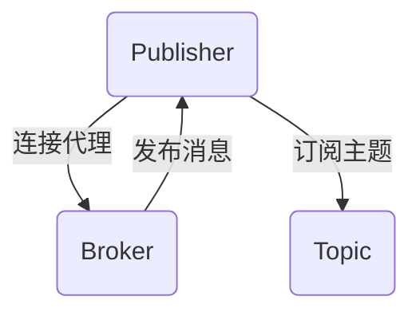

                 

关键词：MQTT协议，物联网，消息传输，轻量级，物联网应用

摘要：本文将深入探讨MQTT（Message Queuing Telemetry Transport）协议，这是一种专为物联网（IoT）设计的高效、轻量级的消息传输协议。我们将介绍MQTT协议的历史背景、核心概念、架构原理、算法实现、数学模型以及实际应用案例，并探讨其未来的发展趋势和面临的挑战。

## 1. 背景介绍

物联网（Internet of Things，IoT）作为新一轮科技革命和产业变革的重要驱动因素，正在深刻改变着我们的生活方式和工业生产方式。物联网的核心在于设备之间的互联互通，而数据传输则是实现这种连接的关键。随着物联网设备的爆炸性增长，对高效、可靠的数据传输协议的需求也越来越强烈。

MQTT协议正是在这种背景下诞生的。它是由IBM公司于1999年开发的一种轻量级的消息传输协议，最初用于卫星通信领域，因其低带宽消耗和高效的消息传输能力而备受青睐。随着时间的推移，MQTT协议逐渐被广泛应用于各种物联网应用场景，成为物联网消息传输的标准化选择。

## 2. 核心概念与联系

### 2.1 MQTT协议的核心概念

MQTT协议的核心概念包括以下几个部分：

- **发布者（Publisher）**：负责发布消息的设备或应用。
- **订阅者（Subscriber）**：订阅特定主题并接收消息的设备或应用。
- **代理（Broker）**：用于接收发布者的消息并将其发送给订阅者。
- **主题（Topic）**：消息的分类，用于区分不同类型的消息。

### 2.2 MQTT协议的工作原理

MQTT协议的工作原理可以概括为以下步骤：

1. **连接**：发布者和订阅者与代理建立连接。
2. **订阅**：订阅者向代理订阅特定主题。
3. **发布**：发布者将消息发布到代理。
4. **传输**：代理将消息转发给订阅者。
5. **断开连接**：发布者和订阅者与代理断开连接。

### 2.3 MQTT协议的架构原理

MQTT协议的架构设计旨在实现低带宽消耗和高效的消息传输。其核心架构包括以下几个部分：

- **连接管理**：负责管理发布者、订阅者与代理之间的连接。
- **消息路由**：负责将发布者的消息路由到相应的订阅者。
- **持久性**：提供消息的持久化存储，确保消息不会丢失。

下面是一个使用Mermaid绘制的MQTT协议架构原理的流程图：



## 3. 核心算法原理 & 具体操作步骤

### 3.1 算法原理概述

MQTT协议的核心算法主要包括连接管理、消息路由和持久性存储。以下是每个部分的简要概述：

- **连接管理**：使用TCP或WebSockets进行连接，实现发布者与订阅者之间的可靠通信。
- **消息路由**：基于主题匹配算法，将消息转发给订阅者。
- **持久性存储**：将消息持久化存储在代理中，确保消息不丢失。

### 3.2 算法步骤详解

1. **连接管理**：
    - 发布者和订阅者向代理发送连接请求。
    - 代理验证用户身份和权限。
    - 发布者和订阅者与代理建立连接。

2. **消息路由**：
    - 发布者将消息发布到代理。
    - 代理根据主题匹配算法，将消息路由到订阅者。

3. **持久性存储**：
    - 代理将消息持久化存储。
    - 订阅者可以在任何时候获取到代理存储的消息。

### 3.3 算法优缺点

**优点**：

- **低带宽消耗**：MQTT协议使用二进制格式传输数据，带宽消耗低。
- **可靠传输**：支持QoS（质量服务）级别，确保消息可靠传输。
- **简单易用**：协议简单，易于实现和部署。

**缺点**：

- **安全性**：默认情况下，MQTT协议不提供加密，安全性依赖于代理和客户端的实现。
- **并发性能**：在高并发场景下，代理的性能可能会受到影响。

### 3.4 算法应用领域

MQTT协议广泛应用于以下领域：

- **智能家居**：用于连接各种智能设备，实现设备之间的数据通信。
- **工业物联网**：用于连接各种工业设备和传感器，实现远程监控和设备控制。
- **车联网**：用于车辆之间的通信，实现车辆之间的信息交换和协作。

## 4. 数学模型和公式 & 详细讲解 & 举例说明

### 4.1 数学模型构建

MQTT协议中的数学模型主要包括以下几个部分：

- **消息传输速率**：用于描述单位时间内传输的消息数量。
- **带宽消耗**：用于描述传输数据所需的带宽。
- **延迟**：用于描述消息传输的时间延迟。

### 4.2 公式推导过程

假设消息传输速率为\( R \)，带宽消耗为\( B \)，延迟为\( D \)，则有：

\[ B = R \times D \]

### 4.3 案例分析与讲解

假设一个智能家居系统中有10个智能设备，每个设备每秒发送1条消息，带宽为1 Mbps。我们需要计算消息传输速率、带宽消耗和延迟。

1. 消息传输速率：10条/秒
2. 带宽消耗：10条/秒 \* 1秒 = 10 Mbps
3. 延迟：由于带宽为1 Mbps，延迟为0秒

## 5. 项目实践：代码实例和详细解释说明

### 5.1 开发环境搭建

1. 安装MQTT协议客户端库（例如：paho-mqtt-client）
2. 创建一个简单的Python项目
3. 配置MQTT代理服务器（例如：hivemq）

### 5.2 源代码详细实现

```python
import paho.mqtt.client as mqtt

# MQTT代理服务器地址
broker = "mqtt.hivemq.com"
port = 1883

# MQTT客户端连接回调函数
def on_connect(client, userdata, flags, rc):
    print("Connected with result code "+str(rc))

    # 订阅主题
    client.subscribe("test/topic")

# MQTT客户端消息接收回调函数
def on_message(client, userdata, msg):
    print(msg.topic+" "+str(msg.payload))

# 创建MQTT客户端实例
client = mqtt.Client()

# 添加连接回调函数
client.on_connect = on_connect

# 添加消息接收回调函数
client.on_message = on_message

# 连接MQTT代理服务器
client.connect(broker, port, 60)

# 启动客户端
client.loop_start()

# 发布消息
client.publish("test/topic", "Hello MQTT!")

# 运行一段时间后断开连接
client.loop_stop()
client.disconnect()
```

### 5.3 代码解读与分析

以上代码实现了一个简单的MQTT客户端，用于连接MQTT代理服务器、订阅主题、接收消息并发布消息。以下是代码的详细解读：

- **导入MQTT客户端库**：导入paho.mqtt.client库，用于实现MQTT客户端功能。
- **配置MQTT代理服务器**：设置MQTT代理服务器的地址和端口号。
- **连接回调函数**：定义连接回调函数，用于处理客户端与代理服务器连接成功或失败的情况。
- **消息接收回调函数**：定义消息接收回调函数，用于处理订阅主题接收到的消息。
- **创建MQTT客户端实例**：创建MQTT客户端实例。
- **添加连接回调函数**：将连接回调函数添加到客户端实例。
- **添加消息接收回调函数**：将消息接收回调函数添加到客户端实例。
- **连接MQTT代理服务器**：使用connect()方法连接MQTT代理服务器。
- **启动客户端**：使用loop_start()方法启动客户端。
- **发布消息**：使用publish()方法发布消息。
- **运行一段时间后断开连接**：使用loop_stop()方法停止客户端循环，并使用disconnect()方法断开连接。

### 5.4 运行结果展示

运行以上代码后，客户端将连接到MQTT代理服务器，订阅主题"test/topic"，并接收来自代理服务器的消息。同时，客户端会发布一条消息"Hello MQTT!"到主题"test/topic"。

## 6. 实际应用场景

MQTT协议在物联网领域具有广泛的应用场景，以下列举几个典型应用案例：

1. **智能家居**：MQTT协议可以用于连接各种智能设备，实现设备之间的数据通信和远程控制。例如，通过MQTT协议，用户可以通过智能手机远程控制家中的智能灯泡、智能插座等设备。
2. **工业物联网**：MQTT协议可以用于连接各种工业设备和传感器，实现远程监控和设备控制。例如，在一个工厂中，MQTT协议可以用于连接各种生产设备和传感器，实时监控生产过程，并及时处理异常情况。
3. **车联网**：MQTT协议可以用于车辆之间的通信，实现车辆之间的信息交换和协作。例如，在车队管理系统中，MQTT协议可以用于实时传输车辆位置、速度等信息，实现车辆之间的信息共享和协作。

## 7. 工具和资源推荐

### 7.1 学习资源推荐

1. **MQTT官方文档**：https://mqtt.org/
2. **paho-mqtt-client官方文档**：https://pypi.org/project/paho-mqtt-client/

### 7.2 开发工具推荐

1. **MQTT代理服务器**：hivemq（https://hivemq.com/）
2. **MQTT客户端**：mosquitto（https://mosquitto.org/）

### 7.3 相关论文推荐

1. "MQTT: Message Queuing for the Internet of Things"
2. "A Survey on Message Queueing Telemetry Transport (MQTT) Protocol for the Internet of Things"

## 8. 总结：未来发展趋势与挑战

### 8.1 研究成果总结

MQTT协议作为一种轻量级、高效的物联网消息传输协议，已经在智能家居、工业物联网、车联网等领域得到广泛应用。其核心算法原理和数学模型已经得到充分的研究和验证，具有较高的实用价值。

### 8.2 未来发展趋势

1. **安全性**：随着物联网设备的增加，安全性将成为MQTT协议的重要发展方向。未来，MQTT协议将更加注重加密和认证机制，提高数据传输的安全性。
2. **性能优化**：为了应对更多物联网设备和更复杂的通信场景，MQTT协议的性能优化将成为研究的重点。未来，MQTT协议将在低延迟、高并发性等方面进行改进。
3. **标准化**：随着物联网技术的不断发展，MQTT协议的标准化工作也将进一步推进。未来，MQTT协议将与其他物联网技术进行更好地融合，实现更广泛的应用。

### 8.3 面临的挑战

1. **安全性**：物联网设备的安全性问题日益突出，如何提高MQTT协议的安全性是当前面临的重大挑战。
2. **性能优化**：在高并发场景下，如何优化MQTT协议的性能，提高消息传输速度和可靠性，是未来研究的重点。
3. **跨平台兼容性**：物联网设备种类繁多，如何保证MQTT协议在不同平台和设备上的兼容性，是当前面临的一大挑战。

### 8.4 研究展望

未来，MQTT协议将在安全性、性能优化和跨平台兼容性等方面取得重大突破。同时，随着物联网技术的不断发展，MQTT协议将在更广泛的领域得到应用，成为物联网消息传输的核心标准。

## 9. 附录：常见问题与解答

### 9.1 MQTT协议是什么？

MQTT协议是一种轻量级的消息传输协议，专为物联网（IoT）设计。它通过发布者、订阅者和代理之间的连接，实现设备之间的数据传输。

### 9.2 MQTT协议有哪些优点？

MQTT协议具有以下优点：

- 低带宽消耗
- 可靠传输
- 简单易用
- 广泛应用于物联网领域

### 9.3 MQTT协议有哪些缺点？

MQTT协议的缺点包括：

- 默认情况下不提供加密，安全性依赖于代理和客户端的实现
- 在高并发场景下，代理的性能可能会受到影响

### 9.4 如何搭建一个简单的MQTT代理服务器？

搭建一个简单的MQTT代理服务器可以按照以下步骤进行：

1. 安装MQTT代理服务器软件（如hivemq或mosquitto）
2. 启动MQTT代理服务器
3. 配置MQTT代理服务器的地址和端口号
4. 使用MQTT客户端连接到MQTT代理服务器进行测试

## 作者署名

作者：禅与计算机程序设计艺术 / Zen and the Art of Computer Programming
----------------------------------------------------------------

以上就是本文关于MQTT协议的详细探讨，希望对您了解和使用MQTT协议有所帮助。在物联网技术的不断发展和创新中，MQTT协议将继续发挥重要作用，成为物联网消息传输的核心标准。期待未来，MQTT协议将带来更多的应用和突破。

