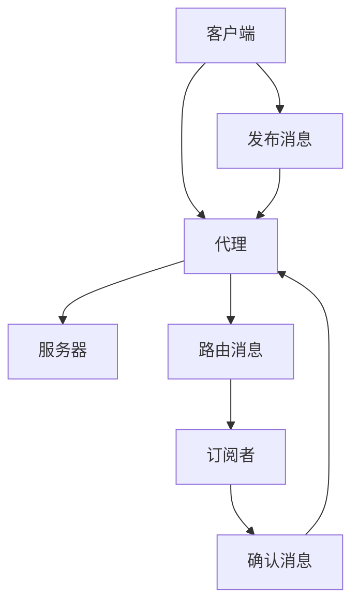

                 

关键词：MQTT物联网通信协议、MQTT消息队列、MQTT架构、MQTT安全性、MQTT应用场景、MQTT性能优化

> 摘要：本文将深入探讨MQTT（Message Queuing Telemetry Transport）物联网通信协议的各个方面。首先介绍MQTT协议的背景和基本概念，然后详细分析其核心架构和工作原理。接着，我们将探讨MQTT协议的关键算法、数学模型、以及实际应用场景。随后，文章将涉及MQTT协议的安全性问题和性能优化策略。最后，我们将推荐一些学习资源和开发工具，并对MQTT的未来发展趋势和面临的挑战进行展望。

## 1. 背景介绍

随着物联网（IoT）技术的飞速发展，设备间的通信变得越来越重要。为了满足低功耗、低带宽环境下的设备通信需求，MQTT协议应运而生。MQTT是一个轻量级的消息队列协议，特别适合于物联网设备之间的通信。其设计初衷是为了在传感器、遥测设备和嵌入式系统之间实现可靠的数据传输。

MQTT协议由IBM公司的阿德里安·霍夫（Adrian Humphreys）和菲利普·霍夫曼（Philippe De Ryck）在1999年首次提出。最初，MQTT被用于监控石油管道的远程传感器网络。随着物联网的兴起，MQTT协议逐渐成为物联网通信领域的标准之一。现在，MQTT协议广泛应用于智能家居、智能城市、智能制造、智能医疗等领域。

## 2. 核心概念与联系

### 2.1 MQTT协议的基本概念

MQTT协议定义了一个基于发布/订阅（publish/subscribe）模式的轻量级消息传递协议。核心概念包括：

- **发布者（Publisher）**：负责发送消息的设备或应用程序。
- **订阅者（Subscriber）**：负责接收消息的设备或应用程序。
- **代理（Broker）**：作为中间件，负责消息的路由和分发。

### 2.2 MQTT协议的核心架构

MQTT协议的核心架构可以分为三个主要部分：客户端（Client）、代理（Broker）和服务器（Server）。以下是一个简单的MQTT协议架构图：

```
+--------------+      +--------+      +------------------+
| Publisher    | <---> | Broker  | <---> | MQTT Server      |
+--------------+      +--------+      +------------------+
```

- **客户端**：客户端可以是任何设备或应用程序，负责发送和接收消息。
- **代理**：代理接收来自客户端的消息，并根据订阅信息将消息路由到对应的订阅者。
- **服务器**：服务器可以是一个单独的物理服务器，也可以是一个集群，用于存储和管理消息。

### 2.3 MQTT协议的工作原理

MQTT协议的工作原理基于发布/订阅模式。以下是一个简单的MQTT消息传输流程：

1. **连接**：客户端连接到代理，并通知代理它要订阅的主题。
2. **订阅**：客户端向代理订阅一个或多个主题。
3. **发布**：客户端发布消息到代理，消息包含主题和载荷（Payload）。
4. **路由**：代理根据订阅信息将消息路由到订阅该主题的客户端。
5. **确认**：客户端收到消息后，向代理发送确认消息。

### 2.4 MQTT协议的 Mermaid 流程图



## 3. 核心算法原理 & 具体操作步骤

### 3.1 算法原理概述

MQTT协议的核心算法是发布/订阅模式。该算法的基本原理如下：

- **发布者**：发送消息时，将消息发布到一个或多个主题。
- **订阅者**：订阅一个或多个主题，以便接收与这些主题相关的消息。

### 3.2 算法步骤详解

1. **连接**：客户端连接到代理，并发送连接请求消息。
2. **订阅**：客户端向代理发送订阅请求消息，指定要订阅的主题。
3. **发布**：客户端向代理发送发布请求消息，包含主题和载荷。
4. **路由**：代理根据订阅信息将消息路由到订阅该主题的客户端。
5. **确认**：客户端收到消息后，向代理发送确认消息。

### 3.3 算法优缺点

#### 优点：

- **轻量级**：MQTT协议设计简单，适用于资源受限的设备。
- **低延迟**：发布/订阅模式减少了消息传输的延迟。
- **可靠性**：消息传输过程中，MQTT协议提供了消息确认机制，保证了消息的可靠性。

#### 缺点：

- **安全性**：默认情况下，MQTT协议没有提供加密机制，容易受到网络攻击。
- **性能瓶颈**：在大量客户端同时通信时，代理可能成为性能瓶颈。

### 3.4 算法应用领域

MQTT协议广泛应用于物联网领域，以下是一些典型的应用场景：

- **智能家居**：MQTT协议可以用于智能灯泡、智能插座等设备的通信。
- **智能城市**：MQTT协议可以用于交通管理、环境监测等智能城市的应用。
- **智能制造**：MQTT协议可以用于工业物联网设备之间的通信。

## 4. 数学模型和公式 & 详细讲解 & 举例说明

### 4.1 数学模型构建

MQTT协议的核心数学模型是消息路由算法。该算法的目的是根据订阅信息将消息路由到订阅该主题的客户端。以下是消息路由算法的数学模型：

```
路由(主题, 订阅列表) = {
    if 主题不在订阅列表中， then
        返回 "无匹配"
    else
        返回 订阅列表中匹配主题的客户端列表
}
```

### 4.2 公式推导过程

假设有一个主题 `T` 和一个订阅列表 `L`，其中每个订阅项都是一个三元组 `(T', QoS, SUB)`，表示订阅的主题 `T'`、质量等级 `QoS` 和订阅方式 `SUB`。质量等级 `QoS` 有三个取值：`0`、`1` 和 `2`，分别表示至多一次、至少一次和恰好一次交付。订阅方式 `SUB` 有两个取值：`+` 和 `-`，分别表示订阅和取消订阅。

我们可以使用一个二维数组 `A` 来表示订阅列表，其中 `A[i][j]` 表示第 `i` 个订阅项的订阅主题是否与第 `j` 个主题匹配。如果匹配，则 `A[i][j] = 1`，否则 `A[i][j] = 0`。

根据消息路由算法的数学模型，我们可以推导出以下公式：

```
路由(主题, 订阅列表) = {
    if 主题不在订阅列表中， then
        返回 "无匹配"
    else
        对于每个订阅项 (T', QoS, SUB) in 订阅列表 L，do
            if A[i][j] = 1 and QoS >= SUB，then
                返回 客户端列表 containing 客户端 with 订阅项 (T', QoS, SUB)
            end if
        end for
        return "无匹配"
}
```

### 4.3 案例分析与讲解

假设有一个主题 `T = "home/room1/light"` 和一个订阅列表 `L = {("home/room1/light", 1, +), ("home/room1", 2, +), ("home", 0, +)}`。我们需要根据这个订阅列表路由一个消息到订阅该主题的客户端。

首先，我们构建一个二维数组 `A` 来表示订阅列表：

```
A = [
    [1, 0, 0],  # ("home/room1/light", 1, +)
    [0, 1, 0],  # ("home/room1", 2, +)
    [0, 0, 1]   # ("home", 0, +)
]
```

然后，我们使用消息路由算法来路由消息。根据算法，我们需要检查每个订阅项与主题 `T` 的匹配情况，并选择质量等级不低于订阅方式的最小质量等级的客户端。

在这个例子中，我们有以下匹配情况：

- 订阅项 ("home/room1/light", 1, +) 与主题 "home/room1/light" 匹配，质量等级 1 不低于订阅方式 1。
- 订阅项 ("home/room1", 2, +) 与主题 "home/room1/light" 不匹配。
- 订阅项 ("home", 0, +) 与主题 "home/room1/light" 不匹配。

因此，根据消息路由算法，我们返回一个包含订阅项 ("home/room1/light", 1, +) 对应客户端的列表。例如，如果客户端的标识符为 `client1`，则返回 `[client1]`。

## 5. 项目实践：代码实例和详细解释说明

### 5.1 开发环境搭建

在本节中，我们将使用Python语言和Paho MQTT客户端库来搭建一个简单的MQTT项目。首先，确保你已经安装了Python 3和pip（Python的包管理器）。然后，通过以下命令安装Paho MQTT客户端库：

```
pip install paho-mqtt
```

### 5.2 源代码详细实现

下面是一个简单的MQTT发布者示例：

```python
import paho.mqtt.client as mqtt

# MQTT服务器地址和端口
MQTT_SERVER = "localhost"
MQTT_PORT = 1883

# MQTT订阅主题
TOPIC = "home/room1/light"

# MQTT客户端标识符
CLIENT_ID = "python_mqtt_publisher"

# MQTT客户端初始化
client = mqtt.Client(CLIENT_ID)

# 连接到MQTT服务器
client.connect(MQTT_SERVER, MQTT_PORT, 60)

# 发布消息到MQTT服务器
client.publish(TOPIC, "light is on", qos=1)

# 断开连接
client.disconnect()
```

下面是一个简单的MQTT订阅者示例：

```python
import paho.mqtt.client as mqtt

# MQTT服务器地址和端口
MQTT_SERVER = "localhost"
MQTT_PORT = 1883

# MQTT订阅主题
TOPIC = "home/room1/light"

# MQTT客户端标识符
CLIENT_ID = "python_mqtt_subscriber"

# MQTT客户端初始化
client = mqtt.Client(CLIENT_ID)

# 连接到MQTT服务器
client.connect(MQTT_SERVER, MQTT_PORT, 60)

# 订阅MQTT主题
client.subscribe(TOPIC, qos=1)

# 定义消息接收处理函数
def on_message(client, userdata, message):
    print(f"Received message '{str(message.payload)}' on topic '{message.topic}' with QoS {message.qos}")

# 绑定消息接收处理函数
client.on_message = on_message

# 开始消息接收循环
client.loop_forever()
```

### 5.3 代码解读与分析

- **发布者代码**：发布者代码首先初始化一个MQTT客户端，并连接到本地MQTT服务器。然后，发布者使用 `client.publish()` 方法发布一条消息到主题 `home/room1/light`。最后，发布者断开连接。

- **订阅者代码**：订阅者代码与发布者类似，初始化一个MQTT客户端并连接到本地MQTT服务器。然后，订阅者使用 `client.subscribe()` 方法订阅主题 `home/room1/light`。订阅者还定义了一个消息接收处理函数 `on_message`，用于处理接收到的消息。最后，订阅者启动消息接收循环。

### 5.4 运行结果展示

当你运行发布者代码时，它会连接到本地MQTT服务器并发布一条消息。如果你同时运行订阅者代码，它会持续监听主题 `home/room1/light` 上的消息。当发布者发布消息时，订阅者会打印出接收到的消息。

## 6. 实际应用场景

### 6.1 智能家居

MQTT协议在智能家居领域具有广泛的应用。例如，智能灯泡、智能插座和智能恒温器等设备可以使用MQTT协议进行通信，实现远程控制和管理。

### 6.2 智能城市

在智能城市建设中，MQTT协议可以用于实现各种传感器和设备之间的通信。例如，环境监测设备、交通监控设备和公共安全设备等都可以使用MQTT协议进行数据采集和传输。

### 6.3 智能制造

在智能制造领域，MQTT协议可以用于实现设备间的实时通信和监控。例如，在工业物联网（IIoT）应用中，设备可以使用MQTT协议进行数据采集和状态监控，以便实时调整生产计划和设备维护计划。

## 7. 工具和资源推荐

### 7.1 学习资源推荐

- MQTT官方文档：https://mosquitto.org/manual/mosquitto.html
- Paho MQTT客户端库文档：https://pypi.org/project/paho-mqtt/
- 《MQTT权威指南》：作者李俊岭，详细介绍了MQTT协议的各个方面。

### 7.2 开发工具推荐

- Eclipse Paho MQTT客户端库：https://www.eclipse.org/paho/
- MQTT.fx：https://github.com/eclipse/MQTT.fx，一个基于Java的MQTT客户端工具。

### 7.3 相关论文推荐

- "MQTT: Message Queuing for the Internet of Things"，作者阿德里安·霍夫和菲利普·霍夫曼。
- "MQTT-SN: A publish/subscribe messaging protocol for wireless sensor networks"，作者阿德里安·霍夫、菲利普·霍夫曼和莱昂纳多·比安奇。

## 8. 总结：未来发展趋势与挑战

### 8.1 研究成果总结

- MQTT协议在物联网领域取得了显著的成功，广泛应用于智能家居、智能城市、智能制造等领域。
- MQTT协议的安全性得到了广泛关注，各种加密技术和安全机制逐渐成熟。
- MQTT协议的性能优化和性能瓶颈问题得到了深入研究，各种优化策略逐渐涌现。

### 8.2 未来发展趋势

- MQTT协议将继续向轻量级、低功耗、高可靠性方向发展。
- MQTT协议将与其他物联网协议（如CoAP、HTTP/2等）融合，实现更广泛的应用。
- MQTT协议的安全性和性能将得到进一步优化。

### 8.3 面临的挑战

- 安全性：尽管MQTT协议的安全机制逐渐成熟，但仍然面临潜在的安全威胁和攻击。
- 性能：在大量客户端同时通信时，MQTT代理的性能可能成为瓶颈。
- 兼容性：随着物联网技术的发展，不同设备之间的兼容性成为一个挑战。

### 8.4 研究展望

- 开发更安全、更高效的MQTT协议版本。
- 探索MQTT协议与其他物联网协议的融合和应用。
- 研究大规模物联网环境下MQTT协议的性能优化策略。

## 9. 附录：常见问题与解答

### 9.1 MQTT协议是什么？

MQTT（Message Queuing Telemetry Transport）是一个轻量级的消息队列协议，用于物联网设备之间的通信。

### 9.2 MQTT协议的工作原理是什么？

MQTT协议基于发布/订阅模式，发布者发送消息到主题，订阅者订阅一个或多个主题以接收与这些主题相关的消息。

### 9.3 如何实现MQTT协议的安全性？

可以使用TLS（传输层安全）或SSL（安全套接字层）加密MQTT连接，以确保数据传输的安全性。

### 9.4 MQTT协议有哪些优点？

MQTT协议具有轻量级、低延迟、可靠性高等优点，特别适合于物联网设备的通信。

### 9.5 MQTT协议有哪些缺点？

MQTT协议默认情况下没有提供加密机制，安全性存在一定风险。此外，在大量客户端同时通信时，代理可能成为性能瓶颈。

