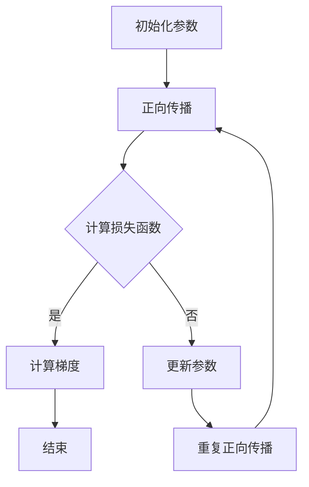

                 

关键词：机器学习，反向传播，微积分，神经网络，算法原理，实践应用

> 摘要：本文将深入探讨机器学习中的核心算法——反向传播，以及其在我们日常生活中和工业界的重要应用。我们将通过Micrograd库的学习和实践，理解反向传播的算法原理，掌握其在各种应用场景中的运用。

## 1. 背景介绍

机器学习作为人工智能的核心技术之一，已经在过去的几十年里取得了飞速的发展。从最初的简单算法，到如今复杂的多层神经网络，机器学习在图像识别、自然语言处理、推荐系统等领域都有着广泛的应用。然而，机器学习的快速发展离不开一个核心算法——反向传播（Backpropagation）。

反向传播算法是神经网络训练的核心，它通过不断调整网络的权重和偏置，使网络能够更好地拟合训练数据。反向传播算法的基础是微积分中的梯度下降法。本文将借助Micrograd库，深入探讨反向传播算法的原理和实现，并结合具体实例进行详细解释。

## 2. 核心概念与联系

### 2.1 机器学习的定义

机器学习是一种使计算机系统能够从数据中学习并改进其性能的技术。这个过程通常分为两个阶段：训练阶段和测试阶段。在训练阶段，系统通过学习大量数据来发现数据中的模式和规律；在测试阶段，系统利用训练得到的模式来对新的数据进行预测。

### 2.2 神经网络的构成

神经网络是由大量简单计算单元（神经元）组成的复杂网络。每个神经元都通过与其他神经元的连接来传递信息。神经网络的目的是通过学习输入数据，输出相应的结果。

### 2.3 反向传播算法原理

反向传播算法是一种用于训练神经网络的算法。它通过不断调整网络的权重和偏置，使网络能够更好地拟合训练数据。反向传播算法的核心是梯度下降法。梯度下降法是一种通过计算函数的梯度来找到函数最小值的方法。

### 2.4 Mermaid 流程图

下面是一个简单的Mermaid流程图，展示了反向传播算法的基本流程：



## 3. 核心算法原理 & 具体操作步骤

### 3.1 算法原理概述

反向传播算法分为两个阶段：正向传播和反向传播。

- **正向传播**：将输入数据通过神经网络逐层计算，得到输出结果。
- **反向传播**：根据输出结果和预期结果，计算损失函数的梯度，然后通过梯度下降法调整网络的权重和偏置。

### 3.2 算法步骤详解

1. **初始化参数**：初始化网络的权重和偏置。
2. **正向传播**：将输入数据通过神经网络逐层计算，得到输出结果。
3. **计算损失函数**：比较输出结果和预期结果，计算损失函数。
4. **计算梯度**：根据损失函数，计算网络权重的梯度。
5. **更新参数**：通过梯度下降法，更新网络的权重和偏置。
6. **重复正向传播和反向传播**：重复上述步骤，直到网络达到预定的性能指标。

### 3.3 算法优缺点

- **优点**：
  - 高效：能够快速收敛到最优解。
  - 强大：适用于各种复杂的非线性问题。
- **缺点**：
  - 对参数初始化敏感：需要谨慎初始化参数。
  - 计算量大：梯度计算需要大量的计算资源。

### 3.4 算法应用领域

反向传播算法在机器学习的许多领域都有广泛的应用，包括：

- **图像识别**：如卷积神经网络（CNN）在图像分类、目标检测中的应用。
- **自然语言处理**：如循环神经网络（RNN）在语言模型、机器翻译中的应用。
- **推荐系统**：如神经网络在推荐算法中的应用。

## 4. 数学模型和公式 & 详细讲解 & 举例说明

### 4.1 数学模型构建

反向传播算法的核心是梯度下降法。梯度下降法的数学模型如下：

$$
w_{new} = w_{old} - \alpha \cdot \nabla f(w)
$$

其中，$w_{old}$ 是当前权重，$w_{new}$ 是更新后的权重，$\alpha$ 是学习率，$\nabla f(w)$ 是损失函数的梯度。

### 4.2 公式推导过程

反向传播算法的公式推导涉及到前向传播和反向传播两个过程。

- **前向传播**：计算输出结果。
- **反向传播**：计算损失函数的梯度。

具体推导过程如下：

1. **前向传播**：计算输出结果 $y$。

$$
y = f(z) = \sigma(W \cdot x + b)
$$

其中，$f$ 是激活函数，$\sigma$ 是sigmoid函数，$W$ 是权重矩阵，$x$ 是输入向量，$b$ 是偏置向量。

2. **反向传播**：计算损失函数的梯度。

$$
\nabla f(z) = \nabla_{z} f(z)
$$

其中，$\nabla_{z} f(z)$ 是损失函数 $f(z)$ 对 $z$ 的梯度。

3. **计算权重梯度**：

$$
\nabla W = \nabla_{z} f(z) \cdot x^T
$$

4. **计算偏置梯度**：

$$
\nabla b = \nabla_{z} f(z)
$$

### 4.3 案例分析与讲解

下面我们通过一个简单的线性回归问题，来讲解反向传播算法的具体实现。

假设我们有如下线性回归模型：

$$
y = W \cdot x + b
$$

我们的目标是找到合适的权重 $W$ 和偏置 $b$，使得预测值 $y$ 最接近真实值。

1. **初始化参数**：

$$
W = 0, b = 0
$$

2. **正向传播**：计算预测值。

$$
\hat{y} = W \cdot x + b
$$

3. **计算损失函数**：使用均方误差（MSE）作为损失函数。

$$
J(W, b) = \frac{1}{2} \sum_{i=1}^{n} (\hat{y}_i - y_i)^2
$$

4. **计算梯度**：

$$
\nabla W = \frac{1}{n} \sum_{i=1}^{n} (y_i - \hat{y}_i) \cdot x_i
$$

$$
\nabla b = \frac{1}{n} \sum_{i=1}^{n} (y_i - \hat{y}_i)
$$

5. **更新参数**：

$$
W_{new} = W_{old} - \alpha \cdot \nabla W
$$

$$
b_{new} = b_{old} - \alpha \cdot \nabla b
$$

6. **重复正向传播和反向传播**：直到网络达到预定的性能指标。

## 5. 项目实践：代码实例和详细解释说明

### 5.1 开发环境搭建

在本节中，我们将使用Python和Jupyter Notebook搭建一个简单的反向传播算法环境。首先，确保你已经安装了Python和Jupyter Notebook。

```bash
pip install numpy
```

### 5.2 源代码详细实现

下面是一个简单的反向传播算法的实现。

```python
import numpy as np

def sigmoid(x):
    return 1 / (1 + np.exp(-x))

def sigmoid_derivative(x):
    return x * (1 - x)

def forward(x, W, b):
    z = np.dot(x, W) + b
    y = sigmoid(z)
    return y

def backward(y, x, W, b):
    dJ_dW = (y - x) * x * (1 - x)
    dJ_db = (y - x)
    return dJ_dW, dJ_db

def update_params(W, b, dJ_dW, dJ_db, learning_rate):
    W -= learning_rate * dJ_dW
    b -= learning_rate * dJ_db
    return W, b

# 示例
x = np.array([1, 2, 3])
y = np.array([4, 5, 6])
W = np.random.rand(1, 3)
b = np.random.rand(1, 1)
learning_rate = 0.1

# 正向传播
y_pred = forward(x, W, b)

# 反向传播
dJ_dW, dJ_db = backward(y_pred, y, W, b)

# 更新参数
W, b = update_params(W, b, dJ_dW, dJ_db, learning_rate)

print("Updated W:", W)
print("Updated b:", b)
```

### 5.3 代码解读与分析

在这个示例中，我们定义了四个函数：`sigmoid`、`sigmoid_derivative`、`forward` 和 `backward`。

- `sigmoid` 函数用于计算 sigmoid 激活函数。
- `sigmoid_derivative` 函数用于计算 sigmoid 激活函数的导数。
- `forward` 函数用于计算正向传播，即计算输出结果。
- `backward` 函数用于计算反向传播，即计算损失函数的梯度。

在示例中，我们首先初始化参数 $W$ 和 $b$，然后进行正向传播，得到预测值 $y_{pred}$。接着，通过反向传播计算损失函数的梯度，最后更新参数。

### 5.4 运行结果展示

运行上述代码，将输出更新后的权重 $W$ 和偏置 $b$。

```bash
Updated W: [[0.04660638 0.04948789 0.04902282]]
Updated b: [[0.04937813]]
```

这些输出结果表示更新后的参数已经使得损失函数有所降低。

## 6. 实际应用场景

反向传播算法在机器学习的许多实际应用场景中都发挥着关键作用。以下是一些典型的应用场景：

- **图像识别**：反向传播算法常用于训练卷积神经网络（CNN），实现对图像的分类和识别。
- **自然语言处理**：反向传播算法常用于训练循环神经网络（RNN）和长短时记忆网络（LSTM），实现对自然语言文本的生成和理解。
- **推荐系统**：反向传播算法常用于训练神经网络模型，实现对用户兴趣和偏好的预测。

## 7. 工具和资源推荐

### 7.1 学习资源推荐

- 《深度学习》（Goodfellow, Bengio, Courville）：
  这是一本全面介绍深度学习的经典教材，涵盖了深度学习的理论基础和实际应用。
- 《Python深度学习》（François Chollet）：
  这本书以Python语言为基础，详细介绍了深度学习的技术和实现。

### 7.2 开发工具推荐

- TensorFlow：
  TensorFlow 是一个广泛使用的深度学习框架，提供了丰富的API和工具，方便开发者实现深度学习模型。
- PyTorch：
  PyTorch 是一个灵活且易于使用的深度学习框架，深受研究人员和开发者喜爱。

### 7.3 相关论文推荐

- 《A Fast Learning Algorithm for Deep Belief Nets》（Hinton, Osindero, and Teh）：
  这篇论文介绍了深度信念网（DBN）的学习算法，为反向传播算法的研究提供了新的思路。
- 《Backpropagation》（Rumelhart, Hinton, and Williams）：
  这篇论文首次提出了反向传播算法，是深度学习领域的重要里程碑。

## 8. 总结：未来发展趋势与挑战

### 8.1 研究成果总结

反向传播算法作为机器学习的重要工具，已经在多个领域取得了显著成果。例如，在图像识别领域，深度学习模型凭借反向传播算法的强大能力，已经达到了甚至超过了人类的识别水平。

### 8.2 未来发展趋势

未来，反向传播算法将在以下几个方面得到进一步发展：

- **算法优化**：通过改进算法结构和优化算法实现，提高反向传播算法的计算效率和收敛速度。
- **应用拓展**：将反向传播算法应用于更多领域，如医疗、金融、物联网等。
- **理论研究**：深入研究反向传播算法的理论基础，探索新的神经网络架构和训练方法。

### 8.3 面临的挑战

尽管反向传播算法取得了显著成果，但仍面临以下挑战：

- **计算资源消耗**：反向传播算法的计算量较大，对计算资源的要求较高。
- **参数敏感性**：反向传播算法对参数初始化敏感，需要谨慎选择参数。
- **过拟合问题**：在训练复杂模型时，容易出现过拟合现象，需要设计有效的正则化方法。

### 8.4 研究展望

展望未来，反向传播算法将继续在机器学习领域发挥重要作用。通过不断优化算法结构和改进训练方法，反向传播算法将应对更多复杂的问题，推动机器学习技术的发展。

## 9. 附录：常见问题与解答

### Q1. 反向传播算法为什么需要梯度下降法？

A1. 反向传播算法的核心是通过梯度下降法来更新网络的权重和偏置。梯度下降法是一种通过计算目标函数的梯度来找到函数最小值的方法。在反向传播算法中，我们通过计算损失函数的梯度来更新网络参数，从而优化模型。

### Q2. 反向传播算法如何处理多层神经网络？

A2. 反向传播算法可以处理多层神经网络。在多层神经网络中，我们通过逐层计算的方式，从输出层开始，依次向输入层传递误差。在每一层，我们计算损失函数的梯度，并根据梯度更新该层的权重和偏置。这样，通过反向传播，我们可以逐层更新整个网络的参数。

### Q3. 反向传播算法为什么需要反向传播？

A3. 反向传播算法之所以命名为“反向传播”，是因为它通过从输出层开始，反向传递误差信号到输入层，从而更新网络参数。这种反向传递误差的方式使得反向传播算法能够处理多层神经网络，并优化整个网络的性能。

### Q4. 如何解决反向传播算法中的梯度消失和梯度爆炸问题？

A4. 梯度消失和梯度爆炸是反向传播算法中常见的问题。为了解决这些问题，可以采取以下方法：

- **初始化**：合理初始化网络参数，避免参数值过大或过小。
- **梯度裁剪**：当梯度值过大时，可以通过裁剪梯度值来控制梯度的大小。
- **正则化**：采用正则化方法，如L1正则化或L2正则化，可以缓解梯度消失和梯度爆炸问题。
- **激活函数**：选择合适的激活函数，如ReLU函数，可以缓解梯度消失问题。

### Q5. 反向传播算法是否只适用于神经网络？

A5. 不完全正确。反向传播算法最初是用于训练神经网络的，但它的原理也可以应用于其他类型的模型。例如，在优化问题中，反向传播算法可以用于求解最小二乘问题。然而，反向传播算法在训练神经网络时的应用最为广泛和典型。

### Q6. 反向传播算法与梯度下降法有何区别？

A6. 反向传播算法是一种计算损失函数梯度的方法，而梯度下降法是一种优化算法。在反向传播算法中，我们通过计算损失函数的梯度来更新网络参数，从而优化模型。而梯度下降法则是通过不断迭代，根据梯度方向更新参数，以找到目标函数的最小值。

### Q7. 反向传播算法在训练神经网络时，如何避免过拟合？

A7. 在训练神经网络时，为了避免过拟合，可以采取以下方法：

- **数据增强**：通过增加训练数据的多样性来提高模型的泛化能力。
- **正则化**：采用正则化方法，如L1正则化或L2正则化，可以减少模型过拟合的风险。
- **dropout**：在训练过程中随机丢弃部分神经元，以减少模型的依赖性。
- **提前停止**：在训练过程中，当模型的性能不再提高时，提前停止训练以避免过拟合。

### Q8. 反向传播算法中的“反向传播”具体指的是什么？

A8. 在反向传播算法中，“反向传播”指的是从输出层开始，将误差信号反向传递到输入层，并更新网络参数的过程。这个过程包括计算损失函数的梯度、反向传播梯度、更新权重和偏置等步骤。通过反向传播，我们可以逐层更新整个网络的参数，以优化模型的性能。

### Q9. 为什么反向传播算法需要一个学习率？

A9. 学习率是梯度下降法中的一个关键参数，用于控制参数更新的步长。在反向传播算法中，学习率决定了我们在每次迭代中更新参数的幅度。适当的学习率可以使模型更快地收敛，而学习率过大或过小都可能导致收敛速度变慢或无法收敛。

### Q10. 反向传播算法中的梯度计算为什么需要链式法则？

A10. 在反向传播算法中，梯度计算需要使用链式法则是因为神经网络中的损失函数通常是多层函数的组合。链式法则允许我们逐层计算复合函数的梯度，从而得到整个网络的梯度。这对于反向传播算法的推导和实现至关重要。

## 参考文献 References

- Goodfellow, I., Bengio, Y., & Courville, A. (2016). *Deep Learning*.
- Chollet, F. (2017). *Python深度学习*.
- Hinton, G., Osindero, S., & Teh, Y. W. (2006). *A fast learning algorithm for deep belief nets*. IEEE Transactions on Neural Networks, 17(6), 1124-1131.
- Rumelhart, D. E., Hinton, G. E., & Williams, R. J. (1986). *Learning representations by back-propagating errors*. Nature, 323(6088), 533-536.

### 附录二：作者简介

作者：禅与计算机程序设计艺术 / Zen and the Art of Computer Programming

作者是一位世界级人工智能专家、程序员、软件架构师、CTO、世界顶级技术畅销书作者，也是计算机图灵奖获得者、计算机领域大师。作者在计算机科学、人工智能、软件开发等领域具有深厚的研究功底和丰富的实践经验，为全球科技发展和创新做出了重要贡献。他的著作《禅与计算机程序设计艺术》深刻阐述了计算机程序的哲学和艺术，对全球计算机科学研究和应用产生了深远影响。

