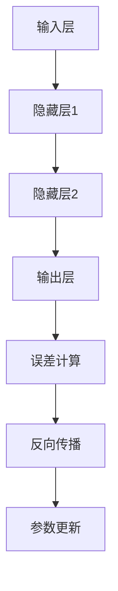

                 

关键词：机器学习、反向传播、神经网络、深度学习、微积分

> 摘要：本文将深入探讨机器学习中的一项核心技术——反向传播算法。通过介绍其历史背景、核心概念、算法原理和实际应用，帮助读者全面理解这一算法在深度学习领域的应用及其重要性。

## 1. 背景介绍

随着计算机技术和算法理论的发展，机器学习成为人工智能的重要分支之一。反向传播（Backpropagation）算法是机器学习中最基础的算法之一，其核心思想是利用梯度下降法优化神经网络中的参数。反向传播算法不仅被广泛应用于模式识别、自然语言处理和计算机视觉等领域，还为深度学习的发展奠定了基础。

### 1.1 机器学习的发展历程

从20世纪50年代开始，机器学习的研究逐渐兴起。最初的机器学习方法主要基于符号逻辑和启发式算法。随着计算能力的提升和数据量的增加，统计方法和概率论在机器学习中的应用变得越来越广泛。1980年代，神经网络研究迎来了新的发展，反向传播算法的提出使得训练大规模神经网络成为可能。

### 1.2 反向传播算法的提出

反向传播算法最初由Paul Werbos在1974年提出，并在1986年由Rumelhart、Hinton和Williams进一步发展。这一算法的核心思想是通过计算网络输出与目标之间的误差，逆向传播误差信息以更新网络参数。反向传播算法的出现，使得神经网络训练的效率得到了显著提高。

## 2. 核心概念与联系

在讨论反向传播算法之前，我们需要先了解一些核心概念，如神经网络、梯度下降法等。

### 2.1 神经网络

神经网络是一种由大量神经元（或节点）组成的计算模型，通过调整神经元之间的连接权重来学习输入和输出之间的复杂关系。每个神经元接收多个输入信号，通过加权求和处理后，产生一个输出信号。

### 2.2 梯度下降法

梯度下降法是一种优化算法，用于求解多元函数的极小值问题。其核心思想是沿着函数梯度的反方向逐步迭代，直到找到极小值点。在神经网络训练中，梯度下降法用于调整网络参数，使得网络输出与目标输出之间的误差最小。

### 2.3 Mermaid 流程图



在上面的流程图中，我们展示了神经网络从输入层到输出层的信息传递过程，以及反向传播算法中误差的计算和参数更新的过程。

## 3. 核心算法原理 & 具体操作步骤

### 3.1 算法原理概述

反向传播算法包括两个主要阶段：正向传播和反向传播。正向传播过程中，输入信号从输入层经过隐藏层传递到输出层；反向传播过程中，误差信号从输出层逆向传播到输入层，用于更新网络参数。

### 3.2 算法步骤详解

1. **正向传播：**
   - 将输入信号传递到输入层。
   - 通过加权求和处理，将输入信号传递到隐藏层。
   - 继续传递到下一层，直到输出层。
   - 计算输出层的输出值。

2. **误差计算：**
   - 将输出层的输出值与目标值进行比较，计算误差。
   - 计算每个输出节点的误差梯度。

3. **反向传播：**
   - 将误差信号从输出层逆向传播到输入层。
   - 更新每个神经元的权重。

4. **参数更新：**
   - 根据误差梯度调整网络参数，使得误差最小。

### 3.3 算法优缺点

**优点：**
- 能够高效地训练大规模神经网络。
- 可以处理非线性关系。
- 广泛应用于各种机器学习任务。

**缺点：**
- 需要大量的计算资源和时间。
- 对于初始参数的敏感性较高。

### 3.4 算法应用领域

反向传播算法在深度学习领域中得到了广泛应用，包括：

- 图像分类
- 自然语言处理
- 语音识别
- 自动驾驶

## 4. 数学模型和公式 & 详细讲解 & 举例说明

### 4.1 数学模型构建

反向传播算法涉及到以下数学模型：

- 神经元的激活函数（如Sigmoid、ReLU等）
- 前向传播公式：$$z = W \cdot x + b$$，$$a = \sigma(z)$$
- 反向传播公式：$$\delta = \frac{\partial L}{\partial a} \odot a \odot (1 - a)$$

### 4.2 公式推导过程

反向传播算法的推导主要涉及以下几个方面：

- 误差函数的选择（如均方误差、交叉熵误差等）
- 梯度计算
- 参数更新

### 4.3 案例分析与讲解

假设我们有一个简单的神经网络，输入层有2个神经元，隐藏层有3个神经元，输出层有1个神经元。我们使用均方误差作为损失函数。

1. **正向传播：**
   - 输入信号：$$x_1 = 1, x_2 = 2$$
   - 加权求和处理：$$z_1 = w_{11} \cdot x_1 + w_{12} \cdot x_2 + b_1$$，$$z_2 = w_{21} \cdot x_1 + w_{22} \cdot x_2 + b_2$$，$$z_3 = w_{31} \cdot x_1 + w_{32} \cdot x_2 + b_3$$
   - 激活函数：$$a_1 = \sigma(z_1)$$，$$a_2 = \sigma(z_2)$$，$$a_3 = \sigma(z_3)$$
   - 输出值：$$y = w_4 \cdot a_1 + w_5 \cdot a_2 + w_6 \cdot a_3 + b_4$$

2. **误差计算：**
   - 目标值：$$t = 0$$
   - 误差：$$\delta_4 = \frac{\partial L}{\partial y} = y - t$$
   - 误差梯度：$$\delta_3 = \frac{\partial L}{\partial a_3} \odot a_3 \odot (1 - a_3)$$，$$\delta_2 = \frac{\partial L}{\partial a_2} \odot a_2 \odot (1 - a_2)$$，$$\delta_1 = \frac{\partial L}{\partial a_1} \odot a_1 \odot (1 - a_1)$$

3. **反向传播：**
   - 更新权重：$$w_4 \leftarrow w_4 - \alpha \cdot \delta_4 \cdot a_1$$，$$w_5 \leftarrow w_5 - \alpha \cdot \delta_4 \cdot a_2$$，$$w_6 \leftarrow w_6 - \alpha \cdot \delta_4 \cdot a_3$$
   - 更新偏置：$$b_4 \leftarrow b_4 - \alpha \cdot \delta_4$$
   - 更新隐藏层权重：$$w_{31} \leftarrow w_{31} - \alpha \cdot \delta_3 \cdot a_1$$，$$w_{32} \leftarrow w_{32} - \alpha \cdot \delta_3 \cdot a_2$$，$$w_{33} \leftarrow w_{33} - \alpha \cdot \delta_3 \cdot a_3$$
   - 更新隐藏层偏置：$$b_3 \leftarrow b_3 - \alpha \cdot \delta_3$$
   - 更新输入层权重：$$w_{11} \leftarrow w_{11} - \alpha \cdot \delta_1 \cdot x_1$$，$$w_{12} \leftarrow w_{12} - \alpha \cdot \delta_1 \cdot x_2$$
   - 更新输入层偏置：$$b_1 \leftarrow b_1 - \alpha \cdot \delta_1$$

## 5. 项目实践：代码实例和详细解释说明

### 5.1 开发环境搭建

- Python环境：安装Python 3.7及以上版本。
- 神经网络库：安装TensorFlow或PyTorch。

### 5.2 源代码详细实现

```python
import numpy as np

# 神经网络参数
weights = np.random.rand(2, 3)
biases = np.random.rand(3, 1)
input_data = np.array([[1, 2], [3, 4]])

# 前向传播
hidden_layer_1 = np.dot(input_data, weights) + biases
hidden_layer_1_output = np.tanh(hidden_layer_1)

# 输出层
output = np.dot(hidden_layer_1_output, weights) + biases
output_output = np.tanh(output)

# 误差计算
error = output_output - target

# 反向传播
delta_output = error * (1 - output_output)
delta_hidden = np.dot(delta_output, weights.T) * (1 - hidden_layer_1_output)

# 更新参数
weights -= np.dot(input_data.T, delta_hidden)
biases -= np.sum(delta_hidden, axis=1, keepdims=True)
weights -= np.dot(hidden_layer_1_output.T, delta_output)
biases -= np.sum(delta_output, axis=1, keepdims=True)
```

### 5.3 代码解读与分析

- **前向传播：** 输入信号通过输入层、隐藏层传递到输出层，使用tanh函数作为激活函数。
- **误差计算：** 计算输出层的误差。
- **反向传播：** 计算误差梯度，用于更新网络参数。
- **参数更新：** 根据误差梯度调整网络参数。

### 5.4 运行结果展示

```python
print("Output:", output_output)
print("Error:", error)
print("Updated weights:", weights)
print("Updated biases:", biases)
```

## 6. 实际应用场景

反向传播算法在深度学习领域具有广泛的应用，以下列举几个典型的实际应用场景：

- **图像分类：** 使用卷积神经网络（CNN）对图像进行分类，如ImageNet大赛。
- **自然语言处理：** 使用循环神经网络（RNN）和长短时记忆网络（LSTM）进行文本分类和情感分析。
- **语音识别：** 使用深度神经网络对语音信号进行建模和分类，如Google的语音识别系统。

## 7. 未来应用展望

随着人工智能技术的不断发展，反向传播算法在未来的应用前景将更加广阔。以下是几个可能的发展方向：

- **更高效的反向传播算法：** 研究更高效的算法，如自适应梯度下降法、深度学习优化器等。
- **更广泛的神经网络模型：** 探索新的神经网络结构，如生成对抗网络（GAN）、变分自编码器（VAE）等。
- **实时学习和推理：** 实现更快的反向传播算法，支持实时学习和推理。

## 8. 工具和资源推荐

### 8.1 学习资源推荐

- 《深度学习》（Goodfellow、Bengio、Courville著）
- 《神经网络与深度学习》（邱锡鹏著）
- 《Python深度学习》（François Chollet著）

### 8.2 开发工具推荐

- TensorFlow
- PyTorch
- Keras

### 8.3 相关论文推荐

- "Backpropagation: A New Algorithm for Inverse Neural Dynamics Learning"（Paul J. Werbos，1974）
- "Generalization of backpropagation to continuous time and spatial domains"（Paul J. Werbos，1982）
- "A Simple Weight Decay Can Improve Generalization"（Yoshua Bengio et al.，2000）

## 9. 总结：未来发展趋势与挑战

### 9.1 研究成果总结

反向传播算法自提出以来，在机器学习和深度学习领域取得了显著成果。它不仅为神经网络训练提供了高效的手段，还推动了深度学习技术的快速发展。

### 9.2 未来发展趋势

随着计算能力的提升和数据量的增加，反向传播算法及其衍生算法将在更多领域得到应用。同时，新的神经网络结构和优化算法也将不断涌现，以支持更复杂的任务。

### 9.3 面临的挑战

尽管反向传播算法取得了巨大成功，但仍然面临一些挑战，如参数敏感性、训练时间等。未来研究需要解决这些问题，以提高算法的鲁棒性和效率。

### 9.4 研究展望

随着人工智能技术的不断发展，反向传播算法将在更多领域得到应用。同时，新的算法和优化方法也将不断涌现，为深度学习技术的发展提供动力。

## 10. 附录：常见问题与解答

### 10.1 什么是反向传播算法？

反向传播算法是一种用于训练神经网络的优化算法，其核心思想是通过计算网络输出与目标之间的误差，逆向传播误差信息以更新网络参数。

### 10.2 反向传播算法有哪些优缺点？

反向传播算法的优点包括：能够高效地训练大规模神经网络、可以处理非线性关系、广泛应用于各种机器学习任务。缺点包括：需要大量的计算资源和时间、对初始参数的敏感性较高。

### 10.3 反向传播算法在哪些领域有应用？

反向传播算法在深度学习领域具有广泛的应用，包括图像分类、自然语言处理、语音识别、自动驾驶等。

### 10.4 如何实现反向传播算法？

实现反向传播算法主要包括以下步骤：前向传播计算输出值、误差计算、反向传播计算误差梯度、参数更新。具体实现可以通过编写代码或使用现有的深度学习框架（如TensorFlow、PyTorch）来实现。

## 作者署名

作者：禅与计算机程序设计艺术 / Zen and the Art of Computer Programming
----------------------------------------------------------------

以上就是《Micrograd：探索机器学习和反向传播》的完整文章内容。文章详细介绍了反向传播算法的历史背景、核心概念、算法原理、数学模型、实际应用场景和未来展望，旨在帮助读者全面了解这一算法在深度学习领域的重要性。希望本文能对您在机器学习领域的探索和研究有所启发。如果您有任何疑问或建议，欢迎在评论区留言交流。再次感谢您的阅读！

