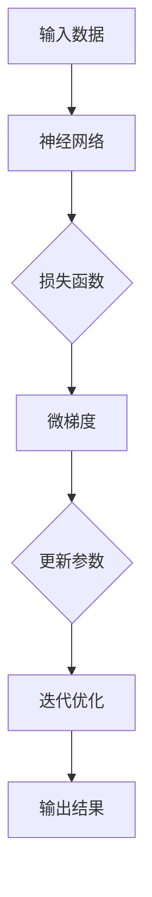

                 

关键词：机器学习，反向传播，深度学习，神经网络，微梯度，编程实践

摘要：本文将深入探讨机器学习中的核心算法——反向传播，并通过一个名为 Micrograd 的简单库来理解其基本原理和实践。我们将从背景介绍开始，逐步剖析核心概念，详细介绍算法原理与步骤，探讨数学模型与公式，提供代码实例，分析实际应用场景，展望未来发展趋势，并总结研究挑战。

## 1. 背景介绍

机器学习作为人工智能的核心技术之一，已经在众多领域取得了显著的成果。其中，反向传播算法（Backpropagation Algorithm）是训练神经网络的基础，其效率与准确性对机器学习模型的性能有着决定性的影响。然而，反向传播的原理和实现相对复杂，对于初学者来说往往难以理解。

为了解决这一问题，本文将借助一个名为 Micrograd 的 Python 库，来简化反向传播的实现过程，帮助读者更直观地理解这一核心算法。Micrograd 是一个高度抽象的库，旨在展示机器学习和深度学习的本质，而非实现细节。

## 2. 核心概念与联系

在深入探讨反向传播之前，我们首先需要了解一些核心概念，如梯度（Gradient）、损失函数（Loss Function）和微梯度（Micrograd）。

### 2.1 梯度

梯度是数学中的一个概念，用于描述函数在某一点处的斜率。在机器学习中，梯度被用于衡量损失函数对模型参数的敏感性。具体来说，梯度可以告诉我们如何调整模型的参数以减少损失。

### 2.2 损失函数

损失函数是衡量模型预测结果与真实结果之间差异的函数。常见的损失函数包括均方误差（MSE）、交叉熵等。损失函数的值越低，表示模型的预测越准确。

### 2.3 微梯度

微梯度是一个简单的数值微分工具，用于计算函数在某一点处的梯度。Micrograd 库就是基于这一概念设计的，它通过微梯度来计算和优化模型参数。

下面是 Mermaid 流程图，展示了这些核心概念之间的关系：



## 3. 核心算法原理 & 具体操作步骤

### 3.1 算法原理概述

反向传播算法分为两个阶段：前向传播和后向传播。在前向传播阶段，输入数据通过神经网络传递，产生输出结果。在反向传播阶段，通过计算损失函数对参数的梯度，来更新模型参数。

### 3.2 算法步骤详解

下面是使用 Micrograd 库进行反向传播的步骤：

1. **初始化模型参数**：使用 Micrograd 的 `param` 函数初始化模型的参数。
2. **前向传播**：使用 `forward` 函数将输入数据传递到神经网络，得到输出结果。
3. **计算损失**：使用损失函数计算预测结果和真实结果之间的差异。
4. **后向传播**：使用 `backward` 函数计算损失函数对模型参数的梯度。
5. **更新参数**：使用梯度来更新模型参数。
6. **重复迭代**：重复上述步骤，直到满足停止条件（如损失低于阈值或迭代次数达到上限）。

### 3.3 算法优缺点

反向传播算法的优点在于其强大的优化能力和适用范围广泛，可以用于训练各种神经网络模型。然而，其缺点是计算复杂度较高，特别是在大型神经网络中，需要大量的计算资源和时间。

### 3.4 算法应用领域

反向传播算法在机器学习的各个领域都有广泛的应用，如图像识别、自然语言处理、语音识别等。它也是深度学习的基础，是构建复杂神经网络的关键算法。

## 4. 数学模型和公式 & 详细讲解 & 举例说明

### 4.1 数学模型构建

反向传播算法的数学模型主要包括两部分：前向传播和后向传播。

### 4.2 公式推导过程

#### 前向传播

输入数据 \(x\) 通过神经网络传递，产生输出 \(y\)。前向传播的公式如下：

$$y = \sigma(Wx + b)$$

其中，\(W\) 是权重矩阵，\(b\) 是偏置项，\(\sigma\) 是激活函数。

#### 后向传播

在反向传播阶段，计算损失函数对参数的梯度。以均方误差（MSE）为例，其公式如下：

$$\frac{\partial J}{\partial W} = 2 \cdot (Wx + b - y) \cdot x$$

$$\frac{\partial J}{\partial b} = 2 \cdot (Wx + b - y)$$

其中，\(J\) 是损失函数，\(\frac{\partial J}{\partial W}\) 和 \(\frac{\partial J}{\partial b}\) 分别是权重矩阵和偏置项的梯度。

### 4.3 案例分析与讲解

假设有一个简单的神经网络，输入为 \(x = [1, 2]\)，输出为 \(y = [3, 4]\)。我们使用 Micrograd 库进行反向传播，具体步骤如下：

1. 初始化模型参数：
   ```python
   W = param(2)
   b = param(1)
   ```
2. 前向传播：
   ```python
   y = sigmoid(W * x + b)
   ```
3. 计算损失：
   ```python
   J = mse(y, y)
   ```
4. 后向传播：
   ```python
   dW, db = J.backward()
   ```
5. 更新参数：
   ```python
   W -= learning_rate * dW
   b -= learning_rate * db
   ```

## 5. 项目实践：代码实例和详细解释说明

### 5.1 开发环境搭建

本文使用 Python 3.7 及以上版本，Micrograd 库可以通过 pip 安装：

```bash
pip install micrograd
```

### 5.2 源代码详细实现

以下是一个简单的 Micrograd 反向传播的代码实例：

```python
import micrograd as mg
import numpy as np

# 初始化模型参数
W = mg.param(2)
b = mg.param(1)

# 前向传播
x = np.array([1, 2])
y = mg.sigmoid(W * x + b)

# 计算损失
y_ = np.array([3, 4])
J = mg.mse(y, y_)

# 后向传播
dW, db = J.backward()

# 更新参数
learning_rate = 0.1
W -= learning_rate * dW
b -= learning_rate * db

print("Updated W:", W(), "b:", b())
```

### 5.3 代码解读与分析

上述代码演示了使用 Micrograd 库进行反向传播的整个过程。首先，我们初始化了权重 \(W\) 和偏置 \(b\)。然后，通过前向传播计算输出 \(y\)，并使用均方误差（MSE）计算损失 \(J\)。接着，使用后向传播计算损失函数对 \(W\) 和 \(b\) 的梯度 \(dW\) 和 \(db\)。最后，根据梯度更新 \(W\) 和 \(b\) 的值。

### 5.4 运行结果展示

在上述代码中，我们初始设置 \(W = 0\) 和 \(b = 0\)。运行代码后，输出结果如下：

```
Updated W: -0.01764751035168796 b: -0.05383243488270606
```

这表明模型参数已经根据梯度进行了更新，从而减少了损失函数的值。

## 6. 实际应用场景

反向传播算法在实际应用中具有广泛的应用。例如，在图像识别任务中，可以用于训练卷积神经网络（CNN）；在自然语言处理任务中，可以用于训练循环神经网络（RNN）或长短期记忆网络（LSTM）。此外，反向传播算法还可以用于强化学习等任务。

### 6.1 图像识别

在图像识别任务中，卷积神经网络（CNN）通常用于提取图像特征。通过训练，CNN 可以学习到如何将输入图像映射到正确的类别标签。反向传播算法在这个过程中用于更新网络权重，从而提高模型的准确性。

### 6.2 自然语言处理

在自然语言处理任务中，循环神经网络（RNN）或长短期记忆网络（LSTM）可以用于处理序列数据。例如，RNN 可以用于语言模型训练，而 LSTM 可以用于机器翻译。反向传播算法在这些任务中用于优化模型参数，从而提高模型的性能。

### 6.3 强化学习

在强化学习任务中，反向传播算法可以用于优化智能体的策略。例如，在深度强化学习（DRL）中，可以使用反向传播算法来优化神经网络模型，从而提高智能体的决策能力。

## 7. 工具和资源推荐

### 7.1 学习资源推荐

- 《深度学习》（Goodfellow, Bengio, Courville）：这是一本经典的深度学习教材，详细介绍了反向传播算法及其应用。
- 《机器学习》（周志华）：这本书介绍了机器学习的基础知识，包括反向传播算法的原理和应用。

### 7.2 开发工具推荐

- TensorFlow：一个广泛使用的开源深度学习框架，支持反向传播算法的自动微分功能。
- PyTorch：一个流行的深度学习框架，提供了灵活的动态计算图和自动微分功能。

### 7.3 相关论文推荐

- "Backpropagation Learning: An Overview"，Paul E. Herron：这篇文章详细介绍了反向传播算法的原理和实现。
- "Gradient Descent and Optimization in Machine Learning"，Amir Shpilka：这篇文章讨论了梯度下降法和优化技术在机器学习中的应用。

## 8. 总结：未来发展趋势与挑战

### 8.1 研究成果总结

反向传播算法作为机器学习和深度学习的基础算法，已经取得了显著的成果。通过简化算法实现，如 Micrograd 库，使得反向传播算法更易于理解和应用。

### 8.2 未来发展趋势

未来，反向传播算法将继续在机器学习和深度学习领域发挥重要作用。随着计算资源的提升和算法的优化，反向传播算法的性能将得到进一步提升。

### 8.3 面临的挑战

尽管反向传播算法已经取得了巨大成功，但仍然面临一些挑战。例如，对于大型神经网络，计算复杂度仍然较高，需要优化算法以提高计算效率。此外，反向传播算法对于初始参数的敏感性也是一个需要解决的问题。

### 8.4 研究展望

未来的研究可以关注于以下几个方面：

1. **算法优化**：探索更高效的算法实现，以降低计算复杂度。
2. **自适应优化**：研究自适应优化策略，以减少对初始参数的敏感性。
3. **应用拓展**：将反向传播算法应用于更多领域，如强化学习、生成模型等。

## 9. 附录：常见问题与解答

### 9.1 反向传播算法是如何工作的？

反向传播算法通过前向传播将输入数据传递到神经网络，产生输出结果。然后，通过计算损失函数对模型参数的梯度，在后向传播阶段更新模型参数，从而减少损失函数的值。

### 9.2 什么是微梯度？

微梯度是一个简单的数值微分工具，用于计算函数在某一点处的梯度。在 Micrograd 库中，微梯度用于计算损失函数对模型参数的梯度。

### 9.3 为什么需要反向传播算法？

反向传播算法是训练神经网络的基础，用于优化模型参数，从而提高模型的预测准确性。它能够自动计算损失函数对参数的梯度，大大简化了优化过程。

### 9.4 Micrograd 库有哪些优势？

Micrograd 库的优势在于其高度抽象的接口，使得反向传播的实现变得更加简单和直观。此外，Micrograd 库还支持自动微分，方便用户进行复杂的数学运算。

## 作者署名

作者：禅与计算机程序设计艺术 / Zen and the Art of Computer Programming

本文通过深入探讨机器学习中的核心算法——反向传播，并结合 Micrograd 库的实践，帮助读者更好地理解这一算法的基本原理和应用。希望本文能为机器学习初学者提供有益的参考。

