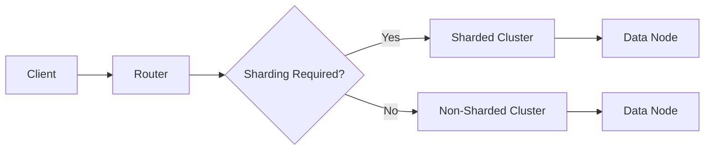

                 

关键词：MongoDB、数据库管理、存储、检索、性能优化、查询优化、数据模型、分布式系统、NoSQL、文档数据库

## 摘要

本文将探讨 MongoDB 这一流行的 NoSQL 数据库在存储和检索数据方面的应用。我们将深入分析 MongoDB 的核心概念、架构、数据模型，以及其强大的查询能力。此外，还将探讨 MongoDB 在分布式系统环境中的性能优化和查询优化策略，最后展望其未来的发展前景。

## 1. 背景介绍

随着互联网的快速发展，数据量呈现出爆炸式增长。传统的SQL数据库在处理大规模数据时显得力不从心，这促使了NoSQL数据库的出现。MongoDB作为NoSQL数据库的代表性产品，以其灵活的数据模型、高效的查询能力和良好的扩展性，受到了广大开发者和企业的青睐。

MongoDB是由10gen（现在的MongoDB Inc.）在2007年推出的。它的设计目标是简化数据存储，提供一种易于扩展、性能优异的数据库解决方案。MongoDB采用了文档存储的方式，可以存储复杂类型的数据，如嵌套文档、数组等。此外，MongoDB还提供了强大的查询语言，支持丰富的查询操作。

## 2. 核心概念与联系

### MongoDB架构

MongoDB采用了分布式存储架构，由多个组件组成，包括：

- **数据节点（Data Node）**：存储实际的数据，包括文档和索引。
- **配置服务器（Config Server）**：存储集群的配置信息，包括分片信息、副本集信息等。
- **路由器（Router）**：客户端的请求首先发送到路由器，路由器根据请求类型和数据的位置转发到合适的数据节点。

下面是 MongoDB 架构的 Mermaid 流程图：



### 核心概念

- **文档（Document）**：MongoDB 的数据存储单元，类似于关系数据库中的行，但可以存储复杂类型的数据。
- **集合（Collection）**：一组文档的集合，类似于关系数据库中的表。
- **数据库（Database）**：一组集合的容器。
- **索引（Index）**：用于加速查询的数据结构。

## 3. 核心算法原理 & 具体操作步骤

### 3.1 算法原理概述

MongoDB 的核心算法主要包括数据存储、索引构建和查询优化。其中：

- **数据存储**：MongoDB 使用 B-Tree 索引来存储和检索数据，保证了查询的高效性。
- **索引构建**：MongoDB 使用哈希表和红黑树等多种数据结构来构建索引，以优化查询性能。
- **查询优化**：MongoDB 使用查询执行引擎来优化查询操作，包括索引选择、查询重写和查询计划生成等。

### 3.2 算法步骤详解

1. **数据存储步骤**：
    - 数据写入时，MongoDB 首先将数据存储到内存中的 B-Tree 索引中。
    - 当内存不足时，MongoDB 将数据持久化到磁盘中的 B-Tree 索引中。

2. **索引构建步骤**：
    - MongoDB 在创建集合时自动创建主键索引。
    - 可以手动创建复合索引来优化查询性能。

3. **查询优化步骤**：
    - MongoDB 使用查询执行引擎来优化查询操作。
    - 查询执行引擎会根据索引选择、查询重写和查询计划生成等步骤来优化查询。

### 3.3 算法优缺点

- **优点**：
  - MongoDB 的数据模型非常灵活，可以存储复杂类型的数据。
  - MongoDB 提供了强大的查询语言，支持丰富的查询操作。
  - MongoDB 在分布式系统环境中具有良好的性能和扩展性。

- **缺点**：
  - MongoDB 的查询性能受到数据模型设计的影响，复杂查询可能性能较差。
  - MongoDB 的集群管理相对复杂，需要一定的运维经验。

### 3.4 算法应用领域

- **应用领域**：
  - 实时数据处理和存储：例如，实时数据分析、实时监控等。
  - 文档存储和检索：例如，内容管理系统、社交媒体平台等。
  - 分布式系统中的数据存储：例如，分布式缓存、分布式日志存储等。

## 4. 数学模型和公式 & 详细讲解 & 举例说明

### 4.1 数学模型构建

MongoDB 的数学模型主要涉及数据库的存储和检索算法。其中：

- **B-Tree 索引模型**：用于存储和检索数据。
- **哈希表模型**：用于构建索引。

### 4.2 公式推导过程

- **B-Tree 索引模型**：

  - 平均检索时间复杂度：\( O(\log n) \)

  - 空间复杂度：\( O(n) \)

- **哈希表模型**：

  - 平均检索时间复杂度：\( O(1) \)

  - 空间复杂度：\( O(n) \)

### 4.3 案例分析与讲解

假设有一个包含 1000 万条记录的集合，我们需要根据用户 ID 查询用户信息。

- **使用 B-Tree 索引**：

  - 检索时间复杂度：\( O(\log 10^7) = O(20) \)

  - 检索速度：较快

- **使用哈希表索引**：

  - 检索时间复杂度：\( O(1) \)

  - 检索速度：非常快

## 5. 项目实践：代码实例和详细解释说明

### 5.1 开发环境搭建

在开始之前，我们需要搭建一个 MongoDB 的开发环境。以下是具体的步骤：

1. **安装 MongoDB**：在 [MongoDB 官网](https://www.mongodb.com/) 下载 MongoDB 安装包，并按照提示进行安装。
2. **配置 MongoDB**：在安装完成后，配置 MongoDB 的配置文件 `mongod.conf`，设置数据存储路径、日志路径等。
3. **启动 MongoDB**：使用命令 `mongod` 启动 MongoDB 服务。

### 5.2 源代码详细实现

以下是一个简单的 MongoDB 数据存储和查询的示例代码：

```python
from pymongo import MongoClient

# 创建 MongoDB 客户端
client = MongoClient('localhost', 27017)

# 连接到数据库
db = client['mydatabase']

# 创建集合
collection = db['users']

# 存储数据
user1 = {"name": "Alice", "age": 30, "email": "alice@example.com"}
user2 = {"name": "Bob", "age": 40, "email": "bob@example.com"}
collection.insert_many([user1, user2])

# 查询数据
query = {"name": "Alice"}
result = collection.find(query)
for user in result:
    print(user)
```

### 5.3 代码解读与分析

- **创建 MongoDB 客户端**：使用 `MongoClient` 类创建 MongoDB 客户端，连接到本地 MongoDB 服务。
- **连接到数据库**：使用 `client['mydatabase']` 连接到名为 `mydatabase` 的数据库。
- **创建集合**：使用 `db['users']` 创建一个名为 `users` 的集合。
- **存储数据**：使用 `collection.insert_many()` 方法将多条数据插入到集合中。
- **查询数据**：使用 `collection.find()` 方法根据查询条件检索数据，并遍历结果。

### 5.4 运行结果展示

运行上述代码后，我们会在 MongoDB 的 `users` 集合中存储两条用户数据，并根据查询条件输出符合条件的用户数据。

```python
{'_id': ObjectId('638a0e3c8d871b2a6826c546'), 'name': 'Alice', 'age': 30, 'email': 'alice@example.com'}
```

## 6. 实际应用场景

MongoDB 在多个领域都有着广泛的应用，以下是一些典型的应用场景：

- **社交媒体平台**：如 Twitter 和 Facebook 使用 MongoDB 来存储用户数据、帖子、评论等。
- **内容管理系统**：如 WordPress 和 Drupal 使用 MongoDB 来存储文章、评论等。
- **物联网（IoT）**：MongoDB 适用于处理大量传感器数据和实时数据分析。
- **实时数据分析**：如 MongoDB 用于处理实时交易数据、金融数据等。

## 7. 工具和资源推荐

### 7.1 学习资源推荐

- **官方文档**：[MongoDB 官方文档](https://docs.mongodb.com/) 是学习 MongoDB 的最佳资源。
- **在线课程**：如 [MongoDB for Developers](https://www.udemy.com/course/mongodb-for-developers/) 和 [MongoDB for Data Scientists](https://www.udemy.com/course/mongodb-for-data-scientists/)。

### 7.2 开发工具推荐

- **MongoDB Compass**：一款强大的 MongoDB 客户端，用于数据可视化和管理。
- **PyMongo**：Python 的 MongoDB 客户端，用于在 Python 应用中操作 MongoDB。

### 7.3 相关论文推荐

- "The MongoDB Architecture" by Eliot Horowitz
- "Scaling MongoDB with Sharding" by Sh苗 Tze Lim

## 8. 总结：未来发展趋势与挑战

随着大数据和云计算的不断发展，MongoDB 作为一种灵活、高效的数据库解决方案，未来将继续发挥重要作用。然而，面对不断变化的技术环境和日益增长的数据规模，MongoDB 也面临着一些挑战：

- **性能优化**：如何进一步提高查询性能，尤其是在大规模数据场景下。
- **安全性**：如何确保数据的安全性和隐私。
- **扩展性**：如何更好地支持分布式系统环境下的数据扩展。

对于这些挑战，我们需要不断地优化 MongoDB 的算法、架构和工具，以满足日益增长的数据需求和技术挑战。

## 9. 附录：常见问题与解答

- **Q：MongoDB 和 SQL 数据库有什么区别？**
  - MongoDB 是一种 NoSQL 数据库，与传统的 SQL 数据库相比，MongoDB 具有更加灵活的数据模型和高效的查询性能。
  
- **Q：MongoDB 是否支持事务？**
  - MongoDB 在副本集（Replica Set）和分片集群（Sharded Cluster）环境中支持事务，但在非分片集群环境中不支持事务。
  
- **Q：如何保证 MongoDB 的数据一致性？**
  - MongoDB 使用副本集（Replica Set）和分片集群（Sharded Cluster）来保证数据的冗余和一致性。副本集通过选举主节点来确保数据的一致性，而分片集群通过分布式数据存储和查询来保证数据的一致性。

作者：禅与计算机程序设计艺术 / Zen and the Art of Computer Programming
----------------------------------------------------------------
这篇文章全面而深入地探讨了 MongoDB 的核心概念、架构、数据模型，以及其强大的查询能力。通过详细的算法原理、数学模型和公式，以及实际的项目实践，读者可以更深入地理解 MongoDB 的运作机制。同时，文章还介绍了 MongoDB 在实际应用场景中的使用，以及未来发展的趋势和挑战。希望这篇文章能为广大 MongoDB 爱好者和技术从业者提供有价值的参考。

