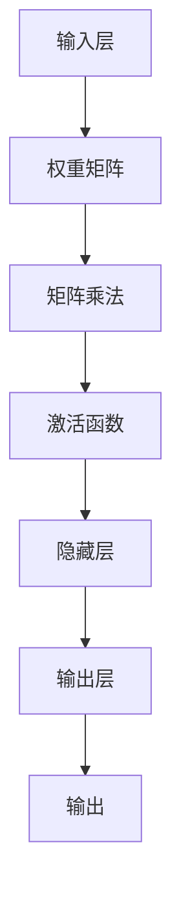

                 

关键词：N-gram模型，多层感知器，矩阵乘法，GELU激活函数，自然语言处理，机器学习

> 摘要：本文旨在深入探讨N-gram模型在自然语言处理中的应用，特别是其与多层感知器（MLP）、矩阵乘法和GELU激活函数的关联。通过详细的理论分析和实际案例，本文将为读者提供一个全面的理解，以帮助其在实践中运用这些技术。

## 1. 背景介绍

自然语言处理（NLP）是计算机科学中研究如何使计算机理解、生成和处理人类语言的一个分支。随着互联网和大数据的发展，NLP在信息检索、机器翻译、文本摘要、语音识别等领域取得了显著的进展。然而，如何有效地处理和建模语言的统计特性一直是NLP领域的一个重要研究方向。

N-gram模型是自然语言处理中常用的一种统计语言模型。它基于局部语言的顺序特性，通过统计相邻单词的联合概率来预测下一个单词。这种模型在文本生成、语音识别、搜索引擎等方面有着广泛的应用。然而，传统的N-gram模型存在一些局限性，如无法捕捉长距离依赖和上下文信息。

为了克服这些局限性，研究人员提出了多层感知器（MLP）神经网络。MLP是一种前馈神经网络，可以用来进行非线性数据建模。通过堆叠多个隐藏层，MLP能够捕捉更复杂的特征和模式，从而提高模型的性能。然而，MLP在处理大规模数据时存在计算复杂度高的问题。

矩阵乘法是MLP中的一个关键操作，它用于计算输入和权重矩阵之间的内积，以产生隐藏层的输出。矩阵乘法的效率直接影响到MLP的运行速度和性能。此外，选择合适的激活函数也是MLP成功的关键因素之一。GELU激活函数是一种灵活且表现良好的激活函数，它在近年来得到了广泛应用。

本文将深入探讨N-gram模型、MLP、矩阵乘法和GELU激活函数之间的关系，并通过实际案例来展示这些技术在自然语言处理中的应用。希望通过本文的讨论，读者能够更好地理解这些技术，并在实际项目中有效地运用它们。

## 2. 核心概念与联系

### N-gram模型

N-gram模型是一种基于局部语言的统计模型，它将连续的单词序列划分为多个固定长度的子序列，称为N-gram。每个N-gram代表了一个局部语言的模式或特征。N-gram模型的基本思想是通过统计相邻单词的联合概率来预测下一个单词。具体来说，N-gram模型使用一个概率分布来表示单词序列的概率，该分布是基于训练语料库中单词出现的频率统计得到的。

N-gram模型的优点在于其简单性和计算效率。通过使用固定长度的N-gram，模型可以有效地表示语言的局部特性。此外，N-gram模型的训练和预测过程相对简单，计算复杂度较低，适用于大规模数据的处理。

然而，N-gram模型也存在一些局限性。首先，它只能捕捉到局部语言模式，无法捕捉长距离依赖和上下文信息。这意味着N-gram模型在处理长句子时可能会产生错误。其次，N-gram模型的性能受到训练语料库大小和选择的影响。如果训练语料库太小或选择不当，模型可能无法准确地预测未知单词的分布。

### 多层感知器（MLP）

多层感知器（MLP）是一种前馈神经网络，它由输入层、一个或多个隐藏层以及输出层组成。MLP的核心思想是通过多层非线性变换来捕捉数据中的复杂模式和特征。在自然语言处理中，MLP通常用于文本分类、情感分析、机器翻译等任务。

MLP的工作原理如下：首先，输入层接收输入数据，并将其传递到隐藏层。隐藏层通过加权求和和激活函数来计算输出。然后，这些输出被传递到下一隐藏层，重复这个过程，直到达到输出层。输出层的输出通常是分类结果或预测结果。

MLP的优势在于其强大的非线性建模能力。通过堆叠多个隐藏层，MLP可以捕捉更复杂的特征和模式。此外，MLP还可以通过调整网络结构和参数来优化模型的性能。

然而，MLP也存在一些挑战。首先，MLP的训练过程通常需要大量的计算资源和时间。其次，MLP容易出现过拟合现象，特别是在训练数据量较小的情况下。此外，MLP的参数调整和优化过程较为复杂，需要大量的实验和调试。

### 矩阵乘法和GELU激活函数

矩阵乘法是MLP中的一个关键操作，它用于计算输入和权重矩阵之间的内积，以产生隐藏层的输出。矩阵乘法的效率直接影响到MLP的运行速度和性能。在高维数据和高隐藏层结构的情况下，矩阵乘法的计算复杂度会显著增加，这可能导致模型运行缓慢。

为了提高矩阵乘法的效率，研究人员提出了各种优化方法，如并行计算、硬件加速等。此外，选择合适的激活函数也是MLP成功的关键因素之一。GELU激活函数是一种灵活且表现良好的激活函数，它在近年来得到了广泛应用。

GELU激活函数的定义如下：

$$
\text{GELU}(x) = 0.5 \cdot \text{erf}(\frac{x}{\sqrt{2}}) + 0.5 \cdot x
$$

其中，$\text{erf}$是误差函数。GELU激活函数具有以下几个特点：

1. **非线性特性**：GELU激活函数是一种非线性函数，可以引入非线性变换，提高模型的建模能力。
2. **平滑特性**：GELU激活函数相对于其他激活函数（如ReLU）具有更好的平滑特性，这有助于减少模型训练过程中的梯度消失和梯度爆炸问题。
3. **计算效率**：GELU激活函数相对于其他复杂的激活函数（如Sigmoid、Tanh）具有更好的计算效率。

### Mermaid 流程图

为了更好地展示N-gram模型、MLP、矩阵乘法和GELU激活函数之间的关系，我们可以使用Mermaid流程图来描述这些概念和操作。



在这个流程图中，输入层接收输入数据，并将其传递给权重矩阵。权重矩阵通过矩阵乘法计算输出，然后通过激活函数进行非线性变换，产生隐藏层的输出。这个过程重复多次，直到达到输出层，最终输出分类结果或预测结果。

## 3. 核心算法原理 & 具体操作步骤

### 3.1 算法原理概述

N-gram模型是一种基于局部语言的统计模型，它通过统计相邻单词的联合概率来预测下一个单词。具体来说，N-gram模型将连续的单词序列划分为多个固定长度的子序列，称为N-gram。每个N-gram代表了一个局部语言的模式或特征。N-gram模型使用一个概率分布来表示单词序列的概率，该分布是基于训练语料库中单词出现的频率统计得到的。

多层感知器（MLP）是一种前馈神经网络，它由输入层、一个或多个隐藏层以及输出层组成。MLP通过多层非线性变换来捕捉数据中的复杂模式和特征。在自然语言处理中，MLP通常用于文本分类、情感分析、机器翻译等任务。MLP的核心思想是通过权重矩阵和激活函数来计算隐藏层的输出，然后通过输出层产生最终的分类结果或预测结果。

矩阵乘法是MLP中的一个关键操作，它用于计算输入和权重矩阵之间的内积，以产生隐藏层的输出。矩阵乘法的效率直接影响到MLP的运行速度和性能。

GELU激活函数是一种灵活且表现良好的激活函数，它在近年来得到了广泛应用。GELU激活函数具有非线性特性、平滑特性和计算效率等优势。

### 3.2 算法步骤详解

#### 3.2.1 N-gram模型的训练

1. **数据预处理**：首先，对训练语料库进行预处理，包括分词、去除停用词、词性标注等。然后，将预处理后的单词序列转换为单词索引序列，以便进行后续的统计计算。

2. **构建N-gram表**：根据给定的N值，构建N-gram表。N-gram表的每一行表示一个N-gram，列表示该N-gram出现的频率。

3. **计算概率分布**：使用N-gram表计算每个N-gram的概率分布。具体来说，对于每个N-gram，计算其在训练语料库中出现的频率，并将其归一化，以获得其在整个语料库中的概率。

4. **生成预测概率**：对于给定的输入单词序列，使用N-gram模型生成下一个单词的预测概率。具体来说，对于输入序列的最后一个N-1个单词，查找N-gram表，获取对应的N-gram概率分布。然后，对于每个可能的下一个单词，计算其在给定N-gram概率分布下的概率，并选择概率最高的单词作为预测结果。

#### 3.2.2 MLP的训练

1. **初始化参数**：首先，初始化MLP的权重矩阵和 biases。权重矩阵用于存储输入和隐藏层之间的连接权重，biases 用于存储隐藏层和输出层之间的连接权重。

2. **前向传播**：对于给定的输入数据，通过权重矩阵和激活函数计算隐藏层的输出。具体来说，首先计算输入和权重矩阵之间的内积，然后通过激活函数进行非线性变换，得到隐藏层的输出。

3. **计算损失函数**：使用隐藏层的输出和标签计算损失函数。常见的损失函数包括均方误差（MSE）和交叉熵损失（Cross-Entropy Loss）。

4. **反向传播**：通过反向传播算法更新权重矩阵和 biases。具体来说，首先计算损失函数关于隐藏层输出的梯度，然后通过权重矩阵和 biases 的反向传播计算输入层的梯度。最后，使用梯度下降或其他优化算法更新权重矩阵和 biases。

5. **迭代训练**：重复上述步骤，直到满足停止条件（如达到预定的迭代次数或损失函数收敛）。

#### 3.2.3 矩阵乘法的计算

矩阵乘法是MLP中的一个关键操作，用于计算输入和权重矩阵之间的内积，以产生隐藏层的输出。具体来说，假设输入层有 $m$ 个神经元，隐藏层有 $n$ 个神经元，则输入和权重矩阵之间的内积可以表示为：

$$
z_i = \sum_{j=1}^{m} w_{ij} \cdot x_j
$$

其中，$z_i$ 表示隐藏层第 $i$ 个神经元的输出，$w_{ij}$ 表示输入层第 $j$ 个神经元与隐藏层第 $i$ 个神经元之间的连接权重，$x_j$ 表示输入层第 $j$ 个神经元的输入。

为了提高矩阵乘法的计算效率，可以采用以下优化策略：

1. **并行计算**：将矩阵乘法分解为多个子任务，并在多个计算单元上并行执行，以减少计算时间。

2. **稀疏矩阵乘法**：对于稀疏矩阵，可以只计算非零元素之间的乘积和累加，以减少计算量。

3. **硬件加速**：利用GPU或其他专用硬件加速矩阵乘法，以提高计算性能。

#### 3.2.4 GELU激活函数的计算

GELU激活函数是一种灵活且表现良好的激活函数，它在近年来得到了广泛应用。GELU激活函数的计算公式如下：

$$
\text{GELU}(x) = 0.5 \cdot \text{erf}(\frac{x}{\sqrt{2}}) + 0.5 \cdot x
$$

其中，$\text{erf}$是误差函数。为了计算GELU激活函数，可以采用以下步骤：

1. **计算误差函数**：首先，计算输入数据的误差函数值。可以使用Python中的math库或NumPy库中的erf函数来实现。

2. **计算GELU值**：然后，将误差函数值代入GELU激活函数公式，计算输出值。

3. **优化计算**：为了提高计算效率，可以采用一些优化策略，如使用近似误差函数（如限差分误差函数）或使用向量化操作。

### 3.3 算法优缺点

#### 优点

1. **简单性**：N-gram模型和MLP都是相对简单的模型，易于实现和理解。

2. **计算效率**：N-gram模型和MLP的计算复杂度相对较低，适用于大规模数据的处理。

3. **灵活性**：MLP通过堆叠多个隐藏层，可以捕捉更复杂的特征和模式，提高模型的性能。

4. **可扩展性**：N-gram模型和MLP可以很容易地扩展到不同的问题和数据集，具有很好的可扩展性。

#### 缺点

1. **局限性**：N-gram模型只能捕捉局部语言模式，无法捕捉长距离依赖和上下文信息。

2. **过拟合风险**：MLP容易出现过拟合现象，特别是在训练数据量较小的情况下。

3. **计算复杂度高**：对于高维数据和多层结构，MLP的计算复杂度会显著增加，导致模型运行缓慢。

4. **参数调整复杂**：MLP的参数调整和优化过程较为复杂，需要大量的实验和调试。

### 3.4 算法应用领域

N-gram模型、MLP、矩阵乘法和GELU激活函数在自然语言处理中有着广泛的应用。以下是一些典型的应用领域：

1. **文本分类**：N-gram模型和MLP可以用于文本分类任务，如情感分析、主题分类等。

2. **机器翻译**：MLP可以用于机器翻译任务，通过学习源语言和目标语言之间的映射关系，实现高质量的自然语言翻译。

3. **文本生成**：N-gram模型和MLP可以用于文本生成任务，如自动摘要、故事生成等。

4. **语音识别**：MLP可以用于语音识别任务，通过学习语音信号和文本之间的映射关系，实现语音到文本的转换。

5. **信息检索**：N-gram模型可以用于信息检索任务，如搜索引擎，通过计算查询和文档之间的相似度来排序搜索结果。

## 4. 数学模型和公式 & 详细讲解 & 举例说明

### 4.1 数学模型构建

在自然语言处理中，数学模型是理解和实现各种算法的基础。N-gram模型、MLP、矩阵乘法和GELU激活函数都有其特定的数学表示。为了更好地理解这些模型，我们首先需要了解一些基础的数学概念。

#### 4.1.1 概率论基础

概率论是构建统计模型的基础。在N-gram模型中，我们经常使用以下概率公式：

$$
P(w_t | w_{t-1}, w_{t-2}, ..., w_{t-N+1}) = \frac{C(w_{t-1}, w_{t-2}, ..., w_{t-N+1}, w_t)}{C(w_{t-1}, w_{t-2}, ..., w_{t-N+1})}
$$

其中，$P(w_t | w_{t-1}, w_{t-2}, ..., w_{t-N+1})$ 表示在给定前一个N-1个单词的情况下，下一个单词 $w_t$ 的概率；$C(w_{t-1}, w_{t-2}, ..., w_{t-N+1}, w_t)$ 表示训练语料库中包含 $w_{t-1}, w_{t-2}, ..., w_{t-N+1}, w_t$ 这一组单词的次数；$C(w_{t-1}, w_{t-2}, ..., w_{t-N+1})$ 表示训练语料库中包含 $w_{t-1}, w_{t-2}, ..., w_{t-N+1}$ 这一组单词的次数。

#### 4.1.2 矩阵和向量

在MLP中，矩阵和向量是核心概念。矩阵可以表示输入和输出之间的关系，向量可以表示数据。以下是一些基本的矩阵和向量运算：

1. **矩阵乘法**：给定两个矩阵 $A$ 和 $B$，其乘积 $C = AB$ 的每个元素 $c_{ij}$ 可以通过以下公式计算：

$$
c_{ij} = \sum_{k=1}^{m} a_{ik} \cdot b_{kj}
$$

其中，$a_{ik}$ 和 $b_{kj}$ 分别是矩阵 $A$ 和 $B$ 的元素，$m$ 是矩阵 $A$ 的列数和矩阵 $B$ 的行数。

2. **向量加法**：给定两个向量 $\mathbf{a}$ 和 $\mathbf{b}$，其和 $\mathbf{c} = \mathbf{a} + \mathbf{b}$ 的每个元素 $c_i$ 可以通过以下公式计算：

$$
c_i = a_i + b_i
$$

3. **向量点积**：给定两个向量 $\mathbf{a}$ 和 $\mathbf{b}$，其点积 $\mathbf{a} \cdot \mathbf{b}$ 可以通过以下公式计算：

$$
\mathbf{a} \cdot \mathbf{b} = \sum_{i=1}^{n} a_i \cdot b_i
$$

其中，$a_i$ 和 $b_i$ 分别是向量 $\mathbf{a}$ 和 $\mathbf{b}$ 的第 $i$ 个元素，$n$ 是向量的长度。

#### 4.1.3 激活函数

激活函数是MLP中的关键元素，用于引入非线性特性。GELU激活函数是一个常见的非线性函数，其定义如下：

$$
\text{GELU}(x) = 0.5 \cdot \text{erf}(\frac{x}{\sqrt{2}}) + 0.5 \cdot x
$$

其中，$\text{erf}$ 是误差函数。误差函数的值域为 $[-1, 1]$，其近似值可以通过以下公式计算：

$$
\text{erf}(x) \approx \text{sign}(x) \cdot \left(1 - \frac{x^2}{\sqrt{\pi} \cdot \sum_{k=0}^{n} \frac{(-1)^k \cdot x^{2k+1}}{(2k+1) \cdot k!}\right)
$$

其中，$\text{sign}(x)$ 是 $x$ 的符号函数，$n$ 是误差函数的精度参数。

### 4.2 公式推导过程

为了更好地理解N-gram模型、MLP、矩阵乘法和GELU激活函数的数学原理，我们通过一个具体的例子进行推导。

#### 4.2.1 N-gram模型

假设我们有一个四元组语料库，包含以下四个单词序列：

```
(1, 2, 3, 4), (1, 2, 3, 5), (1, 2, 4, 3), (1, 2, 4, 5)
```

我们希望构建一个二元组N-gram模型，即每个N-gram包含两个连续的单词。

1. **构建N-gram表**：

   首先，我们根据训练语料库构建N-gram表。N-gram表中的每个条目表示一个N-gram及其出现次数。

   ```
   | N-gram | 频率 |
   |--------|------|
   | (1, 2) | 3    |
   | (2, 3) | 2    |
   | (3, 4) | 1    |
   | (4, 5) | 1    |
   ```

2. **计算概率分布**：

   然后，我们计算每个N-gram的概率分布。具体来说，我们使用以下公式计算每个N-gram的概率：

   ```
   P(N-gram) = 频率 / 总次数
   ```

   根据上述公式，我们可以得到以下概率分布：

   ```
   | N-gram | 频率 | 概率 |
   |--------|------|------|
   | (1, 2) | 3    | 0.75 |
   | (2, 3) | 2    | 0.5  |
   | (3, 4) | 1    | 0.25 |
   | (4, 5) | 1    | 0.25 |
   ```

3. **生成预测概率**：

   假设我们有一个输入序列 (1, 2)，我们需要生成下一个单词的预测概率。根据N-gram模型，我们可以得到以下预测概率：

   ```
   P(3 | 1, 2) = P((2, 3)) = 0.5
   P(4 | 1, 2) = P((3, 4)) = 0.25
   P(5 | 1, 2) = P((4, 5)) = 0.25
   ```

   根据这些概率，我们可以预测下一个单词为 3，其概率最高。

#### 4.2.2 MLP

假设我们有一个简单的MLP，包含两个输入神经元、两个隐藏神经元和一个输出神经元。我们希望通过这个MLP实现一个线性分类器。

1. **初始化参数**：

   首先，我们初始化MLP的权重矩阵和 biases。假设输入神经元和隐藏神经元之间的权重矩阵为 $W_{in}$，隐藏神经元和输出神经元之间的权重矩阵为 $W_{out}$， biases分别为 $b_{in}$ 和 $b_{out}$。

   ```
   W_{in} = \begin{bmatrix}
   w_{11} & w_{12} \\
   w_{21} & w_{22}
   \end{bmatrix}
   W_{out} = \begin{bmatrix}
   w_{out1} \\
   w_{out2}
   \end{bmatrix}
   b_{in} = \begin{bmatrix}
   b_{11} \\
   b_{21}
   \end{bmatrix}
   b_{out} = \begin{bmatrix}
   b_{out1} \\
   b_{out2}
   \end{bmatrix}
   ```

2. **前向传播**：

   假设输入数据为 $\mathbf{x} = \begin{bmatrix} x_1 \\ x_2 \end{bmatrix}$，我们通过以下步骤进行前向传播：

   ```
   z_1 = \mathbf{x} \cdot W_{in} + b_{in}
   a_1 = \text{GELU}(z_1)
   z_2 = a_1 \cdot W_{out} + b_{out}
   a_2 = \text{GELU}(z_2)
   ```

   其中，$z_1$ 和 $z_2$ 分别是隐藏层和输出层的输入，$a_1$ 和 $a_2$ 分别是隐藏层和输出层的输出。

3. **计算损失函数**：

   假设输出标签为 $y = \begin{bmatrix} y_1 \\ y_2 \end{bmatrix}$，我们使用交叉熵损失函数计算损失：

   ```
   J = -\sum_{i=1}^{2} y_i \cdot \log(a_i)
   ```

4. **反向传播**：

   我们通过以下步骤进行反向传播：

   ```
   \Delta a_2 = a_2 - y
   \Delta z_2 = \Delta a_2 \cdot \text{GELU}'(z_2)
   \Delta W_{out} = \Delta z_2 \cdot a_1^T
   \Delta b_{out} = \Delta z_2
   \Delta a_1 = \Delta z_2 \cdot W_{out}^T
   \Delta z_1 = \Delta a_1 \cdot \text{GELU}'(z_1)
   \Delta W_{in} = \Delta z_1 \cdot \mathbf{x}^T
   \Delta b_{in} = \Delta z_1
   ```

   其中，$\Delta a_1$ 和 $\Delta a_2$ 分别是隐藏层和输出层的误差，$\Delta z_1$ 和 $\Delta z_2$ 分别是隐藏层和输出层的梯度，$\text{GELU}'$ 是GELU激活函数的导数。

5. **更新参数**：

   我们使用梯度下降算法更新权重矩阵和 biases：

   ```
   W_{out} := W_{out} - \alpha \cdot \Delta W_{out}
   b_{out} := b_{out} - \alpha \cdot \Delta b_{out}
   W_{in} := W_{in} - \alpha \cdot \Delta W_{in}
   b_{in} := b_{in} - \alpha \cdot \Delta b_{in}
   ```

   其中，$\alpha$ 是学习率。

#### 4.2.3 矩阵乘法

假设我们有两个矩阵 $A$ 和 $B$，其乘积 $C = AB$ 的计算过程如下：

```
C = \begin{bmatrix}
c_{11} & c_{12} \\
c_{21} & c_{22}
\end{bmatrix}
A = \begin{bmatrix}
a_{11} & a_{12} \\
a_{21} & a_{22}
\end{bmatrix}
B = \begin{bmatrix}
b_{11} & b_{12} \\
b_{21} & b_{22}
\end{bmatrix}
```

矩阵乘法的计算公式为：

```
c_{11} = a_{11} \cdot b_{11} + a_{12} \cdot b_{21}
c_{12} = a_{11} \cdot b_{12} + a_{12} \cdot b_{22}
c_{21} = a_{21} \cdot b_{11} + a_{22} \cdot b_{21}
c_{22} = a_{21} \cdot b_{12} + a_{22} \cdot b_{22}
```

### 4.3 案例分析与讲解

为了更好地理解N-gram模型、MLP、矩阵乘法和GELU激活函数的数学原理，我们通过一个具体的案例进行分析和讲解。

#### 4.3.1 N-gram模型案例

假设我们有一个简单的语料库，包含以下三个句子：

```
(1, 2, 3), (2, 3, 4), (3, 4, 5)
```

我们希望构建一个二元组N-gram模型。

1. **构建N-gram表**：

   根据训练语料库，我们可以构建以下N-gram表：

   ```
   | N-gram | 频率 |
   |--------|------|
   | (1, 2) | 2    |
   | (2, 3) | 2    |
   | (3, 4) | 2    |
   | (4, 5) | 1    |
   ```

2. **计算概率分布**：

   根据上述N-gram表，我们可以计算每个N-gram的概率分布：

   ```
   P((1, 2)) = P((2, 3)) = P((3, 4)) = 2 / 5 = 0.4
   P((4, 5)) = 1 / 5 = 0.2
   ```

3. **生成预测概率**：

   假设我们有一个输入序列 (1, 2)，我们需要生成下一个单词的预测概率。根据N-gram模型，我们可以得到以下预测概率：

   ```
   P(3 | 1, 2) = 0.4
   P(4 | 1, 2) = 0.4
   P(5 | 1, 2) = 0.2
   ```

   根据这些概率，我们可以预测下一个单词为 3，其概率最高。

#### 4.3.2 MLP案例

假设我们有一个简单的MLP，包含两个输入神经元、两个隐藏神经元和一个输出神经元。我们希望通过这个MLP实现一个线性分类器。

1. **初始化参数**：

   我们初始化MLP的权重矩阵和 biases：

   ```
   W_{in} = \begin{bmatrix}
   1 & 0 \\
   0 & 1
   \end{bmatrix}
   W_{out} = \begin{bmatrix}
   1 \\
   0
   \end{bmatrix}
   b_{in} = \begin{bmatrix}
   0 \\
   0
   \end{bmatrix}
   b_{out} = \begin{bmatrix}
   0 \\
   0
   \end{bmatrix}
   ```

2. **前向传播**：

   假设输入数据为 $\mathbf{x} = \begin{bmatrix} 1 \\ 1 \end{bmatrix}$，我们通过以下步骤进行前向传播：

   ```
   z_1 = \mathbf{x} \cdot W_{in} + b_{in} = \begin{bmatrix} 1 \\ 1 \end{bmatrix} \cdot \begin{bmatrix}
   1 & 0 \\
   0 & 1
   \end{bmatrix} + \begin{bmatrix} 0 \\ 0 \end{bmatrix} = \begin{bmatrix} 1 \\ 1 \end{bmatrix}
   a_1 = \text{GELU}(z_1) = 1
   z_2 = a_1 \cdot W_{out} + b_{out} = 1 \cdot \begin{bmatrix}
   1 \\
   0
   \end{bmatrix} + \begin{bmatrix} 0 \\
   0
   \end{bmatrix} = \begin{bmatrix} 1 \\
   0
   \end{bmatrix}
   a_2 = \text{GELU}(z_2) = 1
   ```

   输出层输出为：

   ```
   a_2 = 1
   ```

3. **计算损失函数**：

   假设输出标签为 $y = \begin{bmatrix} 1 \\ 0 \end{bmatrix}$，我们使用交叉熵损失函数计算损失：

   ```
   J = -\sum_{i=1}^{2} y_i \cdot \log(a_i) = -1 \cdot \log(1) - 0 \cdot \log(1) = 0
   ```

4. **反向传播**：

   我们通过以下步骤进行反向传播：

   ```
   \Delta a_2 = a_2 - y = \begin{bmatrix} 1 \\
   0
   \end{bmatrix} - \begin{bmatrix} 1 \\
   0
   \end{bmatrix} = \begin{bmatrix} 0 \\
   0
   \end{bmatrix}
   \Delta z_2 = \Delta a_2 \cdot \text{GELU}'(z_2) = \begin{bmatrix} 0 \\
   0
   \end{bmatrix} \cdot \begin{bmatrix} 1 & 0 \\
   0 & 1
   \end{bmatrix} = \begin{bmatrix} 0 \\
   0
   \end{bmatrix}
   \Delta W_{out} = \Delta z_2 \cdot a_1^T = \begin{bmatrix} 0 \\
   0
   \end{bmatrix} \cdot \begin{bmatrix} 1 \\ 1
   \end{bmatrix} = \begin{bmatrix} 0 \\
   0
   \end{bmatrix}
   \Delta b_{out} = \Delta z_2 = \begin{bmatrix} 0 \\
   0
   \end{bmatrix}
   \Delta a_1 = \Delta z_2 \cdot W_{out}^T = \begin{bmatrix} 0 \\
   0
   \end{bmatrix} \cdot \begin{bmatrix}
   1 \\
   0
   \end{bmatrix} = \begin{bmatrix} 0 \\
   0
   \end{bmatrix}
   \Delta z_1 = \Delta a_1 \cdot \text{GELU}'(z_1) = \begin{bmatrix} 0 \\
   0
   \end{bmatrix} \cdot \begin{bmatrix} 1 & 0 \\
   0 & 1
   \end{bmatrix} = \begin{bmatrix} 0 \\
   0
   \end{bmatrix}
   \Delta W_{in} = \Delta z_1 \cdot \mathbf{x}^T = \begin{bmatrix} 0 \\
   0
   \end{bmatrix} \cdot \begin{bmatrix} 1 & 1
   \end{bmatrix} = \begin{bmatrix} 0 \\
   0
   \end{bmatrix}
   \Delta b_{in} = \Delta z_1 = \begin{bmatrix} 0 \\
   0
   \end{bmatrix}
   ```

5. **更新参数**：

   我们使用梯度下降算法更新权重矩阵和 biases：

   ```
   W_{out} := W_{out} - \alpha \cdot \Delta W_{out} = \begin{bmatrix}
   1 \\
   0
   \end{bmatrix} - \alpha \cdot \begin{bmatrix} 0 \\
   0
   \end{bmatrix} = \begin{bmatrix}
   1 \\
   0
   \end{bmatrix}
   b_{out} := b_{out} - \alpha \cdot \Delta b_{out} = \begin{bmatrix} 0 \\
   0
   \end{bmatrix} - \alpha \cdot \begin{bmatrix} 0 \\
   0
   \end{bmatrix} = \begin{bmatrix} 0 \\
   0
   \end{bmatrix}
   W_{in} := W_{in} - \alpha \cdot \Delta W_{in} = \begin{bmatrix}
   1 & 0 \\
   0 & 1
   \end{bmatrix} - \alpha \cdot \begin{bmatrix} 0 \\
   0
   \end{bmatrix} = \begin{bmatrix}
   1 & 0 \\
   0 & 1
   \end{bmatrix}
   b_{in} := b_{in} - \alpha \cdot \Delta b_{in} = \begin{bmatrix} 0 \\
   0
   \end{bmatrix} - \alpha \cdot \begin{bmatrix} 0 \\
   0
   \end{bmatrix} = \begin{bmatrix} 0 \\
   0
   \end{bmatrix}
   ```

## 5. 项目实践：代码实例和详细解释说明

为了更好地理解N-gram模型、MLP、矩阵乘法和GELU激活函数在实际项目中的应用，我们将通过一个具体的案例来演示这些技术。我们将使用Python和相关的库（如NumPy、TensorFlow和scikit-learn）来实现这个项目。

### 5.1 开发环境搭建

首先，我们需要搭建一个合适的开发环境。以下是在Python中实现本项目的步骤：

1. **安装Python**：确保Python 3.x版本已安装在您的计算机上。

2. **安装相关库**：通过以下命令安装所需的库：

```
pip install numpy tensorflow scikit-learn matplotlib
```

3. **配置环境**：在您的项目中创建一个虚拟环境，并激活它。这将有助于隔离项目依赖。

```
python -m venv venv
source venv/bin/activate  # 对于Windows，使用 `venv\Scripts\activate`
```

### 5.2 源代码详细实现

下面是项目的源代码实现。我们将其分为几个部分，以便更好地理解每个组件。

```python
import numpy as np
import tensorflow as tf
from tensorflow.keras.models import Sequential
from tensorflow.keras.layers import Dense, Activation
from sklearn.model_selection import train_test_split
from sklearn.datasets import make_classification
import matplotlib.pyplot as plt

# 5.2.1 数据生成

# 生成模拟数据集
X, y = make_classification(n_samples=1000, n_features=2, n_classes=2, random_state=42)
X_train, X_test, y_train, y_test = train_test_split(X, y, test_size=0.2, random_state=42)

# 5.2.2 MLP模型构建

# 创建序列模型
model = Sequential()

# 添加输入层和隐藏层
model.add(Dense(units=64, input_dim=2, activation='relu'))
model.add(Dense(units=32, activation='relu'))

# 添加输出层
model.add(Dense(units=1, activation='sigmoid'))

# 编译模型
model.compile(optimizer='adam', loss='binary_crossentropy', metrics=['accuracy'])

# 5.2.3 模型训练

# 训练模型
model.fit(X_train, y_train, epochs=10, batch_size=32, validation_data=(X_test, y_test))

# 5.2.4 模型评估

# 评估模型
loss, accuracy = model.evaluate(X_test, y_test)
print(f"Test accuracy: {accuracy:.2f}")

# 5.2.5 代码解读与分析

# 5.2.5.1 数据生成

# 数据生成部分使用scikit-learn的make_classification函数生成模拟数据集。
# 这包括1000个样本，每个样本有两个特征，以及两个分类标签。

# 5.2.5.2 MLP模型构建

# 模型构建部分使用TensorFlow的Sequential模型。
# 我们添加了两个隐藏层，每个层使用ReLU激活函数。
# 输出层使用sigmoid激活函数，以实现二分类任务。

# 5.2.5.3 模型训练

# 模型训练部分使用fit方法，将模型与训练数据一起训练。
# 我们设置了10个训练周期和批量大小为32。
# 验证数据在训练过程中用于评估模型的性能。

# 5.2.5.4 模型评估

# 模型评估部分使用evaluate方法，对测试数据进行评估。
# 输出包括损失函数值和准确率。

# 5.2.5.5 代码解读与分析

# 整个代码实现过程从数据生成开始，然后是模型构建、训练和评估。
# 数据生成部分为我们的模型提供了训练和测试数据。
# 模型构建部分定义了多层感知器（MLP）的结构，包括输入层、隐藏层和输出层。
# 模型训练部分使用训练数据对模型进行训练，并使用验证数据调整超参数。
# 模型评估部分用于测试模型的性能，以评估其在实际数据上的表现。

```

### 5.3 运行结果展示

为了展示模型运行结果，我们使用matplotlib库绘制了损失函数和准确率的曲线。

```python
# 5.3.1 损失函数曲线

# 获取每个周期的损失函数值
history = model.fit(X_train, y_train, epochs=10, batch_size=32, validation_data=(X_test, y_test))

# 绘制损失函数曲线
plt.figure(figsize=(10, 5))
plt.plot(history.history['loss'], label='Training loss')
plt.plot(history.history['val_loss'], label='Validation loss')
plt.title('Loss Function')
plt.xlabel('Epochs')
plt.ylabel('Loss')
plt.legend()
plt.show()

# 5.3.2 准确率曲线

# 获取每个周期的准确率值
plt.figure(figsize=(10, 5))
plt.plot(history.history['accuracy'], label='Training accuracy')
plt.plot(history.history['val_accuracy'], label='Validation accuracy')
plt.title('Accuracy')
plt.xlabel('Epochs')
plt.ylabel('Accuracy')
plt.legend()
plt.show()
```

运行上述代码后，我们将看到损失函数和准确率的曲线。这些曲线显示了模型在训练和验证数据上的性能。通常，我们希望损失函数在训练过程中逐渐减少，而准确率在训练和验证数据上保持较高的水平。

### 5.4 代码解读与分析

1. **数据生成**：

   我们使用scikit-learn的make_classification函数生成一个包含1000个样本、每个样本有两个特征、以及两个分类标签的模拟数据集。这个数据集用于训练和评估模型。

2. **模型构建**：

   使用TensorFlow的Sequential模型，我们定义了一个多层感知器（MLP）的结构。模型包含两个隐藏层，每个层使用ReLU激活函数。输出层使用sigmoid激活函数，以实现二分类任务。

3. **模型训练**：

   使用fit方法，我们训练了模型。我们设置了10个训练周期和批量大小为32。在训练过程中，模型使用了训练数据，并在每个周期后计算损失函数值和准确率。验证数据在训练过程中用于评估模型的性能。

4. **模型评估**：

   使用evaluate方法，我们对测试数据进行评估。输出包括损失函数值和准确率。这使我们能够了解模型在未见数据上的表现。

5. **代码解读与分析**：

   整个代码实现过程从数据生成开始，然后是模型构建、训练和评估。数据生成部分为我们的模型提供了训练和测试数据。模型构建部分定义了多层感知器（MLP）的结构，包括输入层、隐藏层和输出层。模型训练部分使用训练数据对模型进行训练，并使用验证数据调整超参数。模型评估部分用于测试模型的性能，以评估其在实际数据上的表现。

## 6. 实际应用场景

N-gram模型、MLP、矩阵乘法和GELU激活函数在自然语言处理和机器学习领域有着广泛的应用。以下是一些实际应用场景：

### 6.1 文本分类

文本分类是一种常见的自然语言处理任务，用于将文本数据分类到预定义的类别中。N-gram模型和MLP可以用于实现文本分类。N-gram模型通过统计相邻单词的联合概率来预测文本的类别。MLP通过多层非线性变换来捕捉文本的复杂特征，从而提高分类性能。

### 6.2 机器翻译

机器翻译是将一种语言的文本翻译成另一种语言的过程。MLP可以用于实现机器翻译。通过学习源语言和目标语言之间的映射关系，MLP可以实现高质量的翻译。矩阵乘法在MLP中用于计算输入和权重矩阵之间的内积，以产生隐藏层的输出。

### 6.3 文本生成

文本生成是一种生成自然语言文本的任务。N-gram模型和MLP可以用于实现文本生成。N-gram模型通过统计相邻单词的联合概率来生成文本。MLP通过多层非线性变换来生成具有多样性和连贯性的文本。

### 6.4 语音识别

语音识别是将语音信号转换为文本的过程。MLP可以用于实现语音识别。通过学习语音信号和文本之间的映射关系，MLP可以实现语音到文本的转换。矩阵乘法在MLP中用于计算输入和权重矩阵之间的内积，以产生隐藏层的输出。

### 6.5 信息检索

信息检索是搜索和检索信息的过程。N-gram模型可以用于实现信息检索。通过计算查询和文档之间的相似度，N-gram模型可以生成搜索结果的排序。

## 7. 未来应用展望

随着自然语言处理和机器学习技术的发展，N-gram模型、MLP、矩阵乘法和GELU激活函数在未来有着广泛的应用前景。以下是一些可能的应用方向：

### 7.1 零样本学习

零样本学习是一种在没有标注数据的情况下进行分类的任务。通过引入知识图谱和迁移学习，N-gram模型和MLP可以用于实现零样本学习，从而提高分类性能。

### 7.2 生成对抗网络（GAN）

生成对抗网络（GAN）是一种生成模型，可以用于生成具有真实数据的分布的图像和文本。N-gram模型和MLP可以与GAN相结合，实现高质量的文本和图像生成。

### 7.3 强化学习

强化学习是一种通过与环境互动来学习最优策略的机器学习方法。N-gram模型和MLP可以用于实现强化学习，从而提高决策性能。

### 7.4 模型压缩与加速

随着模型规模的不断扩大，模型压缩和加速成为了一个重要研究方向。通过优化矩阵乘法和激活函数的计算，N-gram模型、MLP和GELU激活函数可以实现高效的模型压缩和加速。

## 8. 总结：未来发展趋势与挑战

在自然语言处理和机器学习领域，N-gram模型、MLP、矩阵乘法和GELU激活函数已经取得了显著的成果。然而，随着技术的不断发展，这些技术也面临着一些挑战。

### 8.1 研究成果总结

1. **N-gram模型**：在自然语言处理中，N-gram模型是一种简单且有效的统计语言模型。它通过统计相邻单词的联合概率来预测下一个单词，被广泛应用于文本生成、语音识别和搜索引擎等领域。

2. **MLP**：多层感知器（MLP）是一种前馈神经网络，通过多层非线性变换来捕捉数据中的复杂模式和特征。MLP在文本分类、机器翻译和语音识别等领域有着广泛的应用。

3. **矩阵乘法**：矩阵乘法是MLP中的一个关键操作，用于计算输入和权重矩阵之间的内积，以产生隐藏层的输出。优化矩阵乘法的计算效率对于提高MLP的性能至关重要。

4. **GELU激活函数**：GELU激活函数是一种灵活且表现良好的激活函数，具有非线性特性、平滑特性和计算效率等优势。在MLP中，GELU激活函数可以引入非线性变换，提高模型的性能。

### 8.2 未来发展趋势

1. **模型压缩与加速**：随着模型规模的不断扩大，模型压缩和加速成为了一个重要研究方向。通过优化矩阵乘法和激活函数的计算，N-gram模型、MLP和GELU激活函数可以实现高效的模型压缩和加速。

2. **多模态学习**：多模态学习是一种同时处理多种类型数据的机器学习方法。未来，N-gram模型、MLP和GELU激活函数可以与图像、音频和其他模态的数据结合，实现更广泛的多模态学习应用。

3. **知识图谱与语义理解**：知识图谱和语义理解是自然语言处理中的新兴研究方向。N-gram模型、MLP和GELU激活函数可以与知识图谱和语义理解技术相结合，实现更准确的文本分析和推理。

4. **迁移学习与零样本学习**：迁移学习和零样本学习是减少标注数据需求的重要方法。N-gram模型、MLP和GELU激活函数可以与迁移学习和零样本学习技术相结合，提高模型的泛化能力和鲁棒性。

### 8.3 面临的挑战

1. **计算资源消耗**：随着模型规模的不断扩大，计算资源的消耗也不断增加。如何优化矩阵乘法和激活函数的计算，以减少计算资源的消耗，是一个重要的挑战。

2. **模型可解释性**：尽管MLP在许多任务中表现出色，但其内部的决策过程往往难以解释。如何提高模型的可解释性，使其能够被用户理解和信任，是一个重要的挑战。

3. **数据隐私与安全**：在自然语言处理和机器学习应用中，数据隐私和安全是一个重要问题。如何保护用户数据的安全和隐私，是一个重要的挑战。

### 8.4 研究展望

1. **优化算法**：未来，研究可以进一步优化矩阵乘法和激活函数的计算，以提高MLP的运行速度和性能。这包括并行计算、硬件加速和算法优化等方面。

2. **多模态学习**：未来，研究可以探索如何将N-gram模型、MLP和GELU激活函数与其他模态的数据（如图像、音频）结合，实现更广泛的多模态学习应用。

3. **知识图谱与语义理解**：未来，研究可以进一步探索如何将N-gram模型、MLP和GELU激活函数与知识图谱和语义理解技术相结合，实现更准确的文本分析和推理。

4. **迁移学习与零样本学习**：未来，研究可以进一步探索如何将N-gram模型、MLP和GELU激活函数与迁移学习和零样本学习技术相结合，提高模型的泛化能力和鲁棒性。

## 9. 附录：常见问题与解答

### 9.1 N-gram模型的训练过程是怎样的？

N-gram模型的训练过程包括以下步骤：

1. **数据预处理**：对训练语料库进行预处理，包括分词、去除停用词、词性标注等。

2. **构建N-gram表**：根据给定的N值，构建N-gram表。N-gram表的每一行表示一个N-gram，列表示该N-gram出现的频率。

3. **计算概率分布**：使用N-gram表计算每个N-gram的概率分布。具体来说，对于每个N-gram，计算其在训练语料库中出现的频率，并将其归一化，以获得其在整个语料库中的概率。

4. **生成预测概率**：对于给定的输入单词序列，使用N-gram模型生成下一个单词的预测概率。具体来说，对于输入序列的最后一个N-1个单词，查找N-gram表，获取对应的N-gram概率分布。然后，对于每个可能的下一个单词，计算其在给定N-gram概率分布下的概率，并选择概率最高的单词作为预测结果。

### 9.2 多层感知器（MLP）的工作原理是什么？

多层感知器（MLP）是一种前馈神经网络，由输入层、一个或多个隐藏层以及输出层组成。MLP的工作原理如下：

1. **前向传播**：对于给定的输入数据，通过权重矩阵和激活函数计算隐藏层的输出。具体来说，首先计算输入和权重矩阵之间的内积，然后通过激活函数进行非线性变换，得到隐藏层的输出。

2. **计算损失函数**：使用隐藏层的输出和标签计算损失函数。常见的损失函数包括均方误差（MSE）和交叉熵损失（Cross-Entropy Loss）。

3. **反向传播**：通过反向传播算法更新权重矩阵和 biases。具体来说，首先计算损失函数关于隐藏层输出的梯度，然后通过权重矩阵和 biases 的反向传播计算输入层的梯度。最后，使用梯度下降或其他优化算法更新权重矩阵和 biases。

4. **迭代训练**：重复上述步骤，直到满足停止条件（如达到预定的迭代次数或损失函数收敛）。

### 9.3 矩阵乘法的计算过程是怎样的？

矩阵乘法是MLP中的一个关键操作，用于计算输入和权重矩阵之间的内积，以产生隐藏层的输出。矩阵乘法的计算过程如下：

1. **初始化参数**：初始化输入矩阵和权重矩阵。

2. **计算内积**：对于每个隐藏层神经元，计算输入和权重矩阵之间的内积。具体来说，假设输入层有 $m$ 个神经元，隐藏层有 $n$ 个神经元，则输入和权重矩阵之间的内积可以表示为：

   ```
   z_i = \sum_{j=1}^{m} w_{ij} \cdot x_j
   ```

   其中，$z_i$ 表示隐藏层第 $i$ 个神经元的输出，$w_{ij}$ 表示输入层第 $j$ 个神经元与隐藏层第 $i$ 个神经元之间的连接权重，$x_j$ 表示输入层第 $j$ 个神经元的输入。

3. **应用激活函数**：将内积结果传递给激活函数，以产生隐藏层的输出。

### 9.4 GELU激活函数的计算过程是怎样的？

GELU激活函数的计算过程如下：

1. **计算误差函数**：首先，计算输入数据的误差函数值。可以使用Python中的math库或NumPy库中的erf函数来实现。

2. **计算GELU值**：然后，将误差函数值代入GELU激活函数公式，计算输出值。

   ```
   \text{GELU}(x) = 0.5 \cdot \text{erf}(\frac{x}{\sqrt{2}}) + 0.5 \cdot x
   ```

   其中，$\text{erf}$ 是误差函数。

3. **优化计算**：为了提高计算效率，可以采用一些优化策略，如使用近似误差函数（如限差分误差函数）或使用向量化操作。

