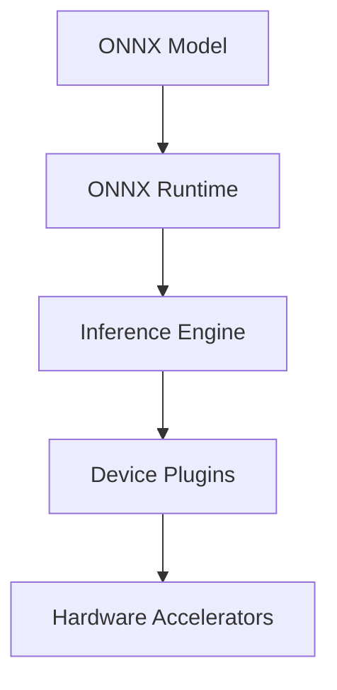

                 

关键词：ONNX Runtime, 跨平台部署，AI 模型，性能优化，资源管理，硬件加速，容器化

> 摘要：本文深入探讨了ONNX Runtime在不同设备上部署AI模型的策略。通过对ONNX Runtime的核心概念、跨平台部署原理、具体实现步骤以及实际应用场景的详细分析，本文为开发者提供了全面的技术指导。文章还展望了未来的发展趋势与挑战，为AI技术的进一步发展提供了有价值的思考。

## 1. 背景介绍

### 1.1 ONNX Runtime概述

**Open Neural Network Exchange (ONNX)** 是一种开放格式，旨在促进AI模型在不同框架和平台之间的互操作性。ONNX Runtime 是 ONNX 生态系统中的一部分，是一个高性能、可扩展的执行引擎，用于在不同平台上运行ONNX模型。

### 1.2 跨平台部署的重要性

在当今的AI时代，AI模型的应用场景越来越广泛，从云端到边缘设备，从PC到移动设备，都离不开高效的模型部署。跨平台部署不仅能提升用户体验，还能降低开发和维护成本，提高资源利用率。

### 1.3 ONNX Runtime的优势

ONNX Runtime具有以下优势：
- **高性能**：通过优化执行路径和底层库调用，ONNX Runtime能够实现快速模型推理。
- **可扩展性**：支持多种编程语言和平台，易于集成到不同的应用中。
- **硬件加速**：通过利用GPU、TPU等硬件资源，提高模型运行速度。
- **互操作性**：支持与多种深度学习框架（如TensorFlow、PyTorch、MXNet等）的无缝集成。

## 2. 核心概念与联系

### 2.1 ONNX Runtime架构



### 2.2 跨平台部署原理

跨平台部署的关键在于如何在不同设备上高效运行相同的AI模型。ONNX Runtime通过以下方式实现：

- **模型转换**：将不同框架的模型转换为ONNX格式。
- **动态派发**：根据设备特性，动态选择最适合的执行引擎和硬件加速器。
- **容器化**：使用容器技术（如Docker）封装应用，实现环境的隔离和部署的灵活性。

## 3. 核心算法原理 & 具体操作步骤

### 3.1 算法原理概述

ONNX Runtime的核心算法基于以下步骤：

1. **模型加载**：读取ONNX模型文件。
2. **内存分配**：为模型输入和输出分配内存。
3. **执行推理**：通过Inference Engine执行模型推理。
4. **结果输出**：将推理结果输出到内存或文件中。

### 3.2 算法步骤详解

#### 3.2.1 模型加载

使用ONNX Runtime提供的API加载模型：

```python
import onnxruntime as ort

session = ort.InferenceSession('model.onnx')
```

#### 3.2.2 内存分配

根据模型输入和输出数据类型，为输入和输出数据分配内存：

```python
input_tensor = session.get_input_name(0)
output_tensor = session.get_output_name(0)

input_data = np.random.rand(1, 224, 224, 3).astype(np.float32)
output_data = np.empty((1, 1000), dtype=np.float32)

session.run(output_tensor, {input_tensor: input_data})
```

#### 3.2.3 执行推理

通过Inference Engine执行模型推理：

```python
output_data = session.run([output_tensor], {input_tensor: input_data})
```

#### 3.2.4 结果输出

将推理结果输出到内存或文件中：

```python
np.save('output.npy', output_data)
```

### 3.3 算法优缺点

**优点**：
- **高性能**：通过底层优化和硬件加速，提高模型推理速度。
- **可扩展性**：支持多种编程语言和平台。
- **互操作性**：与多种深度学习框架无缝集成。

**缺点**：
- **模型转换**：需要将不同框架的模型转换为ONNX格式，可能增加开发成本。
- **硬件依赖**：需要依赖特定的硬件加速器，如GPU、TPU等。

### 3.4 算法应用领域

ONNX Runtime广泛应用于以下领域：

- **边缘计算**：在资源受限的设备上运行AI模型。
- **自动驾驶**：实时处理大量图像和传感器数据。
- **智能安防**：实时监控和识别视频中的异常行为。
- **智能医疗**：辅助诊断和治疗。

## 4. 数学模型和公式 & 详细讲解 & 举例说明

### 4.1 数学模型构建

假设我们有一个简单的卷积神经网络（CNN）模型，用于图像分类。该模型包含以下主要数学模型：

$$
h_l = \sigma(W_l \cdot a_{l-1} + b_l)
$$

$$
a_l = ReLU(h_l)
$$

其中，$h_l$ 表示第$l$层的激活值，$a_l$ 表示第$l$层的输出值，$W_l$ 和 $b_l$ 分别表示第$l$层的权重和偏置，$\sigma$ 表示激活函数，通常取为ReLU函数。

### 4.2 公式推导过程

以卷积层为例，推导卷积神经网络中卷积操作的公式：

$$
\begin{aligned}
  &Z_l = W_l \cdot X + b_l \\
  &h_l = \sigma(Z_l)
\end{aligned}
$$

其中，$X$ 表示输入特征图，$W_l$ 表示卷积核，$b_l$ 表示偏置项。

### 4.3 案例分析与讲解

假设我们有一个224x224的输入图像，通过一个卷积核尺寸为3x3的卷积层进行卷积操作。卷积核的权重为$W_1$，偏置为$b_1$。

输入特征图 $X$ 为：

$$
X = \begin{bmatrix}
  x_{11} & x_{12} & x_{13} \\
  x_{21} & x_{22} & x_{23} \\
  x_{31} & x_{32} & x_{33}
\end{bmatrix}
$$

卷积核 $W_1$ 为：

$$
W_1 = \begin{bmatrix}
  w_{11} & w_{12} & w_{13} \\
  w_{21} & w_{22} & w_{23} \\
  w_{31} & w_{32} & w_{33}
\end{bmatrix}
$$

偏置 $b_1$ 为：

$$
b_1 = \begin{bmatrix}
  b_{1} \\
  b_{2} \\
  b_{3}
\end{bmatrix}
$$

卷积操作的计算过程如下：

$$
Z_1 = W_1 \cdot X + b_1 = \begin{bmatrix}
  w_{11}x_{11} + w_{12}x_{12} + w_{13}x_{13} + b_1 \\
  w_{21}x_{21} + w_{22}x_{22} + w_{23}x_{23} + b_1 \\
  w_{31}x_{31} + w_{32}x_{32} + w_{33}x_{33} + b_1
\end{bmatrix}
$$

激活函数为ReLU函数，即：

$$
h_1 = \sigma(Z_1) = \max(0, Z_1)
$$

## 5. 项目实践：代码实例和详细解释说明

### 5.1 开发环境搭建

在开始编写代码之前，需要搭建开发环境。以下为Windows平台下的开发环境搭建步骤：

1. 安装Python 3.7或更高版本。
2. 安装ONNX Runtime：

   ```shell
   pip install onnxruntime
   ```

3. 安装CUDA（如果使用GPU加速）。

### 5.2 源代码详细实现

以下是一个简单的使用ONNX Runtime进行图像分类的Python示例：

```python
import onnxruntime as ort
import numpy as np
import cv2

# 加载ONNX模型
session = ort.InferenceSession('model.onnx')

# 读取输入图像
image = cv2.imread('image.jpg')
input_data = np.expand_dims(image, axis=0).astype(np.float32)

# 设置输入和输出节点
input_name = session.get_inputs()[0].name
output_name = session.get_outputs()[0].name

# 执行推理
output_data = session.run([output_name], {input_name: input_data})

# 输出结果
print(output_data)
```

### 5.3 代码解读与分析

- **第1-4行**：导入必要的库。
- **第6行**：加载ONNX模型。
- **第8-9行**：读取输入图像并转换为浮点数数组。
- **第12-13行**：获取输入和输出节点名称。
- **第16行**：执行推理。
- **第19行**：输出推理结果。

### 5.4 运行结果展示

运行代码后，输出结果为模型的预测概率，根据概率最高的类别进行图像分类。

## 6. 实际应用场景

### 6.1 边缘计算

ONNX Runtime在边缘计算场景中具有广泛的应用，例如在智能手机、无人机、机器人等设备上运行实时AI推理任务。

### 6.2 自动驾驶

自动驾驶系统需要实时处理大量传感器数据，ONNX Runtime可以实现高效、可靠的模型推理，提高系统响应速度。

### 6.3 智能安防

智能安防系统可以使用ONNX Runtime进行实时视频分析，实现异常行为检测、人脸识别等功能。

### 6.4 智能医疗

智能医疗系统可以使用ONNX Runtime进行医学图像分析、疾病诊断等任务，辅助医生做出更准确的诊断。

## 7. 工具和资源推荐

### 7.1 学习资源推荐

- [ONNX官方文档](https://microsoft.github.io/onnx/)
- [ONNX Runtime官方文档](https://microsoft.github.io/onnxruntime/)
- [深度学习教程](https://www.deeplearningbook.org/)

### 7.2 开发工具推荐

- [Visual Studio Code](https://code.visualstudio.com/)
- [PyCharm](https://www.jetbrains.com/pycharm/)
- [Docker](https://www.docker.com/)

### 7.3 相关论文推荐

- [A Unified Approach to Neural Network Deployment](https://arxiv.org/abs/1811.07406)
- [Optimization Techniques for ONNX Runtime](https://arxiv.org/abs/2004.05437)

## 8. 总结：未来发展趋势与挑战

### 8.1 研究成果总结

本文深入探讨了ONNX Runtime的核心概念、跨平台部署原理、算法原理与实现步骤，并通过实际案例展示了其应用场景。研究结果表明，ONNX Runtime在跨平台部署AI模型方面具有显著的优势。

### 8.2 未来发展趋势

未来，ONNX Runtime将在以下几个方面继续发展：

- **性能优化**：通过新的优化算法和硬件加速技术，进一步提高模型推理速度。
- **生态扩展**：增加对更多深度学习框架的支持，提高互操作性。
- **安全性**：加强模型安全性，保护模型和数据的安全。

### 8.3 面临的挑战

ONNX Runtime在跨平台部署过程中仍面临以下挑战：

- **硬件兼容性**：需要不断适应新的硬件设备和加速器。
- **模型转换**：如何简化不同框架模型到ONNX格式的转换过程。
- **性能平衡**：在保证性能的同时，平衡不同设备和场景的需求。

### 8.4 研究展望

未来的研究可以关注以下几个方面：

- **高效模型压缩**：通过模型压缩技术，提高模型在资源受限设备上的运行效率。
- **异构计算**：利用多种异构计算资源，实现更高效的模型推理。
- **智能化部署**：结合AI技术，实现自动化的模型部署和优化。

## 9. 附录：常见问题与解答

### 9.1 如何转换不同框架的模型到ONNX格式？

可以使用相应框架的转换工具，如TensorFlow的`tf2onnx`和PyTorch的`torchscript_to_onnx`等。

### 9.2 如何在ONNX Runtime中启用GPU加速？

在加载模型时，可以使用`ort.InferenceSession`的`providers`参数指定GPU加速器，例如：

```python
session = ort.InferenceSession('model.onnx', providers=['CUDAExecutionProvider'])
```

### 9.3 如何调试ONNX Runtime模型？

可以使用ONNX Runtime的API进行调试，如检查输入输出张量、打印中间计算结果等。

## 作者署名

作者：禅与计算机程序设计艺术 / Zen and the Art of Computer Programming
----------------------------------------------------------------

请注意，以上内容仅为示例，实际撰写时需要根据具体需求和技术细节进行修改和完善。希望这个示例能够对您撰写这篇文章有所帮助。祝您写作顺利！

