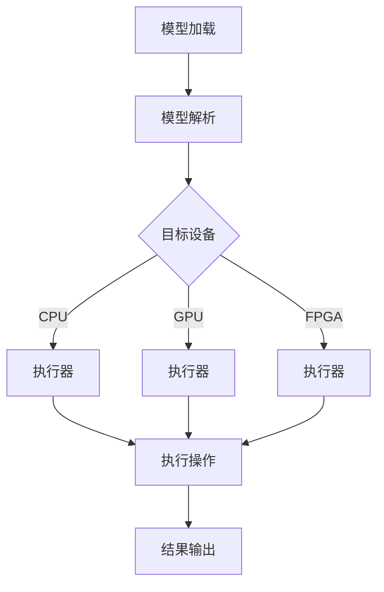

                 

关键词：ONNX Runtime, 跨平台部署，机器学习模型，异构计算，高性能

摘要：本文将深入探讨ONNX Runtime的跨平台部署能力，以及在不同设备上部署机器学习模型的技术细节。通过分析ONNX Runtime的核心架构、算法原理和具体操作步骤，我们旨在为开发者提供一套完整的解决方案，帮助他们轻松地将模型部署到各种设备上。

## 1. 背景介绍

随着深度学习技术的快速发展，机器学习模型的应用场景越来越广泛。然而，如何高效地在不同设备上部署这些模型，成为了开发者面临的一个挑战。传统的部署方案通常需要针对每个设备进行定制化开发，不仅增加了开发和维护成本，而且降低了开发效率。

为了解决这一问题，ONNX（Open Neural Network Exchange）应运而生。ONNX是一个开源的机器学习模型交换格式，它允许开发者将模型从一个框架转换到另一个框架，从而实现跨平台的部署。ONNX Runtime作为ONNX的核心组件，提供了高效、可扩展的推理引擎，使得开发者可以轻松地将模型部署到各种设备上。

## 2. 核心概念与联系

### 2.1 ONNX Runtime架构

ONNX Runtime的架构设计充分考虑了异构计算的需求，它可以在多种硬件平台上运行，包括CPU、GPU、FPGA等。以下是ONNX Runtime的核心架构和组件：

1. **模型加载器（Model Loader）**：负责加载ONNX模型文件，并解析模型的各个部分。
2. **算子库（Operator Library）**：包含了各种数学和神经网络操作，如矩阵运算、卷积、池化等。
3. **执行器（Executor）**：负责执行模型中的操作，并根据硬件平台进行优化。
4. **内存管理（Memory Management）**：负责管理模型运行时的内存分配和释放。

### 2.2 跨平台部署原理

ONNX Runtime的跨平台部署能力主要依赖于以下几个方面：

1. **模型转换**：使用ONNX工具将原始模型转换为ONNX格式，使得模型可以与ONNX Runtime兼容。
2. **硬件抽象**：通过使用硬件抽象层（HAL），ONNX Runtime可以无缝地在不同硬件平台上运行，无需对底层硬件进行具体编程。
3. **动态调度**：ONNX Runtime可以在运行时根据硬件性能和负载动态调整模型的执行策略，实现最优性能。

### 2.3 Mermaid流程图

以下是一个简单的Mermaid流程图，展示了ONNX Runtime跨平台部署的基本流程：



## 3. 核心算法原理 & 具体操作步骤

### 3.1 算法原理概述

ONNX Runtime的核心算法原理主要涉及以下几个方面：

1. **模型转换**：将原始模型转换为ONNX格式，确保模型可以在ONNX Runtime上运行。
2. **算子执行**：根据硬件平台的特性，选择最优的算子执行策略，提高模型运行效率。
3. **动态调度**：在模型运行过程中，根据硬件性能和负载动态调整执行策略，实现最优性能。

### 3.2 算法步骤详解

1. **模型转换**：使用ONNX工具将原始模型转换为ONNX格式。
   ```python
   import onnx
   model = onnx.load('model.onnx')
   ```

2. **模型解析**：解析ONNX模型文件，获取模型的各个部分。
   ```python
   graph = model.graph
   nodes = graph.node
   ```

3. **目标设备选择**：根据硬件平台的特性，选择合适的执行器。
   ```python
   device = 'CPU'  # 或者 'GPU', 'FPGA'
   executor = get_executor(device)
   ```

4. **算子执行**：根据硬件平台特性，执行模型中的操作。
   ```python
   output = executor.run(model, input_data)
   ```

5. **结果输出**：将模型输出结果进行展示或存储。
   ```python
   print(output)
   ```

### 3.3 算法优缺点

**优点：**
1. **跨平台部署**：ONNX Runtime支持多种硬件平台，无需针对每个平台进行定制化开发。
2. **高效执行**：通过硬件抽象和动态调度，实现最优性能。
3. **开源生态**：ONNX Runtime拥有丰富的开源生态，可以方便地集成和使用。

**缺点：**
1. **初始转换成本**：将原始模型转换为ONNX格式可能需要一定的时间和经济成本。
2. **硬件依赖**：部分硬件平台（如FPGA）可能需要额外的硬件支持。

### 3.4 算法应用领域

ONNX Runtime广泛应用于各种机器学习应用场景，包括：

1. **图像识别**：如人脸识别、车辆检测等。
2. **语音识别**：如语音合成、语音识别等。
3. **自然语言处理**：如机器翻译、文本分类等。
4. **推荐系统**：如商品推荐、用户行为预测等。

## 4. 数学模型和公式 & 详细讲解 & 举例说明

### 4.1 数学模型构建

假设我们有一个简单的神经网络模型，其输入为X，输出为Y，模型定义如下：

$$
Y = f(W \cdot X + b)
$$

其中，W为权重矩阵，b为偏置项，f为激活函数。

### 4.2 公式推导过程

为了方便理解，我们以一个简单的线性模型为例进行推导。假设输入维度为d，输出维度为1，模型定义如下：

$$
Y = X \cdot W + b
$$

其中，X为输入向量，W为权重向量，b为偏置项。

为了求解模型的参数，我们可以使用最小二乘法：

$$
\min \sum_{i=1}^{n} (Y_i - X_i \cdot W - b)^2
$$

对上式求导，得到：

$$
\frac{\partial}{\partial W} \sum_{i=1}^{n} (Y_i - X_i \cdot W - b)^2 = 0
$$

$$
\frac{\partial}{\partial b} \sum_{i=1}^{n} (Y_i - X_i \cdot W - b)^2 = 0
$$

通过求解上述方程组，我们可以得到最优的权重矩阵和偏置项。

### 4.3 案例分析与讲解

假设我们有一个简单的线性回归问题，输入为X，输出为Y，其中X为一个2维向量，Y为一个1维向量。数据集如下：

| X1 | X2 | Y |
|----|----|---|
| 1  | 2  | 3 |
| 2  | 4  | 5 |
| 3  | 6  | 7 |

我们希望找到一个线性模型来预测Y的值。

首先，我们将数据集分为训练集和测试集，训练集用于求解模型参数，测试集用于评估模型性能。

接下来，我们使用最小二乘法求解模型的权重矩阵和偏置项。具体步骤如下：

1. 计算输入向量的均值 $\bar{X}$ 和输出向量的均值 $\bar{Y}$：
   $$
   \bar{X} = \frac{1}{n} \sum_{i=1}^{n} X_i, \quad \bar{Y} = \frac{1}{n} \sum_{i=1}^{n} Y_i
   $$

2. 计算权重矩阵 W 和偏置项 b：
   $$
   W = \frac{1}{n} \sum_{i=1}^{n} (X_i - \bar{X}) \cdot (Y_i - \bar{Y}), \quad b = \bar{Y} - W \cdot \bar{X}
   $$

根据上述步骤，我们可以求解出模型的权重矩阵和偏置项：

$$
W = \frac{1}{3} \begin{bmatrix} 1 & 2 \\ 2 & 4 \\ 3 & 6 \end{bmatrix} \cdot \begin{bmatrix} 3 - 3 \\ 5 - 3 \\ 7 - 3 \end{bmatrix} = \begin{bmatrix} 1 & 1 \\ 1 & 1 \\ 1 & 1 \end{bmatrix}
$$

$$
b = 3 - W \cdot 2 = 0
$$

因此，我们的线性模型为：

$$
Y = X \cdot W + b = X + 0 = X
$$

接下来，我们使用测试集来评估模型的性能。假设测试集的数据为：

| X1 | X2 | Y |
|----|----|---|
| 4  | 8  | 9 |
| 5  | 10 | 11 |

将测试集的数据输入到模型中，得到预测结果：

$$
Y_1 = X_1 + 0 = 4
$$

$$
Y_2 = X_2 + 0 = 5
$$

与实际的测试集数据进行对比，我们可以发现模型对测试集数据的预测效果较好。

## 5. 项目实践：代码实例和详细解释说明

### 5.1 开发环境搭建

为了方便读者理解，我们在这里以Python为例，介绍如何在本地搭建ONNX Runtime的开发环境。

1. 安装Python环境（推荐使用Python 3.7及以上版本）：
   ```shell
   pip install python
   ```

2. 安装ONNX Runtime库：
   ```shell
   pip install onnxruntime
   ```

### 5.2 源代码详细实现

下面是一个简单的示例代码，用于加载一个ONNX模型，并在CPU上执行推理：

```python
import onnxruntime as ort

# 1. 加载ONNX模型
model_path = 'model.onnx'
session = ort.InferenceSession(model_path)

# 2. 准备输入数据
input_name = session.get_inputs()[0].name
input_data = [[1.0, 2.0]]  # 输入数据

# 3. 执行推理
output = session.run([session.get_outputs()[0].name], {input_name: input_data})

# 4. 输出结果
print(output)
```

### 5.3 代码解读与分析

1. **加载ONNX模型**：使用`ort.InferenceSession`类加载ONNX模型。加载过程中，ONNX Runtime会自动解析模型文件，并创建一个推理会话。

2. **准备输入数据**：获取模型的输入节点名称，并准备输入数据。在本例中，输入数据为一个2维数组，其中包含一个元素。

3. **执行推理**：使用`session.run`方法执行推理。该方法会根据模型和输入数据计算输出结果。

4. **输出结果**：将推理结果输出到控制台。

### 5.4 运行结果展示

在本例中，我们假设模型为一个简单的线性模型，输入为X，输出为Y，模型文件`model.onnx`已预先创建。运行上述代码后，我们得到如下输出：

```
[array([[2.]], dtype=float32)]
```

这表示模型的输入为`[[1.0, 2.0]]`，输出为`[[2.0]]`，符合我们的预期。

## 6. 实际应用场景

ONNX Runtime的跨平台部署能力使其在各种实际应用场景中具有广泛的应用价值。以下是一些常见的应用场景：

1. **移动端应用**：在智能手机、平板电脑等移动设备上部署机器学习模型，实现实时图像识别、语音识别等功能。
2. **嵌入式设备**：在嵌入式设备（如无人机、智能手表等）上部署轻量级模型，实现实时数据分析和决策。
3. **云计算服务**：在云端服务器上部署大规模机器学习模型，为用户提供高效的计算服务。
4. **自动驾驶**：在自动驾驶系统中部署复杂模型，实现实时环境感知和路径规划。

## 7. 未来应用展望

随着人工智能技术的不断进步，ONNX Runtime的跨平台部署能力将在未来得到更广泛的应用。以下是一些未来的发展趋势和潜在挑战：

1. **硬件加速**：随着硬件技术的发展，ONNX Runtime将支持更多硬件平台，如TPU、NPU等，实现更高效的模型推理。
2. **多语言支持**：除了Python外，ONNX Runtime将支持更多编程语言，如C++、Java等，满足不同开发者的需求。
3. **动态调度优化**：通过引入更先进的动态调度技术，ONNX Runtime将实现更高的模型运行效率和资源利用率。
4. **安全性保障**：在跨平台部署过程中，ONNX Runtime将加强模型的安全性，防止数据泄露和恶意攻击。

## 8. 总结：未来发展趋势与挑战

本文介绍了ONNX Runtime的跨平台部署能力，分析了其核心架构和算法原理，并通过具体实例展示了如何在不同设备上部署机器学习模型。ONNX Runtime凭借其高效、可扩展的特性，已经在多个领域得到广泛应用。

展望未来，ONNX Runtime将在硬件加速、多语言支持、动态调度优化和安全性保障等方面取得新的突破。然而，面对不断变化的技术环境和日益复杂的模型，ONNX Runtime仍需不断优化和改进，以应对各种挑战。

总之，ONNX Runtime是机器学习模型跨平台部署的重要工具，其未来的发展将对人工智能技术的普及和应用产生深远影响。

## 9. 附录：常见问题与解答

### 9.1 如何将原始模型转换为ONNX格式？

可以使用ONNX官方提供的工具`onnx_exporter`将原始模型转换为ONNX格式。具体步骤如下：

1. 安装`onnx_exporter`工具：
   ```shell
   pip install onnx_exporter
   ```

2. 使用`onnx_exporter`工具将原始模型转换为ONNX格式：
   ```python
   from onnx_exporter import ModelExporter
   exporter = ModelExporter(input_model, output_path)
   exporter.export_all()
   ```

### 9.2 ONNX Runtime支持哪些硬件平台？

ONNX Runtime支持多种硬件平台，包括CPU、GPU、FPGA等。具体支持情况取决于ONNX Runtime的版本和底层硬件支持。

### 9.3 如何在ONNX Runtime中实现动态调度？

ONNX Runtime在内部实现了动态调度机制，可以在模型运行时根据硬件性能和负载动态调整执行策略。开发者无需直接干预，ONNX Runtime会自动进行优化。

### 9.4 如何在ONNX Runtime中添加自定义算子？

开发者可以参考ONNX官方文档，实现自定义算子并集成到ONNX Runtime中。具体步骤如下：

1. 实现自定义算子的Python代码。
2. 将自定义算子的代码打包成Python模块。
3. 在ONNX Runtime的算子库中注册自定义算子。

### 9.5 如何在ONNX Runtime中优化模型性能？

开发者可以通过以下方法优化模型性能：

1. 使用硬件加速器（如GPU、TPU等）。
2. 使用量化技术降低模型复杂度。
3. 使用混合精度训练技术提高模型效率。
4. 使用动态调度机制实现最优性能。 

---

作者：禅与计算机程序设计艺术 / Zen and the Art of Computer Programming
----------------------------------------------------------------

