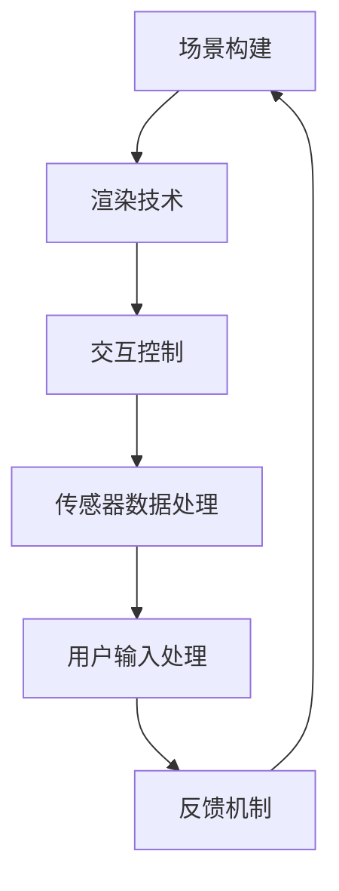
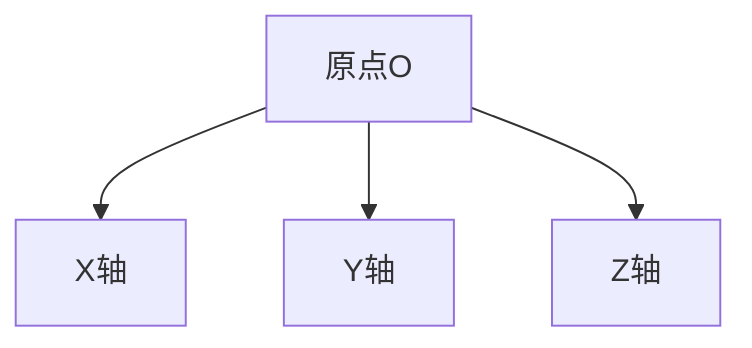

                 

关键词：Oculus Rift SDK，虚拟现实，VR开发，开发平台，VR体验

摘要：本文将深入探讨Oculus Rift SDK的使用，详细介绍如何在Oculus Rift平台上开发高质量的虚拟现实体验。我们将从背景介绍开始，逐步讲解核心概念、算法原理、数学模型、项目实践，并展望未来发展趋势与挑战。

## 1. 背景介绍

虚拟现实（VR）技术近年来发展迅猛，为游戏、教育、医疗等行业带来了全新的应用场景。Oculus Rift作为当前最受欢迎的VR头显之一，拥有广泛的开发者社区和强大的SDK（软件开发工具包），使得开发者能够轻松地创建和部署高质量的VR应用。

Oculus Rift SDK提供了丰富的API和工具，帮助开发者实现从场景构建到交互控制的完整VR开发流程。通过使用Oculus Rift SDK，开发者可以充分利用Rift设备的硬件特性，如高分辨率显示、低延迟传感器、空间音频等，创造出沉浸式的虚拟体验。

本文将围绕Oculus Rift SDK，详细介绍VR开发的基本原理和实战技巧，旨在为开发者提供全面的指导和参考。

## 2. 核心概念与联系

为了更好地理解Oculus Rift SDK的开发流程，我们首先需要了解一些核心概念和它们之间的联系。以下是一个使用Mermaid绘制的流程图：



### 2.1 场景构建

场景构建是VR开发的基础。它涉及到3D模型的加载、场景布局的设计、光线追踪和阴影效果的处理等。Oculus Rift SDK提供了强大的场景构建工具，如Oculus Scene Management API，可以帮助开发者快速搭建复杂的虚拟场景。

### 2.2 渲染技术

渲染技术是VR体验的核心。Oculus Rift SDK支持多种先进的渲染技术，如DirectX和OpenGL，开发者可以使用这些技术实现高质量的图像渲染，创造逼真的虚拟世界。

### 2.3 交互控制

交互控制是用户与虚拟世界互动的关键。Oculus Rift SDK提供了多种交互控制方法，如手部追踪、眼动追踪和语音控制，开发者可以根据应用场景选择合适的交互方式。

### 2.4 传感器数据处理

传感器数据处理是确保VR体验流畅和准确的关键。Oculus Rift SDK集成了多种传感器，如陀螺仪、加速度计和磁力计，开发者可以通过这些传感器获取用户的位置和姿态信息，从而实现精确的交互和运动模拟。

### 2.5 用户输入处理

用户输入处理是将用户的操作转化为虚拟世界的交互动作。Oculus Rift SDK提供了丰富的输入处理API，如触控板、按键和手势识别，开发者可以使用这些API实现复杂的用户交互逻辑。

### 2.6 反馈机制

反馈机制是提升用户沉浸感和体验质量的重要手段。Oculus Rift SDK支持多种反馈机制，如振动反馈、声音效果和视觉特效，开发者可以通过这些机制增强用户的虚拟体验。

## 3. 核心算法原理 & 具体操作步骤

### 3.1 算法原理概述

在VR开发中，核心算法主要包括场景渲染算法、交互控制算法和传感器数据处理算法。以下是对这些算法原理的概述：

### 3.2 算法步骤详解

#### 3.2.1 场景渲染算法

场景渲染算法的核心是三维图形渲染引擎。以下是一般步骤：

1. **场景建模**：使用3D建模工具创建场景模型。
2. **贴图和纹理**：为模型添加贴图和纹理，提升视觉效果。
3. **光照计算**：计算场景中的光照效果，包括环境光、点光源和方向光。
4. **渲染管线**：使用DirectX或OpenGL等渲染管线技术，将场景渲染到屏幕上。

#### 3.2.2 交互控制算法

交互控制算法主要处理用户输入和虚拟世界的交互逻辑。以下是一般步骤：

1. **输入捕获**：捕获用户输入，如手部动作、眼动和语音指令。
2. **输入解析**：将捕获的输入解析为虚拟世界的交互动作。
3. **交互反馈**：根据用户的交互动作，实时更新虚拟场景。

#### 3.2.3 传感器数据处理算法

传感器数据处理算法主要处理传感器的数据，以获取用户的位置和姿态信息。以下是一般步骤：

1. **数据采集**：从传感器获取数据，如陀螺仪、加速度计和磁力计。
2. **数据滤波**：对传感器数据进行滤波处理，消除噪声和抖动。
3. **姿态估计**：根据滤波后的数据，估计用户的位置和姿态。

### 3.3 算法优缺点

#### 3.3.1 场景渲染算法

**优点**：渲染算法能够实现高质量的图像渲染，提升用户体验。

**缺点**：渲染算法计算复杂度高，对硬件性能要求较高。

#### 3.3.2 交互控制算法

**优点**：交互控制算法能够实现丰富的用户交互，增强虚拟体验。

**缺点**：交互控制算法需要处理大量的用户输入，对实时性要求较高。

#### 3.3.3 传感器数据处理算法

**优点**：传感器数据处理算法能够提供精确的用户位置和姿态信息，提升交互准确性。

**缺点**：传感器数据处理算法对传感器数据敏感，容易受到噪声和抖动的影响。

### 3.4 算法应用领域

#### 3.4.1 游戏行业

在游戏行业中，VR渲染算法和交互控制算法被广泛应用于开发虚拟现实游戏，提供沉浸式的游戏体验。

#### 3.4.2 教育行业

在教育行业中，VR场景渲染算法和传感器数据处理算法被应用于开发虚拟现实教学应用，为学生提供互动式的学习体验。

#### 3.4.3 医疗行业

在医疗行业中，VR交互控制算法和传感器数据处理算法被应用于开发虚拟手术模拟和康复训练应用，为医生和患者提供个性化的医疗服务。

## 4. 数学模型和公式 & 详细讲解 & 举例说明

在VR开发中，数学模型和公式是必不可少的工具。以下是一个简单的数学模型和公式讲解示例。

### 4.1 数学模型构建

#### 4.1.1 三维空间坐标系

在VR开发中，我们通常使用三维空间坐标系来表示虚拟世界的位置和姿态。以下是一个三维空间坐标系图：



#### 4.1.2 姿态矩阵

姿态矩阵是表示虚拟世界姿态的数学模型。它是一个四阶方阵，其中包含了虚拟世界在三维空间中的旋转和位置信息。以下是一个姿态矩阵的示例：

$$
\begin{bmatrix}
r_{11} & r_{12} & r_{13} & t_{1} \\
r_{21} & r_{22} & r_{23} & t_{2} \\
r_{31} & r_{32} & r_{33} & t_{3} \\
0 & 0 & 0 & 1
\end{bmatrix}
$$

其中，$r_{ij}$ 表示第 $i$ 行第 $j$ 列的元素，$t_{i}$ 表示第 $i$ 个平移分量。

### 4.2 公式推导过程

#### 4.2.1 旋转矩阵

旋转矩阵是姿态矩阵中的一部分，用于表示虚拟世界的旋转。以下是一个旋转矩阵的推导过程：

1. **初始旋转**：假设虚拟世界初始时位于三维坐标系的 $XZ$ 平面，且绕 $Y$ 轴旋转 $\theta$ 角度。
2. **旋转公式**：根据旋转矩阵的定义，旋转矩阵 $R$ 可以表示为：

$$
R = \begin{bmatrix}
\cos \theta & 0 & \sin \theta \\
0 & 1 & 0 \\
-\sin \theta & 0 & \cos \theta
\end{bmatrix}
$$

### 4.3 案例分析与讲解

#### 4.3.1 案例背景

假设我们正在开发一个虚拟现实游戏，玩家需要在虚拟世界中绕行一个圆形路径。我们的目标是计算玩家在不同位置的姿态矩阵。

#### 4.3.2 案例分析

1. **初始位置**：玩家初始位于原点，面向正 $X$ 轴。
2. **旋转角度**：玩家每走一步，绕 $Z$ 轴旋转 $2\pi/360$ 角度。
3. **姿态矩阵**：玩家在第 $i$ 步时的姿态矩阵为：

$$
\begin{bmatrix}
\cos \left(\frac{2\pi}{360} i\right) & 0 & \sin \left(\frac{2\pi}{360} i\right) & 0 \\
0 & 1 & 0 & 0 \\
-\sin \left(\frac{2\pi}{360} i\right) & 0 & \cos \left(\frac{2\pi}{360} i\right) & 0 \\
0 & 0 & 0 & 1
\end{bmatrix}
$$

#### 4.3.3 案例讲解

通过上述公式，我们可以计算出玩家在任意位置的姿态矩阵，从而实现虚拟世界的绕行效果。

## 5. 项目实践：代码实例和详细解释说明

### 5.1 开发环境搭建

在开始编写VR应用代码之前，我们需要搭建一个合适的开发环境。以下是搭建Oculus Rift SDK开发环境的基本步骤：

1. **安装Oculus Rift SDK**：从Oculus官方网站下载并安装Oculus Rift SDK。
2. **配置Visual Studio**：将Oculus Rift SDK添加到Visual Studio的扩展工具中，并配置相应的项目设置。
3. **安装依赖库**：安装Oculus Rift SDK所需的依赖库，如DirectX和OpenGL。

### 5.2 源代码详细实现

以下是一个简单的Oculus Rift SDK应用示例，展示了如何使用SDK的基本功能来创建一个基本的VR应用：

```cpp
#include <OVR.h>
#include <OVR_D3D.h>

using namespace OVR;

int main() {
    // 初始化Oculus Rift SDK
    RHI::DeviceDesc deviceDesc = RHI::DeviceDesc();
    deviceDesc.Type = RHI::DeviceType::D3D11;
    RHI::Device device = RHI::Device::Create(deviceDesc);

    // 创建渲染器
    RenderManager renderManager(device);
    RenderTarget renderTarget(1920, 1080);

    // 创建场景
    Scene scene;
    scene.LoadScene("scene.ovscene");

    // 渲染循环
    while (true) {
        // 更新场景
        scene.Update();

        // 渲染场景
        renderManager.BeginFrame(renderTarget);
        scene.Render(renderManager);
        renderManager.EndFrame();

        // 输出渲染结果
        renderTarget.Submit();
    }

    return 0;
}
```

### 5.3 代码解读与分析

上述代码首先初始化了Oculus Rift SDK，并创建了渲染器和场景。在渲染循环中，代码不断更新场景并渲染到屏幕上，从而实现VR应用的实时渲染。

### 5.4 运行结果展示

运行上述代码后，我们将看到一个简单的VR场景，场景中的物体将随着我们的头部运动而动态更新，提供沉浸式的视觉体验。

## 6. 实际应用场景

### 6.1 游戏行业

在游戏行业中，Oculus Rift SDK被广泛应用于开发虚拟现实游戏。通过Oculus Rift SDK，开发者可以实现高质量的图像渲染、丰富的交互控制以及沉浸式的游戏体验。例如，《Beat Saber》是一款广受欢迎的VR节奏游戏，它通过Oculus Rift SDK实现了实时渲染和精确的手部追踪，为玩家提供了极具挑战性和乐趣的游戏体验。

### 6.2 教育行业

在教育行业中，Oculus Rift SDK也被广泛应用。通过虚拟现实技术，教育者可以创建互动式的教学场景，使学生能够在虚拟世界中亲身体验知识和技能。例如，《Google Earth VR》是一款基于Oculus Rift SDK开发的虚拟现实应用，它允许用户在虚拟世界中探索地球上的各种景点，提供了一种全新的学习体验。

### 6.3 医疗行业

在医疗行业中，Oculus Rift SDK同样发挥着重要作用。通过虚拟现实技术，医生可以进行虚拟手术模拟、患者教育以及康复训练。例如，《HealVR》是一款基于Oculus Rift SDK开发的虚拟手术模拟应用，它允许医生在虚拟环境中练习手术技巧，提高手术成功率。

## 7. 工具和资源推荐

### 7.1 学习资源推荐

1. **《Oculus Rift SDK 完全指南》**：这是一本全面介绍Oculus Rift SDK的指南，适合初学者和有经验的开发者阅读。
2. **Oculus Rift SDK 官方文档**：Oculus官方网站提供了详细的SDK文档，包括API参考、教程和示例代码，是学习Oculus Rift SDK的绝佳资源。

### 7.2 开发工具推荐

1. **Visual Studio**：Visual Studio是一款强大的集成开发环境，支持Oculus Rift SDK的开发，是开发VR应用的理想选择。
2. **Unity**：Unity是一款流行的游戏开发引擎，它提供了对Oculus Rift SDK的支持，使得开发者可以轻松地创建和部署虚拟现实游戏。

### 7.3 相关论文推荐

1. **“A Survey on Virtual Reality Technology”**：这篇综述文章详细介绍了虚拟现实技术的发展现状、应用场景和未来趋势。
2. **“Virtual Reality Applications in Healthcare”**：这篇论文探讨了虚拟现实技术在医疗行业的应用，包括虚拟手术模拟、患者教育和康复训练等方面。

## 8. 总结：未来发展趋势与挑战

### 8.1 研究成果总结

近年来，虚拟现实技术取得了显著进展。Oculus Rift SDK作为一款优秀的VR开发平台，为开发者提供了丰富的API和工具，使得高质量的VR应用开发变得更加容易。随着硬件技术的不断发展和应用场景的拓展，虚拟现实技术将在更多领域得到应用。

### 8.2 未来发展趋势

1. **硬件性能提升**：随着GPU和传感器技术的不断发展，虚拟现实设备的性能将得到显著提升，为开发者提供更强大的开发工具。
2. **更广泛的行业应用**：虚拟现实技术将在游戏、教育、医疗、建筑、军事等领域得到更广泛的应用，为各行业带来创新和变革。
3. **更丰富的交互方式**：未来的VR应用将支持更多的交互方式，如语音控制、手势识别和脑机接口，为用户提供更加自然的交互体验。

### 8.3 面临的挑战

1. **技术难题**：虚拟现实技术仍面临许多技术挑战，如图像渲染、传感器数据处理和实时交互等。
2. **用户体验**：提升用户体验是虚拟现实技术发展的关键。开发者需要不断优化应用性能，提高用户满意度和沉浸感。
3. **内容生态**：虚拟现实应用的内容生态仍处于发展阶段。开发者需要投入更多精力创作高质量的VR内容，以吸引更多的用户。

### 8.4 研究展望

未来的研究应重点关注以下几个方面：

1. **硬件创新**：探索新型传感器和显示技术，提高虚拟现实设备的性能和用户体验。
2. **算法优化**：研究更高效、更精确的算法，提升虚拟现实应用的质量和性能。
3. **跨领域应用**：推动虚拟现实技术在更多领域的应用，为各行业带来创新和变革。

## 9. 附录：常见问题与解答

### 9.1 如何解决Oculus Rift SDK安装问题？

**解答**：在安装Oculus Rift SDK时，可能会遇到各种问题，如环境配置错误、依赖库缺失等。解决方法如下：

1. **检查环境配置**：确保已经安装了所有必需的环境，如Visual Studio、DirectX和OpenGL。
2. **安装依赖库**：从Oculus官方网站下载并安装所需的依赖库。
3. **参考官方文档**：Oculus Rift SDK的官方文档提供了详细的安装指南和常见问题解答。

### 9.2 如何优化Oculus Rift SDK应用性能？

**解答**：优化Oculus Rift SDK应用性能可以从以下几个方面入手：

1. **优化渲染管线**：减少渲染对象的数量、优化着色器代码、使用纹理压缩技术等。
2. **优化传感器数据处理**：使用滤波算法减少传感器数据的噪声和抖动，提高交互准确性。
3. **合理分配资源**：合理分配CPU和GPU资源，避免资源冲突和瓶颈。

### 9.3 如何创建高质量的VR内容？

**解答**：创建高质量的VR内容需要从以下几个方面入手：

1. **场景设计**：设计具有吸引力和趣味性的场景，提升用户的沉浸感。
2. **图像渲染**：使用高质量的图像渲染技术，如光线追踪和动态阴影，提升视觉效果。
3. **交互设计**：设计自然的交互方式，如手势识别和语音控制，增强用户的参与感。

---

**作者：禅与计算机程序设计艺术 / Zen and the Art of Computer Programming**

