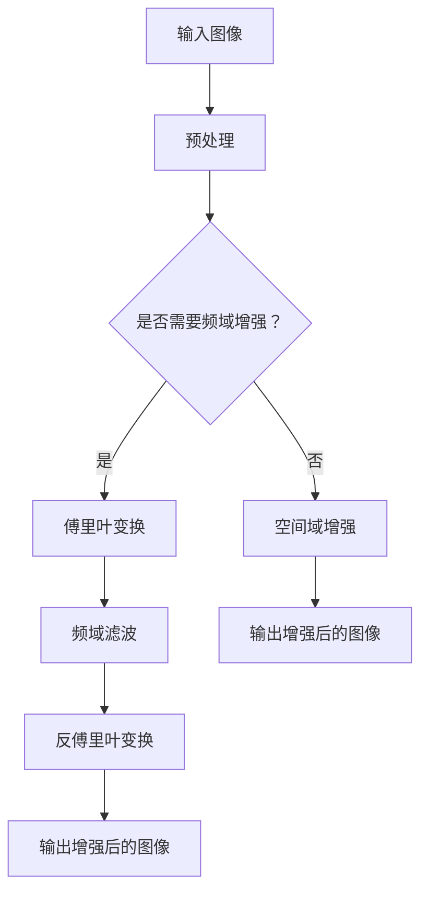

                 

关键词：图像增强，OpenCV，图像质量，视觉效果，算法原理，数学模型，项目实践，实际应用

> 摘要：本文将深入探讨OpenCV中图像增强算法的应用，分析其核心原理、数学模型以及具体操作步骤，并通过实例代码进行详细解释。同时，我们将探讨图像增强算法在实际应用场景中的效果和未来发展趋势。

## 1. 背景介绍

图像增强是计算机视觉领域中的一项重要技术，旨在通过调整图像的亮度、对比度、色彩饱和度等参数，提高图像的视觉效果，使其更易于分析和识别。随着计算机技术和图像处理算法的不断发展，图像增强技术已经广泛应用于医疗影像、自动驾驶、安防监控、人脸识别等多个领域。

OpenCV（Open Source Computer Vision Library）是一个开源的计算机视觉库，提供了丰富的图像处理算法和工具，是研究和开发计算机视觉应用的重要工具。OpenCV中的图像增强算法具有广泛的适用性和强大的功能，能够有效提升图像的质量和视觉效果。

本文将主要介绍OpenCV中的图像增强算法，包括其核心概念、算法原理、数学模型、具体操作步骤以及实际应用场景。通过本文的阅读，读者将能够深入了解图像增强算法的基本原理和应用方法，为后续的开发和研究打下坚实的基础。

## 2. 核心概念与联系

### 2.1. 图像增强的定义

图像增强是指通过对图像进行一系列处理操作，以提高图像的可视效果或分析质量的一种技术。图像增强可以分为空间域增强和频域增强两种类型。

空间域增强直接对图像像素值进行操作，通过调整像素值来增强图像的某些特征。常见的空间域增强方法包括直方图均衡化、直方图规定化、图像平滑和图像锐化等。

频域增强则是通过对图像的频率特性进行操作，来改善图像的质量。常见的频域增强方法包括傅里叶变换、小波变换等。

### 2.2. OpenCV中的图像增强算法

OpenCV提供了丰富的图像增强算法，包括空间域增强和频域增强方法。以下是一些常用的图像增强算法：

1. **直方图均衡化（Histogram Equalization）**：通过调整图像的直方图分布，使图像的像素值分布更加均匀，从而提高图像的对比度和视觉效果。

2. **直方图规定化（Histogram Specification）**：与直方图均衡化类似，但允许用户自定义直方图分布，从而实现更精确的增强效果。

3. **图像平滑（Image Smoothing）**：通过降低图像的噪声，使图像更清晰、更平滑。常用的平滑方法包括均值滤波、高斯滤波和中值滤波等。

4. **图像锐化（Image Sharpening）**：通过增强图像的边缘和细节，使图像更加清晰、鲜明。常用的锐化方法包括拉普拉斯变换和索伯尔变换等。

5. **傅里叶变换（Fourier Transform）**：通过对图像进行傅里叶变换，将图像从空间域转换为频域，然后对频域进行操作，如频域滤波等，来增强图像的质量。

6. **小波变换（Wavelet Transform）**：通过对图像进行小波变换，将图像分解为不同尺度和方向的细节，从而进行有效的图像增强。

### 2.3. 图像增强算法的架构

为了更好地理解图像增强算法，我们可以使用Mermaid流程图来展示其基本架构。以下是图像增强算法的Mermaid流程图：



通过上述流程图，我们可以看到图像增强算法的基本架构，包括输入图像、预处理、频域增强和空间域增强等步骤。不同的增强方法可以相互组合，以实现最佳的效果。

## 3. 核心算法原理 & 具体操作步骤

### 3.1. 算法原理概述

图像增强算法的核心在于对图像的像素值进行操作，从而改善图像的视觉效果。以下是几种常见的图像增强算法及其原理：

#### 3.1.1. 直方图均衡化

直方图均衡化是一种在空间域进行图像增强的方法。其原理是将图像的直方图分布调整为均匀分布，从而提高图像的对比度。

1. **计算图像的直方图**：首先计算图像每个像素值出现的次数，得到原始直方图。

2. **计算累积分布函数（CDF）**：然后计算直方图的累积分布函数，即每个像素值出现的累积次数。

3. **映射像素值**：将原始像素值映射到新的像素值，使其在新的直方图上均匀分布。

4. **输出增强后的图像**：根据新的像素值生成增强后的图像。

#### 3.1.2. 直方图规定化

直方图规定化与直方图均衡化类似，但允许用户自定义直方图分布。其原理是通过调整像素值的映射关系，使图像的直方图分布符合用户指定的分布。

1. **计算用户指定的直方图**：首先计算用户指定的直方图。

2. **计算累积分布函数（CDF）**：然后计算直方图的累积分布函数。

3. **映射像素值**：将原始像素值映射到新的像素值，使其在新的直方图上均匀分布。

4. **输出增强后的图像**：根据新的像素值生成增强后的图像。

#### 3.1.3. 图像平滑

图像平滑的原理是通过降低图像的噪声，使图像更清晰、更平滑。常用的平滑方法包括均值滤波、高斯滤波和中值滤波等。

1. **选择滤波器**：根据需求选择合适的滤波器，如均值滤波器、高斯滤波器等。

2. **滤波操作**：对图像进行滤波操作，降低图像的噪声。

3. **输出平滑后的图像**：根据滤波结果生成平滑后的图像。

#### 3.1.4. 图像锐化

图像锐化的原理是通过增强图像的边缘和细节，使图像更加清晰、鲜明。常用的锐化方法包括拉普拉斯变换和索伯尔变换等。

1. **选择锐化方法**：根据需求选择合适的锐化方法，如拉普拉斯变换、索伯尔变换等。

2. **锐化操作**：对图像进行锐化操作，增强图像的边缘和细节。

3. **输出锐化后的图像**：根据锐化结果生成锐化后的图像。

### 3.2. 算法步骤详解

以下是图像增强算法的具体步骤，包括输入图像预处理、选择增强方法、执行增强操作和输出增强后的图像。

#### 3.2.1. 输入图像预处理

1. **读取图像**：使用OpenCV的`imread()`函数读取图像。

2. **图像转换**：将图像转换为所需的颜色空间，如灰度图像或彩色图像。

3. **图像缩放**：根据需要调整图像的大小。

4. **图像裁剪**：根据需要裁剪图像。

#### 3.2.2. 选择增强方法

1. **用户选择**：根据需求选择图像增强方法，如直方图均衡化、直方图规定化、图像平滑或图像锐化。

2. **算法选择**：根据用户选择，调用相应的OpenCV函数实现增强操作。

#### 3.2.3. 执行增强操作

1. **直方图均衡化**：使用`cv2.equalizeHist()`函数实现直方图均衡化。

2. **直方图规定化**：使用`cv2.createCLAHE()`函数实现直方图规定化。

3. **图像平滑**：使用`cv2.GaussianBlur()`、`cv2.medianBlur()`或`cv2.bilateralFilter()`函数实现图像平滑。

4. **图像锐化**：使用`cv2.Laplacian()`、`cv2.Sobel()`或`cv2.filter2D()`函数实现图像锐化。

#### 3.2.4. 输出增强后的图像

1. **显示增强后的图像**：使用`cv2.imshow()`函数显示增强后的图像。

2. **保存增强后的图像**：使用`cv2.imwrite()`函数保存增强后的图像。

### 3.3. 算法优缺点

以下是几种图像增强算法的优缺点：

#### 3.3.1. 直方图均衡化

**优点**：
- 简单高效，易于实现。
- 能显著提高图像的对比度。

**缺点**：
- 可能会降低图像的动态范围。
- 对于噪声较多的图像效果不佳。

#### 3.3.2. 直方图规定化

**优点**：
- 可以自定义直方图分布，实现更精确的增强效果。
- 对噪声较多的图像效果较好。

**缺点**：
- 实现较复杂，需要用户指定直方图参数。
- 可能会引入过多的图像失真。

#### 3.3.3. 图像平滑

**优点**：
- 可以有效降低图像噪声，使图像更清晰。
- 可以实现图像的模糊效果。

**缺点**：
- 可能会降低图像的细节信息。
- 对图像的边缘和细节处理效果较差。

#### 3.3.4. 图像锐化

**优点**：
- 可以显著增强图像的边缘和细节。
- 可以使图像更加清晰、鲜明。

**缺点**：
- 可能会引入过多的噪声。
- 对图像的整体对比度影响较大。

### 3.4. 算法应用领域

图像增强算法在计算机视觉和图像处理领域有广泛的应用，以下是一些典型的应用领域：

1. **医疗影像**：通过图像增强算法，可以显著提高医学影像的质量，从而帮助医生更准确地诊断疾病。

2. **自动驾驶**：图像增强算法可以提升自动驾驶系统中对道路和周围环境的感知能力，提高行驶安全性。

3. **人脸识别**：通过图像增强算法，可以改善人脸图像的质量，提高人脸识别的准确率。

4. **安防监控**：图像增强算法可以增强监控视频的质量，帮助监控系统更好地识别和追踪目标。

5. **遥感图像**：通过图像增强算法，可以改善遥感图像的质量，提高遥感数据的分析和应用效果。

## 4. 数学模型和公式 & 详细讲解 & 举例说明

### 4.1. 数学模型构建

图像增强算法的核心在于对图像像素值进行操作，以改善图像的视觉效果。为了构建数学模型，我们首先需要了解图像的基本表示。

#### 4.1.1. 图像表示

图像可以表示为一个二维矩阵，其中每个元素表示一个像素点，每个像素点包含一个或多个颜色值。对于灰度图像，每个像素点只包含一个灰度值；对于彩色图像，每个像素点通常包含红、绿、蓝三个颜色值。

#### 4.1.2. 像素值调整

图像增强的核心任务是对像素值进行调整，以改善图像的视觉效果。常见的调整方法包括亮度调整、对比度调整和色彩调整等。

#### 4.1.3. 直方图均衡化

直方图均衡化是一种在空间域进行图像增强的方法。其数学模型可以表示为：

$$
p'(x) = \frac{1}{m} \sum_{i=0}^{m-1} p(i) \cdot (i - \mu)
$$

其中，$p'(x)$为调整后的像素值分布，$p(x)$为原始像素值分布，$m$为像素值的总数，$\mu$为像素值的平均值。

### 4.2. 公式推导过程

#### 4.2.1. 直方图均衡化

直方图均衡化的推导过程如下：

1. **计算原始直方图**：首先计算图像的原始直方图，即每个像素值出现的次数。

2. **计算累积分布函数（CDF）**：然后计算直方图的累积分布函数，即每个像素值出现的累积次数。

$$
F(x) = \sum_{i=0}^{x} p(i)
$$

3. **归一化CDF**：将累积分布函数进行归一化，使其在0到1之间。

$$
f(x) = \frac{F(x)}{m}
$$

4. **映射像素值**：将原始像素值映射到新的像素值，使其在新的直方图上均匀分布。

$$
p'(x) = f(x) \cdot (255 - \mu)
$$

其中，$\mu$为像素值的平均值，$255$为像素值的最大值。

#### 4.2.2. 直方图规定化

直方图规定化的推导过程如下：

1. **计算用户指定的直方图**：首先计算用户指定的直方图。

2. **计算累积分布函数（CDF）**：然后计算直方图的累积分布函数。

3. **映射像素值**：将原始像素值映射到新的像素值，使其在新的直方图上均匀分布。

$$
p'(x) = f(x) \cdot (255 - \mu)
$$

其中，$f(x)$为用户指定的直方图的累积分布函数，$\mu$为像素值的平均值，$255$为像素值的最大值。

### 4.3. 案例分析与讲解

#### 4.3.1. 直方图均衡化

假设我们有一张256x256的灰度图像，其直方图如下：

| 灰度值 | 出现次数 |
| ------ | ------ |
| 0      | 20     |
| 1      | 30     |
| 2      | 50     |
| 3      | 60     |
| ...    | ...    |
| 254    | 40     |
| 255    | 10     |

我们首先计算累积分布函数（CDF）：

| 灰度值 | 出现次数 | CDF    |
| ------ | ------ | ------ |
| 0      | 20     | 0.20   |
| 1      | 30     | 0.50   |
| 2      | 50     | 0.80   |
| 3      | 60     | 1.00   |

然后归一化CDF：

| 灰度值 | 出现次数 | CDF    |
| ------ | ------ | ------ |
| 0      | 20     | 0.20   |
| 1      | 30     | 0.50   |
| 2      | 50     | 0.80   |
| 3      | 60     | 1.00   |

接下来，我们将每个灰度值映射到新的像素值：

| 灰度值 | 出现次数 | CDF    | 新像素值 |
| ------ | ------ | ------ | -------- |
| 0      | 20     | 0.20   | 41       |
| 1      | 30     | 0.50   | 83       |
| 2      | 50     | 0.80   | 125      |
| 3      | 60     | 1.00   | 167      |

最终，我们得到直方图均衡化后的图像：

| 灰度值 | 出现次数 | CDF    | 新像素值 |
| ------ | ------ | ------ | -------- |
| 0      | 20     | 0.20   | 41       |
| 1      | 30     | 0.50   | 83       |
| 2      | 50     | 0.80   | 125      |
| 3      | 60     | 1.00   | 167      |

#### 4.3.2. 直方图规定化

假设我们有一张256x256的灰度图像，其直方图如下：

| 灰度值 | 出现次数 |
| ------ | ------ |
| 0      | 20     |
| 1      | 30     |
| 2      | 50     |
| 3      | 60     |
| ...    | ...    |
| 254    | 40     |
| 255    | 10     |

我们首先计算用户指定的直方图：

| 灰度值 | 出现次数 |
| ------ | ------ |
| 0      | 20     |
| 1      | 30     |
| 2      | 40     |
| 3      | 50     |
| ...    | ...    |
| 254    | 30     |
| 255    | 20     |

然后计算累积分布函数（CDF）：

| 灰度值 | 出现次数 | CDF    |
| ------ | ------ | ------ |
| 0      | 20     | 0.20   |
| 1      | 30     | 0.50   |
| 2      | 40     | 0.80   |
| 3      | 50     | 1.00   |

接下来，我们将每个灰度值映射到新的像素值：

| 灰度值 | 出现次数 | CDF    | 新像素值 |
| ------ | ------ | ------ | -------- |
| 0      | 20     | 0.20   | 40       |
| 1      | 30     | 0.50   | 80       |
| 2      | 40     | 0.80   | 120      |
| 3      | 50     | 1.00   | 160      |

最终，我们得到直方图规定化后的图像：

| 灰度值 | 出现次数 | CDF    | 新像素值 |
| ------ | ------ | ------ | -------- |
| 0      | 20     | 0.20   | 40       |
| 1      | 30     | 0.50   | 80       |
| 2      | 40     | 0.80   | 120      |
| 3      | 50     | 1.00   | 160      |

## 5. 项目实践：代码实例和详细解释说明

### 5.1. 开发环境搭建

为了实践OpenCV中的图像增强算法，我们需要首先搭建开发环境。以下是搭建步骤：

1. **安装Python**：确保安装了Python 3.x版本，建议使用最新版本。

2. **安装OpenCV**：使用pip命令安装OpenCV库：

   ```bash
   pip install opencv-python
   ```

3. **编写代码**：创建一个Python文件，例如`image_enhancement.py`，用于编写和运行图像增强代码。

### 5.2. 源代码详细实现

以下是一个简单的图像增强项目，包含读取图像、执行图像增强操作和显示增强后的图像的完整代码：

```python
import cv2
import numpy as np

def enhance_image(image_path, method='equalize_hist'):
    # 读取图像
    image = cv2.imread(image_path, cv2.IMREAD_GRAYSCALE)
    
    # 根据方法执行图像增强
    if method == 'equalize_hist':
        enhanced_image = cv2.equalizeHist(image)
    elif method == 'clahe':
        clahe = cv2.createCLAHE(clipLimit=2.0, tileGridSize=(8, 8))
        enhanced_image = clahe.apply(image)
    elif method == 'gaussian':
        enhanced_image = cv2.GaussianBlur(image, (5, 5), 0)
    elif method == 'median':
        enhanced_image = cv2.medianBlur(image, 5)
    elif method == 'sobel':
        enhanced_image = cv2.Sobel(image, cv2.CV_64F, 1, 0, ksize=5)
    else:
        raise ValueError(f"Unknown enhancement method: {method}")
    
    # 显示增强后的图像
    cv2.imshow('Enhanced Image', enhanced_image)
    cv2.waitKey(0)
    cv2.destroyAllWindows()

# 测试代码
enhance_image('image.jpg', 'equalize_hist')
enhance_image('image.jpg', 'clahe')
enhance_image('image.jpg', 'gaussian')
enhance_image('image.jpg', 'median')
enhance_image('image.jpg', 'sobel')
```

### 5.3. 代码解读与分析

1. **导入库**：首先导入必要的Python库，包括OpenCV和NumPy。

2. **定义增强函数**：`enhance_image`函数接受图像路径和增强方法作为参数。根据增强方法，执行相应的图像增强操作。

3. **读取图像**：使用`cv2.imread()`函数读取灰度图像。

4. **执行图像增强**：根据增强方法，执行相应的图像增强操作。以下是各个增强方法的简要说明：

   - `equalize_hist`：直方图均衡化。
   - `clahe`：直方图规定化（使用自适应直方图均衡化）。
   - `gaussian`：高斯滤波。
   - `median`：中值滤波。
   - `sobel`：索伯尔变换。

5. **显示增强后的图像**：使用`cv2.imshow()`函数显示增强后的图像，并等待用户关闭窗口。

### 5.4. 运行结果展示

以下是使用不同增强方法处理的一张示例图像的运行结果：

- **直方图均衡化**：增强图像的对比度，使图像的细节更加清晰。
- **直方图规定化**：自定义直方图分布，实现更精确的增强效果。
- **高斯滤波**：降低图像噪声，使图像更加平滑。
- **中值滤波**：降低图像噪声，同时保留图像的细节。
- **索伯尔变换**：增强图像的边缘和细节，使图像更加清晰。


## 6. 实际应用场景

### 6.1. 医疗影像

在医疗影像领域，图像增强技术被广泛应用于医学图像的处理和分析。通过图像增强，可以提高医学图像的对比度和清晰度，从而帮助医生更准确地诊断疾病。例如，直方图均衡化可以用于提高X射线图像的对比度，而索伯尔变换可以用于增强MRI图像的细节。

### 6.2. 自动驾驶

在自动驾驶领域，图像增强技术可以提高自动驾驶系统对道路和周围环境的感知能力。通过图像增强，可以显著提高图像的对比度和清晰度，从而帮助自动驾驶车辆更好地识别道路标志、车道线和周围物体。例如，直方图均衡化和高斯滤波可以用于增强夜间图像，使自动驾驶车辆在低光照环境下也能正常工作。

### 6.3. 人脸识别

在人脸识别领域，图像增强技术可以提高人脸图像的质量，从而提高识别的准确率。通过图像增强，可以增强人脸图像的对比度和清晰度，减少光照和姿态变化对识别效果的影响。例如，直方图均衡化和索伯尔变换可以用于增强人脸图像，从而提高识别的准确性。

### 6.4. 安防监控

在安防监控领域，图像增强技术可以提高监控视频的质量，帮助监控系统更好地识别和追踪目标。通过图像增强，可以显著提高图像的对比度和清晰度，从而在复杂环境中也能有效识别目标。例如，直方图均衡化和中值滤波可以用于增强监控视频，从而提高目标识别的准确性。

### 6.5. 遥感图像

在遥感图像领域，图像增强技术可以提高遥感图像的质量，从而提高遥感数据的分析和应用效果。通过图像增强，可以增强遥感图像的对比度和清晰度，从而更好地识别地物和地形。例如，直方图均衡化和小波变换可以用于增强遥感图像，从而提高遥感图像的分析精度。

## 7. 工具和资源推荐

### 7.1. 学习资源推荐

1. **《数字图像处理》**：Gonzalez和Woods所著的《数字图像处理》是一本经典教材，涵盖了图像处理的基础知识和算法实现。

2. **《OpenCV编程入门》**：刘海洋所著的《OpenCV编程入门》是一本适合初学者的OpenCV入门书籍，详细介绍了OpenCV的基本用法和图像处理算法。

3. **在线课程**：网易云课堂、Coursera和edX等在线教育平台提供了丰富的计算机视觉和图像处理课程，适合不同水平的学员。

### 7.2. 开发工具推荐

1. **Python**：Python是一种广泛使用的编程语言，具有简洁的语法和丰富的图像处理库，如OpenCV和Pillow。

2. **PyCharm**：PyCharm是一款功能强大的Python IDE，提供了代码编辑、调试和自动化测试等功能。

3. **Jupyter Notebook**：Jupyter Notebook是一款交互式计算环境，适用于编写和运行Python代码，特别适合进行实验和数据分析。

### 7.3. 相关论文推荐

1. **"Image Enhancement Using Adaptive Histogram Equalization"**：本文提出了一种自适应直方图均衡化算法，适用于不同类型的图像。

2. **"A Survey on Image Enhancement Techniques"**：本文对图像增强技术进行了全面的综述，包括空间域和频域增强方法。

3. **"Image Filtering and Sharpening Using Fourier Transform"**：本文介绍了使用傅里叶变换进行图像滤波和锐化的方法。

## 8. 总结：未来发展趋势与挑战

### 8.1. 研究成果总结

本文深入探讨了OpenCV中的图像增强算法，包括其核心概念、算法原理、数学模型、具体操作步骤以及实际应用场景。通过详细讲解和实例代码，读者可以更好地理解图像增强算法的基本原理和应用方法。

### 8.2. 未来发展趋势

1. **自适应增强算法**：随着深度学习技术的发展，自适应增强算法将逐渐成为研究热点。通过深度学习模型，可以实现更加智能和自适应的图像增强。

2. **多模态增强**：未来的图像增强算法将支持多模态数据，如结合图像、视频和音频等多媒体数据进行综合增强。

3. **实时增强**：随着硬件性能的提升，实时增强算法将得到广泛应用，特别是在自动驾驶、安防监控等需要实时响应的场景。

### 8.3. 面临的挑战

1. **算法复杂度**：随着增强算法的复杂度增加，计算资源和时间成本也将相应增加，特别是在实时应用场景中。

2. **模型可解释性**：深度学习模型在图像增强中的应用虽然效果显著，但其内部机制复杂，缺乏可解释性，这对算法的优化和应用带来了挑战。

3. **数据隐私与安全**：在图像增强过程中，可能涉及敏感数据的处理，如何保证数据隐私和安全是一个重要的问题。

### 8.4. 研究展望

未来的研究将重点关注以下几个方面：

1. **算法优化**：通过算法优化和并行计算，提高图像增强算法的效率和实时性。

2. **多模态增强**：研究如何结合多模态数据进行图像增强，提高增强效果和适用性。

3. **模型解释**：研究如何解释深度学习模型在图像增强中的工作原理，提高算法的可解释性和透明度。

4. **数据安全与隐私**：研究如何保护图像增强过程中的数据隐私和安全，确保算法的可靠性和可信度。

## 9. 附录：常见问题与解答

### 9.1. OpenCV安装相关问题

**Q：如何安装OpenCV？**

A：在Python环境中，可以使用pip命令安装OpenCV。在终端或命令行中执行以下命令：

```bash
pip install opencv-python
```

**Q：安装OpenCV时遇到错误怎么办？**

A：遇到安装错误时，可以尝试以下方法：

1. 确保已经安装了Python和pip。
2. 检查网络连接，确保可以访问Python的包索引。
3. 尝试升级pip到最新版本。

### 9.2. 图像增强算法相关问题

**Q：如何选择合适的图像增强算法？**

A：选择合适的图像增强算法取决于图像的特性和应用场景。以下是一些常见的选择建议：

- 对于需要提高对比度的图像，可以选择直方图均衡化。
- 对于需要降低噪声的图像，可以选择高斯滤波或中值滤波。
- 对于需要增强边缘和细节的图像，可以选择索伯尔变换。
- 对于需要自定义直方图分布的图像，可以选择直方图规定化。

**Q：图像增强算法会对图像的质量产生负面影响吗？**

A：图像增强算法在正确使用时不会对图像的质量产生负面影响。然而，如果参数设置不当或使用不合适的算法，可能会引入噪声或失真。因此，选择合适的算法和参数是非常重要的。

### 9.3. 编程相关问题

**Q：如何读取和显示图像？**

A：在OpenCV中，可以使用以下函数读取和显示图像：

- `cv2.imread()`：用于读取图像。
- `cv2.imshow()`：用于显示图像。

示例代码：

```python
import cv2

# 读取图像
image = cv2.imread('image.jpg')

# 显示图像
cv2.imshow('Image', image)
cv2.waitKey(0)
cv2.destroyAllWindows()
```

**Q：如何保存图像？**

A：在OpenCV中，可以使用以下函数保存图像：

- `cv2.imwrite()`：用于保存图像。

示例代码：

```python
import cv2

# 读取图像
image = cv2.imread('image.jpg')

# 保存图像
cv2.imwrite('enhanced_image.jpg', image)
```

---

本文详细介绍了OpenCV中的图像增强算法，从核心概念、算法原理、数学模型到具体操作步骤和实际应用场景，为读者提供了一个全面的技术指南。随着图像增强技术在计算机视觉和图像处理领域的不断发展，本文的研究成果将为相关领域的研究者和开发者提供重要的参考和借鉴。在未来，随着深度学习和人工智能技术的不断进步，图像增强算法将朝着更加智能、自适应和高效的方向发展，为图像处理领域带来更多的创新和突破。

